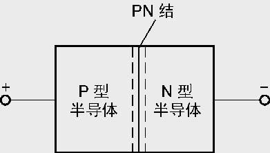

# 电信号

> 电信号是相当常用的信号，我们可以把各种信号都转化为电信号，这将方便我们进行后续处理。
>
> 对模拟信号进行处理的电路最基本的处理是**对信号的放大**。
>
> 模拟信号足够大才能数字化；数字信号想要驱动负载，也需要先转换为模拟信号并进行功率放大


## 课前概念

### 空穴

> 一个呈电中性的原子，其正电质子和负电电子的数量是相等的。当少了一个负电的电子，那里就会呈现出一个正电性的空位——空穴；反之，当有一个电子进来掉进了空穴，就会发出[电磁波](https://baike.baidu.com/item/电磁波?fromModule=lemma_inlink)——[光子](https://baike.baidu.com/item/光子?fromModule=lemma_inlink)。
>
> 空穴不是[正电子](https://baike.baidu.com/item/正电子?fromModule=lemma_inlink)，电子与正电子相遇湮灭时，所发出来的光子是非常高能的(即所谓的猝灭现象)。那是两粒子的质量所完全转化出来的电磁波能（通常会转出一对光子）。而电子掉入空穴所发出来的光子，其能量通常只有几个[电子伏特](https://baike.baidu.com/item/电子伏特?fromModule=lemma_inlink)。

电子在自由移动，周围电子可以填补一个空穴，同时在原位置产生一个新的空穴，因此实际上的电子运动看起来就如同是空穴在移动。


## 本征半导体

> 导电性介于导体与绝缘体之间的物质


```c
空穴：在晶体中，即其中的原子是十分有规律、整齐地排列着，其次是原子的核外电子容易受外界能量而脱离原子核的束缚成为自由电子，每有一个电子(带负电荷)离开原子核，就会在晶格中留下一个带正电荷的空位置，即空穴， 
```

空穴在原子排列不变时，数量和原子的数量有关，所以在下面的杂质半导体中通过控制各类电子不同的原子的比例，使得在原子总量相同的情况下形成不同的载流子分布情况。


## 杂质半导体

> 通过向本征半导体中导入其他微量杂质，改变其导电性能


由于在四价的硅或锗晶体中掺进了三价的铟或镓原子，这些原子和硅或锗的原子的化合键中就缺少了一个电子．这个缺位叫空穴．这样的材料叫P型半导体

```c
  相对于硅（或者锗）元素来说的。硅（锗）元素原子最外层有4个价电子。需要与其他原子的4个价电子形成共价键，达到8个价电子的稳定结构。
  如果，往硅中掺入少量磷，磷有5个价电子，用4个价电子与硅形成共价键，还“富余”一个电子，这一个电子，不参与形成共价键，可以自由“流动”，这种掺杂的硅（或者锗）就是N型半导体
```

- 不论是P型还是N型半导体,它们**本身是不带电的**，正电荷量与负电荷量相等，也就是保持电中性，区别只是载流子的浓度不同，P型中的空穴浓度大于自由电子浓度，而N型中自由电子浓度远大于空穴浓度，“P”表示正电的意思，取自英文Positive的第一个字母。“N”表示负电的意思，取自英文Negative的第一个字母。
- 空穴主要由杂质原子提供,自由电子由热激发形成。**掺入的杂质越多,多子(空穴)的浓度就越高,导电性能就越强**
- 多数载流子的浓度取决于掺入的杂质浓度，少数载流子的浓度则与温度有很大关系，温度升高，少数载流子增加，反向饱和电流增大。每升高10℃，反向饱和电流增加一倍

```c
在二极管中，如果给它加反向电压，反向电压在某一个范围内变化，反向电流（即此时通过二极管的电流）基本不变，好像通过二极管的电流饱和了一样，这个电流就叫反向饱和电流．其他器件中也有类似的情况． 　其根本在于PN结的单向导电性。　反向电流是由少数载流子的漂移运动形成的，同时少数载流子是由本征激发产生的
```


## PN结

> **PN结**：半导体材料一侧掺入受主杂质（提供空穴），另一侧掺入施主杂质（提供电子）所形成的结构称为PN结。
>
> **空间电荷区（耗尽层）**：p区空穴扩散出去后留下的负离子区与n区电子扩散出去后留下的正离子区的统称。名称由来：这地方只有固定的离子，载流子都没了。

注意，扩散运动实际只有电子的流动与转移。

正负离子的形成：原子会倾向于形成更稳定的结构，所以P区会尝试吸收电子补缺空穴，N区会尝试丢弃电子。


**扩散运动**

> 物质从高浓度向低浓度扩散，再P，N区的交界处由于两种载流子的的浓度差很大,故N区的电子会向P区扩散。

**漂移运动**

> 在内电场力的作用下，少子进行的漂移运动，自由电子在吸引下由P区前往N区。


```c
N型那边电势高，P型那边电势低，电场强度达到一定数值，将阻止电子继续向P型那边流动，达到了静电平衡。PN结具有单向导电性，是半导体的基础。
```

- PN结外加正向电压(正极在P区一端)时，扩散电流大于漂移电流，耗尽层变窄，PN结处于导通
- 外加反向电压时，扩散电流小于漂移电流，耗尽层变宽，阻止扩散运动，有利于漂移运动，形成漂移电流。由于电流很小，故可近似认为其截止。

**内电场**：是由P区空穴扩散到N区、N区自由电子扩散到P区，两区接触靠近P区的地方由于失去空穴产生负离子区；两区接触靠近N区的地方由于失去自由电子产生正离子区。正负离子区就形成了内电场。

```C
问：为什么少子对温度稳定性影响大？

答：多子原本就很多,因为温度升高新产生的多子相比原来几乎可以忽略.少子就不同了,由于温度升高得到能量新挣脱共价键出来的少子相比原来的少子不能忽略
    
问：为什么耗尽层变窄不利于利于漂移运动？
    
答：耗尽层变窄，正负离子区变窄，所以电荷数减少，电场力减少。对少子的牵引力减少，所以不利于少子的漂移运动
```


原理：

> 电源并不会提供电子，只会催动外部电子运动,原本是PN结无外接电源时内部电场平衡，扩散运动和漂移运动平衡，但是外接电源时该平衡被打破，扩散运动远大于漂移运动，大量自由电子和空穴涌入，打破了平衡。

**内电场正极在N区，负极在P区**

当我们加上一个正向电源时，在电势的催动下P区的空穴被正极排斥向PN结移动，N区的电子被正极吸引向PN结移动，使得靠近PN结的载流子浓度更高，由于密度更大，形成更窄的耗尽层，扩散运动更剧烈。

~~被催动的电子涌入PN结，电子从N区向P区涌动，一小部分与空间电荷区的正离子复合呈电中性，这也就相当于削弱了内电场；同时在外电场的作用下，P区晶格上的部分电子被推向N区，与空间电荷区的负离子复合呈电中性，这也相当于削弱了内电场。~~

当我们加上一个反向电源时，在电势的催动下P区的空穴向远离PN结的一端移动，N区的电子被正极吸引向远离PN结移动，使靠近PN结的载流子浓度更底，由于密度小，形成更宽的耗尽层，扩散运动减弱。

~~电子涌向P区，更多的N区电子被扯向P区，这样导致N区出现更多空穴，内电场加强。~~


### PN结的电容效应

> 结电容有两种，分别是势垒电容和扩散电容。[网址](http://www.yuankun24.com/Show/index/cid/16/id/2474.html)
>
> **势垒电容**：由空间电荷区两侧异号电荷所构成的电容称为势垒电容。
>
> **扩散电容**：当有外加正向偏压时，在 p-n 结两侧的少子扩散区内，都有一定的少数载流子的积累，而且它们的密度随电压而变化，形成一个附加的电容效应，称为扩散电容。
>
> **PN结的击穿**：当反偏电压达到一定值时，反偏电流会迅速增大，这一现象称为击穿。击穿的机理有齐纳击穿和雪崩击穿两种。

齐纳击穿的机理是重掺杂PN结的隧穿机制。在重掺杂条件下，p区价带与n区导带相距近，反偏电压可以轻易地使p区价带电子穿越到n区导带，形成击穿电流。

雪崩击穿的机理则是在高反偏电压下，高能量的电子撞击其他电子使载流子数量雪崩式增长的效果。雪崩击穿是PN结的主要击穿机制。


### 势垒电容

> **主要作用的是耗尽层的电荷**
>
> P区空穴多，N区电子多，因为扩散，会在中间形成内建电场区。N区那边失去电子带正电荷，P区那边得到电子带负电荷。


当给PN结加上稳定的电压，那么稳定后，内建电场区的厚度也会稳定为一个值，也就是说内部电荷一定。如果PN结上的电压向反偏的方向增大，那么内建电场区厚度也增加，即内部电荷增多。反之，如果电压减小，那么内部电荷减少。

这和电容充放电现象一样

PN结两端电压变化，引起积累在中间区域的电荷数量的改变，从而呈现电容效应，这个电容就是势垒电容。

```c
势垒电容对应二极管反接
```


**电容大小**


```c
势垒电容因而描述的是中间层的电荷数量的特点
```


**温度的影响**

温度升高时,PN结的正向电流增大、正向压降降低,即正向电流具有正的温度系数,正向压降具有负的温度系数;这主要是由于PN结的势垒高度降低所造成的结果


### 扩散电容

> **主要作用的是P，N区各自的少子**
>
> 事实表明，二极管在反偏时，势垒电容起主要作用，而正偏时，扩散电容起主要作用。下面看看扩散电容。
>
> 当有外加正向偏压时，在 p-n 结两侧的少子扩散区内，都有一定的少数载流子的积累，而且它们的密度随电压而变化，形成一个附加的电容效应，称为扩散电容。

当PN结加上正向电压，内部电场区被削弱，因为浓度差异，P区空穴向N区扩散，N区的电子向P区扩散




扩散的空穴和电子在内部电场区相遇，会有部分空穴和电子复合而消失，也有部分没有消失。没有复合的空穴和电子穿过内部电场区，空穴进入N区，电子进入P区。

进入N区的空穴，并不是立马和N区的多子-电子复合消失，而是在一定的距离内，一部分继续扩散，一部分与N区的电子复合消失。

显然，N区中靠近内部电场区处的空穴浓度是最高的，距离N区越远，浓度越低，因为空穴不断复合消失。同理，P区也是一样，浓度随着远离内部电场区而逐渐降低。总体浓度分布如下图所示。


外部电压稳定不变的时候，最终P区中的电子，N区中的空穴浓度也是稳定的。如果电压发生变化，比如正向电压降低，电流减小，单位时间内涌入N区中的空穴也会减小，这样N区中空穴浓度必然会降低。同理，P区中电子浓度也降低。所以，稳定后，存储的电子和空穴的数量想比之前会更少，也就是说存储的电荷就变少了


这也一个电容的特点，电压变化，存储的电荷量也发生了变化，跟电容的表现一模一样，这电容就是扩散电容了。

```c
扩散电容因而描述的是在P，N区内各自少子的数量变化特点
```


**电容大小**


扩散电容随正向偏压按指数规律增加。这也是扩散电容在大的正向偏压下起主要作用的原因


