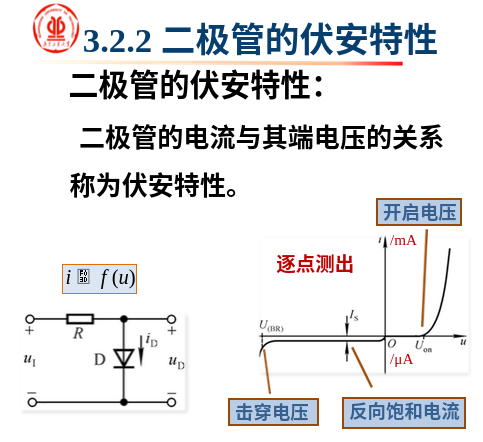

# 二极管

> 

P区引出的电极称为阳极，N区引出的电极称为阴极


**点接触型二极管**

> 结面积小的二极管，不能通过较大的电流。适合高频电路和小功率整流

电容靠充放电导通，电容越小，充电时间越短，所以可以通过高频。

- 结面积小的结电容小：电容公式`C=Es/4*pi k d`


**面接触型二极管**

> 相当于结电容和一个理想二极管并联，结面积大，结电容大，所以只能在低频率下工作，一般仅做整流管

**整流**

高频电路直接从电容过，低频只能从二极管过，形成直流。


**平面型二极管**

> 采用扩散法制成的二极管，结面积较大可用于大功率整流，结面积小的可作为脉冲数字电路的开关管


## 二极管伏安特性

> 二极管只有在正向电压足够大时，正向电流才从0随电压按指数规律增长。使二极管开始导通的临界电压称为**开启电压**（导通电压）。
>
> 当二极管的反向电压足够大时，反向电流为I~s~ 。



```c
硅二极管的正向导通电压约为0.6-0.7V，
锗二极管导通电压约为0.2-0.3V；硅二极管的反向耐压可以做得很高，锗二极管反向耐压则低得多；
硅二极管的反向漏电流很小，锗二极管的反向漏电流要大得多；
硅二极管的温度系数比锗二极管大，因为锗反向饱和电流小，少子少，所以受温度影响小。
```


## 等效电路

### 伏安特性的折线化

> 根据不同的需求选择合适的等效电路，等效程度越大越复杂。


```c
第一种等效电路在只设计二极管单向导通时使用
第二种在设计开启电压时使用，第二种更常采用
```


### 微变等效电路

> **直流源+小交流源**，小交流源即"微变"
>
> 此时等效为一个动态电阻


```c
rd = 导通电压/静态工作下的直流电流大小
```

- 为什么”微变“要强调“微”

交流电压会变，一个周期内二极管肯定会处于一段未导通的状态。这时二极管的变化就不能用动态电阻表示了


```c
//最大整合电流IF
最大允许通过的正向电流(最大平均值) 
    
//最大反向工作电压UR
加在二极管上的最大反向电压(最大瞬时值)
   
//反向饱和电流IR
即反向电流，由少数载流子的漂移运动形成
    
//最高工作频率Fm
因为PN结具有电容特性，所以频率过高会短路
```

- 为什么最大整合电流是平均值

二极管会"烧"，烧的过程是能量的累积，功的积累，所以是平均值

- 为什么最大反向工作电压是瞬时值

PN结会被击穿，击穿是瞬间发生的


### 判断二极管工作状态

> 当电路中有二极管时，因为二极管有导通电压限制，所以不能一下判断二极管的导通状态

判断方法

- 将所有二极管断路
-  判断各处二极管的电压差，找到电压差最大的一个二极管
- 将能够导通的第一个二极管导通，将其替换为等效电压源
- 再次判断电压差，导通能够导通的第二个二极管
- 直至结束


## 符号惯例


## 题目相关

### U~T~

> Ut是二极管在导通时两端的电压，当外加电压超过导通电压，PN结相当于一个阻值很小的电阻，也就是PN结导通。 

是一个温度电压当量，常温下UT=26mv(T=300K)

==最值得注意的是二极管导通后两端电压不是导通电压==


# 习题解析


> 注意电流源，虽然有5v电源，但是被电流源拦住了，此时左支路两端电压为导通电压VD。流过支路的电流u限定为2.5mA，所以对于右支路：`VD-(-2v) = VD2 + UR  `所以UR = 2


**Vo等与多少？**


> -15 -- Vo回路因为没有电流所以处处等势，Vo=-15v


> Vd导通的时候加在Uo的电压是 VCC-VD(导通电压) = 5.3v ,由于答案只有6所以选B
>
> 也可以对右边用基尔霍夫电压，此时电阻电压=2.3v  `Uo-UR-U=0`  Uo = 5.3v


> 1. 用静态工作点求ID  = （10-0.7） / R = 18.2mA
> 2. rd是二极管动态电阻 rd = UT / ID = 14欧
> 3. 先把二极管等效成电阻加电压源，再对右边回路等效成电阻 R1 = 14欧 // 5.1千欧 = 14欧  ； 然后交流分压 Uo = Ui x （14/(25+14)）= 0.359 x Ui
>
> 有效值就是Uimax * 0.359 / 1.414 = 2.5v

本题就是需要静态分析(注意UT)以及把动态电阻给并联等效电阻用上了


> 没仔细看题
