# 晶体管的结构及符号

> 大佬的全集笔记：https://blog.csdn.net/hanmo22357/article/details/124410080
>
> 知乎: https://zhuanlan.zhihu.com/p/355317399
>
> 希腊字母: *α、β、γ、δ、ε、ζ、ν、ξ、ο、π、ρ、σ、η、θ、ι、κ、λ、μ、τ、υ、φ、χ、ψ、ω*  


## 结构

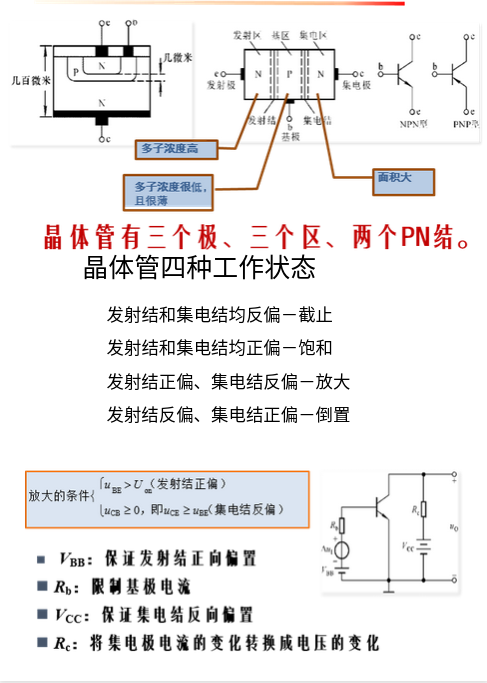

> ①晶体管是由**两个背对背的PN结**所组成的，全称为双极型晶体三极管（因为其同时存在两种极性的载流子，也就是电子和空穴），也被称为==三极管==。
> ②晶体管可以分为**小功率管、中功率管和大功率管**，这三种不同功率的晶体管可以通过外形来进行辨认（中功率三极管和大功率三极管都有孔便于安装散热器）。

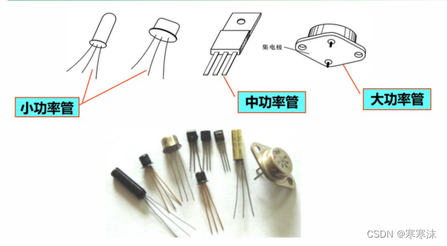

​         ~小功率管、中功率管和大功率管~

晶体管的发射区多子浓度高，基区多子浓度低且薄，集电区面积大。观察上图，大功率管头部 的一整片都是集电区


> ③晶体管可以分为**NPN型和PNP型**两种类型，可以通过电路符号指向区分：箭头都是由P区指向N区。两者的工作原理是相同的，唯一不同的在于使用时偏置电源的极性相反。在以后的学习中，默认晶体管为==硅材料的NPN型管==。

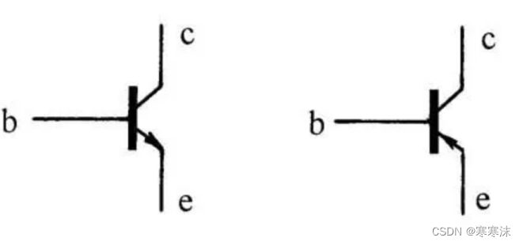

​          ~左边NPN型晶体管,右边PNP型晶体管~

 


> ④每一个晶体管都有发射区、基区和集电区三个区域，所对应的电极分别称为发射极、基极和集电极，两个背对背的PN结分别称为发射结和集电结。

(1) 基区很薄，==且掺杂浓度低==；

(2) ==发射区掺杂浓度比基区和集电区高得多==；

(3) 集电结的面积比发射结大。

两个PN结：处在发射区和基区交界处的PN结称为发射结；处在基区和集电区交界处的PN结称为集电结。

三个电极：从三个区引出的引脚分别称为发射极，基极和集电极，用符号e(Emitter)、b(Base)、c(Collector)来表示。

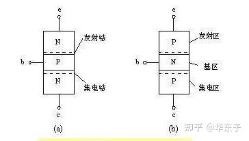

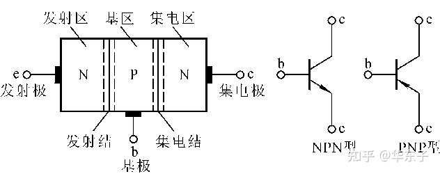


> ⑤发射区的掺杂浓度最高（多子浓度高）；基区的掺杂浓度低并且很薄（一般只有几微米）；集电区的面积很大。发射区和集电区由于掺杂浓度不同所以不能互换。由于基区很薄，因此两个PN结的工作会互相影响，而不是简单地将两个PN结进行串联


## 晶体管放大原理

因三极管三个区制作工艺的设定以及内部的两个PN结相互影响，使三极管呈现出单个PN结所没有的电流放大的功能。

> ①晶体管所能实现的放大功能是由内部结构和外部条件共同决定的。晶体三极管的放大外部条件为：
>
> 1.**发射结正偏**（是直流源VBB的工作，基极和发射极之间的电压需要大于发射结开启电压）
>
> 2.**集电结反偏**（是直流源VCC的工作，集电极的电位要高于基极的电位）。


> ②而基本原理电路中
>
> **直流电源Vbb**的作用是提供一个电压保证发射结正偏，
>
> **电阻Rb**是用于使信号有效和限制基极电流（任何PN结在正向偏置时都要用一个电阻限制电流大小防止PN结损坏）
>
> **直流电源Vcc**的作用是保证集电结反偏（要求Vcc的电动势比Vbb高）
>
> **电阻Rc**的作用为将集电极电流的变化转换成电压的变化

**为何需要基极电流**

- 放大变化

由于三极管BE结的非线性，基极电流必须在输入电压大到一定程度后才能产生(对于硅管，常取0.7v)。当基极与发射极之间的电压小于0.7v时，基极电流就可以认为是0。

但实际中要放大的信号往往远比0.7v要小，如果不加偏置的话，这么小的信号就不足以引起基极电流的改变(因为小于0.7v时，基极电流都是0)。我们需要事先在三极管的基极上加上一个合适的电流(叫做偏置电流，图中那个电阻Rb就是用来提供这个电流的，所以它被叫做基极偏置电阻)，那么当一个小信号跟这个偏置电流叠加在一起时，**小信号就会导致基极电流的变化**，而<u>基极电流的变化，就会被放大并在集电极上输出</u>。 

- 信号有效化

是输出信号范围的要求，如果没有加偏置，那么只有对那些增加的信号放大，而对减小的信号无效(因为没有偏置时集电极电流为0，不能再减小了)。而加上偏置，事先让集电极有一定的电流，当输入的基极电流变小时，集电极电流就可以减小;当输入的基极电流增大时，集电极电流就增大。这样<u>**减小的信号和增大的信号都可以被放大**了</u>。

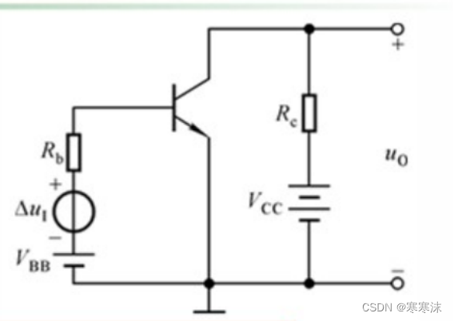


> ③载流子的运动过程（以NPN型晶体管为例）：原理图如下所示。

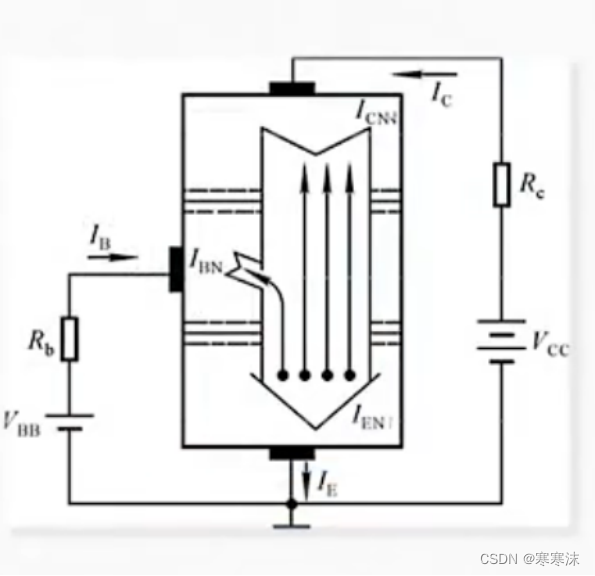

1. 首先在直流电源Vbb的作用下，由于发射区多子浓度高，并且加上正向电压Vbb后发射结导通，因此大量电子从发射区通过扩散运动运动到基区产生大量“非平衡少子”。扩散运动形成==发射极电流 I~E~==

2. 因为基区薄且多子浓度低，因此扩散到基区的电子只有极少数与空穴进行复合运动。复合运动形成==基极电流I~B~==

3. 因为集电区面积大，因此在外电场作用下大部分扩散到基区的电子都通过漂移运动来到集电区。复合运动形成==集电极电流 I~C~==

```c
注意，集电极电流Ic的形成原因是少子的漂移运动，在基极和集电极形成的PN结中，形成Ic的电子一部分是基极的电子，因为数量少称为平衡少子；另一部分是从发射极扩散来的大量电子，因为数量多称为非平衡少子。二者都是少子，所以集电极电流Ic的形成原因仍是是少子的漂移运动。
    //或者从漂移运动定义出发，漂移运动就是指少子的运动
```


上述的运动是晶体管中载流子运动的主要部分。


## 三极管放大的条件

> 发射结正偏， u~BE~ > U~on~；
>
> 集电结反偏，u~CB~ >= 0  ，也就是 u~CE~ > u~BE~


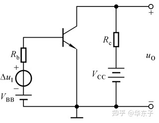

三个电流的关系：  

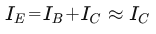

 发射极电流I~E~等于基极电流和集电极电流之和。因为基极电流比较小(解释在下面)，有时候可以近似认为集电极电流等于发射极电流。

直流电流放大系数  ：

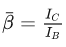

交流放大倍数： 

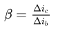


> ④发射极的电流是由于扩散运动产生，基极的电流由于复合运动产生，集电极的电流是由漂移运动产生。
>
> **基极电流可忽略**：尽管基区的多子，也就是空穴在电压Vbb的作用下也会向发射区发生扩散运动，但是由于其<u>浓度低</u>，因此其对整体的影响可以忽略不计。
>
> **集电区空穴漂移电流可忽略**：集电区的平衡少子（空穴）也会参与向基区的漂移运动（产生的电流记为Icbo），但是同样可以忽略不计。
>
> 在近似情况下，发射极的电流I~E~=集电极的电流I~C~+复合电流I~B~。由于一般情况下输入回路中的复合电流(<u>就是基极电流I~B~</u>)都很小，而**输出回路中的集电极电流一般都较大**，因此就实现了晶体管的放大功能。


> ⑤**穿透电流Iceo**=（1+直流电流放大系数）×Icbo，**穿透电流是指晶体三极管基极未加正向偏压或开路时,集电极到发射极间的反向截止电流**。其中Icbo是指输入回路断开时输出回路中的反向电流的大小（也就是上一段所说的<u>集电区中空穴向基区的漂移运动产生的电流</u>），称为集电结反向电流，集电结反向电流受温度影响很大。
>
> 直流电流放大系数在一定范围内可以视为一个常数，数值一般在几十到几百之间。而Ic=Ib×直流电流放大系数+Iceo，由于Iceo很小（一般和Ib同等数量级），因此在近似计算中，一般认为Ic=直流电流放大系数*Ib。


## 晶体管共射输入特性和输出特性

> 共射电路是指晶体管的输入回路和输出回路都使用了相同的发射极。信号由**三极管基极和发射极输入，从集电极和发射极输出**。因为发射极为共同接地端，故命名共射极放大电路。

特点

1、输入信号和输出信号反相；

2、有较大的电流和电压增益；

3、一般用作放大电路的中间级。

4、共射极放大器的集电极跟零电位点之间是输出端，接负载电阻

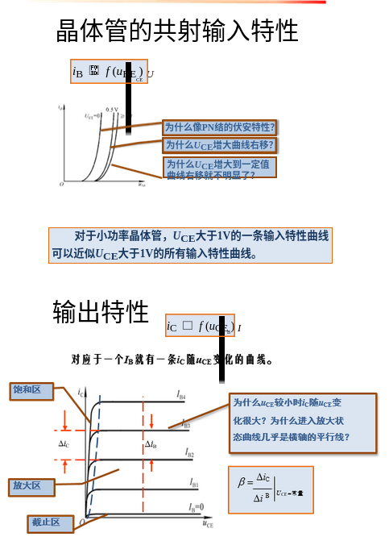

### 共射输入特性

晶体管的共射输入特性是指在输出回路电压Uce确定的情况下，输入回路电流Ib随输入回路电压Ube的变化

> 1. 当UCE = 0时，相当于集电极与发射极短路，即发射结与集电结并联。因此，输入特性曲线与PN结的伏安特性类似，呈指数关系。
> 2. 当UCE增大时，曲线将右移。

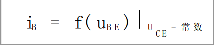

```c
//晶体管为什么像pn结的伏安特性
	因为这是发射结的伏安特性,发射结也是PN结(当Uce为零时，相当于发射极和集电极连接在一起，可以直接视为一个PN结)
    
//三极管输入特性曲线为什么随UCE增大会向右偏移       
    Uce电压增大，外加电场增大。抢电子的能力增强，发射区向集电区的自由电子的漂移增多。而发射区向基区的自由电子漂移减少，基极电流Ib减少，表现在图像上就是输入特性曲线右移。
    另一种理解是，Uce电压增大，抢电子的能力增强，基极电流想要达到原来的值就需要增大自己抢电子的能力。
        
//为什么Uce增大到一定值曲线右移不明显？
    基极电流ib是由发射极扩散到基极的电子与空穴复合形成的；uce越大，抢的电子越多，到最后uce大于1V的时候，能把绝大部分的电子都弄走
```

**曲线**

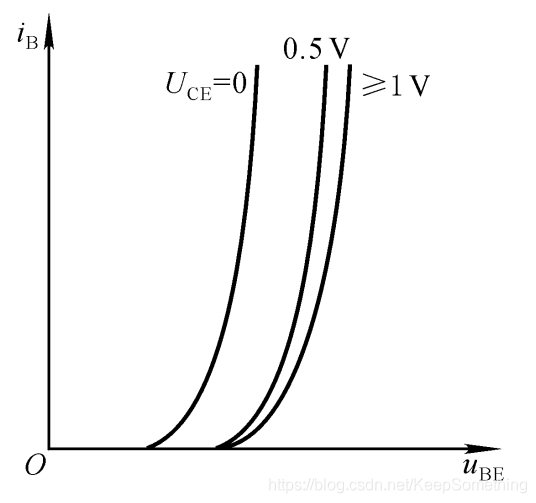

**对于小功率晶体管，UCE大于1V的一条输入特性曲线可以近似UCE大于1V的所有输入特性曲线。**


### 共射输出特性

输出特性描述的是当输入回路中的电流Ib一定时，输出回路中的电流Ic随输出回路中的电压Uce的变化

> 对于每一个确定的I~b~,都有一条曲线，输出特性的一族曲线。
>
> 1. 截止区：发射结电压小于开启电压，且集电结反向偏置。(**发射极不给电子**)
> 2. 放大区：发射结正向偏置且集电结反向偏置。(Uce能把绝大部分的电子都弄走)
> 3. 饱和区：发射结与集电结均处于正向偏置。(Uce打不过输入回路电压Ube；Uce因为抢不到绝大多数电子，所以随大小变化抢到的电子数目波动大)

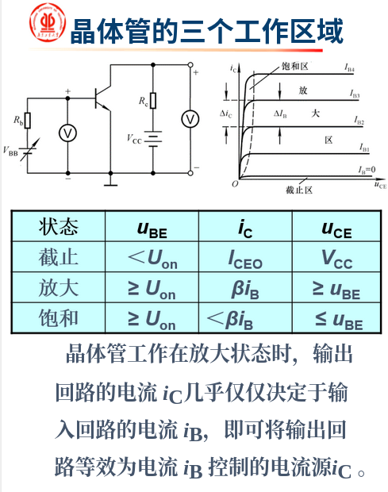

```c
//为什么当Uce很小的时候，Ic会随Uce变化那么大
	因为这时晶体管处于饱和状态，集电结和发射结都正偏，很小的集电结电压变化即可引起很大的集电极电流变化。
    /*这是因为发射极参杂浓度高的原因造成的，由于P区和N区参杂浓度不一样(发射极远大于其他两个极)，造成这种只需要很小的电压变化就会产生很大的电流变化，即电流的放大作用*/
```

**曲线**

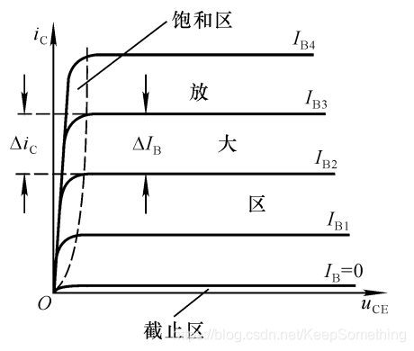

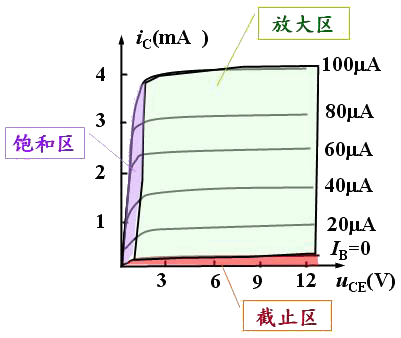


对于上图Ic基本上仅仅取决于Ib而不随Uce改变的区域称为放大区，表现为横轴的平行线（**对于放大电路中的晶体管，希望其能长期处于此状态**）；

Ic随Uce迅速变化的区域称为饱和区（曲线的左侧）；Ib=0以下的区域称为截止区。<u>工作在饱和区和截止区的三极管就没有放大能力了</u>


**关于饱和区**

饱和即指电流饱和，ic=βib关系是固定的，那么当βib大于icmax后，ic不能再增大来满足对ib的β倍放大，此时就处于饱和状态。


我们在使用晶体管时要确保β小于临界饱和线的β，否则Ic即使最大也达不到工作区。

```c
//集电极电压和什么有关
当直流工作电压Vcc和集电极上的电阻Rc确定后，集电极电压只与集电极电流IC的大小有关，而集电极电流受基极电流控制，所以最终三极管的集电极电压由基极电流决定。
    //我们知道计算ic电流的方法是Vcc减去集电极电压Uc后除以输出电路的电阻。那么通过计算就可以知道最大的ic（当Uc最小时）。
```

[其他极电流](https://www.elecfans.com/d/1159493.html) 


**如何退出饱和区**

饱和区是被一条斜线与放大区分割点，为什么是一条斜线？因为ic有一个最大值，<u>Uc和β不变下减小ib或减小集电极电阻来增大Icmax</u>，则又可以满足关系式ic=βib了，表现在输出曲线上减小后的ib与原来的ib在一条斜线上。


**关于集电极电阻**

首先集电极上的电阻Rc是固定不变的，它和三极管的输出电压Uce密切相关： Uce=Vcc-Ic*Rc

当流过集电极的电流增大时，电阻上的电压随着通过电阻电流的增大而增大，所以三极管集电极电位(三极管输出电压)反而降低，这也是<u>共发射极电路输出电压与输入电压反相的原因</u>

```c
对于三极管输出电阻ro，三极管内部的输出电阻rce可忽略，所以ro=Rc（Rc为集电极电阻）。所以，输出电阻应该是ro
```


**总结**

怎么看输出曲线图：因为最终三极管的集电极电压由基极电流决定，所以从Ib开始


1. 固定Uce，先看基极电流Ib变化，观察不同高度的Ib曲线
2. Ib变化导致ic=βib，Ic变化，观察纵坐标Ic的变化
3. Ic变化导致Uce分压减小，Uce变化，观察纵坐标Uce变化
4. 确定坐标点，判断在哪个区

```c
/*例子*/
//加大Ib进入饱和区
假设初始点在Uce初始在临界饱和线上，先固定横坐标Uce，从Ib2到Ib4(Ib4>Ib2)，纵坐标Ic升高。Ic升高会导致集电极电阻分压增大，集电极电压Uce减小到Uce‘，沿着Ib4曲线按横坐标反方向减小到相应Uce‘。显然地此时坐标点位于饱和区
    
//减小Ib离开饱和区
假设初始点在Uce初始在饱和区稍靠近内临界饱和线,先固定横坐标Uce，从Ib4到Ib42(Ib4>Ib2)，纵坐标Ic下降。Ic下降会导致集电极电阻分压增大，集电极电压Uce升高到Uce‘’，沿着Ib2曲线按横坐标反方向增大到相应Uce‘‘。显然地此时坐标点位于放大区
```


### 其他共路电路

> 共集、共基、共射指的是电路，是三极管电路的连接状态而不是三极管。所谓“共”，就是输入、输出回路共有的部分。其判断是在交流等效电路下进行的。
>
> 共集电极电路----三极管的集电极接地，集电极是输入与输出的公共极； 
> 共基极电路----三极管的基极接地，基极是输入与输出的公共极； 
> 共发射极电路----三极管的发射极接地，发射极是输入与输出的公共极。

另外一个更快的分辨方法是：==去掉信号输入端,从哪边往外取信号,就是共另外一边的极==。或者，在交流等效电路中哪个极接地就是共哪个极。（共xx电路就是将信号（或者电位）的参考点设在xx处，它一般也是交、直流的共用参考点。）


共射电路

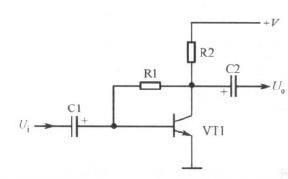

共集电路

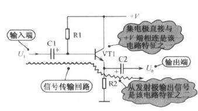


共基电路

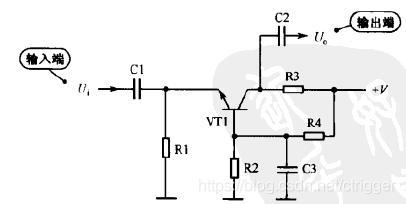


### 温度对晶体管特性的影响

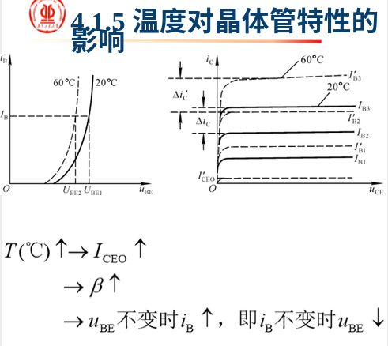

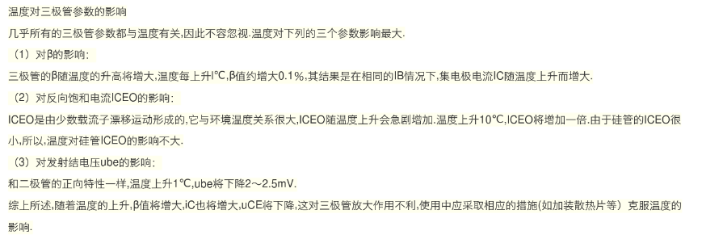


## 一些概念

- Uces：饱和电压

三极管处于饱和状态时Uce就是Uces，此时发射结和集电结都处于正偏，导电性好，电流大。这是输出电流Ic只取决于外电路参量

硅管通常取0.3v