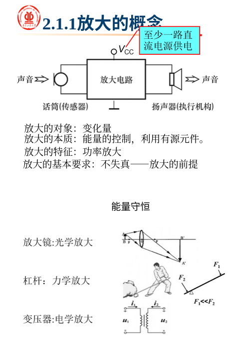
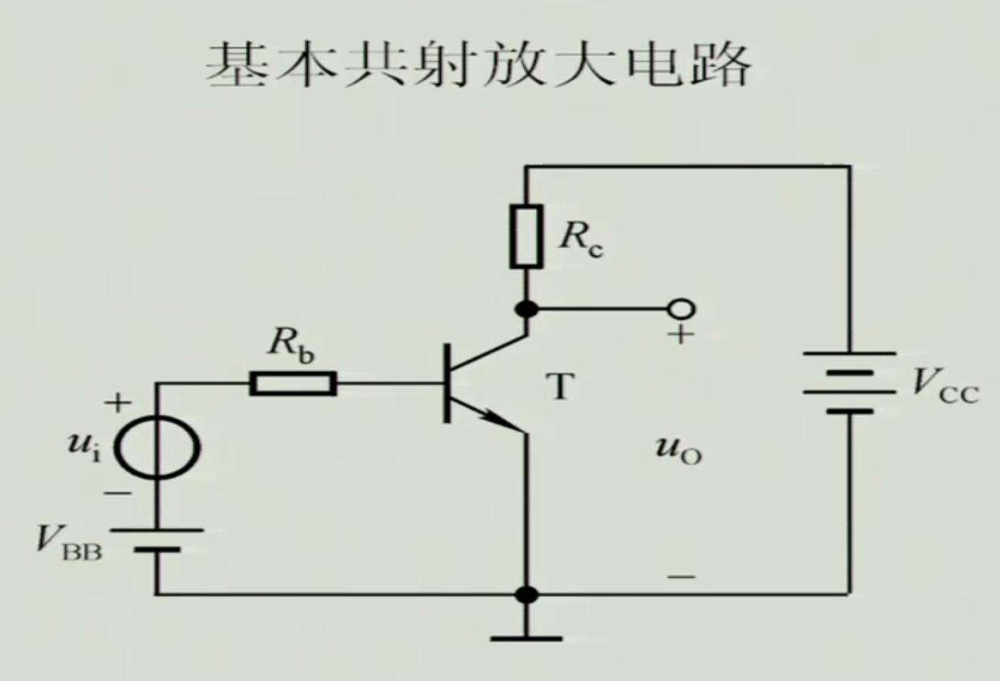
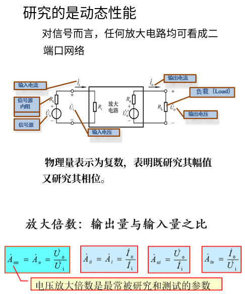
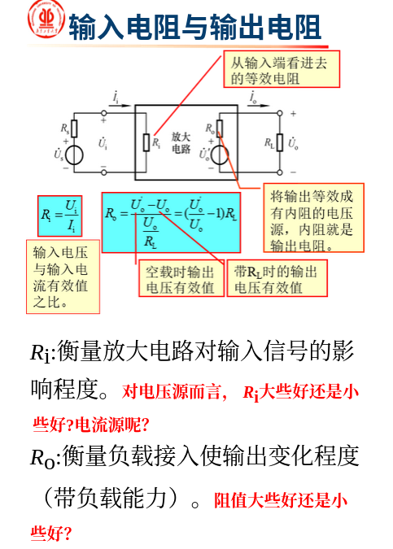
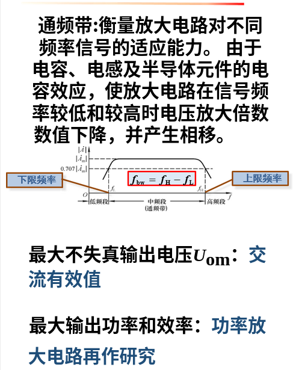

# 放大的概念

> 放大是对模拟信号最基本的处理。
> 放大的对象: **变化量**（输入信号为零时称放大电路处于静态，反之为动态），常用通频带内的正弦波信号作放大电路的测试信号（任何信号都可以分解为若干正弦波的叠加）
>
> 放大的本质: **能量的控制与转换** 利用有源元件（能够控制能量的元件）实现，通过一个直流电源供电将小的能量转化为大的能量；
>
> 放大的特征: **功率的放大** 也就是信号源的提供的是小功率而负载上获得的是大功率，这也使判断电路能否放大的出发点；
>
> 放大的基本要求: **不失真** 失真是指三极管在其工作周期内不完全处于放大区。




## 基本工作原理

### 各元件的作用



- 晶体管

是核心元件，起放大作用

- 基极直流电源Vbb

使发射结电压大于开启电压，与基极电阻配合提供合适的直流基极电流

- 集电极直流电源Vcc

与Vbb打对抗，使集电结反偏，是输出回路的工作电源，形成集电极回路电流，也是负载的能源

- 集电极电阻Rc

将集电极电流的变化转换为电压的变化，使电路对电压有放大作用


**问题**

1. 放大电路中的输出电流是由有源元件提供的吗？

错，是由电源提供

```c
有源元件：需要电源来呈现其特性的元件(三极管)
无源元件：不需要电源呈现特性的元件(电阻，电感，电容)
```


### 静态工作点

> 当输入信号为0(交流电源短路)，晶体管各极电流Ib，Ic和b-e间电压Ube，管降压Uce称为放大电路的静态工作点；
>
> 常将Q点记作I~BQ~ , I~CQ~ , I~BEQ~ , I~CEQ~
>
> - 常取U~BEQ~ 为已知量，锗管为0.1～0.3V ，硅管为0.6～0.8v

不设置静态工作点会导致变化的信号在一个交流周期内电压因为小于开启电压Uon而工作在截止区，使输出电压严重失真，输出电压也毫无变化。


 Q 点不仅会影响电路是否会产生是真，还会影响着放大电路几乎所有的动态系数。


## 放大电路的性能指标

> 放大电路的性能指标研究的是动态性能，其主要包括放大倍数、输入电阻和输出电阻、通频带。



对于任何信号而言，任何放大电路均可用视为一个二端口网络，两个端口分别是输入端口和输出端口。对于输入端口，有带内阻的信号源、输入电压和输入电流等物理量；对于输出端口，有输出电流和输出电压等物理量（这些物理量均用复数表示，表示要同时研究幅值和相位）


- 放大倍数

放大倍数是**输出量和输入量之比**，根据电流电压组合有四种情况，其中我们最关心的是

输出电压和输入电压的比值Auu（电压放大倍数）

电流放大倍数（输出电流和输入电流之比）

互阻放大倍数（输出电压和输入电流之比）

互导放大倍数（输出电流和输入电压之比）


## 输入电阻和输出电阻



- 输入电阻

输入电阻是从输入端进行观察的等效电阻：由于输入端口的电压和电流可以测出，因此==输入电压和输入电流的有效值之比==就是输入电阻；

- 输出电阻

输出电阻是将输出等效为有内阻的电压源，而电压源的的内阻就是输出电阻。输出电阻的计算公式为：(U/U0-1)*Rl，其中U表示空载时输出电压的有效值，U0表示有负载时输出电压的有效值，Rl为负载的电阻大小。输入电阻和输出电阻是为了解决电子电路相互连接时产生的影响而引入的概念


**电阻大小**

1. 输入电阻越大越好吗？

输入电阻Ri影响获取信号的能力

```c
对于信号源是电压源时，输入电阻大好，输入电阻越大，信号源就能更多分压在放大器上，不被信号源内阻消耗掉，可以放大更微弱的信号
对于信号源是电流源时，输入电阻小好，输入电阻越小，信号源分流到输入电阻就越大。
```

2. 输出电阻越小越好吗

```c
输出电阻越小，输出电流越大，带动负载的能力越强。
如果输出电阻足够小，则输出电压恒定为一值，这时电路就越稳定。
```


- 注意

在现实生活中，因为信号源自身的特性，所以只能作为电压源或电流源，而不能等效变换。


## 通频段

> 通频带（中频段）用于衡量放大电路对不同频率信号的适应能力。因为放大电路中往往存在电容、电感以及半导体元件，使得放大电路在频率太高或太低时放大倍数下降并产生相移。使得放大倍数下降到0.707倍的频率分别称为称为下限频率和上限频率，上下频率之间即为通频带。



还有最大不失真输出电压Uom（用交流有效值表示）以及最大输出功率和最大输出效率等性能指标。目前我们所研究的都是小功率的放大电路。

