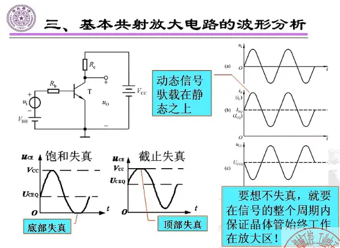

# 基本共射放大电路各元件的作用与工作原理

各元件与静态工作在上一节已有所涉及

> 共射放大电路：输入回路与输出回路的公共端是发射极的放大电路
>
> **VBB、Rb**：使得Ube>Uon，并提供合适的基极电流IB;
>
> **Vcc**：使Uce>=Ube,保证晶体管处于放大状态,同时作为负载的能源；
>
> **Rc**：将△ic转换成△Uce（uo）。
>
> 动态信号的转换:△ui→ib→ic→△URc→△Uce（uo)


## 设置静态工作点的必要性

> 如果不加直流电压**VBB**，输出电压必然失真。


一、静态工作点

> 当信号源输入电压为零时（输入信号短路为零），晶体管各极的电流电压称为静态工作点Q。Q点包括四个物理量，分别是两个电流Ibq和Icq以及两个电压Ubeq和Uceq。

       放大电路的静态工作点中,UBEQ硅管通常取值0.7V，锗管0.2V。

二、为什么要设置静态工作点

       放大电路的最基本要求，一是不失真，二是能够放大。 


### 波形分析



> ①　只有设置合适的静态工作点，使交流信号驮载在直流分量之上，以保证晶体管在输入信号的整个周期内始终工作在放大状态，输出电压波形才不会产生非线性失真。
>
> ②　共射放大电路中输出电压与输入电压反相（输出电压要与集电极电阻分压）

```c
驮载：交流信号加上直流分量得到的值
```


**两种失真**

对于NPN型三极管的共射接法

- 饱和失真

  是指当信号源产生的电压很大时，Ube变得很大，因此产生很大的Ib，由此又产生很大的Ic，因此在Rc上就产生了很大的电压，甚至大于Vcc，使得输出电压为零但是小不下去的情况，此时晶体管工作在饱和状态，产生底部失真；

- 截止失真

  是指当信号源产生的电压很小时，Ube变得很小，由此产生的Ib也很小，又由此产生很小的Ic，因此Rc上几乎没有压降，导致所有的压降都在输出电压上，甚至达到了Vcc但大不上去的情况，此时晶体管工作在截止状态，产生顶部失真。并非所有电路的底部失真都是饱和失真，也不是所有电路的顶部失真都是截止失真。


**如果是PNP型三极管会有什么不同？**


## 电路的组成原则

### 合适的静态工作点

> ①　必须根据所用放大管的类型**提供直流电源**，以便设置合适的静态工作点，并作为输出的能源。
>
> ②　电阻取值得当，与电源配合，使放大管有**合适的静态工作电流**。
>
> ③　输入信号必须能够**作用于放大管的输入回路**。
>
> ④　当负载接入时，必须保证放大管输出回路的**动态电流能够作用于负载**，从而使负载获得比输入信号大得多的信号电流或信号电压。


### 实用放大电路要求

> ①　共地：为防止干扰，常要求输入信号、直流电源、输出信号均有一端接在公共端，即地。
>
> ②　直流电源种类尽可能少。
>
> ③　负载上无直流分量。


### 两种实用放大电路

- **直接耦合放大电路**：共地、只用一个直流电源

> 满足了上述的①，②的两个要求的放大电路
>
> 直接耦合是级与级连接方式中最简单的，就是将后级的输入与前级输出直接连接在一起，一个放大电路的输出端与另一个放大电路的输入端直接连接的耦合方式称为直接耦合。
>
> **放大对象**：直接耦合放大电路既能对交流信号进行放大，也可以放大变化缓慢的信号;
>
> **可集成性**：由于电路中没有大容量电容，所以易于将全部电路集成在一片硅片上，构成集成放大电路.
>
> [链接](https://www.elecfans.com/analog/20100813221684.html)


1.左边是理论电路，不实用，存在如图所述的问题。

```c
关于理论电路没有共地的说明：这里判断信号源与放大电路共地不共地时，不要采用交流通路，因为我们实际运行时是需要驼载在静态之上的，因此这里信号源负端由于接在Vbb正极，所以和放大电路不共地。
```

2.右边为改进后的实用直接耦合放大电路，在直接耦合放大电路中，要驼载在静态电压之上，那么静态电压只能存在电阻器中，因此Rb1起到<u>存静态电压</u>的作用

```c
电阻Rc ，Rb的作用都是偏置
电阻Rb1的作用则是存压和隔离
    //存静态电压：Ui = 0时会让基极被短路，信号源一端放一个电阻可以分压。
    //隔离：隔离偏置电压和信号源电压，防止偏置电压直接加在信号源一端。
```

3.在右边电路中，静态时，信号源为0，相当于短路，VCC经过Rb2过来的电流一部分流过Rb1，一部分流过管子的BE两极，因为是并联，Rb1两端电压和管子BE两端电压相等

4.由戴维南定理得，动态时，BE间电压是信号源电压和Rb1上电压之和

```c
//电流
Ibq=流过Rb2的电流-流过Rb1的电流。
```


**缺陷**

交流损失：因为Rb1是电阻，电阻要分压，所以交流信号会被分压一部分而损失

直流分量：流经R~C~ 的电流会流过 R~L~电阻，负载会得到一部分直流分量


- **阻容耦合放大电路**：去除负载上的直流分量 

  > 满足了上述的①，②，③的两个要求的放大电路
  >
  > 耦合电容的作用：隔离直流信号、通过交流信号。 
  >
  > 在电路输入回路和输出回路中分别加入两个耦合电容，由于电容具有隔直流通交流的功能，因此将其中一个电容置于负载分路上以隔绝直流分量，另一个电容置于信号源的传输线处替代原有的电阻以避免直流损失。这两个电容的容量应该足够大，使得对于交流信号近似为短路（作用是隔直流通交流）。在静态时，C1和C2上的电压分别是Ubeq和Uceq


**二者区别**


阻容耦合放大电路能够解决直接耦合电路的问题（即输出中存在直流信号并且有交流损失），但是具体什么情况下使用什么电路需要具体问题具体分析。如果信号源的频率很低，则可能使用阻容耦合放大电路造成的能量损失更多，此时就应该选择直接耦合放大电路