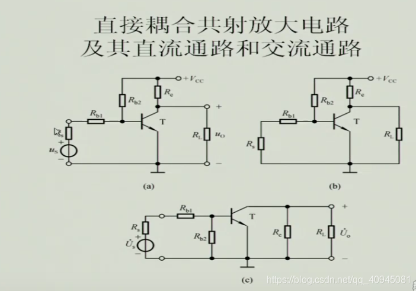
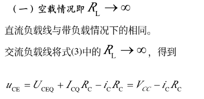
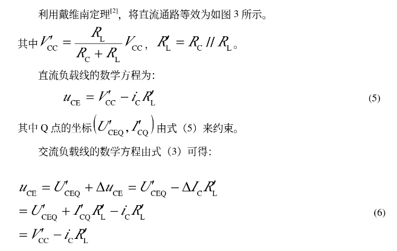
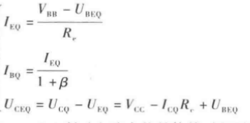
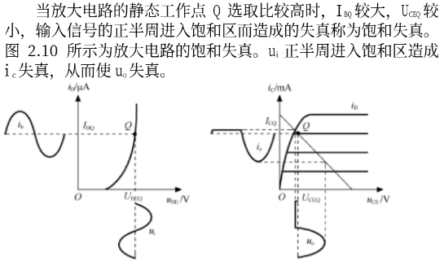
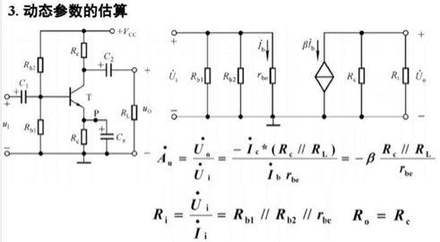

# 放大电路的分析方法

> [链接](https://wenku.baidu.com/view/c92b4ac2866a561252d380eb6294dd88d0d23d69.html)
>
> 希腊字母: *α、β、γ、δ、ε、ζ、ν、ξ、ο、π、ρ、σ、η、θ、ι、κ、λ、μ、τ、υ、φ、χ、ψ、ω*  
>


## 直流通路与交流通路

> 任何的放大电路一定存在直流电源和交流信号两个要素，这就使得电路的分析复杂化。放大电路的直流通路和交流通路就是用于简化放大电路的分析的，直流通路用于解决静态工作点的问题，而交流通路用于研究动态参数变化。但是实际电路中是无法将直流通路和交流通路分开的。


### 直流通路

> 在直流电源作用下直流电流流经的通路

①电容视开路：电感对直流电阻非常小

②电感视短路：电容对直流电抗非常大

③信号源置零（但内阻保留）


```c
保留内阻：信号源内阻可能影响到电路的静态工作点
```

I~BQ~ = (V~BB~ - U~BED~) / R~b~

I~CQ~ = βI~BQ~

U~CEQ~ = V~cc~ - I~CQ~ R~C~


### 交流通路

>  在输入信号作用下交流信号流经的通路

①电感视为开路：电感对交流电抗非常大

②电容视为短路：电容对交流电抗非常小

③电源置零：直流源电阻为0，两端电压不受交流影响，可视为导线


I~BQ~ = (V~CC~ - U~BED~) / R~b~

I~CQ~ = βI~BQ~

U~CEQ~ = V~cc~ - I~CQ~ R~C~


**细说**

1. 基本共射


```c
交流通路：为什么(b)可进行转换？
    //交流通路直流源相当于短路，输出回路里的负载和Rc由Vcc下的串联变成Ui下的并联
```


2. 直接耦合



```c
交流通路：为什么(c)把Rb2移动到那里去了？
    //看下图分析，RB处就是上图Rb2，RB在Vcc短接后接地
```


3. 阻容耦合


## 分析方法

> 图解分析法：分析非线性电路常用方法，既能分析静态也能分析动态
>
> 静态工作点估算法： 计算放大电路的静态工作点（I~BQ~  I~CQ~  U~CEQ~）
>
> 微变等效电路分析法：主要用于放大电路的动态分析


### 图解法

> 根据输入信号，在三极管的特性曲线上直接做图求解

步骤

1）在ic、uce平面坐标上作出晶体管的**输出特性曲线。**

2）根据直流通路列出放大电路**直流输出回路的电压方程**
式：==U~CE~ = V~CC~ - I~C~ x R~C~==

3）根据电压方程式，在输出特性曲线所在坐标平面上作直
流负载线。因为两点可决定一条直线，所以分别取（I~C~=0，U~CE~=V~CC~）和（U~CE~=0，I~C~= V~CC~/R~C~）两点，这两点也就是横轴和纵轴的**截距**，连接两点，便得到直流负载线。

4）根据直流通路中的输入回路方程求出I~BQ~

5）找出I~B~= I~BQ~这一条输出特性曲线，该曲线与直流负载线的交点即为Q点（静态工作点），该Q点直观地反映了静态工作点（I~BQ~、I~CQ~、U~CQ~）的三个值。即为所求静态工作点的值。


1. 输入回路

输入回路方程： V~CC~ = i~B~R~B~ + u~BE~

 （一定一定要记住）


白色线是输入回路方程，红色线是二极管的输入特性曲线

所以交点为静态工作点Q

注意白色线与坐标轴的交点，到时候要使静态工作点移动就是移动**RB和VCC**了


2. 输出回路

输出回路方程：V~CC~ = i~C~R~C~ + u~CE~


白色线是输出回路方程，红色线是晶体管输出特性曲线

所以交点为静态工作点

同样要注意白色线与坐标轴的交点。


在放大电路中，总是i直流和交流源同时作用。==当我们计算**静态工作点**时需要使用直流通路；而当我们计算**电压放大倍数，输入电阻和输出电阻**时则要使用交流等效电路。==混淆直流和交流通路的应用会得出错误的答案。


下面展示一个例子


**输入电压**

> 就是当前电路的输入电压，需要时可以考虑内阻


**输出电压**

> 当前电路输出的电压，可以考虑负载电阻！


**电路的电压放大倍数**

> A~U~ = β(Rc // R~L~) / r~be~

分析动态等效电路可以得到输入，输出两个回路。输入电流经过Rb ， rbc并联产生的电压是输入电压；集电极电流流经Rc，R~L~ 并联产生的电压是输出电压。二者相除得到放大倍数	

图中信号源有内阻，此时实际电压方法倍数应该为`Aus = Au (Ri / （Ri + Rs）)`


**输入电阻**

> Ri = Rb // r~be~   其中r~be~ 是基极和发射极电阻，在题目中未提及则可忽略

输入电阻是放大电路自身的参数，与信号源内阻无关，但输入电阻与负载有关。

通常公式为 U~i~ / I~i~


**输出电阻**

> Ro = Rc

输出电阻是放大电路自身的参数，与负载电阻无关

通常公式为 U~o~ / I~o~


#### 最大不失真电压Uom

> 放大电路的最大不失真电压是在不失真的况下能够输出的最大电压(有效值),用 U~om~ 表示


因为失真有截止失真和饱和失真，所以相应的U~om~ 需要对两个失真比较，更小的那个才是U~om~ 实际值


上图中，

Uces：饱和电压，硅管通常取0.3v

饱和失真的最大不失真电压：U~om1~ = (U~CEQ~ - U~CES~) / 2^0.5

截止失真的最大不失真电压：U~om2~ = (V~CC~ - U~CEQ~) / 2^0.5

实际的电压输出曲线是横轴下方的曲线

实际的电流输入曲线是斜线右边的Ib曲线


#### 优缺点

> 优点：
>
> - 适用于静态工作点Q,失真的求解(输入输出由实测得到，贴合实际)
> - 适用于大幅值信号作用下的动态电路分析(例如功率放大电路的U~om~)
>
> 缺点：
>
> - 作图繁琐，不宜于求放大倍数A~u~
> - 只适用于电路中频段分析(图解法不考虑耦合电容，晶体管极间电容)

有了直流负载线和交流负载线后，利用图解法可方便地分析放大电路的波形非线性失真和最
大不失真输出电压等问题


**阻容耦合放大电路分析**


对交流通路分析，发现在有负载的情况下实际负载电阻是 Rc // R~L~ ,加在Rc两端的电压Uc不在由Rc而是并联的电阻决定的，所以U~CE~ 的变化是沿着交流负载线移动：


> 交流方程的[推导](http://www.chinaaet.com/article/120568)首先利用欧姆定理求Uce
>
> 
>
> 之后算出并联阻值
>
> 
>
> 因为电路输入是直流分量加交流分量，所以把交流量、直流量和总的瞬时量之间的关系△ic=Ic+ic，△uce=Uce+uce代入式(1)
>
> 最后得出交流负载方程
>
> ```c
> 纵坐标用△ic而不是Ic是因为ic电流驮载在Ic上
> 因变量是△uce是因为动态变化的只有△uce，Uce是静态的
> ```
>
> 
>
> 
>
> **对于上面“交流负载方程用公式推导如下”一图，其中的u~ce~ 就是交流分量**

```c
为什么直流，交流负载线都过同一个Q点？
    //Q点只与偏置电阻有关，一旦电路确立，电路输入的静态电流Ib就不变，并且Q点就不移动(除非环境改变)
    //在本电路中，Rb起限制基极电流的作用，所以Rb是偏置电阻
```

随着R~L~ 电阻的增大，交流负载线的斜率会下降，特别是当空载时与直流负载线重合




**直接耦合放大电路分析**


带负载时：



空载时：


//————————//

直流负载线方程：


直接耦合放大电路的直流负载线和交流负载线重和，斜率相同。


### 静态工作点估算法

> （也称近似计算法）

1) 画出放大电路的直流通路. 
2) 由直流通路列出输入回路和输出回路方程，求I~BQ~  I~CQ~  U~CEQ~


### 等效电路法

> 晶体管是一个非线性元件，如果能用一个线性电路等效晶体管就能够方便分析了。
>
> 因此将电路元件用其交直流等效模型代替,并通过电路方程求解相应的信号变量输出。
>
> [链接](https://wenku.baidu.com/view/162e19f930d4b14e852458fb770bf78a65293a83.html)

等效电路绘制的流程

- 找到b,e,c点在哪，比如共x极则x极接地
- 从输入进入，判断先到达哪个极，把点点出来
- bec遵循b-e-c结构，画输入回路，be间放rbe， ce间放电流源
- 输出从e的另一端出发，画输出回路


**直流等效模型**
晶体管的输入可以等效为一个直流电源，而集电极电流可视为电流I~BQ~控制的电流源

在这里我们使用二极管等效一个PN结，所以输入特性曲线呈一条直线


#### 晶体管的h参数等效模型

```
如果输人信号较小．动态工作点在一个小范圈内摆动．晶体管的特性近似于线性．那么我们就可以用一个有源线性四端网络来代替晶体管，把包含晶体管的非线性电路转化为线性电路，就可以运用线性电路的计算方法来分析晶体管放大器．晶体管的交流等效电路有多种模型．对于不同场合，其等效模型不同，这是因为根据不同要求，对晶体管的参数进行了不同的取舍和近似的结果．
在低频小信号交流电路中所适用的是h参数等效电路， h参数是一种混合参数，其物理意义明确，在低频范围内为实数，因此使用较为方便
```


1.h 参数定义

> 在推导晶体管输入和输出 回 路方程中 ， 引 出 四个 h参数， 下面分别讨论它们的意义 .


（ 1 ）**h~11~** 短路输入阻抗 h ie ：在晶体管的输出电压 u CE 恒定时，输入电压的变量 Δu BE与输入电流变量 Δi B 之比， 称为晶体管的短路输入阻抗 h ie
```c
短路输入阻抗 h ie 的物理意义:表明了输入电压 u BE 对输入电流iB的控制能力,它的单位为欧姆， 小功率管的 h ie 约为10^2 至 10^3 Ω.
    //输入的动态电阻
```

（ 2 ） **h~21~**短路电流放大系 数 h fe ： 在晶体管的输出交流短路时， 输出电流的变量 Δi C 与输入电流变量 Δi B 之比， 称为晶体管的短路电流放大系数 h fe 
```c
短路电流放大系数 h fe 的意义:表明在负载为零的输出交流短路的情况下，晶体管对电流的放大能力 .
    //电流放大系数
```

（ 3 ）**h~12~**开路电压反馈系数 h re ： 在输入电流恒定时， 输入电压的变量 Δu BE 与输出 电压的变量 Δu CE 之比， 称为 晶体管的开路电压反馈系数 h re 
```c
这里说的开路条件， 是指输入端交流开路， 即 Δi B = 0 或 i b =0． 通常晶体管的内反馈很小， h re 远小于 1 ， 约为 10^-4 ， 并且是个无因次的量 
    //基极电流为常量时Uce对Ube的影响，即输出回路电压对输入回路电压的影响.
```

（ 4 ）**h~22~** 开路输出导纳 h oe ： 在输入电流恒定时，输出电流的变量 Δi C与输出 电压的变量 Δu CE 之比,称为晶体管的开路输出导纳 h oe
```c
h oe 反映了输出电压对输出电流的控制能力
    //集电极动态电流Ic与管降压Uce之比，动态电导
```

==在晶体管的四个微变量参数中,具有不同的单位，性质各不相同，称为混合参数， 简称 h 参数==


```c
电路UT是指三极管发射结正向压降，也就是死区电压（也称门槛电压），硅晶体管约为0.5V，锗管约为0.2V。这是一个阈值，所以实际加的电压可以大一些
    
为什么Ut通常是固定地或变化极微？
    //观察输入特性曲线，如果以Ib为因变量变化，随着Ib增加到一定值后再继续增大，Ube变化会非常微小
```


#### 基本共射

**等效电路**

通过以上参数可绘制等效电路电路


由于晶体管工作在放大区时，Uce对输入特性曲线影响很小，内反馈h12可忽略

r~ce~ 通常在几百千欧以上，，r~ce~ 上的电流也可忽略(交流通路rce是被并联的，并联大电阻可忽略)

最后得到图(b)


静态工作点


#### 基本共集

电路


直流/交流通路


**静态分析**


```c
为什么Ibq中式子下面用(1+β)？
    //观察输入-Rb-Re-接地的通路，Rb，Re的电流是不等的。我们于是以Re为基准，用等效电阻Rx来描述Re处的电阻，因为Re流过大电流Ie，等效下Rx流过的是小电流Ib。所以进行相应扩大Rx = (1+β)Re.
    //相应的在后面如果是流过小电流但等效为大电流，则除以(1+β)
```


**动态分析**

交流等效电路

> 按照上面的步骤列出绘制过程
>
> - 共集则c先接地
> - 输入回路：输入从b进入，流过be(rbe)后流入接地
> - 输出回路：根据b-e-c结构，ec间加入电流源，在e的另一侧流出，通过Re


```c
放大系数的计算中也类似采用等效，即把Ib扩大(1+β)
```


**共集放大特点**

- 由于(1+β)Re >> (Rb + rbe)，U~0~ 约等于 U~i~ ,所以电路有电压跟随特性，即放流不放压

- 输入电阻大，达到几十，几百千欧
- 输出电阻小，几十欧


#### 基本共基

电路图


交流通路


静态工作点


动态参数


#### 三种电路对比

(1) 共射电路既能放大电流又能放大电压，输入电阻居三种电路之中，输出电阻较大，频带较窄。常作为低频电压放大电路的单元电路。

```c
1、输入信号与输出信号反相；
2、有电压放大作用；
3、有电流放大作用；
4、功率增益最高（与共集电极、共基极比较）；
5、适用于电压放大与功率放大电路
```

(2) 共集电路只能放大电流不能放大电压，是三种接法中输入电阻最大、输出电阻最小的电路,并具有电压跟随的特点。常用于电压放大电路的输入级和输出级，在功率放大电路中也常采用射极输出的形式。

```c
1、输入信号与输出信号同相；
2、无电压放大作用，电压增益小于1且接近于1，因此共集电极电路又有“电压跟随器”之称 ；
3、电流增益高，输入回路中的电流iB<<输出回路中的电流iE和iC；
4、有功率放大作用；
5、适用于作功率放大和阻抗匹配电路。
6、在多级放大器中常被用作缓冲级和输出级
```

(3) 共基电路只能放大电压不能放大电流，具有电流跟随的特点；输入电阻小，电压放大倍 数、输出电阻与共射电路相当，是三种接法中高频特性最好的电路，常作为宽频带放大电路。

```c
1、输入信号与输出信号同相；
2、电压增益高；
3、电流增益低（≤1）；
4、功率增益高；
5、适用于高频电路。
共基极放大电路的输入阻抗很小，会使输入信号严重衰减(输入电阻小，抢到的信号源的电压也就小)，不适合作为电压放大器。但它的频宽很大，因此通常用来做宽频或高频放大器。在某些场合，共基极放大电路也可以作为“电流缓冲器”（Current Buffer）使用。
```

共基虽然也能较大增益地放大电压，但是输入信号衰减严重。它的运用还是主要体现在特点上：宽频放大器


**静态分析**




**动态分析**

交流等效电路


```c
为什么输入电流ic是从左向右，方向不是反了吗？
    //注意ic是交流，交流驮载在直流IEQ之上。记得之前我们研究方向的是合电流IE，IE=IEQ+ic,所以实际上合电流还是从右往左的。
```


**共基放大特点**

- 由于输入Ie < 输出ic,所以无电流放大作用，或者说电流跟随。但是有电压放大能力且输入输出同相位
- 输入电阻小，几十欧
- 输出电阻较大，和共射电阻差不多，都是Rc
- 根据计算电压放大倍数Au与β基本无关,所以即时增加频率导致β减小，电压放大倍数也几乎不变，所以适合作为==宽频带放大电路==

```c
为什么频率增加β减小？
    //原因很多，但主要是晶体管本身的电容和寄生电容的影响。

    //影响最大的是输入端电容（寄生电容也将通过密勒效应而使输入端电容增大）；当频率升高时，容抗降低，使得输入信号被短路到地，从而晶体管起不到放大作用——放大信号的能力下降。这也是造成晶体管电流放大系数在高频时降低的主要原因；并从而使得晶体管具有所谓截止频率（fα，fβ）和特征频率ft。 
    
特征频率ft：
    //晶体管工作频率超过一定值时，此时的晶体三极管进入饱和状态，集电集电流不随基极变化而变化，共发射极电流放大倍数开始下降，当共发射极电流放大倍数下降为1时，它所对应的频率叫做特征频率。当晶体管工作频率等于特征频率是晶体管，就完全失去了电流的放大功能
截止频率fβ：
    //由于存在势垒电容和扩散电容，所以随着信号频率的增高，其阻抗下降；当阻抗的大小降低到不能吸收或只能吸收很少的信号能量时，该管即达到了最高的工作频率——截止频率
    //是当β下降到0.707的频率。截止频率比特征频率要高一些。
    
```


### 实际理解

对于我们分析电路时的情况，我想用通俗一点的方法理解


(1)直流通路分析是做题的第一步，我们将直流通路画出并等效


输出电路在红叉处断开，通过<u>串连分压的方式先得到其两端电压Vcc'</u>是Rc, R~L~ 串联回路里R~L~ 的分压，接着在输出回路里，由于电流<u>从集电极流入该等效电路，Rc 与 R~L~ 并联</u>，故等效电阻为R~L~' = Rc // R~L~ 。

输入回路：是Rb2，Rb1与发射极并联体串联的一段，即(a)右图中上部分的左边和下部分的组合部分。期间要考虑到静态导通压Ubeq的存在，故加在Rb2的电压是Vcc - Ubeq。

得出输入，输出回路的电流电压情况后就可以算出集电极电流Icq：

- 首先因为Icq是对Ibq的放大，所以先算Ibq，lbq是对Rb2处电流的分流，先利用加在Rb1两端的Ubeq算出Rb1一路的电流，得到流过基极的电流Ibq = I~Rb2~ - I~Rb1~ 这样乘以放大系数后就得到了放大后的电流。

- 接着是集电极电位，由公式 Uceq = Vcc' - R~L~' Icq 。对于为什么要等效，这个等式就是答案，如果不等效那就要同时考虑 Rc ， R~L~ ，这是不方便的，等效之后就可以直接使用我们最熟悉的公式。


### 随手小记

- 回路电压：还记得Uce = Vcc - Rc 这个公式吗，这是对输出回路使用基尔霍夫电压定律的结果，Uce是集电极到发射极的电压，也就是Uc - Ue；相应的在输入回路那里就是Ube了，也就是Ub - Ue，这是一个跨度的概念
- 三极管电流方向：Ic约等于Ie，话是这样描述的，对于NPN型和PNP型而言，都是大小满足是：Ie = Ib + Ic ， 不过==在NPN中是Ic和Ib流入管子，Ie流出管子；PNP型中是Ic和Ib流出管子，Ie流入管子。==这个式子是绝对满足的，在放大状态时，额外满足Ic = (1 + β)Ib

- Vcc驱动电压：NPN分析中加在集电极一端的Vcc还记得吧？它的作用是为集电结增加一个反向偏置，让集电结形成大的耗尽层来牵引大量电子。PNP也类似，不过Vcc是加在发射结一端的，PNP的基极电压把集电结导通后，大量电子涌入，加在发射结的Vcc让发射结反偏形成大的耗尽层来牵引这些电子。这就是现象了

  **总结** ：Vcc的作用是偏置(防止be，bc处于同一种偏置，同一种偏置会导致饱和/截止)

- 发射结电压未满足导通电压，如果减小Rb那可以导通(消除截止失真)吗？

```c
截止的晶体管，也就是整个输入回路没有导通，根本就没有电流，Rb上没有分压，全部的电压都落在Ube上也没能使晶体管导通。这样无论Rb是否分压都无法导通
```


## 电路参数对静态工作点的影响

### 基极电阻R~b~

> 通过影响基极电压和基极电流进而影响静态工作点


**非线性失真**

> 分为截止失真和饱和失真两种，两种失真前文有所提及，现在继续讲述

- 饱和失真

情况是Q过高时，I~C~ 无法满足对过大 I~B~ 的放大



```c
消除饱和失真在于减小基极电流或者增大Ic上限，方法即是增大Rb或减小集电极电阻
```

在图像上，即Q点沿直线向下移动。(麻麻的，刚在晶体管结构分析中得出看输出u曲线图的方法结果现在就教了我做直流负载线来找交点的方法...)


- 截止失真

情况是Q过低时，Ib太小无法满足发射结的导通电压


```c
消除截止失真的方法是，增大基极电流，即减小Rb
```

在图像上，即Q点沿直线向上移动。


### 集电极电阻R~C~

> R~C~ 的变化仅改变直流负载线的斜率


公式：U~CE~ = V~CC~ - I~C~ x R~C~   公式中Rc与斜率相关

```c
集电极电阻小的时候，随Ib增大Q点靠近饱和区的速度就越缓慢(斜率高),主要是因为Rc小。Uce分压更大，驱动能力更高，Ic上限也就越高
```


### 直流源Vcc

> Vcc不仅影响I~BQ~ ,还影响直流负载线。


公式：U~CE~ = V~CC~ - I~C~ x R~C~   公式中Vcc与截距相关

```c
Vcc小的时候，随Ib增大Ic更容易接近饱和区，这也反映了Vcc小，驱动负载的能力也变小
```


## 静态工作点的稳定

> 温度等因素会影响静态工作点，如何保持Q点稳定是值得讨论的


稳定Q点：既然温度升高Ib会增大，那么我们可以让电路在温度升高时限制Ib：


### 典型电路

#### 原理

> 增加一个分压电阻Re，其最大的作用就是能够以自身的变化带动I~BQ~ 的变化

带动过程：

首先需要保证 `I1 >> IB1` 此时I1 约等于 I2

温度升高分子活动剧烈，使Ic升高， 因此Re部分分压增大，U~E~处电势增大。由于U~B~ = I1 x Rb1,I1基本不变所以U~B~不变。故U~BE~ = U~B~ - U~E~减小，I~B~ = U~BE~ / rbe减小，所以Ic减小


```c
Rc也能分压为什么要加Re？
    //Rc设定后不会影响到Ib，它的电流和Ib汇聚成的Ie才是因变量，所以在Ie的通路上添加电阻Re，Re关键在于能够影响Ubeq。
    如果没有Re，对于左下角回路有基尔霍夫电压：Ub1 - Ube = 0 Ibq增大不影响I1，那么Ube也不会受影响。加上Re后则 Ub1 - Ube - Ue = 0。
```


**注意**

Re值越大，反馈越强，Q点越稳定

Re值如果过大，导致Uc基本不分压，管子饱和

- 优点：放大稳定性
- 缺点：会损失放大倍数


**动态参数估算**

加了旁路电容：



```bash
Rb1//Rb2如何选择？
	#
为何加旁路电容Ce？
	#旁路电容：一般接在放大器的输入端或输出端，用来滤除一些不需要的交流干扰，也有用来给有用的交流信号提供一个交流通道，使其不受衰减
如果没有Ce，交流等效电路有何不同？
    #
```

没加旁路电容


### 热敏电阻补偿

> 利用热敏电阻阻值随温度变化的特性来抵消漂移现象
>
> 热敏电阻的温度系数可分正负，表示随温度升高阻值升高/降低


### 二极管补偿

> 利用二极管反向饱和电流随温度变化而变化的特点来反馈补偿


### 压控补偿

> 利用可变直流源反馈补偿


**分析**


```c
rD为什么下降？
    //首先复习以下二极管动态电阻计算：rd = UT / I ，其中UT是固定的，那么大小和流过的静态直流电流大小有关，V增大时根据基尔霍夫电压和I=U/R，流过二极管电流增大，故二极管阻值减小。
    //因而二极管会分到更多电流
```


# PNP与NPN区别

> https://www.dgjs123.com/bandaoti/24752.htm
