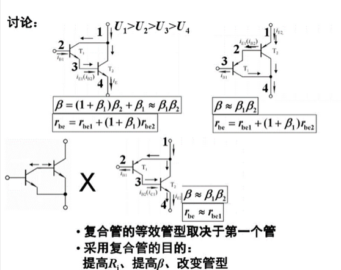

# 多级放大电路

> 单个三极管通常无法满足放大的需求(例如Au = 10^4,Ri = 2M,Ro = 100)，那么我们采用多个晶体管来进行多次放大
>
> 希腊字母: *α、β、γ、δ、ε、ζ、ν、ξ、ο、π、ρ、σ、η、θ、ι、κ、λ、μ、τ、υ、φ、χ、ψ、ω*  
>


## 复合管





复合管放大电路


## 耦合方式

> 多级放大电路，其实也是由多个单个三极管构成的，把单个三极管放大电路进行级联，就能组成多级放大电路。
>
> **放大电路每级之间怎么进行连接？**这里就涉及到“耦合方式”，**耦合方式**是指多级放大电路各级之间的连接方式。
>
> 多级放大电路常用的耦合方式主要有三种：**阻容耦合、变压器耦合、直接耦合。**


### 直接耦合

> 在直接耦合中，前一级的集电极电阻也是后一极的基极电阻


**优点**

直接耦合最大的优点就是可集成化，它克服了后面两种耦合方式(阻容，变压器)的无法集成化，也不能传送变化缓慢的信号的缺点，它直接将前级的输出端直接或者通过电阻接到后一级电路的输入端。

直接耦合的放大电路既能传送交流信号，又能传送直流信号，也便于集成化，**所以，实际的集成运算放大电路中，通常是直接耦合的多级放大电路。**


**缺点**

直接耦合方式带来的缺点是各级之间的直流通路相连，所以**静态工作点会相互影响**。

为了使直接耦合的两个放大电路能正常工作，就要解决各级都要有合适的静态工作点的问题，如果解决不好，直接耦合会使静态工作点的缓慢变化<u>逐级传递和放大</u>。

直接耦合放大电路由于各级静态工作点相互影响，所以它的分析、计算、调试会比较麻烦，会比前面两种耦合电路要复杂。


**注意**

- 在多级放大电路中，由于各级之间是互相串联起来的，前一级的输出就后一级的输入，**多级放大电路总的电压放大倍数等于各级电压放大倍数的乘积**。


~这点是我们需要知道的，多级放大电路总的电压放大倍数是相乘，不是相加。~

- Q点相互影响是一个需要辨证看待的问题，一方面相互影响的Q点可以放大变化缓慢的信号，而另一方面微小的噪声也会被一起放大，给分析带来困扰


#### 零点漂移

对于一个高质量的直接耦合放大电路，要求它除了要有很高的电压放大倍数之外，还要零点漂移也比较低。

> **零点漂移**：如果一个直接耦合放大电路输入端对地短路，并调整电路，使输出电压也为等于零，理论上来说，输出电压应该一直保持不变，但实际上，输出电压将离开零点，缓慢地发生不规则的变化，这种现象就叫做零点漂移

- 零点漂移形成

  直接耦合式放大电路的各级的Q点是相互影响的，由于各级的放大作用，第一级的微弱变化(由于一些原因使输入级的Q点发生微弱变化现象，一般是由**温度**变化造成)，会使输出级产生很大的变化。

- 零点漂移后果：

  在漂移现象严重的情况下，往往会使有效信号“淹没”，使放大电路不能正常工作。因此，必须找出产生零漂的原因和抑制零漂的方法


- 如何抑制零点漂移

(1)选用高质量的硅管硅管的ICBO要比锗管小好几个数量级，因此目前高质量的直流放大电路几乎都采用硅管

(2)在电路中引入直流负反馈，稳定静态工作点

(3)采用温度补偿的方法，利用热敏元件来抵消放大管的变化。补偿是指用另外一个元器件的漂移来抵消放大电路的漂移

(4)采用调制手段，调制是指将直流变化量转换为其他形式的变化量(如正弦波幅度的变化)，并通过漂移很小的阻容耦合电路放大，再设法将放大了的信号还原为直流成份的变化(该法成本高)

(5)受温度补偿法的启发，人们利用2只型号和特性都相同的晶体管来进行补偿，收到了较好的抑制零点漂移的效果，这就是差动放大电路。


#### 稳压二极管

[链接](https://blog.csdn.net/weixin_43772512/article/details/125453058)

> 稳压二极管，其又被称为齐纳二极管。
>
> 其在电路中起**稳定电压**的作用。**利用二极管被反向击穿后，在一定反向电流范围内反向电压不随反向电流变化一特点进行稳压的**。
>
> 与普通二极管最大区别即是其主要**工作在反向击穿状态**下。

- 稳压管的反向击穿是可逆的
- 电流过大会造成稳压二极管热击穿


主要参数

- **稳定电压Uz**
   稳压管反向击穿后稳定工作时的电压值称为稳定电压。

- **稳定电流Iz**
   稳压管反向击穿后稳定工作时的反向电流称为稳定电流。稳压管允许通过的最大反向电流称为最大稳定电流，使用稳压管时，工作电流不能超过，一般按大于2倍输出电压来设计；

- **动态电阻Rz**
   稳压管在反向击穿的曲线工作时,电压变化量 △u 与电流变化量 △i 之比称为动态电阻，动态电阻越小说明稳压性能越好；

- **额定功耗Pz**
   由芯片允许温升决定，它的额定值为稳定电压 Uz 和允许最大电流 Izm 的乘积。

- **温度系数α**
   稳压管的温度变化会导致稳定电压发生微小变化，因此温度变化1℃所引起管子两端电压的相对变化量即是温度系数，温度系数越小越好，说明稳压管受温度影响很小。


**区分正负极**

1. 借助放大镜或者显微镜来进行区分 


认色带，**带色带等明显标记的即为二极管负极**，同时在PCB焊盘上，负极也往往会用竖线标记起来。

2. 万用表测量
    将万用表拨至二极管档位
    将红黑表笔接触至二极管两端，当万用表显示0.3-0.6左右的数值时，此时黑表笔接触的一端为二极管的负极，红表笔接触的一端为二极管正极。

、


### 阻容耦合

> 下图所示电路就是一个阻容耦合方式连接成的一个多级放大电路，电路的第一级和第二级之间通过电容相连接。


```c
为什么难集成？
    //大容量的电容器很难集成到集成电路中，所以阻容耦合电路不适合运用在集成的放大电路。
```

**优点**

阻容耦合方式的主要优点是，由于前后级放大电路是通过电容相连接，所以<u>各级之间的直流通路是相互断开的，各级的静态工作点之间**互不影响**</u>。如果电容容量足够大，那么在一定频率范围内，输入信号是可以几乎无衰减的传送到后一级电路的。


**缺点**

但是，阻容耦合方式的缺点也很显著，因为电容有“隔直”的作用，所以直流成分不能通过电容器，其次，**电容器对变化缓慢的信号也会有比较大的阻碍作用**，所以当变化缓慢的信号通过电容时会造成比较大的衰减。


### 变压器耦合

> 变压器能够将信号转换成磁能的形式进行传送，所以所以变压器也能作为多级放大电路的耦合元件来使用。
>
> 如下图所示就是一个变压器耦合放大电路，变压器T1将第一级的输出信号传送给第二级，变压器T2将第二级的输出信号传送给负载。


**优点**

**变压器耦合放大电路的重要优点是具有阻抗变换作用**，因而可以应用在分立元件功率放大电路中；另外，电路前后级是通过磁能来实现耦合，所以各级之间的静态工作点相对独立，互不影响。

阻抗变换：当负载阻抗和传输线特性阻抗不等，或两段特性阻抗不同的传输线相连接时均会产生反射，会使损耗增加、功率容量减小、效率降低；只要在两段所需要匹配的传输线之间，插入一段或多段传输线段，就能完成不同阻抗之间的变换，以获得良好匹配。


**缺点**

变压器耦合的缺点在于，**低频特性差，不能放大变化缓慢的信号**，直流信号也无法通过变压器；而且变压器比较笨重，**无法集成化**。


# 重点难点及题型


## 课堂习题

> 问以下电路想要使右下角的U1k电压减小


**本题注意点**

- VT2是PNP型三极管，基极电流是从基极口流出的，与NPN相反
- 扩展点：UCE(UBC)类似一个池子，其他电阻分到电压后剩下的都给了UBC；如果RC，RL电流增大想要更多的电压那就向UBC取


**选项A**

> 很明显Ic不变情况下减小电阻，有U=IR，Uc2减小，正确


**选项B**

> 与选项c分析是一类的。 减小Rb，基极电流增大，则Ic = βIb也增大，URC1增大，Rc1下方分路处的电势Ux降低，在这一瞬间第二级电路的输入端口电UBE不变，那么基极电势差（E点电势高于Ux）就相应增大，基极电流Ib2增大。
>
> 基极电流增大，则流过Rc2的电流增大，Uo=I * RC2 增大，故不符合

此时URe2也会增大，同时UBC会减小

注意“在这一瞬间第二级电路的输入端口电UBC不变“这句话，实际上当基极电流u变化后UBE也会随之变化，这是一个启动的过程


**选项C**

> 减小Rc1，基极电流不变，URC1减小，Rc1下方分路处的电势Ux升高，在这一瞬间第二级电路的输入端口电压UBE不变，那么基极电势差就相应减小，基极电流Ib2减小。
>
> 基极电流减小，则流过Rc2的电流减小，Uo=I * RC2减小，正确

- 用老师的并联法思考

URC1减小，右端与URC1并联的一段（Re2与Ube）电压也减小，因为**IRC1电流减小说明基极电流减小**（IRC1是由基极电流决定的），IRC2=Ib * β也减小，Uo减小

此时两个电阻RC1，RC2电压都小了，多的电压分到了UCE上！

这个思路也能分析选项B

```c
老师的方法是用结果推基极电流，我的是先推基极电流再推结果
```


**选项D**

> 流过发射极的电流是由基极电流和放大倍数决定的，基极电流变化导致Ie变化，让Re2两端电压变化。
>
> 改变Re2不会影响上面两个选项说的“**基极电势差**“，不过奇怪的是会改变基极电流，我觉得应该是Ub