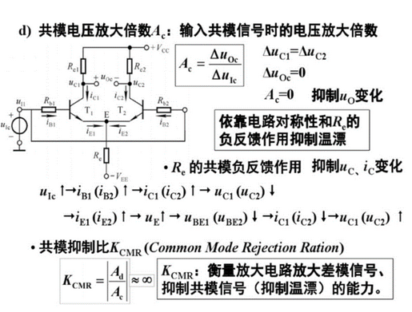
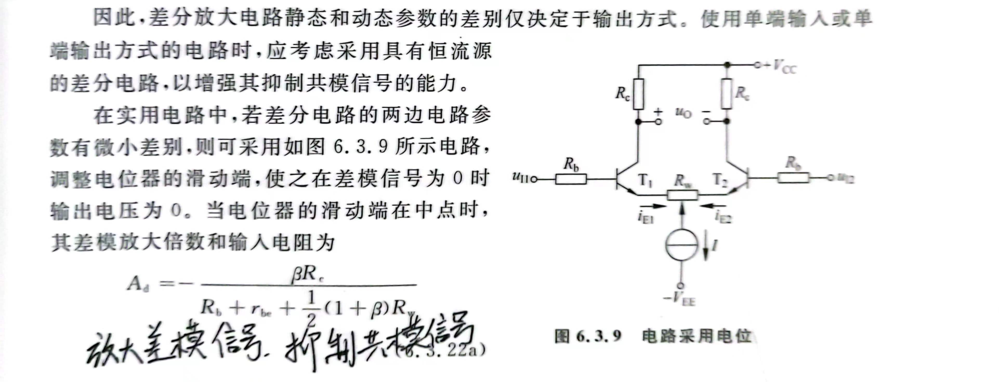

# 集成运放

> 
>
> 希腊字母: *α、β、γ、δ、ε、ζ、ν、ξ、ο、π、ρ、σ、η、θ、ι、κ、λ、μ、τ、υ、φ、χ、ψ、ω*  

集成运放是==直接耦合多极放大电路== (联想到直接耦合容易集成的特点了吧)


## 集成的问题：零点漂移


> 主要是温度的影响，导致电压的微小变化被多极放大


**差分放大电路**

```c
差分放大电路又称为差动放大电路，当该电路的两个输入端的电压有差别时，输出电压才有变动，因此称为差动。差分放大电路是由静态工作点稳定的放大电路演变而来的。
```


## 差分放大电路

> 差分放大电路利用电路参数的对称性和负反馈作用，有效地稳定静态工作点，以放大差模信号抑制共模信号为显著特征，广泛应用于直接耦合电路和测量电路的输入级。
>
> 差分放大电路:
>
> 按**输入输出方式**分:有双端输入双端输出、双端输入单端输出、单端输入双端输出和单端输入单端输出四种类型。
>
> 按**共模负反馈的形式**分:有典型电路和射极带恒流源的电路两种。


### 电路组成

#### 长尾式差分电路

> 一个实用的设计是长尾式差分电路，如图所示，这个电路可就厉害了，它可以：
>
> 单端输入，单端输出，放大倍数是普通共射放大电路的1/2倍。
>
> 单端输入，差分输出，放大倍数是普通共射放大电路的1倍。
>
> 差分输入，单端输出，放大倍数是普通共射放大电路的1倍。
>
> 差分输入，差分输出，放大倍数是普通共射放大电路的2倍。


```c
这个电路之所以强大，是因为当温度变化时，产生了△Ube，但是它通过引入一个恒流源补偿△Ube，从而使Re两端的电压保持不变，这样流过Re的电流也不变，导出流过Rc的电流不变，最终输出的Vo不变。
```


```c
//为什么强调一个对称性？
  因为外部温度，电磁辐射等等的干扰使得传输发生变化，但是这些干扰对这条导线的干扰和它对这条导线附近导线的干扰是一样的。
  利用这个特点，我们用两个导线传输信号，一条导线传输我们要传输的信号1010，另一条导线传输和他相反的信号0101，在接收端，我们把这两个信号做差，那么就会接收到1 -1 1 -1这样的信号，再通过电平转换或其他的手段就可以恢复出1010这个我们要传输的信号。干扰在做差的过程中被消除掉了。
```

差分电路巧妙地利用电路的对称性消除了放大电路在输出端的零点漂移。此外，**增大发射极电阻也可以稳定工作点**


### 差模与共模信号

> 差分放大电路有差模和共模两种基本输入信号，由于其电路的对称性，当两输入端所接信号**大小相等、极性相反时，称为差模输入信号**；当两输入端所接信号**大小相等、极性相同时，称为共模信号**。
>
> 通常我们将==要放大的信号作为差模信号进行输入，而将由温度等环境因素对电路产生的影响作为共模信号进行输入==，因此我们最终的目的，是要放大差模信号，抑制共模信号


### 静态分析


```c
//为什么Uo = 0？
当两端的输入信号电压为零，即 uI1=uI2=0 时，也就是电路处于直流工作状态。理想情况下，因为 T1与T2管的电气特性完全相同，其外接电阻参数也相同，那么就有集电极对地电位Ucq1=Ucq2的结果，所以静态时的输出电压Uo=0。
    
//老题新问：UCEQ怎么求？
用UCQ - UEQ ：在c点的电势UCQ=VCC-IcRc   在E点的电势UEQ=-UBEQ=-(-0.7)【不考虑IbRb，因为分压很小;注意图中VEE是负的，不是电势0】
```


### 动态分析

#### 输入信号分解

> 我们**对动态信号分析时需要对信号进行分解**：
>
> 将Ui1与Ui2之差作为差模信号Uid，Ui1与Ui2的平均值作为共模信号Uic
>
> 则此时`△Ui1 = Uic + Uid/2 `  `△Ui2 = Uic - Uid/2`


#### 差模电压放大倍数

输出电压 `Uo = A Ui = Ac Uic + Ad Uid`

> 放大电路对差模输入电压的放大倍数称为差模电压放大倍数，用Ad表示，即Ad=△Uo/△UId。


**差模下的等效电路**

> 可以看到是没有Re的，因为流过Re的电流一正一负抵消，Ie不变，所以e点电位可视为“地”


```c
//为什么用两个管却只实现单管放大倍数？
基本差分放大电路的差模放大倍数Ad略小与基本共射放大电路，它是以牺牲一个管的放大倍数来换取低温漂的，或者说本电路目的在于低温漂，放大倍数是次要

//Re不影响Ad，能否去掉?
盲猜一个直流负反馈
是的，确实是达到负反馈的作用，当共模信号输入时，Ibc增大，UC1,UC2增大，Ie也增大，URe分压增大，分压抑制了ib，从而Ic负反馈减小，共模信号变化减小。
    
//增大Re会导致Ac减小，为什么？
疑惑在于Ac的公式没有Re
注意，没有Re但是有rbe，求解rbe需要算取IEQ，而IEQ和Re有关，Re越大rbe越大，Ac也就越小了
```


#### 共模电压放大倍数

> 放大电路对共模输入电压的放大倍数称为共模电压放大倍数，用Ac表示，即Ac=△Uo/△UIe。




单输出下的共模


```c
//为什么共模等效电路只画了电路的T1管部分，T2管部分怎么没有画？
此电路为双入单出电路，输出端只有一个，对于共模信号相当于Re增加了1倍，故分析单个电路即可。 
```


#### 共模抑制比

> 共模放大系数Au越小越好，差模放大系数Ad越大越好
>
> 引入共模抑制比`KCMR = | Ad/Au |` 说明放大电路的性能，理想下该值为正无穷


## 恒流源差分电路

> Re在差分电路中发挥负反馈的作用，但是Re如果太大会导致Re的分压VEE过大，对晶体管的c-e间耐压又有更高的要求。
>
> 我们需要一个可以即能需要较小的VEE，又能提供稳定的静态电流与较大“Re”来反馈的器件。恒流源即可满足这种要求

恒流源的电阻可以视为无穷大


```
图中下面的共射电路充当恒流源的作用，集电极电流由基极决定
```


## 差分放大电路四种接法

> 详解：[链接](https://wenku.baidu.com/view/c59c98a8d7d8d15abe23482fb4daa58da0111c97.html?_wkts_=1671293483052&bdQuery=%E5%B7%AE%E5%88%86%E7%94%B5%E8%B7%AF%E5%8F%8C%E8%BE%93%E5%85%A5%E5%8F%8C%E8%BE%93%E5%87%BA%E5%85%B1%E6%A8%A1%E7%AD%89%E6%95%88)

### 双端输入双端输出

**静态工作点**


**差模输入**


**共模输入**


```c
终于找到双输入双输出在共模信号下的等效图了，哭死
```


### **双端输入单端输出**

> 利用戴维宁定理进行变换得出的等效电源和电阻

```c
一、戴维南定理的表述
对任一线形有源二端网络，可以用一个电压源u和电阻r串联的模型来等效代替。

二、戴维南等效电路
等效的电压源u的数值和极性与引出端的开路电压相同；等效的内阻r就等于有源二端网络中将所有独立电源置零后（即电压源短路，电流源开路）所得到的无源二端网络的等效电阻。这种电压源u与电阻r串联的电路就称为戴维南等效电路。
```


电路


交流等效


```c
交流分析：
 
在差模信号作用时，负载电阻仅取得T1管集电极电位的变化量，所以与双端输出电路相比，其差模放大倍数的数值减小。

如右下图所示为差模信号的等效电路。在差模信号作用时，由于T1管与T2管中电流大小相等方向相反，所以发射极相当于接地
```


```c
当输入共模信号时，由于两边电路的输入信号大小相等极性相同。与输出电压相关的T1管一边电路对共模信号的等效电路如下
```


==单端输入电路与双端输入电路的区别在于：差模信号输入的同时，伴随着共模信号输入==。(那几个0.5Ui就是共模)

输出电压：

[](http://8.eewimg.cn/news/uploadfile/mndz/uploadfile/201203/20120307111218135.jpg)

静态工作点以及动态参数的分析完全与双端输入、双端输出相同。


### 单端输入单端输出

如图所示为单端输入、单端输出电路，该电路对静态工作点、差模增益、共模增益、输入与输出电阻的分析与单端输出电路相同。对输入信号的作用分析与单端输入电路相同。


### 总结


- 双端输出两只差分管的管压降相等，单端输出不等
- 输入电阻都相等；输出电阻双端输出为2Rc，单端输出为Rc
- 差模放大倍数双端输出为单端两倍`( -β(Re//0.5Rl) / (Rb+rbe) 双端的倍数)`,共模放大倍数双端输出为0，单端输出只有在恒流源下才为0
- 单端输入差模时伴随共模信号(等效出的0.5Ui)

==由上，差分静动态下的区别仅取决于输出方式==


### 有调零电位器的恒流源差分放大




```c
电位器电阻Rw对放大倍数有影响
```

上面是不带负载的情况，带负载时把Rc换成Rc∥1/2RL


# 功率放大电路

https://zhuanlan.zhihu.com/p/71723018

> 前面写那么多，但又看不下去，现在开始以精简+课本辅助为主

> **功率放大电路:** 和差分放大电路目的在于消除共模信号一样，功率放大电路的任务在于最大输出功率和效率，，而不是电流电压放大倍数。
>
> 希腊字母: *α、β、γ、δ、ε、ζ、ν、ξ、ο、π、ρ、σ、η、θ、ι、κ、λ、μ、τ、υ、φ、χ、ψ、ω*  


- 最大输出功率

输入正弦波且不失真情况下，负载获得的最大功率

Pom等与最大不失真电压Uom的平方除以负载电阻Rl

​               $$Pom = Uom^2 / RL$$

- 效率

最大输出功率Pom和直流源提供的平均功率Pv之比

​	   		$$μ = Pom / Pv$$


**对电路的要求**

既然需要注重其最大输出功率，因此电路需要满足

1. 带负载能力强
2. 直流功耗小(静态电流小，之前学的三种基本放大电路都有静态电流，这种情况下会有功耗的)，输入为0输出为0
3. 最大不失真电压大


**电路分类**

1. 无输出电容的功率放大电路(OCL)
2. 无输出变压器的功率放大电路(OTL)
3. 桥式推挽电路(BTL)

以上都采用射极输出，即共集接法

```c
为什么是共集电路？现在回顾一下它的特点
输入电阻最大、输出电阻最小
具有电压跟随特性，电压放大倍数约为1
作为输入输出级
```


一个OCL电路


> P178
>
> 工作原理: 静态时不导通，功耗为0；输入正弦信号时输出信号的V1，V2管交替工作，两路电源交替供电，输出电压双向跟随。
>
> 以前的放大电路只有一个管的话，会有过高的饱和失真和过低的截止失真，且输出信号驼载后都是正的。现在两个管交替工作，输出电压也可以双向跟随。


## 交越失真

> P179
>
> 信号源直接加在两个管的基极上，很显然当信号较小时无法导通三极管，这时会有交越失真

消除交越失真的有效方法是设置合适的静态工作点


两种方法

1. 利用二极管导通电压固定
2. 利用Ube电压倍增电路


## 准互补电路

> PNP和NPN管的制作工艺不一样，所以很难保证两个管的性质完全一样，所以尝试用一个PNP和NPN来等效一个PNP的效果模拟。


# 例题疑问


```c
（1）差模是差 共模是平均值 
```


组成差分的必要条件


```c
都不能
a：没有外加偏置电压，三极管开始处于截止状态
b：有Rb来驱动偏置，但是因为输入端接地，Rb电流被引入地面，这个偏置电压相当于没加到
```


调零电位器


```c
两个说法都错
    的一个
    下面的公式说明Rw会影响放大倍数
```


