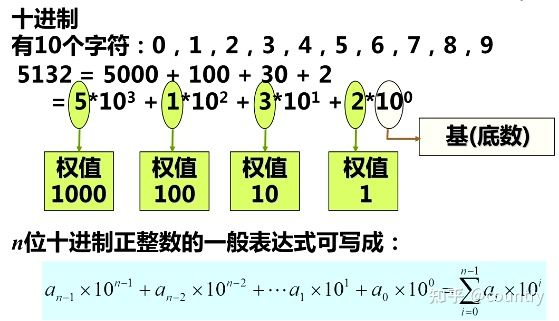
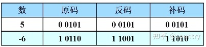

# 数制和编码

> https://zhuanlan.zhihu.com/p/367744014


## 知识点概述

> 任意进制(N进制)正整数展开式的普遍形式为：


```c
实际上是从首位开始，假设位数有n位，将第n位数上的数值乘以该进制权值的(n-1)次方。在之后对于下一位，将下一位的值乘以权值的(n-2)次方，以此类推
    
//例如八进制213换成十进制
2 x 8^(3-1) + 1 x 8^(3-2) + 3 x 8^(3-3)
    
//有小数的话接着往后减1即可
二进制转十进制
(1.11) = 1*2^0 + 1*2^(-1) + 1*2^(-2)
```


> 数制表现形式： (X)~n~      n表示进制数，X表示数值


> **二进制数**：二进制数只有2个数字符，即1和0。这两个数字符可以用电路的两种状态来表示，即高电平状态和低电平状态，这在电路上非常容易实现，所以在数字电路中二进制应用的非常广泛；


> **代码**：可以用一组组多位的二进制数来构成代码。一组二进制数代码已经与其二进制数值本身无关，只是用来表示一个特定的对象（或事物）。例如用10组4位的二进制数来表示0到9的十进制数的10个字符这就是 ==二～十进制代码==。


# 数制

## 二进制

> 在数字电路中，数字信号是一种不连续的脉冲信号，只有低电平和高电平两种状态，可用数字“0”和“1”来表示，因此用二进制来进行计数及编码是十分方便的。


```c
ASCII值为8、9、10 和13 分别转换为退格、制表、换行和回车字符。它们并没有特定的图形显示，但会依不同的应用程序，而对文本显示有不同的影响 。
32～126(共95个)是字符(32是空格)，其中48～57为0到9十个阿拉伯数字。
65～90为26个大写英文字母，97～122号为26个小写英文字母，其余为一些标点符号、运算符号等。
```


## 十进制

> 再次复习以下权值转换




## 八进制

> 八进制是二进制的整数次幂，一个八进制数的每一位的数值同对应的3位二进制数相等。所以我们在处理二进制转八进制时以3位二进制数为一组进行转换


## 十六进制

> 16进制是2进制的4次幂，一个十六进制数的每一位的数值同对应的4位二进制数相等。


## 其他

> 任意进制(N进制)正整数展开式的普遍形式为：


# 进制转换

## 十进制转二进制

> 求余转换


**比较值得注意的是十进制小数转二进制**

>  十进制小数转换成二进制小数采用**"乘2取整，顺序排列"**法。

具体做法如下：　

　用2乘十进制小数，可以得到积，将积的整数部分取出，再用2乘余下的小数部分，又得到一个积，再将积的整数部分取出，如此进行，直到积中的整数部分为零，或者整数部分为1，此时0或1为[二进制](https://www.zhihu.com/search?q=二进制&search_source=Entity&hybrid_search_source=Entity&hybrid_search_extra={"sourceType"%3A"answer"%2C"sourceId"%3A92856677})的最后一位。或者达到所要求的精度为止。 
　　然后把取出的整数部分按顺序排列起来，先取的整数作为二进制小数的高位有效位，后取的整数作为低位有效位。

　如：

```c
  0.625=（0.101）B 
　　0.625*2=1.25—————取出整数部分1 
　　0.25*2=0.5—————取出整数部分0 
　　0.5*2=1—————取出整数部分1 

　再如：0.7=（0.1 0110 0110...）B 
　　0.7*2=1.4—————取出整数部分1 
　　0.4*2=0.8—————取出整数部分0 
　　0.8*2=1.6—————取出整数部分1 
　　0.6*2=1.2—————取出整数部分1 
　　0.2*2=0.4—————取出整数部分0　 
　　0.4*2=0.8—————取出整数部分0 
　　0.8*2=1.6—————取出整数部分1 
　　0.6*2=1.2—————取出整数部分1 
　　0.2*2=0.4—————取出整数部分0 
```


# 码制

> **编码**：用某种文字、符号或数字表示特定对象的过程；
>
> **代码**：一组用来描述状态的多位二进制数；
>
> 数字电路中，采用二进制数对各种对象或状态进行编码，1位二进制数有0/1两个数值，因此1位二进制数只能表示2种状态或2个事物。若需要表示更多的状态或事物，就需要增加二进制数的位数，用一组多位的二进制数来表示。则这组二进制数就成为**代码**。


```c
对于标准ASCII码，有128种状态，用7位二进制数表示，如用8位二进制数表示，最高位位0，具体形式为0XXX XXXX。
```


## BCD码

> 二进制编码表示十进制数，二—十进制编码（**BCD码**，binary~coded decimal）


### 有权码

> 权是指表示一个十进制数位的4位二进制码的每一位有确定的位权。
>
> 优点：这4位二进制码之间满足二进制的进位规则，而十进制数位之间是十进制规则;在数字符的ASCII码与这种编码之间的转换方便，即取每个数字符*ASCII码*的低四位的值便直接得到该数字的[BCD码](https://baike.baidu.com/item/BCD码/826461?fromModule=lemma_inlink)，输入输出操作非常简便。


```c
4位二进制数中每一位都有固定的权值，分别将每个四位二进制数码中为1的位挑出来，并将这些位的权值相加，其和就是该二进制代码相对应的十进制数。
    
//例子
    二进制码0101，转换为十进制时使用8421码，将有效位：第三，第一位找出，其对应权值是4，1相加即得到5.
```


### 无权码

> 有权码和无权码区别是每一位是否有权值。
>
> 格雷码为典型的无权码，雷码的编码规则是相邻的两代码之间只有一位二进制位不同，每位并没有权值，对应的十进制数是规定的，并不是如8421码能算出来的。


## 各十进制码的编码特点

> 8421码：实际上是十进制数转换为二进制数时的形式。
>
> 2421码
>
> 余三码：与2421码情况类似。


### 8421码

> 8421码又叫BCD代码，通过8421我们可以直接通过把有1的位所对应的权值相加得到对应的十进制数

```c
//例
    1001  ----   8 + 1 = 9的8421码 = 1001
```

**伪代码(不用的代码)**

8421码用4位二进制数表示0-9的十个数，那么10-15的数实际是废弃不用的。如果8421码的数加法运算得到的值在伪代码中间，我们就需要强制进位，将该值加上6，以跳过伪代码。


### 2421码

> 2421码取反后可获取与9互补的数的2421码，0和9所对应的二进制代码互补，1和8、2和7、3和6、4和5情况相同。

``` 的
//例
    4的2421码 0100 ----取反----  1011 ：（9-4）=  5 的2421码
```


### 余3码

> 余3码比等值的二进制码多3，0和9所对应的二进制代码互为反码，1和8、2和7、3和6、4和5情况相同。

运算：加法时若产生进位(>15)就加3(0011),不进位就减3.最后得到的数就是相应值的余3码。


余3码为和要加3(0011)？

实际上，当两个余3码相加时，那么相对于基础的值，最后生成的值一共会多6，那么回到8421码，那也就是说生成的值比8421码多6。这就能够弥补8421码遇到为码需要强制进位问题。

当两个余3码相加，如果结果在合法范围(0-9)内，直接在映射表找到映射。如果在非法范围(10-15)内，因为已经自动产生进位，所以无需多做处理

```c
//例
 余3码 9 + 3 = 1100 + 0110 = 10010  （产生进位，10010值等于18，恰好是9+3+6，跳过了非法值9+3=12。同时9+3的值的后4位0010，恰好是结果）；0010再加3(0011)等于0101，即2的余3码
      2 + 3 = 0101 + 0110 = 1011   （未产生进位，1011等于11，恰好是2+3+6）； 1011减去3(0011)等于1000， 即5的余3码
```


## 格雷码

> gray code，又称循环码）
>
> （1）除了需要对数进行编码，有时还需要对状态、次序进行编码，格雷码就是这样的编码方式。
>
> （2）以下位4位格雷码的编码表，表示了16种状态，格雷码是一种循环码，每一位从上到下的排列顺序，都是以固定周期来循环的。如表中右起第一位，是按0110不断循环的，第二位是按0011 1100不断循环，故又称循环码。


```c
格雷码的特点是相邻序态对应的格雷码各位数只有1位不同，即格雷码在按态序变化的时候，每次只变换一位数码。
    //图像上表示就是，每向下读一位，变化的位数只有一位。例如1101到1100  1001到1000

在工程应用中，采用格雷码来对行进机构的位置进行编码，具有非常明显的优势。
```


**例子**

以下为一个行进机构位置编码的黑白色带：


光电传感器通过色带读出的代码，来确定行进机构的位置，定义光电传感器将色带上黑色读为1，白色读为0。若采用左边的二进制编码形式，会出现多位数码同时变化的情况。譬如，从0111变化到1000，这时如果光电传感器的反应速度不一致的话，例如右边起第1位读出数据较慢，就会在变为1000之前出现1001这一错误的位置信息。

而如果采用格雷码，因为相邻态序的格雷码只有1位数码的变化，只有该位对应的光电传感器状态有所变化，所以不会出现上面的错误。


## 原码、反码、补码

> （1）原码：有符号位的二进制数，最高位为符号位，“0”表示正，“1”表示负，其余为表示数值的大小。
>
> （2）反码：正数的反码与其原码相同。负数的反码时对其原码逐位取反，但符号不变。
>
> （3）补码：正数的补码与其原码相同。负数的补码是在其反码的末位加1。




## 引入原因

> 由于符号位的引入，若采用原码的形式计算5+(-6)，是无法得到正确且有效的结果的，补码的引入就是为了解决这个问题。即计算机计算有符号数值的运算时，采用的是补码形式。


```c
更详细的描述在附加：为什么需要反，补码
```


# 附加


 ## 为什么需要反，补码

> https://zhuanlan.zhihu.com/p/105917577

- 反码

计算机需要反码是因为对于计算而言，计算机只有加法器，没有减法操作只有加法操作。所以需要以下方式

1.**正数**的**反码保持**原码**不变**：3=[0_0000011]

2.**负数除最高位**（正负符号位）外，**全部取反**(0变1,1变0)：-5=1_0000101取反=[1_1111010]

于是3+[-5]=[-2]的计算过程为：

[0_0000011]+[1_1111010]=[1_11111101]

这样，反码方法就成功实现了目标


- 补码

对于一个0，我们知道它既不是正数也不是负数。但是对于计算机来说【1-1111111】【0-0000000】(-0,+0)都可以表示0，那这样是冲突的。

我们可以把负数整体向后“挪动1位”：只要将8位二进制表示的负数范围从：-127  ——  -0变成：-128  ——  -1，就能成功解决问题。

方法就是反码+1。{1_1111111}编码就不再表示-0，而变成了-1。顺着推，最小的编码{1_0000000}就是-128。

我们给这个反码+1又人为的取了一个新的名字，叫**补码**

1.**正数**的**补码保持**原码**不变**：3={0_0000011}

2.**负数先求反码**，然后**再加1**：-5=[1_1111010]+1={1_1111011}

于是3+{-5}={-2}的计算过程为：

{0_0000011}+{1_1111011}={11111110}