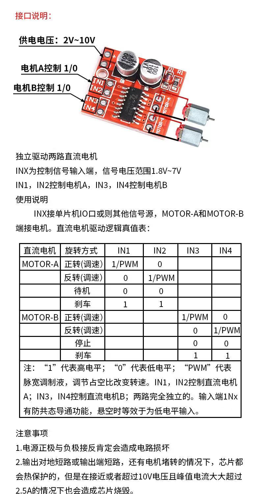

# ESP8266_arduino

> 通过rosserial可以配置esp8266在master主节点建立一个node，从而实现单片机ros通信。
>
> [ROS_wiki](http://wiki.ros.org/rosserial_arduino/Tutorials)
>
> [官方文档](https://arduino-esp8266.readthedocs.io/en/latest/installing.html)

环境配置请前往环境配置文档


# 与STM32F1

ESP8266和STM32F1是两种不同的嵌入式开发板，它们的性能指标也不同。

ESP8266是一种基于Tensilica L106 32位微控制器的Wi-Fi模块，主要用于物联网应用，其主要性能指标如下：

- 处理器主频：80 MHz
- 存储器：64 KB指令RAM，96 KB数据RAM，4 MB闪存
- 网络：802.11 b/g/n Wi-Fi

而STM32F1是一种基于Cortex-M3内核的微控制器，主要用于工业控制、自动化等应用，其主要性能指标如下：

- 处理器主频：最高可达72 MHz
- 存储器：64 KB-512 KB闪存，10 KB-80 KB SRAM
- IO口：多达80个GPIO口
- 通信接口：SPI、I2C、USART等

总的来说，ESP8266在处理网络相关的应用时具有优势，而STM32F1在处理IO口较多、对实时性要求较高的应用时更为适合。


# ESP8266基础命令

> https://arduino-esp8266.readthedocs.io/en/latest/reference.html

## 中断

> 你可以在8266中使用中断，但是需要一些规范，否则不稳定的中断会导致一些问题

调用 attachInterrupt() 创建中断，并将 GPIO 中断引脚、ISR（要调用的函数）和mode（模式）作为参数传递。ISR 函数必须声明 ICACHE_RAM_ATTR 属性。模式可以是 CHANGE、RISING 或 FALLING。

```
attachInterrupt(digitalPinToInterrupt(GPIO), ISR, mode);
```

ESP8266 中任何 GPIO 都支持中断，GPIO16 除外。


- 中断函数需要在IRAM中

```c
IRAM_ATTR void gpio_change_handler(void *data) {...
```

- 中断不允许使用延时函数

```c
delay()` or `yield()
```

- 执行时间超过1ms的中断需要把耗时部分移动到loop()循环中，否则会影响硬件稳定性

- 尽量不要使用动态分配内存（malloc()等函数），连续分配内存的类`String`, `std::string`, `std::vector`也要小心使用
- `new `和`delete`不要使用，因为它们的操作对象不在IRAM中


## 输入输出

```c
pinMode(GPIO, OUTPUT);
digitalRead(pin) digitalWrite(pin)
```

0-15引脚可以选择INPUT`, `OUTPUT`, or `INPUT_PULLUP

16引脚是INPUT`, `OUTPUT` or `INPUT_PULLDOWN_16

默认是INOUT


## 模拟输入

比较耗时，可能会有5ms的缓冲


## 模拟输出PWM

> esp8266没有专门生成PWM的外设，所以只能使用软件模拟
>
> 注意，设置分辨率越高会占用更多的存储空间和计算资源

要在给定引脚上生成 PWM 信号，可以使用`analogWrite()`函数：

```c
analogWrite(pin, value);
```

- **pin**：输出的针脚(引脚 0 到 16都可以)
- **value**： 应在 0 到PWMRANGE，默认情况下为 1023。当值为 0 时，该引脚上禁用 PWM。值 1023 对应于 100% 占空比

新版本是0-255

您可以通过调用以下功能更改PWMRANGE：

```c
analogWriteRange(new_range);
```

> analogWriteRange(new_range)函数可以设置analogWrite()函数的分辨率。
>
> 默认情况下，ESP8266的analogWrite()函数分辨率为8位，也就是可以输出0~255之间的值。
>
> 如果需要更高的分辨率，新的分辨率必须是2的幂次方，可以设置为10位、12位、14位和16位分辨率，对应的分辨率值为1023、4095、16383和65535。

默认情况下，ESP8266 PWM 频率为 1kHz。可以使用`analogWriteFreq()`函数来修改

```c
analogWriteFreq(new_frequency);
```


## 串口

> 有两个串口，第二个无法读

### 读写

缓冲区，8266有一个256字节的缓冲区，根据传输数据的大小设置足够的缓存区

```c
::setRxBufferSize(size_t size) //应该在begin()前调用
```

写会占用堵塞

```c
:write()
```

读不会

```c
::read()
```


### 串口

#### 启动与映射

第一个串口`Serial`

使用USART0，映射在GPIO1(TX)和GPIO3(RX)，可以调用函数重映射到GPIO15(TX)和GPIO13(RX)

```c
Serial.begin()
Serial.swap()  //再次调用会映射回去
```

第二个串口`Serial1`

使用USART1，映射在GPIO2(TX),RX引脚因为被闪存占用而无法使用

```c
Serial1.begin(baud)  //设置比特率并开启
```

如果Serial1没有使用且Serial没有重映射，可以把USART0的TX映射到GPIO2上

```c
Serial.begin()
Serial.set_tx(2)
//or
Serial.begin(baud, config, mode, 2)
```


#### wifi调试

启用wifi调试

```c
Serial.setDebugOutput(true)
Serial1.setDebugOutput(true)
```


#### 协议

可以设置5，6，7，8数据位，奇数/偶数/无校验位，1或2停止位。默认是8数据位无校验位1结束位

> 5, 6, 7, 8 data bits, odd (O), even (E), and no (N) parity, and 1 or 2 stop bits

```c
Serial.begin(baudrate, SERIAL_8N1)
Serial.begin(baudrate, SERIAL_6E2)
```


获取波特率

```c
// Set Baud rate to 57600
Serial.begin(57600);

// Get current baud rate
int br = Serial.baudRate();

// Will print "Serial is 57600 bps"
Serial.printf("Serial is %d bps", br);
```


读取TX受到数据的波特率

```c
Serial.detectBaudrate(time_t timeoutMillis)
```

timeoutMillis是最大持续毫秒，可以在begin()执行之前调用


# ROS

## 常用命令

- 重构库文件

```bash
rosrun rosserial_arduino make_libraries.py .
```

- 启动键盘节点

```bash
sudo apt-get install ros-noetic-teleop-twist-keyboard 

rosrun teleop_twist_keyboard teleop_twist_keyboard.py /cmd_vel:=/cmd_vel
```

- 建立连接

```bash
#通用连接--串口
rosrun rosserial_arduino serial_node.py _port:=/dev/ttyACM0 _baud:=115200
#tcp
rosrun rosserial_python serial_node.py tcp 11411
```

- 多块通讯launch文件

```xml
<?xml version="1.0"?>
<launch>
	
  <node pkg="rosserial_python" type="serial_tcp_node_1.py" name="serial_node_1" output="screen"> 
  </node>
  
  <node pkg="rosserial_python" type="serial_tcp_node_2.py" name="serial_node_2" output="screen">
  </node>

</launch>
```


## 发布者

```c++

#include <ros.h>
#include <std_msgs/String.h>

ros::NodeHandle nh;

std_msgs::String str_msg;
ros::Publisher chatter("chatter", &str_msg);
 
char hello[13] = "hello world!";

void setup()
{
  nh.initNode();
  nh.advertise(chatter);//需要注册发布者，一个发布者注册一次
}

void loop()
{
  str_msg.data = hello;
  chatter.publish( &str_msg );
  nh.spinOnce();
  delay(1000);
}
```


# 外设

## L298N




# 函数库

## time.h

```c++
#include <ros.h>
#include <ros/time.h>

ros::NodeHandle nh;

void setup()
{
  nh.initNode();
}

void loop()
{
  static ros::Time last_time = ros::Time::now();
  ros::Time current_time = ros::Time::now();
  if ((current_time - last_time).toSec() > 1.0) {
    Serial.print("Current time: ");
    Serial.println(current_time.toSec());
    last_time = current_time;
  }
  nh.spinOnce();
}
```


## Twist.h

```cpp
#include <ros.h>
#include <geometry_msgs/Twist.h>

// 创建一个 ROS 节点
ros::NodeHandle nh;

// 定义一个 Twist 类型的消息
geometry_msgs::Twist twist;

void setup() {
  // 初始化串口通信
  Serial.begin(9600);

  // 连接 ROS 网络
  nh.initNode();

  // 发布一个名为 "cmd_vel" 的话题，消息类型为 Twist
  nh.advertise<geometry_msgs::Twist>("cmd_vel");
}

void loop() {
  // 设置 Twist 消息的值
  twist.linear.x = 0.5;  // 线速度 0.5 m/s
  twist.angular.z = 1.0; // 角速度 1.0 rad/s

  // 发布 Twist 消息
  nh.publish("cmd_vel", &twist);

  // 延迟 100 毫秒
  delay(100);
}
```


## duration.h

> 可以使用一些常用的成员函数来进行时间计算和转换，例如toSec()、toNSec()、fromSec()、fromNSec()等函数。同时，也可以通过加减运算符、比较运算符等对时间间隔进行常规的数学运算和逻辑运算。

```c
#include <ros.h>
#include <ros/time.h>
#include <ros/duration.h>

ros::NodeHandle nh;

void setup() {
  nh.initNode();
}

void loop() {
  // 记录开始时间
  ros::Time start_time = nh.now();

  // 执行某个操作（例如控制电机运动）

  // 记录结束时间
  ros::Time end_time = nh.now();

  // 计算时间间隔
  ros::Duration duration = end_time - start_time;

  // 打印执行时间（单位为秒）
  nh.loginfo("Execution time: %f s", duration.toSec());

  // 等待一段时间
  delay(1000);
}
```


# 注意事项

## 编译与内存

当你在 Arduino 上编译代码时，会输出一些信息，其中包括代码的大小和使用的内存量。下面是一些常见的输出信息及其含义：

1. Sketch uses xxx bytes (xx%) of program storage space. Maximum is xxx bytes.
   - 这行输出告诉你程序占用了多少字节的存储空间，以及这个大小占总存储空间的百分比。同时，也会告诉你总存储空间的大小。
2. Global variables use xxx bytes (xx%) of dynamic memory, leaving xxx bytes for local variables. Maximum is xxx bytes.
   - 这行输出告诉你程序中全局变量占用了多少字节的内存，以及这个大小占总内存的百分比。同时，也会告诉你可用于局部变量的内存大小，以及总内存的大小。
3. Low memory available, stability problems may occur.
   - 这行输出表示内存已经接近极限，程序可能会出现稳定性问题。
4. Global variables use xxx bytes (xx%) of static memory, leaving xxx bytes for local variables. Maximum is xxx bytes.
   - 这行输出类似于第二行输出，但是它是在使用静态内存时显示的。

通常情况下，你需要确保你的程序在程序存储空间和动态内存空间方面都没有超出限制。如果你的程序超出了限制，你可以考虑以下几点来减少代码大小和内存占用：

1. 使用更小的数据类型，例如 `byte`、`int8_t` 等。
2. 避免使用过多的库，只使用你需要的库。
3. 将程序分解成较小的函数，并使用 `static` 关键字来避免不必要的全局变量。
4. 尽量避免使用字符串、浮点数和动态内存分配，因为它们会占用更多的空间。