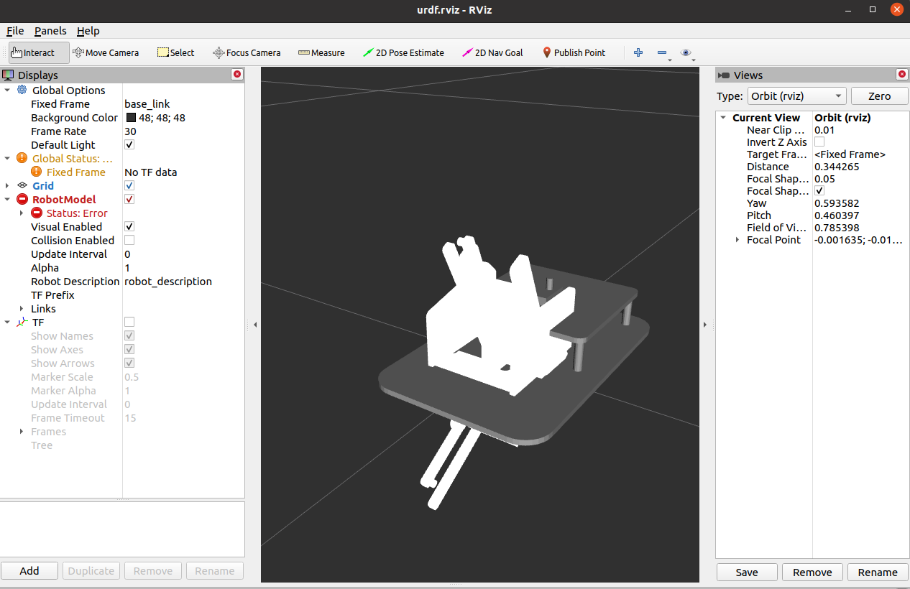
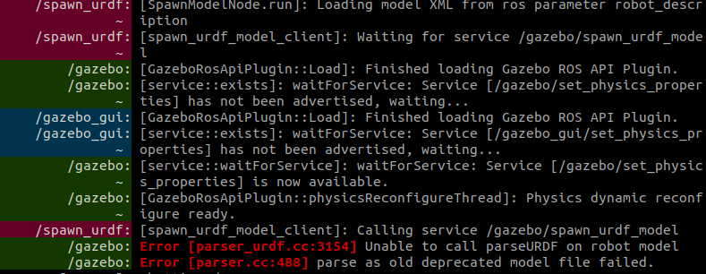
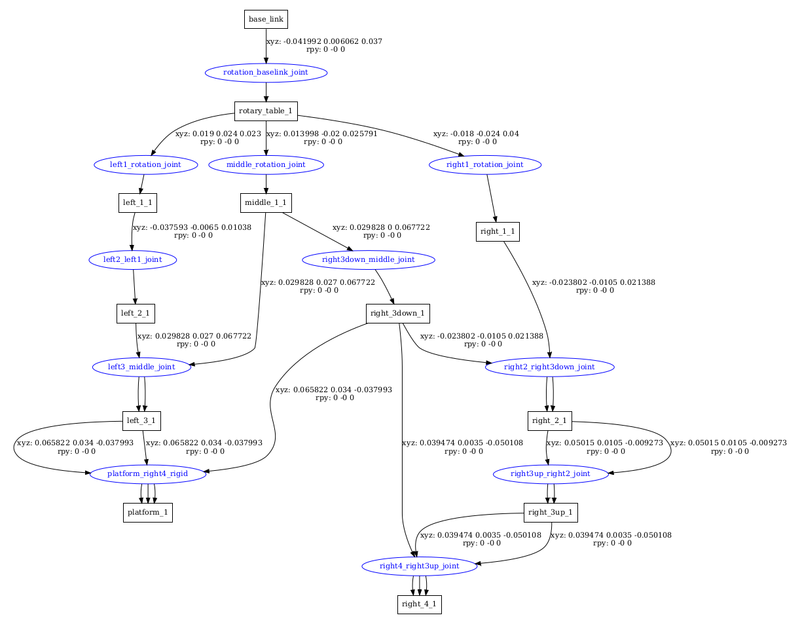

# Fusion360脚本导出URDF

> https://blog.csdn.net/zhao_ke_xue/article/details/127475610

github仓库：

- ros   https://github.com/syuntoku14/fusion2urdf
- ros2 https://github.com/dheena2k2/fusion2urdf-ros2

URDF官网

- http://wiki.ros.org/urdf/XML/


## 注意点

1. link对应fusion360的零部件，一个零部件只能包含一个实体且不能有内部零部件

2. 零部件命名遵循gazebo的要求，只能是字母或数字

3. 不允许使用快速联接，只允许使用联接的刚体，旋转和滑动

4. 联接时按子-父零部件的关系联接，顺序不可弄反

5. 联接时不要使用fusion自带的位置调整box，也就是不要鼠标拖动

6. 最后注意将一个零部件命名为“base_link"


## 问题相关

###  rviz

1. 警告：

```c
The root link base_link has an inertia specified in the URDF, but KDL does not support a root link with an inertia.  As a workaround, you can add an extra dummy link to your URDF.
```

https://stackoverflow.com/questions/60478248/controlling-a-4-wheeled-robot-in-gazebo-and-rviz

解决：加入一个虚拟空属性链接

```
<link name="dummy"></link>

<joint name="dummy_joint" type="fixed">    
	<parent link="dummy"/>    
	<child link="base_link"/>  
</joint>
```


2. 模型已修正且无报错，但载入`display.launch`后模型是灰白的



解决：

检查是否安装joint_state_publisher与robot_state_publisher

``` 
sudo apt-get install ros-noetic-joint-state-publisher
```

然后运行`gazebo.launch`和`display.launch`，并在gazebo中点击开始键


### gazebo

1. 报红

```c
[DefaultRobotHWSim::initSim]: This robot has a joint named "right2_middle_joint" which is not in the gazebo model.
[GazeboRosControlPlugin::Load]: Could not initialize robot simulation interface
```

解决：


- controller.launch

```
[main]: Controller Spawner: Waiting for service controller_manager/load_controller
[main]: Controller Spawner couldn't find the expected controller_manager ROS interface.
```

解决：修改了launch文件里的controller manager部分，把spawner换成controller_manager

**原来**：

<!--node name="controller_spawner" pkg="controller_manager" type="spawner" respawn="false" output="screen" ns="sg90_mechanical_arm" 
	args="sg90_mechanical_arm_controllers/r_1_position_controller 
	      sg90_mechanical_arm_controllers/r_2_position_controller 
	      sg90_mechanical_arm_controllers/joint_state_controller "/-->
**修改为**：

<node name="controller_loader" pkg="controller_manager" type="controller_manager" output="screen"
      args="load
      sg90_mechanical_arm_controllers/r_1_position_controller 
      sg90_mechanical_arm_controllers/r_2_position_controller 
      sg90_mechanical_arm_controllers/joint_state_controller
                "/>


2. Error:



urdf文件有错误，在这里通常是脚本生成了重复的link


3. ERROR

```
Ignoring transform for child_frame_id "link1" from authority "unknown_publisher" because of a nan value in the transform (-nan -nan -nan) (-nan -nan -nan -nan)
```

- (-nan -nan -nan) (-nan -nan -nan -nan)式

没有在urdf写旋转关节的axis属性


### spawner和controller manager

区别是前者会载入控制器并运行，后者只是载入

<node name="controller_manager" pkg="controller_manager"  type="controller_manager" output="screen"
          args=" 
	 sg90_mechanical_arm_controller/joint_state_controller"/>


### 载入控制器

- 载入控制器后出现模型乱跳或重叠

1. 在定义link时取消一些不必要的碰撞，用limit代替

2. 调整joint的limit和控制器的pid，先从0开始调


- 模型发生漂移或抖动

1. link之间的连接有问题
2. 质量不要设置太大，使用fusion给的即可(越重越稳定的常识对gazebo不适用)


# 复杂建模问题

## link一对多

有些模型，一个link可能会和多个link相联接，这些link会绕该link上的某一点旋转。但是有一个规则：

**每个Link在URDF中只能被一个Joint所指向是。**

如此一来就会出现问题，例如：



上面这个图中，某些joint有多个箭头指向同一个link，因为每个 link 只能被一个 joint 所指向。

> 对于 joint，它是用来描述两个 link 间的关系，一个 link 只能和一个 joint  相关联。如果有多个 joint 指向同一个 link，就不能够正确描述这些关系，也可能导致其他问题。因此，在写一份 urdf  文件时，应该保证每个 link 只有一个指向它的 joint。

**解决方法是**：

简化模型，然后复杂模型joint之间的联系用函数代替


## fixed冲突

能不使用刚体联接就不要使用，可能会产生模型乱跳的问题


## link运动太慢

不知道为什么关节旋转得很慢

- 似乎打开所有控制器后就好了，特别是joint_state_controller


发现是脚本的固有问题,所有的模型都会这样

后来检查出是运动link的interial的问题

  <inertial>
    <origin xyz="0.0 -0.0015 0.055" rpy="0 0 0"/>
    <mass value="0.02355"/>
    <inertia ixx="1.4322e-05" iyy="1.4483e-05" izz="1.92e-07" ixy="0.0" iyz="0.0" ixz="0.0"/>
  </inertial>


## 导出时出现base_link错误

但是我已经有base link了，后来发现是关节不能放在草图上