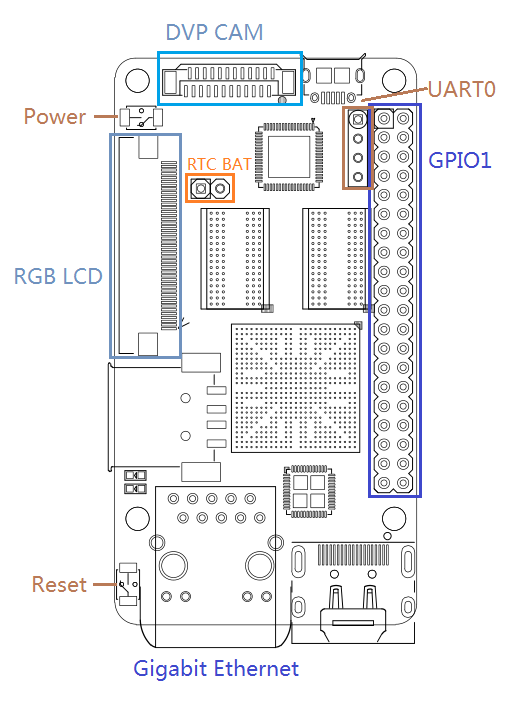

# Nanopi开发板(M1)

> https://wiki.friendlyelec.com/wiki/index.php/NanoPi_M1/zh


**管脚定义**

以上图为参考管脚分布：

PIN：2 4 6 ... 36 38 40

PIN：1 3 5 ... 35 37 39

UART0：1 2 3 4


# Fire2 开发板




# WringPi开发

> 在这个网站 https://projects.drogon.net/raspberry-pi/wiringpi/
>
> 可以获得更为详细的nanopi开发信息，例如硬件pwm是19.2Mhz

## 环境配置

- 安装[调用库](https://wiki.friendlyelec.com/wiki/index.php/WiringNP:_NanoPi_NEO/NEO2/Air_GPIO_Programming_with_C/zh)

```bash
git clone https://github.com/friendlyarm/WiringNP
cd WiringNP/
git checkout nanopi-m1
chmod 755 build
./build
```

```bash
gpio readall  #读取已有的硬件资源
```

如果想修改复用的接口，以PWM复用串口为例子，执行 `sudo npi-config `命令，进入Advanced Options菜单，执行其中的Enable/Disable PWM操作。

- cmakelist里添加库依赖

```cmake
#这个命令会查找WiringNP库，并把它的路径存储在变量WIRINGNP中。
find_library(WIRINGNP wiringPi)

## Declare cpp executables
FILE(GLOB ALL_SOURCES "src/*.cpp")
add_executable(${PROJECT_NAME} ${ALL_SOURCES})

## Add dependencies to exported targets, like ROS msgs or srvs
add_dependencies(${PROJECT_NAME}
        ${catkin_EXPORTED_TARGETS}
        )

## Specify libraries to link executable targets against
target_link_libraries(${PROJECT_NAME}
        ${catkin_LIBRARIES}
        ${WIRINGNP}    #WIRINGNP
        -pthread       #这也是个依赖
        )
```

- 在root的bashrc中写入`source 工作空间`

```bash
source '/home/pi/nano_ws/devel/setup.bash'
```

- 用普通用户编译，执行时进入root用户

```bash
cd ~/nano_ws
su
rosrun xxx xxx
```

编译运行


## 系统配置

> https://wiki.friendlyelec.com/wiki/index.php/Npi-config/zh

- pi-config是一个命令行下的系统配置工具，可以对系统进行一些初始化的配置，可配置的项目包括：用户密码、系统语言、时区、Hostname、SSH开关、自动登录选项、硬件接口(Serial/I2C/SPI/PWM/I2S)使能等，执行下列命令克隆仓库:

```
$ git clone https://github.com/friendlyarm/npi-config
```

在SSH终端中以root账户执行以下命令即可进入:

```
$ npi-config
```

-  npi-config的显示界面如下：

[](https://wiki.friendlyelec.com/wiki/index.php/File:Npi-config.jpg)

-  npi-config目前仅支持基于Ubuntu的系统, 例如FriendlyCore、Ubuntu-oled、Ubuntu-tft, 暂时不支持在Debian系统上运行。
-  如果你在 npi-config 中没有WiKi里描述的功能菜单，可能是因为你的 npi-config 版本太旧，连上网络, 然后利用菜单上的 Update 功能更新一下即可。

```
$ npi-config
	7 Update|               Update this tool to the latest version
```


## 引脚编号

> wiringpi库有三种引脚编号方式，分别为：
> **BCM编号方式**——就是使用芯片的GPIO引脚编号。
>
> **wiringpi库编号方式**——使用wiringpi库自己规定的编号方式。
>
> **排针引脚编号方式**——按照树莓派上20*2排针的引脚编号方式。


这里以wiringPi-Python库为例，提供了四种配置函数：

**wiringPiSetup** ——> wiringpi编号

**wiringPiSetupGpio** ——> BCM编号

**wiringPiSetupPhys** ——> 排针物理编号

**wiringPiSetupSys** ——> BCM编号，使用的/sys/class/gpio下的映射


```c
gpio readall  //读引脚
```


## 软件PWM

> https://projects.drogon.net/raspberry-pi/wiringpi/software-pwm-library/

```
#include <wiringPi.h>
#include <softPwm.h>
```

编译程序时，必须包含 *pthread* 库和 *wiringPi* 库：

```
cc -o myprog myprog.c -lwiringPi -lpthread
```

您必须事先使用 wiringPiSetup（） 或 *wiringPiSetupGpio（）*f unctions 之一初始化 ***wireningPi***。*wiringPiSetupSys（）* 不够快，所以你必须使用 sudo 运行你的程序。

以下两个函数可用：

- **int softPwmCreate （int pin， int initialValue， int pwmRange） ;**

这将创建一个软件控制的PWM引脚。您可以使用任何 GPIO 引脚，引脚编号将是您使用的 ***WiringPiSetup***（） 函数的编号。使用 100 表示 **pwmRange**，则给定引脚的值可以是 0（关闭）到 100（完全打开）之间的任何值。

返回值为 0 表示成功。其他任何事情，您应该检查全局 *errno* 变量以查看出了什么问题。

- **void softPwmWrite （int pin， int value） ;**

这将更新给定引脚上的PWM值。该值被检查为在范围内，以前未通过softPwmCreate初始化的引脚将被静默忽略。


### 注意

- PWM输出的每个“周期”需要10mS，默认范围值为100，因此尝试每秒更改PWM值超过100次将是徒劳的。
- 在软PWM模式下激活的每个引脚使用大约0.5%的CPU。
- 目前无法在程序运行时禁用引脚上的软PWM。
- 您需要保持程序运行以保持PWM输出！


### **设置range和value**

这一切都围绕着100uS的脉冲宽度进行。所以，1000Hz，是500uS打开，500uS关闭。这是 10 个“单位”的 100uS 脉冲，因此范围需要设置为 10。将范围设置为 10，将值设置为 5，您将获得 1000Hz 的方波。

对于 400Hz，周期为 1/400 = 0.0025s – 即 25 个周期的 100uS，因此将范围设置为 25，将值设置为 12，您会在 400Hz 处得到一个略微不对称的方波。

介于两者之间的任何值只需进行计算：范围= 1 /频率/ 0.0001，值为范围/ 2。


### 舵机控制

```c++
  /*T=0.5ms ------ - The rudder rotates 0 °*/
  /*T=1.0ms ------ - The rudder rotates 45 °*/
  /*T=1.5ms ------ - The rudder rotates 90 °*/
  /*T=2.0ms ------ - The rudder rotates 135 °*/
  /*T=2.5ms ------ - The rudder rotates 180 °*/
  void setAngle(double angle)
  {
    double c;
    if (angle >= 0 && angle <= 180)
      c = (0.5 + 2 * angle / 180);
    else
      return;
    ROS_INFO("Set %d %f", static_cast<int>(c / 20 * range_), c);
    common_.setSoftPWM(pin_n_, static_cast<int>(c / 20 * range_));
    last_angle_ = angle_;
    angle_ = angle;
  }
```


# Martix开发

```c
git clone https://github.com/friendlyarm/matrix  #另一个库
cd /matrix
make
sudo make install
```


# 功能

## 

## 将GPIO引出为USB

[可以参考以下步骤来将GPIO2引出为USB A口](https://blog.csdn.net/qlexcel/article/details/120860456)[1](https://blog.csdn.net/qlexcel/article/details/120860456)：

1. [在GPIO2上焊接一个USB转接头，连接USB-DP1、USB-DM1、VDD_5V和GND四个管脚](http://wiki.friendlyelec.com/wiki/index.php/NanoPi_NEO2/zh)[2](http://wiki.friendlyelec.com/wiki/index.php/NanoPi_NEO2/zh)。
2. 在系统中加载dwc2驱动模块，使能USB OTG功能。您可以在/boot/boot.cmd中添加如下命令：

```
setenv bootargs "${bootargs} modules-load=dwc2,g_ether"
```

[然后运行`mkimage -C none -A arm -T script -d /boot/boot.cmd /boot/boot.scr`更新启动脚本](https://www.cnblogs.com/netube/p/10159729.html)[3](https://www.cnblogs.com/netube/p/10159729.html)。

1. 重启系统后，您应该可以在/dev目录下看到sda或者sdb等设备文件，表示USB A口已经被识别。


## 设置线程优先级

root运行程序

```c
#include <pthread.h>
#include <ros/ros.h>
#include <ros/spinner.h>
#include <sched.h>

#include "monitor.h"
#include "peripheral_interface/mg995.h"

int main(int argc, char** argv)
{
  wiringPiSetup();

  pid_t pid = getpid();
  struct sched_param param;
  param.sched_priority = sched_get_priority_max(SCHED_FIFO);  // 也可用SCHED_RR
  sched_setscheduler(pid, SCHED_RR, &param);                  // 设置当前进程
  pthread_setschedparam(pthread_self(), SCHED_FIFO, &param);  // 设置当前线程
```

