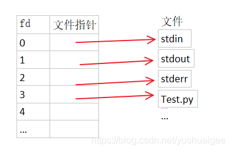

# ROS#C++学习

## 编写HW

> https://blog.csdn.net/AFATAR/article/details/107453318


# 自查

## ROS_INFO 调试时间戳

> 查看log信息： [rqt_console](https://blog.csdn.net/qq_30460905/article/details/123698106?spm=1001.2101.3001.6661.1&utm_medium=distribute.pc_relevant_t0.none-task-blog-2%7Edefault%7ECTRLIST%7Edefault-1-123698106-blog-108450089.pc_relevant_multi_platform_whitelistv1&depth_1-utm_source=distribute.pc_relevant_t0.none-task-blog-2%7Edefault%7ECTRLIST%7Edefault-1-123698106-blog-108450089.pc_relevant_multi_platform_whitelistv1&utm_relevant_index=1) 
>
> 过滤log等级： [rqt_logger_level]
>
> [其他](https://zhuanlan.zhihu.com/p/536485585)
>
> ROS_INFO具有时间戳功能，其次，它总共包含五个记录级别，这样做的优点是可以确定在任何时间有选择的查看各种信息。 比如我们可以使用rqt_console检视所有INFO

**打印一次与定时打印**

ROS_INFO_STREAM_ONCE    放在回调函数中确认数据有接收到，但是又不想一直刷屏可以用这个

ROS_INFO_STREAM_THROTTLE(0.5, "Message print every 0.5s");   定时刷屏有时候回调的频率比较高，可以设置慢一点的打印

在ros程序运行时，默认是不显示debug信息的。如果要查看debug消息，需要先运行rosrun rqt_logger_level rqt_logger_level


## ros::Time::now()

> 该函数返回系统时间或仿真时间
>
> **ros:time::now()输出值为0？**
>
> ROS设置了一个模拟时钟的节点，使用模拟时钟的时候，now()返回时间0直到第一条消息在/clock已经收到，所以当客户端不知道时钟时间时ros:time::now()输出为0。
>
>  
>
> **ros:time::now()输出的值是什么？**
>
> ros:time::now()输出的值与参数use_sim_time有关。
>
> use_sim_time为true时，ros:time::now()输出系统时间；
>
> use_sim_time为false时，ros:time::now()输出输出仿真时间，如果回放bag则是bag的时间。

**怎么设置参数use_sim_time？**

launch文件设置：

```
<param name="use_sim_time" value="false" />
```

通过节点设置:

```
rosparam set use_sim_time true
```

 

**如何直接使用系统时间？**

使用 ros::WallTime::now() 

播放rosbag时，若参数/use_sim_time 为true，则此时

- ros::WallTime::now()为当前的真实时间，也就是墙上的挂钟时间，一直在走。
- ros::Time::now()为rosbag当时的时间，是由bag中/clock获取的。是仿真时间。


## ros::Duration

> roslib给用户提供了ros::Time and ros::Duration两个类来描述时刻以及时间间隔两个概念，其中Duration能够是负数

### 2. 时间与时间间隔的基本使用


#### 2.1 得到当前时间

ros::Time begin = ros::Time::now();
 注：若是使用的是模拟时间，now在/clock话题接收到第一个消息以前都会返回0ssr


####   2.2 定义类对象

ros::Time::Time(uint32_t *_sec,* uint32_t *_nsec*)
 ros::Time::Time(double t)

ros::Duration::Duration(uint32_t *_sec,* uint32_t *_nsec*)
 ros::Duration::Duration(double t)

_sec是秒，_nsec是纳秒
 故ros::Time a_little_after_the_beginning(0, 1000000);等价于ros::Time a_little_after_the_beginning(0.001);


#### 2.3 相互转化、比较

Time继承自
 template<class T, class D>
 class ros::TimeBase< T, D >

Duration继承自
 template<class T>
 class ros::DurationBase< T >

两个基类都实现了>、<、!=等比较符。而且二者都实现了
 uint64_t    toNSec () const
 double    toSec () const
 咱们能够经过这两个函数来进行Time和Duration的转化


#### 2.4 运算符

两个基类都重载了+、-、+=、-=运算符：

1 hour + 1 hour = 2 hours (*duration + duration = duration*)

2 hours - 1 hour = 1 hour (*duration - duration = duration*)

Today + 1 day = tomorrow (*time + duration = time*)

Today - tomorrow = -1 day (*time - time = duration*)

Today + tomorrow = *error* (*time + time is undefined*)


### 3. 延时与循环

```
bool ros::Duration::sleep()
ros::Duration(0.5).sleep(); // sleep for half a second
```


### 4. 定时器


#### **ros::Timer**

首先须要说明的是，ROS并非实时系统，因此定时器并不能确保精肯定时。精确的执行时间以及理论上应该执行的时间能够在回调函数的ros::TimerEvent结构中获得。

```c
ros::Timer ros::NodeHandle::createTimer(ros::Duration period, <callback>, bool oneshot = false);

 ros::Timer timer = n.createTimer(ros::Duration(0.1), timerCallback);//定时0.1s

 void timerCallback(const ros::TimerEvent& e);
```


其中oneshot是定义是否只定时一次，默认连续定时。这里也不必定要回调函数，也能够传函数对象等，这里不细述。

其中TimerEvent结构体定义以下：

```c++
struct TimerEvent
{
  Time last_expected;                     ///< In a perfect world, this is when the last callback should have happened
  Time last_real;                         ///< When the last callback actually happened

  Time current_expected;                  ///< In a perfect world, this is when the current callback should be happening
  Time current_real;                      ///< This is when the current callback was actually called (Time::now() as of the beginning of the callback)

  struct
  {
    WallDuration last_duration;           ///< How long the last callback ran for, always in wall-clock time
  } profile;
};
```


#### ros::Rate

```
ros::Rate r(10); // 10 hz
while (ros::ok())
{
//... do some work ...
    bool met = r.sleep();
}
```

它的功能就是先设定一个频率，而后经过睡眠度过一个循环中剩下的时间，来达到该设定频率。若是可以达到该设定频率则返回true，不能则返回false。

计时的起点是上一次睡眠的时间、构造函数被调用、或者调用void ros::Rate::reset()函数重置时间。

由于没有TimerEvent，因此相对于Timer而言，Rate的精确度会有所降低。


# 阅读团队代码

## 打印类名typeid().name()

> 我们如果想要在控制台输出某个类的名字，我们应该用什么命令？

在rm_common的serice_caller.h里我们可以找到这样一条命令

```
typeid(ServiceType).name()
```

[更多](https://www.bbsmax.com/A/kvJ3Xm7O5g/)

**t.name()**
返回类型的C-style字符串，类型名字用系统相关的方法产生。

ServiceType是通过template <class ServiceType>获取的类，如果这是个派生类，那么.name()并不会打印出基类名，而是当前类的名字


## 关键词explicit

 在一些类里面的构造函数会见到explict，**explicit关键字的作用就是防止类构造函数的隐式自动转换.**

```c++
CxString string2 = 10;    // CxString是类名，定义类的时候先隐式CxString a(10),再string2=a
                          //加了explict后，这样是不行的, 因为explicit关键字取消了隐式转换  
```

 **explicit关键字只对有一个参数的类构造函数有效, 如果类构造函数参数大于或等于两个时, 是不会产生隐式转换的, 所以explicit关键字也就无效了.**

```c++
    explicit CxString(int age, int size) 
```

**也有一个例外, 就是当除了第一个参数以外的其他参数都有默认值的时候, explicit关键字依然有效, 此时, 当调用构造函数时只传入一个参数, 等效于只有一个参数的类构造函数**

```c++
    explicit CxString(int age, int size = 0)  
```


## 模板类std::map

> STL是标准C++系统的一组模板类，使用STL模板类最大的好处就是在各种C++编译器上都通用。
>
>  在STL模板类中，用于线性数据存储管理的类主要有vector, list, map 等等。


使用map对象首先要包括头文件,包含语句中必须加入如下包含声明

```c++
#include <map>
std:map<int, CString> enumMap;
```

注意，STL头文件没有扩展名.h

包括头文件后就可以定义和使用map对象了，map对象是模板类，需要关键字和存储对象两个模板参数，这样就定义了一个**用int作为关键字检索CString条目**的map对象，std表示命名空间，map对象在std名字空间中，为了方便，在这里我仍然使用了CString类，其实应该使用标准C++的std::string类，我们对模板类进行一下类型定义，这样用的方便，当然，不定义也可以，代码如下：

```c++
enumMap[1] = "One";
enumMap[2] = "Two";
//.....
enumMap[1] = "One Edit";
//或者insert方法
enumMap.insert(make_pair(1,"One"));
 
//返回map中目前存储条目的总数用size()方法：
int nSize = enumMap.size();
```


##  延时函数

> https://wenku.baidu.com/view/e7967cf787254b35eefdc8d376eeaeaad1f316ef.html

linux中常用延时函数 sleep，usleep， ndelay， mdelay

```c
#include <unistd.h>
	sleep(s);     //秒延时，延时成功返回0，失败则返回剩余秒数
	usleep(us);     //微秒延时，延时成功返回0，失败返回-1。参数需要小于1000000
```

linux内核常用延时函数

```c
#include <linux/delay.h>
	ndelay(ns);	  //纳秒延时
	udelay(us);   //微秒延时
	mdelay(ms);   //毫秒延时
```


## 函数对象

> 模仿函数功能的类，使用功能比一般函数更强大，但本质仍是类。在使用函数指针的场合中，它就无能为力了。例如，你不能将函数对象传给qsort函数！因为它只接受函数指针。
>
> C++函数对象实质上是一个实现了[operator](https://so.csdn.net/so/search?q=operator&spm=1001.2101.3001.7020)()--括号操作符--的类


> 有携带附加数据的功能，通过构造函数获得某个值，而在重载()操作符后能够再调用 `类名()`来编辑附加数据

```c
class  less 
{
    public : 
    less(int  num) : n(num) {} 
    bool operator()(int  value) 
    {
        return  value  < n;
    } 
    private : 
    int n;
};

less isLess(10);  
cout << isLess(9) << " " << isLess(12); // 输出 1 0 

原文链接：https://blog.csdn.net/bandaoyu/article/details/106358830
```


不过，现实是残酷的。函数对象虽然能够保有存成员函数指针和调用信息，以备象函数指针一样被调用，但是，它的能力有限，一个函数对象定义，最多只能实现一个指定参数数目的成员函数指针。


## 函数容器boost::function

> boost::function是一个函数对象的“容器”，概念上像是**C/C++中函数指针类型的泛化**，是一种“智能函数指针”。它以对象的形式封装了原始的函数指针或函数对象，能够容纳**任意符合函数签名的可调用对象**。因此，它可以被用于回调机制，==暂时保管函数或函数对象==，任何普通函数，成员函数，函数对象都可以存储在function对象中，然后在任何需要的时候被调用。

```c
boost::function能够代替函数指针，并且能能接受函数或函数对象，增加了程序的灵活性。当然，带来好处的同时，也必然有弊端。boost::function相比函数指针来说体积稍大一点，速度上稍慢一点。

原文链接：https://blog.csdn.net/huangjh2017/article/details/71124827
```


**调用方式**

```c
#include <boost/function.hpp>
```

| 首选语法                                   | 便携式语法                             |
| ------------------------------------------ | -------------------------------------- |
| `boost::function<float (int x, int y)> f;` | `boost::function2<float, int, int> f;` |

- float是返回值，括号内是int参数

- function可以配合bind使用，存储bind表达式的结果，使bind可以被多次调用


## 参数绑定boost::bind

> boost::bind是标准库函数std::bind1st和std::bind2nd的一种泛化形式。其可以支持函数对象、函数、函数指针、成员函数指针，并且绑定任意参数到某个指定值上或者将输入参数传入任意位置。
>
> https://blog.csdn.net/az44yao/article/details/103367514

**第 1种用法**
 向原始函数 fun 绑定所有的参数

```c
  boost::bind(&fun, 3, 4)   // bind的实参表依次为: 要绑定的函数的地址, 绑定到fun的第一个参数值, 第二个参数值...
```


bind(f, 1, 2)等价于f(1, 2); bind(g, 1, 2, 3)等价于g(1, 2, 3);


**第 2种用法**
 向原始函数 fun 绑定一部分参数

```c
  boost::bind(&fun, 3, _1)  // bind的实参表依次还是: 要绑定的函数的地址, 要绑定到fun的第一个参数值, 然后注意
     // 因为我们不打算向fun绑定第2个参数(即我们希望在调用返回的Functor时再指定这个参数的值)
     // 所以这里使用 _1 来占位. 这里的 _1 代表该新函数对象被调用时. 实参表的第1个参数.
     // 同理下边还会用到 _2 _3 这样的占位符. 
```

这里只为fun绑定了第一个参数3. 所以**在调用bind返回的函数对象时**. 需要:
  boost::bind(&fun, 3, _1)(4); //这个4 会代替 _1 占位符.


bind(f, _1, 5)(x)等价于f(x, 5)，其中_1是一个占位符，表示用第一个参数来替换;

bind(f, _2, _1)(x, y)等价于f(y, x);

bind(g, _1, 9, _1)(x)等价于g(x, 9, x);

bind(g, _3, _3, _3)(x, y, z)等价于g(z, z, z);


**第 3种用法**
 不向 fun 绑定任何参数

```c
  boost::bind(&fun, _1, _2)  // _1 _2 都是占位符. 上边已经说过了.
 所以它就是将新函数对象在调用时的实参表的第1个参数和第2个参数 绑定到fun函数. 
  boost::bind(&fun, _1, _2)(3, 4);  // 3将代替_1占位符, 4将代替_2占位符.

 输出 3, 4
```


## 文件读取

### 文件描述符（fd）

> 首先我们需要先知道文件描述符是什么
>
> [链接](https://blog.csdn.net/yushuaigee/article/details/107883964?ops_request_misc=%257B%2522request%255Fid%2522%253A%2522166375095716782388070889%2522%252C%2522scm%2522%253A%252220140713.130102334..%2522%257D&request_id=166375095716782388070889&biz_id=0&utm_medium=distribute.pc_search_result.none-task-blog-2~all~top_positive~default-1-107883964-null-null.142^v48^control,201^v3^control_2&utm_term=%E6%96%87%E4%BB%B6%E6%8F%8F%E8%BF%B0%E7%AC%A6&spm=1018.2226.3001.4187)

linux的进程每打开一个文件，内核就会给这个文件一个文件描述符用于索引

规定系统刚刚启动的时候，0是标准输入，1是标准输出，2是标准错误。这意味着如果此时去打开一个新的文件，它的文件描述符会是3，再打开一个文件文件描述符就是4




例如在团队gpio_manager.cpp代码


```c
#include <fcntl.h>  //open()的函数库，用于文件操作

std::string file = "/sys/class/gpio/gpio" + std::to_string(gpioData.pin) + "/direction";  //设置一个文件的地址
  
  //储存索引的变量
  int fd;  
 
  //调用<fcntl.h>的open()，返回的是文件描述符
  fd = open(file.data(), O_WRONLY);
```


fcntl.h的更多用法 [链接](https://blog.csdn.net/qintaiwu/article/details/73438194)


### 向文件写入数据

> 团队使用unistd.h进行写操作
>
> 用法 [链接](https://blog.csdn.net/FML7169/article/details/101526754)


```c
 if (gpioData.type == rm_control::OUTPUT)
    {
      if (write(fd, "out", 3) != 3) //以文件描述符为索引读取写入目标文件，返回写入的字节数
      {
        ROS_ERROR("[gpio]Failed to set direction of gpio%d", gpioData.pin);
      }
    }
```

