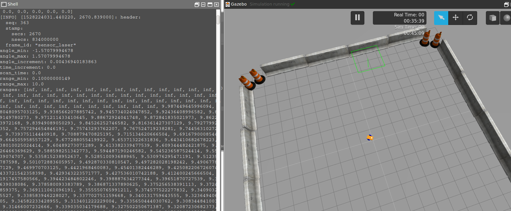
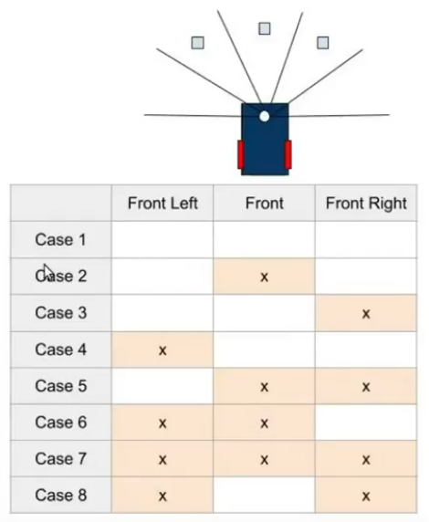

# ROS激光雷达建图导航

> [项目地址](https://www.theconstructsim.com/ros-projects-exploring-ros-using-2-wheeled-robot-part-1/)
>
> [bilibili视频](https://www.bilibili.com/video/BV1aK4y147Uy?p=3&vd_source=782af047fbca87ac3084937682017138)


## 新建一个雷达link

> 该link描述一个激光雷达

> ```xml
>  <link name="sensor_laser">
>     <inertial>
>       <origin xyz="0 0 0" rpy="0 0 0" />
>       <mass value="1" />
>       <!-- RANDOM INERTIA BELOW -->
>       <inertia ixx="0.02" ixy="0" ixz="0" iyy="0.02" iyz="0" izz="0.02"/>
>     </inertial>
> 
>     <visual>
>       <origin xyz="0 0 0" rpy="0 0 0" />
>       <geometry>
>         <cylinder radius="0.05" length="0.1"/>
>       </geometry>
>       <material name="white" />
>     </visual>
> 
>     <collision>
>       <origin xyz="0 0 0" rpy="0 0 0"/>
>       <geometry>
>         <cylinder radius="0.05" length="0.1"/>
>       </geometry>
>     </collision>
>   </link>
> 
>   <joint name="joint_sensor_laser" type="fixed">
>     <origin xyz="0.15 0 0.05" rpy="0 0 0"/>
>     <parent link="link_chassis"/>
>     <child link="sensor_laser"/>
>   </joint>
> ```


现在加载一个雷达插件让这个link被仿真为激光雷达

```xml
<gazebo reference="sensor_laser">
    <sensor type="ray" name="head_hokuyo_sensor">
      <pose>0 0 0 0 0 0</pose>
      <visualize>false</visualize>
      <update_rate>20</update_rate>
      <ray>
        <scan>
          <horizontal>
            <samples>720</samples>
            <resolution>1</resolution>
            <min_angle>-1.570796</min_angle>
            <max_angle>1.570796</max_angle>
          </horizontal>
        </scan>
        <range>
          <min>0.10</min>
          <max>10.0</max>
          <resolution>0.01</resolution>
        </range>
        <noise>
          <type>gaussian</type>
          <mean>0.0</mean>
          <stddev>0.01</stddev>
        </noise>
      </ray>
      <plugin name="gazebo_ros_head_hokuyo_controller" filename="libgazebo_ros_laser.so">
        <topicName>/m2wr/laser/scan</topicName>
        <frameName>sensor_laser</frameName>
      </plugin>
    </sensor>
  </gazebo>
```

```
update_rate表示更新频率，samples表示激光雷达采样点数，resolution表示分辨率，min_angle和max_angle表示扫描范围，min和max表示距离范围，noise表示噪声参数。plugin标签中的filename属性指定了激光雷达插件的共享库文件。

frameName是被申明为激光雷达的link
```

启动launch，观察相应话题数据




## 过滤激光雷达数据

在包中，程序读取激光雷达数据并进行处理

现在通过代码获取雷达每隔一定距离的扫描最小值

```python
#python举例
def clbk_laser(msg):
    # 720/5 = 144
    regions = [ 
      min(min(msg.ranges[0:143]), 10), #考虑到有无穷大值，所以需要对无穷大值进行过滤
      min(min(msg.ranges[144:287]), 10),
      min(min(msg.ranges[288:431]), 10),
      min(min(msg.ranges[432:575]), 10),
     min( min(msg.ranges[576:713]), 10),
     ]
     rospy.loginfo(regions)
```


## 实现逻辑避障

将扫描获取的数据进行分析，得到要如何运动以规避障碍



```python
# 以python为例
def take_action(regions):
    msg = Twist()
    linear_x = 0
    angular_z = 0
    
    state_description = ''
    
    #定义所有的运动状态，当距离满足某个状态时就触发
    if regions['front'] > 1 and regions['fleft'] > 1 and regions['fright'] > 1:
        state_description = 'case 1 - nothing'
        linear_x = 0.6
        angular_z = 0
    elif regions['front'] < 1 and regions['fleft'] > 1 and regions['fright'] > 1:
        state_description = 'case 2 - front'
        linear_x = 0
        angular_z = 0.3
    elif regions['front'] > 1 and regions['fleft'] > 1 and regions['fright'] < 1:
        state_description = 'case 3 - fright'
        linear_x = 0
        angular_z = 0.3
    elif regions['front'] > 1 and regions['fleft'] < 1 and regions['fright'] > 1:
        state_description = 'case 4 - fleft'
        linear_x = 0
        angular_z = -0.3
    elif regions['front'] < 1 and regions['fleft'] > 1 and regions['fright'] < 1:
        state_description = 'case 5 - front and fright'
        linear_x = 0
        angular_z = 0.3
    elif regions['front'] < 1 and regions['fleft'] < 1 and regions['fright'] > 1:
        state_description = 'case 6 - front and fleft'
        linear_x = 0
        angular_z = -0.3
    elif regions['front'] < 1 and regions['fleft'] < 1 and regions['fright'] < 1:
        state_description = 'case 7 - front and fleft and fright'
        linear_x = 0
        angular_z = 0.3
    elif regions['front'] > 1 and regions['fleft'] < 1 and regions['fright'] < 1:
        state_description = 'case 8 - fleft and fright'
        linear_x = 0.3
        angular_z = 0
    else:
        state_description = 'unknown case'
        rospy.loginfo(regions)

    rospy.loginfo(state_description)
    msg.linear.x = -linear_x
    msg.angular.z = angular_z
    pub.publish(msg)
```


## 里程计和全局定位

> 在这部分中，我们将实现一个简单的导航算法，将机器人从任意点移动到所需的点。我们将使用状态机的概念来实现导航逻辑。在状态机中，有有限数量的状态表示系统的当前状况（或行为）

现在定义三个状态：

- Fix Heading

​	表示机器人航向与所需航向相差超过阈值时的状态（由代码中的yaw_precision_表示）	

- Go Straight

​	表示机器人具有正确的航向，但距离所需点的距离大于某个阈值时的状态（由代码中的dist_precision_表示）

- Done

​	表示机器人方向正确并到达目的地时的状态。


### 发布里程计

在ROS中，发布里程计需要将当前机器人的位置信息发布到ROS系统中。可以通过以下步骤实现：

- 创建一个ros::Publisher对象并设置Topic名称和消息类型。

```
ros::Publisher odom_pub = nh.advertise<nav_msgs::Odometry>("odom", 50);
```

- 创建nav_msgs/Odometry消息，并填充其各个字段。

```
cpp
nav_msgs::Odometry odom;
odom.header.stamp = current_time;
odom.header.frame_id = "odom";
odom.child_frame_id = "base_link";
odom.pose.pose.position.x = robot_x;
odom.pose.pose.position.y = robot_y;
odom.pose.pose.position.z = 0.0;
odom.pose.pose.orientation = tf::createQuaternionMsgFromYaw(robot_yaw);
odom.twist.twist.linear.x = linear_velocity;
odom.twist.twist.angular.z = angular_velocity;
```

- 调用发布者的publish()方法将消息发布到Topic上。

```
odom_pub.publish(odom);
```

其中，robot_x, robot_y, robot_yaw, linear_velocity和angular_velocity是机器人的位置和速度信息。

注意：里程计的发布频率较高，需要在一个while循环中不断地发布消息，同时需要保证循环周期的稳定性。


> odom数据类型：**nav_msgs/Odometry**
>
> ```css
> Header header
> string child_frame_id
> geometry_msgs/PoseWithCovariance pose
> geometry_msgs/TwistWithCovariance twist
> ```
>
> `header`包含了时间戳和坐标系等信息，`child_frame_id`为机器人的坐标系，`pose`包含了机器人的位姿信息，包括位置和方向，以及协方差矩阵；`twist`包含了机器人的线速度和角速度信息，以及协方差矩阵


> 姿态函数
>
> 在ROS的tf库中，可以使用以下函数将姿态转换为四元数或旋转矩阵，从而填入odom的位姿中：
>
> ```c++
> tf::createQuaternionMsgFromYaw(yaw)：将yaw角度转换为四元数。
> tf::createQuaternionFromRPY(roll, pitch, yaw)：将欧拉角转换为四元数。
> tf::createMatrix3FromQuaternion(quat)：将四元数转换为旋转矩阵。
> ```
>
> 其中，yaw表示绕z轴的旋转角度，roll、pitch、yaw表示分别绕x、y、z轴的旋转角度，quat表示四元数。


### 实现状态机

- 回调函数

接收里程计数据并提取位置和偏航信息。里程数据以四元数编码方向信息。为了获得偏航，将四元数转换为欧拉角

```python
    # yaw
    quaternion = (
        msg.pose.pose.orientation.x,
        msg.pose.pose.orientation.y,
        msg.pose.pose.orientation.z,
        msg.pose.pose.orientation.w)
    euler = transformations.euler_from_quaternion(quaternion)
    yaw_ = euler[2]
```

- 状态更新

此函数更改存储机器人状态信息的全局状态变量的值。

- 校准航向角

当机器人处于状态0（固定航向）时，执行此功能。首先，检查机器人的当前航向和所需航向。如果航向差大于阈值，机器人将被命令转向其位置。

- 向前直行

当机器人处于状态1（直行）时，执行此功能。该状态发生在机器人修正偏航误差后。在此状态下，将机器人当前位置和期望位置之间的距离与阈值进行比较。如果机器人进一步远离所需位置，则命令其向前移动。如果当前位置更接近所需位置，则再次检查偏航是否存在错误，如果偏航与所需偏航值显著不同，则机器人进入状态0。

- 运动完成

最终机器人实现了正确的航向和正确的位置。一旦处于这种状态，机器人就会停止。


## 沿墙行走

> 在这一部分中，我们将编写一个算法，让机器人沿着墙走。我们可以从上一部分继续，也可以从新项目开始。


# 实物雷达


## YDILAR

> https://yahboom.com/study/YDLIDAR-X3
