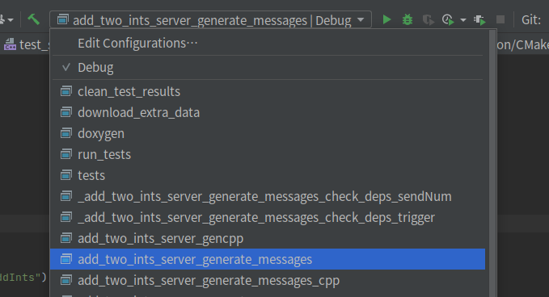
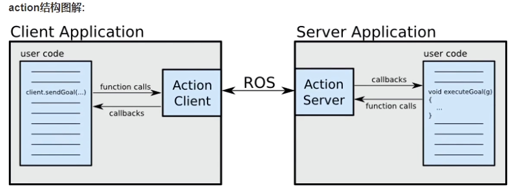
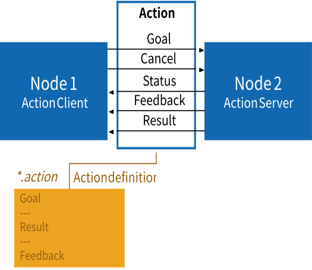

# ROS通信—Service

https://blog.csdn.net/weixin_45590473/article/details/121208056

> 服务通信和话题通信类似，但服务是基于 C/S 模式的双向数据传输模式（有应答的通信机制）：一个结点A向另一个结点B发送请求，B接收处理请求并响应结果给A。而相比之下话题是无应答的通信机制。
>
> //服务通信基于**请求响应模式**，是一种应答机制//

服务通信适用于对实时性有要求，并有一定逻辑处理的应用场景

```c
C/S（Client/Server，客户机/服务器）模式又称C/S结构，是软件系统体系结构的一种。
双向通信模式，也就是有应答的通信机制，它的特点是一个节点在发送数据的后也可以接收到由另一个节点发送回来的数据。
```


**概念**

以请求响应的方式实现不同结点间数据交互的通信模式


**作用**

用于偶然的，对实时性有要求的，且需要逻辑处理的数据传输场景


**案例**

实现两个数字的求和，客户端节点，运行时会向服务器发送两个数字，服务端节点接收两个数字求和并将结果响应回客户端


**服务通信与话题通信的不同点**

|          | Topic(话题)                            | Service(服务)                                |
| -------- | -------------------------------------- | -------------------------------------------- |
| 通信模式 | 发布/订阅                              | 请求/响应                                    |
| 同步性   | 异步                                   | 同步                                         |
| 底层协议 | ROSTCP/ROSUDP                          | ROSTCP/ROSUDP                                |
| 缓冲区   | 有                                     | 无                                           |
| 实时性   | 弱                                     | 强                                           |
| 结点关系 | 多对多                                 | 一对多(一个Server)                           |
| 通信数据 | msg                                    | srv                                          |
| 使用场景 | 连续高频的数据发布与接收：雷达，里程计 | 偶尔调用或执行某一项特定功能：拍照，语音识别 |


1. 请注意，服务和话题的通信都会涉及topic，通信双方的正常工作需要相同的 topic

```c
//这里的topic和我们之前学的话题通讯不太一样，之前的话题是一种异步通信机制，和Server，Action同等级的。而现在我们说的topic一种名为节点交换消息的总线，需要数据的节点订阅相关topic；生成数据的节点发布到相关topic
```

2. 话题通信这种无应答的通信方式虽实时性不高，但是传输效率明显高于服务通信；服务通信由于多了一个回应的机制所以在效率上要低于话题通信，但是通信可以根据需求随时快速响应大大提高了实时性。

```c
正因如此，我们不能因为看到服务有实时性的特点，把那些需要实时分析的数据一补脑地写成服务来处理。服务的功能特点突出在于随机地偶然的事件，例如一个检测火灾的摄像头，火灾的发生明显是偶然且随机的，这种情况就很适合使用话题来让摄像头和火灾报警器通讯。
```


## 关系表

> 服务通信的关系表简单一些，这主要涉及三个角色(节点)：
>
> master管理者：保管server和client注册的信息，匹配相应的server与client，帮助其建立连接。连接建立后client发送请求信息，server返回响应信息
>
> server服务端
>
> client订阅端


```c
看起来复杂，其是讲解一些就懂了
 0-5是步骤事件
    传输效率明显高于服务通信
角色
    1.master管理者
    2.server服务端
    3.client客户端
  master是伴随roscore运行而产生的管理者；
  
流程
    master会根据话题实现server和client的连接，作为二者的媒介。
    1.步骤0：server向master注册服务信息，包含话题名称和自己的远程ipc地址（1234）
    2.步骤1：client同样的也注册信息，但不同的是仅仅注册话题信息
    3.步骤2：mster对话题进行匹配，这时一个ipc地址（3456）被传入client，这是一个由ros对ipc进行一个封装后的地址，client拿到这个地址后就可以与server建立起联系
    4.步骤4，5：client拿到地址后就可以请求服务了，发送请求后server会返回一个响应
```


**注意**

1. 就和上述流程所示一样，服务通信先启动服务器server然后再启动客户端client，但是话题通信的通信双方并没有启动的先后顺序。
2. 客户端和服务端可以存在多个 
3. 我们使用的不用考虑什么什么的，所有流程已封装，到时候调用即可


## 数据载体

> 我们使用srv文件来定义服务消息，srv文件内可用的数据类型和msg文件一样

**定义srv文件**

服务通信中，因为即有请求，也有响应，所以数据分为请求和响应两部分。

现在请新建一个叫add_two_ints_server的功能包，在包内新建文件夹srv和src。

在/src下新建test_server.cpp和test_client.cpp文件：

```c
//test_client.cpp
#include <iostream>
#include <ros/ros.h>

int main(int argc, char **argv) {
  //初始化一个ROS节点
  ros::init(argc, argv, "my_client");

  //初始化节点句柄
  ros::NodeHandle nh;

  return 0;
}
```

```c
//test_server.cpp
#include <iostream>
#include <ros/ros.h>

int main(int argc, char **argv) {
  //初始化一个ROS节点
  ros::init(argc, argv, "my_server");

  //初始化节点句柄
  ros::NodeHandle nh;

  return 0;
}
```


在/srv内新建一个sendNum.srv文件：

```c
#请求时发送的数据
int32 a
int32 b
 
---
#响应部分
int32 sum
```

---是请求和响应的分割符，是固定格式，请不要随意改动


**编辑配置文件**

在package.xml加入

```c
<build_depend>message_generation</build_depend>
<exec_depend>message_runtime</exec_depend>
```

Cmakelist.txt

```c
//当前包依赖的包，添加message_generation
find_package(catkin REQUIRED COMPONENTS
        roscpp
        std_msgs
        message_generation
        )

//添加消息文件
add_service_files(
        FILES
        sendNum.srv
)

//消息文件生成需要的数据
generate_messages(
   DEPENDENCIES
   std_msgs
)
    
//和find package功能不一样，是添加依赖包所需要的包，添加message_runtime
        #  DEPENDS system_libruntime
catkin_package(
        #  INCLUDE_DIRS include
        #  LIBRARIES add_two_ints_client
        CATKIN_DEPENDS roscpp std_msgs message_runtime
        #  DEPENDS system_lib
)
    
include_directories(
        # include
        ${catkin_INCLUDE_DIRS}
)
    
//生成可执行文件
add_executable(add_two_ints_server src/test_server.cpp)
target_link_libraries(add_two_ints_server ${catkin_LIBRARIES})
add_executable(add_two_ints_client src/test_client.cpp)
target_link_libraries(add_two_ints_client ${catkin_LIBRARIES})
```

现在主要准备工作已完成, source环境变量后，对add_two_ints_server与add_two_ints_client编译，然后在cpp文件中添加对头文件的包含

```c
#include "add_two_ints_server/sendNum.h"
```

再次编译，无报错即可


> 这环境配置太艹蛋了，新建两个包写好cmake后死活读不到ros.h，把这两个包移开，clean工作空间后重新build后再把两个包移回来，又可以找得到ros.h,离谱
>
> 对于add exectuabe出来的可执行文件在clion的build里面找不到：先单独load包的cmakelist再load全局的cmakelist

> 还有server文件无法编译，先在clion里面手动generate msg就行了
>
> 


## 实现  int num2 = request.b;

mater对连接的功能已经进行封装，我们此时只需要关注服务端，客户端和数据的实现


### **服务端**

流程

1. 包含头文件
2. 初始化一个ROS节点
3. 创建节点句柄
4. 创建服务对象
5. 处理请求的编程，产生响应
6. spin()

```c
包含头文件
#include “my_bag/server.h"
//注意在写好srv和cmakelist文件后需要source并编译文件，否则写代码会找不到消息头文件

int main(int argc, char **argv) {
  //初始化一个ROS节点
  ros::init(argc, argv, "my_server");
  //节点名字是唯一的

  ROS_INFO("Server is running");

  //初始化节点句柄
  ros::NodeHandle nh;

  //服务对象，构造函数有多个，我们使用参数为话题名称+回调函数的构造函数
  ros::ServiceServer ser = nh.advertiseService("addInts", processData);

  // spin循环
  ros::spin();

  return 0;
}
```

```c
//定义回调函数，注意返回值是bool类型，表示对数据的处理是否成功;参数是请求对象与响应对象，这些参数会在回调函数被调用时传入
bool processData(add_two_ints_client::sendNumRequest &request,
                 add_two_ints_client::sendNumResponse &response)
{
  int num1 = request.a;
  int num2 = request.b;
  ROS_INFO("Get number: %d and %d", num1, num2);

  response.sum = num1 + num2;
  ROS_INFO("Request number: %d", response.sum);

  //如果成功则返回true，实际上如果数据不正确我们可以返回flase
  return true;
}
```


现在尝试直接运行这个包

```c
roscore
rosrun add_two_ints_server add_two_ints_server 
```

手动运行服务请求，可以按Tap补全

```c
rosservice call addInts "a: 1
b: 1" 
```


### 客户端

流程

1. 包含头文件
2. 初始化一个ROS节点
3. 创建节点句柄
4. 创建客户端对象
5. 提交请求，处理响应

提交两个整数，处理响应的结果(也就是打印出来)；客户端没有回调函数，不需要spin()

```c
#include "add_two_ints_server/sendNum.h"
#include <iostream>
#include <ros/ros.h>

int main(int argc, char **argv) {
  //让日志能够输出中文，它C库中的一个设置地域化信息的C函数，一般用来解决程序遇到编码方面的问题
  setLocale(LC_ALL,"");
  //初始化一个ROS节点
  ros::init(argc, argv, "my_client");

  //初始化节点句柄
  ros::NodeHandle nh;
    
  //创建客户端对象
  //填入之前的话题名字，让客户端和服务端匹配的话题，后面的参数是有缺省值的，可以不填写
  ros::ServiceClient client =
      nh.serviceClient<add_two_ints_server::sendNum>("addInts");
    
  add_two_ints_server::sendNum ask;
  //请求和响应都完成了封装处理，想要获得响应需要去向服务器访问
  //组织请求
  ask.request.a = 1;
  ask.request.b = 2;
    
  //call()会返回一个bool值，通过它获得返回值来判断是否成功
  bool flag = ask.call(ask);
  if(flag)
  {
      ROS_INFO("Successful rqeuest: %d",ask.response.sum);
  }
  else
  {
      ROS_INFO("Fail request");
  }

  return 0;
}
```


# ROS通信—Action

> action通信和服务通信类似，但是比服务通信更复杂。
>
> action也有请求和响应机制，不过action的服务端可以连续反馈机器人状态信息，在任务结束后再返回最终结果。


**和Server的区别**

服务机制常用于同步的请求/响应交互方式，客户端向服务端发出请求，在等待响应期间会强行**阻塞**程序，因而完全无法获知服务端的处理进度，更不能取消或变更请求。这给我们带来了很大的不便，尤其是需要较长时间才能完成的复杂任务。为解决这个问题，ros 引入了一种基于 ros 消息的高级协议——Action。

最常见的就是我们使用机械臂时，我们需要连续获取机械臂的位姿，来一步一步地让机械臂指向目标位置。很明显这是一个耗时操作，如果使用服务通信，虽然我们可以获得执行的结果，但无法在机械臂的运行过程中获得任何反馈，机械臂很可能会因为还未到达指定姿态时就去执行下一步的命令而导致一些不好的结果，包括机械臂损坏。


**概念**

action是一种类似于服务通信的实现，其实现模型也包含里请求和响应。不同的是action的服务端可以连续反馈当前任务进度，客户端可以接收连续反馈以及取消任务。


**作用**

用于耗时的请求响应场景，获取连续的状态反馈






goal: 目标任务call(ask)

cancel： 取消任务

status： 服务端状态

result：  最终执行结果（只会发布一次）

feedack：连续反馈（可以发布多次）


**案例**

创建服务端与客户端，客户端向服务器发送目标数据A和B，服务端会从A开始，每隔0.2秒加1并把过程返回给客户端，直到值等于B。


## 数据载体

action通信的数据文件是.action文件

在功能包目录下新建/action目录并在其加入addInts.action文件：

```c
int32 a
int32 b
---

#最终响应数据
int32 result
---

#连续反馈数据
float64 progess
```


package文件加入

```c
<build_depend>actionlib</build_depend>
<build_depend>actionlib_msgs</build_depend>

<exec_depend>actionlib</exec_depend>
<exec_depend>actionlib_msgs</exec_depend>
```


cmakelist文件

```c
find_package(catkin REQUIRED COMPONENTS
        roscpp
        std_msgs
        actionlib
        actionlib_msgs
        )

## Generate actions in the 'action' folder
add_action_files(
        FILES
        addInts.action
)

## Generate added messages and services with any dependencies listed here
generate_messages(
        DEPENDENCIES
        actionlib_msgs
        std_msgs
)

catkin_package(
        #  INCLUDE_DIRS include
        #  LIBRARIES add_two_ints_client
        CATKIN_DEPENDS roscpp std_msgs actionlib actionlib_msgs
        #  DEPENDS system_lib
)

include_directories(
        # include
        ${catkin_INCLUDE_DIRS}
)
```

先尝试对功能包进行编译，成功后在工作空间devel文件夹内可看到相应的中间文件


## 实现

流程

	1. 包含头文件
	1. 初始化ros节点
	1. 创建NodeHandle
	1. 创建action server对象
	1. 请求处理（解析提交的目标值，产生连续反馈；最终结果响应)
	1. sin()回旋

​			

### 服务端

/src下的test2_server.cpp文件

```c
#include "add_two_ints_action/addIntsAction.h"
#include <actionlib/server/simple_action_server.h>
#include <ros/ros.h>

//action的名字太长，先用别名替代
typedef add_two_ints_action::addIntsAction actionMsg;
typedef actionlib::SimpleActionServer<add_two_ints_action::addIntsAction>
    actionServer;

//回调函数，会被传入action的引用，完成连续反馈和最终反馈
void actionCallback(const add_two_ints_action::addIntsGoalConstPtr &goalPtr,
                    actionServer *server) {
  //解析提交的目标值
  int goal_num_a = goalPtr->a;
  int goal_num_b = goalPtr->b;
  if (goal_num_a > goal_num_b) {
    ROS_INFO("Number B should bigger than A");
    return;
  } else
    ROS_INFO("Goal number get: %d to %d", goal_num_a, goal_num_b);

  //产生连续响应
  ros::Rate rate(5); // 5Hz
  int result = 0;
  for (int i = goal_num_a; i < goal_num_b; i++) {
    //累加
    result += 1;

    //需要先将反馈的数据封装成feedback
    add_two_ints_action::addIntsFeedback fb;
    fb.progess = (i - goal_num_a) /
                 (double)(goal_num_b - goal_num_a); // 是一个百分比值
    //调用函数产生连续反馈
    server->publishFeedback(fb);
      
    //休眠
    rate.sleep();
  }

  //产生最终响应
  add_two_ints_action::addIntsResult re;
  re.result = result;
  server->setSucceeded(re);
  ROS_INFO("Server over");
}


int main(int argc, char **argv) {
  ros::init(argc, argv, "add_ints_server");
  ros::NodeHandle nh;

  //SimpleActionServer(
  // ros::NodeHandle n,               节点名字
  // std::string name,                服务的名字
  // ExecuteCallback execute_callback,回调函数
  //bool auto_start);                 自动启动，如果设为true，则服务对象创建成功时自动启动，flase话需要手动 server.start()来启动
    
  //函数对回调函数默认只传入const add_two_ints_action::addIntsGoalConstPtr，所以第二个参数用bind()绑定传入
  actionServer server(nh, "addInts", boost::bind(&actionCallback, _1, &server),
                      false);
  server.start();
  ROS_INFO("Server is running");
  ros::spin();
  return 0;
}
```

编译

```c
catkin build add_two_ints_action
```


用命令行对server进行测试

```c
roscore
```

```c
rosrun add_two_ints_action test2_server
```

> 我们用话题控制action
>
> /addInts/cancel
> /addInts/feedback
> /addInts/goal
> /addInts/result
> /addInts/status

```c
rostopic pub /addInts/goal add_two_ints_action/addIntsActionGoal "header:
  seq: 0
  stamp:
    secs: 0
    nsecs: 0
  frame_id: ''
goal_id:
  stamp:
    secs: 0
    nsecs: 0
  id: ''
goal:
  a: 0
  b: 100" 
```

听数据

```c
rostopic echo /addInts/feedback
```


### 客户端

 	1. 包含头文件
 	2. 初始化ros节点
 	3. 创建NodeHandle
 	4. 创建action client对象
 	5. 发送请求（连接服务端的回调函数；处理连续反馈的回调函数；处理最终响应的回调函数；)
 	6. sin()回旋

```c
#include "actionlib/client/simple_action_client.h"
#include "add_two_ints_action/addIntsAction.h"
#include <ros/ros.h>

//响应完成的回调
void SimpleDoneCallback(
    const actionlib::SimpleClientGoalState &state,
    const add_two_ints_action::addIntsActionResultConstPtr &result) {
  //将state_与常量对比，判断响应是否成功
  if (state.state_ == state.SUCCEEDED) {
    ROS_INFO("Successful callback, result: %d", result->result);
  } else {
    ROS_INFO("Fail callback");
  }
}

//连接建立的回调
void SimpleActiveCallback() {ROS_INFO("Connect to server");}

//连续响应的回调
void SimpleFeedbackCallback(
    const add_two_ints_action::addIntsActionFeedbackConstPtr *feed_back) {
    ROS_INFO("Recent progress: %.3f", feed_back->get()->feedback.progess);
}


int main(int argc, char **argv) {
  if (argc != 3) {
    ROS_INFO("Useage: test2_client A B");
    return 1;
  }
    
  ros::init(argc, argv, "add_ints_client");
  ros::NodeHandle nh;

 
  //使用两个参数的构造函数，第三个函数是一个thread，默认为true，让它保持默认即可；注意一致的话题名字
  actionlib::SimpleActionClient<add_two_ints_action::addIntsAction> client(
      nh, "addInts");
  
  //需要先保证服务端处于运行状态
  //等待服务,服务如果未启动则挂起
  ROS_INFO("Wait for server");
  client.waitForServer();
  //发送请求，注意参数较多
    /*  void sendGoal(const Goal & goal,设置目标的引用
    SimpleDoneCallback done_cb = SimpleDoneCallback(),完成任务的回调
    SimpleActiveCallback active_cb = SimpleActiveCallback(),连接成功建立的回调
    SimpleFeedbackCallback feedback_cb = SimpleFeedbackCallback() 处理连续响应的回调
    );
    */
  add_two_ints_action::addIntsGoal goal;
  goal.a = atoi(argv[1]);
  goal.b = atoi(argv[2]);
  client.sendGoal(goal, &SimpleDoneCallback, &SimpleActiveCallback,
                  &SimpleFeedbackCallback);
  ros::spin();
  return 0;
}
```


## 报错

### boost函数指针

```c
/home/yuchen/usetest/RM_ROS/src/my_ros/two_wheel_robot/two_wheel_robot_controller/src/two_wheel_robot_controller.cpp:17:77:   required from here
/usr/include/boost/bind/mem_fn.hpp:333:31: error: pointer to member type ‘void (two_wheel_robot_controller::Controller::)(const boost::shared_ptr<const two_wheel_robot_msg::MoveGoal_<std::allocator<void> > >&)’ incompatible with object type ‘two_wheel_robot_msg::MoveGoal_<std::allocator<void> >’
  333 |         return (get_pointer(u)->*f_);

```

> 我们注册action服务端的时候有时候有  server_ = new actionServer(nh, "move_action",                             boost::bind(&Controller::actionCallback, this, _1),                             false); 
>
> 其中的this指针作用，为什么有的时候不用加this指针？

在这种情况下，this指针用于引用当前对象的实例，它指向类的对象本身。在上面的代码中，this指针指向当前Controller对象的实例。

在C++中，成员函数需要通过类的对象来调用。在类的成员函数中，this指针隐式地传递给函数，因此它可以访问类的成员变量和成员函数。使用boost::bind时，this指针需要作为第一个参数传递，以便boost::bind可以将其用于正确地绑定函数。

至于为什么有时候不需要使用this指针，可能是因为在当前作用域中，this指针已经被隐式地使用了。比如在类的成员函数中直接调用另一个成员函数时，this指针会被隐式地使用。


解决方法：

```c
server_ = new actionServer(nh, "move_action",
                             boost::bind(&Controller::actionCallback, _1),
                             false);
//新增this指针，改为：
server_ = new actionServer(nh, "move_action",
                             boost::bind(&Controller::actionCallback, this, _1),
                             false);
```


# ROS Time

> ROS有内置的时间和持续时间类型，由roslib提供，分别为**ros::Time** 和 **ros::Duration**类。其中时间(time)是特定的时刻，而持续时间(Duration)是一个时间段。


**数据类型**

``int32 sec``   ``int32 nsec``

ROS有能力为节点设置一个模拟时钟，请使用roscpp的时间api来访问当前时间，这将与模拟时间和挂钟时间无缝衔接

挂钟时间无

**获取当前时间**

 ``ros::Time::now()``

使用模拟时间时(终端输入``rosparam set use_sim_time true``)

now()此时返回的时间是0，直到/clock节点上收到第一条消息，所以0表示客户端还不知道时钟时间。


## 创建时间和持续时间

你可以创建一个Time或Duration的特定值，可以为浮点秒

```c
ros::Time a_time_after_beginning(0.001); 
ros::Duration five_second(5.0);
```


**时间类对象定义**

```c
ros::Time:Time(uint32_t _sec,uint32_t _nsec)
ros::Time:Time(double t)
    
ros::Duration::DUration(uint32_t _sec,uint32_t_nsec)
ros::Duration::Duration(double t)
```

参数sec是秒，_nsec是纳秒

故``ros::Time:Time(0,1000000)``等价于``ros::Time a_time_after_beginning(0.001)``


## 运算

持续时间 + 持续时间 = 持续时间

持续时间 - 持续时间 = 持续时间

时间 + 持续时间 = 时间

时间 - 时间 = 持续时间

```c
ros::Duration two_hours = ros::DUration(60*60) + ros::DUration(60*60)
ros::Time tomorrow = ros::Time::now() + ros::DUration(24*60*60)
```

**注意 没有Time + Time的运算**


## 墙面时间

> 对于那些即使再模拟中运行也需要访问实际挂钟时间的情况，roslib提供了所有时钟结构的壁挂版本，即**ros::WallTIme**, **ros::WallDuration**,**ros::WallRate**,它们分别与**ros::TIme** ,**ros::Duration** ,**ros::Rate**具有相同的接口


Wall Time可以理解为墙上时间，是没有人修改的，一直在向前走；而ros Time你可以随意暂停，修改，加速，减速，而Wall Time就不可以


# ROS bag

>  机器人获取的数据我们可能需要存起来以便事后分析处理
>
> ROS提供了专门的工具来完成数据的存储和读取：rosbag

**简介**

.bag文件可以保存ros系统运行过程中产生的话题和服务数据，并可以播放出来供其他系统使用。这在使用别人所数据集的时候十分有用


**概念**

用于录制和回放ROS主题的工具集


**作用**

实现数据的复用，方便调试


**本质**

rosbag也是ros的节点，录制时rosbag作为一个订阅节点，订阅话题并将数据存储到文件内；重放时，rosbag作为一个发布节点，来读取磁盘文件的消息并发布在话题上。


## 命令行

跳转到目标文件夹

```c
cd xxx
```

开始录制

```c
//a:所有消息   o：输出目录
rosbag record -a -o 目标文件  
//录制特定消息
rosbag record -O subset /turtle1/cmd_vel /turtle1/pose
	//上述命令中的-O参数告诉rosbag record将数据记录到名为subset.bag的文件中，而后面的topic参数告诉rosbag record只能订阅这两个指定的话题

//因为rosbag本质也是一个节点，所以也可以：
rosrun rosbag record -a -o 目标文件
```

查看文件

```c
rosbag info 文件名
```

回放文件

```c
rosbag play 文件名
rosbag play --rate= 0.5 文件名
 
//或
rosrun rosbag play 文件名
```


**演示**

```c
//打开小乌龟
rosrun turtlesim turtlesim_node
//打开键盘
rosrun turtiesim turtle_teleop_key
    
//开始录制并控制乌龟，ctrl+c结束
rosbag record -a -o my_bags/turtiesim.bag
```

```c
//查看bag
rosbag info my_bags/turtiesim_XXX_XXX.bag
//回放bag
rosbag play my_bags/turtiesim_XXX_XXX.bag
```

实际rosbag的使用复杂的多，按tap键补全可查看


## 编码实现

> 命令行比较麻烦，使用编码方式来让录制更灵活


### 写文件

流程

使用rosbag向磁盘文件写入数据(话题+消息)：

1. 导包
2. 初始化
3. 创建rosbag对象
4. 打开文件流
5. 关闭文件流

```c
#include <ros/ros.h>
#include <rosbag/bag.h>
#include <std_msgs/String.h>

int main(int argc,char *argv[])
{
  ros::init(argc,argv,"bag_write");
  ros::NodeHandle nh;
    
  rosbag::Bag bag;
  ROS_INFO("Open stream");
  //参数1：文件名（工作空间相对路径或绝对路径） 参数2：操作模式 
  bag.open("hello.bag",rosbag::BagMode::Write);
           
  std_msgs::String msg;
  msg.data = "write data";
           
  //参数1：话题名  参数2：时间戳  参数3：消息
  bag.write("/chatter",ros::Time::now(),msg);
           
  ROS_INFO("Close stream"); 
  //关闭流
  bag.close();
  return 0;
}
```

运行并查看生成的文件

```c
cd my_workspace
rosrun record_ints_bag demo_write_bag
rosbag info ./build/hello.bag
```


> 如果ros命令行找不到可执行文件而clion可以，是因为：
>
> CMakeLists.txt文件中缺少catkin_package()语句, 导致catkin_make生成的*可执行文件*默认存放在build/目录下, 进而导致*ros*run命令无法在devel/lib/目录下找到对应的*可执行文件*


### 读文件

流程

使用rosbag向磁盘文件读出数据(话题+消息)：

1. 导包
2. 初始化
3. 创建rosbag对象
4. 打开文件流
5. 关闭文件流

```c
#include <ros/ros.h>
#include <rosbag/bag.h>
#include <rosbag/view.h>
#include <std_msgs/String.h>

int main(int argc, char *argv[]) {
  ros::init(argc, argv, "bag_read");
  ros::NodeHandle nh;

  rosbag::Bag bag;
  ROS_INFO("Open stream");
  //参数1：文件名（工作空间相对路径) 参数2：操作模式
  bag.open("hello.bag", rosbag::BagMode::Read);

  //读数据，取出时间戳和消息
  //获取消息集合
  
  for(auto &&m : rosbag::View(bag))
  {
    //解析
    std::string topic = m.getTopic();
    ros::Time time_stamp = m.getTime();
    //取出消息具体值,注意需要填入消息模板（具体的消息类型）
    std_msgs::StringConstPtr p = m.instantiate<std_msgs::String>();
      
    ROS_INFO("Content  \ntopic_name: %s\n stamp: %.4f\ntopic_content: %s",topic.c_str(),time_stamp.toSec(),p->data.c_str());
  }
  std_msgs::String msg;
  msg.data = "write data";

  //参数1：话题名  参数2：时间戳  参数3：消息
  bag.write("/chatter", ros::Time::now(), msg);

  ROS_INFO("Close stream");
  //关闭流
  bag.close();
  return 0;
}
```


# Debugging Strategies

我们主要讲述GDB的用法

在ROS工程的调试中，调试起来非常麻烦，所以我们可以尝试使用GDB对ROS C++项目进行调试


## 在Debug模式编译

编译器由debug和release两种编译模式，有些优化会让debug无法进行，为了避免因不使用debug编译导致在gdb调试的时候不能跳转到源代码，只能进入断点，我们进行如下操作：

1. 如果使用命令行``catkin build``，在输入时加入

```bash
catkin build -DCMAKE_BUILD_TYPE=Debug
```


2. 或者修改**Camkelist.txt**，添加：

```
SET(CMAKE_BUILD_TYPE "Debug")
SET(CAMKE_CXX_FLAGS_DEBUG "$ENV{CXXFLAGS} -O0 -Wall -g -ggdb")
SET(CAMKE_CXX_FLAGS_RELEASE "$ENV{CXXFLAGS} -O3 -Wall")
```


3. 添加GDB调试指令 修改ROS launch文件，在node标签中添加

```c
launch-prefix="xterm -e gdb -ex run --args"
```


