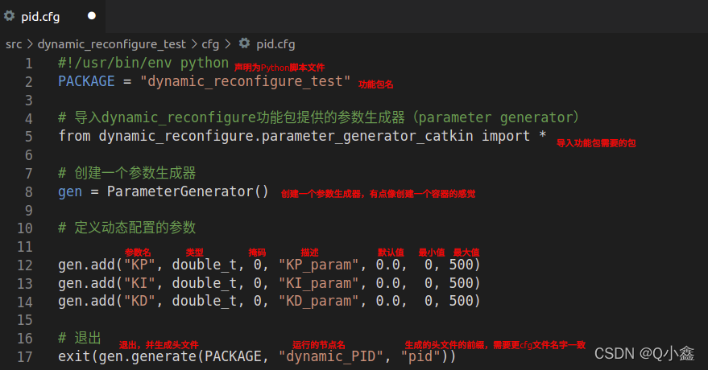
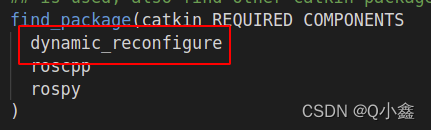
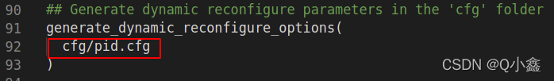

# 动态调参

> https://blog.csdn.net/qq_42108414/article/details/124308076

可以通过rqt在线修改部分参数


## 编写配置文件

### 新建cfg文件

```python
#!/usr/bin/env python
PACKAGE = "dynamic_reconfigure_test"

# 导入dynamic_reconfigure功能包提供的参数生成器（parameter generator）
from dynamic_reconfigure.parameter_generator_catkin import *

# 创建一个参数生成器
gen = ParameterGenerator()

# 定义动态配置的参数
gen.add("KP", double_t, 0, "KP_param", 0.0,  0, 500)
gen.add("KI", double_t, 0, "KI_param", 0.0,  0, 500)
gen.add("KD", double_t, 0, "KD_param", 0.0,  0, 500)


# 退出
exit(gen.generate(PACKAGE, "dynamic_PID", "pid"))
```



 add(name,type,level,description,default,min,max)

- name：参数名，用字符串表示
- type：数据类型，（int_t,double_t,str_t,bool_t）
- level：掩码（可用于查看参数是否修改）默认写0就行
- description：描述，用于描述该参数的作用，简单明了即可~
- default：默认值，设置参数的默认值
- min：参数的最小值
- max：参数的最大值


### 赋予权限

```bash
chmod a+x pid.cfg 
```


### Cmakelist和xml

**cmakelist**

添加包

在find_package和catkin_package

```c 
dynamic_reconfigure
```



添加编译指令




**xml**

```c
<depend>dynamic_reconfigure</depend>
```

之后进行编译


### 代码编写

inlcude包名下的config

```c
#include <rm_chassis_controllers/QRConfig.h>
```


准备服务端

```c
private:
// dynamic reconfigure
  double q_dynamic_[STATE_DIM], r_dynamic_[CONTROL_DIM];
  bool dynamic_reconfig_initialized_ = false;
dynamic_reconfigure::Server<rm_chassis_controllers::QRConfig>* reconf_server_;
```


配置服务端

```c
void BalanceController::initStaticConfig(ros::NodeHandle& nh)
{
  // Init dynamic reconfigure
  reconf_server_ = new dynamic_reconfigure::Server<rm_chassis_controllers::QRConfig>(ros::NodeHandle("~/qr"));
  dynamic_reconfigure::Server<rm_chassis_controllers::QRConfig>::CallbackType cb =
      boost::bind(&BalanceController::reconfigCB, this, _1);
  reconf_server_->setCallback(cb);
}

void BalanceController::reconfigCB(rm_chassis_controllers::QRConfig& config)
{
  ROS_INFO("Dynamic configure QR changed.");
  if (!dynamic_reconfig_initialized_)
  {
    config.q_element = 0;
    config.q_value = q_dynamic_[0];
    config.r_element = 0;
    config.r_value = r_dynamic_[0];
    dynamic_reconfig_initialized_ = true;
  }
  q_dynamic_[config.q_element] = config.q_value;
  r_dynamic_[config.r_element] = config.r_value;
}
```


## 问题

- 写成server和数据对象写成static形式运行会导致插件加载错误

之前是参照rm_track写的，track和控制器不一样，并不是插件，写成插件的server对象也许不能申明成静态形式
