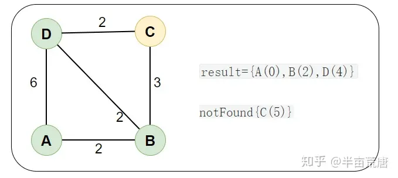

# 机器人路径规划与轨迹优化

> [bilibili](https://www.bilibili.com/video/BV1yT4y1T7Eb/?spm_id_from=333.1007.top_right_bar_window_custom_collection.content.click&vd_source=782af047fbca87ac3084937682017138)


# 路径规划

## 基于搜索

### Dijkstra

> Dijkstra 算法是求一个图中一个点到其他所有点的最短路径的算法
>
> [知乎](https://zhuanlan.zhihu.com/p/338414118)

**要点**

每次从 「未求出最短路径的点」中 **取出** 距离起点 **最小路径的点**，以这个点为桥梁 **刷新**「未求出最短路径的点」的距离（看不懂没关系，请结合案例理解）


**案例**

以 A 点为顶点，求到其他点的最短路径。


画出领接矩阵图，表示任意两个点的距离

```c
int[][] graph = new int[][]{
{0 , 2, ∞, 6}
{2 , 0, 3, 2}
{∞ , 3, 0, 2}
{6 , 2, 2, 0}};
```

**核心：**

- **result：** **已求出** 最小路径的顶点
- **notFound： ** **未求出** 最小路径的顶点，里面的值是 **到起点的距离**

初始，`result={A(0)}` 中只有起点 A，`notFound={B(2),C(∞),D(6)}` 中是除了 A 点的其他点，里面的值是到起点的距离（例如 B(2) 代表 B点到起点的距离为 2）


**然后，从「未求出最短路径的点」notFound 中取出 最短路径的点 B(2) ，然后通过 B(2) 为桥梁 刷新「未求出最短路径的点」的距离**

1. **取出最短路径的点：**

从「未求出最短路径的点」notFound 中取出 最短路径的点 B(2)，放入结果 result 中，结果如下：

「未求出最短路径点」 `notFound={C(∞),D(6)}`，「已求出最短路径的点 」`result={A(0),B(2)}`

1. **刷新距离**：

通过 B(2) 为桥梁，刷新距离。

例如 `AD = 6 < AB + BD = 4` 以 B(2) 为桥梁的距离更短，就刷新「未求出最短路径点」D(6) 的距离为 D(4)

```
notFound={C(∞),D(4)}
```

同理刷新 C(∞) 的距离为 C(5) ，最后结果如下：

「未求出最短路径点」 `notFound={C(5),D(4)}` ，「已求出最短路径的点」``result={A(0),B(2)}` `


**然后，从「未求出最短路径的点」notFound 中取出 最短路径的点 D(4) ，然后通过 D(4) 为桥梁 刷新「未求出最短路径的点」的距离**

同理，最后结果如下：

「未求出最短路径点」 `notFound={C(5)}` ，「已求出最短路径的点」`result={A(0),B(2),D(4)}`





**然后,从「未求出最短路径的点」notFound 中取出 最短路径的点 C(5) ，算法结束**

**`result={A(0),B(2),D(4),C(5)}` 就是最终所求的最短距离**


```java
public class Dijkstra {
    public static int[] dijkstra(int[][] graph,int startVertex){
        //初始化 以求出最短路径的点 result[]
        int length = graph.length;
        int[] result = new int[length];
        for (int i = 0; i < length; i++) {
            result[i] = -1;
        }
        result[startVertex] = 0 ;
        // 初始化 未求出最短路径的点 notFound[]
        int[] notFound = new int[length];
        for (int i = 0; i < length; i++) {
            notFound[i] = graph[startVertex][i];
        }
        notFound[startVertex] = -1;
        // 开始 Dijkstra 算法
        for (int i = 1; i < length; i++) {
            //1. 从「未求出最短路径的点」notFound 中取出 最短路径的点
            //1.1 找到最短距离的点
            int min = Integer.MAX_VALUE;
            int minIndex = 0;
            for (int j = 0; j < length; j++) {
                if (notFound[j] > 0 && notFound[j] < min){
                    min = notFound[j];
                    minIndex = j;
                }
            }
            //1.2 将最短距离的点 取出 放入结果中
            result[minIndex] = min;
            notFound[minIndex] = -1;
            //2. 刷新 「未求出最短距离的点」 notFound[] 中的距离
            //2.1 遍历刚刚找到最短距离的点 (B) 的出度 (BA、BB、BC、BD)
            for (int j = 0; j < length; j++) {
                // 出度可通行(例如 BD:graph[1][3]  > 0)
                // 出度点不能已经在结果集 result中(例如 D: result[3] == -1)
                if (graph[minIndex][j] > 0
                && result[j] == -1){
                    int newDistance = result[minIndex] + graph[minIndex][j];
                    //通过 B 为桥梁，刷新距离
                    //（比如`AD = 6 < AB + BD = 4` 就刷新距离）（ -1 代表无限大）
                    if (newDistance < notFound[j] || notFound[j]==-1){
                        notFound[j] = newDistance;
                    }
                }
            }

        }
        return result;
    }
    /** 测试案例 */
    public static void main(String[] args) {
        char[] vertices = new char[]{'A','B','C','D'};
        int[][] graph = new int[][]{
                {0, 2, -1, 6}
                , {2, 0, 3, 2}
                , {-1, 3, 0, 2}
                , {6, 2, 2, 0}};
        int[] dijkstra = dijkstra(graph, 0);
        for (int i : dijkstra) {
            System.out.println(i);
        }
    }
}
```


#### 应用于栅格地图

> 图上的是图论方式的路径规划，当应用于栅格地图时会有所不同


将地图栅格化后，有三类点：障碍物点，未探索的点，已探索的点

程序在运行中，会存下地图每一个点下的最短路径，直到探索到被标记为目标点的点，提取出该点的路径并输出


**伪代码**

```c++
arr<std::vector<Data>> map_info;//存下整个地图的所有点的数组，为axb的矩阵，内部为vecotr，分别存储该点类型，cost花费和路径数组(也可以是父节点)
vector<std::vector<Data>> record; //存下下一次的点 (open_list) 在视觉上这是路径的边缘点
vector<std::vector<Data>> colse; //存下已保存的点 (close_list)
point target={a,b}; //目标点坐标
bool flag=false; //探索结束的标志为

开始
    生成起点std::vector<Data> factor;//起始点，类型是已探索的点，cost是0,路径是该点坐标[a,b]
	record.push_back(factor); //存下该点

	while(!flag)
    {
        for i:record.size() //探索所有走过的点
        {	
            //检查该点附近(八邻域)的点
           	//如果是未探索点，写入
            else if(map_info[record(i).x-1][record(i).y].type==type::no_explore)
            {
                factor.x = record(i).x-1;
                factor.y = record(i).y;
                factor.cost = record(i).cost+1; //由于路径是基于当前点到其邻域的，所以是其cost+1(如果是斜走，则是1.414)
                							    //为了加速运算，可以改为整数cost，使用10和14来替代1和1.414
                
                type::path path= record(i).path; //生成一段路径
                path.push_back(factor.x，factor.y);//写入当前点
                facotr.path = path;//载入路径
                factor.type=type::has_explore;//将该点标记为已探索
                
                map_info[record(i).x-1][record(i).y] = factor;
                record.push_back(map_info[record(i).x-1][record(i).y]);//放入open_list,等待下一次遍历
            }
            //如果是已探索点，以基于该点的路径和当前路径做比较，看哪个更短
            else if(map_info[record(i).x-1][record(i).y].type==type::has_explore)
            {
                factor.x = record(i).x-1;
                factor.y = record(i).y;
                factor.cost = record(i).cost+1; //由于路径是基于当前点到其邻域的，所以是其cost+1
                
                //如果花费更少，则更新该节点路径
                if(fator.cost<map_info[record(i).x-1][record(i).y].cost)
                {
                    type::path path= record(i).path; //生成一段路径
                    path.push_back(factor.x，factor.y);//写入当前点
                    facotr.path = path;//载入路径
                    
                    map_info[record(i).x-1][record(i).y] = factor;
                    
                    //在这里想办法找到record的该点的索引并更新数据
                    ... 
                }
                else
                    continue;//不更新点
            }
            //如果是障碍，则给一个很大的cost
            else if(map_info[record(i).x-1][record(i).y].type==type::block)
            {
                ...
            }
            //其他的七个点
            if(map_info[record(i).x][record(i).y-1].type==type::no_explore)
                ...
            if(map_info[record(i-1).x+1][record(i).y].type==type::no_explore)
                ...
            ...
                
            //将该点从open_list中移出并放入close_list
        }
        
        
        //结束条件：检查目标点是否被探索到,是的话结束
        //也可以在探索完全部地图后结束，以考虑多路径情况
        if(map_info[target.x][target.y].type==type::has_explore)
        {
            flag = true;
        }
    }

print(map_info[target.x][target.y].cost,map_info[target.x][target.y].path);//输出花费和路径
```


### A*

> A*（念做：A Star）算法是一种很常用的路径查找和图形遍历算法。它有较好的性能和准确度。本文在讲解算法的同时也会提供Python语言的代码实现，并会借助matplotlib库动态的展示算法的运算过程。
>
> A*算法最初发表于1968年，由Stanford研究院的Peter Hart, Nils Nilsson以及Bertram Raphael发表。它可以被认为**是Dijkstra算法的扩展**。
>
> 由于借助==启发函数==的引导，A*算法通常拥有更好的性能。
>
> [CSDN](https://blog.csdn.net/Zhouzi_heng/article/details/115035298)

A*和Dijikstra的不同在于，加入了启发函数，通过这个函数可以判断哪一个节点是下一次遍历的最优节点


**启发函数**
$$
F(n) = G(n) + H(n)
$$
其中：

G 是起点 A 移动到指定方格的移动代价(沿着到达该方格而生成的路径),这也是Dijikstra算法的路径

H = 从指定的方格移动到终点 B 的估算成本。这个通常被称为试探法


路径产生的过程：反复遍历 open list ，选择 F 值最小的方格


**所有步骤**

（1）     把起点加入 open list 。

（2）     重复如下过程：

​            a.     遍历 open list ，查找 F 值最小的节点，把它作为当前要处理的节点。

​            b.     把这个节点移到 close list 。

​            c.     对当前方格的 8 个相邻方格的每一个方格？      

​                     ◆   如果它是不可抵达的或者它在 close list 中，忽略它。否则，做如下操作。

​                     ◆   如果它不在 open list 中，把它加入 open list ，并且把当前方格设置为它的父亲，记录该方格的 F ， G 和 H 值。

​                     ◆   如果它已经在 open list 中，检查这条路径 ( 即经由当前方格到达它那里 ) 是否更好，用 G 值作参考。更小的 G 值表示这是更好的路径。如果是这样，把它的父亲设置为当前方格，并重新计算它                                的 G 和 F 值。如果你的 open list 是按 F 值排序的话，改变后你可能需要重新排序。

​             d.     停止，当你

​                     ◆   把终点加入到了 open list 中，此时路径已经找到了，或者

​                     ◆   查找终点失败，并且 open list 是空的，此时没有路径。

（3）     保存路径。从终点开始，每个方格沿着父节点移动直至起点，这就是你的路径


## 基于概率

### RRT


### RRT*


### Informd RRT*


## 基于智能算法

###  遗传算法


### 蚁群算法


# 轨迹优化

## 优化表示

### 多项式曲线


### 贝塞尔曲线


## 优化目标

### 最小化snap


### 轨迹长度


## 约束

### 软约束


### 硬约束