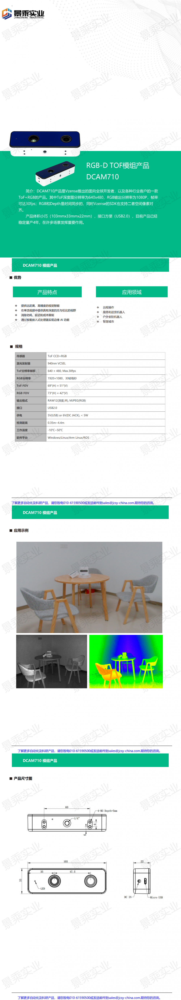

# 深度相机


## PICO Zense DCAM710

> 1. PICO Zense官网：https://www.picozense.com/
> 2. PICO Zense DCAM710产品页面：https://www.picozense.com/product/dcam710
> 3. PICO Zense DCAM710技术规格表：https://www.picozense.com/file/upload/2021/06/04/20210604145355564561.pdf
> 4. PICO Zense DCAM710用户手册：https://www.picozense.com/file/upload/2021/08/05/20210805154858787958.pdf
> 5. PICO Zense DCAM710在ROS中使用的软件包：https://github.com/Black-Mirror-Team/Pico-Zense-SDK-ROS
> 6. PICO Zense DCAM710在ROS Answers上的讨论：https://answers.ros.org/questions/scope:all/sort:activity-desc/tags:pico-zense/page:1/
>
> [销售网站](https://www.china.cn/tuxiangchuanganqi/5148624474.html)

### 简介




### ToF原理

> [CSDN](https://ethanli.blog.csdn.net/article/details/104299151?spm=1001.2101.3001.6650.1&utm_medium=distribute.pc_relevant.none-task-blog-2%7Edefault%7ECTRLIST%7ERate-1-104299151-blog-121817072.235%5Ev27%5Epc_relevant_3mothn_strategy_and_data_recovery&depth_1-utm_source=distribute.pc_relevant.none-task-blog-2%7Edefault%7ECTRLIST%7ERate-1-104299151-blog-121817072.235%5Ev27%5Epc_relevant_3mothn_strategy_and_data_recovery&utm_relevant_index=2)


### 环境配置

> 常规：https://baidudanao.blog.csdn.net/article/details/106197650
>
> https://ai.baidu.com/forum/topic/show/957536
>
> https://blog.csdn.net/qq_30396367/article/details/90448587

- 安装 gcc，g++，make 等工具；直接使用 ubuntu 自带的管理工具 apt-get安装即可。


- 安装 v4l （video4linux）相关工具

```c
sudo apt-get install v4l-utils

v4l2-ctl --list-devices //查看当前系统能够识别出来的视频设备列表。
```


- 安装 VDPAU（Video Decode and Presentation API for Unix），安装 libvdpau-dev 及 vdpauinfo。运行 vdpauinfo 查看，电脑是否支持 vdpau。


安装后摄像头还是读不到视频数据，但是电脑能识别摄像头并读取型号信息，在代码中发现读取视频流的函数执行时间会超过0.3秒导致状态显示超时，这也许和驱动有关，在CSDN发现linux不支持摄像头似乎是共性。

可能的解决思路:  用UVC

> https://blog.csdn.net/jningwei/article/details/79945300
>
> [调用](https://huaweicloud.csdn.net/63566701d3efff3090b5d7b5.html?spm=1001.2101.3001.6650.1&utm_medium=distribute.pc_relevant.none-task-blog-2~default~CTRLIST~activity-1-123078685-blog-79945300.235^v29^pc_relevant_default_base&depth_1-utm_source=distribute.pc_relevant.none-task-blog-2~default~CTRLIST~activity-1-123078685-blog-79945300.235^v29^pc_relevant_default_base&utm_relevant_index=2)
>
> [UVC](http://www.ideasonboard.org/uvc/)