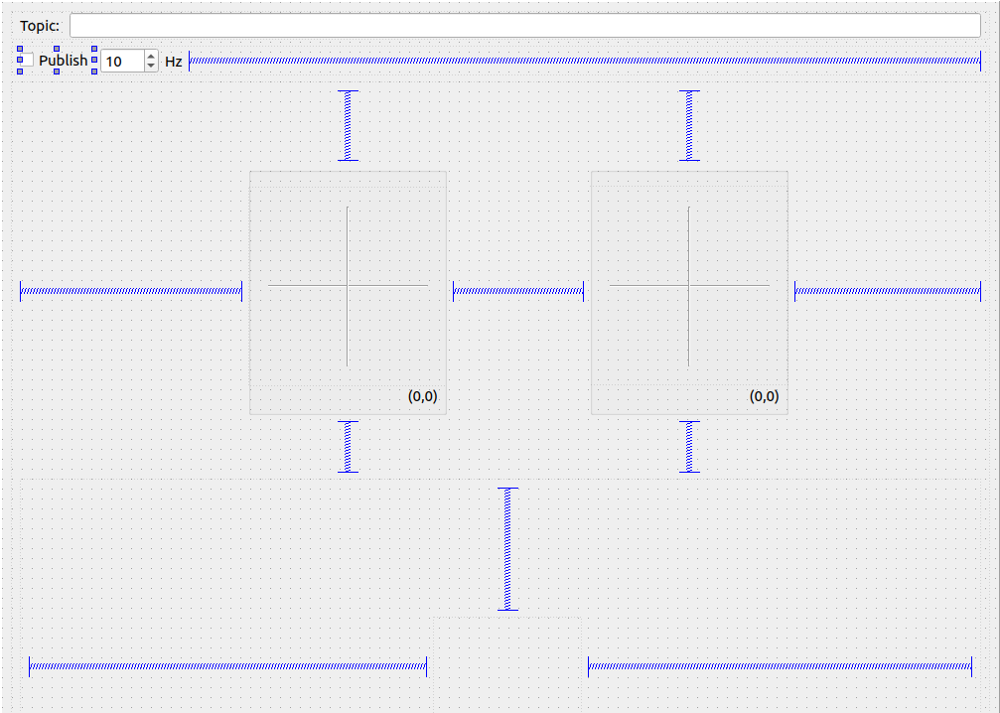

# 自定义rqt插件

> https://it.cha138.com/javascript/show-95604.html


## 创建包文件

> https://blog.csdn.net/handsome_for_kill/article/details/104587804

创建一个自定义rqt插件的包文件结构

```c
- rqt_mypkg (mypkg是你自己定义的插件名称)
- - resource
	- > mypkg.ui
- - src
	- rqt_mypkg
		- >  __init__.py
		- >  mypkg.py
		- >  mypkg_widget.py
		- >  ***.py
		- >  ...
- - scripts
	- > rqt_mypkg (也是python文件,但后缀名没有加.py)
- > CMakeLists.txt
- > package.xml
- > plugin.xml
- > setup.py
```


## package.xml

找到`<export>`标签, 在里面增加一行: `<rqt_gui plugin="${prefix}/plugin.xml"/>`

```c
   1 <package>
   2   :
   3   <!-- all the existing tags -->
   4   <export>
   5     <rqt_gui plugin="${prefix}/plugin.xml"/>
   6   </export>
   7   :
   8 </package>
```


## plugin.xml

该参数会在插件运行时被调用.

```c
   1 <library path="src">
   2   <class name="My Plugin" type="rqt_mypkg.my_module.MyPlugin" base_class_type="rqt_gui_py::Plugin">
   3     <description>
   4       An example Python GUI plugin to create a great user interface.
   5     </description>
   6     <qtgui>
   7       <!-- optional grouping...
   8       <group>
   9         <label>Group</label>
  10       </group>
  11       <group>
  12         <label>Subgroup</label>
  13       </group>
  14       -->
  15       <label>My first Python Plugin</label>
  16       <icon type="theme">system-help</icon>
  17       <statustip>Great user interface to provide real value.</statustip>
  18     </qtgui>
  19   </class>
  20 </library>
```

> - name: 定义包的名字, 这个没有什么特殊作用, 只要不能冲突, 可以自己随便取
> - type:  格式必须为package.module.class, package是src文件夹下的子文件夹的名字, 根据我们上文第二部分可知,  是rqt_mypkg(但这个文件夹名字是可以自由定义的).  module是这个src/rqt_mypkg文件夹下核心的那个python文件的名字, 即mypkg,  class是mypkg.py这个文件中定义的那个类的名字.
> - base_class_type: 这个参数不需要改动
> - description: 插件的介绍
> - qtgui: 这个标签底下的所有参数都是用来描述在rqt_gui软件界面的状态栏中如何显示我们创建的Plugin的名称和图标
> - qtgui->group: 将我们创建的Plugin分组
> - qtgui->label: Plugin的名称
> - qtgui->icon: Plugin的图标
> - qtgui->statustip: 鼠标悬浮在Plugin图标上时, 出现的提示内容


## setup.py

我们运行插件的时候需要导入一些写好的模块,我们需要将这些模块给移动(安装)到PYTHONPATH的路径中去, 这时候就需要setup.py这个文件.
 **实例如下:**

```python
# # ! DO NOT MANUALLY INVOKE THIS setup.py, USE CATKIN INSTEAD

from distutils.core import setup

from catkin_pkg.python_setup import generate_distutils_setup

# fetch values from package.xml
setup_args = generate_distutils_setup(
    packages=['rqt_virtual_dbus'],# 这里指的是src文件夹下的那个文件夹
    package_dir={'': 'src'},
    requires=['std_msgs', 'roscpp']
)

setup(**setup_args)
```

在这之后，只要 `source devel/setup.bash`之后, 就可以运行


## Cmakelist.txt

1. 取消`catkin_python_setup()`这句话的注释, 这一句话是配合刚才的setup.py这个文件的, 只有取消注释这句话以后, 当运行`catkin_make`命令时, 才会运行setup.py这个文件
2. 修改:

```cmake
cmake_minimum_required(VERSION 2.8.3)
project(rqt_example_cpp)

find_package(catkin REQUIRED COMPONENTS
  roscpp
  roslint
  rqt_gui
  rqt_gui_cpp
  std_msgs
)

if("$qt_gui_cpp_USE_QT_MAJOR_VERSION " STREQUAL "5 ")
  find_package(Qt5Widgets REQUIRED)
else()
  find_package(Qt4 COMPONENTS QtCore QtGui REQUIRED)
  include($QT_USE_FILE)
endif()

catkin_python_setup()

roslint_cpp()

catkin_package(
#  INCLUDE_DIRS include
  LIBRARIES $PROJECT_NAME
  CATKIN_DEPENDS roscpp rqt_gui_cpp std_msgs
#  DEPENDS system_lib
)


set (rqt_example_cpp_SRCS
  src/rqt_example_cpp/my_plugin.cpp
)

set(rqt_example_cpp_HDRS
  include/rqt_example_cpp/my_plugin.h
)

set(rqt_example_cpp_UIS
  src/rqt_example_cpp/my_plugin.ui
)

if("$qt_gui_cpp_USE_QT_MAJOR_VERSION " STREQUAL "5 ")
  qt5_wrap_cpp(rqt_example_cpp_MOCS $rqt_example_cpp_HDRS)
  qt5_wrap_ui(rqt_example_cpp_UIS_H $rqt_example_cpp_UIS)
else()
  qt4_wrap_cpp(rqt_example_cpp_MOCS $rqt_example_cpp_HDRS)
  qt4_wrap_ui(rqt_example_cpp_UIS_H $rqt_example_cpp_UIS)
endif()

include_directories(
  include
  $CMAKE_CURRENT_BINARY_DIR/..
  $catkin_INCLUDE_DIRS
)

add_library($PROJECT_NAME
    $rqt_example_cpp_SRCS
    $rqt_example_cpp_MOCS
    $rqt_example_cpp_UIS_H
    )

target_link_libraries($PROJECT_NAME
  $catkin_LIBRARIES
)

if("$qt_gui_cpp_USE_QT_MAJOR_VERSION " STREQUAL "5 ")
  target_link_libraries($PROJECT_NAME Qt5::Widgets)
else()
  target_link_libraries($PROJECT_NAME $QT_QTCORE_LIBRARY $QT_QTGUI_LIBRARY)
endif()
```

通过上述两步操作以后, 才可以通过: `rosrun rqt_mypkg rqt_mypkg`来运行我们创建的Plugin.

### 

## resource -> mypkg.ui

这个是Qt中用于描述界面组件布局的文件, 在RQT插件的工程中被放在resource文件夹下. 这个文件可以通过Qt Creator的图形化界面来制作.

这个文件是用xml语言写的, 但是并不需要我们直接去写代码, 可以用Qt Creator设计并保存.

> 需要注意一点,上述代码的第4行`<widget class="QWidget" name="Form">`, 顶层的widget必须是QWidget. 有的时候用Qt Creator设计出来的界面, 顶层的widget默认是QMainWindow, 那么就需要在代码里把QMainWindow改成QWidget.


## scripts -> rqt_mypkg

这个文件就是Plugin的主入口, 我们通过调用这个文件从而开始运行Plugin.
 **实例如下:**

```python
   1 #!/usr/bin/env python
   2 
   3 import sys
   4 
   5 from rqt_mypkg.my_module import MyPlugin
   6 from rqt_gui.main import Main
   7 
   8 plugin = 'rqt_mypkg'
   9 main = Main(filename=plugin)
  10 sys.exit(main.main(standalone=plugin))
```

这里的Main是rqt[框架](https://so.csdn.net/so/search?q=框架&spm=1001.2101.3001.7020)下的一个类, 我们这里告诉它包含我们的plugin这个包的名字是’rqt_mypkg’, 然后它会自动去’rqt_mypkg’这个包下面找到plugin.xml文件, 然后根据这两个文件中定义的参数来运行和调用我们写好的界面程序.
 所以, 这个程序除了`plugin = 'rqt_mypkg'`这句话需要修改包的名称以外, 其余地方都不需要改动. 但是, 前提是你必须写对了plugin.xml这个文件.


## src->rqt_mypkg->**init**.py

这个文件是用来标识这个文件夹下是一个函数模块, 可供导入调用. 这个文件中不需要写任何内容.


## 

## src->rqt_mypkg->mypkg.h


```c++
#ifndef RQT_EXAMPLE_CPP_MY_PLUGIN_H
#define RQT_EXAMPLE_CPP_MY_PLUGIN_H

#include <rqt_gui_cpp/plugin.h>
#include <rqt_example_cpp/ui_my_plugin.h>
#include <QWidget>

namespace rqt_example_cpp


class MyPlugin
  : public rqt_gui_cpp::Plugin

  Q_OBJECT
public:
  MyPlugin();
  virtual void initPlugin(qt_gui_cpp::PluginContext& context);
  virtual void shutdownPlugin();
  virtual void saveSettings(qt_gui_cpp::Settings& plugin_settings,
      qt_gui_cpp::Settings& instance_settings) const;
  virtual void restoreSettings(const qt_gui_cpp::Settings& plugin_settings,
      const qt_gui_cpp::Settings& instance_settings);

  // Comment in to signal that the plugin has a way to configure it
  // bool hasConfiguration() const;
  // void triggerConfiguration();
private:
  Ui::MyPluginWidget ui_;
  QWidget* widget_;
;
  // namespace rqt_example_cpp
#endif  // RQT_EXAMPLE_CPP_MY_PLUGIN_H
```


## src->rqt_mypkg->mypkg.cpp

这个文件定义了我们自己的Plugin类, 这个类继承于Plugin类.

> - 1.注意这个类的名字, 它的名字要和plugin.xml的type属性的定义一致, 否则会报错.
> - 2.这个类继承于Plugin类, 所有的RQT插件都是继承于这个类的子类.
> - 3.RQT的编程中, 虽然所有Qt中的部件都是由python_qt_binding导入的, 但实际上所有的用法都与PyQt完全一模一样, 编写程序时只需要对照PyQt的文档编写即可.
> - 4.程序的第29,31和33行是读取ui文件, 注意写RQT插件需要事先定义好ui文件, 而不能之间在程序里编写界面. 另外, 31行用于查找ui文件路径的代码, 之所以写得这么复杂,  也是为了用户可以在任何路径下运行这个文件都不会产生找不到ui文件的错误.
> - 5.程序的第41-44行不能删除, 这是用于协调多个Plugin运行在同一个RQT GUI界面的情况. 另外, 第44行是把当前的插件添加到RQT GUI的界面中.
> - 6.函数shutdown_plugin, save_settings, restore_settings都是原Plugin类定义好的函数, 可以根据需要自行重载.

```c++
#include "rqt_example_cpp/my_plugin.h"
#include <pluginlib/class_list_macros.h>
#include <QStringList>

namespace rqt_example_cpp


MyPlugin::MyPlugin()
  : rqt_gui_cpp::Plugin()
  , widget_(0)

  // Constructor is called first before initPlugin function, needless to say.

  // give QObjects reasonable names
  setObjectName("MyPlugin");


void MyPlugin::initPlugin(qt_gui_cpp::PluginContext& context)

  // access standalone command line arguments
  QStringList argv = context.argv();
  // create QWidget
  widget_ = new QWidget();
  // extend the widget with all attributes and children from UI file
  ui_.setupUi(widget_);
  // add widget to the user interface
  context.addWidget(widget_);


void MyPlugin::shutdownPlugin()

  // unregister all publishers here


void MyPlugin::saveSettings(qt_gui_cpp::Settings& plugin_settings,
    qt_gui_cpp::Settings& instance_settings) const

  // instance_settings.setValue(k, v)


void MyPlugin::restoreSettings(const qt_gui_cpp::Settings& plugin_settings,
    const qt_gui_cpp::Settings& instance_settings)

  // v = instance_settings.value(k)


/*bool hasConfiguration() const

  return true;


void triggerConfiguration()

  // Usually used to open a dialog to offer the user a set of configuration
*/

  // namespace rqt_example_cpp
//PLUGINLIB_DECLARE_CLASS(rqt_example_cpp, MyPlugin, rqt_example_cpp::MyPlugin, rqt_gui_cpp::Plugin)
PLUGINLIB_EXPORT_CLASS(rqt_example_cpp::MyPlugin, rqt_gui_cpp::Plugin)
```

## 编译运行 

cd ~/pcl_ws/

catkin_make

rosrun rqt_mypkg rqt_mypkg

或rqt -s rqt_mypkg (-s, 指的是standalone)

如果没有找到试试 rqt --force-discover


# rqt虚拟遥控器

> 一个使用在rm的虚拟遥控器，方便在没有实体遥控器时替代

拥有两个虚拟摇杆，一个虚拟开关，一个话题发布开关，一个Hz控制器，一个话题名称设置框



需要设置一系列信号与槽，控制话题循环发布，话题名称设置等功能


## 问题

### .ui怎么变成.h

在传统ui设计中，用qt creator创建的.ui文件会自动生成一个.h头文件，但现在我们只需要一个.ui提供给自定义的界面。

生成的方法就是配置好包后在clion编译一下就有了


## 下滑框转拨杆

- 下滑框阶段性滑下

滑块是平滑移动的，现在要求有段落感，所以在函数中实时改变位置

```c++
QScrollBar* scrollBar = new QScrollBar(Qt::Horizontal);
scrollBar->setRange(0, 100);
int middlePosition = 50;
scrollBar->setValue(middlePosition);
```


- 滑块大小改变

可以使用QScrollBar的`setStyleSheet()`函数来自定义滑块的宽度。具体来说，可以使用`width`属性来设置滑块的宽度，例如：

```c++
QScrollBar::handle:horizontal {
    width: 50px;
}

QScrollBar::handle:vertical{
	background-color:rgba(59,103,168,190);
	border-radius:7px;
	width:13px;
}
//能改的还有很多
//https://blog.csdn.net/m0_51668269/article/details/121128185
```

这将设置水平滑块的宽度为50像素。同样的，可以使用`height`属性来设置垂直滑块的高度。注意，这只是一个示例，您可以根据自己的需要进行修改。

使用方法：

> `QScrollBar::handle:horizontal` 是Qt样式表中的一个选择器，它用于设置水平滚动条的滑块样式。如果您直接在代码中使用这个选择器，会因为语法错误而报错。

使用这个选择器的正确方法是，将它与样式表中的其他属性一起使用。例如，以下代码设置水平滚动条的滑块宽度为50像素：

```
cpp
QString styleSheet =
    "QScrollBar::handle:horizontal {"
    "   width: 50px;"
    "}";
scrollBar->setStyleSheet(styleSheet);
```

其中，`scrollBar` 是一个 `QScrollBar` 对象，通过 `setStyleSheet` 方法设置样式表。您可以根据需要添加其他属性，如颜色、边框等