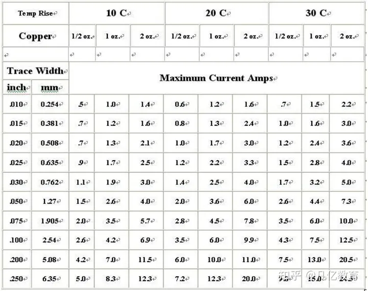
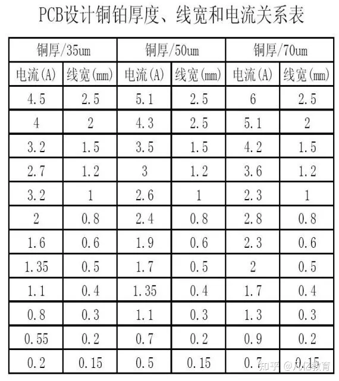

# PCB设计

## 布局

### 线宽

> https://zhuanlan.zhihu.com/p/561292091

最大电流值应该是指在温升限制下的最大允许值，熔断值是温升到达铜的熔点的那个值。Eg. 50mil 1oz 温升 1060 度(即铜熔点)，电流是 22.8A。

**二、PCB 设计铜铂厚度、线宽和电流关系**

在了解 PCB 设计铜铂厚度、线宽和电流关系之前先让我们了解一下 PCB 敷铜厚度的单位盎司、英寸和毫米之间的换算："在很多数据表中，PCB 的敷铜厚度常常用盎司做单位，它与英寸和毫米的转换关系如下：

1 盎司 = 0.0014 英寸 = 0.0356 毫米（mm）

2 盎司 = 0.0028 英寸 = 0.0712 毫米（mm）

盎司是重量单位，之所以可以转化为毫米是因为 pcb 的敷铜厚度是盎司/平方英寸" PCB 设计铜铂厚度、线宽和电流关系表

