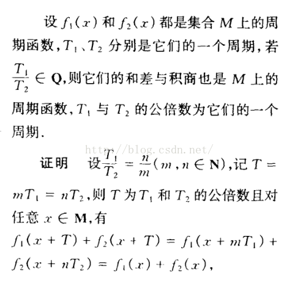
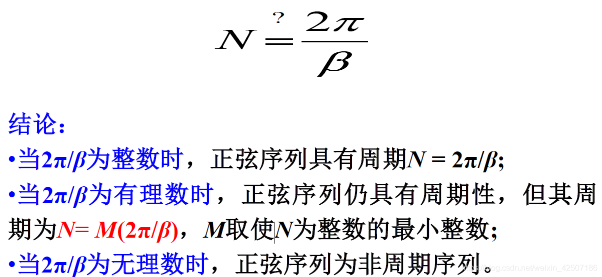
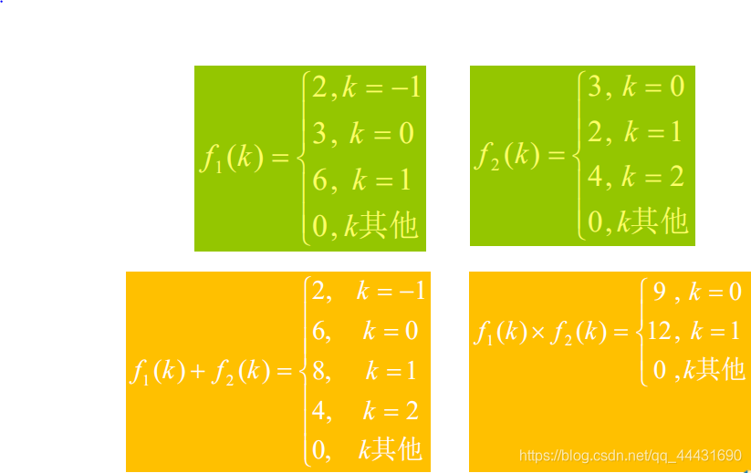

# 信号

> 信号常表示为时间函数(或序列)，函数的图像称为信号的波形。"信号"与"函数(序列)"通常互相通用


## 分类

### 信号的确定性

> 信号分为有确定性信号，随机性信号，伪随机信号。常见信号通常为随机信号，不过确定性信号依然是研究的重要组成部分。


### 信号的定义域

> 根据定义域分为连续信号与离散信号

- 连续信号连续在定义域上，值域不一定要求连续


- 离散信号在非离散的瞬间外的时间是无定义的，并非等于0
- F（k) 类的离散信号也称为**序列**
- 离散信号对应某序号m的序列值称为第m个样点的样值。
- 值域只有0，1的离散信号称为**单位阶跃序列**


### 信号的取样类型

> 信号的自变量：时间或其他量
>
> 信号的幅值：函数值或序列值
>
> 时间和幅值都连续的是模拟信号；时间离散，幅值连续的是抽样信号；时间和幅值都离散的是数字信号

我们接受到的连续信号**时间和幅值都是连续**的，称为模拟信号。数字计算机所处理的信号必须是离散时间信号，所以必须先以**适当的频度**从中抽取其在各时刻的数值，形成抽样信号(**时间离散，幅值连续**)

```c
时间离散，但幅度尚未进行离散，即幅度可取各种值，而非有限值，此时离散信号的幅值是没有误差的，没有经过量化处理，因此其幅度取值值域是连续的。
```

当抽样信号再经过==量化==处理后，我们可以得到**时间和幅值都离散**的数字信号，此时通过==编码==后计算机就可以进行处理了

```c
量化：对时间上离散的信号处理，使其在幅度上也离散，量化是将抽样后的模拟信号用数字表示出来。量化又可以分为均匀量化和非均匀量化，其中非均匀量化对于小信号效果极好。
    
编码：将量化后的信号样值幅度变换成对应的二进制数字信号码组过程。编码方式有很多种，按一定格式记录采样和量化后的数字数据，包括PCM编码等，解码诗编码的逆过程，他们都遵循着固定的编解码方法。 
```


### 信号的实/复类型

> **实信号**：物理可实现的信号常常是时间t（或k）的实函数（或序列），其在各时刻的函数（或序列）值为实数，这样的信号称为实信号。
>  **复信号**：函数（或序列）值为复数的信号称为复信号，最常用的是复指数信号。
>
> [参考](https://blog.csdn.net/qq_45732223/article/details/109165359)

复指数信号的重要特性之一是它对时间的导数和积分仍然是复指数信号。


```c
可见，复指数信号可展开为实，虚部两部分。观察函数形式发现它们实际也是实信号。
    当e的次数的系数，长得像a的那个东西不同时：
    //a>0  增幅振荡
    //a=0  等幅振荡
    //a<0  衰减振荡
    
    当w值不同时：
    //w=0 变成实指数信号
    //a=w=0 直流信号
    
如此，复指数信号概括了许多常用信号
```


离散时间的复指数序列可表示为


```c
该序列的转换形如连续复指数信号的转换，不过是由正(余)弦振荡变成正(余)弦序列
```


### 能量信号与功率信号

> 为了知道信号能量与功率的特性，常常研究信号(电压或电流)在单位电阻上的能量或功率，也称归一化能量或功率。
>
> 对于信号作用的时间，我们首先要明确一点：这两种信号概念是建立在**无穷大的时间**积分的基础上的。
>
> [链接](https://zhuanlan.zhihu.com/p/35363670)

判断一个信号是能量信号还是功率信号，首先需要计算其能量和功率。

对于信号f(t)，其能量为：


其功率为：


为什么要这样定义呢？

可以借助物理上的概念辅助理解一下。对于电阻R，施加电压f(t)，在区间(-∞,+∞)上，其能量就是：


```c
P = U^2 / R
W = P * t
```


通过计算公式，若信号f(t)的能量有界(0<E<正无穷,此时P=0)，称其为能量有限信号，简称能量信号

若功率有界(0<P<正无穷,此时E=无穷大)，则称为功率有限信号，简称功率信号


总结：**能量就是信号的平方在区间(-∞,+∞)上的积分。**

**功率就是能量与“无穷长的时间”的比值。（该表达不严谨，只辅助理解）**


#### 无限长的时间

> 在信号作用时间无限长的基础上，根据信号能量的多少可分为以下：
>
> **有限能量+零功率**
>
> **无穷能量+有限功率**
>
> **无穷能量+无穷功率**


有限能量+零功率 ----->**能量信号**

一个方波


一个极限值为0的波形


无穷能量+有限功率 ----->**功率信号**

一个无限延伸的正弦波


无限长的白噪声


无穷能量+无穷功率----->**非功非能信号**

一个无限延伸的单调波形


总结：**能量有限、功率为零的信号为能量信号。**

**能量无限、功率有限的信号为功率信号。**

**所有有界的周期信号都是功率信号；所有有限数量的脉冲信号都是能量信号。**


## 信号的周期

> 信号 根据 " 周期性 " 进行分类 , 可以分为 " 周期信号 " 和 " 非周期信号 " ;
>
> - **周期信号 :** 信号 有周期规律 , 如 : 正弦波信号 ;
> - **非周期信号 :** 信号 没有周期规律 , 如 : 噪声信号 ;


### 最小公倍数法

> 求周期函数的周期。就是先判断两个周期的比值，如果为有理数，则为周期信号，两个周期的最小公倍数为其周期

例子：

$$asin(t)-bsin(3t)$$

```c
T1=2π/1  T2=2π/3

T1/T2=3:1比值为有理数

T1和T2的最小公倍数为2π，所以这道题的答案：是周期信号，且周期为2π。
```


证明法则




```c
如复合信号中某两个分量频率的比值为无理数，则无法找到合适的m
```


### 角频率法

连续周期信号，t定义在负无穷和正无穷之间

$$F(t) = F(t + mT), m=0, ±1, ±2, ±3 ...$$

离散周期信号

$$F(k) = F(k + mN), m=0, ±1, ±2, ±3 ...$$





- 连续正弦信号一定是周期信号，而正弦序列不一定是周期序列。

```c
正弦序列是正弦信号通过采样得到，如果被采样正弦信号的频率除以采样频率是一个无理数，此时没有T满足重复周期的定义，那么得到的正弦序列就是非周期的
```


-  两连续周期信号之和不一定是周期信号，而两周期序列之和一定是周期序列

```c
例如：sin(x)+sin(πx)通过最小公倍数法证明不是周期信号
周期序列已经通过角频率法验证，它们的周期T1、T2一定是有理数，所以T1/T2一定为有理数，因此周期序列之和一定是周期序列。
```


# 信号的基本运算

[链接](https://zhuanlan.zhihu.com/p/443467304)

## 加法和乘法 

加法


**离散序列相加、乘**




## 反转和平移

> 反褶(反折)：将信号f(t) / f(k)中的t(或k)换为-t(-k)，几何含义是将信号以纵坐标反转。
>
> 平移(移位)：延时或提前信号。
>
> 尺度变换：将信号的横坐标尺寸展宽或压缩
>
> 

```c
【注意】①f（t）→f（at－b）的图像变换可以有两个方法：
方法一：f（t）→f（t－b）→f（at－b），也就是先平移再尺度变换。
方法二：f（t）→f（at－b）→f（t－b），也就是先尺度变换再平移。
```


离散信号通常不做展缩运算，因为f(ak)仅在ak为整数时才有定义，而ak不为整数时会丢失原信号f(k)的信息。


​                                                                    $$信号的反褶 与 尺度变换$$


​                                                                           $$信号的移位$$

````c
一个简单的例子就是f(t)一卷歌曲磁带, f(t-t0)表示t0后开始播放，f(-t)则表示倒带，f(2t)表示以 2倍速加快播放。
我们使用雷达的原理就是计算发射信号后延迟的时间
````

