# 阶跃信号与冲激信号

> 在信号与系统中，经常会碰到函数本身有跳跃点的情况，比如值的突变、尖峰、在某点的导数不存在，这类信号统称为奇异信号。
>
> 有了上述前置运算铺垫，下面引入4类奇异信号：斜变、阶跃、冲激、冲激偶。


## 单位斜变信号

> 又称斜坡函数，斜升函数.是单位跃变函数的积分
>
> 其定义为某一时刻开始按正比例增长的信号，如果斜率为 1 ，则为单位斜边信号：

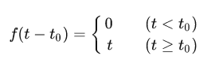

当t>=0，y=t；t<0时，y=0.

作业P33T1.1(1)中的斜变函数tf(t)，含义就是tf(t-0)中的0是跃变的位置。因而t~0~点就是t=0，所以在大于0时为t，小于时为0.


## 单位阶跃信号

> 以符号 u(t) 表示

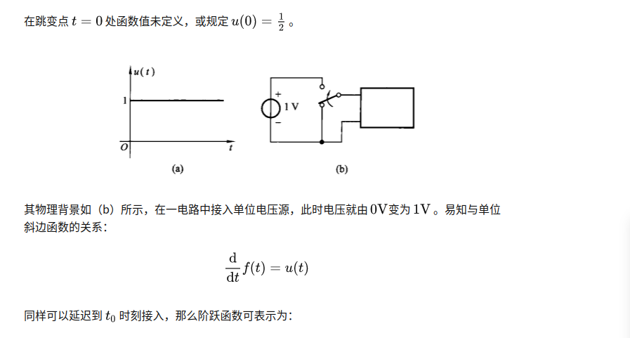

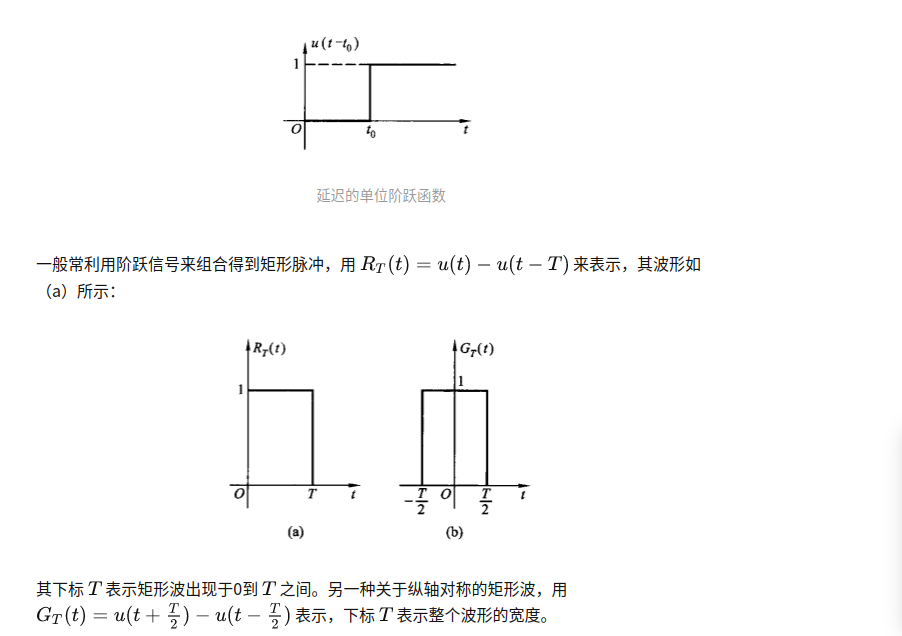

> 在上图的阶跃信号图中，我们可以看到阶跃函数的特点：当n无限增大时，函数u(t)在t=t~0~处跃变为1，其斜率为无限大，通常我们在t=t~0~时刻处的值不予定义。阶跃函数的定义如下

$$u(t) = lim(n正无穷)f(t) = \begin{cases} 0,    t<t0 \\ 1,    t>t0 \end{cases}$$


阶跃函数有一定的用处

- 表示某些信号
- 表示信号的作用区间
- 积分


## 单位冲激信号（狄拉克 函数）

## 

冲激信号g(t)相对于阶跃函数u(t)的特点就是针对面积一样的图形，在宽度无限小下的高度，是一个极限值，类似于阶跃函数在t=t~0~时的斜率

函数定义： $$g(t) = lim(n无穷大)G(t)$$

与阶跃函数是求导关系： $$g(t) = du(t) / d(t)$$

[链接](https://zhuanlan.zhihu.com/p/443467304)

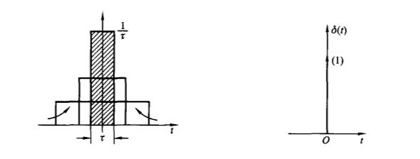

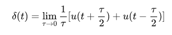

> 这就是冲激函数特点，该函数表示某些物理量在空间或时间坐标上集中于一点的物理现象(质量集中于一点的密度，作用时间趋于0的冲击力，宽度趋于0的电子脉冲)。
>
> 阶跃函数和冲激函数称为==奇异函数==
> 


### 冲激函数的基本性质


**与普通函数相乘**

> 由序号2分析：
>
> 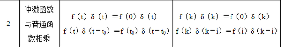
>
> 任一信号在某处N乘以冲激函数f(t-N)，得到的函数是除了无限接近N点的点的点集，其余位置都归0 (因为冲激函数在其他位置为0)


**抽样性质**

> 由序号3分析：
>
> 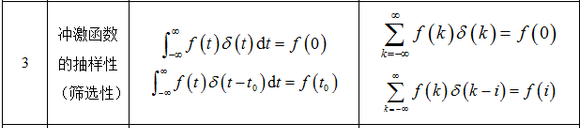
>
> 任一信号在某处N乘以冲激函数f(t-N)，将得到的结果再在时间(-∞,+∞)积分，得到的即是信号在该处的值

在下列函数中即是应用了这一点来求

```c
符号ε(t)、ε(k)分别为单位阶跃函数和单位阶跃序列
符号δ(t)为单位冲激函数
```

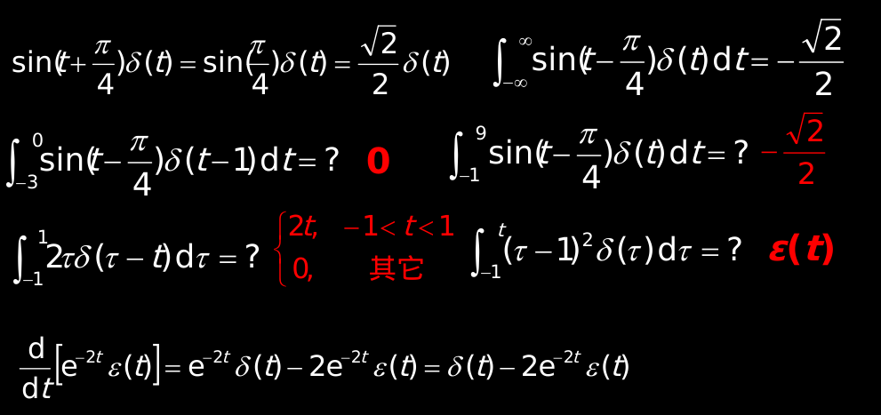


**尺度变换**

> 由序号4分析:
>
> 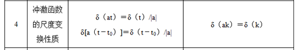
>
> 就是在原冲激函数的基础上展缩，因为是原面积是1，在高度不变的情况下展缩会导致面积变化，即强度变化


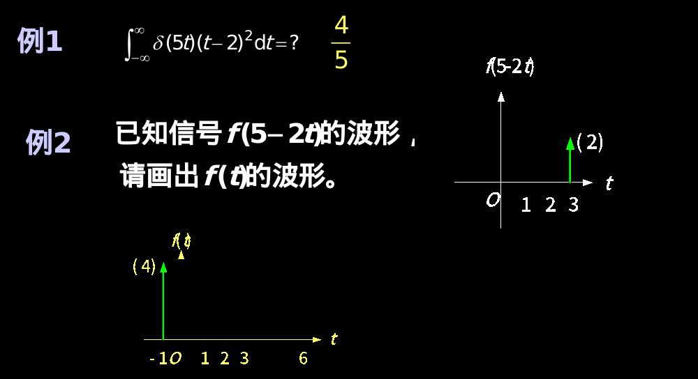

例1：

信号函数(t-2)^2, 在冲激函数δ(t - 0)下获得t=0时的值，再通过δ(5t)的展缩，缩小到原来的1/5


### 冲激偶函数

> 单位冲激偶是这样的一种函数：当t从负值趋于0时，它是一强度为无限大的正的冲激函数，当t从正值趋于0时，它是一强度为无限大的负的冲激函数。<u>冲激偶函数是通过对冲激函数**求导**所得到的。</u>

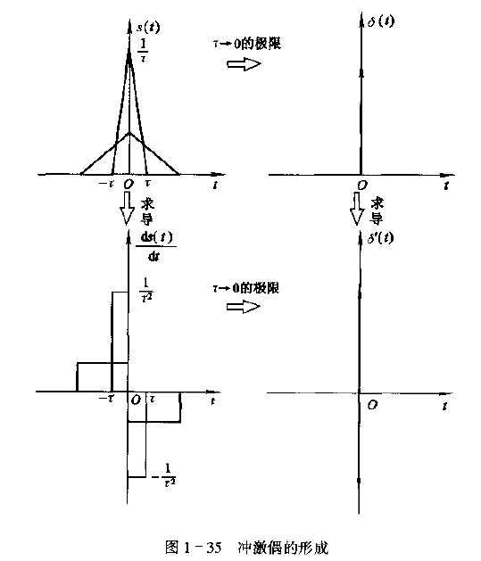


> 由序号5，6，7分析
>
> 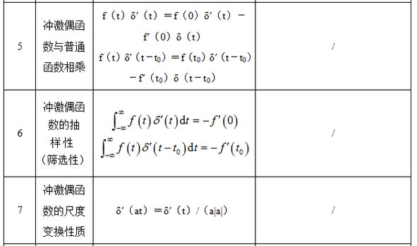
>
> 还待补充
>
> 

冲激偶取样性证明

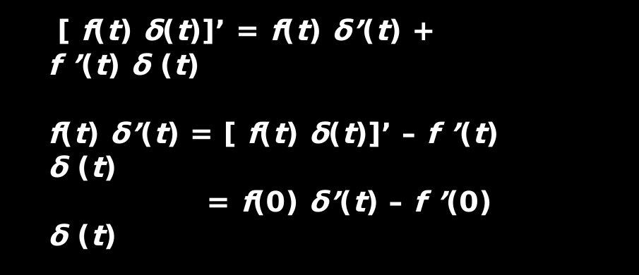

冲激偶积分证明

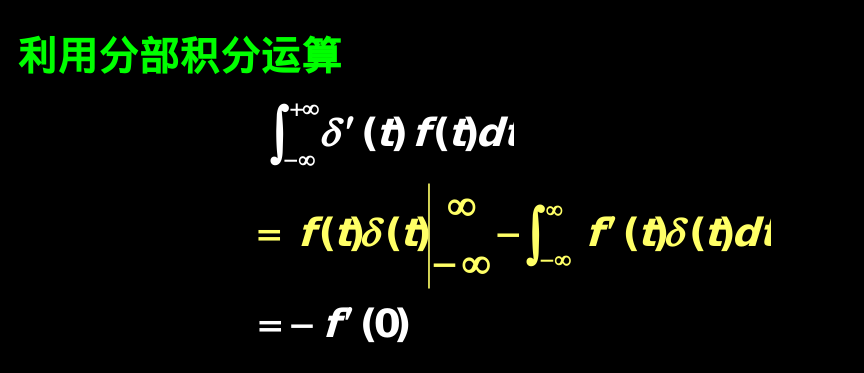


# 常用信号
## 常用连续信号

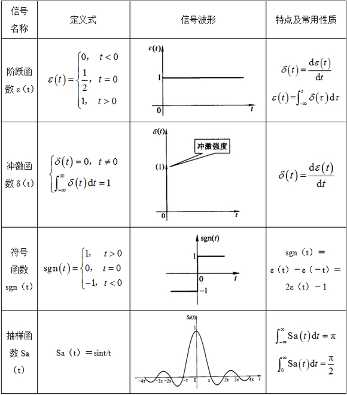

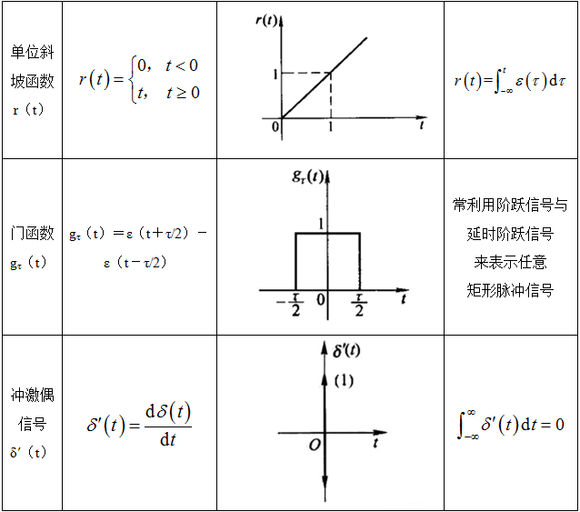


## 常用离散信号

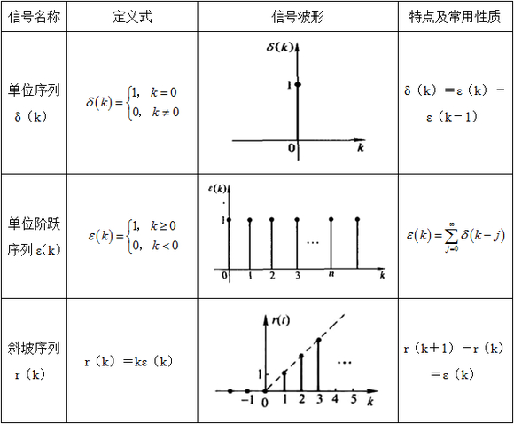
