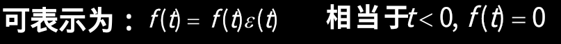

# 系统

> 系统和我们熟知的电路有一定的相似之处

- 具有特定功能的总体，可以看作信号的变换器、处理器。

- 电系统是电子元器件的集合体。
- 电路侧重于局部，系统侧重于整体。电路、系统两词通用。


以下是常见系统

>  连续系统与离散系统
>  动态系统与即时系统
>  单输入单输出系统与多输入多输出系统
>  线性系统与非线性系统
>  时不变系统与时变系统
>  因果系统与非因果系统
>  稳定系统与不稳定系统


## 连续系统与离散系统

>  连续(时间)系统：系统的激励和响应均为连续信号
>
>  离散(时间)系统：系统的激励和响应均为离散信号。
>
>  混合系统：
>         系统的激励和响应一个是连续信号，一个为离散信号。如A/D，D/A变换器。 


## 动态系统与即时系统

> 动态系统也称为记忆系统。
> 若系统在任一时刻的响应不仅与该时刻的激励有关，而且与它过去的历史状况有关，则称为动态系统 或记忆系统。
>
> 含有记忆元件(电容、电感等)的系统是**动态系统**。否则称**即时系统或无记忆系统**。    


## 单输入单输出系统与多输入多输出系统

> 单输入单输出系统：
>     系统的输入、输出信号都只有一个。
>
> 多输入多输出系统：
>     系统的输入、输出信号有多个。


## 线性系统与非线性系统

> 线性系统：指满足线性性质的系统。
>
> 线性性质：==齐次性和可加性==


### 动态系统

> ==动态系统是线性系统的条件==
>
> 动态系统不仅与**激励{ f (·) }**有关，而且与系统的**初始状态{x(0)}**有关。 初始状态也称“内部激励”


- 零输入：在没有外加激励源的t=0时刻，电路在非零初始状态下的响应。例如撤去电源后电容放电
- 零状态：动态元件初始储能为0，仅有电源输入时引起的响应。例如加上电源后电容充电


##  时不变系统与时变系统

> 时不变系统：指满足时不变性质的系统。

时不变性（或移位不变性） ：


自变量偏移，因变量也偏移


### 微分特性和积分特性

>LTS线性时不变系统


## 因果系统与非因果系统

> 指零状态响应不会出现在激励之前的系统。
>
> 即对因果系统，
>     当`t < t0 ，f(t) = 0时，有t < t0 ，yzs(t) = 0`。

- 判断方法

  **输出不超前于输入**


```c
上图左边Yzs延后于f(t)1秒，右边是已有的f(x)积分，没有超前
下图f(t)则超前了1秒
```


**综合举例**


> 这道题的线性齐次那里没看懂

现在看懂了

x(o_)表示初始状态，那么它就和零输入响应有关，因为没有电源所以由动态元件开始作用。因此零输入的线性比例为x(0)~1~ / x(0)~2~

零状态响应的比例，因为齐次关系，在输入信号成比例下，零状态的比例是 f(t)~1~ / f(t)~2~


**因果信号**

> t = 0接入系统的信号称为因果信号。




## 稳定系统与不稳定系统

> 一个系统，若对有界的激励f(.)所产生的零状态响应yzs(.)也是有界时，则称该系统为有界输入有界输出稳定，简称稳定。即 若│f(.)│<∞，其│yzs(.)│<∞ 则称系统是稳定的。

如yzs(k) = f(k) + f(k-1)是稳定系统；而


是不稳定系统，因为，当f(t) =ε(t)有界，t →∞时，它也→∞，无界。


# 系统的数学模型


## 连续系统的解析描述

 图示RLC电路，以uS(t)作激励，以uC(t)作为响应，由KVL和VAR列方程，并整理得二阶常系数线性微分方程。


抽去具有的物理含义，微分方程写成


这个方程也可以描述下面的一个二阶机械减振系统


## 离散系统的解析描述


## 描述LTI系统的是线性常系数差分方程

> 判断方法：
>
> 方程中均为输出、输入序列的一次关系项，则是==线性的==。
>
> 输入输出序列前的系数为常数，且无反转、展缩变换，则为==时不变的==。


# 系统的框图描述

> 上述方程从数学角度来说代表了某些运算关系：相乘、微分（差分）、相加运算。将这些基本运算用一些基本单元符号表示出来并相互联接表征上述方程的运算关系，这样画出的图称为模拟框图，简称框图。


## 连续系统的基本单元


## 系统模拟

> 实际系统→方程→模拟框图
>    →实验室实现（模拟系统）→指导实际系统设计

依据系统图求微分方程做题流程就是

- 通过加法器/延迟器的数量判断几阶微分(这与我们之后微分次数有关)

- 列出加法器/延迟器式子，把和输入量无关的式子1微分几次，每次微分乘以一定的系数用来与带有输出量的式子2匹配

- 把1微分出来的式子相加合并，再把1中的输出量换成2


 施工中....