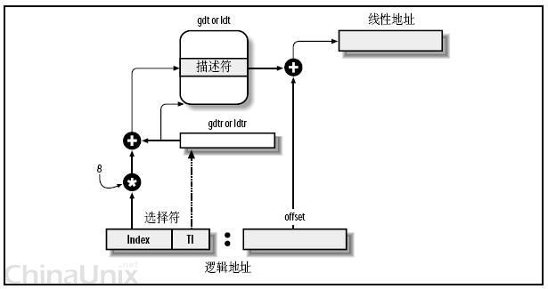

# 内存管理

> 首先了解内存管理部分，寻址，分段分页，内存地址映射，物理页框管理。
>
> 本系列文档将描述第二，八章


## 内存寻址

> 我们使用内存地址来访问内存单元内容，80x86处理器中，我们需要区分逻辑地址，线性地址和物理地址

```c
//80x86
 -8086是INTEL公司推出的最早实际应用到微型个人计算机上CPU芯片型号；
    -80x86是在8086基础上的增强型，包括80286，80386，80486，其后就改称奔腾了；
    -大的区别上：8086和80286是16位的CPU，80386和80486是32位CPU；80486还多了数学辅助处理器，增强了复杂的数学运算能力。
    现在的PC机处理器，都是向下一直兼容到8086,这些就统称为80x86
    在汇编语言下常提到“80x86指令集”这个术语，意思是兼容这些cpu的指令集
```


### 基本知识

#### 段

> 段(数据段，代码段，系统段(系统段表(LDT段表，TSS段表)，门描述符(调用门，中断门，陷阱门，任务门)))
>
> **段描述符定义一个段**。门描述符存放的是指向一个过程入口点的指针

任务门：任务切换

陷阱门：调用异常处理程序

中断门：调用中断处理程序

调用门：在不同的特权级之间实现受控的程序控制转移


#### 段选择符

> 段选择符有8个字节长，是逻辑地址的组成单位之一，用于在描述符表中查找一个段描述符。它有index，T1，RPL字段


​                                                             $$T1:符表  ,RPL:优先度$$


#### 段描述符

> 每个段有一个8字节的段描述符表示，它描述了段的特征，包含段的基址、限长、优先级等各种属性。
>
> 段描述符由段选择符(逻辑地址的成员之一)在描述符表中进行查找得到，通过自身的段基址与逻辑地址的偏移量结合，即可获得线性地址


| 段描述符字段 | 描述                                                         |
| ------------ | ------------------------------------------------------------ |
| Base         | 段首字节线性地址                                             |
| G            | 粒度标志（0:以字节记   其余:以4096字节记）                   |
| Limit        | 内存单元偏移量，决定段长 （0：段长1B-1MB  其余:4KB-4GB)      |
| S            | 描述符类型（0=系统段，1=数据段或者代码段）                   |
| Type         | 段类型，包括数据段和代码段                                   |
| DPL          | 描述符特权级，表示访问这个段的最小优先级。为0则只有内核态可访问 |
| P            | Segment-Present标志：等于0表示不在主存。等于1表示不交换该段至磁盘(LInux常用) |
| D/B          | 由自身是代码段还是数据段决定                                 |
| AVL标志      | 可以由操作系统使用，被Linux忽略                              |

段描述符会根据S,TYPE字段区分类型，并判断储存在GDT还是LDT(详见P43)。


```c
上图：数据段描述符 代码段描述符 系统描述符
```


**通过段选择符获取段描述符**

段描述符有8个字节长，通过段选择符的T1字段指定GDT or LDT后，从相应寄存器获取得GDT or LDT的地址。再将段选择符的index值乘以8加上获取的地址，即可获得相应的段描述符。

```c
例：gdtr中存放0x00020000，是GDT的地址，index值为2 则相应的段描述符地址：0x00020000 + (8 x 2)
```


#### 段描述符表

> 就是我们看到的全局描述符表GDT局部描述符表LDT，用于储存段描述符。主要作用的是GDR，如果进程需要附加段则可以拥有自己的LDT
>
> 通过逻辑地址的成员段选择符，即可在段描述符表中获取段描述符。


> IA-32处理器把所有段描述符按顺序组织成线性表 放在内存中，称为段描述符表。分为三类：全局描述符表GDT，局部描述符表LDT和中断描述符表IDT。
>
> ```c
> GDT和IDT在整个系统**只有一张**，GDT包含系统使用的代码段、数据段、堆栈段和特殊数据段描述符，以及所有任务局部描述符表LDT的描述符。
> 
> 每个任务都有自己**私有的一张**局部描述符表LDT，用于记录本任务中涉及的各个代码段、数据段和堆栈段以及本任务的使用的门描述符。
> ```


#### 描述符寄存器

> 就是我们看到的GDTR,LDTR，它们的唯一目的是存放段描述符表。
>
> 有cs(代码段寄存器),
>
> ss(栈段寄存器),
>
> ds(数据段寄存器),
>
> es,fs,gs(这三个做一般用途)。

对于cs寄存器，上文提到的 RPL:特权级有两个值：值为0表最高级，值为3表最低级。分别表示**内核态和用户态**


> **GDTR全局描述符寄存器**
>
> 48位，高32位存放GDT基址，低16为存放GDT限长。
>
> **LDTR局部描述符寄存器**
>
> 16位，高13为存放LDT在GET中的索引值。


### 逻辑地址(logical adress)

> 在有地址变换功能的计算机中，访内指令给出的地址 (操作数) 叫**逻辑地址**，也叫相对地址。通过寻址方式的计算或变换得到内存储器中的实际有效地址，即物理地址。

我们的[用户程序](https://baike.baidu.com/item/用户程序)中使用的地址称为相对地址即逻辑地址，

逻辑地址由**两个16位的地址分量**构成，一个为段标识符(段选择符)，另一个为偏移量。两个分量均为无符号数编码。

**偏移量实际指明了从段基址到实际地址间的距离**

```c
所谓逻辑地址是指按数据的逻辑块号给出的磁盘的位置（l块=512字l字=64位）而物理地址则是由磁盘的柱面、头、段等物理位置所确定的地址。
  //多个逻辑地址可指向同一个物理地址
```


> 我们指针的地址其实就是逻辑地址，它是相对于你当前进程数据段的地址，不和绝对物理地址联系。如果是在实模式下就不会了，实模式没有分段或分页机制，CPU不进行自动地址转换，逻辑地址也就和物理地址一样。


### 线性地址(linear address)

> 也称虚拟地址（某些情况逻辑地址也这样叫），是[逻辑地址](https://baike.baidu.com/item/逻辑地址/3283849)到[物理地址](https://baike.baidu.com/item/物理地址/2129)变换之间的中间层。在分段部件中[逻辑地址](https://baike.baidu.com/item/逻辑地址/3283849)是段中的[偏移地址](https://baike.baidu.com/item/偏移地址/3108819)，然后加上基地址就是线性地址。
>
> 程序代码会产生[逻辑地址](https://baike.baidu.com/item/逻辑地址)，**通过逻辑地址变换就可以生成一个线性地址**。如果启用了分页机制，那么线性地址可以再经过变换以产生一个[物理地址](https://baike.baidu.com/item/物理地址)（没启用的话线性地址就是物理地址）。
>
> CPU的页式[内存管理](https://baike.baidu.com/item/内存管理)单元，负责把一个线性地址，最终翻译为一个[物理地址](https://baike.baidu.com/item/物理地址)。
>
> 
>
> -------Intel 80386的线性地址空间容量为4G（2的32次方即32根地址总线寻址）。

我们可以理解线性地址是由逻辑地址变换而来，全局的段描述符，就放在“**全局段描述符表(GDT)**”中，局部的，每个进程自己的，就放在“**局部段描述符表(LDT)**”中。对GDT和LDT的使用是由段选择符中的T1字段表示，=0，表示用GDT，=1表示用LDT。

GDT在内存中的地址和大小存放在CPU的**gdtr控制寄存器**中，而LDT则在**ldtr寄存器**中。




```c
段标识符是由一个16位长的字段组成，称为段选择符。其中D3-D15位是索引值(index),称为段描述符,D0-D1位是优先级(RPL)用于特权检查,D2位是描述符表引用指示位TI.通过index的索引在描述符符表中找段。
```

如上图所示，展示逻辑地址的段基值中T1=0的寻址([原文](https://blog.csdn.net/weixin_46198176/article/details/120248319))

1、看段选择符的T1=0还是1，知道段描述符是GDT中的段，再根据相应寄存器(GDTR)，得到其GDT基址。

2、拿出段选择符中前13位，作为索引根据GDT基址查找到对应的[段描述符](https://baike.baidu.com/item/段描述符)，即可以获取基地址。

3、基址加上偏移地址，即把Base + offset，就是要转换的[线性地址](https://baike.baidu.com/item/线性地址)了。

```c
这里可以看出，GDTR存放GDT的地址
```


T1=1段的寻址

① 先从GDTR寄存器中获得GDT基址。 
② 从LDTR寄存器中获取LDT所在段的位置索引(**LDTR高13位**)。 
③ 以这个位置索引**在GDT中得到LDT段描述符**从而得到LDT段基址。 
④ 用段选择符高13位位置索引值从LDT段中得到段描述符。 
⑤ 段描述符符包含段的基址、限长、优先级等各种属性，通过段描述符获取段的起始地址（基址），再以基址加上偏移地址(程序给出)才得到最后的线性地址。

```c
这里可以看出来，LDTR的内部储存自身在GDT中的索引，从而在GDT中获取段基址
```


## 快速访问段描述符

> 我们知道，通过 段选择符->寄存器->段描述符表->段描述符 来获取段的地址。
>
> 为了加速逻辑地址到线性地址的转换，80x86提供一种附加的非编程的寄存器供6个段寄存器使用。它内部有8个字节的段描述符，当**段选择符**装载进段寄存器时，相应的**段描述符**即被装入对应的的非编程寄存器。此时只需访问该寄存器即可获取相应的段描述符。

当段寄存器的内容改变时，才有必要访问GDT,LDT。

我的理解是，段寄存器的内容改变时，也就是相应的段描述符发生改变，直接访问的不是目标段描述符。
