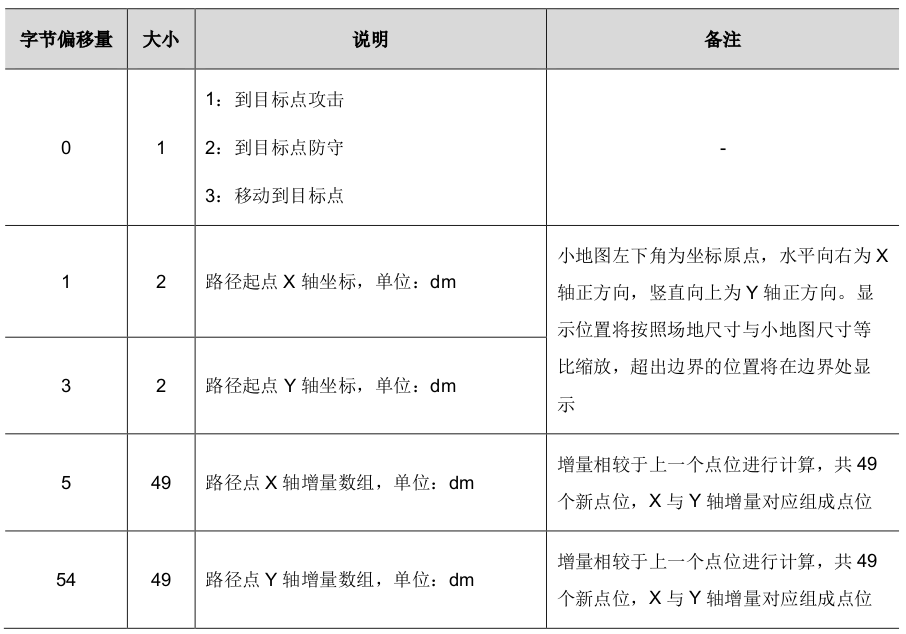

# 2023裁判系统改动

## 新增协议

- 己方英雄，步兵，工程机器人坐标数据 0x020B

> 地面机器人位置数据，对哨兵机器人发送，以 1Hz 频率发送

- 雷达标记敌方英雄，步兵，工程，哨兵机器人进度数据 0x020C

> 雷达标记进度数据，向雷达发送，以 1Hz 频率发送

- 自定义控制器模拟键鼠 0x0306 ==图传链路==

> 自定义控制器与选手端交互数据，发送方触发发送，频率上限为30Hz

- 哨兵向空中发送路径坐标数据 0x0307

**注**：路线可在小地图显示

- 新增机器人ID

> 1：红方英雄机器人
> 2：红方工程机器人
> 3/4/5：红方步兵机器人（与机器人 ID 3~5 对应）
> 6：红方空中机器人
> 7：红方哨兵机器人
> 8：红方飞镖
> 9：红方雷达
> 10：**红方前哨站(NEW)**
> 11：**红方基地(NEW)**

> 101：蓝方英雄机器人
> 102：蓝方工程机器人
> 103/104/105：蓝方步兵机器人（与机器人 ID 3~5 对应）
> 106：蓝方空中机器人
> 107：蓝方哨兵机器人
> 108：蓝方飞镖
> 109：蓝方雷达
> 110：**蓝方前哨站(NEW)**
> 111：**蓝方基地(NEW)**

- 新增选手端 ID

> 0x0101：红方英雄机器人选手端
> 0x0102：红方工程机器人选手端
> 0x0103/0x0104/0x0105：红方步兵机器人选手端（与机器人 ID3~5 对应）
> 0x0106：红方空中机器人选手端
> 0x0165：蓝方英雄机器人选手端
> 0x0166：蓝方工程机器人选手端
> 0x0167/0x0168/0x0169：蓝方步兵机器人选手端（与机器人 ID3~5 对应）
> 0x016A：蓝方空中机器人选手端

## 改动部分

- 裁判系统警告信息 0x0104

由“**判负为0，黄牌或红牌为id**“改为“**判负，黄牌为0，红牌为id**“

- 发弹量 0x0208

由显示**子弹剩余发射数目**改为**子弹允许发射的数目**

- 自定义控制器 0x0302 ==图传链路==

> 操作手可使用自定义控制器通过图传链路(RMUC)向对应的机器人发送数据。
>
> 自定义控制器与机器人交互数据，发送方触发发送，频率上限为30Hz

自定义控制器的数据由常规线路改为图传线路传送(RMUC)

- 小地图下发，接收协议 0x0303/0x0305

**注**：下发的时间间隔不得低于3秒