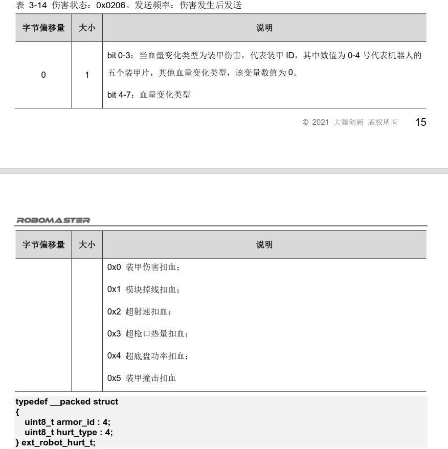

# Manual操纵


## chassis_gimbal_manual

> 底盘云台操纵
>
> 是英雄，步兵，工程manual的父类，包含关于键鼠，遥控器控制最基础的移动，射击等操作

### 构造函数

```c++
ChassisGimbalManual::ChassisGimbalManual(ros::NodeHandle &nh) : ManualBase(nh)
    //句柄chassis，vel，ui，gimbal
    //获取参数gyro_move_reduction
    //初始化底盘和云台的命令，与ui界面的链接
```


### 命令发布

```c++
void ChassisGimbalManual::sendCommand(const ros::Time &time) 
    //发布chassis，vel，gimbal命令
    //更新时间
```


###  更新

```c++
void ChassisGimbalManual::updateRc() 
    //更新遥控器
    //匹配底盘运动模式，设置速度的xyz参数
    //云台速率
    
void ChassisGimbalManual::updatePc()
    //更新电脑
```


### 检查裁判系统

```c++
void ChassisGimbalManual::checkReferee()
    //检查云台，底盘的功率限制
```


### 检查键盘

```c++
void ChassisGimbalManual::checkKeyboard()
    //匹配到红蓝方的机器人id
    //前后左右wsad
    //鼠标位置
```


------

==debus==

### 遥控开关

```c++
void ChassisGimbalManual::remoteControlTurnOff()
    //vel,gimbal,chassis置零setZero()
```


### 左右拨动开关

```c++
void ChassisGimbalManual::rightSwitchDownRise() 
    //右开关拨到下
    //底盘模式：FOLLOW 云台模式：RATE
    //速度置零
    
void ChassisGimbalManual::rightSwitchMidRise()
    //右开关拨到中
    //底盘模式：FOLLOW 云台模式：RATE

void ChassisGimbalManual::rightSwitchUpRise()
    //右开关拨到上
    //底盘模式：FOLLOW 云台模式：RATE
    //速度置零
    //trigger，time，fixed UI配置
    
void ChassisGimbalManual::leftSwitchMidFall()
    //左开关拨到中
    //底盘命令发布：充电
    // chassis_cmd_sender_->power_limit_->updateState(rm_common::PowerLimit::CHARGE);
    
void ChassisGimbalManual::leftSwitchDownRise()
    //左开关拨到下
    //云台命令发布：RATE
```


### 按键开关

```c++
void ChassisGimbalManual::wPressing()
    //w键按下
    //底盘命令获取，录入速度x轴方向命令
void ChassisGimbalManual::wRelease()
    //w键盘松开
    //底盘命令检查，设置速度x轴方向命令
    //x_scale_ = x_scale_ <= -1.0 ? -1.0 : x_scale_ - 1.0;
    
同理
    //s键：X轴
    // x_scale_ = x_scale_ >= 1.0 ? 1.0 : x_scale_ + 1.0;
    
    //a键：Y轴
    // y_scale_ = y_scale_ <= -1.0 ? -1.0 : y_scale_ - 1.0;
    
    //d键：Y轴
    //y_scale_ = y_scale_ >= 1.0 ? 1.0 : y_scale_ + 1.0;
```


### 鼠标

```c++
void ChassisGimbalManual::mouseMidRise() 
    //控制云台
```


## chassis_gimbal_shooter_manual

射击初始化及操纵控制


### 构造函数

```c++
ChassisGimbalShooterManual::ChassisGimbalShooterManual(ros::NodeHandle &nh) : ChassisGimbalManual(nh)
    //节点shooter，detection_switch
    //获取参数trigger_calibration
    //征集扳机供能，自我检查，游戏开始，拨动开关，按键操作，鼠标移动等事件
```


### 启动

```c++
void ChassisGimbalShooterManual::run()
    //设置敌方阵营的颜色
    //调用update()
```


### 检查裁判系统

```c++
void ChassisGimbalShooterManual::checkReferee() 
    //征集发射供电，自我检查，游戏开始事件
```


### 按键操作

```c++
void ChassisGimbalShooterManual::checkKeyboard()
    //e g q f b
    //ctrl+ c v r b
    //shift
    //鼠标左击，鼠标右击
    
void ChassisGimbalShooterManual::sendCommand(const ros::Time &time)
    //发送命令，调用sendCommand()
```


### 远程遥控开关

```c++
void ChassisGimbalShooterManual::remoteControlTurnOff() 
    //关闭遥控
    shooter_cmd_sender_->setZero();
    trigger_calibration_->stop();

void ChassisGimbalShooterManual::remoteControlTurnOn() 
	//开启遥控
```


### 底盘更新

```c++
void ChassisGimbalShooterManual::chassisOutputOn() 
    //更新底盘数据，检查功率限制
    chassis_cmd_sender_->power_limit_->updateState(rm_common::PowerLimit::CHARGE);
```


### 发射开关

```c++
void ChassisGimbalShooterManual::shooterOutputOn()
    //设置Mode，重置扳机
```


### 绘制Ui

```c++
void ChassisGimbalShooterManual::drawUi(const ros::Time &time)
    //阵营，装甲板，发射
    //fixed_ui
```


### 更新遥控器，电脑

```c++
void ChassisGimbalShooterManual::updateRc() 
    //更新遥控器操作的发射，云台数据
    //弹速
    
void ChassisGimbalShooterManual::updatePc()
    //更新电脑端的底盘命令
```


### 拨动开关

```c++
void ChassisGimbalShooterManual::rightSwitchDownRise() 
    //右拨动开关下拨
    //底盘充电，停止射击
    
void ChassisGimbalShooterManual::rightSwitchMidRise()
    //右拨动开关中间
    //同上
    
void ChassisGimbalShooterManual::rightSwitchUpRise()
    //右拨动开关上拨
    //同上
    
void ChassisGimbalShooterManual::leftSwitchDownRise()
    //左拨动开关下拨
    //底盘模式：TRACK 停止射击
    
void ChassisGimbalShooterManual::leftSwitchMidRise()
    //左拨动开关中间
    //底盘模式：TRACK 准备射击
    
void ChassisGimbalShooterManual::leftSwitchUpRise()
    //左拨动开关上拨
    //底盘模式：TRACK 获取弹速
    
void ChassisGimbalShooterManual::leftSwitchUpOn(ros::Duration duration) 
    //持续时间大于1s，执行射击
    //小于1s，准备射击
```


### 鼠标事件

```c++
void ChassisGimbalShooterManual::mouseLeftPress()
    //左击，发射一次，计算误差
    
void ChassisGimbalShooterManual::mouseRightPress() 
    //右击，更新云台
    //弹速，子弹花费
```


### 摁键

```c++
void ChassisGimbalShooterManual::gPress() 
    //底盘切换小陀螺模式GYRO和跟随模式FOLLOW
    //shift键：每触发则功率限制为NORMAL
    
void ChassisGimbalShooterManual::ePress()
    //底盘切换扭腰模式TWIST和跟随模式FOLLOW
 
void ChassisGimbalShooterManual::bPress()
    //充电CHARGR
    
##wsad##
void ChassisGimbalShooterManual::wPress()
void ChassisGimbalShooterManual::aPress()
void ChassisGimbalShooterManual::sPress()
void ChassisGimbalShooterManual::dPress()
    //
    
##shift##
void ChassisGimbalShooterManual::shiftPress() 
    //切换底盘运动模式为FOOLOW
    //超级电容加速 功率限制：BRUST
void ChassisGimbalShooterManual::shiftRelease()
    //非小陀螺模式下 功率限制：NORMAL
    
    
##ctrl##
void ChassisGimbalShooterManual::ctrlCPress()
    //锁定装甲板目标 switchArmorTargetType();
    
void ChassisGimbalShooterManual::ctrlVPress() 
    //锁定敌方颜色 switchEnemyColor();
    

void ChassisGimbalShooterManual::ctrlRPress()
    //非英雄机器人切换为小陀螺模式，功率限制：BRUST
    //英雄机器人成功调取目标服务后才转为小陀螺
    
void ChassisGimbalShooterManual::ctrlBPress()
    //暴露等级？
```


### 死亡事件

```c++
void ChassisGimbalShooterManual::robotDie() 
    //设置Mode
    shooter_cmd_sender_->setMode(rm_msgs::ShootCmd::STOP);
```


## chassis_gimbal_shooter_cover_manual

承接ChassisGimbalShooterManual，对原有的命令进行扩充

### 构造函数

```c++
ChassisGimbalShooterCoverManual::ChassisGimbalShooterCoverManual(ros::NodeHandle &nh) : ChassisGimbalShooterManual(nh) 
    //定义cover节点，获取参数cover_calibration
    //ctrl+z/q事件
    //检查ctrl事件 void ChassisGimbalShooterCoverManual::checkKeyboard()
```


### 启动，更新，发布，云台

```c++
void ChassisGimbalShooterCoverManual::run()
    //启动，调用update()

void ChassisGimbalShooterCoverManual::updatePc() 
    //更新PC数据，调用serRate()
    
void ChassisGimbalShooterCoverManual::sendCommand(const ros::Time &time)
    //发布，调用sendCommand()
 
void ChassisGimbalShooterCoverManual::gimbalOutputOn()
    //云台输出，调用reset()
```


### 远程遥控

```c++
void ChassisGimbalShooterCoverManual::remoteControlTurnOff() 
   
void ChassisGimbalShooterCoverManual::remoteControlTurnOn() 
```


### 绘制Ui

```C++
void ChassisGimbalShooterCoverManual::drawUi(const ros::Time &time)
    //flash_ui 更新cover
```


### 拨动开关

> //拨动开关判断：左右+位置+位置流状态
> rightSwitchDownRise                                                                 //到达最下面一格
> leftSwitchMidFall                                                                   //从中间一格离开

```c++
void ChassisGimbalShooterCoverManual::rightSwitchDownRise()
void ChassisGimbalShooterCoverManual::rightSwitchMidRise() 
void ChassisGimbalShooterCoverManual::rightSwitchUpRise()
    //仅右拨动开关下拨时，cover命令才会执行发布
```


### 摁键

```c++
void ChassisGimbalShooterCoverManual::ctrlZPress() 
    //设置目标点方位
    //云台模式：DIRECT 底盘模式：FOLLOW 功率限制：NORMAL
    //当cover成功获取状态数据时才会执行命令发布
    
void ChassisGimbalShooterCoverManual::ctrlQPress()
    //重置cover校准
```


# Input_event.h

> 在manual包的include文件夹中我们可以找到事件触发器，在这里我们可以找到各种类型的触发事件


## 上升沿，下降沿

> 在开始之前，我们需要先了解什么是上升沿，下降沿

[数字电路](http://www.hqpcb.com/)中，把电压的高低用逻辑电平来表示。逻辑电平包括高电平和低电平这两种。不同的[元器件](https://www.hqchip.com/nav.html)形成的数字[电路](https://bbs.elecfans.com/zhuti_dianlu_1.html)，电压对应的逻辑电平也不同。在TTL门电路中，把大于3.5伏的电压规定为逻辑高电平，用数字1表示；把电压小于0.3伏的电压规定为逻辑低电平，用数字0表示。数字电平从0变为1 的那一瞬间叫作**上升沿 **，从1到0的那一瞬间叫作**下降沿**。

我们把从/dbus话题读到的按键状态形象地归类为类似于逻辑电平的状态：当一个按键松开时其值为0，按下时其值为1.这样我们就可以根据上升沿，下降沿来判断事件了。


## 相关事件

```c
//Rising为上升沿事件，该事件在相关电位转向高电平时调用一次。例如在按下w键时调用一次
  void setRising(boost::function<void()> handler)
  {
    rising_handler_ = std::move(handler);
  }

//Falling为下降沿事件，该事件在相关电位转向下降沿时调用一次。例如在松开w键时调用一次
  void setFalling(boost::function<void()> handler)
  {
    falling_handler_ = std::move(handler);
  }

//ActiveHigh为高电平持续事件，该事件在相关电位处于高电平时持续调用。例如按住w键时持续调用
  void setActiveHigh(boost::function<void(ros::Duration)> handler)
  {
    active_high_handler_ = std::move(handler);
  }

//ActiveLow为低电平持续事件，该事件在相关电位处于低电平时持续调用。例如松开w键时持续调用
  void setActiveLow(boost::function<void(ros::Duration)> handler)
  {
    active_low_handler_ = std::move(handler);
  }

//Edge为双边事件，该事件在相关电位处于高，低电平时都会调用。例如按下w键时调用一次函数A，松开w键时调用一次函数B
  void setEdge(boost::function<void()> rising_handler, boost::function<void()> falling_handler)
  {
    rising_handler_ = std::move(rising_handler);
    falling_handler_ = std::move(falling_handler);
  }

//Active为双边持续事件，该事件在相关电位处于高，低电平时都会调用。例如按住w键时持续调用函数A，松开w键时持续调用函数B
  void setActive(boost::function<void(ros::Duration)> high_handler, boost::function<void(ros::Duration)> low_handler)
  {
    active_high_handler_ = std::move(high_handler);
    active_low_handler_ = std::move(low_handler);
  }
```


##  boost::function

> 我们以boost::function类型来定义事件对象。
>
> Boost.Function位于 `#include <boost/function.hpp>` 之中，其提供了类似函数指针的功能。但是这个“函数指针”不但能够指向普通的函数而且还能够指向函数对象或者成员函数。我们可以将其当作对函数指针功能的扩展。

如果我们调用一个没有赋值的function时，会抛出`boost::bad_function_call`异常，当我们给function赋值为0时会释放其保存的函数，这时候对其的调用同样会引发上述异常。当我们用function对象来保存一个成员函数时，必须在定义的时候显示的在第一个输入指定是那个类，同时在调用的使用第一个参数必须要是类对象的地址

```c++
    myStruct mySt;
    boost::function<void (myStruct*,std::ostream&)> fPtr = &myStruct::hello;
    fPtr(&mySt,boost::ref(std::cout));
```


## updata()函数

> 上述是配置事件类型，类型事件的更新还是需要调用updata函数来实现。下面先分析updata函数的构成。

```c
//一共有两种if语句，分别判断上升/下降沿事件和持续事件
void update(bool state)
  {
    //上升/下降沿事件
    	//通过判断（state != last_state_）来确保事件值
    if (state != last_state_)
    {
      //如果是上升沿事件(rising_handler_未赋值时为空)
      if (state && rising_handler_)
        rising_handler_();
        
      //如果是下降沿事件
      else if (!state && falling_handler_)
        falling_handler_();
      last_state_ = state;
      last_change_ = ros::Time::now();
    }
    
    
    //持续事件
    if (state && active_high_handler_)
      active_high_handler_(ros::Time::now() - last_change_);
    if (!state && active_low_handler_)
      active_low_handler_(ros::Time::now() - last_change_);
  }
```


## 增加延时功能

> 在按下按键后，延时一段时间再触发事件

**构造函数**

在构造函数中设置delay参数，配置延时时间

```c++
  void setRisingDelay(boost::function<void()> handler, ros::Duration delay)
  {
    rising_handler_ = std::move(handler);
    delay_time_ = delay;
  }

  void setFallingDelay(boost::function<void()> handler, ros::Duration delay)
  {
    rising_handler_ = std::move(handler);
    delay_time_ = delay;
  }

//设置执行
  void  startDelay()
  {
    start_time_ = ros::Time::now();
    delay_switch_ = true;
  }
```


**updata()**

```c
  void update(bool state)
  {
    if (state != last_state_)
    {
      if (!delay_time_.toSec() && state && rising_handler_)
        rising_handler_();
      else if (!delay_time_.toSec() && !state && falling_handler_)
        falling_handler_();
      else if (delay_time_.toSec() && ((!state && falling_handler_) || (state && rising_handler_)))
        startDelay();

      last_state_ = state;
      last_change_ = ros::Time::now();
    }
    if (delay_switch_ && (ros::Time::now() - start_time_ > delay_time_))
    {
      if (rising_handler_)
        rising_handler_();
      else if (falling_handler_)
        falling_handler_();
      delay_switch_ = false;
    }
   。
   。
  }
```


**新增变量**

```c
  bool last_state_, delay_switch_;
  ros::Time last_change_, start_time_;
  ros::Duration delay_time_ = ros::Duration(0.);
```


# 断裁判系统自动校准

> 通常来说，在裁判系统串口正常读取且开启遥控器后，机器人会自动校准。现在我们加上开启遥控器时，如果检测不到裁判串口，则独自校准一次的功能。

## 逻辑分析

从referee发布的referee话题中我们能读到裁判系统是否在线状态

我们首先要解决两个问题

1. 怎样判断裁判系统断开
2. 校准函数写在哪里


问题1：

裁判系统是否在线我们有两种情况需要面对

1. referee正常运行，但裁判串口断开。此时manual能读到/referee话题，话题内is_online为false
2. referee未运行。此时manual读取不到/referee


**因此，我们要同时判断以上两种情况**


一个想法是，面对情况1，用is_online直接判断；情况2，用stamp - ros::Time::now()的差值判断/referee话题是否在线。有一个问题是如果/referee话题没数据，那referee_sub_data_.stamp的值初始化默认是多少。


问题2：

在遥控器打开时的函数写入reset()即可。

```c
//void ManualBase::checkSwitch(const ros::Time& time)里

  if (remote_is_open_ && (time - dbus_data_.stamp).toSec() > 0.3)
  {
    ROS_INFO("Remote controller OFF");
    remoteControlTurnOff();//关闭遥控器时触发
    remote_is_open_ = false;
  }
  if (!remote_is_open_ && (time - dbus_data_.stamp).toSec() < 0.3)
  {
    ROS_INFO("Remote controller ON");
    remoteControlTurnOn();//打开遥控器时触发
    remote_is_open_ = true;
  }


//写入
shooter_calibration_.reset()；
```


## 需要的数据

```c
//Referee.msg下的
bool is_online 
    
time stamp//time的问题是
```


# 英雄吊射模式自动小陀螺

> 在英雄吊射时操作手正全神贯注，如果敌方偷袭很难作出反映，因此通过裁判系统数据在英雄处于吊射状态且受击是自动进入小陀螺




我们的referee将该数据读取并发布到/robot_hurt_data上

```c
uint8 armor_id
uint8 hurt_type

time stamp
```


在manual中建立回调函数即可
