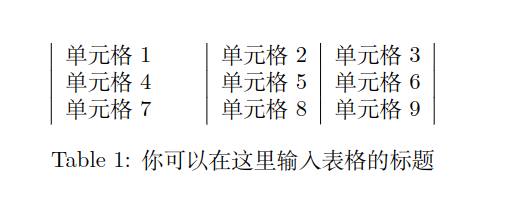

# Latex

> [官方文档](https://www.overleaf.com/learn/latex/Environments)
>
> [模板](http://www.latextemplates.com/cat/articles)


## 环境

> https://github.com/EthanDeng/vscode-latex/blob/master/main.pdf


## 基础概念

L A TEX 源代码以一个 \documentclass 命令作为开头，它指定了文档使用的文档类。docu-
ment 环境当中的内容是文档正文。
在 \documentclass 和 \begin{document} 之间的位置称为导言区。在导言区中常会使用
\usepackage 命令调用宏包，还会进行文档的全局设置。

```latex
\documentclass{...}
% ... 为某文档类
% 导言区
\begin{document}
% 正文内容
\end{document}
% 此后内容会被忽略
```


- 在前言区块内可以指定：
  ```latex
  \documentclass[UTF8]{ctexart}  %生成PDF类
  	\title{标题}
  	\author{作者}
  	\data{\today}
  
  \begin{document}
  	\maketitle     %生成标题，标题内容就是前言指定的信息
  	hello
  \end{document}
  ```


### 文字处理

- 加粗文字/斜体文字/下划线文字

  > 大括号内写入要生效的文字

  ```latex
  \begin{document}
  	\textbf{LaTeX},xxxxx 。\textit{bbbb}，\underline{ccccc}
  \end{document}
  ```

- 换行

  > 使用两个换行符进行换行，单独一个只能生成一个空格

- 开启一个新的章节
  ```latex
  \begin{document}
  	\textbf{LaTeX},xxxxx 。\textit{bbbb}，\underline{ccccc}
  	\section{新的章节}
  	章节的内容
  		\subsection{子章节}
  		子章节下的内容
  			\subsunsection{三级章节}
  			三级章节的内容
  	\section{新的章节}
  \end{document}
  ```

  对于ctextbook类型，可以额外添加比section更大的chapter章节，它通常表示书籍的第几章;

  还有比chapter更大的part，表示第几部

  ```latex
  \documentclass[UTF8]{ctexbook}  %生成书籍类
  	\title{标题}
  	\author{作者}
  	\data{\today}
  	
  \begin{document}
  
  \part{第一部}
  \chapter{更高级的章节}
  	\textbf{LaTeX},xxxxx 。\textit{bbbb}，\underline{ccccc}
  	\section{新的章节}
  	章节的内容
  		\subsection{子章节}
  		子章节下的内容
  			\subsunsection{三级章节}
  			三级章节的内容
  	\section{新的章节}
  \end{document}
  ```

  

- 插入图片

  > 想插入图片，需要在前言中加入graphicx包

  ```latex
  \documentclass[UTF8]{ctexbook}  %生成书籍类
  	\usepackage{graphicx}
  	
  \begin{document}
  
  \end{document}
  ```

  

- 无序列表

  > 不带编号的列表

  ```latex
  \documentclass[UTF8]{ctexbook}  %生成书籍类
  	
  \begin{document}
  
  	\begin{itemize}
  	\item 列表1
  	\item 列表2
  	\end{itemize}
  
  \end{document}
  ```

  

-  有序列表

  > 带编号的列表

  ```latex
  \documentclass[UTF8]{ctexbook}  %生成书籍类
  	
  \begin{document}
  
  	\begin{enumerate}
  	\item 列表1
  	\item 列表2
  	\end{enumerate}
  
  \end{document}
  ```


### 数学符号

#### 数值函数


#### 根式


#### 微分导数


#### 模运算


#### 极限


#### 范围与预测


### 公式语法 

- 行内公式
  ```latex
  \begin{document}
  
  	质能守恒方程$E=mc^2$  %行内公式
  	
  	\begin{equation}    %另起一行的公式
  	E=mc^2
  	\end{equation}
  	
  	\[				    %简写
  	E=mc^2             
  	\] 
  	
  
  \end{document}
  ```


- 复杂公式

  > 在线公式编辑：[网址](latex.codecogs.com/eqneditor/editor.php)
  >
  > \varphi : 小写的phi符号
  >
  > \phi：     大写的phi符号
  >
  >  \over ： 分子/分母

  ```latex
  	\begin{equation}
  	d={k \varphi(n)+1} \over e
  	\end{equation}
  ```

  

### 矩阵

方括号矩阵：

```latex
\begin{bmatrix}
	a & b \\
	c & d \\
\end{bmatrix}
```

$$
\begin{bmatrix}
	a & b \\
	c & d \\
\end{bmatrix}
$$

单纯矩阵排列则去掉pmatrix的p，圆括号b，大括号B


**逆矩阵**

在 [LaTeX](https://so.csdn.net/so/search?q=LaTeX&spm=1001.2101.3001.7020) 中表示`广义逆`、`伪逆`：

```latex
A^{\dagger},\ AA^{\dagger} = (AA^{\dagger})^H
```

$$
A^{\dagger},\ AA^{\dagger} = (AA^{\dagger})^H
$$


### 大括号

```latex
$$ f(x)=\left\{
\begin{aligned}
x & = & \cos(t) \\
y & = & \sin(t) \\
z & = & \frac xy
\end{aligned}
\right.
$$

```

$$ f(x)=\left\{
\begin{aligned}
x & = & \cos(t) \\
y & = & \sin(t) \\
z & = & \frac xy
\end{aligned}
\right.
$$


### 表格

需要配置属性

> c c c : 有三列，每一列都居中对齐
>
> l c c : 左对齐
>
> r c c : 右对齐

```latex
\begin{document}

	\begin{tabular}{c c c}  %传入表格尺寸
	单元格1 & 单元格2 & 单元格3 \\
	单元格4 & 单元格5 & 单元格6 \\
	单元格7 & 单元格8 & 单元格9
	\end{tabular}	

\end{document}
```


- 为表格添加边框

> | ： 竖直边框
>
> \hline : 水平边框

```latex
\begin{document}

	\begin{tabular}{|c|c|c}  %传入表格尺寸
	\hline
	单元格1 & 单元格2 & 单元格3 \\
	\hline\hline
	单元格4 & 单元格5 & 单元格6 \\
	\hline
	单元格7 & 单元格8 & 单元格9
	\hline
	\end{tabular}	

\end{document}
```


- 指定每列属性

> p{2cm} 指定列宽

```latex
\begin{document}

	\begin{tabular}{|p{2cm}|c|c}  %传入表格尺寸
	单元格1 & 单元格2 & 单元格3 \\
	单元格4 & 单元格5 & 单元格6 \\
	单元格7 & 单元格8 & 单元格9
	\end{tabular}	

\end{document}
```

- 为表格添加标题

> 加入table环境

```latex
\begin{document}
	
	\begin{table}
	\center        %指定命令在表格居中显示
	\begin{tabular}{|p{2cm}|c|c}  %传入表格尺寸
	单元格1 & 单元格2 & 单元格3 \\
	单元格4 & 单元格5 & 单元格6 \\
	单元格7 & 单元格8 & 单元格9
	\end{tabular}	
	\caption{你可以在这里输入表格的标题}
	\end{table}

\end{document}
```



### 注释

- 使用verbatim宏包，然后在需要注释的部分上加入 \begin{comment} … \end{comment} 中间包含的部分被注释掉。例如：

```latex
\\usepackage{verbatim} % 引入宏包
\\begin{comment} % 开始注释
这里是多行注释
不会显示在文档中
\\end{comment} % 结束注释
```

- 使用iffalse和fi包含，然后在需要注释的部分上加入 \iffalse … \fi 中间包含的部分被注释掉。例如：

```latex
\\iffalse % 开始注释
这里是多行注释
不会显示在文档中
\\fi % 结束注释
```

- 使用Texstudio编辑器，可以使用快捷键Ctrl+Alt+Shift+右箭头来同时注释多行，使用Ctrl+Alt+Shift+左箭头来取消多行注释


### 更多

更深入地了解latex

> https://github.com/CTex-org/lshort-zh-cn


## 排版语法

### 字体大小

> 除了 `\Huge` 和 `\Large`，有以下几种字体大小的命令：
>
> - `\tiny`：最小的字体
> - `\scriptsize`：比 `\tiny` 稍大一点的字体
> - `\footnotesize`：脚注的字体
> - `\small`：比正常字体小一点的字体
> - `\normalsize`：正常的字体
> - `\large`：比正常字体大一点的字体
> - `\LARGE`：比 `\Large` 大一点的字体
> - `\huge`：比 `\LARGE` 大一点的字体

这些命令都是相对于文档类设置的全局字体大小而言的。你可以在文档类选项中指定全局字体大小，例如 `\\documentclass[12pt\]{article}`。

如果你想要更精确地控制字体大小，你可以使用 `anyfontsize` 宏包，它可以让你使用任意大小的字体，例如 `3.5pt`，`4.6pt`，`15.5pt` 等。你可以使用以下命令来设置字体大小和行距：

```latex
\\fontsize{size}{baselineskip}\\selectfont TEXT
```

例如，你可以使用 `\\fontsize{20}{24}\\selectfont This is a large text.` 来创建一个 20pt 的字体和 24pt 的行距。你可以参考[How to change font size in LaTeX? | Latexhelp](https://latexhelp.com/latex-font-size-change/)[2](https://latexhelp.com/latex-font-size-change/) 来了解更多关于这个宏包的用法。


### 自定义封面标题

> \Huge \Large是开关命令，会影响后面的标题字体

```latex
%标题
\makeatletter
\newcommand{\newtitle}{%
  \ifdefined\@title\else\def\@title{}\fi%
  \ifdefined\@author\else\def\@author{}\fi%
  \ifdefined\@date\else\def\@date{}\fi%
  \begin{center}
    \Large \textcolor{blue}{\@date}\\ % 放大并改变日期的颜色为蓝色
    \vspace{1em} % 添加一些垂直空白
    \textbf{\@author}\\ % 加粗作者
    \vspace{1em} % 添加一些垂直空白
    \Huge \@title % 放大标题
  \end{center}
}
\makeatother


%调用
\title{2023}
\author{xxx}
\date{\today}

\begin{document}
\newtitle
\end{document}
```


- 标题居中

> [`\vspace*{3em}` 和 `\vspace{3em}` 的区别是，`\vspace*{3em}` 会在任何情况下都插入一个 3em 的垂直空白，而 `\vspace{3em}` 只会在不在页面开头或结尾的情况下插入一个 3em 的垂直空白。也就是说，`\vspace*{3em}` 不会被页面分割时忽略，而 `\vspace{3em}` 会被忽略

```latex
\makeatletter
\newcommand{\newtitle}{%
  \ifdefined\@title\else\def\@title{}\fi%
  \ifdefined\@author\else\def\@author{}\fi%
  \ifdefined\@date\else\def\@date{}\fi%
  \vspace*{\fill} % 在 center 环境前添加一个垂直的空白
  \begin{center}
    \Large \@date\\
    \@author\\
    \Huge \@title
  \end{center}
  \vspace*{\fill} % 在 center 环境后添加一个垂直的空白
}
\makeatother
```


### 自定义章节

- 颜色

```latex
\definecolor{bleudefrance}{RGB}{51,51,153}
\sectionfont{\color{bleudefrance}}
\subsectionfont{\color{bleudefrance}}
\subsubsectionfont{\color{bleudefrance}}
```


- 居中

要让 \section 标题居中，有几种方法可以实现。比如：

- 使用 **\centering** 命令，例如：\section* {\centering 标题}。这种方法比较简单，但只适用于不带可选参数的 \section* 命令。
- 使用 **sectsty** 宏包，例如：\usepackage {sectsty} \sectionfont {\centering}。这种方法可以一次性设置所有的 \section 标题居中。

```c
其他的：
    \raggedright //\section标题左对齐。
    \raggedleft //\section标题左对齐。
```


- 使用 **titlesec** 宏包，例如：\usepackage [center\] {titlesec}。这种方法也可以一次性设置所有的 \section 标题居中，而且提供了更多的自定义选项。

你可以根据自己的需求选择合适的方法，也可以在网上搜索更多的 LaTeX 排版技巧。


### 文本向左右对齐

```latex
\leftline{尊敬的各位老师}     %左对齐
\rightline{书略陈固陋，勿劳赐复}    %右对齐
\rightline{时阴历四月廿六日}
```


### 页码位于页下面

```c
%页码位于底部
\pagestyle{plain}
```


### 水平/垂直换行

> https://zhuanlan.zhihu.com/p/411399241

垂直换行

```latex
%在文本中留下一个空行，这会让latex开始一个新的段落，并自动添加一些垂直间距。
%在文本中使用\命令，这会强制换行，但不会开始一个新的段落。

%在文本中使用\vspace{长度}命令，这会插入一个指定长度的垂直间距。
\vspace{1em}

%在文本中使用\smallskip, \medskip, \bigskip或\bigbreak命令，这会插入一些预定义的垂直间距

%橡皮垂直
\vfill
%橡皮水平
等\hfill 间\hfill 距\hfill 排\hfill 列
```


### 表格

- 生成器

> https://www.tablesgenerator.com/#


- 表格居中

```latex
    \begin{table}[!htbp]
    \centering %居中
        \begin{tabular}{c c c}  %传入表格尺寸
        \hline\hline
        单元格1 & 单元格2 & 单元格3 \\
        \hline
        单元格4 & 单元格5 & 单元格6 \\
        单元格7 & 单元格8 & 单元格9 \\
        \hline\hline
        \end{tabular}
    \caption{你可以在这里输入表格的标题}
    \end{table}
```


- 调整表格大小

> https://blog.csdn.net/wbl90/article/details/52597429

**目标:** 调整表格宽度, 效果为”按页面宽度调整表格”.
**命令:** \setlength{\tabcolsep}{7mm}{XXXX}

```latex
\begin{center}
\textbf{Table 2}~~Improved table.\\
\setlength{\tabcolsep}{7mm}{
\begin{tabular}{cccccc} \toprule
Models  &  $\hat c$  &  $\hat\alpha$  &  $\hat\beta_0$  &  $\hat\beta_1$  &  $\hat\beta_2$  \\ \hline
model  & 30.6302  & 0.4127  & 9.4257  & - & - \\
model  & 12.4089  & 0.5169  & 18.6986  & -6.6157  & - \\
model  & 14.8586  & 0.4991  & 19.5421  & -7.0717  & 0.2183  \\
model  & 3.06302  & 0.41266  & 0.11725  & - & - \\
model  & 1.24089  & 0.51691  & 0.83605  & -0.66157  & - \\
model  & 1.48586  & 0.49906  & 0.95609  & -0.70717  & 0.02183  \\
\bottomrule
\end{tabular}}
\end{center}
```


**目标:** 调整表格宽度, 效果为”按内容调整表格”.
**命令:** \resizebox{\textwidth}{15mm}{XXXX}

```latex
\begin{center}
\textbf{Table 1}~~Original table.\\
\resizebox{\textwidth}{15mm}{
\begin{tabular}{cccccccccccc} \toprule
Models  &  $\hat c$  &  $\hat\alpha$  &  $\hat\beta_0$  &  $\hat\beta_1$  &  $\hat\beta_2$ & Models  &  $\hat c$  &  $\hat\alpha$  &  $\hat\beta_0$  &  $\hat\beta_1$  &  $\hat\beta_2$  \\ \hline
model  & 30.6302  & 0.4127  & 9.4257  & - & -  & model  & 30.6302  & 0.4127  & 9.4257  & - & -\\
model  & 12.4089  & 0.5169  & 18.6986  & -6.6157  & - & model  & 30.6302  & 0.4127  & 9.4257  & - & - \\
model  & 14.8586  & 0.4991  & 19.5421  & -7.0717  & 0.2183 & model  & 30.6302  & 0.4127  & 9.4257  & - & - \\
model  & 3.06302  & 0.41266  & 0.11725  & - & - & model  & 30.6302  & 0.4127  & 9.4257  & - & - \\
model  & 1.24089  & 0.51691  & 0.83605  & -0.66157  & - & model  & 30.6302  & 0.4127  & 9.4257  & - & - \\
model  & 1.48586  & 0.49906  & 0.95609  & -0.70717  & 0.02183  & model  & 30.6302  & 0.4127  & 9.4257  & - & - \\
\bottomrule
\end{tabular}}
\end{center}
```


### 代码块

> https://zhuanlan.zhihu.com/p/261667944

```tex
\begin{lstlisting}[language=C]%C Java Python      
#include <stdio.h>
{
    //Example
    printf("Hello World");
    int i, sum = 0;
    for (i = 0; i < 10; i++){
        sum += i;
    }
    printf("%d", sum);
    return 0;
}
\end{lstlisting}
```

- 框架

**[frame=none]** %无框
**[frame=leftline,topline,rightline, bottomline]** %分别对应只在左侧，上方，右侧，下方有竖线
**[frame=trb]** %t-top,r-right,b-bottom,l-left. 这是为框架只在上，右，下方
**[frame=trBL]** %大写表示双重线

在预设中可设置框的拐角处为圆弧：

\lstset{
**\frameround** = fttt,
}
\frameround后必须有四个字母。第一个字母表示右上角的拐角，然后顺时针地依次代表各个拐角。f表示方形，t表示弧形。

**frame=shadowbox**, %设置阴影

**framexleftmargin**=4mm, %框架左边界延长（frame是不会考虑到左边的行数栏的）

**rulecolor**=\color{gray}, %框架颜色设置

**rulesepcolor**=\color{gray}, %框架阴影颜色设置


示例：

```
\lstset{... \frameround=fftt, ...}
\begin{lstlisting}[numbers=none, frame=trBL, ...] ... \end{lstlisting}    
```


- 预设语言

```latex
\usepackage[dvipsnames]{xcolor} % 更全的色系

\lstset{
	language = Matlab,
	backgroundcolor = \color{yellow!10}, % 背景色：淡黄
	basicstyle = \small\ttfamily, % 基本样式 + 小号字体
	rulesepcolor= \color{gray}, % 代码块边框颜色
	breaklines = true, % 代码过长则换行
	numbers = left, % 行号在左侧显示
	numberstyle = \small, % 行号字体
	keywordstyle = \color{blue}, % 关键字颜色
	commentstyle =\color{green!100}, % 注释颜色
	stringstyle = \color{red!100}, % 字符串颜色
	frame = shadowbox, % 用(带影子效果)方框框住代码块
	showspaces = false, % 不显示空格
	columns = fixed, % 字间距固定
	%escapeinside={} % 特殊自定分隔符：
	morekeywords = {as}, % 自加新的关键字(必须前后都是空格)
	deletendkeywords = {compile} % 删除内定关键字；删除错误标记的关键字用deletekeywords删！
}
```


### 列表

- 序号和标题加粗

```latex
\usepackage{enumitem}
\begin{enumerate}[label=\arabic*.]
  \item \textbf{第一项}
  \item \textbf{第二项}
  \item \textbf{第三项}
\end{enumerate}
```


- 改变列表行距

latex中，你可以使用一些宏包或者参数来改变列表的行距。下面是一些方法：

使用enumitem宏包，它可以让你控制列表的各种间距，比如itemsep, parsep, topsep等。你可以在导言区使用\setlist命令来设置全局的间距，也可以在单个列表环境中使用可选参数来设置局部的间距]。例如：

```latex
\usepackage{enumitem}
\setlist[itemize]{noitemsep} % 全局设置无项目间距
\begin{itemize}[itemsep=5pt] % 局部设置项目间距为5pt
  \item 一
  \item 二
  \item 三
\end{itemize}
```

使用paralist宏包，它提供了一些紧凑的列表环境，比如compactitem, compactenum等。你可以直接使用这些环境来替代标准的列表环境，也可以用\renewenvironment命令来重定义标准的列表环境。例如：

```latex
\usepackage{paralist}
\begin{compactenum}
  \item 一
  \item 二
  \item 三
\end{compactenum}
```

使用setspace宏包，它提供了一个\setstretch命令，可以用来调整行距的倍数。你可以在列表环境中使用这个命令来改变行距[3](https://tex.stackexchange.com/questions/83855/change-line-spacing-inside-the-document)。例如：

```latex
\usepackage{setspace}
\begin{enumerate}
  \setstretch{0.8} % 设置行距为0.8倍
  \item 一
  \item 二
  \item 三
\end{enumerate}
```

使用\setlength

```latex
在\begin{enumerate}[label={[\arabic*]}]后面跟\setlength{\itemsep}{0pt}可以设置当前列表环境里item条目之间的间距。
```


- 改变序列标号
  \arabic可以替换为\roman、\Roman、\Alph 或 \alph来表示小写罗马数字、大写罗马数字、大写字母编号 或 小写字母编号。


### 摘要

> https://www.bilibili.com/read/cv2381819/

```latex
%摘要开始部分

\begin{abstract}

该部分内容是放置摘要信息的。该部分内容是放置摘要信息的。该部分内容是放置摘要信息的。该部分内容是放置摘要信息的。该部分内容是放置摘要信息的。

\end{abstract}
```


### 脚注

```latex
\footnote{\href{https://github.com/CheckBoxStudio/BUAAThesis}
```

> 这一行代码的作用是在文档中插入一个脚注，脚注的内容是一个超链接，指向https://github.com/CheckBoxStudio/BUAAThesis这个网址。你需要使用hyperref宏包来使用\href命令1。\href命令有两个参数，第一个是链接的目标，第二个是显示的文本。例如：
>
> \footnote{\href{https://github.com/CheckBoxStudio/BUAAThesis}{BUAA Thesis}}
>
> 这样就会在脚注中显示一个叫做BUAA Thesis的超链接。


### 参考文献

> https://zhuanlan.zhihu.com/p/265479955

- 不使用BibTeX

先在文章文章末尾写好需要插入的参考文献，逐一写出，例如：

```text
\begin{thebibliography}{99}  

\bibitem{ref1}郭莉莉,白国君,尹泽成,魏惠芳. “互联网+”背景下沈阳智慧交通系统发展对策建议[A]. 中共沈阳市委、沈阳市人民政府.第十七届沈阳科学学术年会论文集[C].中共沈阳市委、沈阳市人民政府:沈阳市科学技术协会,2020:4.
\bibitem{ref2}陈香敏,魏伟,吴莹. “文化+人工智能”视阈下文化创意产业融合发展实践及路径研究[A]. 中共沈阳市委、沈阳市人民政府.第十七届沈阳科学学术年会论文集[C].中共沈阳市委、沈阳市人民政府:沈阳市科学技术协会,2020:4.

\end{thebibliography}
```

上面列出了5个参考文献，{thebibliography}的选项99指的是参考文献的个数最大为99，可以设置为别的数。

在正文中引用参考文献的方法是：

```
\cite{ref1}
\cite{ref1, ref5}
```

这样编译后就可以得到：

[1]

[1, 5]


- 去掉自带的参考文献标题

如果你使用的是thebibliography环境，你可以使用一些方法来去掉自带的参考文献标题。下面是一些方法：

使用etoolbox宏包，它可以让你修改thebibliography环境内部的命令。你可以使用\patchcmd命令来去掉\section*{\refname}或者\chapter*{\bibname}这样的标题命令。例如：

```latex
\usepackage{etoolbox}
\patchcmd{\thebibliography}{\section*{\refname}}{}{}{}
```

在下面的命令之前执行上面的命令，之后就没有标题了

```latex
\begin{thebibliography}{99}  

\bibitem{ref1}郭莉莉,白国君,尹泽成,魏惠芳. “互联网+”背景下沈阳智慧交通系统发展对策建议[A]. 中共沈阳市委、沈阳市人民政府.第十七届沈阳科学学术年会论文集[C].中共沈阳市委、沈阳市人民政府:沈阳市科学技术协会,2020:4.
\bibitem{ref2}陈香敏,魏伟,吴莹. “文化+人工智能”视阈下文化创意产业融合发展实践及路径研究[A]. 中共沈阳市委、沈阳市人民政府.第十七届沈阳科学学术年会论文集[C].中共沈阳市委、沈阳市人民政府:沈阳市科学技术协会,2020:4.

\end{thebibliography}

\newpage
```


## 高级语法


### 段外引用

现在一处定义一个subsec:struct的label标签

```latex
\subsection{\LaTeX{} 源代码结构}\label{subsec:struct}
```

在其他地方\ref提及它

```latex
在 \ref{subsec:struct} 小节中出现的...
```


### 引入目录

```latex
\clearpage: 清除当前页面上的所有内容，并开始一个新的页面。
\setcounter{page}{1}: 将页码计数器设置为1，即从第一页开始编号。
\tableofcontents: 生成目录，根据章节标题自动排列。
\listoffigures: 生成图表目录，根据图表的标题和编号自动排列。
\listoftables: 生成表格目录，根据表格的标题和编号自动排列。
\listoftodos: 生成待办事项列表，根据todo包中定义的\todo命令自动排列。
```


### 绘图

> https://www.overleaf.com/learn/latex/Pgfplots_package

廖佬指定pgfplots包

pgfplotsets


整合仓库，描述如何绘制各种示意图

> https://github.com/xinychen/awesome-latex-drawing


### 彩色代码块

> https://github.com/synercys/annotated_latex_equations


# 工具

## 识别网站

> 高级网站，可以把导入的pdf转化成latex文档
>
> https://snip.mathpix.com/1163581142/notes/6aaa29dd-9d67-4708-bebf-f229435ddfe9/edit


## 文字识别工具

> https://github.com/LinXueyuanStdio/LaTeX_OCR_PRO


## Latex公式转Sympy

> https://github.com/chenhuiYu00/latex2sympy

| LaTeX                       | Image                                                        | Generated SymPy                                              |
| --------------------------- | ------------------------------------------------------------ | ------------------------------------------------------------ |
| `x^{3}`                     | [](https://camo.githubusercontent.com/cc9149f9ad9ff3d5cd19d0b24f6b652ae1781e478690328ae0fb0183fcb25fbf/68747470733a2f2f6c617465782e636f6465636f67732e636f6d2f6769662e6c617465783f2535434c415247452532307825354525374233253744) | `x**3`                                                       |
| `\frac{d}{dx}               | t                                                            | x`                                                           |
| `\sum_{i = 1}^{n} i`        | [](https://camo.githubusercontent.com/17ed955d4e15146ac3336b208ff2cd456ac2c33d46d305a57907ec47aa43ada1/68747470733a2f2f6c617465782e636f6465636f67732e636f6d2f6769662e6c617465783f2535434c4152474525323025354373756d5f25374269253230253344253230312537442535452537426e25374425323069) | `Sum(i, (i, 1, n))`                                          |
| `\int_{a}^{b} \frac{dt}{t}` | [](https://camo.githubusercontent.com/89a87d1a4d94cb7691a0a10d42e75bdb64fe45f585ce15867b4651c76bd16f6a/68747470733a2f2f6c617465782e636f6465636f67732e636f6d2f6769662e6c617465783f2535434c41524745253230253543696e745f253742612537442535452537426225374425323025354366726163253742647425374425374274253744) | `Integral(1/t, (t, a, b))`                                   |
| `(2x^3 - x + z)             | _{x=3}`                                                      | [](https://camo.githubusercontent.com/42b265379b6b3211b09aa4443e2b9ea6f111b48f985bc56cb3cc2a03f8e55325/68747470733a2f2f6c617465782e636f6465636f67732e636f6d2f6769662e6c617465783f2535434c415247452532302532383278253545332532302d253230782532302b2532307a2532392537435f2537427825334433253744) |


## Python公式转Latex

> https://github.com/connorferster/handcalcs


## 在线编译器

> https://github.com/aslushnikov/latex-online


# 模板

## 期刊类型

> https://github.com/rstudio/rticles


# 问题

- overleaf编译中文

`XeLaTeX`和`pdfLatex`是两种可以选择的模式。一般而言会默认使用`pdfLatex`。但是`pdfLatex`对中文的支持较差，因此如果文档中有中文，需要使用`XeLaTeX`。


