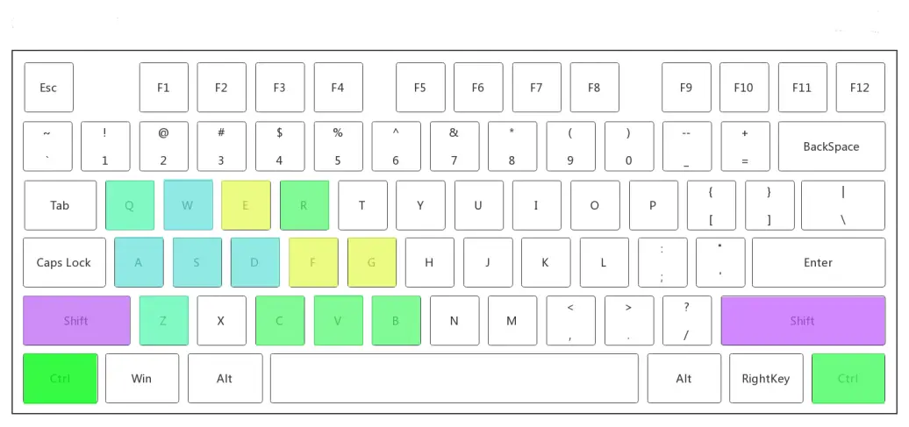

# Referee操作手册

> rm_manual允许操作手通过键鼠控制自己的机器人，命令将会通过遥控器传输给目标。
>
> 使用**遥控器**操作请将右方拨动开关拨至中档位，使用**键鼠**操作请将遥控器与电脑相连并将右方拨动开关拨至上档位。

**！本文档按键功能说明仅通过代码分析写出，未完全经过实车测试，本文档将会持续更新**(2022.7.27更新)

##  可操作按键示意图

## 各类机器人

### 英雄机器人

> ​       W                                                                                           鼠标左击：射击
>
> A     S     D          :     前后左右                                                     鼠标右击：自瞄(长按)
>
> ​																									  鼠标滚轮：调节云台灵敏度

| 按键   | 功能                         |
| ------ | ---------------------------- |
| c      | 切换小陀螺/普通模式          |
| e      | 切换扭腰/普通模式            |
| b      | 功率降低，超级电容充电       |
| f      | 关闭摩擦轮             |
| q      | 关闭枪口热量限制             |
| ctrl+c | 切换锁定目标(装甲板)         |
| ctrl+v | 调整射频(高/低两档)          |
| ctrl+b | 调整相机曝光度               |
| ctrl+r | 设置为锁定模式，底盘不再移动，任意移动退出 |
| ctrl+shift+b  | 超级电容主控板重启，底盘暂时断电   |
| shift  | 开启超级电容(按住) |

| 拨动开关 | Gimbal        | PowerLimit     | ShoorCmd              | Status           | Tips                         |
| -------- | ------------- | -------------- | --------------------- | ---------------- | ---------------------------- |
| 右 + 上  | RATE （跟随） | CHARGE（充电） | STOP（停止射击）      | PC（键鼠控制）   | 从其余档位拨到此处触发UI绘制 |
| 右 + 中  | RARE （跟随） | CHARGE（充电） | STOP（停止射击）      | RC（遥控器模式） |                              |
| 右 + 下  | RATE （跟随） | CHARGE（充电） | STOP（停止射击）      | IDLE             |                              |
| 左 + 上  | TRACK（自瞄） |                | PUSH  （自瞄并射击）  | 自动操作并射击   | 拨一次打一下，长驻1s后连发   |
| 左 + 中  | TRACK（自瞄） |                | READY（仅自瞄不射击） | 自动操作不射击   |                              |
| 左 + 下  | RATE （跟随） |                | STOP（停止射击）      | 手动操作射击     |                              |

### 步兵机器人

**步兵机器人额外多出供弹(cover)功能**

> ​       W                                                                                           鼠标左击：射击
>
> A     S     D          :     前后左右                                                     鼠标右击：自瞄(长按)
>
> ​																									  鼠标滚轮：调节云台灵敏度

| 按键   | 功能                           |
| ------ | ------------------------------ |
| c      | 切换小陀螺/普通模式            |
| e      | 切换扭腰/普通模式              |
| b      | 功率降低，超级电容充电         |
| q      | 关闭枪口热量限制               |
| f      | 关闭发射，摩擦轮停转           |
| ctrl+c | 切换锁定目标(装甲板)           |
| ctrl+v | 调整射频(高/低两档)            |
| ctrl+b | 调整相机曝光度                 |
| ctrl+z | 切换供弹舱门开启/关闭          |
| ctrl+q | 重置供弹舱门并校准             |
| ctrl+r | 云台检测到敌方时自动进入小陀螺 |
| shift  | 开启超级电容                   |

| 拨动开关 | Gimbal        | PowerLimit     | ShoorCmd              | Status           | Tips                         |
| -------- | ------------- | -------------- | --------------------- | ---------------- | ---------------------------- |
| 右 + 上  | RATE （跟随） | CHARGE（充电） | STOP（停止射击）      | PC（键鼠控制）   | 从其余档位拨到此处触发UI绘制 |
| 右 + 中  | RARE （跟随） | CHARGE（充电） | STOP（停止射击）      | RC（遥控器模式） |                              |
| 右 + 下  | RATE （跟随） | CHARGE（充电） | STOP（停止射击）      | IDLE             | 供弹舱门开启                 |
| 左 + 上  | TRACK（自瞄） |                | PUSH  （自瞄并射击）  | 自动操作并射击   | 拨一次打一下，长驻1s后连发   |
| 左 + 中  | TRACK（自瞄） |                | READY（仅自瞄不射击） | 自动操作不射击   |                              |
| 左 + 下  | RATE （跟随） |                | STOP（停止射击）      | 手动操作射击     |                              |

### 工程机器人

> ​       W                                                                                          
>
> A     S     D          :     前后左右                                                   
>

| 按键   | 功能          |
| ------ | ------------- |
| c      | 抓取开启/关闭 |
| ctrl+c |               |
| ctrl+r |               |
| ctrl+z |               |
| ctrl+v |               |
| ctrl+b |               |
| ctrl+z |               |
| ctrl+q |               |
| ctrl+f |               |

| 拨动开关 | ChassisCmd | Gimbal        | 目标点指令     | Status           |
| -------- | ---------- | ------------- | -------------- | ---------------- |
| 右 + 下  | RAW        | RATE （跟随） | 取消所有目标点 | IDLE             |
| 右 + 中  | RAW        | RARE （跟随） | 设置目标点     | RC（遥控器模式） |
| 右 + 上  | RAW        | RATE （跟随） | 设置目标点     | PC（键鼠控制）   |
| 左 + 下  |            | RATE （跟随） |                |                  |

