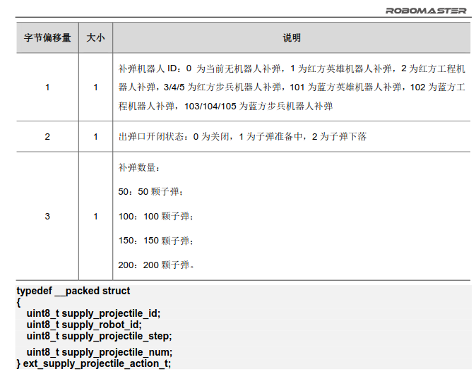

# Referee

github: @chenhuiYu00

> 目前，我们展示的是已经完成分离功能后的referee，它将只保留获取裁判系统信息和发送交互数据的功能。其中交互数据包括自定义机器人间交互数据和ui绘制。现在依靠这篇文档，我将带您了解referee的基础功能。

- **在阅读开始前，我们建议您先阅读裁判系统[串口协议](https://rm-static.djicdn.com/tem/17348/RoboMaster_%E8%A3%81%E5%88%A4%E7%B3%BB%E7%BB%9F%E4%B8%B2%E5%8F%A3%E5%8D%8F%E8%AE%AE%E9%99%84%E5%BD%95%20V1.3.pdf)，这将帮助您了解referee**
- 整个referee以多个头文件相继包含组成，理清头文件的包含结构将帮助您更快速地熟悉referee


工程依靠action传输


## 裁判系统

> 我们首先需要了解，裁判系统在RobotMaster中是一个怎样的存在。在实物上，您在机器人的底盘上会见到一个黑色带有屏幕的方块，这便是裁判系统主控本身，依靠这块主控，机器人能够将数据通过串口传输至服务器，从而在裁判系统界面显示出来。裁判系统中传输的数据，包括但不限于机器人状态，比赛阶段信息，场地情况，交互数据...，我们首先要做到的，是从裁判系统中接受数据，这将是referee工作的基础。

让我们先从referee接受数据开始。、


### 数据接受

> main.cpp中for循环调用read(),而在rm_referee/referee.h文件中，我们能够找到函数**read()**,通过这个函数，我们能够读到裁判系统串口传输而来的数据，它是如何而实现？接下来我们进行解析：首先在clion中尝试在read()函数的位置同时按下ctrl与鼠标左键，我们将会跳到referee.cpp，这是该函数实现的地方。

```c
void Referee::read()
{
    
  //rm_referee节点需要保证长时间且稳定地运行，因此要避免因串口暂时得不到数据而中断rm_referee进程。
  if (base_.serial_.available())
  {
    rx_len_ = (int)base_.serial_.available();
    base_.serial_.read(rx_buffer_, rx_len_);
  }
  else
  {
    ROS_INFO("Port exception before read");
    return;
  } 
  //检查Dbus判断是否触发UI绘制
  checkUiAdd();
  //临时变量
    //先将缓冲区置零
  uint8_t temp_buffer[256] = { 0 };
  int frame_len;
    
  //实时性判断
    //通过时间差来判断数据是否实时，这会很重要，非实时数据会干扰到我们许多的判断
  if (ros::Time::now() - last_get_ > ros::Duration(0.1))
    referee_data_.is_online_ = false;
    
  //赋值
  if (rx_len_ < k_unpack_buffer_length_)
  {
    for (int kI = 0; kI < k_unpack_buffer_length_ - rx_len_; ++kI)
      temp_buffer[kI] = unpack_buffer_[kI + rx_len_];
    for (int kI = 0; kI < rx_len_; ++kI)
      temp_buffer[kI + k_unpack_buffer_length_ - rx_len_] = rx_buffer_[kI];
    for (int kI = 0; kI < k_unpack_buffer_length_; ++kI)
      unpack_buffer_[kI] = temp_buffer[kI];
  }
    
  //解包
    //具有标识符的帧将会解包，unpack()会执行数据获取的功能
  for (int kI = 0; kI < k_unpack_buffer_length_ - k_frame_length_; ++kI)
  {
    if (unpack_buffer_[kI] == 0xA5)
    {
      frame_len = unpack(&unpack_buffer_[kI]);
      if (frame_len != -1)
        kI += frame_len;
    }
  }
 //读取超级电容数据
  super_capacitor_.read(rx_buffer_);
 //获取到数据后，我们该发布了，有需要的用户可以订阅它
  publishCapacityData();
 //获取机器人数据，包含本机id等
  getRobotInfo();
 //清除缓冲区
  clearRxBuffer();
}
```

这个函数就是rm_referee的主循环函数。现在我们能从这段代码大概了解referee初步的功能了，首先获取数据帧，接着完成解包，之后处理数据，最后将数据发布出去。其中每一步都由函数完成。

通过ctrl+加鼠标左击的方式，跳到函数实现的地方，详细了解函数如何完成它自己的功能。


**提问：**

1. 如果本机机器人是哨兵（sentry），在执行getRobotInfo()会与其他机器人有什么不同？

2. referee获取的数据会发布在哪些话题？请列举一二 


### 数据发布

> unpack()函数将会在解包赋值并绘制ui(部分数据下)后发布话题，ui绘制的部分下一节会详细阐述。实际上我们可以发现ui绘制是以裁判系统接收到相应数据时的回调函数触发的。

这里先以game_robot_status数据举例

```c
        case rm_referee::RefereeCmdId::ROBOT_STATUS_CMD:
        {
          rm_referee::GameRobotStatus game_robot_status_ref;
          memcpy(&game_robot_status_ref, rx_data + 7, sizeof(rm_referee::GameRobotStatus));

          base_.game_robot_status_data_.mains_power_chassis_output = game_robot_status_ref.mains_power_chassis_output_;
		  /*===
		  	省略
		  */===
          base_.game_robot_status_data_.stamp = last_get_;

          base_.referee_pub_data_.is_online = base_.referee_data_is_online_;

          base_.referee_pub_data_.stamp = last_get_;

          //绘制ui
          referee_ui_->robotStatusDataCallBack(base_.game_robot_status_data_, last_get_);

          //发布话题
          game_robot_status_pub_.publish(base_.game_robot_status_data_);
          referee_pub_.publish(base_.referee_pub_data_);
          break;
        }
```


对应于上一部分发布的话题，在referee.cpp的referee类的构造函数我们可以了解到更多。值得注意的的是可以在构造函数中看到串口初始化过程。

```c
    // initSerial
    base_.initSerial();
```


**提问：**

1. unpack()函数整整有331行，但每个case上执行的代码是大同小异的。尝试将case中的代码归类，得出自己的理解


unpack()中有一段用于过滤的命令，在实际测试过程中会出现因为收到的数据中的数据长度极长(1w以上)而导致程序崩溃的情况(过长导致的越界访问).所以加上一句检测数据长度的指令。但注意数据长度只是从数据帧解包出来的数据帧长度(数据帧中有分配帧有多长的数据位），数据帧的实际长度可能并没有这么长

```c
if (frame_header.data_length_ > 256)  // temporary and inaccurate value
```


## UI绘制

> RobotMaster支持选手自定义ui，和我们预设想的花里胡哨种样繁多的游戏ui不同，我们将要绘制的ui既不能加入劲爆的打击音效，也不能添加屏幕交互。我们所能做到的是将操作手需要的一些数据打印出来。

ui发送的本质其实就是机器人交互数据，它和机器人间交互数据几乎共用一套逻辑。

```c
交互数据包括一个统一的数据段头结构。数据段包含了内容 ID，发送者以及接收者的 ID 和内容数据段，
整个交互数据的包总共长最大为 128 个字节，减去 frame_header,cmd_id 和 frame_tail 共 9 个字节以及
数据段头结构的 6 个字节，故而发送的内容数据段最大为 113。
```


我们从数据封装的工作讲起


### 数据封装

> 假设我们将要将已经配置好的ui发送到串口，那么直接发送数据可不行，我们应当先将数据进行封装打包。

在graph.cpp中：

```c
void Graph::pack(uint8_t* tx_buffer, uint8_t* data, int cmd_id, int len) const
{
  memset(tx_buffer, 0, k_frame_length_);
  auto* frame_header = (rm_referee::FrameHeader*)tx_buffer;

  //设置帧头，数据长度和数据
  frame_header->sof_ = 0xA5;
  frame_header->data_length_ = len;
  memcpy(&tx_buffer[k_header_length_], (uint8_t*)&cmd_id, k_cmd_id_length_);
    
  //appendCRC8CheckSum()实际上是CRC校验的一部分，它的代码由官方提供
  base_.appendCRC8CheckSum(tx_buffer, k_header_length_);
  memcpy(&tx_buffer[k_header_length_ + k_cmd_id_length_], data, len);
  base_.appendCRC16CheckSum(tx_buffer, k_header_length_ + k_cmd_id_length_ + len + k_tail_length_);
}
```

> 联系到上文的解包工作(unpack())，它们之间有什么联系？


### UI发送

> 谁会调用上述的pack()函数？实际上我们的ui绘制工作有addui()和sendui()两部分，在sendui()中，它将会完成将缓冲区的数据打包和发送到串口的工作。

在graph.cpp中：

```c
void Graph::sendUi(const ros::Time& time)
{
  //检查发送延时，设置数据长度
  if (ui_queue_.empty() || time - last_send_ < ros::Duration(0.05))
    return;
  rm_referee::GraphData tx_data;
  int data_len = (int)sizeof(rm_referee::GraphData);
    
  //检查发送者接受者id是否被正确赋值
  if (base_.robot_id_ == 0 || base_.client_id_ == 0)
    return;
    
  //发送者，接受者id赋值
  tx_data.header_.sender_id_ = base_.robot_id_;
  tx_data.header_.receiver_id_ = base_.client_id_;
  tx_data.config_ = ui_queue_.back().first;
    
  //判断图像类型并安排不同的数据
  if (ui_queue_.back().second.empty())
  {
    tx_data.header_.data_cmd_id_ = rm_referee::DataCmdId::CLIENT_GRAPH_SINGLE_CMD;
    data_len -= 30;
  }
  else
  {
    tx_data.header_.data_cmd_id_ = rm_referee::DataCmdId::CLIENT_CHARACTER_CMD;
    for (int i = 0; i < 30; i++)
    {
      if (i < (int)ui_queue_.back().second.size())
        tx_data.content_[i] = ui_queue_.back().second[i];
      else
        tx_data.content_[i] = ' ';
    }
  }
    
  //封装打包
  pack(tx_buffer_, (uint8_t*)&tx_data, rm_referee::RefereeCmdId::INTERACTIVE_DATA_CMD, data_len);
  tx_len_ = k_header_length_ + k_cmd_id_length_ + k_tail_length_ + data_len;
    
  //删除ui队列中已处理好的数据
  ui_queue_.pop_back();
  last_send_ = time;

  //尝试写入串口
  try
  {
    base_.serial_.write(tx_buffer_, tx_len_);
  }
  catch (serial::PortNotOpenedException& e)
  {
  }

  //清空发送缓冲区
  clearTxBuffer();
}
```


### UI添加

> 上文我们已经提到addui()函数，它工作在sendui()之前，并且sendui()中的ui队列会在addui()中体现。

在graph.cpp中：

```c
void Graph::addUi(const rm_referee::GraphConfig& config, const std::string& content, bool priority_flag)
{
  //防止ui队列过长，限制20
  for (int i = 0; i < (int)ui_queue_.size() - 20; i++)
    ui_queue_.erase(ui_queue_.begin());
  
  //优先级判断
  	//ui_queue_是vecor容器，请理解push_back(),insert()的工作
  if (priority_flag)
    ui_queue_.push_back(std::pair<rm_referee::GraphConfig, std::string>(config, content));
  else
    ui_queue_.insert(ui_queue_.begin(), std::pair<rm_referee::GraphConfig, std::string>(config, content));
}
```

sendui()执行的的是`ui_queue_.pop_back()`函数来缩短队列，那么队列里哪里的ui会先被发送出去？这一点就是优先级的作用效果。


### Display()

> display()的工作是更新ui内容数据，同时调用addui()配置队列和ui的优先级。该函数有进行重载。同时有dispalyTwice()函数，顾名思义它会对重要ui发布两次防止在队列中被挤掉。

在graph.cpp：

```c
void Graph::display(bool priority_flag)
{
  //重复ui返回
  if (config_ == last_config_ && title_ == last_title_ && content_ == last_content_)
    return;
    
  if (!title_.empty() && !content_.empty())
    config_.end_angle_ = (int)(title_ + content_).size();
   
  //更新配置
  addUi(config_, title_ + content_, priority_flag);
    
  //displayTwice()中仅更改上面这行为：
  /*
    for (int i = 0; i < 2; ++i)
    addUi(config_, title_ + content_, priority_flag);
  */
  last_content_ = content_;
  last_title_ = title_;
  last_config_ = config_;
}
```

```c
void Graph::display(const ros::Time& time)
{
  //display()，但是有延时
  if (time - last_time_ < delay_)
    return;
  display();
  last_time_ = time;
}
```


### Update()

> update()将会调用diaplay(),sendui()，它将ui进行更新并发送出去。此时我们已经由graph类涉及到了ui类

在ui.cpp中，以trigger ui举例：

```c
void TriggerChangeUi::update(const std::string& graph_name, uint8_t main_mode, bool main_flag, uint8_t sub_mode,
                             bool sub_flag)
{
  auto graph = graph_vector_.find(graph_name);
  if (graph != graph_vector_.end())
  {
    //根据参数更新ui配置
    updateConfig(graph_name, graph->second, main_mode, main_flag, sub_mode, sub_flag);
      
    //rm_referee::GraphOperation由裁判系统官方定义，告诉裁判系统方面我方对这个ui进行的操作
    graph->second->setOperation(rm_referee::GraphOperation::UPDATE);
      
    if (graph->first == "chassis" || graph->first == "gimbal")
    {
      //chassis和gimbal ui是重要ui，调用displayTwice()
      graph->second->displayTwice(true);
      //ui即时发送
      graph->second->sendUi(ros::Time::now());
    }
    else
    {
      graph->second->display();
      graph->second->sendUi(ros::Time::now());
    }
  }
}
```

在日常ui维护中我们也更多地是调用update()函数，它已经处于较上层次。在其他派生uiBase类的update()的函数中都有各自的处理，不过它们仍遵循上述基本结构，比如TimeChangeUi的update()会为不同的ui调用不同的函数。


### Add()

> 上面数据接收一节中我们看到了checkUiAdd()函数，联系到Update()一节里代码中提到的rm_referee::GraphOperation，我们实际上是告诉裁判系统我们要添加ui了。
>
> 注意，如果ui没有先add(rm_referee::GraphOperation::ADD),选手端是不会显示出ui的，后续的update(rm_referee::GraphOperation::UPDATE)也没有意义。

```c
void RobotReferee::addUi()
{
  RefereeBase::addUi();
  ROS_INFO("time ui");
  time_change_ui_->add();//调用add()函数
  usleep(200000);
  ROS_INFO("trigger ui");
  trigger_change_ui_->add();
  usleep(200000);
  ROS_INFO("fixed ui");
  fixed_ui_->add();
  usleep(200000);
}
```

```c
//add()函数具体的实现
void TimeChangeUi::add()
{
  for (auto graph : graph_vector_)
  {
    if (graph.first == "capacitor" && data_.base_.capacity_data_.cap_power == 0.)
      continue;
    graph.second->setOperation(rm_referee::GraphOperation::ADD);
    graph.second->display(true);
    graph.second->sendUi(ros::Time::now());
  }
}
```


## Graph类

> 在graph.h文件中我们可以找到graph类，在这个类中程序将会实现图像的具体配置和对图像的打包发送。图像的具体配置包括告诉裁判系统这个图像类型是什么以及图像的颜色，文本内容等等。


### 图像配置

> 图像配置是我们修改ui时最终触及的内容，对ui的修改最终都会转到对config的修改上。
>
> 我们找到config变量
>
> `rm_referee::GraphConfig config_{}`

以下就是config包含的可修改的内容了，可以看到包含了以下内容

```c
  uint8_t graphic_id_[3];       //图像id，在删除，修改等操作中，作为客户端的索引
  uint32_t operate_type_ : 3;   //操作类型，上文有提及
  uint32_t graphic_type_ : 3;   //图像类型，具体在官方裁判系统文档有阐述
  uint32_t layer_ : 4;          //图层数，0~9
  uint32_t color_ : 4;          //颜色
  uint32_t start_angle_ : 9;    //起始角度，单位：°，范围[0,360]；
  uint32_t end_angle_ : 9;      //终止角度，单位：°，范围[0,360]。
  uint32_t width_ : 10;         //线宽
  uint32_t start_x_ : 11;       //起点 x 坐标，注意屏幕坐标以屏幕左上角为原点
  uint32_t start_y_ : 11;       //起点 y 坐标。
  uint32_t radius_ : 10;        //字体大小或者半径
  uint32_t end_x_ : 11;         //终点 x 坐标
  uint32_t end_y_ : 11;         //终点 y 坐标
```

实际编写图像的过程中并不需要把上面的变量全部填满，根据图形的需要填写部分即可。具体的编写方法在官方裁判系统文档有阐述

变量是按位域分配的，请注意


**位域**

> 位域（bit field），表示定义的数据所占用的，不是整数字节（如char是“1字节”，short是“两字节”等等），而是按“位”(bit)分配的。

```c
//例：
struct x {
    int a : 6;
    int b : 2;
};
```

其中 a 占 6bits, b 占 2bits，两者合起来占 8bits，就是一字节。


### 图像发送

> graph类的第二个功能，对图像进行打包和发送到串口，以下函数设计到这部分内容

```c
//这连个函数完成的功能一样，区别在于sendUi()属于关于客户端图形的机器人间通信，sendInteractiveData()属于交互数据的机器人间通信。这两部分都属于学生机器人间通信
void sendUi(const ros::Time& time);
void sendInteractiveData(int data_cmd_id, int receiver_id, unsigned char data);
```

（好家伙endInteractiveData()部分里的串口发送还没写）

以sendUi()为例分析

```c
 //如果ui队列为空或发送间隔太短则退出
  if (ui_queue_.empty() || time - last_send_ < ros::Duration(0.05))
    return;
  rm_referee::GraphData tx_data;
  int data_len = static_cast<int>(sizeof(rm_referee::GraphData));

//检查发送者和接受者是不是都是机器人自己，因为该类机器人通信只允许对自身的发送与接收
  if (base_.robot_id_ == 0 || base_.client_id_ == 0)
    return;
  tx_data.header_.sender_id_ = base_.robot_id_;
  tx_data.header_.receiver_id_ = base_.client_id_;
  tx_data.config_ = ui_queue_.back().first;

//检查图像类型
  if (ui_queue_.back().second.empty())
  {
    //客户端绘制一个图形
    tx_data.header_.data_cmd_id_ = rm_referee::DataCmdId::CLIENT_GRAPH_SINGLE_CMD;
    data_len -= 30;
  }
  else
  {
    //客户端绘制字符
    tx_data.header_.data_cmd_id_ = rm_referee::DataCmdId::CLIENT_CHARACTER_CMD;
    for (int i = 0; i < 30; i++)
    {
      if (i < static_cast<int>(ui_queue_.back().second.size()))
        tx_data.content_[i] = ui_queue_.back().second[i];
      else
        tx_data.content_[i] = ' ';
    }
  }

//打包数据，更新发送的缓存数据
  pack(tx_buffer_, reinterpret_cast<uint8_t*>(&tx_data), rm_referee::RefereeCmdId::INTERACTIVE_DATA_CMD, data_len);
  tx_len_ = k_header_length_ + k_cmd_id_length_ + k_tail_length_ + data_len;
  ui_queue_.pop_back();
  last_send_ = time;

//向串口写入
  try
  {
    base_.serial_.write(tx_buffer_, tx_len_);
  }
  catch (serial::PortNotOpenedException& e)
  {
  }

//清空发送的缓存数据
  clearTxBuffer();
```


# 我是分割线

> 在下面是我负责绘制的一些ui，其中包含一些我自己写ui的一些见解。当然，并非所有ui都是成功部署的


## UI：跟随系统

> 一根指引线将显示底盘跟随云台的状态。

referee_base中不断调用了run(),可以尝试将坐标写入update()。

难度在于该UI是相对运动的，且需要tf坐标树转换，详情可问阵雨

robotMaster论坛的哈工程


### 一份将要发送的UI

```c++
referee_control = new rm_referee::ChassisGimbalShooterCoverReferee(nh);

trigger_change_ui_->update()
```


### 需要的数据

```c++
//数据来源 joint_state_
std_msgs/Header header
string[] name
float64[] position
float64[] velocity
float64[] effort
```


```c++
//图像配置
struct GraphConfig
{
  uint8_t graphic_id_[3];
  uint32_t operate_type_ : 3;
  uint32_t graphic_type_ : 3;
  uint32_t layer_ : 4;
  uint32_t color_ : 4;
  uint32_t start_angle_ : 9;
  uint32_t end_angle_ : 9;
  uint32_t width_ : 10;
  uint32_t start_x_ : 11;
  uint32_t start_y_ : 11;
  uint32_t radius_ : 10;
  uint32_t end_x_ : 11;
  uint32_t end_y_ : 11;
}
```


### 新的理解

```c++
std::map<std::string, Graph *> graph_vector_;
//一份图像容器，从yaml拉取所有的图像配置数据

话题数据/joint_state 下的position数组，第10位也是最后一位元素即为yaw_joint相对数据，该数据在初始状态底盘为对齐云台时为0，向左转一直增，向右转一直减。转一圈数值约为6.2(3.14 * 2)
```

```c++
  double cover_yaw_joint_ = yaw_joint_;
  while (abs(cover_yaw_joint_) > 2 * M_PI){
        cover_yaw_joint_ += cover_yaw_joint_>0 ? -2 * M_PI : 2 * M_PI;
     }
        
  return cover_yaw_joint_;//限制yaw_joint 范围大小


if (start_positions_.size() > 1) {
     config_.start_x_ = 960 - 50 * sin(yaw_joint_);//50表示准星半径
     config_.start_y_ = 540 + 50 * cos(yaw_joint_);
    }
if (end_positions_.size() > 1) {
     config_.end_x_ = 960 - 100 * sin(yaw_joint_);//100-50=50表示绘制准线长度
     config_.end_y_ = 540 + 100 * cos(yaw_joint_);
    }
```


```c++
graph.setOperation(rm_common::GraphOperation::UPDATE);               //手动调用
graph.second->setOperation(rm_common::GraphOperation::ADD);          //以下会通过add()调用，也可重载add()
graph.second->display();
```


```c++
//确认问题
 graph.second->updatePosition(0., time);
  //获取yaw_joint数据有问题

//新的思路
  在plotjugger下，发现数据排列方式为 joint_state.yaw_joint.position
```


### UI发射队列

> 在sendui()函数中，会检查ui_quene，排在队列最后的ui将会优先发布

```c
//addui()中设置了优先级别
  if (priority_flag)
    ui_queue_.push_back(std::pair<rm_common::GraphConfig, std::string>(config, content));
  else
    ui_queue_.insert(ui_queue_.begin(), std::pair<rm_common::GraphConfig, std::string>(config, content));
}
```

```c
//sendui()从队列的最后一个开始检查
if (ui_queue_.back().second.empty())
  {
    tx_data.header_.data_cmd_id_ = rm_common::DataCmdId::CLIENT_GRAPH_SINGLE_CMD;
    data_len -= 30;
  }
  else
  {
    tx_data.header_.data_cmd_id_ = rm_common::DataCmdId::CLIENT_CHARACTER_CMD;
    for (int i = 0; i < 30; i++)
    {
      if (i < (int)ui_queue_.back().second.size())
        tx_data.content_[i] = ui_queue_.back().second[i];
      else
        tx_data.content_[i] = ' ';
    }
  }
```


### 发布功能函数

> UiBase提供基础的add()函数，而在需要加入发布内容或其他数据的ui，它们会调用update()函数。
>
> 原flash  ui之所以能够绕过开dbus加入ui在于它调用了另一个重载的dispaly()，从而跳过右拨动按键上打的要求。而现在flash ui在chassis的回调中所以现在绕不开了。

```c
void Graph::display(const ros::Time& time, bool state, bool once)
{
  if (once)
  {
    if (state)
    {
      last_time_ = time;
      config_.operate_type_ = rm_common::GraphOperation::ADD;
    }
    if (time - last_time_ > delay_)
      config_.operate_type_ = rm_common::GraphOperation::DELETE;
  }
  else if (state && time - last_time_ > delay_)
  {
    config_.operate_type_ = config_.operate_type_ == rm_common::GraphOperation::ADD ?
                                rm_common::GraphOperation::DELETE :
                                rm_common::GraphOperation::ADD;
    last_time_ = time;
  }
  display(true);
}
```


### GraphOperation::

> 该状态并非无用，它会在一个重载的display()中进行判断
>
> 该状态不会在本地进行判断，它在GraphConfig中被裁判系统检测，最终决定是否发布。

```c
void Graph::display(const ros::Time& time, bool state, bool once)
{
  if (once)
  {
    if (state)
    {
      last_time_ = time;
      config_.operate_type_ = rm_common::GraphOperation::ADD;
    }
    if (time - last_time_ > delay_)
      config_.operate_type_ = rm_common::GraphOperation::DELETE;
  }
  else if (state && time - last_time_ > delay_)
  {
    config_.operate_type_ = config_.operate_type_ == rm_common::GraphOperation::ADD ?
                                rm_common::GraphOperation::DELETE :
                                rm_common::GraphOperation::ADD;
    last_time_ = time;
  }
  display(true);
}
```


## UI:云台操作手

> 飞手与云台手共用ui
>
> 需求：能够显示当前飞镖发射架可发射的状态，有一个舱门打开的状态，显示还有多久开门的时间；
>
> 切换到前哨战，基地位置；发射

```c
command sender.h中sender会从配置文件中拉取要发布的话题名等其它数据，同时在派生的类中你可以自定义向话题发布的数据类型。按键并设置数据，最后发布即可。
```


```c++
在chassis gimbal manual的sendui()中最终执行
  chassis_cmd_sender_->sendCommand(time);
  vel_cmd_sender_->sendCommand(time);
  gimbal_cmd_sender_->sendCommand(time);
```


### 可能需要的数据

> ```
> 飞镖发射口倒计时：cmd_id (0x0105)
> 
> 0 1 15s 倒计时
> typedef __packed struct
> {
> uint8_t dart_remaining_time;
> } ext_dart_remaining_time_t;
> ```
>
> 

> ```c
> 机器人间交互数据
> typedef struct {
>     uint16_t data_cmd_id_;
>     uint16_t sender_id_;
>     uint16_t receiver_id_;
> } __packed InteractiveDataHeader;
> 
>     typedef struct {
>         InteractiveDataHeader header_data_;
>         uint8_t data_;
>     } __packed InteractiveData;
> ```

> ```c
> rm_common::DartClientCmd dart_cmd_data_{};
> typedef struct
> {
>   uint8_t dart_launch_opening_status_;
>   uint8_t dart_attack_target_;
>   uint16_t target_change_time_;
>   uint8_t first_dart_speed_;
>   uint8_t second_dart_speed_;
>   uint8_t third_dart_speed_;
>   uint8_t fourth_dart_speed_;
>   uint16_t last_dart_launch_time_;
>   uint16_t operate_launch_cmd_time_;
> } __packed DartClientCmd;
> ```

> ```c
> rm_common::DartStatus dart_status_data_{};
> typedef struct
> {
>   uint8_t dart_belong_;
>   uint16_t stage_remaining_time_;
> } __packed DartStatus;
> ```

```c++
referee_data_.dart_client_cmd_.
referee_data_.dart_status_.stage_remaining_time_
```


> 飞镖机器人客户端指令数据：0x020A。发送频率：10Hz，发送范围：单一机器人
>
> **dart_launch_opening_status_**：当前飞镖发射口的状态
> 1：关闭；
> 2：正在开启或者关闭中
> 0：已经开启
>
> **dart_attack_target_**：飞镖的打击目标，默认为前哨站；
> 0：前哨站；
> 1：基地。
>
> **target_change_time**:切换打击目标时的比赛剩余时间
>
> 单位秒，从未切换默认为 0。
>
> **operate_launch_cmd_time_**：最近一次操作手确定发射指令时的比赛剩余时间
>
> 单位秒, 初始值为 0


## UI: chassis

> referee分离后，有一部分数据是不再能直接获得的，比如chassis ui在底盘处于不同的状态下时chassis的UI会有不同的颜色，eject状态等等，所以需要对功能进行还原。

### power_limit_state

> 在底盘处于不同的状态下时chassis的UI会有不同的颜色，power_limit_state是有关其的变量。在分离referee工作中该变量不能被referee直接获取了，曾尝试两种方法让referee获取该变量值
>
> 1. manual将该变量的值发布到话题上，referee订阅
> 2. 该变量也是通过分析其他东西得出的，referee通过分析该变量的因从而获得变量值
>
> 在最后因为第二种方法复杂且referee向manual需求的变量不止这一个，所以最后采用第一种。以下是在分析第二种方法时自己的思路

> 在power_limit.h文件中，哨兵功率限制30w，工程300w。
>
> 步兵英雄另行判断：
>
> 准备阶段设置为30w；
>
> 当游戏设置的机器人底盘功率上限大于120w时，设置功率限制为yaml文件的数据的burst_power。
>
> 其他情况下，分别匹配TEST(0)，BURST(1)，NORMAL(2)，CHARGE(3)
>
> 非爆发模式下，当电容的功率限制约等于当前底盘功率限制时，校准电容功率限制。


```c++
trigger_change_ui_->update("chassis", chassis_cmd_sender_->getMsg()->mode,
                           chassis_cmd_sender_->power_limit_->getState() == rm_common::PowerLimit::BURST, 0,
                           chassis_cmd_sender_->power_limit_->getState() == rm_common::PowerLimit::CHARGE);
```


旧manual和新manual有chassis_cmd_sender_，届时旧referee可直接获取chassis_cmd_sender

新referee舍弃了chassis_cmd_sender，转而用订阅者获取mode


**该变量贯通新referee与新manual，所有逻辑建立于话题发布，若取消则需要重写**


##### 新的理解

> 该变量是中间变量，沟通power_limit与裁判系统上GameRobotStatus的uint16_t chassis_power_limit;
>
> **由于推导模式的算法可知，可利用前后状态算出status**

我们可以超级电容的msg中的limit_power倒推出status.

```c
referee_data_.game_robot_status_.chassis_power_limit
```


##### 新的问题

> TEST,CHARGE,NORMAL模式仅通过简单的参数运算，但BURST模式涉及的参数数量繁多


##### 代码解读

> 以下就是最终成果，实际上是对power_limit的反推。这个函数仍然有不完全的地方，仅做理解用。

```c++
//哨兵和工程有另外条件，该代码仅适用于英雄步兵

int ChassisGimbalReferee::getPowerLimitStatus(double limit_power_, int referee_power_limit) //limit power是给超级电容设置的功率，referee_power是裁判系统限制的最大功率
{
  if (limit_power_ == 0)
    return 0;
  if (limit_power_ == (double)referee_power_limit)
    return 2;
  else if (limit_power_ == (double)referee_power_limit * 0.85)
    return 3;
  else if (data_.referee_.referee_data_.capacity_data.cap_power_ > capacitor_threshold)
  {
    if (data_.chassis_cmd_data_.mode == rm_msgs::ChassisCmd::GYRO || limit_power_ == referee_power_limit + extra_power)
      return 1;
    else if (limit_power_ == burst_power ||
             limit_power_ == data_.referee_.referee_data_.game_robot_status_.chassis_power_limit_)
      return 1;
  }
  else
    ROS_ERROR("Can't get power limit status!");
}
```


### eject

> eject表示英雄吊射的状态，当英雄处于吊射状态时eject处于(true)状态。这个变量也是referee向manual需求的变量之一。同样的，我也尝试referee独立获取该变量的值。

```c++
  void setEject(bool flag)
  {
    eject_flag_ = flag;
    msg_.eject = flag;
  }
  bool getEject() const
  {
    return eject_flag_;
  }
```

使用方式是在manual中触发按键时有相应的函数

```
  gimbal_cmd_sender_->setEject(true);
```


> ```c++
> class ChassisCommandSender : public TimeStampCommandSenderBase<rm_msgs::ChassisCmd>
>     //命令发布者的话题发布依靠command_send.h,在该类中派生而出的命令发布方式是设置template class type 为ChassisCmd
> ```


##### 新的理解

> eject相关在command.send中

```c++
  void setRate(double scale_yaw, double scale_pitch)
  {
    msg_.rate_yaw = scale_yaw * max_yaw_rate_;
    msg_.rate_pitch = scale_pitch * max_pitch_vel_;
    if (eject_flag_)//eject的判断字
    {
      msg_.rate_yaw *= eject_sensitivity_;
      msg_.rate_pitch *= eject_sensitivity_;
    }
```


最后eject还是整合进manualToRefeee.msg文件中，referee通过读取设置eject的按键确实可以获得状态的变化，但这种获取的方式和manual是分立的，可能会存在referee和manual相异的情况。

、


### burst_mode

```c++
  void setBurstMode(bool burst_flag)
  {
    heat_limit_->setMode(burst_flag);
    msg_.burst_mode = burst_flag;
  }
  bool getBurstMode()
  {
    return heat_limit_->getMode();
  }
```


## UI: 矿石倒计时

> 开局10s和3min后场上会掉落金矿石，第二次矿石掉落前需要提醒。

### 可能需要的数据

> ```c
> typedef struct
> {
>   uint8_t game_type_ : 4;
>   uint8_t game_progress_ : 4;
>   uint16_t stage_remain_time_;//当前阶段剩余时间，单位 s
>   uint64_t sync_time_stamp_;
> } __packed GameStatus;
> 
> 
> game_progress_ 
> • 0：未开始比赛；
> • 1：准备阶段；
> • 2：自检阶段；
> • 3：5s 倒计时；
> • 4：对战中；
> • 5：比赛结算中
> ```


## UI: 工程救援卡RFID

> 被击倒的机器人裁判系统会显示工程救援卡是否刷到机器人的状态，该bit位为1时成功刷到。工程的需求是将机器人是否刷到卡为状态显示在ui上。
>
> 被救援机器人通过车间通讯将该数据发给工程，方案有是机器人仅发送数据给工程，工程进行ui绘制；二是机器人对ui进行改变对象封装，将其直接发送给工程
>
> **通过阅读裁判系统串口数据手册，发现第二种方案是不被允许的，所以仅采取第一种方案**

```c
bit 0：基地增益点 RFID 状态；
bit 1：高地增益点 RFID 状态；
bit 2：能量机关激活点 RFID 状态；
bit 3：飞坡增益点 RFID 状态；
bit 4：前哨岗增益点 RFID 状态；
bit 6：补血点增益点 RFID 状态；
bit 7：工程机器人复活卡 RFID 状态；
bit 8-31：保留

typedef __packed struct
{
uint32_t rfid_status  //这是二进制数据
} ext_rfid_status_t;
```

```c
rm_common::RfidStatus
```


# UI：敌方剩余弹量

> 通过查询敌方是否在补弹和剩余弹量可以决定我们能否找准时机发动进攻





# 调试代码相关

### 函数频率

> main.cpp里 ros::Rate loop_rate(40);设置频率

基本上确定，收发频率会影响当前数据长度，猜测串口存在缓冲区，当我们读取时会读取这些数据。如果读的频率低，那么数据会累积至较大值。

```c
rm_referee频率为10HZ的条件下数据长度:       
        /rm_referee: [RefereeBase::run]: rx_len: 44       
        /rm_referee: [RefereeBase::run]: rx_len: 440       //明显超出了应有的长度(256)
        /rm_referee: [RefereeBase::run]: rx_len: 364
        /rm_referee: [RefereeBase::run]: rx_len: 396
        /rm_referee: [RefereeBase::run]: rx_len: 408
        /rm_referee: [RefereeBase::run]: rx_len: 396
        /rm_referee: [RefereeBase::run]: rx_len: 408
        /rm_referee: [RefereeBase::run]: rx_len: 416
        /rm_referee: [RefereeBase::run]: rx_len: 516
        /rm_referee: [RefereeBase::run]: rx_len: 396
        /rm_referee: [RefereeBase::run]: rx_len: 408
        /rm_referee: [RefereeBase::run]: rx_len: 364
        /rm_referee: [RefereeBase::run]: rx_len: 440
        /rm_referee: [RefereeBase::run]: rx_len: 416
```

```c
rm_manual频率为100HZ的条件下数据长度:
          /rm_manual: [Referee::read]: rx_len: 12 and 256          //rx_len与限长256
          /rm_manual: [Referee::read]: rx_len: 12 and 256
          /rm_manual: [Referee::read]: rx_len: 12 and 256
          /rm_manual: [Referee::read]: rx_len: 128 and 256
          /rm_manual: [Referee::read]: rx_len: 24 and 256
          /rm_manual: [Referee::read]: rx_len: 76 and 256
          /rm_manual: [Referee::read]: rx_len: 12 and 256
          /rm_manual: [Referee::read]: rx_len: 64 and 256
          /rm_manual: [Referee::read]: rx_len: 12 and 256
          /rm_manual: [Referee::read]: rx_len: 12 and 256
          /rm_manual: [Referee::read]: rx_len: 12 and 256
          /rm_manual: [Referee::read]: rx_len: 76 and 256
          /rm_manual: [Referee::read]: rx_len: 12 and 256
          /rm_manual: [Referee::read]: rx_len: 128 and 256
          /rm_manual: [Referee::read]: rx_len: 24 and 256
```

```c
rm_referee频率为100HZ的条件下数据长度
        /rm_referee: [RefereeBase::run]: rx_len: 88
        /rm_referee: [RefereeBase::run]: rx_len: 88
        /rm_referee: [RefereeBase::run]: rx_len: 100
        /rm_referee: [RefereeBase::run]: rx_len: 140
        /rm_referee: [RefereeBase::run]: rx_len: 48
        /rm_referee: [RefereeBase::run]: rx_len: 76
        /rm_referee: [RefereeBase::run]: rx_len: 112
        /rm_referee: [RefereeBase::run]: rx_len: 152
        /rm_referee: [RefereeBase::run]: rx_len: 100
        /rm_referee: [RefereeBase::run]: rx_len: 88
        /rm_referee: [RefereeBase::run]: rx_len: 88
        /rm_referee: [RefereeBase::run]: rx_len: 100
        /rm_referee: [RefereeBase::run]: rx_len: 88
        /rm_referee: [RefereeBase::run]: rx_len: 100
```


# 杂例

> 这一部分是之前对旧manual中referee的分析，无需求可跳过


## 收发数据

### referee.cpp

> 这里的referee不再是最上层的文件，referee类仅被作为一个串口读写的工具使用

```c++
void Referee::publishData()
{
  if (referee_data_.robot_id_ == rm_common::RobotId::RED_HERO ||
      referee_data_.robot_id_ == rm_common::RobotId::BLUE_HERO)
  {
    referee_pub_data_.shooter_heat = referee_data_.power_heat_data_.shooter_id_1_42_mm_cooling_heat_;
    referee_pub_data_.shooter_heat_cooling_limit = referee_data_.game_robot_status_.shooter_id_1_42_mm_cooling_limit_;
  }
  else
  {
    referee_pub_data_.shooter_heat = referee_data_.power_heat_data_.shooter_id_1_17_mm_cooling_heat_;
    referee_pub_data_.shooter_heat_cooling_limit = referee_data_.game_robot_status_.shooter_id_1_17_mm_cooling_limit_;
  }
  referee_pub_data_.chassis_volt = referee_data_.power_heat_data_.chassis_volt_;
  referee_pub_data_.chassis_current = referee_data_.power_heat_data_.chassis_current_;
  referee_pub_data_.chassis_power = referee_data_.power_heat_data_.chassis_power_;
  referee_pub_data_.chassis_power_buffer = referee_data_.power_heat_data_.chassis_power_buffer_;
  referee_pub_data_.robot_hp = referee_data_.game_robot_status_.remain_hp_;
  referee_pub_data_.hurt_armor_id = referee_data_.robot_hurt_.armor_id_;
  referee_pub_data_.hurt_type = referee_data_.robot_hurt_.hurt_type_;
  referee_pub_data_.bullet_speed = referee_data_.shoot_data_.bullet_speed_;
  referee_pub_data_.stamp = last_get_;

/****
*
*
*
*****/

  referee_pub_.publish(referee_pub_data_);
  super_capacitor_pub_.publish(super_capacitor_pub_data_);

}
```


## 传帧逻辑

**从main函数开始**      main.cpp

```c++
referee = new rm_referee::ChassisGimbalShooterReferee(nh);
//裁判系统调用类并给予句柄，命名空间是rm_referee
```

*****


**ChassisGimbalShooterReferee(nh) **  chassis_gimbal_shooter_referee.cpp

ui是在data下的referee的referee()发的

> 在这里调用了ui生成函数，有这些参数，data_数据将会录入其中
>
> ```
> const std::string& name, Graph* graph, uint8_t main_mode, bool main_flag, uint8_t sub_mode,bool sub_flag
> ```

```c++
void ChassisGimbalShooterReferee::run()
//获取的句柄开始初始化并传数据
void ChassisGimbalShooterReferee::drawUi(const ros::Time &time)
//执行了之前的referee_base.cpp的 RefereeBase::drawUi(time); 相当于儿子执行了父亲代码
//参数data_ trigger_change_ui  fixed_ui
    data_用于判断机器人类型和向_ui传数据
//这个drawui后还有个data里的drawui，最后调用referee_的sendui
    
  virtual void drawUi(const ros::Time& time)
  {
    data_.referee_.sendUi(time);
  }

//看了其他的，shooter有trigger fixed Ui，gimbal有trigger，flash
//总之进入到了referee_base.h，ui.h
```

****


**Data data_**  referee_base.h

```c++
  virtual void drawUi(const ros::Time& time)
  {
    data_.referee_.sendUi(time);
  }

  Data data_;
//作用是在上文被调用并录入参数，发布ui
//有Date类
```

**class Data**  data.h

```c++
// 有sub
    joint_state_sub_ = nh.subscribe<sensor_msgs::JointState>("/joint_states", 10, &Data::jointStateCallback, this);
 	 actuator_state_sub_
     dbus_sub_
     command_sender_sub_
// 有pub
    ros::NodeHandle root_nh;
    referee_.referee_pub_ = root_nh.advertise<rm_msgs::Referee>("/referee", 1);
    referee_.super_capacitor_pub_ = root_nh.advertise<rm_msgs::SuperCapacitor>
    referee_.game_robot_status_pub_
    referee_.game_status_pub_
    referee_.capacity_data_pub_
//有设置端口，波特率什么的
//有调用DbusData msg，生成的referee_明显和收发有关
```

**class Referee**  referee.h

```c++
//明显上文的话题发布者是在referee_中定义的
ros::Publisher referee_pub_;
//还有发布UI的功能
  void addUi(const rm_common::GraphConfig& config, const std::string& content, bool priority_flag = false);

  void sendUi(const ros::Time& time);

  void sendInteractiveData(int data_cmd_id, int receiver_id, unsigned char data);

  void clearBuffer()
```


> 回到上文的**ChassisGimbalShooterReferee(nh) **  chassis_gimbal_shooter_referee.cpp 
>
> 来看trigger_change_ui

**trigger_change_ui_->update() ** ui.h 

```c++
//一系列trigger，fixed，flash什么的都由uibase派生
//构造函数载入了Data_的引用，句柄，ui_type
class UiBase
explicit UiBase(ros::NodeHandle& nh, Data& data, const std::string& ui_type);
//对上文Data的引用，还有数据容器，同时似乎有其他功能
Data& data_; 
std::map<std::string, Graph*> graph_vector_;

//接着向各类ui载入数据了
//调用graph.h，引用graph类，看起来和position有关
void setCapacitorData(Graph& graph);
```

**Graph(const XmlRpc::XmlRpcValue& config, Referee& referee, int id);**   graph.h

```c++
//看起来被调用的是.h而不是.cpp
//调用了referee_引用
Referee& referee_;
```

graph.cpp

```c++
//定义了类似起始位置，图像尺寸，颜色，标题等数据，集成了发布的功能
Graph::Graph(const XmlRpc::XmlRpcValue& config, Referee& referee, int id) : referee_(referee)
//获取的config是要发布的数据
    
//调用的referee_在于向其addui()载入参数
referee_.addUi(config_, title_ + content_, priority_flag);
```


**UiBase(nh, data, "trigger_change")**  ui.cpp

```c++
//利用重构函数把ui type载入进去，来进入不同的派生类，其他的type还有fix flash
if (rpc_value[i]["name"] == "chassis")
        graph_vector_.insert(
            std::pair<std::string, Graph*>(rpc_value[i]["name"], new Graph(rpc_value[i]["config"], data_.referee_, 1)));
//现在我们知道ui.cpp里面这个在干嘛了，分别载入config，referee，id；config将会载入referee的addui()里发布
//对应于yaml里面有很多"name"，这个vector可能配置了多种图形，并分配了相应的referee的addui()

//现在遍历vector，即将发布了
void UiBase::add()
    for (auto graph : graph_vector_)
  {
    graph.second->setOperation(rm_common::GraphOperation::ADD);
    graph.second->display();
  }


//在后面其他ui将会派生ui base，实现各自的功能
```


*******

```c++
//sendUi()
一块位于rm_common  rm_referee的飞地
void Referee::sendUi(const ros::Time& time)
{
  if (ui_queue_.empty() || time - last_send_ < ros::Duration(0.05))
    return;
  //发送过于频繁，返回
    
  rm_common::GraphData tx_data;
  int data_len = (int)sizeof(rm_common::GraphData);
  tx_data.header_.sender_id_ = referee_data_.robot_id_;
  tx_data.header_.receiver_id_ = client_id_;
  tx_data.config_ = ui_queue_.back().first;
  //设置发送者，接受者id
    
  if (ui_queue_.back().second.empty())
  {
    tx_data.header_.data_cmd_id_ = rm_common::DataCmdId::CLIENT_GRAPH_SINGLE_CMD;
    data_len -= 30;
    //在手册里面数据长度限制是30
  }
  else
  {
    tx_data.header_.data_cmd_id_ = rm_common::DataCmdId::CLIENT_CHARACTER_CMD;
    for (int i = 0; i < 30; i++)
    {
      if (i < (int)ui_queue_.back().second.size())
        tx_data.content_[i] = ui_queue_.back().second[i];
      else
        tx_data.content_[i] = ' ';
    }
  }
  pack(tx_buffer_, (uint8_t*)&tx_data, rm_common::RefereeCmdId::INTERACTIVE_DATA_CMD, data_len);
    //封装
  tx_len_ = k_header_length_ + k_cmd_id_length_ + k_tail_length_ + data_len;
  ui_queue_.pop_back();
  last_send_ = time;
}
```


在sendUi()的pack()后，产生的tx_buffer最后通过referee_base中调用的的write()载入serial

```c++
 data_.serial_.write(data_.referee_.tx_buffer_, data_.referee_.tx_len_);
```


ui.cpp调用graph.cpp生成graph_vector，存储所有待发帧，它的数据从referee_来

参数date_进行订阅，并通过referee类完成发布，其内部的referee是一个referee.cpp，集成了读取，ui，发布

```c++


      else
        graph_vector_.insert(std::pair<std::string, Graph*>(rpc_value[i]["name"],
                                                            new Graph(rpc_value[i]["config"], data_.referee_, id_++)));
```


> 小总结：ui发送和话题发送的逻辑大概清楚了，它们都在referee_里面实现：前者将数据载入addui()后通过sendui()发布；后者在read()里调用publishData()发布
>
> 同时也发现一部分debus的语句未删除，可以优化


## 补充

多次派生来的referee

```c++
class ChassisGimbalReferee : public RefereeBase
class ChassisGimbalShooterReferee : public ChassisGimbalReferee
class ChassisGimbalShooterCoverReferee : public ChassisGimbalShooterReferee
```


referee.h ,graph.h, ui.h都由peter写的，我修改的应该是ljq的部分

应该恰好就是referee_base.h   与data.h


## 可以优化的地点

1. referee_base.h部分

   ```c++
   namespace rm_referee
   {
   class RefereeBase
   {
   public:
     explicit RefereeBase(ros::NodeHandle& nh);
     virtual void run();
   
   protected:
     virtual void drawUi(const ros::Time& time)
     {
       data_.referee_.sendUi(time);
     }
    //该函数将会在referee_base.cpp中执行，执行方式是在_referee里执行drawUi()
    //_referee里的drawUi()可以去掉
   
     Data data_;
     ros::NodeHandle nh_;
   };
   }  // namespace rm_referee
   ```

   


