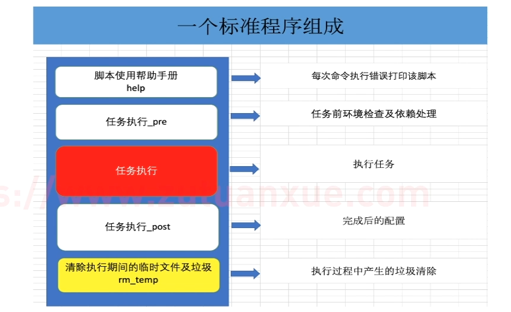

# shell脚本

> 课程文档：https://www.zutuanxue.com/home/4/6_8

## 基本命令

从输入处理


### 检索grep

> 负责从数据源中检索对应的字符串，行过滤
>
> 用途：根据关键字截取想要的行
>
> 还有个egrep，是升级版


一些电脑可能没有关键词加色，则设置行检索中关键字的颜色


```c
```


### 截取cut

> 截取某行的一部分字符串


```shell
//在1.txt中搜索带“void“的行，以空格为分割符找到第七个的匹配，再以找到第1-6个字符
grep "void" 1.txt | cut -d " " -f 7 | cut -c 1-6

//如果是以下，则只找第1和第6个字符
cut -c 1,6
```


### 整理tr

> 规范数据，让我们更好处理


tr的字符替换进行等额匹配

```shell
grep “inet” “string1” < filename
#只替换inet为stri 
```


去重

```shell
tr -s " " < filename
grep “xxx” 1.txt | tr -s " "
#去除重复的空格
___int_192_x__
|
v
_int_192_x_
```


删除字符

```shell
tr -d “1”
#删除字符1
tr -d "[1-6]"
#删除字符1-6
```


### 排序sort

> 以行为单位根据**首字符ASCII码**进行处理和**升序**排序，如果需要数据排序，则优先使用sort

```shell
sort：将文件的每一行作为一个单位，从首字符向后，依次按ASCII码值进行比较，最后将他们按升序输出。

语法：
sort [options] [filename]

-u ：去除重复行
-r ：降序排列，默认是升序
-o : 将排序结果输出到文件中  类似 重定向符号 >
-n ：以数字排序，默认是按字符排序
-t ：分隔符
-k ：第N列，如果设置了分割符则以分割符隔开调制

-b ：忽略前导空格。
-R ：随机排序，每次运行的结果均不同。
 
 示例：
# sort -n -t: -k3 1.txt 按照数字(-n)升序排列，使用“:"作为分割符(-t),对第三列进行排序
# sort -nr -t: -k3 1.txt 按照用户的uid进行降序排列(-r)
# sort -n 2.txt 按照数字排序
# sort -nu 2.txt 按照数字排序并且去重
# sort -nr 2.txt 
# sort -nru 2.txt 
# sort -nru 2.txt 
# sort -n 2.txt -o 3.txt 按照数字排序并将结果重定向到文件3.txt
# sort -R 2.txt 
# sort -u 2.txt 
```


### 去重uniq 

**应用技巧：去重前先使用sort排序**

```shell
uniq：去除连续重复行

语法：
uniq [options] [filename]

-i: 忽略大小写
-c: 统计重复行次数
-d:只显示重复行

# uniq 2.txt 
# uniq -d 2.txt 
# uniq -dc 2.txt 
```


### 双向输出tee

> 当你想把数据在屏幕打印一份，在磁盘保存一份
>
> 用途：多路径输出

```shell
tee工具从标准输入读取并写入标准输出和文件，即：双向覆盖重定向<屏幕输出|文本输入>
somecommand |tee filename

-a 双向追加重定向 #不加a会导致原文件被覆盖

echo hello world
echo hello world|tee file1  #屏幕打印hello world的同时覆盖写入file1
cat file1 
echo 999|tee -a file1   #屏幕打印999的同时追加写入file1
cat file1 
```


### 合并处理paste

> 如果我们想把两个文件的数据合并在一起处理
>
> 方法1：文件a和文件b合并到文件c中，对文件c进行处理
>
> 方法2：文件a和文件b合并到**内存**中处理

```shell
paste工具用于合并文件行输出到屏幕，不会改动源文件

-d：自定义间隔符，默认是tab,只接受一个字符#是文件合并后，列与列的分割符
-s：将每个文件中的所有内容按照一行输出，文件中的行与行以TAB间隔。

[root@zutuanxue shell01]# cat a.txt 
hello
[root@zutuanxue  shell01]# cat b.txt 
hello world
888
999
[root@zutuanxue  shell01]# paste a.txt b.txt 
hello   hello world
        888
        999
[root@zutuanxue  shell01]# paste b.txt a.txt   
hello world     hello
888
999

[root@zutuanxue shell01]# paste -d'@' b.txt a.txt 
hello world@hello
888@
999@

[root@zutuanxue shell01]# paste -s b.txt a.txt 
hello world     888     999
hello
```


### 命令行参数xargs

> 管道(|):上一个命令的输出作为下一个命令的输入，做的是**数据源**。
>
> 如果我们想把上一个参数的输出作为下一个命令的参数？

需要与管道配合使用

```shell
[root@manage01 ~]# sort -n 2.txt |uniq 
1
2
3
5
6
10
99
9999

如何将上一个命令的输出，作为下一个命令的参数呢？

xargs 上一个命令的输出作为下一个命令的命令行参数

回顾:
linux 命令格式
命令   命令选项   参数
ls -l /
========================
xargs 可以将管道或标准输入（stdin）数据转换成命令行参数，也能够从文件的输出中读取数据。

xargs 一般是和管道一起使用。

命令格式：
''[somecommand]|[filename]'' |xargs -item  command

OPTIONS:
-a file 从文件中读入作为sdtin
-E flag flag必须是一个以空格分隔的标志，当xargs分析到含有flag这个标志的时候就停止。#xargs遇到这个标志后会停止转换数据
-p 当每次执行一个argument的时候询问一次用户。
-n num 后面加次数，表示命令在执行的时候一次用的argument的个数，默认是用所有的。
-t 表示先打印命令，然后再执行。
-i 或者是-I，这得看linux支持了，将xargs的每项名称，一般是一行一行赋值给 {}，可以用 {} 代替。
-r no-run-if-empty 当xargs的输入为空的时候则停止xargs，不用再去执行了。
-d delim 分隔符，默认的xargs分隔符是回车，argument的分隔符是空格，这里修改的是xargs的分隔符。


注意：linux命令格式一般为
命令    命令选项     参数
上一个命令的输出就是下一个命令的参数  这句话结合命令语法  应该知道输出的内容在下一个命令的位置了吧。


案例
[root@zutuanxue  ~]find / -name zutuanxue |xargs gzip  #找到一个文件并把它作为gzip的参数，即压缩成zip
[root@zutuanxue  ~]# cat 1
1
2
3
4
5
6
7
8
9
10
[root@zutuanxue  ~]xargs -a 1 
1 2 3 4 5 6 7 8 9 10

[root@zutuanxue  ~]xargs -a 1 -E 5  #xargs读到5后停止
1 2 3 4

这样就明白使用xargs -a 为什么读取文件的时候会把文件中的所有内容都输出了吧
[root@zutuanxue  ~]# xargs -a 1.txt -p
echo 1 2 3 4 5 6 7 8 9 10 ?...y
1 2 3 4 5 6 7 8 9 10
[root@zutuanxue  ~]# xargs 2022-10-24 20-49-39 的屏幕截图-a 1.txt -p
echo 1 2 3 4 5 6 7 8 9 10 ?...n

同理为什么把文件中的所有行按一行输出呢，原因就是默认输出所有
[root@zutuanxue  ~]xargs -a 1.txt -n3  #-n3 一次处理三个参数
1 2 3
4 5 6
7 8 9
10
[root@zutuanxue  ~]# xargs -a 1.txt -n3 -p
echo 1 2 3 ?...y
echo 4 5 6 ?...1 2 3
y
echo 7 8 9 ?...4 5 6
y
echo 10 ?...7 8 9
y
10

和-p命令选项一样，显示他是怎么执行的，只不过这个不需要确认。
[root@zutuanxue  ~]# cat 1 |xargs -t
echo 1 2 3 4 5 6 7 8 9 10 
1 2 3 4 5 6 7 8 9 10

为何读入文件会把所有行都放在一行呢？这个和xargs的列分割符有关系
默认是回车（所以多行的数据最后变成一行）
我们可以使用-d 改掉默认列与列的默认分割符为其他，自然就会换行了
[root@zutuanxue  ~]# xargs -a 1.txt -d "@"
1
2
3
4
5
6
7
8
9
10
```


**自我探索**

rosrun加入参数

```c
2.txt的内容:
2
1

cat ./2.txt | xargs rosrun add_two_ints_server test_client
echo "2 1" | xargs rosrun add_two_ints_server test_client
#2和1被录入client作为两个参数
```


### shell字符

在命令行中可以敲一些字符

```shell
有基础的同学不要和正则表达式中的符号含义搞混淆了。    
    !:                执行历史命令   !! 执行上一条命令#(history:显示历史命令的编号)
    $:                变量中取内容符
    + - * / %:        对应数学运算  加 减 乘 除 取余数  
    &:                后台执行#加在正常的命令后面就行
    ;：               分号可以在shell中一行执行多个命令，命令之间用分号分割    
    \:                转义字符
    ``:               反引号 命令中执行命令    echo "today is `date +%F`"
    ' ':              单引号，脚本中字符串要用单引号引起来，但是不同于双引号的是，单引号不解释变量
    " ":              双引号，脚本中出现的字符串可以用双引号引起来

通配符    
    ~:                家目录    # cd ~ 代表进入用户家目录
    *:                星号是shell中的通配符  匹配所有
    ?:                问号是shell中的通配符  匹配除回车以外的一个字符（一个字节）
    [list]: 匹配[list]中的任意单个字符  # rm file[5-8] 文件file5-8被删除
[!list]: 匹配除list中的任意单个字符
{string1,string2,...}： 匹配string1,string2或更多字符串


重定向
>      覆盖输入     # echo 123 > file1  file1内容被覆盖
>> 追加输入
< 输出             # wc < file1 统计字节
<< 追加输出

管道命令
|：               管道符 上一个命令的输出作为下一个命令的输入   cat filename | grep "abc"
```


### #实战

> 命令组合的精髓：先匹配成统一格式再处理

#### 检索IP


```shell
#先检索出ens33网卡的那一行数据
ifconfig ens33 | grep -w "inet"

#规范数据，去掉开头的重复空格
ifconfig ens33 | grep -w "inet" | tr -s " "

#以空格为分割符，打印第三列(ip地址在的那一列)
ifconfig ens33 | grep -w "inet" | tr -s " " | cut -d " " -f3

#将输出转到输入
ifconfig ens33 | grep -w "inet" | tr -s " " | cut -d " " -f3 | xargs echo "IP: "

#####################
#同理对其他
#ifconfig ens33 | grep -w "inet" | tr -s " " | cut -d " " -f5 | xargs echo "NETMASK: "
#ifconfig ens33 | grep -w "inet" | tr -s " " | cut -d " " -f7 | xargs echo "Broadcast: "
```


#### 保存用户名和密码

> root用户UID为0，系统用户UID小于1000，普通用户大于1000


```shell
#找到非root用户
grep -i "bash" /etc/passed | grep -v "root"

#因为数据是以冒号分割的，所以设置cut冒号分隔符并打印1，2，7行(冒号还在)
grep -i "bash" /etc/passed | grep -v "root" | cut -d ":" -f1,2,7

#再将冒号换成Tab键
grep -i "bash" /etc/passed | grep -v "root" | cut -d ":" -f1,2,7 | tr ":" "\t"
```


## 基本结构




## 基本语法

> https://www.zutuanxue.com/home/4/6_10

### 脚本命名
 nginx_install.sh 脚本名称 脚本扩展名 .sh
 名字不要太长 26个字节内


### 代码规范

```shell
1、#!/bin/bash
//脚本第一行， #！魔法字符，指定脚本代码执行的程序。即它告诉系统这个脚本需要什么解释器来执行，也就是使用哪一种Shell

2、#代表注释，#！特例 

3、//以下内容是对脚本的基本信息的描述,大家可以根据实际情况尽可能的写详细一些，方便后续使用者
# Name: 脚本名字
# Desc:描述describe
# Path:存放路径
# Usage:用法
# Update:更新时间
# Author:作者
# Release: 分发版本

//下面就是脚本的具体内容
commands
...
```


### 执行方法
 – 标准脚本执行方法（建议）：

```shell
[root@zutuanxue shell01]# cat 1.sh 
#!/bin/bash
#xxxx
#xxx
#xxx
hostname
date
[root@zutuanxue shell01]# chmod +x 1.sh 
[root@zutuanxue shell01]# ll
total 4
-rwxr-xr-x 1 root root 42 Jul 22 14:40 1.sh
[root@zutuanxueshell01]# /shell/shell01/1.sh 
zutuanxue
Sun Jul 22 14:41:00 CST 2018
[root@zutuanxue shell01]# ./1.sh 
zutuanxue
Sun Jul 22 14:41:30 CST 2018
```

– 非标准的执行方法（不建议,仅在测试时使用)

```shell
[root@zutuanxue shell01]# bash 1.sh 
zutuanxue
Sun Jul 22 14:42:51 CST 2018
[root@zutuanxue shell01]# sh 1.sh
zutuanxue
Sun Jul 22 14:43:01 CST 2018
[root@zutuanxue shell01]# 
[root@zutuanxue shell01]# bash -x 1.sh
+ hostname
zutuanxue
+ date
Sun Jul 22 14:43:20 CST 2018

-x:一般用于排错，查看脚本的执行过程
-n:用来查看脚本的语法是否有问题

#注意：如果脚本没有加可执行权限，不能使用标准的执行方法执行，bash 1.sh

其他：
[root@zutuanxueshell01]# source 2.sh
server
Thu Nov 22 15:45:50 CST 2018
[root@zutuanxue shell01]# . 2.sh
server
Thu Nov 22 15:46:07 CST 2018

source 和 . 表示读取文件，执行文件里的命令
```

– 命令式脚本执行方法：

```shell
定义命令路径变量  PATH
PATH=$PATH:脚本路径

备注：脚本必须给执行权限
```


## 基本变量

### 变量介绍

> 变量：变量是编程中最常用的一种临时在内存中存取数据的一种方式

变量存取原理

```
关于内存的说明
a、系统启动    内存被按照1B一个单位划分成N块     并且以十六进制为每一个空间编号

b、内存跟踪表记录  使用和未使用的内存的地址编号

c、内存申请    系统从未使用的内存中拿出一个或者一段连续空间  给你使用   同时在内存跟踪表中记录
该地址被占用不在分给别人，同时在系统中建立映射机制   
比如:变量名 STRING1=‘ABC’

name<==>0x5

d、释放内存
从内存跟踪表中将记录删除，下次存数据直接覆盖
```


### 变量定义

#### 什么时候需要定义变量？

> 如果某个内容需要**多次使用，并且在代码中重复出现**，那么可以用变量代表该内容。这样在修改内容的时候，仅仅需要修改变量的值。
>  在代码运作的过程中，可能会把某些命令的执行结果保存起来，后续代码需要使用这些结果，就可以直接使用这个变量。

#### 定义一个变量

> 变量格式： 变量名=值

在shell编程中的变量名和等号之间==不能有空格==。

```
变量名命名规则：
    命名只能使用英文字母，数字和下划线，首个字符不能以数字开头。
    中间不能有空格，可以使用下划线（_）。
    不能使用标点符号。
    不能使用bash里的关键字（可用help命令查看保留关键字）。
```

定义变量举例：

>  VAR1=1
>  age=18 整形
>  name=‘baism’ 字符串
>  score=88.8 浮点

```
注意：字符串要用单引号或双引号引起来
建议变量名为大写，和命令区分
			_name
```

定义变量演示：

```
变量赋值，此种方法设置为本地变量
[root@zutuanxue ~]# name="baism"
[root@zutuanxue ~]# school='ayitula'
[root@zutuanxue ~]# age=30
[root@zutuanxue ~]# score=88.8
```


#### 取消变量 unset

```
取消当前环境中的变量，如果是变量设置是保存在文件中，下次重启又会恢复
[root@zutuanxue ~]# unset name
[root@zutuanxue ~]# echo $name
```


#### 有类型变量 declare

>  -i 将变量看成整数
>  -r 使变量只读 readonly,该变量的值无法改变，并且不能为unset
>  -x 标记变量通过环境导出 export
>  -a 指定为索引数组（普通数组）；查看普通数组
>  -A 指定为关联数组；查看关联数组

```
[root@zutuanxue ~]# declare -i num='asa'
[root@zutuanxue ~]# echo $num
0
[root@zutuanxue ~]# num=100
[root@zutuanxue ~]# echo $num
100
[root@zutuanxue ~]# declare -r num
[root@zutuanxue ~]# echo $num
100
[root@zutuanxue~]# num=200
-bash: num: 只读变量

[root@zutuanxue ~]# declare -x
declare -x HISTCONTROL="ignoredups"
declare -x HISTSIZE="1000"
declare -x HOME="/root"
declare -x HOSTNAME="Bai_Shuming"
declare -x LANG="zh_CN.UTF-8"
declare -x LESSOPEN="||/usr/bin/lesspipe.sh %s"
```


### 变量定义

系统中的变量根据作用域及生命周期可以分为四类：本地变量、环境变量、全局变量、内置变量

#### 本地变量

> 用户自定义的变量，定义在脚本或者当前终端中，脚本执行完毕或终端结束变量失效。


#### 环境变量

定义在用户家目录下的.bashrc或.bash_profile文件中，用户私有变量，只能本用户使用。

```shell 
#查看当前用户的环境变量 
 env
#查询当前用户的所有变量(临时变量与环境变量) 
 se
```


**将当前变量变成环境变量**  **export**

```shell
定义一个临时变量
1、
[root@zutuanxue tmp]# export A=hello //临时将一个本地变量（临时变量）变成环境变量
[root@zutuanxue tmp]# env|grep ^A
A=hello
2、
[root@zutuanxue tmp]# A=HELLO
[root@zutuanxue tmp]# export A

3、定义一个永久生效变量：
vim .bash_profile 或者 ~/.bashrc
A=hello


关于export说明
用户登录时:
1) 用户登录到Linux系统后，系统将启动一个用户shell。在这个shell中，可以使用shell命令或声明变量，也可以
创建并运行 shell脚本程序。

运行脚本时:
2) 运行shell脚本程序时，系统将创建一个子shell。此时，系统中将有两个shell，一个是登录时系统启动的shell，
另一个是系统为运行脚本程序创建的shell。当一个脚本程序运行完毕，它的脚本shell将终止，可以返回到执行该脚本
之前的shell。

从这种意义上来说，用户可以有许多 shell，每个shell都是由某个shell（称为父shell）派生的。
在子shell中定义的变量只在该子shell内有效。如果在一个shell脚本程序中定义了一个变量，当该脚本程序运行时，
这个定义的变量只是该脚本程序内的一个局部变量，其他的shell不能引用它，要使某个变量的值可以在其他shell中
被改变，可以使用export命令对已定义的变量进行输出。 

export命令将使系统在创建每一个新的shell时定义这个变量的一个拷贝。这个过程称之为变量输出。
```

父shell与子shell


#### 全局变量

使用export命令将本地变量输出为当前shell中的环境变量
 所有用户及shell都可以使用，可以在/etc/profile /etc/bashrc下永久定义

```shell
打印全局变量 printenv

定义格式
export SCHOOL='zutuanxue'


测试方法：
通过不同用户登录测试是否能读取变量
```


#### 内置变量

系统变量(内置bash中变量) ： shell本身已经固定好了它的名字和作用.

```shell
$?：上一条命令执行后返回的状态，当返回状态值为0时表示执行正常，非0值表示执行异常或出错
 若退出状态值为0，表示命令运行成功
 若退出状态值为127,表示command not found
 若退出状态值为126,表示找到了该命令但无法执行（权限不够）
 若退出状态值为1&2,表示没有那个文件或目录
 
$$：当前所在进程的进程号     echo $$   eg：kill -9 `echo $$`  = exit   退出当前会话

$!：后台运行的最后一个进程号  （当前终端）  # gedit &
!$ 调用最后一条命令历史中的参数
!! 调用最后一条命令历史


$#：脚本后面接的参数的个数
$*：脚本后面所有参数，参数当成一个整体输出，每一个变量参数之间以空格隔开
$@: 脚本后面所有参数，参数是独立的，也是全部输出

$0：当前执行的进程/程序名  echo $0     
$1~$9 位置参数变量
${10}~${n} 扩展位置参数变量  第10个位置变量必须用{}大括号括起来
./1.sh a b c

[root@zutuanxue shell01]# cat 2.sh 
#!/bin/bash
#xxxx
echo "\$0 = $0"
echo "\$# = $#"
echo "\$* = $*"
echo "\$@ = $@"
echo "\$1 = $1" 
echo "\$2 = $2" 
echo "\$3 = $3" 
echo "\$11 = ${11}" 
echo "\$12 = ${12}" 

了解$*和$@的区别：
$* :表示将变量看成一个整体
$@ :表示变量是独立的

#!/bin/bash
for i in "$@"
do
echo $i
done

echo "======我是分割线======="

for i in "$*"
do
echo $i
done

[root@zutuanxue shell01]# bash 3.sh a b c
a
b
c
======我是分割线=======
a b c
```


变量总结说明：

本地变量：当前用户自定义的变量。当前进程中有效，其他进程及当前进程的子进程无效。

环境变量：当前进程有效，并且能够被子进程调用。

全局变量：全局所有的用户和程序都能调用，且继承，新建的用户也默认能调用.

内置变量：shell本身已经固定好了它的名字和作用.

| 变量类型 | 作用域                       | 生命周期           |
| -------- | ---------------------------- | ------------------ |
| 本地变量 | 当前shell环境(子shell不能用) | 脚本结束或终端结束 |
| 环境变量 | 当前shell或者子shell         | 当前进程结束       |
| 全局变量 | 所有用户及shell环境          | 关机               |
| 内置变量 | 所有用户及shell环境          | 关机               |


### 变量取值

读取变量内容符: 读取方法：变量名

```shell
变量内容读出
[root@zutuanxue ~]# echo $name
baism
[root@zutuanxue ~]# echo $school
ayitula
[root@zutuanxue ~]# echo $age
30
[root@zutuanxue ~]# echo $score
88.8
```

**注意**

```shell
变量读取过程中，默认单引号是不解释变量的.比如
[root@zutuanxue ~]# echo '$name'
$name

如果必须使用单引号还要读取变量的值可以使用eval命令[重新运算求出参数的内容] 
[root@zutuanxue ~]# eval  echo '$name'
baism
```


### 其他变量（扩展）

```shell
1）取出一个目录下的目录和文件：dirname和 basename 
2）变量"内容"的删除和替换
一个“%”代表从右往左去掉一个/key/
两个“%%”代表从右往左最大去掉/key/
一个“#”代表从左往右去掉一个/key/
两个“##”代表从左往右最大去掉/key/

# A=/root/Desktop/shell/mem.txt 
# echo $A
/root/Desktop/shell/mem.txt
# dirname $A   取出目录
/root/Desktop/shell
# basename $A  取出文件
mem.txt

# url=www.taobao.com
# echo ${#url}      获取变量的长度
# echo ${url#*.}       以分隔符.界限  *匹配所有
# echo ${url##*.}
# echo ${url%.*}
# echo ${url%%.*}
```