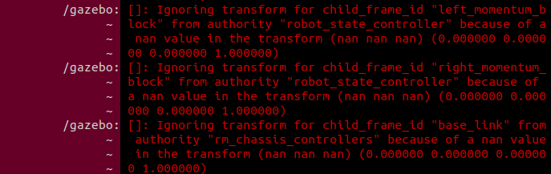
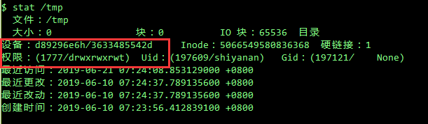

# 捉虫集

## GimbalChassis UI获取joint state数据报错

> 这是一个老问题，joint state controller会发布/joint_state话题，而我需要这个话题的数据，而当我首次访问这个数据的数组的时，便会core dump。

最后的解决方法:在访问数组前判断是否为空

```c
if(joint_state[])
    ui.update(joint_state[])  //大概是这样而以
```


## 裁判系统头帧数据显示长度异常

> 对于rm_referee出现的裁判系统数据长度有时会达到万级别，而导致在循环中访问数万次而core dump的情况，我采集了manual与referee的数据


### rm_manual

> manual也有解包相关方面，不过它的数据长度获取的数据都是正常的，稳定输出的
>
> 不过根据其他人的测试，似乎由于静电原因，会导致帧数据改变，所以manual也会崩。这也可能是referee崩的原因。

```c
manual:
          /rm_manual: [Referee::unpack]: data_length: 16
          /rm_manual: [Referee::unpack]: data_length: 16
          /rm_manual: [Referee::unpack]: data_length: 16
          /rm_manual: [Referee::unpack]: data_length: 16
          /rm_manual: [Referee::unpack]: data_length: 16
          /rm_manual: [Referee::unpack]: data_length: 16
          /rm_manual: [Referee::unpack]: data_length: 16
          /rm_manual: [Referee::unpack]: data_length: 16
          /rm_manual: [Referee::unpack]: data_length: 16
          /rm_manual: [Referee::unpack]: data_length: 16
          /rm_manual: [Referee::unpack]: data_length: 16
          /rm_manual: [Referee::unpack]: data_length: 16
          /rm_manual: [Referee::unpack]: data_length: 16
          /rm_manual: [Referee::unpack]: data_length: 27
          /rm_manual: [Referee::unpack]: data_length: 16
          /rm_manual: [Referee::unpack]: data_length: 16
          /rm_manual: [Referee::unpack]: data_length: 27
          /rm_manual: [Referee::unpack]: data_length: 16
          /rm_manual: [Referee::unpack]: data_length: 27
          /rm_manual: [Referee::unpack]: data_length: 16
          /rm_manual: [Referee::unpack]: data_length: 16
          /rm_manual: [Referee::unpack]: data_length: 27
          /rm_manual: [Referee::unpack]: data_length: 16
          /rm_manual: [Referee::unpack]: data_length: 16
          /rm_manual: [Referee::unpack]: data_length: 27
          /rm_manual: [Referee::unpack]: data_length: 16
          /rm_manual: [Referee::unpack]: data_length: 16
          /rm_manual: [Referee::unpack]: data_length: 27
          /rm_manual: [Referee::unpack]: data_length: 16
          /rm_manual: [Referee::unpack]: data_length: 27
          /rm_manual: [Referee::unpack]: data_length: 16
          /rm_manual: [Referee::unpack]: data_length: 16
[rosmon]: Shutting down...
          /rm_manual: /rm_manual exited with status 0
  /odom_tf_publisher: /odom_tf_publisher exited with status 0
  总共测试了20多分钟，运行正常
```


  

### rm_referee

#### 第一次简单测试

```c
  referee:
         /rm_referee: [Referee::unpack]: data length: 16
         /rm_referee: [Referee::unpack]: data length: 27
         /rm_referee: [Referee::unpack]: data length: 16
         /rm_referee: [Referee::unpack]: data length: 16
         /rm_referee: [Referee::unpack]: data length: 16
         /rm_referee: [Referee::unpack]: data length: 16
         /rm_referee: [Referee::unpack]: data length: 16
         /rm_referee: [Referee::unpack]: data length: 16
         /rm_referee: [Referee::unpack]: data length: 16
         /rm_referee: [Referee::unpack]: data length: 16
         /rm_referee: [Referee::unpack]: data length: 16
         /rm_referee: [Referee::unpack]: data length: 27
         /rm_referee: [Referee::unpack]: data length: 16
         /rm_referee: [Referee::unpack]: data length: 27
         /rm_referee: [Referee::unpack]: data length: 16
         /rm_referee: [Referee::unpack]: data length: 27
         /rm_referee: [Referee::unpack]: data length: 16
         /rm_referee: [Referee::unpack]: data length: 16
         /rm_referee: [Referee::unpack]: data length: 16
         /rm_referee: [Referee::unpack]: data length: 16
         /rm_referee: [Referee::unpack]: data length: 16
         /rm_referee: [Referee::unpack]: data length: 16
         /rm_referee: [Referee::unpack]: data length: 16
         /rm_referee: [Referee::unpack]: data length: 16
         /rm_referee: [Referee::unpack]: data length: 16
         /rm_referee: [Referee::unpack]: data length: 16
         /rm_referee: [Referee::unpack]: data length: 27
         /rm_referee: [Referee::unpack]: data length: 16
         /rm_referee: [Referee::unpack]: data length: 27
         /rm_referee: [Referee::unpack]: data length: 16
         /rm_referee: [Referee::read]: Port exception before read
         /rm_referee: [Referee::unpack]: data length: 6
         /rm_referee: [Referee::unpack]: data length: 16
         /rm_referee: [Referee::unpack]: data length: 16
         /rm_referee: [Referee::unpack]: data length: 16
         /rm_referee: [Referee::unpack]: data length: 16
         /rm_referee: [Referee::unpack]: data length: 16
         /rm_referee: [Referee::unpack]: data length: 16
         /rm_referee: [Referee::unpack]: data length: 16
         /rm_referee: [Referee::unpack]: data length: 27
         /rm_referee: [Referee::unpack]: data length: 16
         /rm_referee: [Referee::unpack]: data length: 27
         /rm_referee: [Referee::unpack]: data length: 16
         /rm_referee: [Referee::unpack]: data length: 27
         /rm_referee: [Referee::unpack]: data length: 16
         /rm_referee: [Referee::unpack]: data length: 16
         /rm_referee: [Referee::unpack]: data length: 16
         /rm_referee: [Referee::unpack]: data length: 6
         /rm_referee: [Referee::unpack]: data length: 16
         /rm_referee: [Referee::unpack]: data length: 6
         /rm_referee: [Referee::unpack]: data length: 16
         /rm_referee: [Referee::unpack]: data length: 16
         /rm_referee: [Referee::unpack]: data length: 15239
         /rm_referee: /rm_referee died from signal 11
         /rm_referee: /rm_referee left a core dump
         /rm_referee: Determined pattern '/tmp/rosmon-node-RDg1xG/core'
         /rm_referee: Could not find a matching core file :-(
```


#### 带入不同频率测试

##### 40HZ

```c

         /rm_referee: [Referee::unpack]: data length: 16
         /rm_referee: [Referee::unpack]: data length: 16
         /rm_referee: [Referee::unpack]: data length: 16
         /rm_referee: [Referee::unpack]: data length: 16
         /rm_referee: [Referee::unpack]: data length: 16
         /rm_referee: [Referee::unpack]: data length: 6
         /rm_referee: [Referee::unpack]: data length: 16
         /rm_referee: [Referee::unpack]: data length: 6
         /rm_referee: [Referee::unpack]: data length: 16
         /rm_referee: [Referee::unpack]: data length: 16
         /rm_referee: [Referee::unpack]: data length: 27
         /rm_referee: [Referee::unpack]: data length: 16
         /rm_referee: [Referee::unpack]: data length: 16
         /rm_referee: [Referee::unpack]: data length: 16
         /rm_referee: [Referee::unpack]: data length: 16
         /rm_referee: [Referee::unpack]: data length: 16
         /rm_referee: [Referee::unpack]: data length: 16
         /rm_referee: [Referee::unpack]: data length: 27
         /rm_referee: [Referee::unpack]: data length: 16
         /rm_referee: [Referee::unpack]: data length: 27
         /rm_referee: [Referee::unpack]: data length: 16
         /rm_referee: [Referee::unpack]: data length: 16
         /rm_referee: [Referee::unpack]: data length: 6
         /rm_referee: [Referee::unpack]: data length: 42242
         /rm_referee: /rm_referee died from signal 11
         /rm_referee: /rm_referee left a core dump
         /rm_referee: Determined pattern '/tmp/rosmon-node-TjqJIl/core'
         /rm_referee: Could not find a matching core file :-(

```


##### 50HZ

```c

         /rm_referee: [Referee::unpack]: data length: 16
         /rm_referee: [Referee::unpack]: data length: 16
         /rm_referee: [Referee::unpack]: data length: 16
         /rm_referee: [Referee::unpack]: data length: 16
         /rm_referee: [Referee::unpack]: data length: 16
         /rm_referee: [Referee::unpack]: data length: 16
         /rm_referee: [Referee::unpack]: data length: 16
         /rm_referee: [Referee::unpack]: data length: 16
         /rm_referee: [Referee::unpack]: data length: 27
         /rm_referee: [Referee::unpack]: data length: 16
         /rm_referee: [Referee::unpack]: data length: 27
         /rm_referee: [Referee::unpack]: data length: 16
         /rm_referee: [Referee::unpack]: data length: 16
         /rm_referee: [Referee::unpack]: data length: 16
         /rm_referee: [Referee::unpack]: data length: 16
         /rm_referee: [Referee::unpack]: data length: 4
         /rm_referee: [Referee::unpack]: data length: 16
         /rm_referee: [Referee::unpack]: data length: 15092
         /rm_referee: /rm_referee died from signal 11
         /rm_referee: /rm_referee left a core dump
         /rm_referee: Determined pattern '/tmp/rosmon-node-TtGg3c/core'
         /rm_referee: Could not find a matching core file :-(

```


```c
         /rm_referee: [Referee::unpack]: data length: 16
         /rm_referee: [Referee::unpack]: data length: 6
         /rm_referee: [Referee::unpack]: data length: 16
         /rm_referee: [Referee::unpack]: data length: 16
         /rm_referee: [Referee::unpack]: data length: 27
         /rm_referee: [Referee::unpack]: data length: 16
         /rm_referee: [Referee::unpack]: data length: 16
         /rm_referee: [Referee::unpack]: data length: 16
         /rm_referee: [Referee::unpack]: data length: 16
         /rm_referee: [Referee::unpack]: data length: 16
         /rm_referee: [Referee::unpack]: data length: 16
         /rm_referee: [Referee::unpack]: data length: 27
         /rm_referee: [Referee::unpack]: data length: 16
         /rm_referee: [Referee::unpack]: data length: 27
         /rm_referee: [Referee::unpack]: data length: 16
         /rm_referee: [Referee::unpack]: data length: 27
         /rm_referee: [Referee::unpack]: data length: 16
         /rm_referee: [Referee::unpack]: data length: 16
         /rm_referee: [Referee::unpack]: data length: 16
         /rm_referee: [Referee::unpack]: data length: 16
         /rm_referee: [Referee::unpack]: data length: 42242
         /rm_referee: /rm_referee died from signal 11
         /rm_referee: /rm_referee left a core dump
         /rm_referee: Determined pattern '/tmp/rosmon-node-gdLxoJ/core'
         /rm_referee: Could not find a matching core file :-(

```


```c
         /rm_referee: [Referee::read]: Port exception before read
         /rm_referee: [Referee::unpack]: data length: 6
         /rm_referee: [Referee::unpack]: data length: 16
         /rm_referee: [Referee::unpack]: data length: 16
         /rm_referee: [Referee::unpack]: data length: 16
         /rm_referee: [Referee::unpack]: data length: 16
         /rm_referee: [Referee::unpack]: data length: 16
         /rm_referee: [Referee::unpack]: data length: 16
         /rm_referee: [Referee::unpack]: data length: 16
         /rm_referee: [Referee::unpack]: data length: 27
         /rm_referee: [Referee::unpack]: data length: 16
         /rm_referee: [Referee::unpack]: data length: 27
         /rm_referee: [Referee::unpack]: data length: 16
         /rm_referee: [Referee::unpack]: data length: 27
         /rm_referee: [Referee::unpack]: data length: 16
         /rm_referee: [Referee::unpack]: data length: 16
         /rm_referee: [Referee::unpack]: data length: 16
         /rm_referee: [Referee::unpack]: data length: 6
         /rm_referee: [Referee::unpack]: data length: 16
         /rm_referee: [Referee::unpack]: data length: 6
         /rm_referee: [Referee::unpack]: data length: 16
         /rm_referee: [Referee::unpack]: data length: 16
         /rm_referee: [Referee::unpack]: data length: 15239
         /rm_referee: /rm_referee died from signal 11
         /rm_referee: /rm_referee left a core dump
         /rm_referee: Determined pattern '/tmp/rosmon-node-RDg1xG/core'
         /rm_referee: Could not find a matching core file :-(

```


##### 55HZ

```c
         /rm_referee: [Referee::unpack]: data length: 27
         /rm_referee: [Referee::unpack]: data length: 16
         /rm_referee: [Referee::unpack]: data length: 16
         /rm_referee: [Referee::unpack]: data length: 16
         /rm_referee: [Referee::unpack]: data length: 16
         /rm_referee: [Referee::unpack]: data length: 6
         /rm_referee: [Referee::unpack]: data length: 16
         /rm_referee: [Referee::unpack]: data length: 6
         /rm_referee: [Referee::unpack]: data length: 16
         /rm_referee: [Referee::unpack]: data length: 6
         /rm_referee: [Referee::unpack]: data length: 16
         /rm_referee: [Referee::unpack]: data length: 16
         /rm_referee: [Referee::unpack]: data length: 16
         /rm_referee: [Referee::unpack]: data length: 16
         /rm_referee: [Referee::unpack]: data length: 16
         /rm_referee: [Referee::unpack]: data length: 16
         /rm_referee: [Referee::unpack]: data length: 42264
         /rm_referee: /rm_referee died from signal 11
         /rm_referee: /rm_referee left a core dump
         /rm_referee: Determined pattern '/tmp/rosmon-node-Lm5Twb/core'
         /rm_referee: Could not find a matching core file :-(

```


##### 60HZ

###### 新发现

> 我额外添加了对rx_data的检索，正常情况下，它与data length的数据应该一样

```c
         /rm_referee: [Referee::unpack]: data length: 6, rx_data: 6
         /rm_referee: [Referee::unpack]: data length: 16, rx_data: 16
         /rm_referee: [Referee::unpack]: data length: 6, rx_data: 6
         /rm_referee: [Referee::unpack]: data length: 16, rx_data: 16
         /rm_referee: [Referee::unpack]: data length: 16, rx_data: 16
         /rm_referee: [Referee::unpack]: data length: 16, rx_data: 16
         /rm_referee: [Referee::unpack]: data length: 27, rx_data: 27
         /rm_referee: [Referee::unpack]: data length: 16, rx_data: 16
         /rm_referee: [Referee::unpack]: data length: 16, rx_data: 16
         /rm_referee: [Referee::unpack]: data length: 16, rx_data: 16
         /rm_referee: [Referee::unpack]: data length: 27, rx_data: 27
         /rm_referee: [Referee::unpack]: data length: 16, rx_data: 16
         /rm_referee: [Referee::unpack]: data length: 16, rx_data: 16
         /rm_referee: [Referee::unpack]: data length: 16, rx_data: 16
         /rm_referee: [Referee::unpack]: data length: 56587, rx_data: 11
         /rm_referee: /rm_referee died from signal 11
         /rm_referee: /rm_referee left a core dump
         /rm_referee: Determined pattern '/tmp/rosmon-node-hOWALc/core'
         /rm_referee: Could not find a matching core file :-(
▂▂▂▂▂▂▂▂▂▂▂▂▂▂▂▂▂▂▂▂▂▂▂▂▂▂▂▂▂▂▂▂▂▂▂▂▂▂▂▂▂▂▂▂▂▂▂▂▂▂▂▂▂▂▂▂▂▂▂▂▂▂▂▂▂
```

```c
         /rm_referee: [Referee::unpack]: data length: 16, rx_data: 16
         /rm_referee: [Referee::unpack]: data length: 16, rx_data: 16
         /rm_referee: [Referee::unpack]: data length: 27, rx_data: 27
         /rm_referee: [Referee::unpack]: data length: 16, rx_data: 16
         /rm_referee: [Referee::unpack]: data length: 16, rx_data: 16
         /rm_referee: [Referee::unpack]: data length: 16, rx_data: 16
         /rm_referee: [Referee::unpack]: data length: 56587, rx_data: 11
         /rm_referee: /rm_referee died from signal 11
         /rm_referee: /rm_referee left a core dump
         /rm_referee: Determined pattern '/tmp/rosmon-node-hOWALc/core'
         /rm_referee: Could not find a matching core file :-(
▂▂▂▂▂▂▂▂▂▂▂▂▂▂▂▂▂▂▂▂▂▂▂▂▂▂▂▂▂▂▂▂▂▂▂▂▂▂▂▂▂▂▂▂▂▂▂▂▂▂▂▂▂▂▂▂▂▂▂▂▂▂▂▂▂
```

但是，我们注意报错处，他们的值不一样了.

通过两次测试，都是在等于11时报错，且值一样

> 分析11的二进制：1011   56587的二进制: 1101110100001011


```c
第三次测试
         /rm_referee: [Referee::unpack]: data length: 27, rx_data: 27
         /rm_referee: [Referee::unpack]: data length: 16, rx_data: 16
         /rm_referee: [Referee::unpack]: data length: 27, rx_data: 27
         /rm_referee: [Referee::unpack]: data length: 16, rx_data: 16
         /rm_referee: [Referee::unpack]: data length: 27, rx_data: 27
         /rm_referee: [Referee::unpack]: data length: 42242, rx_data: 2
         /rm_referee: /rm_referee died from signal 11
         /rm_referee: /rm_referee left a core dump
         /rm_referee: Determined pattern '/tmp/rosmon-node-YYL5D0/core'
         /rm_referee: Could not find a matching core file :-(

```

> 分析2的二进制：10   42242的二进制:  1010010100000010

上面两次，1011对应1101110100001011的尾部4位，10对应1010010100000010的尾部2位


现在我怀疑是访问的问题了，data_length向前读了12位，总共获取了16位数据，即4个16进制位。

帧头应该是0xA5，即10100101，和上面两个数据不匹配，所以怀疑不成立。


现在我尝试将rx_data[0]也输出，这就是帧头数据，正常情况它应该是0xA5,即十进制165

```c
         /rm_referee: [Referee::unpack]: data length: 16, rx_data: 16, frame_head: 165
         /rm_referee: [Referee::unpack]: data length: 16, rx_data: 16, frame_head: 165
         /rm_referee: [Referee::unpack]: data length: 16, rx_data: 16, frame_head: 165
         /rm_referee: [Referee::unpack]: data length: 16, rx_data: 16, frame_head: 165
         /rm_referee: [Referee::unpack]: data length: 16, rx_data: 16, frame_head: 165
         /rm_referee: [Referee::unpack]: data length: 27, rx_data: 27, frame_head: 165
         /rm_referee: [Referee::unpack]: data length: 16, rx_data: 16, frame_head: 165
         /rm_referee: [Referee::unpack]: data length: 16, rx_data: 16, frame_head: 165
         /rm_referee: [Referee::unpack]: data length: 27, rx_data: 27, frame_head: 165
         /rm_referee: [Referee::unpack]: data length: 16, rx_data: 16, frame_head: 165
         /rm_referee: [Referee::unpack]: data length: 27, rx_data: 27, frame_head: 165
         /rm_referee: [Referee::unpack]: data length: 38400, rx_data: 0, frame_head: 165
         /rm_referee: /rm_referee died from signal 11
         /rm_referee: /rm_referee left a core dump
         /rm_referee: Determined pattern '/tmp/rosmon-node-4bD3ni/core'
         /rm_referee: Could not find a matching core file :-(

```

> 分析38400的二进制: 1001011000000000      0的二进制： 0

很明显，和前两次分析一样符合尾部相同


尝试读取frame_data的sof数据，正常情况下，它应该和头帧起始字节一样，为0xA5，即十进制165

```c
         /rm_referee: [Referee::unpack]: data length: 16, rx_data: 16, frame_sof: 165
         /rm_referee: [Referee::unpack]: data length: 16, rx_data: 16, frame_sof: 165
         /rm_referee: [Referee::unpack]: data length: 16, rx_data: 16, frame_sof: 165
         /rm_referee: [Referee::unpack]: data length: 16, rx_data: 16, frame_sof: 165
         /rm_referee: [Referee::unpack]: data length: 16, rx_data: 16, frame_sof: 165
         /rm_referee: [Referee::unpack]: data length: 16, rx_data: 16, frame_sof: 165
         /rm_referee: [Referee::unpack]: data length: 16, rx_data: 16, frame_sof: 165
         /rm_referee: [Referee::unpack]: data length: 16, rx_data: 16, frame_sof: 165
         /rm_referee: [Referee::unpack]: data length: 16, rx_data: 16, frame_sof: 165
         /rm_referee: [Referee::unpack]: data length: 27, rx_data: 27, frame_sof: 165
         /rm_referee: [Referee::unpack]: data length: 16, rx_data: 16, frame_sof: 165
         /rm_referee: [Referee::unpack]: data length: 27, rx_data: 27, frame_sof: 165
         /rm_referee: [Referee::unpack]: data length: 42242, rx_data: 2, frame_sof: 165
         /rm_referee: /rm_referee died from signal 11
         /rm_referee: /rm_referee left a core dump
         /rm_referee: Determined pattern '/tmp/rosmon-node-UAHhvP/core'
         /rm_referee: Could not find a matching core file :-(
```

帧头并没有问题，并且仍一样符合尾部相同。


看了串口协议后，我发现我漏了一点：储存data length的是uint16，是2个字节，单独rx_data[1]访问只有一个字节，现在我访问了rx_data[1]和rx_data[2]，这些都是data length 的数据位.

```c
    ROS_INFO("data length: %d, rx_data[1]: %d, rx_data[2]: %d", frame_header.data_length_, rx_data[1],rx_data[2]);
```


```c
         /rm_referee: [Referee::unpack]: data length: 16, rx_data[1]: 16, rx_data[2]: 0
         /rm_referee: [Referee::unpack]: data length: 16, rx_data[1]: 16, rx_data[2]: 0
         /rm_referee: [Referee::unpack]: data length: 16, rx_data[1]: 16, rx_data[2]: 0
         /rm_referee: [Referee::unpack]: data length: 16, rx_data[1]: 16, rx_data[2]: 0
         /rm_referee: [Referee::unpack]: data length: 16, rx_data[1]: 16, rx_data[2]: 0
         /rm_referee: [Referee::unpack]: data length: 16, rx_data[1]: 16, rx_data[2]: 0
         /rm_referee: [Referee::unpack]: data length: 16, rx_data[1]: 16, rx_data[2]: 0
         /rm_referee: [Referee::unpack]: data length: 16, rx_data[1]: 16, rx_data[2]: 0
         /rm_referee: [Referee::unpack]: data length: 27, rx_data[1]: 27, rx_data[2]: 0
         /rm_referee: [Referee::unpack]: data length: 16, rx_data[1]: 16, rx_data[2]: 0
         /rm_referee: [Referee::unpack]: data length: 27, rx_data[1]: 27, rx_data[2]: 0
         /rm_referee: [Referee::unpack]: data length: 16, rx_data[1]: 16, rx_data[2]: 0
         /rm_referee: [Referee::unpack]: data length: 27, rx_data[1]: 27, rx_data[2]: 0
         /rm_referee: [Referee::unpack]: data length: 16, rx_data[1]: 16, rx_data[2]: 0
         /rm_referee: [Referee::unpack]: data length: 16, rx_data[1]: 16, rx_data[2]: 0
         /rm_referee: [Referee::unpack]: data length: 42242, rx_data[1]: 2, rx_data[2]: 165
         /rm_referee: /rm_referee died from signal 11
         /rm_referee: /rm_referee left a core dump
         /rm_referee: Determined pattern '/tmp/rosmon-node-bzxHRX/core'
         /rm_referee: Could not find a matching core file :-(

```

```c
         /rm_referee: [Referee::unpack]: data length: 27, rx_data[1]: 27, rx_data[2]: 0
         /rm_referee: [Referee::unpack]: data length: 16, rx_data[1]: 16, rx_data[2]: 0
         /rm_referee: [Referee::unpack]: data length: 27, rx_data[1]: 27, rx_data[2]: 0
         /rm_referee: [Referee::unpack]: data length: 16, rx_data[1]: 16, rx_data[2]: 0
         /rm_referee: [Referee::unpack]: data length: 27, rx_data[1]: 27, rx_data[2]: 0
         /rm_referee: [Referee::unpack]: data length: 16, rx_data[1]: 16, rx_data[2]: 0
         /rm_referee: [Referee::unpack]: data length: 16, rx_data[1]: 16, rx_data[2]: 0
         /rm_referee: [Referee::unpack]: data length: 27, rx_data[1]: 27, rx_data[2]: 0
         /rm_referee: [Referee::unpack]: data length: 16, rx_data[1]: 16, rx_data[2]: 0
         /rm_referee: [Referee::unpack]: data length: 16, rx_data[1]: 16, rx_data[2]: 0
         /rm_referee: [Referee::unpack]: data length: 16, rx_data[1]: 16, rx_data[2]: 0
         /rm_referee: [Referee::unpack]: data length: 16, rx_data[1]: 16, rx_data[2]: 0
         /rm_referee: [Referee::unpack]: data length: 40515, rx_data[1]: 67, rx_data[2]: 158
         /rm_referee: /rm_referee died from signal 11
         /rm_referee: /rm_referee left a core dump

```

> 40515： 1001111001000011 与   67 ： 1000011  ，  158： 10011110

有意思的是，40515是先158再67组合出来的


```c
         /rm_referee: [Referee::unpack]: data length: 27, rx_data[0]: 165, rx_data[1]: 27, rx_data[2]: 0
         /rm_referee: [Referee::unpack]: data length: 16, rx_data[0]: 165, rx_data[1]: 16, rx_data[2]: 0
         /rm_referee: [Referee::unpack]: data length: 27, rx_data[0]: 165, rx_data[1]: 27, rx_data[2]: 0
         /rm_referee: [Referee::unpack]: data length: 16, rx_data[0]: 165, rx_data[1]: 16, rx_data[2]: 0
         /rm_referee: [Referee::unpack]: data length: 6, rx_data[0]: 165, rx_data[1]: 6, rx_data[2]: 0
         /rm_referee: [Referee::unpack]: data length: 16, rx_data[0]: 165, rx_data[1]: 16, rx_data[2]: 0
         /rm_referee: [Referee::unpack]: data length: 16, rx_data[0]: 165, rx_data[1]: 16, rx_data[2]: 0
         /rm_referee: [Referee::unpack]: data length: 16, rx_data[0]: 165, rx_data[1]: 16, rx_data[2]: 0
         /rm_referee: [Referee::unpack]: data length: 42242, rx_data[0]: 165, rx_data[1]: 2, rx_data[2]: 165
         /rm_referee: /rm_referee died from signal 11
         /rm_referee: /rm_referee left a core dump
         /rm_referee: Determined pattern '/tmp/rosmon-node-y93gzI/core'
         /rm_referee: Could not find a matching core file :-(
            [rosmon]: Shutting down...

```


最后试着屏蔽长帧来避免core dump

```c
    if(frame_header.data_length_ > 256)
    {
      ROS_INFO("data length: %d", frame_header.data_length_);
      return 0;
    }
```

被丢掉的数据：

```c
         /rm_referee: [RobotReferee::addUi]: time ui
         /rm_referee: [RobotReferee::addUi]: trigger ui
         /rm_referee: [RobotReferee::addUi]: fixed ui
         /rm_referee: [Referee::checkUiAdd]: Add ui
         /rm_referee: [Referee::unpack]: data length: 65296
         /rm_referee: [Referee::unpack]: data length: 65296
         /rm_referee: [Referee::unpack]: data length: 65296
         /rm_referee: [Referee::unpack]: data length: 4095
         /rm_referee: [Referee::unpack]: data length: 4095
         /rm_referee: [Referee::unpack]: data length: 65296
         /rm_referee: [Referee::unpack]: data length: 65296
         /rm_referee: [Referee::unpack]: data length: 65296
         /rm_referee: [Referee::unpack]: data length: 65296
         /rm_referee: [Referee::unpack]: data length: 42242
         /rm_referee: [Referee::unpack]: data length: 42242
         /rm_referee: [Referee::unpack]: data length: 42242
         /rm_referee: [Referee::unpack]: data length: 42242

```

**问题暂时性地解决**


##### 70HZ

```c
         /rm_referee: [Referee::unpack]: data length: 27
         /rm_referee: [Referee::unpack]: data length: 16
         /rm_referee: [Referee::unpack]: data length: 6
         /rm_referee: [Referee::unpack]: data length: 16
         /rm_referee: [Referee::unpack]: data length: 16
         /rm_referee: [Referee::unpack]: data length: 16
         /rm_referee: [Referee::unpack]: data length: 1
         /rm_referee: [Referee::unpack]: data length: 16
         /rm_referee: [Referee::unpack]: data length: 4
         /rm_referee: [Referee::unpack]: data length: 11
         /rm_referee: [Referee::unpack]: data length: 32
         /rm_referee: [Referee::unpack]: data length: 4
         /rm_referee: [Referee::unpack]: data length: 11
         /rm_referee: [Referee::unpack]: data length: 32
         /rm_referee: [Referee::unpack]: data length: 16
         /rm_referee: [Referee::unpack]: data length: 4
         /rm_referee: [Referee::unpack]: data length: 1
         /rm_referee: [Referee::unpack]: data length: 42242
         /rm_referee: /rm_referee died from signal 11
         /rm_referee: /rm_referee left a core dump
         /rm_referee: Determined pattern '/tmp/rosmon-node-1b1YjM/core'
         /rm_referee: Could not find a matching core file :-(

```


##### 100HZ

```c
         /rm_referee: [Referee::unpack]: data length: 16
         /rm_referee: [Referee::read]: Port exception before read
         /rm_referee: [Referee::unpack]: data length: 16
         /rm_referee: [Referee::unpack]: data length: 16
         /rm_referee: [Referee::unpack]: data length: 16
         /rm_referee: [Referee::unpack]: data length: 16
         /rm_referee: [Referee::unpack]: data length: 16
         /rm_referee: [Referee::unpack]: data length: 16
         /rm_referee: [Referee::unpack]: data length: 16
         /rm_referee: [Referee::unpack]: data length: 16
         /rm_referee: [Referee::unpack]: data length: 16
         /rm_referee: [Referee::read]: Port exception before read
         /rm_referee: [Referee::unpack]: data length: 16
         /rm_referee: [Referee::unpack]: data length: 16
         /rm_referee: [Referee::unpack]: data length: 27
         /rm_referee: [Referee::read]: Port exception before read
         /rm_referee: [Referee::unpack]: data length: 16
         /rm_referee: [Referee::unpack]: data length: 27
         /rm_referee: [Referee::unpack]: data length: 16
         /rm_referee: [Referee::read]: Port exception before read
         /rm_referee: [Referee::unpack]: data length: 27
         /rm_referee: [Referee::unpack]: data length: 16
         /rm_referee: [Referee::unpack]: data length: 16
         /rm_referee: [Referee::read]: Port exception before read
         /rm_referee: [Referee::unpack]: data length: 16
         /rm_referee: [Referee::unpack]: data length: 16
         /rm_referee: [Referee::unpack]: data length: 16
         /rm_referee: [Referee::read]: Port exception before read
         /rm_referee: [Referee::unpack]: data length: 16
         /rm_referee: [Referee::unpack]: data length: 16
         /rm_referee: [Referee::unpack]: data length: 42242
         /rm_referee: /rm_referee died from signal 11
         /rm_referee: /rm_referee left a core dump
         /rm_referee: Determined pattern '/tmp/rosmon-node-hmmEkT/core'
         /rm_referee: Could not find a matching core file :-(

```

100hz下出现更多exception，我认为是读得太快了。不过在退出的时候，data length和40hz一样都是42242


## 裁判系统串口一段时间后无法读取

> 在hz为60时，一段时间后尝试读取串口会无法得到数据，同时minicom也没有信息。hz改为80后状况缓解


## 遥控器操纵：除了cover其他无法控制

> 在运行一段时间后，随机出现底盘，云台，左拨杆功能全部失去，仅在开右拨杆后功能恢复正常

本地manual debug后发现错误点，以下两处被反复调用，此时会处于ON OFF反复切换的状态

```c
  if (remote_is_open_ && (time - dbus_data_.stamp).toSec() > 0.3)
  {
    ROS_INFO("Remote controller OFF");
    remoteControlTurnOff();
    remote_is_open_ = false;
  }
  if (!remote_is_open_ && (time - dbus_data_.stamp).toSec() < 0.3)
  {
    ROS_INFO("Remote controller ON");
    remoteControlTurnOn();
    remote_is_open_ = true;
  }
```


**关于为什么开右拨杆后功能恢复正常**

一个循环调用的函数会独立检查右拨杆

```c
 //void ManualBase::checkSwitch(const ros::Time& time)下
right_switch_down_event_.update(dbus_data_.s_r == rm_msgs::DbusData::DOWN);
  right_switch_mid_event_.update(dbus_data_.s_r == rm_msgs::DbusData::MID);
  right_switch_up_event_.update(dbus_data_.s_r == rm_msgs::DbusData::UP);
```


经测试dbus的接收正常(所以还能读右拨杆)

稳定触发该bug的方法：找一条语句打上断点后执行几次，使dbus_data的stamp和time有差值后，就进入无法操控模式


- 一个想法是，dbus的数据订阅者的队列有10，这个值较长，可能会导致新dbus数据延后，导致延时if判断生效，进入remoteControlTurnOff(); 在新的dbus来后，又满足了延时刷新，触发了remoteControlTurnOn();


## Gazebo加载云台的IMU后出现nan报错

> 在平衡步兵的仿真中出现了这个问题，平衡步兵有两个imu，一个在底盘一个在云台，云台处的imu只要一启用在打开chassiss controller的一瞬间就会报错



把平衡步兵的云台移到其他机器人上没问题，其他机器人的云台移动过来就有相同问题


对imu数据进行读取，发现是base_imu handle获取的数据都是0导致了解算出现nan

```c
  ROS_INFO("12 %f %f %f", imu_handle_.getAngularVelocity()[0], imu_handle_.getAngularVelocity()[1],
           imu_handle_.getAngularVelocity()[2]);
```


因为gazebo出现插件冲突的问题，rm_gazebo的包编译了无效。把战队源删除后我的rm_gazebo就能输出日志了，现在我发现imu handle是没问题的，仿真数据都能成功读取，现在问题在chassis controller的数据获取上


我检查了rm_robot_hw_sim.cpp文件，发现数据赋值没有问题，但是在和controller一样获取handle后值是0，这和注册handle时的值一样且不变，说明赋值失败。


后来打算获取变量地址

```c
Node: /gazebo
Time: 08:00:00.173000000 (1970-01-01)
Severity: Info

0x7fa1714cc5c0 0x7fa17151cbf0
-------------------------------------------------------
Node: /gazebo
Time: 08:00:00.173000000 (1970-01-01)

0x7fa1714cc480 0x7fa17151cbf0
--------------------------------------------------------
Node: /gazebo
Time: 08:00:00.172000000 (1970-01-01)
Severity: Info

aaa 0x7fa1714cc5c0
--------------------------------------------------------
Node: /gazebo
Time: 08:00:00.172000000 (1970-01-01)
    
aaa 0x7fa17151cbf0
```

> 0x7fa17151cbf0 是容器里gimbal地址
>
> 0x7fa1714cc5c0 是容器里base地址
>
> 0x7fa1714cc5c0 0x7fa17151cbf0分别是容器里base地址和base的handle储存的数据地址，二者对不上

之后又打印了gimbal的地址，现在发现gimbal是对得上的

```c
 0x7f62ef20fe70 //parseIMU()时容器内base的
 0x7f62ed4cb270 //parseIMU()时容器内gimbal的

//赋值时容器内base的  handle内base的  handle内gimbal的 
0x7f62ed4cb130 0x7f62ef20fe70 0x7f62ed4cb270
    
//赋值时容器内gimbal的  handle内base的  handle内gimbal的
0x7f62ed4cb270 0x7f62ef20fe70 0x7f62ed4cb270
```

vector元素地址不一样？赋值时修改的对象并不是handle储存的对象


经过[c++查询](https://en.cppreference.com/w/cpp/container/vector)，发现vector容器的元素内存地址会在程序的运行中进行随机分配

```c
“The storage of the vector is handled automatically, being expanded as needed. Vectors usually occupy more space than static arrays, because more memory is allocated to handle future growth. This way a vector does not need to reallocate each time an element is inserted, but only when the additional memory is exhausted. The total amount of allocated memory can be queried using capacity() function. Extra memory can be returned to the system via a call to shrink_to_fit(). (since C++11)”
```

原文中提到“This way a vector does not need to reallocate each time an element is inserted“，说明vector容器的元素内存地址会在插入元素后随机分配

不过有意思的是第一个元素地址并不会变化，这也就导致了从第二个元素开始才会有问题。

通过与can bus的数据存储比较，发现can数据使用map容器存储，这也许是can数据不会有问题的原因。

解决方案一：使用动态内存分配，imu容器内部元素类型为指针，尽管指针变量的地址会变，但其指向仍是动态分配的内存地址

解决方案二：使用reserve()函数，在vector插入元素前预分配足够的内存，避免元素内存地址在插入元素后随机分配(目前采用的方案)

以上两种方案都通过了测试

这个问题困扰了我一个多星期，最终一行代码解决问题，太痛苦了


## gpio hardware数据更新时读取文件超时

> linux内c++读取/sys系统内的文件时会发生因为文件夹层级太高而导致读取时间过长的问题,这会花费4-5ms

当文件夹层级太深时，读取文件的效率可能会变得很慢。为了解决这个问题，可以使用以下几种方法：

1. 减少文件夹层级：尽可能将文件夹的层级结构缩短，这样可以减少读取文件的时间。
2. 使用缓存技术：可以使用缓存技术将读取的文件数据缓存到内存中，这样可以提高后续读取的效率。
3. 使用索引技术：可以使用索引技术将文件夹中的文件路径信息保存到一个索引文件中，这样可以避免多次遍历文件夹层级结构，提高读取文件的效率。
4. 使用文件系统监控技术：可以使用文件系统监控技术来监控文件夹中文件的变化情况，当有文件变化时再进行读取操作，避免无谓的读取操作。

```c
/sys 目录是一个虚拟文件系统，通常被用于向用户层提供系统信息。它不是一个普通的文件系统，它的文件和文件夹都不是实际存在的物理文件，而是内核模块动态创建的。因此，不支持在 /sys 目录下直接使用索引技术来优化读取速度。

如果您需要频繁读取 /sys 目录下的文件，建议优化程序代码，减少不必要的访问。例如可以使用缓存机制，将读取的数据存储在内存中，减少对 /sys 目录的访问次数。此外，还可以通过减少目录层级来提高访问速度，将需要频繁访问的文件移动到 /sys 目录下的浅层次目录中。
```

**缓存方案**

> 在 Linux 系统中，对于一些特殊文件和目录，如 `/sys` 目录下的文件，在读取时会使用缓存机制，以提高读取效率。缓存是通过内核中的虚拟文件系统（Virtual File System，VFS）实现的。

默认情况下，对于 `/sys` 中的文件，内核会使用页缓存（Page Cache）机制，也就是将读取的数据缓存在内存中的页缓存中。当下一次读取同样的文件时，会直接从页缓存中读取，避免了多次从磁盘中读取的开销。对于写操作，数据也会先写入到页缓存中，然后才会写入到磁盘中。

如果要手动控制缓存机制，可以使用 `open()` 函数时设置相应的标志位，例如：

```
c++
int fd = open("/sys/class/net/eth0/address", O_RDONLY | O_DIRECT);
```

其中，`O_DIRECT` 标志位可以禁用页缓存机制，强制直接读取磁盘中的数据，这样可以避免在页缓存中产生一次额外的拷贝开销。但需要注意的是，使用 `O_DIRECT` 标志位需要满足一定的条件，例如读取的数据长度需要对齐到设备的块大小等。另外，`O_DIRECT` 标志位在一些文件系统上可能不支持。

除了 `O_DIRECT` 标志位，还可以使用 `posix_fadvise()` 函数来控制页缓存机制的行为，例如：

```
c++
posix_fadvise(fd, 0, 0, POSIX_FADV_DONTNEED);
```

其中，`POSIX_FADV_DONTNEED` 表示告诉内核当前不需要页缓存中的数据了，可以将其释放。这样可以避免不必要的页缓存占用，但需要注意的是，释放页缓存可能会导致下一次读取时需要重新从磁盘中读取数据，造成一定的开销。


## 平衡USB2CAN突然不闪，无法连接有线和屏幕输出

/var/log/syslog内核日志中找到以下信息

```c
Jul 29 09:23:00 urce busy
Jul 29 09:23:00 urce busy
Jul 29 09:23:00 evice "can2"
\00\00\00\00\00\00\00\00\00\00\00\00\00\00\00\00\00\00\00\00\00\00\00\00\00\00\00\00\00\00\00\00\00\00\00\00\00\00\00\00\00\00\00\00\00\00\00\00\00\00\00\00\00\00\00\00\00\00\00\00\00\00\00\00\00\00\00\00\00\00\00\00\00\00\00\00\00\00\00\00\00\00\00\00\00\00\00\00\00\00\00\00\00\00\00\00\00\00\00\00\00\00\00\00\00\00\00\00\00\00\00\00\00\00\00\00\00\00\00\00\00\00\00\00\00\00\00\00\00\00\00\00\00\00\00\00\00\00\00\00\00\00\00\00\00\00\00\00\00\00\00\00\00\00\00\00\00\00\00\00\00\00\00\00\00\00\00\00\00\00\00\00\00\00\00\00\00\00\00\00\00\00\00\00\00\00\00\00\00\00\00\00\00\00\00\00\00\00\00\00\00\00\00\00\00\00\00\00\00\00\00\00\00\00\00\00\00\00\00\00\00\00\00\00\00\00\00\00\00\00\00\00\00\00\00\00\00\00\00\00\00\00\00\00\00\00\00\00\00\00\00\00\00\00\00\00\00\00\00\00\00\00\00\00\00\00\00\00\00\00\00\00\00\00\00\00\00\00\00\00\00\00\00\00\00\00\00\00\00\00\00\00\00\00\00\00\00\00\00\00\00\00\00\00\00\00\00\00\00\00\00\00\00\00\00\00\00\00\00\00\00\00\00\00\00\00\00\00\00\00\00\00\00\00\00\00\00\00\00\00\00\00\00\00\00\00\00\00\00\00\00\00\00\00\00\00\00\00\00\00\00\00\00\00\00\00\00\00\00\00\00\00\00\00\00\00\00\00\00\00\00\00\00\00\00\00\00\00\00\00\00\00\00\00\00\00\00\00\00\00\00\00\00\00\00\00\00\00\00\00\00\00\00\00\00\00\00\00\00\00\00\00\00\00\00\00\00\00\00\00\00\00\00\00\00\00\00\00\00\00\00\00\00\00\00\00\00\00\00\00\00\00\00\00\00\00\00\00\00\00\00\00\00\00\00\00\00\00\00\00\00\00\00\00\00\00\00\00\00\00\00\00\00\00\00\00\00\00\00\00\00\00\00\00\00\00\00\00\00\00\00\00\00\00\00\00\00\00\00\00\00\00\00\00\00\00\00\00\00\00\00\00\00\00\00\00\00\00\00\00\00\00\00\00\00\00\00\00\00\00\00\00\00\00\00\00\00\00\00\00\00\00\00\00\00\00\00\00\00\00\00\00\00\00\00\00\00\00\00\00\00\00\00\00\00\00\00\00\00\00\00\00\00\00\00\00\00\00\00\00\00\00\00\00\00\00\00\00\00\00\00\00\00\00\00\00\00\00\00\00\00\00\00\00\00\00\00
Jul 29 09:24:50 balance systemd-pstore[552]: PStore dmesg-efi-169062263622001 moved to /var/lib/systemd/pstore/169062263/dmesg-efi-169062263622001
Jul 29 09:24:50 balance systemd-pstore[552]: PStore dmesg-efi-169062263621001 moved to /var/lib/systemd/pstore/169062263/dmesg-efi-169062263621001
Jul 29 09:24:50 balance kernel: [    0.000000] microcode: microcode updated early to revision 0xa6, date = 2022-06-28
Jul 29 09:24:50 balance systemd-pstore[552]: PStore dmesg-efi-169062263620001 moved to /var/lib/systemd/pstore/169062263/dmesg-efi-169062263620001
Jul 29 09:24:50 balance kernel: [    0.000000] Linux version 6.1.38-rt12-x64v4-xanmod1 (root@mascote) (gcc-12 (Debian 12.3.0-4~bpo12+1) 12.3.0, GNU ld (GNU Binutils for Debian) 2.40) #0~20230708.3fc9cd0 SMP PREEMPT_RT Sun Jul  9 02:35:07 UTC 2023
Jul 29 09:24:50 balance systemd-pstore[552]: PStore dmesg-efi-169062263619001 moved to /var/lib/systemd/pstore/169062263/dmesg-efi-169062263619001
Jul 29 09:24:50 balance kernel: [    0.000000] Command line: BOOT_IMAGE=/vmlinuz-6.1.38-rt12-x64v4-xanmod1 root=/dev/mapper/ubuntu--vg-lv--0 ro
Jul 29 09:24:50 balance kernel: [    0.000000] KERNEL supported cpus:
Jul 29 09:24:50 balance kernel: [    0.000000]   Intel GenuineIntel
Jul 29 09:24:50 balance systemd-pstore[552]: PStore dmesg-efi-169062263618001 moved to /var/lib/systemd/pstore/169062263/dmesg-efi-169062263618001
Jul 29 09:24:50 balance kernel: [    0.000000]   AMD AuthenticAMD
Jul 29 09:24:50 balance kernel: [    0.000000]   Hygon HygonGenuine
Jul 29 09:24:50 balance systemd-pstore[552]: PStore dmesg-efi-169062263617001 moved to /var/lib/systemd/pstore/169062263/dmesg-efi-169062263617001
Jul 29 09:24:50 balance kernel: [    0.000000]   Centaur CentaurHauls
Jul 29 09:24:50 balance kernel: [    0.000000]   zhaoxin   Shanghai  
```


## 编译报undefined main的报错

> 编译nanopi时出现问题：

> ```c++
> /usr/bin/ld: /usr/lib/gcc/x86_64-linux-gnu/9/../../../x86_64-linux-gnu/Scrt1.o: in function `_start':
> (.text+0x24): undefined reference to `main'
> ```

发现main函数不应该处于namespce中，应该空出来


```c++
//错误的
namespce xxx
{
  int main(int argc, char** argv)
  {
     ....
  }
}

//正确的
int main(int argc, char** argv)
{
    ....
}
```


## 运行ROS程序时报错需要申明ros::Time::init

运行提示

```c
Cannot use ros::Time::now() before the first NodeHandle has been created or ros::start() has been called.  If this is a standalone app or test that just uses ros::Time and does not communicate over ROS, you may also call ros::Time::init()
```

解决：

除了在 `ros::Time::now()` 之前需要创建 ROS 节点，在 `ros::Rate` ， `ros::ok()` 和 `ros::spinOnce()` 之前都需要先创建 ROS 节点。
 由于我是使用 C++ 类来实现消息的订阅和发布，所以需要使用初始化列表，在调用 `ros::Rate`
 的构造函数之前，调用 `ros::NodeHandle` 的构造函数。


# 不算虫的虫

> 代码规范上的事


### POWER_LIMIT赋值

> 在对power_limit的referee_data消除的工作中，需要补加需要的数据，原本是在powet_limit类里面加上msgs的变量，然后通过回调按值赋值。后在在凯子的建议下改称指针且仅在构造时赋值。虽然我的代码是能跑的，但是很显然非常不规范且不简洁。

**总结：尽量使用引用或指针**


## 平衡步兵读取/tmp/rm提示permission deine

Shell脚本在/tmp目录下，执行自启运行失败，提示Permission denied。


1、检查ls -al test.sh脚本是否有可执行权限。权限为777。看来套路不行啊。。以前通常90%都是这个原因引起的。

2、是/tmp目录没有执行权限？执行stat / 和stat /tmp发现权限都满足。。有点慌。。解决不了了。下图stat命令执行结果供参考。

 



3、借助搜索。发现是/tmp文件系统的属性被设置了**noexec。**noexec表示对应文件系统不允许执行可执行程序，即使文件具有可执行过权限。通常是考虑安全原因会这么设置。

**问题解决**

1、将脚本放到其他不具有noexec文件系统目录执行或者使用sh test.sh运行。

2、如果可以将/tmp文件系统中noexec属性去掉，可以使用如下操作步骤（说明：仅限测试环境操作）

**（1）在/etc/fstab文件中将/tmp文件系统的noexec属性删掉。**

**（2）重新挂载/tmp文件系统。执行umount /tmp; mount /tmp将/tmp文件重新挂载。**


# 码一个

## 暑假修改referee

**类型转换**

```c++
//最危险的是：
reinterpret_cast<uint8_t*>(地址不知道会不会影响到(uint8_t*)原来的功能
    
const_cast<uint8_t*>(指针变量)也是
```

