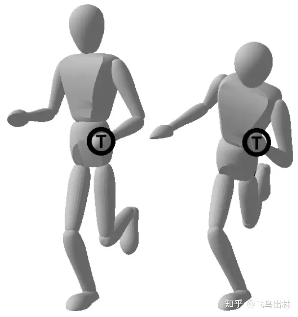

# WBC-全身控制

> [什么是WBC Whole Body Control](https://zhuanlan.zhihu.com/p/432969189)
>
> [MIT Cheetah 2019 WBC 学习](https://zhuanlan.zhihu.com/p/455119329)
>
> [基于零空间方法（NUB）的全身控制（WBC）的简单实现](https://zhuanlan.zhihu.com/p/164738620)


## 前置知识

### 冗余自由度

​	一个空间中的刚体具有6个自由度，即描述一个刚体在空间中的位姿至少需要使用6个变量。使用一个6个关节的串联机械臂就可以控制一个刚体运动到指定的位姿(假设指定的位姿是在机械臂的工作空间内的)。

​	如果使用一个7关节的机械臂呢？在机械臂操作刚体到指定的位姿后，机械臂仍然可以活动，因为它除了任务(操作刚体到指定位姿)需要的自由度(数量6)以外，还有一个多的自由度。，这就是==冗余自由度==

​	如果使用人形机器人呢？在完成操作刚体到指定位姿这个任务的同时，人形机器人依然有多余的自由度去完成其他任务。举一个具体的例子，当我们一个手抓着门把手的时候(任务一)，我们的身体仍然可以倾斜(任务二)。



随着机器人系统复杂度的增加，一个问题自然而然的出现：**如何充分利用机器人的自由度同时执行多个任务**？


### 零向量矩阵和零空间

​	**零向量矩阵**是一个由零值组成的矩阵，例如：
$$
\begin{bmatrix}
	0 & 0 & 0 \\
	0 & 0 & 0 \\
	0 & 0 & 0
\end{bmatrix}
$$


​	满足 Ax=0 的向量 x 的集合就是矩阵 A 的**零空间**，它是一个线性子空间，表示所有能使 A 乘以 x 得到零向量的 x 的集合。其中，x 是一个列向量，它的维度和 A 的列数相同。A 是一个 m 行 n 列的矩阵，它可以看作是一个从 n 维空间到 m 维空间的线性映射。

​	零空间反映了 A 的线性相关性，也就是 A 的列向量是否能够线性无关地张成 n 维空间。

​	举一个例子，如果$A=\begin{bmatrix}1&2&3\\4&5&6\end{bmatrix}$，那么 A 是一个 2 行 3 列的矩阵，它的零空间是什么呢？我们可以先将 A 化为简化的行阶梯矩阵 R，即：

$\begin{bmatrix}1&2&3\\4&5&6\end{bmatrix}$→$\begin{bmatrix}1&0&-1\\0&1&2\end{bmatrix}$

```c
要将一个行阶梯矩阵化为简化的行阶梯矩阵，我们需要用到初等行变换，主要有以下三种：

1.交换两行的位置；
2.将某一行乘以一个非零常数；
3.将某一行的倍数加到另一行上。

具体的步骤如下：

从最后一行开始，找到首个非零元素，如果它不是 1，就将该行乘以一个适当的常数，使得它变成 1；
然后，将该元素所在的列的其他元素都化为 0，方法是将该行的适当倍数加到其他行上；
重复以上两步，直到所有的非零行都满足简化的行阶梯矩阵的条件。

举一个例子，如果我们要将下面的行阶梯矩阵化为简化的行阶梯矩阵，我们可以这样做：
​1,0,0​2,−3,0​3,−6,0​​→​1,0,0​2,1,0​3,2,0​​→​1,0,0​0,1,0​−1,2,0​​
```

然后，我们可以从 R 中找出主元和自由变量，主元是每一行第一个非零元素，自由变量是没有主元的列对应的变量。在这个例子中，主元是 1 和 -3，自由变量是 x3。我们可以将 R 写成：

$\begin{bmatrix}1&0&-1\\0&1&2\end{bmatrix}\begin{bmatrix}x_1\\x_2\\x_3\end{bmatrix}=\begin{bmatrix}0\\0\end{bmatrix}$

这个方程组的解是：

$f(x)=\left\{
\begin{aligned}
x_1 & =  x_3 \\
x_2 & =  -2x_2 \\
\end{aligned}
\right.$

我们可以任意取 x3 的值，然后得到 x1 和 x2 的值，这样就得到了 A 的零空间的一个基础解系，即：


## 定义

​	WBC的出现就是为了解决上述问题，因此可以把WBC理解为**多任务控制**，或者明确的说是**分优先级的多任务控制**。


- **任务**和**优先级**

​	在介绍具体的算法之前，需要首先理解一下**任务**和**优先级**。


​	任务在不同的语境中代表的含义可能千差万别，WBC的语境下，**任务代表运动（或者运动产生的原因：力）**。运动的表达和形式可以是多种多样的，一个刚体的六维位姿随时间的变化是一种运动，刚体上的一个点的三维位置随时间的变化是一种运动。上述门把手的例子中，维持手的位置不变，让身体倾斜也都是一种具体的运动。


​	任务之间存在着潜在的优先级关系。关于优先级的理解可以从**直观经验**和**数学推导**两个角度理解。这里先从直观经验的角度给出解释。以人直立开门为例，**开门**和**站立时身体保持直立**(即身体是不倾斜的，没有弯腰等动作)可以看成是两个任务，在人完成直立开门这个行为的时候，如果门太重，我们会通过倾斜身体来增大开门的力，人的意识潜在的认为开门的优先级比身体直立优先级更高，所以为了保证开门任务的完成，我们需要适当牺牲身体直立这个任务。我们把这个例子推广，一个机器人在同时执行多个任务的时候，应该对任务进行合理的优先级分配，来应对多个任务无法同时执行的情况。


​	需要强调的是，WBC在执行控制的时候会利用机器人的全部自由度，但是其核心内容是**分优先级的多任务控制**。如果一个控制算法可以控制机器人全身所有的关节进行运动，但是没有**分优先级的多任务**的理念，那么这个方法不能被称作WBC。反之，只要一种算法体现了**分优先级的多任务控制**的理念，那么它就可以被称为WBC。


## 发展与分类

利用机器人的冗余性，执行分优先级的多任务控制的理念在上世纪80年代就已经出现，[2]是一篇比较有代表性的文献。最早是Luis Sentis(大佬)和Oussama Khatib(元老)把这种方法应用在人形机器人上并将其称为WBC[1][3]。Luis Sentis的博士论文就是关于WBC的理论研究[4]。随后，WBC就开始不断的发展，衍生出不同的实现算法，并且应用于各种各样的机器人。


文献[5]对WBC进行了一个大概的分类，这篇文献的作者包括Luis Sentis并且发表于2019年，因此时效性和权威性比较有保证。文中把WBC通过两个维度进行区分，如下图。


基于WBC输出控制量的类型与获得控制量解的方法可以将现有的WBC技术分为

- 速度WBC规划器(**Velocity-based**)
- 力矩WBC规划器(**Torque-based**)
- 封闭解WBC规划器(**closed-form**)
- QP-WBC规划器(**optimize-based**)

两两组合可以得到四种不同形式的WBC规划器。

> https://zhuanlan.zhihu.com/p/455119329


## 数学形式

​	我们明确了WBC是**分优先级的多任务控制**并且在直观经验上有了一定的了解。那么优先级在数学上是如何体现的呢?


​	先来看一下**基于优化的方法（Optimizaiton Methods)。**
​	我们知道一个带约束的数学优化问题可以写成如下形式:
$$
& minimize \ f_0(x) \\
   & subject \ to \ f_i(x)\leq, i = 1,...,m
$$


​	注：虽然约束看似只有不等式约束，但是实际上这种写法包含了等式约束。例如 $f_1(x) = 0$这个等式约束可以写成$f_1(x)\leq0,f_2(x)=-f_1(x)\leq0$


​	带约束的数学优化问题的优先级体现在**约束**和**目标函数**的关系上，当我们求解一个优化问题的时候，总是会保证求解的结果是在满足约束的前提下去最小化目标函数，因此约束本身具有更高的优先级。这一点是经常被搞数学的人忽视的，但是在WBC中却是有明显的物理意义的。所以我们可以把一系列的分优先级的任务对应到一系列的优化问题上，从而建立起物理和数学的关系。


​	再来看一下**封闭形式方法**（Closed-form methods）。


​	封闭的意义是我们需要求解的量 $y$ 可以通过一个函数 $f(x)$去获得，即 $y=f(x)$。从一种抽象层面上理解，等式可以想象成一个封闭的实物，而一个优化问题则类似一个开放的实物。基于速度的WBC的封闭形式可以写成
$$
\dot q = \dot q_1 + N_1\dot q_2 +N_2\dot q_3 +\  ...
$$
​	其中$\dot q_1, \dot q_2...$就是按照优先级进行排序过后的任务，而 $\dot q$ 就是最终需要输出给机器人关节的速度。所以问题的关键是如何确定这些 $\dot N$ ，零空间投影矩阵。其实关于这个矩阵有很多不同的求法，文献[6]给出了其中两种方法，但是关于不同的方法有什么差异我也不是很清楚。最后值得一提的是，零空间投影矩阵的计算离不开雅克比矩阵广义逆的计算，而广义逆本质上又是一个二次型优化问题的解，所以封闭形式方法中任务优先级依然是来源于优化方法中约束和目标函数之间的关系。


## 举例

### 基于零空间的简单实现

> https://zhuanlan.zhihu.com/p/164738620


- 知识补充

1. （$I-J^{\dagger}J$）的含义

​		$I-J^{\dagger}J$是一个投影矩阵，它可以将任意向量投影到矩阵J的列空间的正交补上。也就是说，如果$y$是任意向量，那么$(I-J^{\dagger}J)y$就是$y$在$J$的列空间的正交补上的分量。这个投影矩阵有一些特殊的性质，例如：

- 它是对称的，即 (I-J#× (J×J#)) = (I-J#× (J×J#))^T
- 它是幂等的，即 (I-J#× (J×J#))^2 = (I-J#× (J×J#))
- 它的迹等于它的秩，即 tr (I-J#× (J×J#)) = rank (I-J#× (J×J#))

在机器人运动学中，如果$J$是一个雅可比矩阵，那么$(I-J^{\dagger}J)y$可以表示一个与$J$的零空间相对应的运动，也就是机器人的冗余自由度。这种运动可以用来优化机器人的姿态，避免奇异点或碰撞等问题。

在机器人力控制中，如果$J$是一个力传递矩阵，那么$(I-J^{\dagger}J)y$可以表示一个与$J$的零空间相对应的力，也就是机器人的冗余力 。这种力可以用来优化机器人的接触稳定性，避免滑动或分离等问题 。


# 附录

*[1] Khatib O, Sentis L, Park J, et al. Whole-body dynamic behavior and control of human-like robots[J]. International Journal of Humanoid Robotics, 2004, 1(01): 29-43.
[2] Y. Nakamura, H. Hanafusa, T. Yoshikawa, Task-Priority Based Redundancy Control of Robot Manipulators, The International Journal of Robotics Research, 6(2):3-15, 1987
[3] Sentis L, Khatib O. Synthesis of whole-body behaviors through hierarchical control of behavioral primitives[J]. International Journal of Humanoid Robotics, 2005, 2(04): 505-518.
[4] Sentis L. Synthesis and control of whole-body behaviors in humanoid systems[M]. USA: stanford university, 2007.
[5] Moro F L, Sentis L. Whole-body control of humanoid robots[J]. Humanoid Robotics: A Reference (A. Goswami, and P. Vadakkepat, eds.), Springer, to appear, 2019.
[6] Dietrich, A., Ott, C., & Albu-Schäffer, A. (2015). An overview of null space projections for redundant, torque-controlled robots. The International Journal of Robotics Research, 34(11), 1385-1400.*