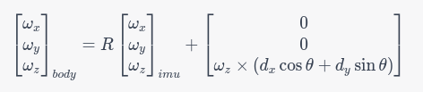
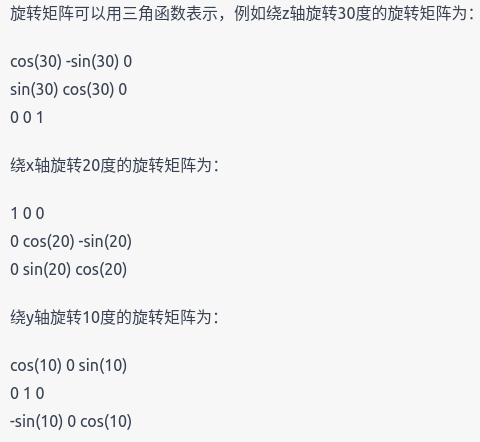

# 传感器数据分析


## IMU

### 偏移解算

- 假设IMU安装位置是车体中心x轴方向偏移1cm，那旋转时车体和imu位置的角速度的关系式使什么

> 假设车体绕其质心旋转，IMU相对于车体中心在x轴方向偏移1cm，则车体中心的角速度与IMU测量的角速度之间会存在偏差。具体来说，车体中心的角速度为 $\omega_{body}$，而IMU测量的角速度为 $\omega_{imu}$。假设车体绕z轴旋转，则有如下关系式：


$\omega_{body} = \omega_{imu} + \frac{v}{d}\sin\theta$


其中，$v$表示车体绕z轴旋转时的线速度，$d$表示IMU相对于车体中心的距离（即1cm），$\theta$表示车体旋转的角度。

这个关系式表明，IMU测量的角速度与车体中心的角速度之间存在一个补偿项 $\frac{v}{d}\sin\theta$，可以通过对IMU输出的角速度进行补偿来得到更准确的车体角速度。


- 如果imu的安装位置在车体xyz轴方向都有偏差，那imu角速度数据要怎么变换成车体的角速度

> 如果IMU的安装位置相对于车体存在在三个轴向上的偏差，就需要将IMU测量得到的角速度数据进行变换，才能得到与车体坐标系一致的角速度数据。

设IMU测量得到的角速度为 $[\omega_x, \omega_y, \omega_z]$，假设IMU的安装位置相对于车体坐标系有一个偏移量 $[d_x, d_y, d_z]$，假设车体坐标系与IMU坐标系之间的旋转关系为 $R$，则可以通过以下公式将IMU测量得到的角速度变换到车体坐标系下：



其中 $\theta$ 表示车体的俯仰角(pitch)【在-90度到+90度之间，因为IMU的安装位置应该在车体的上半部分】，$\omega_z$ 表示车体绕 $z$ 轴的角速度，x和dy是IMU相对于车体坐标系的位置偏差（在车体坐标系下表示的）

```c
在解算角速度的补偿项中，R是一个旋转矩阵，表示将IMU的坐标系旋转到车体坐标系所需的旋转操作。theta表示车体的旋转角度，也就是IMU所在坐标系相对于车体坐标系的旋转角度。
```

```c
//上面的公式里有dx和dy，为什么不用考虑dz
在该公式中，假设IMU在车体坐标系的z方向上，并且不会发生沿z轴方向的偏移。因此，我们可以假设在车体坐标系中，IMU的安装位置沿着z轴方向为0，即 $d_z=0$。

因此，在公式中的第二项中，$d_z$的影响被忽略，只有在$x$和$y$方向上的偏移需要被考虑。
```


### 旋转矩阵R

- 举一个R的例子并把矩阵写出来，这个例子包括xyz的旋转角度

> 假设需要绕z轴旋转30度，绕x轴旋转20度，绕y轴旋转10度，那么R的矩阵可以这样表示：

$R = Rz(30)Rx(20)Ry(10)$

其中，Rz(30)表示绕z轴旋转30度的旋转矩阵，Rx(20)表示绕x轴旋转20度的旋转矩阵，Ry(10)表示绕y轴旋转10度的旋转矩阵。



最终的R矩阵为这三个旋转矩阵的乘积。