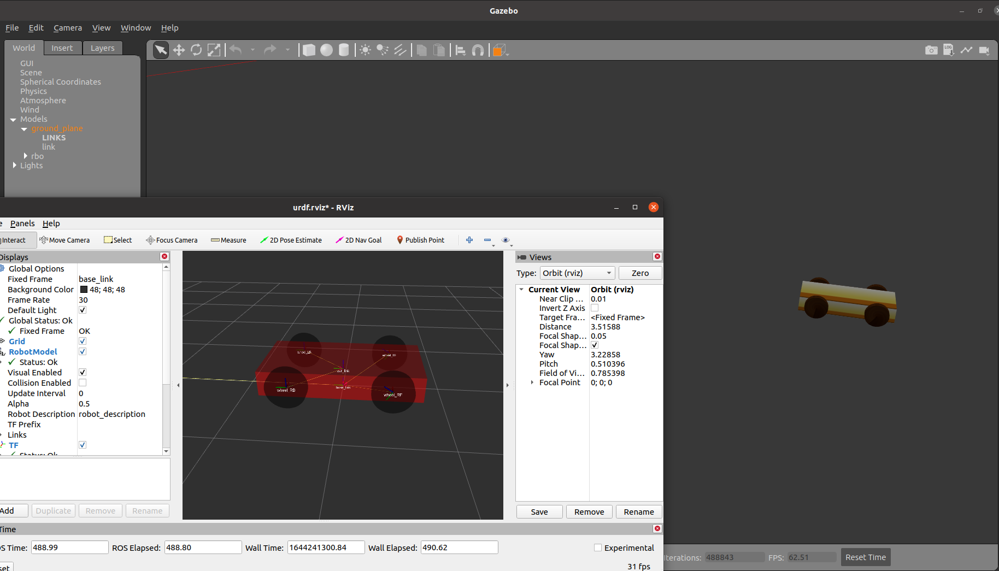

# 建立小车


## 总流程：

> 用gazebo打开：roslaunch urdf_sim_tutorial gazebo.launch model:=rbo.urdf.xacro
>
> 用rviz打开      ： roslaunch urdf_sim_tutorial gazebo.launch model:=rbo.urdf.xacro
>
> rostopic pub -r 30 /mobile_base_controller/cmd_vel geometry_msgs/Twist -- '[1.0,0,0]' '[0,0,0.0]'
>
> rostopic pub -r 30 /cmd_vel geometry_msgs/Twist -- ['0','0','0'] '[0,0,0.0]'


*Urdf 元素总览  [1](https://blog.csdn.net/wubaobao1993/article/details/80947968?spm=1001.2014.3001.5502) [4](https://blog.csdn.net/shenyan0712/article/details/89919959)

Urdf：Link内部元素解读:[2](https://blog.csdn.net/qq_40875849/article/details/119955948)

Urdf： Joint：[joint](http://wiki.ros.org/urdf/XML/joint) axis元素：[3](https://blog.csdn.net/weixin_42693104/article/details/81088209)

​			[transimission](http://wiki.ros.org/urdf/XML/Transmission)

> link：为便于理解，所有link部分逐一录入，四枚轮子注意各自的相对位置
>
> ``` c
>     <link name="wheel_LF">             //左上轮light_forward
>         <visual>
>             <xacro:cylinder_geometry length="${wheel_length}" radius="${wheel_radius}"/>
>             <xacro:default_origin xyz="${wheel_origin_xyz}" rpyaw="${wheel_origin_rpy}" />
>             <material name="Black"/>
>         </visual>
>         <collision>
>             <xacro:cylinder_geometry length="${wheel_length}" radius="${wheel_radius}"/>
>             <xacro:default_origin xyz="${wheel_origin_xyz}" rpyaw="${wheel_origin_rpy}" />
>         </collision>
>         <xacro:default_inertial mass="0.2"/>
>     </link>
> ```
>
> 


> wheel_joint：相对坐标与教程案例有偏差，轮子呈以横向半径为轴旋转，将axis改为“1.0 0.0 0.0 ”后解决
>
> ``` c
>     <joint name="car_base_wheel4" type="continuous">
>         <origin xyz="${(wheel_length+car_width)/-2.0} -0.5 0.0" rpy="0.0 0.0 0.0"/>
>         <parent link="car_link"/>
>         <child link="wheel_RF"/>
>         <axis xyz="1.0 0.0 0.0"/>
>     </joint>
> ```
>
> 


> 插件：filename后面尝试直接写入文件名，没有用，故采用绝对路径，成功
>
> *mu1*和*mu2*表示其摩擦系数,*kp*和*kd*表示其刚性
>
> ``` c
> <gazebo>
>      <plugin name="differential_drive_controller" filename="/opt/ros/noetic/lib/libgazebo_ros_diff_drive.so">
>          <rosDebugLevel>Debug</rosDebugLevel>
>          <robotNamespace>/</robotNamespace>
>          <alwaysOn>true</alwaysOn>
>          <updateRate>50.0</updateRate>
>          <leftJoint>car_base_wheel2</leftJoint>
>          <rightJoint>car_base_wheel4</rightJoint>
>          <wheelSeparation>0.8</wheelSeparation>
>          <wheelDiameter>0.2</wheelDiameter>
>          <torque>1.0</torque>
>          <commandTopic>cmd_vel</commandTopic>
>          <odometryTopic>odom</odometryTopic>
>          <odometryFrame>odom</odometryFrame>
>          <robotBaseFrame>base_link</robotBaseFrame>
>          <publishWheelTF>true</publishWheelTF>
>          <publishWheelJointState>true</publishWheelJointState>
>          <legecyMode>false</legecyMode>
>          <wheelAcceleration>1</wheelAcceleration>
>      </plugin>
>  </gazebo>
> ```
>

```c
//传动：注意上例的plugin与<plugin name="gazebo_ros_control" filename="libgazebo_ros_control.so">冲突
   <transmission name="wheel_LB_transmission">
        <type>transmission_interface/SimpleTransmission</type>
        <joint name="car_base_wheel1">
            <hardwareInterface>hardware_interface/VelocityJointInterface</hardwareInterface>
        </joint>
        <actuator name="LB_motor">
            <mechanicalReducction>1</mechanicalReducction>
        </actuator>
    </transmission>
```


> 一切完成后输入命令：
>
> goto
>
> 小车成功运动
>
> 


## 配置文件

> 控制器的编写参考例程与smb_common/smb_control中的control.yaml

注意left_wheel和right_wheel中填写的一定是wheel joint的名称，不要填写为link的名称

> ``` c
>   joint_state_controller:
>     type: "joint_state_controller/JointStateController"
>     publish_rate: 50
> 
>   mobile_base_controller:
>     type: "diff_drive_controller/DiffDriveController"
>     left_wheel  : [ 'car_base_wheel2', 'car_base_wheel1' ]
>     right_wheel : [ 'car_base_wheel4', 'car_base_wheel3' ]
>     pose_covariance_diagonal: [0.001, 0.001, 0.001, 0.001, 0.001, 0.03]
>     twist_covariance_diagonal: [0.001, 0.001, 0.001, 0.001, 0.001, 0.03]
> 
>     base_frame_id: base_link
> 
>     linear:
>       x:
>         has_velocity_limits    : true  
>         max_velocity           : 0.2   # m/s
>         has_acceleration_limits: true
>         max_acceleration       : 0.6   # m/s^2
>     angular:
>       z:
>         has_velocity_limits    : true
>         max_velocity           : 2.0   # rad/s
>         has_acceleration_limits: true
>         max_acceleration       : 6.0   # rad/s^2
> ```


## launch文件

> <param name="robot_description" command="$(find xacro)/xacro --inorder '$(find ros_urdf_learn)/urdf/rbo1.urdf.xacro'"/>这一行的$(find xacro)/xacro在ubuntu20.4中不需要加.py后缀。
>
> ``` c
> //注意rviz的显示还和jointstatepublish和robot---这两控制器有关
> ```
>
> 
>
> ``` c
> <launch>
>  <arg name="model" default="$(find ros_urdf_learn)/urdf/rbo1.urdf.xacro"/>
>  <arg name="rviz_config" default="$(find urdf_tutorial)/rviz/urdf.rviz"/>
>  <arg name="use_gui" default="True"/>
> 
>  <!-- rosparam -->
>  <param name="robot_description" command="$(find xacro)/xacro --inorder '$(find ros_urdf_learn)/urdf/rbo1.urdf.xacro'"/>
>  <!-- joint state publisher -->
>  <node name="joint_state_publisher" pkg="joint_state_publisher" type="joint_state_publisher"/>
> 
>  <node name="robot_state_publisher" pkg="robot_state_publisher" type="robot_state_publisher"/>
> 
>  <!-- gazebo -->
>  <include file="$(find gazebo_ros)/launch/empty_world.launch">
>  </include>
> 
>  <!-- spawn model -->
>  <node name="robot_gazebo_spawner" pkg="gazebo_ros" type="spawn_model" args="-urdf -model rbo -param robot_description">
>  </node>
> 
>  <!-- load controller yaml -->
>  <rosparam command="load" file="$(find ros_urdf_learn)/config/control.yaml"/>
>  <!-- controller manager -->
>  <node name="controller_manager" pkg="controller_manager" type="spawner" ns="/"
>      args="joint_state_controller mobile_base_controller"/>
> 
>  <!-- rviz -->
>  <node name="rviz" pkg="rviz" type="rviz" args="-d $(arg rviz_config)" />
> 
> </launch>
> ```
>
> launch启动
>
> 
