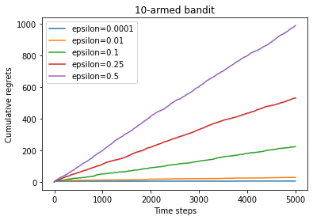
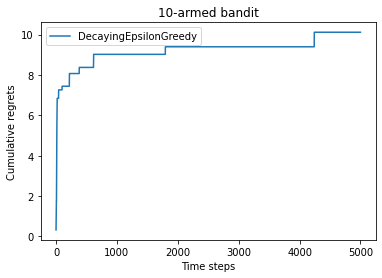
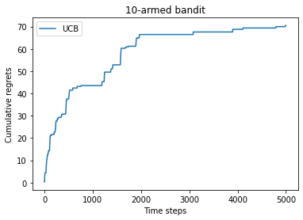
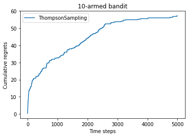
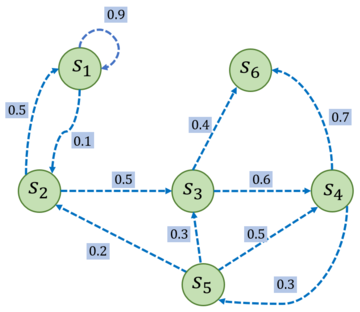
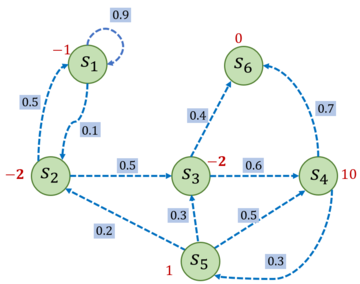
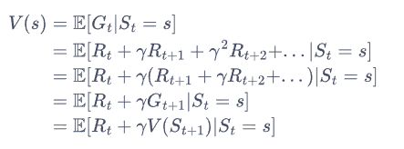
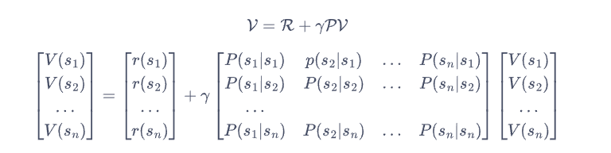
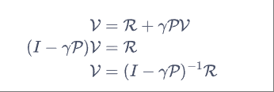
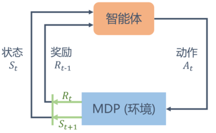

# 强化学习

> https://hrl.boyuai.com/chapter/intro/

本文档基于该教程做辅助说明，不做重复的概念及公式详解


> α [阿尔法](https://zhida.zhihu.com/search?content_id=119196264&content_type=Article&match_order=1&q=阿尔法&zhida_source=entity)， β [贝塔](https://zhida.zhihu.com/search?content_id=119196264&content_type=Article&match_order=1&q=贝塔&zhida_source=entity)， γ [伽玛](https://zhida.zhihu.com/search?content_id=119196264&content_type=Article&match_order=1&q=伽玛&zhida_source=entity)，δ [德尔塔](https://zhida.zhihu.com/search?content_id=119196264&content_type=Article&match_order=1&q=德尔塔&zhida_source=entity)， ε [伊普西隆](https://zhida.zhihu.com/search?content_id=119196264&content_type=Article&match_order=1&q=伊普西隆&zhida_source=entity)， ζ [泽塔](https://zhida.zhihu.com/search?content_id=119196264&content_type=Article&match_order=1&q=泽塔&zhida_source=entity)， η [伊塔](https://zhida.zhihu.com/search?content_id=119196264&content_type=Article&match_order=1&q=伊塔&zhida_source=entity)， θ 西塔， ι 约塔， κ [卡帕](https://zhida.zhihu.com/search?content_id=119196264&content_type=Article&match_order=1&q=卡帕&zhida_source=entity)， λ [兰姆达](https://zhida.zhihu.com/search?content_id=119196264&content_type=Article&match_order=1&q=兰姆达&zhida_source=entity)，μ 米欧 ，ν 纽， ξ 克西， ο [欧米克隆](https://zhida.zhihu.com/search?content_id=119196264&content_type=Article&match_order=1&q=欧米克隆&zhida_source=entity)， π 派， ρ 柔 ，σ [西格玛](https://zhida.zhihu.com/search?content_id=119196264&content_type=Article&match_order=1&q=西格玛&zhida_source=entity)， τ 陶 ，υ [玉普西隆](https://zhida.zhihu.com/search?content_id=119196264&content_type=Article&match_order=1&q=玉普西隆&zhida_source=entity)， φ 弗爱， χ 凯， ψ [普赛](https://zhida.zhihu.com/search?content_id=119196264&content_type=Article&match_order=1&q=普赛&zhida_source=entity)


## 基础篇

### 多臂老虎机

> 有多台老虎机摆在决策体面前，目前需要解决的问题是，如何在有限次数内作出能够获得最多奖励的拉杆动作组。


#### ϵ-贪心算法

最简单的算法，算法会记录目前抽取期望最高的老虎机，并在后面继续以1-ϵ的概率抽取它，ϵ越大机器人对其他老虎机进行探索的概率也更大。


下图为不同ϵ时的累积懊悔：




下图为ϵ等于1/t时的累积懊悔：




#### 上置信界算法

> 通过**霍夫丁不等式（Hoeffding's inequality）** 为每个动作的期望奖励计算一个**上置信界**，在每次决策时选择上界最大的动作。

**上置信界公式**：
$$
\mathrm{U C B} ( k )={\hat{Q}} ( k )+c \cdot{\sqrt{\frac{\operatorname{ln} t} {2 \cdot( N ( k )+1 )}}}
$$

- $\hat{Q}{(k)}$:动作 *k* 的当前期望奖励估计。

- *c*：探索系数（默认 *c*=1）。
- *t*：总时间步数。
- *N*(*k*)：动作 *k* 被选择的次数。
- **核心作用**：对尝试==次数少==的动作赋予更高的不确定性补偿，促进探索


**期望奖励更新公式**：
$$
\hat{Q}_{n e w} ( k )=\hat{Q}_{o l d} ( k )+\frac{1} {N ( k )+1} \left( r-\hat{Q}_{o l d} ( k ) \right)
$$

- 增量式更新，时间复杂度 *O*(1)，效率高。


累积懊悔：




#### 汤普森采样算法

> 汤普森采样算法（Thompson Sampling）在多臂老虎机问题中的工作原理基于**贝叶斯思想**和**概率采样**，核心是通过动态更新每个动作的奖励概率分布模型，并基于采样结果选择动作。

贝叶斯推断：假设每个拉杆的奖励服从一个**概率分布**（如伯努利分布），初始时该分布是未知的。

动态更新：通过不断拉动拉杆获得奖励数据，更新对该拉杆奖励分布的认知。

采样决策：每次决策时，从当前**估计的分布中**采样一组可能的奖励值，选择采样值最大的拉杆。


- **初始状态**：所有拉杆的分布为 Beta(1,1)（均匀分布）。
- **第一步**：随机采样一组概率（如 `[0.3, 0.7, ..., 0.5]`），选中最大值对应的拉杆（如第2根）。
- **更新**：若获得奖励 1，则更新该拉杆分布为 Beta(2,1)；若为 0 则更新为 Beta(1,2)。
- **后续步骤:**
  - 高奖励拉杆的分布逐渐右移（均值增大），更易被选中。
  - 拉动次数少的拉杆仍有机会因采样值高被探索。


累积懊悔：




#### 总结

ϵ-贪婪算法的累积懊悔是随时间线性增长的，而另外 3 种算法（ -衰减贪婪算法、上置信界算法、汤普森采样算法）的累积懊悔都是随时间次线性增长的（具体为对数形式增长）。

多臂老虎机问题与强化学习的一大区别在于其与环境的交互并不会改变环境，即多臂老虎机的每次交互的结果和以往的动作无关，所以可看作**无状态的强化学习**（stateless reinforcement learning）。第 3 章将开始在有状态的环境下讨论强化学习，即马尔可夫决策过程。


### 马尔可夫决策过程

> 与多臂老虎机问题不同，马尔可夫决策过程包含状态信息以及状态之间的转移机制。如果要用强化学习去解决一个实际问题，第一步要做的事情就是把这个实际问题抽象为一个马尔可夫决策过程，也就是明确马尔可夫决策过程的各个组成要素。


#### 马尔可夫过程

- 马尔可夫性质

当且仅当某时刻的状态只取决于上一时刻的状态时，一个随机过程被称为具有**马尔可夫性质**


- 马尔可夫过程

**马尔可夫过程**（Markov process）指具有马尔可夫性质的随机过程，也被称为**马尔可夫链**（Markov chain）。状态转移矩阵$P$定义了所有状态对之间的转移概率.



给定一个马尔可夫过程，我们就可以从某个状态出发，根据它的状态转移矩阵生成一个状态**序列**（episode），这个步骤也被叫做**采样**（sampling）。例如，从s1出发，可以生成序列s1->s2->s3->s6等。生成这些序列的概率和状态转移矩阵有关。


#### 奖励过程

> 在马尔可夫过程的基础上加入奖励函数$r$和折扣因子$\gamma$，就可以得到**马尔可夫奖励过程**（Markov reward process）。==$r$==表示某个状态转移到新状态的奖励，==$\gamma$==取值[0,1)，越靠近1越关注长期奖励。


- 回报

在一个马尔可夫奖励过程中，从第t时刻状态开始，直到终止状态$S_t$时，所有奖励的衰减之和称为==**回报**$G_t$==
$$
G_{t}=R_{t}+\gamma R_{t+1}+\gamma^{2} R_{t+2}+\cdots=\sum_{k=0}^{\infty} \gamma^{k} R_{t+k}
$$
其中==$R_t$==表示时刻t获得的奖励，最终构成一个奖励过程：




- 价值函数

在马尔可夫奖励过程中，一个状态的期望回报（即从这个状态出发的未来累积奖励的期望）被称为这个状态的价值 $( \mathrm{v a l u e} )$ 。所有状态的价值就组成了价值函数（value function)，价值函数的输入为某个状态，输出为这个状态的价值。我们将价值函数写成 $V ( s )=\mathbb{E} [ G_{t} | S_{t}=s ]$ ，展开为



公式类型是嵌套的，新的结果和上一次结果有关
$$
V ( s )=r ( s )+\gamma\sum_{s^{\prime} \in S} p ( s^{\prime} | s ) V ( s^{\prime} )
$$
上式就是马尔可夫奖励过程中非常有名的**贝尔曼方程**（Bellman equation），对每一个状态都成立。对于有n个状态的马尔可夫过程$\mathrm{S}=\{s_{1}, s_{2}, \ldots, s_{n} \}$ ，将所有状态的价值表示成一个列向量 $\mathcal{V}=[ V ( s_{1} ), V ( s_{2} ), \ldots, V ( s_{n} ) ]^{T}$ ，同理，将奖励函数写成一个列向量 $\mathcal{R}=[ r ( s_{1} ), r ( s_{2} ), \ldots, r ( s_{n} ) ]^{T}$ ，于是我们可以将贝尔曼方程写成矩阵的形式：



我们可以直接根据矩阵运算求解，得到以下解析解：




以上解析解的计算复杂度是$O(n^3)$，其中是n状态个数，因此这种方法只适用很小的马尔可夫奖励过程。求解较大规模的马尔可夫奖励过程中的价值函数时，可以使用**动态规划**（dynamic programming）算法、**蒙特卡洛方法**（Monte-Carlo method）和**时序差分**（temporal difference），这些方法将在之后的章节介绍。


#### 决策过程

> 马尔可夫过程和马尔可夫奖励过程都是自发改变的随机过程；而如果有一个外界的“刺激”来共同改变这个随机过程，就有了**马尔可夫决策过程**（Markov decision process，MDP）。我们将这个来自外界的刺激称为**智能体**（agent）的动作，在马尔可夫奖励过程（MRP）的基础上加入动作，就得到了马尔可夫决策过程（MDP）。

马尔可夫决策过程由元组$<S,A,P,r,\gamma>$构成，其中：

$\mathcal{S}$ 是状态的集合；
 $\mathcal{A}$ 是动作的集合；
$\gamma$ 是折扣因子;
$r ( s, a )$ 是奖励函数，此时奖励可以同时取决于状态s和==动作 $a$== ，在奖励函数只取决于状态s时，则退化为 $r ( s )$ ; 。 $P ( s^{\prime} | s, a )$ 是状态转移函数，表示在状态s执行动作 $a$ 之后到达状态 $s^{\prime}$ 的概率。


现在由于新的变量动作a的加入，呈现三维形式，无法使用二维矩阵方式描述奖励函数。不同于马尔可夫奖励过程，在马尔可夫决策过程中，通常存在一个==智能体==来执行动作。

智能体的目标是最大化得到的累计奖励。智能体根据当前状态从动作的集合中选择一个动作的函数，被称为**策略**。




- 策略

智能体的**策略**（Policy）通常用字母$\pi$表示。策略$pi(a|s)=P(A_t=a|S_t=s)$是一个函数，表示在输入状态情况下采取动作的概率。

当一个策略是**确定性策略**（deterministic policy）时，它在每个状态时只输出一个确定性的动作，即只有该动作的概率为 1，其他动作的概率为 0；当一个策略是**随机性策略**（stochastic policy）时，它在每个状态时输出的是关于动作的概率分布，然后根据该分布进行采样就可以得到一个动作。

在 MDP 中，由于马尔可夫性质的存在，策略只需要与当前状态有关，不需要考虑历史状态。回顾一下在 MRP 中的价值函数，在 MDP 中也同样可以定义类似的价值函数。但此时的==价值函数与策略有关==，这意为着对于两个不同的策略来说，它们在同一个状态下的价值也很可能是不同的。这很好理解，因为不同的策略会采取不同的动作，从而之后会遇到不同的状态，以及获得不同的奖励，所以它们的累积奖励的期望也就不同，即状态价值不同。


- 状态价值函数

用 $V^{\pi} ( s )$ 表示在 MDP 中基于==策略 $\pi$== 的状态价值函数（state-value function)，定义为从状态s出发遵循策略，能获得的期望回报， 数学表达为：
$$
V^{\pi} ( s )=\mathbb{E}_{\pi} [ G_{t} | S_{t}=s ]
$$


- 动作价值函数

不同于 MRP，在 MDP 中，由于动作的存在，我们额外定义一个动作价值函数（action-value function)。我们用 $Q^{\pi} ( s, a )$ 表示在 MDP 遵循策略时，对当前状态s执行动作 $a$ 得到的期望回报：
$$
Q^{\pi} ( s, a )=\mathbb{E}_{\pi} [ G_{t} | S_{t}=s, A_{t}=a ]
$$
状态价值函数和动作价值函数之间的关系：在使用策略 $\pi$ 中，状态s的价值等于在该状态下基于策略 $\pi$ 采取所有动作的概率与相应的价值相乘再求和的结果：
$$
V^{\pi} ( s )=\sum_{a \in A} \pi( a | s ) Q^{\pi} ( s, a )
$$
使用策略 $\pi$ 时，状态s下采取动作 $a$ 的价值等于即时奖励加上经过衰减后的所有可能的下一个状态的状态转移概率与相应的价值的乘积：
$$
Q^{\pi} ( s, a )=r ( s, a )+\gamma\sum_{s^{\prime} \in S} P ( s^{\prime} | s, a ) V^{\pi} ( s^{\prime} )
$$

- 贝尔曼期望方程

在贝尔曼方程中加上“期望”二字是为了与接下来的贝尔曼最优方程进行区分。我们通过简单推导就可以分别得到两个价值函数的**贝尔曼期望方程**（Bellman Expectation Equation）：
$$
\begin{aligned} {{V^{\pi} ( s )}} & {{} {{} {}=\mathbb{E}_{\pi} [ R_{t}+\gamma V^{\pi} ( S_{t+1} ) | S_{t}=s ]}} \\ {{}} & {{} {{} {}=\sum_{a \in A} \pi( a | s ) \left( r ( s, a )+\gamma\sum_{s^{\prime} \in S} p ( s^{\prime} | s, a ) V^{\pi} ( s^{\prime} ) \right)}} \\ \end{aligned}
$$
$$
\begin{aligned} {{Q^{\pi} ( s, a )}} & {{} {{} {}=\mathbb{E}_{\pi} [ R_{t}+\gamma Q^{\pi} ( S_{t+1}, A_{t+1} ) | S_{t}=s, A_{t}=a ]}} \\ {{}} & {{} {{} {}=r ( s, a )+\gamma\sum_{s^{\prime} \in S} p ( s^{\prime} | s, a ) \sum_{a^{\prime} \in A} \pi( a^{\prime} | s^{\prime} ) Q^{\pi} ( s^{\prime}, a^{\prime} )}} \\ \end{aligned}
$$


下来我们想要计算该 MDP 下，一个策略r的状态价值函数。我们现在有的工具是 MRP 的解析解方法。于是，一个很自然的想法是：给定一个 MDP 和一个策略示，我们是否可以将其转化为一个MRP？答案是肯定的。我们可以将策略的动作选择进行==边缘化 （marginalization)==，就可以得到没有动作的MRP了。具体来说，对于某一个状态，我们根据策略所有动作的概率进行加权，得到的奖励和就可以认为是一个 MRP在该状态下的奖励，即：
$$
r^{\prime} ( s )=\sum_{a \in\mathcal{A}} \pi( a | s ) r ( s, a )
$$
同理,我们计算采取动作的概率与使 $s$ 转移到 $s^{\prime}$ 的概率的乘积，再将这些乘积相加，其和就是一个MRP 的状态从s转移至 $s^{\prime}$ 的概率：
$$
P^{\prime} ( s^{\prime} | s )=\sum_{a \in\mathcal{A}} \pi( a | s ) P ( s^{\prime} | s, a )
$$
于是，我们构建得到了一个 $\mathrm{M R P :} \langle\mathcal{S}, P^{\prime}, r^{\prime}, \gamma\rangle$ 。根据价值函数的定义可以发现，转化前的 MDP的状态价值函数和转化后的MRP 的价值函数是一样的。于是我们可以用 MRP 中计算价值函数的**解析解**来计算这个MDP 中该策略的状态价值函数。


MRP 解析解的方法在状态动作集合比较大的时候不是很适用,后面将介绍用动态规划算法来计算得到价值函数。用蒙特卡洛方法来近似估计这个价值函数，蒙特卡洛方法的好处在于我们不需要知道 MDP 的状态转移函数和奖励函数，它可以得到一个近似值，并且采样数越多越准确。


### 蒙特卡洛方法

> **蒙特卡洛方法**（Monte-Carlo methods）也被称为统计模拟方法，是一种基于概率统计的数值计算方法。用蒙特卡洛方法时，我们通常使用==重复随机抽样==，然后运用概率统计方法来从抽样结果中归纳出我们想求的目标的数值估计。

我们现在介绍如何用蒙特卡洛方法来估计一个策略在一个马尔可夫决策过程中的状态价值函数。一个状态的价值是它的期望回报，那么一个很直观的想法就是用策略在 MDP 上采样很多条序列，计算从这个状态出发的回报再求其期望即可，公式如下：
$$
V^{\pi} ( s )=\mathbb{E}_{\pi} [ G_{t} | S_{t}=s ] \approx\frac{1} {N} \sum_{i=1}^{N} G_{t}^{( i )}
$$
假设我们现在用策略从状态开始采样序列，据此来计算状态价值。我们为每一个状态维护一个计数器和总回报，计算状态价值的具体过程如下所示

(1）使用策略 $\pi$ 采样若干条序列：
$$
s_{0}^{( i )} \stackrel{a_{0}^{( i )}} {\longrightarrow} r_{0}^{( i )}, s_{1}^{( i )} \stackrel{a_{1}^{( i )}} {\longrightarrow} r_{1}^{( i )}, s_{2}^{( i )} \stackrel{a_{2}^{( i )}} {\longrightarrow} \cdots\stackrel{a_{T-1}^{( i )}} {\longrightarrow} r_{T-1}^{( i )}, s_{T}^{( i )}
$$
(2)   对每一条序列中的每一时间步t的状态s进行以下操作：
1.更新状态 $s$ 的计数器 $N ( s ) \gets N ( s )+1$ ;
2.更新状态 $s$ 的总回报 $M ( s ) \gets M ( s )+G_{t}$ ;

(3)每一个状态的价值被估计为回报的平均值 $V ( s )=M ( s ) / N ( s )$ 
根据大数定律，当 $N ( s ) \to\infty$ ，有 $V ( s ) \to V^{\pi} ( s )$ 。计算回报的期望时，除了可以把所有的回报加起来除以次数，还有一种增量更新的方法。对于每个状态s和对应回报 $G$ ，进行如下计算：
$$
\begin{array} {l} {{{N ( s ) \gets N ( s )+1}}} \\ {{{V ( s ) \gets V ( s )+\frac{1} {N ( s )} ( G-V ( S ) )}}} \\ \end{array}
$$


### 占用度量

> 不同策略的价值函数是不一样的。这是因为对于同一个 MDP，不同策略会访问到的状态的概率分布是不同的。

==占用度量==$ρ^π(s,a) $表示：在策略 π下，**状态-动作对  (s,a)  被访问的期望频率**
$$
\rho^\pi(s,a) = \sum_{t=0}^\infty \gamma^t \cdot P(s_t=s, a_t=a \mid \pi)
$$

> 其中 $\gamma$ 是折扣因子，$P(\cdot)$ 表示在策略 $\pi$ 下状态-动作对出现的概率。


另一个表示方式：
$$
\rho^{\pi}(s, a)=(1-\gamma)\sum_{t=0}^{\infty}\gamma^{t} P_{t}^{\pi}(s)\pi(a\mid s)
$$
**本质上是等价的**，只是表达形式不同。以下是详细解释：

---

**等价性证明**

将原始定义展开：
$$
\begin{aligned}
\rho^\pi(s,a) 
&= \sum_{t=0}^\infty \gamma^t P(s_t=s, a_t=a \mid \pi) \\
&= \sum_{t=0}^\infty \gamma^t \Big[ \underbrace{P(s_t=s \mid \pi)}_{P_t^\pi(s)} \cdot \pi(a|s) \Big] \\
&= \sum_{t=0}^\infty \gamma^t P_t^\pi(s) \pi(a|s)
\end{aligned}
$$

此时对比第一个公式：
$$
\rho^{\pi}(s, a) = \underbrace{(1-\gamma)}_{\text{归一化因子}} \sum_{t=0}^{\infty}\gamma^{t} P_{t}^{\pi}(s)\pi(a\mid s)
$$

|  表达式类型  |                             公式                             | 是否概率分布 |
| :----------: | :----------------------------------------------------------: | :----------: |
| **原始定义** | $\rho^\pi(s,a) = \sum_{t=0}^\infty \gamma^t \cdot P(s_t=s, a_t=a \mid \pi)$ | ❌ (和不为1)  |
| **图片公式** | $\rho^{\pi}(s, a)=(1-\gamma)\sum_{t=0}^{\infty}\gamma^{t} P_{t}^{\pi}(s)\pi(a\mid s)$ |  ✅ (和为1)   |


另一个概念是==状态访问分布== $\nu^\pi(s)$（**状态 $s$ 被访问的概率**），是占用度量的边缘分布： 
$$
\nu^\pi(s) = \sum_a \rho^\pi(s,a)
$$
更详细一点
$$
\nu^{\pi}(s)=(1-\gamma)\sum_{t=0}^{\infty}\gamma^{t} P_{t}^{\pi}(s) 
$$
| 符号 | 含义 |
|------|------|
| $\nu^{\pi}(s)$ | 状态 $s$ 的归一化访问频率 |
| $(1-\gamma)$ | 归一化因子（确保概率和为1） |
| $\gamma^t$ | 时间折扣因子 |
| $P_t^{\pi}(s)$ | 第 $t$ 步时处于状态 $s$ 的概率 |


- **$\pi(s,a)$ 的本质**

$\pi(s,a)$ 是策略函数：
$$
\pi(s,a) = P(a|s)
$$
表示在状态 $s$ 下选择动作 $a$ 的概率


- **与占用度量的关系**

状态访问分布 $\nu^{\pi}(s)$ 和占用度量 $\rho^{\pi}(s,a)$ 的关系为：
$$
\rho^{\pi}(s,a) = \nu^{\pi}(s) \cdot \pi(a|s)
$$
即：  
**状态-动作对访问频率 = 状态访问频率 × 动作选择概率**


有如下两个定理。

**定理1**:智能体分别以策略 $\pi_{1}$ 和 $\pi_{2}$ 和同一个MDP 交互得到的占用度量 $\rho^{\pi_{1}}$ 和 $\rho^{\pi_{2}}$ 满足
$$
\rho^{\pi_{1}}=\rho^{\pi_{2}} \iff\pi_{1}=\pi_{2}
$$
​	也就是说，当两个占用度量相同时，其策略也一定相同的。


**定理2**：给定一**合法**占用度量 $\rho$ ，可生成该占用度量的唯一策略是
$$
\pi_{\rho}=\frac{\rho( s, a )} {\sum_{a^{\prime}} \rho( s, a^{\prime} )}
$$
​	即给定占用度量，其策略是唯一的。

注意：以上提到的“合法”占用度量是指存在一个策略使智能体与 MDP 交互产生的状态动作对被访问到的概率。


### 最优策略

> 强化学习的目标通常是找到一个策略，使得智能体从初始状态出发能获得最多的期望回报。
>
> 在有限状态和动作集合的 MDP 中，至少存在一个策略比其他所有策略都好或者至少存在一个策略不差于其他所有策略，这个策略就是**最优策略**（optimal policy）。最优策略可能有很多个，我们都将其表示为$\pi^*(s)$。

最优策略都有相同的状态价值函数，我们称之为==最优状态价值函数==（在状态 *s* **选择最优动作** 后能获得的最大期望回报），表示为：

$$
V^{*}(s)=\max _{\pi} V^{\pi}(s),\quad\forall s\in\mathcal{S} 
$$

同理，我们定义==最优动作价值函数==（在状态 *s* 选择动作 *a* 后，后续始终遵循最优策略$π^*$能获得的最大期望回报）：

$$
Q^{*}(s,a)=\max _{\pi} Q^{\pi}(s,a),\quad\forall s\in\mathcal{S}, a\in\mathcal{A}
$$

为了使$ Q^{\pi}(s,a) $最大，我们需要在当前的状态动作对$ (s,a) $之后都执行最优策略。于是我们得到了最优状态价值函数和最优动作价值函数之间的关系：

$$
Q^{*}(s,a)=r(s,a)+\gamma\sum_{s^{\prime}\in S}P(s^{\prime}|s,a)V^{*}(s^{\prime})
$$

> 其中，$r(s,a)$是执行动作a后立即获得的奖励，剩下部分为未来折扣回报，环境会以概率$P(s^{\prime}|s,a)$转移到新状态s‘，s'后环境仍然会按最优策略行动，因此后续是$V^{*}(s^{\prime})$的加权平均。

这与在普通策略下的状态价值函数和动作价值函数之间的关系是一样的。另一方面，最优状态价值是选择此时使最优动作价值最大的那一个动作时的状态价值：
$$
V^{*}(s)=\max _{a\in\mathcal{A}} Q^{*}(s,a)
$$


### 贝尔曼最优方程
根据 $ V^{*}(s) $ 和 $ Q^{*}(s,a) $ 的关系，我们可以得到贝尔曼最优方程（Bellman optimality equation）：

$$
V^{*}(s)=\max _{a\in\mathcal{A}}\left\{r(s,a)+\gamma\sum_{s^{\prime}\in\mathcal{S}} p(s^{\prime}\mid s,a)V^{*}(s^{\prime})\right\} 
$$

$$
Q^{*}(s,a)=r(s,a)+\gamma\sum_{s^{\prime}\in\mathcal{S}} p(s^{\prime}\mid s,a)\max _{a^{\prime}\in\mathcal{A}} Q^{*}(s^{\prime},a^{\prime}) 
$$

|   **方程**   |             **含义**             |                         **关键组成**                         |
| :----------: | :------------------------------: | :----------------------------------------------------------: |
| 状态价值方程 |       状态 *s* 的最优价值        | • $max_a$：选择最佳动作 • *r*(*s*,*a*)：即时奖励  • *γ*：折扣因子  • ∑*s*′*p*(⋅)*V*∗(*s*′)：后续状态期望价值 |
| 动作价值方程 | 状态-动作对 (*s*,*a*) 的最优价值 |     • $max_{a′}$：下一状态的最优动作 • 递归的 *Q*∗ 结构      |


```
状态 s 的最优决策过程:
1. 评估所有动作 a 的潜在价值 → max_a
2. 计算每个动作的价值：
   - 立即获得奖励 r(s,a)
   - 环境按 p(s'|s,a) 转移到新状态 s'
   - 在 s' 继续选择最优动作 → V*(s') 或 max_a' Q*(s',a')
3. 最优价值 = 立即奖励 + 未来折扣价值期望
```

