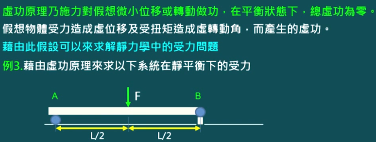
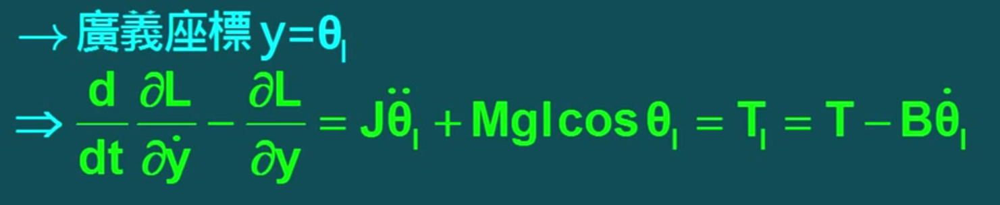
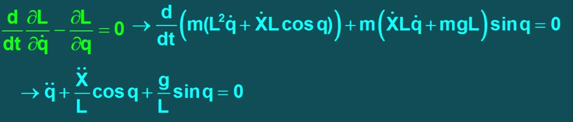
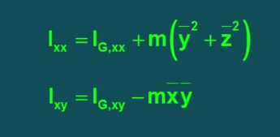
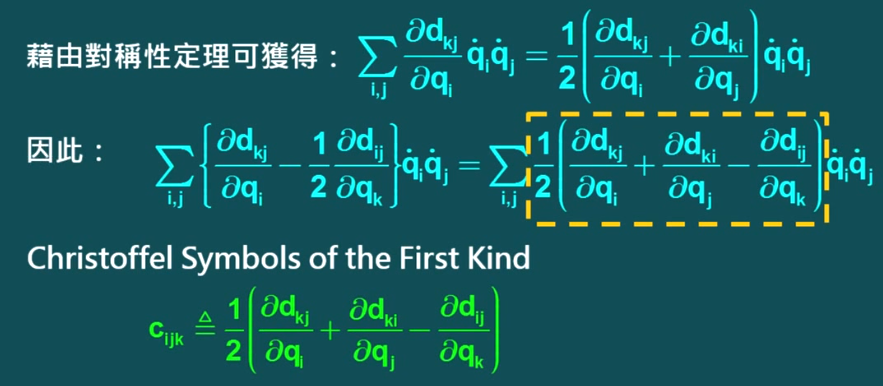

# 机器人动力学—拉格朗日法

> https://www.bilibili.com/video/BV1A4411b7Ya/?p=2&vd_source=782af047fbca87ac3084937682017138
>
> https://underactuated.csail.mit.edu/acrobot.html#example2


> 分析法有牛顿-欧拉法，这个适合编程计算；手算则以拉格朗日法为主，这是一种基于能量的方法
>
> 希腊字母: *α、β、γ、δ、ε、ζ、ν、ξ、ο、π、ρ、σ、η、θ、ι、κ、λ、μ、τ、υ、φ、χ、ψ、ω*  

注意：使用拉格朗日法求解系统动力学问题时，不需要考虑系统内所有力的作用。

主要考虑下面三类力：

1. 非关节力，例如重力，摩擦力等。它们直接作用在系统的某一部位，影响系统的运动。
2. 关节力，例如马达产生的力矩。它们直接作用在关节上，影响系统的运动。
3. 反作用力，例如在关节和支撑体上的接触力。它们是由于系统的运动而产生的，在求解运动方程时会被自动考虑。

而一些其他的力，例如空气阻力，磁力等，在很多情况下可以忽略不计，因为对系统运动影响不大。


# 建立坐标

> 主要在于广义坐标系的选取

图中二连杆的两个关节的位置可以用总计四个变量表示，但是因为变量间互有联系，所以不可以这样做


因此重新定义广义坐标：


这里我们使用了两个关节变量θ1，θ2来描述关节位置


# 虚功原理

> 力学分析所需要的原理，作用是在分析时可以不考虑未知的约束力，只用考虑外力


## 原理分析

> 虚功原理中所指虚位移是与力状态无关的任何其他原因(力、温度改变、支座移动等)引起的，甚至是假象的。
>
> 虚位移应满足微小、为约束允许和符合变形连续条件。在理论力学中已经讨论过的刚体虚功原理是变形体系虚功原理的一个特例。它表述为：**刚体在外力作用下处于平衡的必要和充分条件是，对于任何虚位移，外力所作的虚功之和恒等于零**


## 模型分析

> A是一个支点，只受到正向力；
>
> B是一个关节，会受到两个方向的力：
>
> 如何求A，B两点的作用力？




假设产生虚位移，列出虚功方程。因为Ay力方向和F方向相反，所以为负号；因为向上总力应该和向下的总力相同，所以Ay = By


这样就能求解关节力和外力的关系


# 达朗贝尔原理

> 将虚功原理应用在动力学问题上
>
> 将物体的所有惯性力或外力经过虚位移所作的功总和为0


## 推导拉格朗日方程

方程V包含两个部分，一个是位置坐标r对时间t的偏微分，另一个是r对某广义坐标的偏微分再乘以速度


利用达朗贝尔原理，外力做的虚功总和等于惯性力做的虚功总和:


.....太难了不会


最后得到我们熟悉的方程式了


# 抽象方程

> 运动方程式：动势对速度的偏微分减去动势对位置的偏微分等于驱动力
>
> 动势L = 动能K - 势能P


## 单小球模型

> 通过牛顿第二定律我们可以知道物体加速度，如果用拉格朗日方程呢？


- 牛顿第二定律：分析小球受力，列出方程F-mg=my''
  - 因此得到了运动方程，其中y‘’是对位置两次求导，即得到加速度


- 拉格朗日法：代入数据进入拉格朗日方程
  - 得到的结果和牛二相同


## 单杆模型

> 一个带减速功能的马达驱动一根单杆
>
> 使用牛二分析较为复杂，我们使用拉格朗日法


- 求取位势能L

**动能**

动能集中在转动动能，使用公式转动惯量J = mr^2^ 和 转动能量K = 1/2 J * ω^2^ = 1/2 J * θ^2^ 


**势能**

马达质心在转动时未改变，故势能不会改变，以马达质心所在平面为0势能面。

连杆的势能：


代入到方程:


其中 J = (r^2^ J~m~ + J~l~)


得到公式，其中T~l~ 即驱动力，驱动力等于扭矩T减去阻力Bθ~l~‘(阻尼乘角速度)




**动力学方程式**


## 滑块连杆模型

> 有一个平移关节和一个旋转关节


系统未受到外力，所以t=0；定义两个关节变量X，q分别表示滑块位移和连杆角度，求出动能：


假设原点为零势能点，求出势能(位能)


代入关于关节变量X的方程式


代入关于关节变量q的方程式




总结运动方程式，系统的运动由这两个方程式决定：


#  

# 运动惯性矩阵

> 运动惯量作用类似于F=ma中的m，通过求出运动惯量可以求出动能

T=L * a的意思和F = m * a类似


求一个物体的惯性矩阵，分为对称元素和非对称元素部分


上面的情况是旋转轴位于质心的情况，如果旋转轴不在质心？

使用平行轴定理





## 举例

> 这就是大学物理学的公式吧

不使用平行轴定理(质心和旋转轴一致)


使用平行轴定理，细长杆


圆柱体


# 动能方程

> 上面算出的惯性张量I可以应用在求K


# 位能(势能)方程


## 举例

求第一杆的位能


第二杆以及两杆之和


# 运动方程式

由上面推导：


代入拉格朗日方程


求方程第一项


方程第二项


因此对于每一个轴的拉格朗日方程


c~ijk~是对黄色框的符号简写



φ是对偏微分的符号简写


整理得


将上面的式子转换成矩阵(通式)

第一个D是惯性矩阵，第二个C是向心力和科氏力，第三个G是重力，T是关节驱动力(广义力)


每个矩阵的详细计算


科氏力是指其他连杆对连杆产生的相互作用力(相互离心作用力)

C矩阵：


G矩阵：


以上是机械臂矩阵方程


# 驱动机构

实际上机械臂并不是只有连杆


Jm是马达转子的转动惯量，B是转动摩擦系数，K是常数，Rk是马达电阻，tk是转动力矩，rk是马达减速比


r是齿轮比，q是手臂机构角度


#    


# 实际案例

# 二连杆机械臂系统

对于二连杆机械臂的动力学解算


τ

## 方程解析

> 我们使用方程的目的是根据已知执行器的位置和姿态后可以求取各关节的角度和力矩

$$
L(θ, θ') = k(θ, θ') - u(θ)
$$


k是动能，u是势能，L是动势(动能减去势能)

θ是关节变量，转动关节是角度，移动关节则是位移

θ‘ 是关节的角速度或者线速度(那个点实际在θ上面)

τ是关节驱动力


### **总式**

通过上述式子可以求取关节驱动力


**假设**

假设：杆的质量集中在杆的末端，即关节上的转动惯量为0(C1即图中m1，围绕m1做坐标系)


### **求动能K**

因为I = 0，所以1/2I^2^ω^2^ = 0

v = ω * R = L * θ，所以：


求K2需要先求V2jacobian矩阵是什么


#### 求关节速度V2

**V2**可以使用牵连速度求：

jacobian矩阵是什么


使用广义坐标的方法


cos(θ1)简写为c1，同理有c12，s1和s12；

进而可以算出x2，y2的大小。

对x2，y2时间求导，其中$$l1c1$$ 求导后得到 $$-l1s1θ1'$$  (θ1'是对θ1的时间的求导)，其他同理，最后得到x2‘ 和 y2’


x2‘ 和 y2’算出来了，然后平方带入：


最后得到V2^2^的表达式


将θ1，θ2提取出来


#### 求k

现在V2已经知道了，所以求动能k2


总动能k  = k1 + k2


### **求势能U**

我们认为θ1=θ2=0时是零势能位置(杆平躺在地面)

计算势能u，即重力势能


### **计算关节驱动力τ**

现在我们已经有k和u了，现在求τ

求u对关节变量θ的偏导，k对θ的偏导，k对关节变量θ导数的偏导


#### 求u对θ偏导

根据上述已求出的u：


#### 求k对θ偏导

需要分别求出k对θ1，θ2的偏导

因为式子没有θ1(没有c1，s1)，所以对其偏导为0


#### 力求k对θ‘偏导

求k对关节速度θ‘的偏导，需要分别求出k对θ1‘，θ2‘的偏导

由上述，已知k


**对θ1‘的偏导**


再对t求导(θ，c1和c2都能对t求导)，会有θ导数的导数


**对θ2‘的偏导**

同理


#### 求τ

两个关节的驱动力


代入上述式子


一般写成**空间状态方程**形式：


τ，θ‘‘表示列向量：

|  τ1 |   和  | θ1‘‘ |

|  τ2 |         | θ2‘‘ |

M表示矢量矩阵：


V表示离心力和科氏力组成的矩阵


G表示重力矩阵，所有和重力有关的项在里面


## 总览


# 


# 车杆系统

> 运动的小车上维持mp竖直平衡


x是水平距离

θ是摆的逆时针角度

q=[x,θ]^T^ 是关节变量，表示位移关节变量x和旋转关节变量θ

x=[q,q‘]^T^ 是位置x的矩阵形式

u是关节驱动力的矩阵形式

目标是稳定x=[0,π,0,0]^T^


## 方程解析


- 首先计算得到两个关节1，2的位置矩阵


- 得到系统动能T和势能U方程


```c
x‘就是对x对时间求导，即v
```


- 拉格朗日法得到方程，计算水平，竖直方向的关节驱动力：


- 得到机械臂的**空间状态方程**：


- 代入x，u的矩阵形式 x=[q,q‘]^T^  u=fx到方程中：


也可以求出线加速度x‘’ 和角加速度 θ‘’

