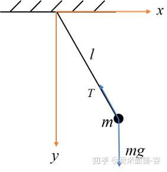
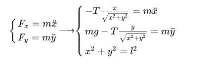
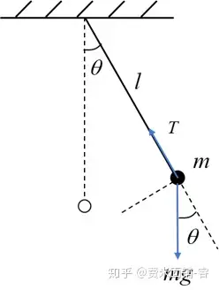
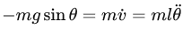
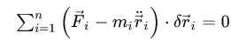
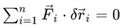
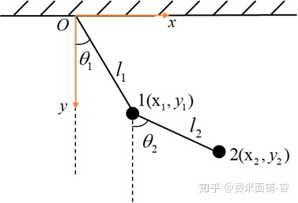
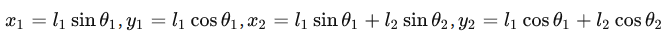

# 从零学分析力学

原文链接：https://zhuanlan.zhihu.com/p/156760739                                                                                

> 我们生活中更多地使用牛顿力学，这是经典力学中的一个非常优秀的分析方法，当然它也有一些缺陷：在分析带有约束力的力学问题时分量式不独立，所列出的方程组极难解。此时我们需要引入拉格朗日力学来简化方程。


## 广义坐标

在牛顿力学中我们会使用空间坐标即笛卡尔坐标系来描述物体，以下面这个单摆模型为例



绳子对质点具有约束力 **T** ，当我们使用x-y坐标描述质点位置，我们最终得到方程组：



在上面，因为绳子的约束作用，有约束方程：$x^2+y^2=l^2$ 这就会导致两个方程便耦合，也就是说这两个分量式不独立。


**使用广义坐标消去约束力**

单摆的位置通过上摆的角度就能够确定下来，所以我们就可以用这个角度 **θ** 来对应摆球的位置。



沿垂直绳子的方向，我们可以避免在方程中引入张力T，因此列出方程




在上面引入的θ是极坐标，但它还属于一个更大的类别——**广义坐标**。

==广义坐标指的是不特定的坐标，只要它能够描述力学系统的状态即可，像我们常见的极坐标、球坐标、柱坐标都属于广义坐标。==

对于有约束力的问题，只要我们选取合适的广义坐标来替代直角坐标，约束力带来的麻烦就能够很容易解决。


## 理想约束

在更复杂的问题中要消去约束力，实际操作中需要用到约束力的一个重要性质——**约束力不做功**。

对此我们引入新的概念——**虚位移**：**在时间和空间位置确定的情况下，虚位移是符合约束条件的任意无穷小位移，用符号** δr **表述**。

同样，虚位移也有对应的**虚功**，其定义和实位移的定义是相似的，即力和虚位移的标量积。

比较理想化的模型，比如说光滑性、刚性等等，那么力学系统中的约束，都看作是理想化的，==系统==约束力的总虚功也就为零。

我们将满足这一条件的约束，称为**理想约束**。而且一般来说，光滑没有摩擦力就是理想约束。

所以有结论：**力学系统所受==理想==约束力的总虚功为零**。


## **达朗贝尔原理**

> 是拉格朗日力学中的第二个基本原理。（第一自然是相对性原理，相对性原理是所有力学体系的第一基本原理。）

根据**达朗贝尔原理**，我们具体来看一下如何消去约束力。



```c
对于多质点的系统的达朗贝尔原理，F是某质点所受的主动力，N可是该质点所受的理想约束力，N在证明时已被约去。
```

由于在有约束的情况下，只凭牛顿运动定律不能解决问题(需要在方程中考虑约束力)，必须引入约束方程，但达朗贝尔原理无须其它方程，便能适用于有约束的情况。


**虚功原理**

达朗贝尔原理的特殊情况，当系统处于平衡态，即上式中d2r = 0时有



这一原理称为**虚功原理**。


## **虚位移的困扰**

达朗贝尔原理带有很大任意性的虚位移，这会带来不便，表现在达朗贝尔原理中的δr并不独立。

这时引入我们刚才提到的广义坐标后可以消去多余的坐标，以双连杆为例



按照笛卡尔坐标系，x1,y1,x2,y2会被描述小球 1 和小球 2 的位置。但是在约束作用下，x，y间会保持一种联系。δr无法用相互独立的广义坐标来定量描述

但由于我们需要广义坐标$\theta 1 \theta 2$就可以确定系统的位置，所以用它们将方程整理一番之后，**各独立广义坐标前的乘数必定为零**，我们就能成功地把虚位移去掉，方程得到很好简化并建立直角坐标和广义坐标的定量关系:




## **拉格朗日方程出世**

假设系统有n个质点，系统存在q个约束力，那描述系统需要3n个坐标和s=3n-q个广义坐标