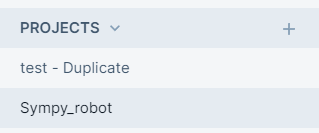
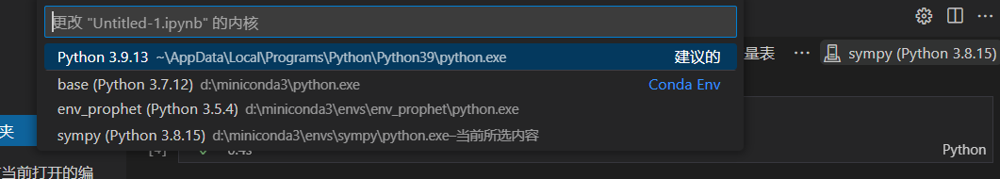
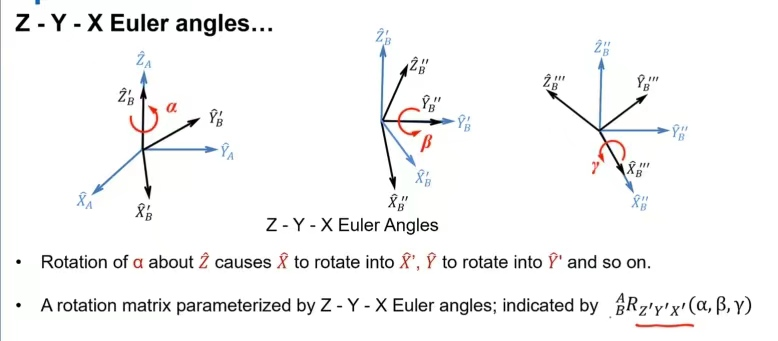
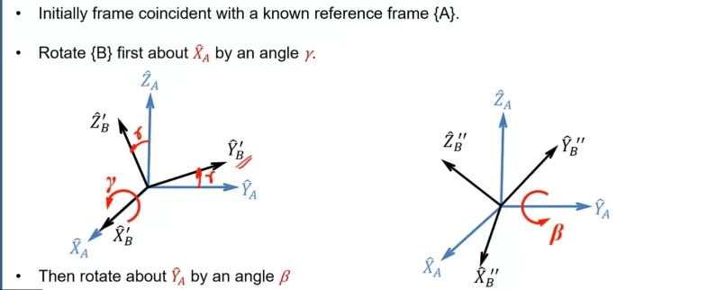
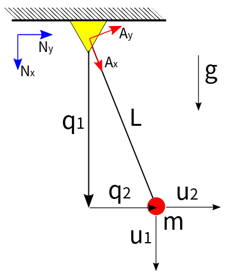

# 安装Sympy

> sympy是一个符号计算工具。相较于matlab，我们使用它的目的是调用它的拉格朗日计算函数

官网安装

https://docs.sympy.org/latest/install.html#installation

编辑rst文件

[链接](https://www.cnblogs.com/MikeZhang/p/reStructuredText20180905.html)

拉格朗日练习题

[链接](https://www.doc88.com/p-6671235172150.html)


## 使用方法

## Deepnote网页使用

> 我们可以在网站deepnote上使用sympy

- 新建文件

在左边的project里点击加号，选择code block即可。




- 配置环境

可能需要选择一个正确的环境，点击environment旁边的小齿轮


## VSCode使用

> vscode首先需要配置一个环境

```c
conda create -n env_smpy python=3.8 //至少需要3.8
conda activate env_zipline
```


- 安装编译器

```c
conda install libpython m2w64-toolchain -c msys2
```


- 安装sympy和ipykernel

```c
conda install sympy
conda install ipykernel 
```


- 在vscode里添加环境




# Sympy语法

## 符号计算的威力

> 符号计算系统（如SymPy）的真正强大之处在于能够以符号方式进行各种计算。SymPy可以简化表达式，计算导数、积分和极限，求解方程，处理矩阵，等等，而且都可以用符号来完成。它包括用于绘图、打印的模块（如二维数学公式的漂亮打印输出，或L（左）AT型E类X（X）)、代码生成、物理学、统计学、组合学、数论、几何学、逻辑学等。


## **开始部分**

### 定义符号变量symbols

```python
from sympy import symbols
x, y = symbols('x y1')
expr = x + 2*y1
##输出expr
```


**注意**

我们对变量的改变不影响对符号的改变

```python
x = symbols('y')
>>> expr = x + 1
>>> x = 2
>>> print(expr)
##输出y + 1
因为符号式子描述的是y+1，所以x=2只是将2赋值给x，但y+1仍是y+1
```

想要改变符号值：

```python
x = symbols('y')
>>> expr = x + 1
>>> expr.subs(x, 2)
##输出3
```


### 展开/收缩式子expand

> 比如从x(x+y)形式到x^2+x*y

```python
from sympy import expand, factor
expanded_expr = expand(x*expr)
expanded_expr
##输出x**2 + 2*x*y
factor(expanded_expr)
##输出x*(x + 2*y)
```


- 建立一个符号等式

```python
Eq(x + 1, 4)
##输出Eq(x + 1, 4)
	x + 1 = 4
```


## **方程部分**

> [链接](https://docs.sympy.org/latest/tutorials/intro-tutorial/intro.html#what-is-symbolic-computation)

```python
from sympy import *
>>> x, t, z, nu = symbols('x t z nu')
```

这将使所有其他示例都能很好地打印出unicode字符。

```python
init_printing(use_unicode=True)
```


### 求导数diff

$$
\sin{(x)}e^x
$$


```python
diff(sin(x)*exp(x), x)
 x           x
##输出ℯ ⋅sin(x) + ℯ ⋅cos(x)
```


### 计算不定积分integrate

$$
\int(e^x\sin{(x)} + e^x\cos{(x)})\,dx
$$

```python
integrate(exp(x)*sin(x) + exp(x)*cos(x), x)
 x
##输出ℯ ⋅sin(x)
```


### 计算定积分integrate

$$
\int_{-\infty}^\infty \sin{(x^2)}\,dx
$$

```python
integrate(sin(x**2), (x, -oo, oo))

##输出
√2⋅√π
─────
  2
```


### 计算微分limit

$$
\lim_{x\to 0}\frac{\sin{(x)}}{x}
$$

```python
limit(sin(x)/x, x, 0)
##输出1
```


###  简化方程

> 常用方法，先展开再简化
>
> ```python
> B = smp.expand(A)
> B.simplify
> ```

#### simplify (简化)


#### `expand` (展开)

将多项式展开，使用 `expand` 函数。例如：

```python
x_1 = symbols('x_1')
expand((x_1 + 1)**2)
```


#### `factor` (因式分解)

用 `factor` 函数可以对多项式进行因式分解，例如：

```python
factor(x**3 - x**2 + x - 1)
```


> 实际上，多项式的展开和因式分解是互逆过程，因此 `factor` 和 `expand` 也是相对的。


#### `collect` (合并同类项)

利用 `collect` 合并同类项，例如：

```python
expr = x*y + x - 3 + 2*x**2 - z*x**2 + x**3
collect(expr, x)
```


#### `cancel` (有理分式化简)

消去分子分母的公因式使用 `cancel` 函数，例如：

```python
cancel((x**2 + 2*x + 1)/(x**2 + x))
```


#### `apart` (部分分式展开)

使用 `apart` 函数可以将分式展开，例如：

```python
expr = (4*x**3 + 21*x**2 + 10*x + 12)/(x**4 + 5*x**3 + 5*x**2 + 4*x)
expr
```


```python
apart(expr)
```


### 解一元二次方程solve

$$
x^2 - 2 = 0
$$

```python
solve(x**2 - 2, x)
##输出[-√2, √2]
```


### 解微分方程dsolve

$$
y'' - y = e^t
$$

```python
y = Function('y')
>>> dsolve(Eq(y(t).diff(t, t) - y(t), exp(t)), y(t))

##输出：

           -t   ⎛     t⎞  t
y(t) = C₂⋅ℯ   + ⎜C₁ + ─⎟⋅ℯ
                ⎝     2⎠
```


### 求特征值eigenvals

$$
\left[\begin{smallmatrix}1 & 2\\2 &
2\end{smallmatrix}\right]
$$

```python
Matrix([[1, 2], [2, 2]]).eigenvals()

##输出
⎧3   √17     3   √17   ⎫
⎨─ - ───: 1, ─ + ───: 1⎬
⎩2    2      2    2    ⎭
```

 

## 参考系

### 经典力学参考系

$$
class sympy.physics.vector.frame.ReferenceFrame(name, indices=None, latexs=None, variables=None)[source]
$$

> ReferenceFrame是经典力学中用来表示参考系的类。它在帧的x、y和z方向上具有三个单位向量的标准基础。它还可以具有相对于父帧的旋转；该旋转由方向余弦矩阵定义，该方向余弦矩阵将该帧的基向量与父帧的基矢量相关联。它也可以有一个角速度矢量，定义在另一帧中。


#### 角加速度矢量ang_acc

```
ang_acc_in(otherframe)
```

> 返回ReferenceFrame的角加速度矢量。
>
> 返回矢量：`N_alpha_B`
>
> B在N中的角加速度，其中B是自身，N是其他系。

计算A系在N系下的角加速度

```python
from sympy.physics.vector import ReferenceFrame
>>> N = ReferenceFrame('N')
>>> A = ReferenceFrame('A')
>>> V = 10 * N.x
>>> A.set_ang_acc(N, V)
>>> A.ang_acc_in(N)
10*N.x
```


**设置角加速度矢量**

```c
set_ang_acc(otherframe, value)[source]
```

> 在ReferenceFrame中定义角加速度矢量。在另一个中定义此ReferenceFrame的角加速度。可以针对多个不同的参考帧定义角加速度。必须注意不要创建不一致的循环。

参数：

- otherframe其他系：参考帧用于定义角加速度的ReferenceFrame

- value值：矢量表示角加速度的矢量

```python
from sympy.physics.vector import ReferenceFrame
>>> N = ReferenceFrame('N')
>>> A = ReferenceFrame('A')
>>> V = 10 * N.x
>>> A.set_ang_acc(N, V)
>>> A.ang_acc_in(N)
10*N.x
```


#### 角速度矢量ang_vel

```
ang_vel_in(otherframe)
```

> 返回ReferenceFrame的角速度矢量。
>
> 有返回矢量：`^NΩ^`
>
> B表示B在N中的角速度，其中B是自身，N是其他系

```python
from sympy.physics.vector import ReferenceFrame
>>> N = ReferenceFrame('N')
>>> A = ReferenceFrame('A')
>>> V = 10 * N.x
>>> A.set_ang_vel(N, V)
>>> A.ang_vel_in(N)
10*N.x
```


**设置角速度矢量**

```c
set_ang_vel(otherframe, value)
```

> 在ReferenceFrame中定义角速度矢量。在另一个中定义此ReferenceFrame的角速度。可以针对多个不同的参考系定义角速度。必须注意不要创建不一致的循环。

参数：

- otherframe其他帧：参考帧用于定义角速度的ReferenceFrame

- value值：矢量表示角速度的矢量

```python
from sympy.physics.vector import ReferenceFrame
>>> N = ReferenceFrame('N')
>>> A = ReferenceFrame('A')
>>> V = 10 * N.x
>>> A.set_ang_vel(N, V)
>>> A.ang_vel_in(N)
10*N.x
```


#### 相对余弦矩阵dcm

```
dcm(otherframe)
```

> 返回此参考系相对于提供的参考系的方向余弦矩阵。
>
> 返回的矩阵可用于根据其他系的正交单位向量来表示该系的正交单元向量

以下示例通过简单旋转使参考系A相对于N旋转，然后计算N相对于A的方向余弦矩阵：

```python
from sympy import symbols, sin, cos
>>> from sympy.physics.vector import ReferenceFrame
>>> q1 = symbols('q1')
>>> N = ReferenceFrame('N')
>>> A = ReferenceFrame('A')
>>> A.orient_axis(N, q1, N.x)
>>> N.dcm(A)
Matrix([
[1,       0,        0],
[0, cos(q1), -sin(q1)],
[0, sin(q1),  cos(q1)]])
```

上述方向余弦矩阵的第二行表示N中的N.y单位向量，用A表示：

```python
Ny = 0*A.x + cos(q1)*A.y - sin(q1)*A.z
```

因此，在A中表示N.y应返回相同的结果：

```python
>>> N.y.express(A)
cos(q1)*A.y - sin(q1)*A.z
```


**注意**

我们需要知道旋转矩阵的含义

如果调用B.dcm（A），则表示“B相对于A旋转的方向余弦矩阵”。这是如下关系所示的矩阵BCA：
$$
\begin{split}\begin{bmatrix}
  \hat{\mathbf{b}}_1 \\
  \hat{\mathbf{b}}_2 \\
  \hat{\mathbf{b}}_3
\end{bmatrix}
=
{}^B\mathbf{C}^A
\begin{bmatrix}
  \hat{\mathbf{a}}_1 \\
  \hat{\mathbf{a}}_2 \\
  \hat{\mathbf{a}}_3
\end{bmatrix}.\end{split}
$$


#### 设置参考系相对方向orient

```c
orient(parent, rot_type, amounts, rot_order='')
```

> 设置此参考帧相对于另一个（父）参考帧的方向。

现在建议对不同的旋转类型使用.`orient_axis`、.`orient_body_fixed`、.`oriend_space_fixed`、.`onted_quarters`方法。

参数：

- parent父对象：ReferenceFrame

此参考框架将相对于其旋转的参考框架。

- rot_type:字符串

用于生成方向余弦矩阵的方法。支持的方法有：

```c
“Axis”：围绕单个公共轴的简单旋转
“DCM”：用于直接设置方向余弦矩阵
“Body”：围绕新的中间轴连续旋转三圈，也称为“欧拉角和泰特·布莱恩角”
“Space”：围绕父帧的单位向量进行三次连续旋转
“Quaternion”：四元数，由四个参数定义的旋转，产生无奇异方向余弦矩阵
```

- amounts数额：

定义旋转角度或方向余弦矩阵的表达式。这些必须与rot_type匹配。有关详细信息，请参见以下示例。输入类型包括：

```c
“Axis”：2元组（expr/sym/func，Vector）
“DCM”：矩阵，形状（3,3）
“Body”：表达式、符号或函数的三元组
“Space”：表达式、符号或函数的三元组
“Quaternion”：表达式、符号或函数的4元组
rot_order: str或int，可选
```

如果适用，连续旋转的顺序。例如，字符串“123”和整数123是等效的。（“Body”和“Space”需要）。


旋转方式: [链接](https://docs.sympy.org/latest/modules/physics/vector/api/classes.html?highlight=orientnew#sympy.physics.vector.frame.ReferenceFrame.orientnew)

##### 绕轴旋转

```c
orient_axis(parent, axis, angle)
```

> 通过围绕父参照系中固定的轴旋转一个角度，设置此参照系相对于父参照系的方向。

参数：

- parent父对象：ReferenceFrame

此参考框架将相对于其旋转的参考框架。

- axis轴：矢量

固定在父帧中的向量，该帧围绕该向量旋转。它不需要是单位向量，旋转遵循右手法则。

- angle角度：可表示

框架旋转的弧度角度。

```python
from sympy import symbols
>>> from sympy.physics.vector import ReferenceFrame
>>> q1 = symbols('q1')
>>> N = ReferenceFrame('N')
>>> B = ReferenceFrame('B')
>>> B.orient_axis(N, N.x, q1)
```

> orienta_axis（）方法生成一个方向余弦矩阵及其转置，它定义了B相对于N的方向，反之亦然。一旦调用了orient，dcm（）将输出适当的方向余弦矩阵：

```python
B.dcm(N)
Matrix([
[1,       0,      0],
[0,  cos(q1), sin(q1)],
[0, -sin(q1), cos(q1)]])
>>> N.dcm(B)
Matrix([
[1,       0,        0],
[0, cos(q1), -sin(q1)],
[0, sin(q1),  cos(q1)]])
```


以下两行代码表明，旋转的方向可以通过取反矢量的方向或角度来定义。两行代码产生相同的结果。

```python
>>> B.orient_axis(N, -N.x, q1)
>>> B.orient_axis(N, N.x, -q1)
```


##### 身体固定旋转

```c
orient_body_fixed(parent, angles, rotation_order)
```

> 通过右手旋转三次连续的身体固定简单轴旋转，相对于父参考帧旋转此参考帧。每个后续的旋转轴都围绕新的中间参考系的“身体固定”单位向量。这种类型的旋转也被称为通过**欧拉角和泰特·布莱恩角旋转**



==**Body fixed** 表示绕刚体坐标系旋转，**Space fixed**表示绕总体坐标系旋转。**Rotation Sequence**是旋转序列，绕x轴旋转为1，绕y轴旋转为2，绕z轴旋转为3,313表示绕z-x-z这样的顺序旋转。==

参数：

- parent父对象：ReferenceFrame

此参考框架将相对于其旋转的参考框架。

- angles角度：可表示的3元组

用于连续旋转的三个弧度角度。

- rotation_order：3个字符串或3位数整数

关于每个中间参考帧的单位向量的旋转顺序。可以通过字符串“XZX”、“131”或整数131指定Euler绕X、Z、X”轴的旋转。有12个唯一的有效旋转顺序（6个Euler和6个Tait Bryan）：zxz、xyx、yzy、zyz、xzx、yxy、xyz、yxx、zxy、xzy、yxx和yxz。


```python
from sympy import symbols
>>> from sympy.physics.vector import ReferenceFrame
>>> q1, q2, q3 = symbols('q1, q2, q3')
>>> N = ReferenceFrame('N')
>>> B = ReferenceFrame('B')
>>> B1 = ReferenceFrame('B1')
>>> B2 = ReferenceFrame('B2')
>>> B3 = ReferenceFrame('B3')
```

经典的Euler角度旋转可以通过以下方式完成：

```python
B.orient_body_fixed(N, (q1, q2, q3), 'XYX')
>>> B.dcm(N)
Matrix([
[        cos(q2),                            sin(q1)*sin(q2),                           -sin(q2)*cos(q1)],
[sin(q2)*sin(q3), -sin(q1)*sin(q3)*cos(q2) + cos(q1)*cos(q3),  sin(q1)*cos(q3) + sin(q3)*cos(q1)*cos(q2)],
[sin(q2)*cos(q3), -sin(q1)*cos(q2)*cos(q3) - sin(q3)*cos(q1), -sin(q1)*sin(q3) + cos(q1)*cos(q2)*cos(q3)]])
```

这将使参考系B相对于参考系N绕N.x上旋转q1，然后再次将B绕B.y旋转q2，最后绕B.x旋转q3。这相当于三次连续的orientation_axis（）调用：

```python
B1.orient_axis(N, N.x, q1)
>>> B2.orient_axis(B1, B1.y, q2)
>>> B3.orient_axis(B2, B2.x, q3)
>>> B3.dcm(N)
Matrix([
[        cos(q2),                            sin(q1)*sin(q2),                           -sin(q2)*cos(q1)],
[sin(q2)*sin(q3), -sin(q1)*sin(q3)*cos(q2) + cos(q1)*cos(q3),  sin(q1)*cos(q3) + sin(q3)*cos(q1)*cos(q2)],
[sin(q2)*cos(q3), -sin(q1)*cos(q2)*cos(q3) - sin(q3)*cos(q1), -sin(q1)*sin(q3) + cos(q1)*cos(q2)*cos(q3)]])
```

可接受的旋转顺序长度为3，用字符串“XYZ”或“123”或整数123表示。禁止绕轴连续旋转两次。

```python
B.orient_body_fixed(N, (q1, q2, 0), 'ZXZ')
>>> B.orient_body_fixed(N, (q1, q2, 0), '121')
>>> B.orient_body_fixed(N, (q1, q2, q3), 123)
```


##### 空间固定旋转

```c
orient_space_fixed(parent, angles, rotation_order)
```

> 通过右手旋转三次连续的空间固定简单轴旋转，相对于父参考帧旋转此参考帧。每个后续旋转轴都围绕父参考系的“空间固定”单位向量。



参数：

- parent父对象：ReferenceFrame

此参考框架将相对于其旋转的参考框架。

- angles角度：可表示的3元组

用于连续旋转的三个弧度角度。

- rotation_order：3个字符串或3位数整数

围绕父参考帧的单位向量的旋转顺序。顺序可以由字符串“XZX”、“131”或整数131指定。有12个唯一的有效轮换顺序。

```python
from sympy import symbols
>>> from sympy.physics.vector import ReferenceFrame
>>> q1, q2, q3 = symbols('q1, q2, q3')
>>> N = ReferenceFrame('N')
>>> B = ReferenceFrame('B')
>>> B1 = ReferenceFrame('B1')
>>> B2 = ReferenceFrame('B2')
>>> B3 = ReferenceFrame('B3')
```

```python
B.orient_space_fixed(N, (q1, q2, q3), '312')
>>> B.dcm(N)
Matrix([
[ sin(q1)*sin(q2)*sin(q3) + cos(q1)*cos(q3), sin(q1)*cos(q2), sin(q1)*sin(q2)*cos(q3) - sin(q3)*cos(q1)],
[-sin(q1)*cos(q3) + sin(q2)*sin(q3)*cos(q1), cos(q1)*cos(q2), sin(q1)*sin(q3) + sin(q2)*cos(q1)*cos(q3)],
[                           sin(q3)*cos(q2),        -sin(q2),                           cos(q2)*cos(q3)]])
```

与之等价的是

```python
>>> B1.orient_axis(N, N.z, q1)
>>> B2.orient_axis(B1, N.x, q2)
>>> B3.orient_axis(B2, N.y, q3)
>>> B3.dcm(N).simplify()
Matrix([
[ sin(q1)*sin(q2)*sin(q3) + cos(q1)*cos(q3), sin(q1)*cos(q2), sin(q1)*sin(q2)*cos(q3) - sin(q3)*cos(q1)],
[-sin(q1)*cos(q3) + sin(q2)*sin(q3)*cos(q1), cos(q1)*cos(q2), sin(q1)*sin(q3) + sin(q2)*cos(q1)*cos(q3)],
[                           sin(q3)*cos(q2),        -sin(q2),                           cos(q2)*cos(q3)]])
```

值得注意的是，空间固定和身体固定的旋转与旋转的顺序有关，即身体固定的相反顺序将使空间固定，反之亦然。

```python
B.orient_space_fixed(N, (q1, q2, q3), '231')
>>> B.dcm(N)
Matrix([
[cos(q1)*cos(q2), sin(q1)*sin(q3) + sin(q2)*cos(q1)*cos(q3), -sin(q1)*cos(q3) + sin(q2)*sin(q3)*cos(q1)],
[       -sin(q2),                           cos(q2)*cos(q3),                            sin(q3)*cos(q2)],
[sin(q1)*cos(q2), sin(q1)*sin(q2)*cos(q3) - sin(q3)*cos(q1),  sin(q1)*sin(q2)*sin(q3) + cos(q1)*cos(q3)]])
```

```python
B.orient_body_fixed(N, (q3, q2, q1), '132')
>>> B.dcm(N)
Matrix([
[cos(q1)*cos(q2), sin(q1)*sin(q3) + sin(q2)*cos(q1)*cos(q3), -sin(q1)*cos(q3) + sin(q2)*sin(q3)*cos(q1)],
[       -sin(q2),                           cos(q2)*cos(q3),                            sin(q3)*cos(q2)],
[sin(q1)*cos(q2), sin(q1)*sin(q2)*cos(q3) - sin(q3)*cos(q1),  sin(q1)*sin(q2)*sin(q3) + cos(q1)*cos(q3)]])
```


##### 显式旋转矩阵

```c
orient_explicit(parent, dcm)
```

> 通过显式设置方向余弦矩阵，设置此参考帧相对于父参考帧的方向

参数：

- parent父对象：ReferenceFrame

此参考框架将相对于其旋转的参考框架。

- dcm：矩阵，形状（3，3）

方向余弦矩阵，指定两个参考帧之间的相对旋转

```python
from sympy import symbols, Matrix, sin, cos
>>> from sympy.physics.vector import ReferenceFrame
>>> q1 = symbols('q1')
>>> A = ReferenceFrame('A')
>>> B = ReferenceFrame('B')
>>> N = ReferenceFrame('N')
```

A相对于N关于N.x的简单旋转由以下方向余弦矩阵定义：

```python
dcm = Matrix([[1, 0, 0],
...               [0, cos(q1), -sin(q1)],
...               [0, sin(q1), cos(q1)]])
>>> A.orient_explicit(N, dcm)
>>> A.dcm(N)
Matrix([
[1,       0,      0],
[0,  cos(q1), sin(q1)],
[0, -sin(q1), cos(q1)]])
```

这相当于使用orienta_axis（）：

```python
B.orient_axis(N, N.x, q1)
>>> B.dcm(N)
Matrix([
[1,       0,      0],
[0,  cos(q1), sin(q1)],
[0, -sin(q1), cos(q1)]])
```

请注意，N.dcm（B）（转置）将被传递到A.dcm（N）的oriente_explicit（）中，以匹配B.dcm（N）：

```python
A.orient_explicit(N, N.dcm(B))
>>> A.dcm(N)
Matrix([
[1,       0,      0],
[0,  cos(q1), sin(q1)],
[0, -sin(q1), cos(q1)]])
```


##### 显式四元数

```c
orient_quaternion(parent, numbers)
```

> 通过方向四元数设置此参考帧相对于父参考帧的方向。方向四元数定义为单位向量（λ_x，λ_y，λ_z）以角度θ的有限旋转。方向四元数由四个参数描述：

- `q0 = cos(theta/2)`
- `q1 = lambda_x*sin(theta/2)`
- `q2 = lambda_y*sin(theta/2)`
- `q3 = lambda_z*sin(theta/2)`

参数：

- parent父对象：ReferenceFrame

此参考框架将相对于其旋转的参考框架。

- numbers数字：可表示的4元组

上面定义的四个四元数标量：q0、q1、q2、q3

```python
from sympy import symbols
>>> from sympy.physics.vector import ReferenceFrame
>>> q0, q1, q2, q3 = symbols('q0 q1 q2 q3')
>>> N = ReferenceFrame('N')
>>> B = ReferenceFrame('B')
```

设置方向：

```python
B.orient_quaternion(N, (q0, q1, q2, q3))
>>> B.dcm(N)
Matrix([
[q0**2 + q1**2 - q2**2 - q3**2,             2*q0*q3 + 2*q1*q2,            -2*q0*q2 + 2*q1*q3],
[           -2*q0*q3 + 2*q1*q2, q0**2 - q1**2 + q2**2 - q3**2,             2*q0*q1 + 2*q2*q3],
[            2*q0*q2 + 2*q1*q3,            -2*q0*q1 + 2*q2*q3, q0**2 - q1**2 - q2**2 + q3**2]])
```


#### 生成新的参考序列orientnew

```c
orientnew(newname, rot_type, amounts, rot_order='', variables=None, indices=None, latexs=None)
```

参数：

- newname新名称：str

新参照系的名称。

- rot_type:字符串

用于生成方向余弦矩阵的方法。支持的方法有：

```c
“Axis”：围绕单个公共轴的简单旋转
“DCM”：用于直接设置方向余弦矩阵
“Body”：围绕新的中间轴连续旋转三圈，也称为“欧拉角和泰特·布莱恩角”
“Space”：围绕父帧的单位向量进行三次连续旋转
“Quaternion”：由四个参数定义的旋转，产生无奇异方向余弦矩阵
```

- amounts数量：

定义旋转角度或方向余弦矩阵的表达式。这些必须与rot_type匹配。有关详细信息，请参见以下示例。输入类型包括：

```c
“Axis”：2元组（expr/sym/func，Vector）
“DCM”：矩阵，形状（3,3）
“Body”：表达式、符号或函数的三元组
“Space”：表达式、符号或函数的三元组
“Quaternion”：表达式、符号或函数的4元组
rot_order:str或int，可选
```

如果适用，连续旋转的顺序。例如，字符串“123”和整数123是等效的。“Body”和“Space”需要。

- variables索引：str的元组

使用提供的三个标记字符串，通过Python的方括号索引符号访问参考帧的基本单位向量，并更改单位向量的打印以反映此选择。

- latexs:str的元组

将参考帧基本单位向量的LaTeX打印更改为提供的三个有效LaTeX字符串

```python
from sympy import symbols
>>> from sympy.physics.vector import ReferenceFrame, vlatex
>>> q0, q1, q2, q3 = symbols('q0 q1 q2 q3')
>>> N = ReferenceFrame('N')
```


通过简单旋转，创建相对于N旋转的新参考系A。

```python
A = N.orientnew('A', 'Axis', (q0, N.x))
```

创建一个新的参照系B，该参照系B通过身体固定旋转相对于N旋转。

```python
B = N.orientnew('B', 'Body', (q1, q2, q3), '123')
```

通过具有唯一索引的简单旋转和LaTeX打印，创建相对于N旋转的新参考系C。

```python
>>> C = N.orientnew('C', 'Axis', (q0, N.x), indices=('1', '2', '3'),
... latexs=(r'\hat{\mathbf{c}}_1',r'\hat{\mathbf{c}}_2',
... r'\hat{\mathbf{c}}_3'))
>>> C['1']
C['1']
>>> print(vlatex(C['1']))
\hat{\mathbf{c}}_1
```


#### 获得相对坐标系variable_map

```c
variable_map(otherframe)[source]
```

> 返回一个字典，该字典根据其他系的变量来表示此系的坐标变量。如果Vector.simp为True，则返回映射值的简化版本。否则，返回它们而不进行简化。简化表达式可能需要时间。

```python
from sympy.physics.vector import ReferenceFrame, dynamicsymbols
>>> A = ReferenceFrame('A')
>>> q = dynamicsymbols('q')
>>> B = A.orientnew('B', 'Axis', [q, A.z])
>>> A.variable_map(B)
{A_x: B_x*cos(q(t)) - B_y*sin(q(t)), A_y: B_x*sin(q(t)) + B_y*cos(q(t)), A_z: B_z}
```

> `x` : ReferenceFrame在x方向上的基本矢量。
>
> `y` : ReferenceFrame在y方向上的基本矢量。
>
> `z` : ReferenceFrame在z方向上的基本矢量。


## 基本函数

> [链接](https://docs.sympy.org/latest/modules/physics/vector/api/functions.html?highlight=dynamicsymbols#sympy.physics.vector.dynamicsymbols)

### 动态符号变量dynamic symbols

> 形式：y(t),随时间变化的符号变量

`sympy.physics.vector.dynamicsymbols(names*,*level=0,assumptions)`

Parameters:

**names**: str

> 要创建的动态符号的名称；与符号的asinput工作方式相同

**level**: int

> 返回函数的微分程度；d/dt t的一次，t的两次，等等。

**assumptions :**

> - - 实数real(bool)This is used to set the dynamicsymbol as real,
>
>     by default is False.
>
> - - 正数positive(bool)This is used to set the dynamicsymbol as positive,
>
>     by default is False.
>
> - - commutative(bool)This is used to set the commutative property of
>
>     a dynamicsymbol, by default is True.
>
> - - 整数integer(bool)This is used to set the dynamicsymbol as integer,
>
>     by default is False.

```python
from sympy.physics.vector import dynamicsymbols
>>> from sympy import diff, Symbol
>>> q1 = dynamicsymbols('q1')
>>> q1
q1(t)
>>> q2 = dynamicsymbols('q2', real=True)
>>> q2.is_real
True
>>> q3 = dynamicsymbols('q3', positive=True)
>>> q3.is_positive
True
>>> q4, q5 = dynamicsymbols('q4,q5', commutative=False)
>>> bool(q4*q5 != q5*q4)
True
>>> q6 = dynamicsymbols('q6', integer=True)
>>> q6.is_integer
True
>>> diff(q1, Symbol('t'))
Derivative(q1(t), t)
```


### 点积dot

$$
sympy.physics.vector.functions.dot(vec1,vec2)
$$

> 返回标量，即两个矢量的点积

```python
from sympy.physics.vector import ReferenceFrame, dot
>>> from sympy import symbols
>>> q1 = symbols('q1')
>>> N = ReferenceFrame('N')
>>> dot(N.x, N.x)
1
>>> dot(N.x, N.y)
0
>>> A = N.orientnew('A', 'Axis', [q1, N.x])
>>> dot(N.y, A.y)
cos(q1)
```


### 叉积cross

$$
sympy.physics.vector.functions.cross(vec1,vec2)
$$

> 两个Vector的叉积运算符。
>
> 返回一个向量，以与自身相同的ReferenceFrames表示

```python
from sympy import symbols
>>> from sympy.physics.vector import ReferenceFrame, cross
>>> q1 = symbols('q1')
>>> N = ReferenceFrame('N')
>>> cross(N.x, N.y)
N.z
>>> A = ReferenceFrame('A')
>>> A.orient_axis(N, q1, N.x)
>>> cross(A.x, N.y)
N.z
>>> cross(N.y, A.x)
- sin(q1)*A.y - cos(q1)*A.z
```


## 物体

> 质量、惰性物质和颗粒、刚体
>
> [链接](https://docs.sympy.org/latest/modules/physics/mechanics/api/part_bod.html?highlight=inertia#sympy.physics.mechanics.functions.inertia)

### 创建惯性简单对象inertia

```c
sympy.physics.mechanics.functions.inertia(frame, ixx, iyy, izz, ixy=0, iyz=0, izx=0)[source]
```

参数：

- frame系：参考系

定义惯性系

- ixx：Sympifyable

惯性并矢中的xx元素

- iyy：Sympifyable

惯性并矢中的yy元素

- izz：Sympifyable

惯性并矢中的zz元素

- ixy：Sympifyable

惯性并矢中的xy元素

- iyz：Sympifyable

惯性并矢中的yz元素

- izx：Sympifyable

惯性并矢中的zx元素

**解释**

如果你不知道什么是二元数，就把它当作惯性张量。然后，做一件简单的事情，并在一个固定的系中定义它。

> Ixx,Iyy,Izz分别是绕x,y,z轴的**转动惯量**(`I = mr²`，其中 m 是其质量，r 是质点和转轴的垂直距离)
> 转动惯量是指物体绕某一轴的转动,一般来说绕x轴转动用Ix表示
> 物理意义你可以这样理解
> `直线运动中动量 p=m*v
> 转动中角动量 L=I*ω
> 直线运动中力 F=m*a
> 转动中力矩 M=I*β(角加速度)`
> 等等
> 质量m和转动惯量I其实是描述不同运动体系下惯性量度的一个物理量,这样运动就有了统一的形式规律,只不过不同运动具体的表达形式不同而已.
> Ixy,Iyz,Ixz叫做**惯性积**
> 惯性积Ixy是指在直角坐标系里某面积微元dA与其到指定的X、Y轴距离乘积的积分.即Ixy=∫xydA

```python
from sympy.physics.mechanics import ReferenceFrame, inertia
>>> N = ReferenceFrame('N')
>>> inertia(N, 1, 2, 3)
(N.x|N.x) + 2*(N.y|N.y) + 3*(N.z|N.z)
```


### 粒子particle

```c
class sympy.physics.mechanics.particle.Particle(name, point, mass)[source]
```

粒子。

参数：

- name名称：str

粒子名称

- point点：点

表示粒子位置、速度和加速度的物理/力学点

- mass质量：可调节

表示粒子质量的SymPy表达式

**解释**

粒子具有非零质量，并且缺乏空间扩展；它们不占用空间。

初始化时需要提供值，但稍后可以更改。

```python
from sympy.physics.mechanics import Particle, Point
>>> from sympy import Symbol
>>> po = Point('po')
>>> m = Symbol('m')
>>> pa = Particle('pa', po, m)
>>> # Or you could change these later
>>> pa.mass = m
>>> pa.point = po
```


### 实体Body

> [链接](https://docs.sympy.org/latest/modules/physics/mechanics/api/body.html?highlight=body#module-sympy.physics.mechanics.body)

```c
class sympy.physics.mechanics.body.Body(name, masscenter=None, mass=None, frame=None, central_inertia=None)[source]
```

Body是RigidBody或Particle SymPy对象的常用表示形式，具体取决于初始化过程中传入的内容。如果传入了质量，且central_inertia保留为“无”，则会创建Particle对象。否则将创建RigidBody对象

参数：

- name:字符串

定义实体的名称。它用作定义身体特定属性的基础。

- masscenter：点，可选

表示物体或粒子的质心的点。如果没有给出点，则生成一个点。

- mass质量：可调，可选

表示身体质量的刚性物体。如果没有给出质量，则生成一个质量。

- frame系：ReferenceFrame，可选

表示身体参考系的ReferenceFrame。如果没有给出系，则生成系。

- central_inertia：二进，可选

物体的中心惯性并矢。如果在创建刚体时未传递任何值，则会生成默认惯性。

**解释**

实体拥有的属性将与粒子实例或刚体实例相同，具体取决于创建的对象。下面列出了其他属性

**举例**

默认行为。这将导致创建一个刚体对象，其质量、质心、框架和惯性属性均为默认值。

```python
from sympy.physics.mechanics import Body
>>> body = Body('name_of_body')
```

下一个示例演示指定Body对象的所有值所需的代码。注意，这也将创建Body对象的RigidBody版本。

```python
from sympy import Symbol
>>> from sympy.physics.mechanics import ReferenceFrame, Point, inertia
>>> from sympy.physics.mechanics import Body
>>> mass = Symbol('mass')
>>> masscenter = Point('masscenter')
>>> frame = ReferenceFrame('frame')
>>> ixx = Symbol('ixx')
>>> body_inertia = inertia(frame, ixx, 0, 0)
>>> body = Body('name_of_body', masscenter, mass, frame, body_inertia)
```

创建实体对象的粒子版本所需的最简形式只需传入名称和质量。

```python
from sympy import Symbol
>>> from sympy.physics.mechanics import Body
>>> mass = Symbol('mass')
>>> body = Body('name_of_body', mass=mass)
```

实体对象的粒子版本还可以接收质心点和参考系，而不是惯性


### 拉格朗日计算法Lagrangian

```c
sympy.physics.mechanics.functions.Lagrangian(frame, *body)
```

> 多体系统的拉格朗日量。

参数：

- frame系：参考系

定义物体的速度或角速度以确定动能的框架。

- body1、body2、body3…：粒子和/或刚体，**body是上述的实体(Body)对象**

需要拉格朗日量的物体。

**解释**

此函数返回粒子和/或刚体系统的拉格朗日量。这种系统的拉格朗日量等于其组成部分的动能和势能之差。如果T和V是系统的动能和势能，那么它的拉格朗日量L定义为

L=T-V

==拉格朗日量是标量。==

```python
from sympy.physics.mechanics import Point, Particle, ReferenceFrame
>>> from sympy.physics.mechanics import RigidBody, outer, Lagrangian
>>> from sympy import symbols
>>> M, m, g, h = symbols('M m g h')
>>> N = ReferenceFrame('N')
>>> O = Point('O')
>>> O.set_vel(N, 0 * N.x)
>>> P = O.locatenew('P', 1 * N.x)
>>> P.set_vel(N, 10 * N.x)
>>> Pa = Particle('Pa', P, 1)
>>> Ac = O.locatenew('Ac', 2 * N.y)
>>> Ac.set_vel(N, 5 * N.y)
>>> a = ReferenceFrame('a')
>>> a.set_ang_vel(N, 10 * N.z)
>>> I = outer(N.z, N.z)
>>> A = RigidBody('A', Ac, a, 20, (I, Ac))
>>> Pa.potential_energy = m * g * h
>>> A.potential_energy = M * g * h
>>> Lagrangian(N, Pa, A)
-M*g*h - g*h*m + 350
```


### 拉格朗日对象LagrangesMethod

> [链接](https://docs.sympy.org/latest/modules/physics/mechanics/api/kane_lagrange.html?highlight=lagrangesmethod#sympy.physics.mechanics.lagrange.LagrangesMethod)

```c
class sympy.physics.mechanics.lagrange.LagrangesMethod(Lagrangian, qs, forcelist=None, bodies=None, frame=None, hol_coneqs=None, nonhol_coneqs=None)

//forcelist：非保守力或力矩
//hol_coneqs=None, nonhol_coneqs=None：完整或非完整约束
  //填入方式：l.linearize((1, 2, 3), {'m': 1, 'g': 9.8}, nonhol_coneqs=[x'' + y'' <= 1, x'' - y'' <= 2])
```

> 拉格朗日方法对象。
>
> **解释**
>
> 该对象以两步程序生成运动方程。第一步是通过在最小值处提供拉格朗日量和广义坐标来初始化拉格朗日方法。如果存在任何约束方程，则可以将其作为关键字参数提供。拉格朗日乘数是自动生成的，其数量与约束方程的数量相等。类似地，任何非保守力都可以与ReferenceFrame一起以可迭代的方式提供（如下所述，也在示例中显示）。这在__init__方法中也会进一步讨论。

**示例**

这是一个单自由度平移弹簧质量阻尼器的简单示例。

在这个例子中，我们首先需要做运动学。这涉及创建广义坐标

```python
from sympy.physics.mechanics import LagrangesMethod, Lagrangian
>>> from sympy.physics.mechanics import ReferenceFrame, Particle, Point
>>> from sympy.physics.mechanics import dynamicsymbols
>>> from sympy import symbols
>>> q = dynamicsymbols('q')
>>> qd = dynamicsymbols('q', 1)
>>> m, k, b = symbols('m k b')
>>> N = ReferenceFrame('N')
>>> P = Point('P')
>>> P.set_vel(N, qd * N.x)
```

然后，我们需要按照LagrangesMethod的要求准备信息，以生成运动方程。首先，我们创建粒子，粒子上有一个点。接下来，拉格朗日量由动能和势能产生。然后，必须构造一个非保守力/力矩的迭代，其中每个项都是`（点(Point对象)，向量）`或`（参考框架(Frame对象)，向量）`元组，向量表示非保守力或力矩。

```python
Pa = Particle('Pa', P, m)
>>> Pa.potential_energy = k * q**2 / 2.0
>>> L = Lagrangian(N, Pa)
>>> fl = [(P, -b * qd * N.x)]
```

最后，我们可以生成运动方程。首先，我们创建LagrangesMethod对象。为此，必须提供刚才建立的**拉格朗日坐标L和广义坐标(q)**。如果需要，还可以提供**约束方程、力列表和惯性系**，==其中广义坐标填入**[ ]**中，力和力矩填入**forelist**列表，完整约束方程填入**hol_coneqs**，非完整约束方程填入**nonhol_coneqs**，惯性系填入**frame**==。接下来，我们生成拉格朗日运动方程，使得：拉格朗日运动方程=0。在这一点上，我们有运动方程。

> *广义坐标* :  用来描述系统位形所需要的独立参数，或者最少参数

```python
l = LagrangesMethod(L, [q], forcelist = fl, frame = N)
>>> print(l.form_lagranges_equations())
Matrix([[b*Derivative(q(t), t) + 1.0*k*q(t) + m*Derivative(q(t), (t, 2))]])
```

我们还可以使用“rhs”方法求解状态。

```python
>>> print(l.rhs())
Matrix([[Derivative(q(t), t)], [(-b*Derivative(q(t), t) - 1.0*k*q(t))/m]])
```


**有完整约束**

> [链接](https://docs.sympy.org/latest/modules/physics/mechanics/lagrange.html?highlight=constraint+equations)
>
> 如果有完整约束，我们需要把约束的等式 x-y=0 填入hol_coneqs

```c
LM = LagrangesMethod(L, [q1, q2], hol_coneqs=[q1 - q2])
```

这些约束会生成拉格朗日乘子lam1，一般来说有多少个约束方程就有多少个乘子

```python
LM.form_lagranges_equations()
#输出
Matrix([
[ lam1 + 2*q1''],
[-lam1 + 2*q2'']])
```

解决乘子的方法可到下面的倒立摆分析来查看


**属性**

| q, u             | （矩阵）广义坐标和速度矩阵                                   |
| ---------------- | ------------------------------------------------------------ |
| loads            | （可迭代）描述系统上力的（点，向量）或（ReferenceFrame，向量）元组的可迭代性。 |
| bodies           | （可迭代）包含系统的刚体和粒子的可迭代对象。                 |
| mass_matrix      | （矩阵）系统的质量矩阵                                       |
| forcing          | (矩阵）系统的强制向量                                        |
| mass_matrix_full | （矩阵）qdot、qdoubledot和拉格朗日乘数（lam）的“质量矩阵”    |
| forcing_full     | (矩阵）qdot、qdoubledot和lagrange乘数（lam）的强制向量       |

```c
#使用方法
l.mass_matrix
l.forcing
...
```


**成员函数**

```c
property forcing
```

从“lagranges_equations”方法返回强制向量

```c
property forcing_full
```

将qdots增强为上面的强制向量

```c
form_lagranges_equations()
```

形成拉格朗日运动方程的方法。使用第二类拉格朗日方程返回运动方程的向量。


#### **线性化**

 [链接](https://docs.sympy.org/latest/modules/physics/mechanics/linearize.html?highlight=kane)

```c
linearize(q_ind=None, qd_ind=None, q_dep=None, qd_dep=None, **kwargs)
```

使关于符号操作点的运动方程线性化。

**dx=Ax+Bu(状态方程)**

**y=Cx+Du(输出方程)**

```c
式中：状态向量x是n维的，输入向量u是r维的，输出向量y是m维的,状态矩阵A是nxm维的
输入矩阵B是nxr维的，输出矩阵C是mxn维的，前馈矩阵D是mxr维的

描述一个系统的状态向量为a个，那最终生成的x有2a个元素，多出来的是a的一阶导数
x内的元素顺序和 LM = LagrangesMethod(L,[q,phi,theta,x_b_l,x_b_r],...) 设置时里的[q,phi,theta,x_b_l,x_b_r]顺序一样
```

> 如果kwarg A_and_B为False（默认值），则为线性化形式返回M，A，B，r
>
> > *T*为系统用各广义坐标*qj*和各广义速度q'*j*所表示的动能；*Qj*为对应于*qj*的广义力
>
> ```c
> M*[q’, u’]^T(转置) = A*[q_ind, u_ind]^T(转置) + B*r
> ```
>
> 如果kwarg A_and_B为True，则返回线性化形式dx=A*x+B*r的A，B，r，其中`x=[q_ind，u_ind]^T`。请注意，如果有许多符号参数，则这需要大量计算。出于这个原因，可能更希望使用默认的A_and_B=False，返回M、A和B。然后可以将值代入这些矩阵，状态空间形式为
>
> ```c
> A = P.T*M.inv()*A  dx=Ax+Bu
> B = P.T*M.inv()*B
> ```
>
> 其中P=Linearizer.perm_mat。``转置矩阵，使得[q_ind，u_ind]^T=perm_mat*[q，u]^T``
>
> 在这两种情况下，r都被作为运动方程中所有的dynamic_symbols，而不是q、u、q’或u’的一部分。它们以规范形式排序(我们定义的控制向量)。
>
> 也可以使用op_point kwarg输入操作点。这需要一个{symbol：value}的字典，或者一个此类字典的可迭代字典。这些值可以是数字或符号(赋值状态向量)。您可以预先指定的值越多，此计算将运行得越快。

**q_int,qd_int**:广义坐标和它的导数

**q_dep,qd_dep**:相关坐标和速度


#### 使用拉格朗日对象

> [`sympy.physics.mechanics`](https://docs.sympy.org/latest/modules/physics/mechanics/index.html#module-sympy.physics.mechanics)提供推导运动方程的功能[拉格朗日的方法](https://en.wikipedia.org/wiki/Lagrangian_mechanics)。本文件将描述拉格朗日的方法，但不是如何实际推导方程。
>
> 0[链接](https://docs.sympy.org/latest/modules/physics/mechanics/lagrange.html?highlight=lagrange)

**方程结构**


[官方例子](https://docs.sympy.org/latest/modules/physics/mechanics/examples.html)

#### 分析倒立摆

> [链接](https://docs.sympy.org/latest/modules/physics/mechanics/examples/lin_pend_nonmin_example.html?highlight=kane)

倒立摆是一个简单的需要**应用约束条件**的模型

 在本例中，我们演示了在非最小坐标系下，利用物理力学中提供的功能推导摆的运动方程（EOM）。由于摆是一个单自由度系统，可以用一个坐标和一个速度（分别为摆角和角速度）来描述。选择使用和质量坐标来描述系统会导致需要约束。系统如下所示： 



> 在这个模型中，q1，q2表示质量块m在坐标系中的位置，对q1 q2的求导于是得到m在方向上面的导数

```python
from sympy.physics.mechanics import *
from sympy import symbols, atan, Matrix
q1, q2 = dynamicsymbols('q1:3')
q1d, q2d = dynamicsymbols('q1:3', level=1)#level=1 : 一阶导数
L, m, g, t = symbols('L, m, g, t') #L:杆长 m:小球质量 g:重力加速度 t:时间 
```


确认旋转方向

> 然后建立原点坐标系N和小球坐标系A，先建立一个点pN在N的原点处，之后再设定小球A绕N的z轴旋转

```python
# Compose World Frame
N = ReferenceFrame('N')
pN = Point('N*')
pN.set_vel(N, 0)
# A.x is along the pendulum
theta1 = atan(q2/q1)
A = N.orientnew('A', 'axis', [theta1, N.z])
```


确认A系位置

> 将A系相对N系进行位移，并设置小球的质量

```python
# Create point P, the pendulum mass
P = pN.locatenew('P1', q1*N.x + q2*N.y)
P.set_vel(N, P.pos_from(pN).dt(N))
pP = Particle('pP', P, m)
```


建立约束

> 由于该系统具有比自由度更多的坐标，因此需要约束。在这种情况下，只需要一个完整的约束：从原点到质量的距离总是长度L
>
>
> （钟摆不会变长）

```python
# Holonomic Constraint Equations 完整约束方程
f_c = Matrix([q1**2 + q2**2 - L**2])
```


力或力矩

> 本系统中小球m仅受重力作用

```python
# Input the force resultant at P
R = m*g*N.x
```


初始化LagrangesMethod对象

> 约束方程填入hol_coneqs

```python
# Calculate the lagrangian, and form the equations of motion
Lag = Lagrangian(N, pP)
LM = LagrangesMethod(Lag, [q1, q2], hol_coneqs=f_c, forcelist=[(P, R)], frame=N)
lag_eqs = LM.form_lagranges_equations()
```


设置初始位置，并*解决约束以线性化**

>对量进行赋值

```python
# Compose operating point
op_point = {q1: L, q2: 0, q1d: 0, q2d: 0, q1d.diff(t): 0, q2d.diff(t): 0}
```

由于公式中存在约束，因此会有相应的拉格朗日乘数。这些也可能出现在线性化形式中，因此也应包含在点的赋值中。幸运的是，LagrangesMethod类提供了一种使用solve_multipliers方法在给定操作点求解乘数的简单方法。

```python
# Solve for multiplier operating point
lam_op = LM.solve_multipliers(op_point=op_point)
```


现在可以执行线性化

```python
op_point.update(lam_op)
# Perform the Linearization
A, B, inp_vec = LM.linearize([q2], [q2d], [q1], [q1d],
                            op_point=op_point, A_and_B=True)
#输出
A
Matrix([
[     0, 1],
[-g/L, 0]])
B
Matrix(0, 0, [])
```


#### 分析滚动圆盘

> [链接](https://docs.sympy.org/latest/modules/physics/mechanics/examples/rollingdisc_example_lagrange.html?highlight=lagrange)

本系统中，滚动盘从接触点向上形成，不需要引入一般速度。描述这个系统只需要3个配置和3个速度变量，以及圆盘的质量和半径以及当地重力。

```python
from sympy import symbols, cos, sin
from sympy.physics.mechanics import *
mechanics_printing(pretty_print=False)
q1, q2, q3 = dynamicsymbols('q1 q2 q3')
q1d, q2d, q3d = dynamicsymbols('q1 q2 q3', 1)
r, m, g = symbols('r m g')
```

 

运动学由一系列简单的旋转形成。每个简单旋转都会创建一个新帧，下一个旋转由新帧的基向量定义。本示例使用3-1-2系列旋转，或Z、X、Y系列旋转。这一点的角速度是使用第二帧的基础（倾斜帧）定义的。 

```c
N = ReferenceFrame('N')
Y = N.orientnew('Y', 'Axis', [q1, N.z]) //圆盘的中轴是y轴
L = Y.orientnew('L', 'Axis', [q2, Y.x])
R = L.orientnew('R', 'Axis', [q3, L.y])
```


这是平动运动学。我们创建了一个在N中没有速度的点；这是圆盘和地面之间的接触点。接下来我们形成从接触点到圆盘质心的位置向量，最后我们形成圆盘的速度和加速度。

```c
C = Point('C')
C.set_vel(N, 0)
Dmc = C.locatenew('Dmc', r * L.z)
Dmc.v2pt_theory(C, N, R)
#输出：r*(sin(q2)*q1' + q3')*L.x - r*q2'*L.y
//本模型C(O点)速度是0，为什么是两点理论而不是单点理论？
    两点理论的特点是B系没有以角速度绕N系旋转(关键)，仅依靠某个坐标变换和N系连接，但原点O点可以运动(相当于B系在N系中移动)，P点相对O运动；单点理论特点是B系原点O不动(相当于B系N系的原点重合)，但B系以角速度绕N系旋转，P相对0动
    本模型的R系对N系没有以设定的角速度旋转，C点速度设为0，Dmc相对C运动。因为R系仅依靠Y，L，R变换连接到N系，对N系没有以一定的角速度旋转，所以是两点理论
```


形成惯性二元

```c
I = inertia(L, m / 4 * r**2, m / 2 * r**2, m / 4 * r**2)

mprint(I)
#m*r**2/4*(L.x|L.x) + m*r**2/2*(L.y|L.y) + m*r**2/4*(L.z|L.z)

BodyD = RigidBody('BodyD', Dmc, R, m, (I, Dmc))
```


然后我们设置势能并确定滚动圆盘的拉格朗日量。

```c
BodyD.potential_energy = - m * g * r * cos(q2)
Lag = Lagrangian(N, BodyD)
```


然后通过初始化LagrangesMethod对象生成运动方程。最后，我们用rhs方法求解广义加速度（q双点）。

```c
q = [q1, q2, q3]

l = LagrangesMethod(Lag, q)

le = l.form_lagranges_equations()

le.simplify(); le
#输出：
Matrix([
[m*r**2*(6*sin(q2)*q3'' + 5*sin(2*q2)*q1'*q2' + 6*cos(q2)*q2'*q3' - 5*cos(2*q2)*q1''/2 + 7*q1''/2)/4],
[                      m*r*(4*g*sin(q2) - 5*r*sin(2*q2)*q1'**2/2 - 6*r*cos(q2)*q1'*q3' + 5*r*q2'')/4],
[                                                 3*m*r**2*(sin(q2)*q1'' + cos(q2)*q1'*q2' + q3'')/2]])

lrhs = l.rhs(); lrhs.simplify(); lrhs
#输出：盲猜后三行是q1，q2，q3的二阶导，即加速度
Matrix([
[                                                          q1'],
[                                                          q2'],
[                                                          q3'],
[                       -2*(2*tan(q2)*q1' + 3*q3'/cos(q2))*q2'],
[-4*g*sin(q2)/(5*r) + sin(2*q2)*q1'**2/2 + 6*cos(q2)*q1'*q3'/5],
[         (-5*cos(q2)*q1' + 6*tan(q2)*q3' + 4*q1'/cos(q2))*q2']])
```


#### 其他例子

> https://python.hotexamples.com/examples/sympy.physics.mechanics/LagrangesMethod/form_lagranges_equations/python-lagrangesmethod-form_lagranges_equations-method-examples.html


## 运动学

> [链接](https://docs.sympy.org/latest/modules/physics/vector/api/kinematics.html?highlight=locatenew#sympy.physics.vector.point.Point.locatenew)

### 点point

```c
class sympy.physics.vector.point.Point(name)[source]
```

> 此对象表示动态系统中的点。它存储点的位置、速度和加速度。位置是一个向量，定义为从父点到该点的向量距离

```python
from sympy.physics.vector import Point, ReferenceFrame, dynamicsymbols
>>> from sympy.physics.vector import init_vprinting
>>> init_vprinting(pretty_print=False)
>>> N = ReferenceFrame('N')
>>> O = Point('O')
>>> P = Point('P')
>>> u1, u2, u3 = dynamicsymbols('u1 u2 u3')
>>> O.set_vel(N, u1 * N.x + u2 * N.y + u3 * N.z)
>>> O.acc(N)
u1'*N.x + u2'*N.y + u3'*N.z
```

symbols（）可用于在一个步骤中创建多个点，例如：

```python
from sympy.physics.vector import Point, ReferenceFrame, dynamicsymbols
>>> from sympy.physics.vector import init_vprinting
>>> init_vprinting(pretty_print=False) ##初始化所有SymPy对象的时间导数打印，即任何时间函数都将以更紧凑的符号显示。这样做的主要好处是打印时间导数；它将显示f'，而不是显示为导数（f（t），t）。只有当导数存在且不在physics.vector.vector或physics.vector.Dyadic对象中时，才实际需要此项
>>> from sympy import symbols
>>> N = ReferenceFrame('N')
>>> u1, u2 = dynamicsymbols('u1 u2')
>>> A, B = symbols('A B', cls=Point)
>>> type(A)
<class 'sympy.physics.vector.point.Point'>
>>> A.set_vel(N, u1 * N.x + u2 * N.y)
>>> B.set_vel(N, u2 * N.x + u1 * N.y)
>>> A.acc(N) - B.acc(N)
(u1' - u2')*N.x + (-u1' + u2')*N.y
```


### 创建新点locatenew

```c
locatenew(name, value)
```

> 使用从此点定义的位置创建新点。

参数：

- name名称：str新点的名称

- value值：矢量新点相对于此点的位置

```
from sympy.physics.vector import ReferenceFrame, Point
>>> N = ReferenceFrame('N')
>>> P1 = Point('P1')
>>> P2 = P1.locatenew('P2', 10 * N.x)
```


### 单点速度v1pt_theory

```c
v1pt_theory(otherpoint, outframe, interframe)
```

> 使用单点理论设置此点的速度。
>
>
> 点速度的单点理论如下：
>
> ```c
> ^N v ^P=^B v ^P+^N v ^O+^NΩ^B x r ^OP
> ```
>
>
> 其中O是固定在B中的点，P是在B中移动的点，B在N系中旋转。O是B系的原点，B绕N系旋转，O本身不动，P相对O动

参数：

- otherpoint：点

1点理论的第一点（O）

- outframe外框：参考系


我们希望在该系（N）中定义该点的速度

- interframe系间：参考系


本计算中的中间系（B）

```python
from sympy.physics.vector import Point, ReferenceFrame
from sympy.physics.vector import dynamicsymbols
from sympy.physics.vector import init_vprinting

init_vprinting(pretty_print=False)
q = dynamicsymbols('q')
q2 = dynamicsymbols('q2')
qd = dynamicsymbols('q', 1)
q2d = dynamicsymbols('q2', 1)
N = ReferenceFrame('N')
B = ReferenceFrame('B')
B.set_ang_vel(N, 5 * B.y)
O = Point('O')
P = O.locatenew('P', q * B.x)
P.set_vel(B, qd * B.x + q2d * B.y)
O.set_vel(N, 0)
P.v1pt_theory(O, N, B)
#q'*B.x + q2'*B.y - 5*q*B.z
```


### 单点速度(两点理论)v2pt_theory

```c
v2pt_theory(otherpoint, outframe, fixedframe)
```

> 使用两点理论设置此点的速度。 
>
>  点速度的两点理论如下： 
>
>  ```c 
>  ^Nv^P=^Nv^O+^NΩ^B x r^OP 
>  ```
>
>  其中O和P都是固定在系B中的点，系B在系N中旋转。O是B系的原点，O运动，P相对O运动

 参数： 

- otherpoint：点 

 两点理论的第一点（O） 

- outframe外框：参考系

 我们希望在该系（N）中定义该点的速度 

- fixedframe固定帧：参考系

 两个点都固定的系（B） 

```python
from sympy.physics.vector import Point, ReferenceFrame, dynamicsymbols
from sympy.physics.vector import init_vprinting

init_vprinting(pretty_print=False)
q = dynamicsymbols('q')
qd = dynamicsymbols('q', 1)
N = ReferenceFrame('N')
B = N.orientnew('B', 'Axis', [q, N.z])
O = Point('O')
P = O.locatenew('P', 10 * B.x)
O.set_vel(N, 5 * N.x)
P.v2pt_theory(O, N, B)
```


### 单点加速度a1pt_theory

```c
a1pt_theory(otherpoint, outframe, interframe)
```

> 使用单点理论设置此点的加速度。点加速度的单点理论如下：
>
> `^N a ^ P=^ B a ^ P+^ N a ^ O+^ Nα^ B x r ^ OP+^ Nω^ B x（^ Nω^B x r ^OP）+2 ^ NωB x ^ B v ^ P`
>
> 其中O是固定在B中的点，P是在B中移动的点，B在N帧中旋转

参数：

- otherpoint：点

点理论的第一点（O）

- outframe外框：参考系

我们希望在这个系(N)中定义加速度

- interframe固定系：参考系

本次计算中的中间系（B）

```python
from sympy.physics.vector import Point, ReferenceFrame
>>> from sympy.physics.vector import dynamicsymbols
>>> from sympy.physics.vector import init_vprinting
>>> init_vprinting(pretty_print=False)
>>> q = dynamicsymbols('q')
>>> q2 = dynamicsymbols('q2')
>>> qd = dynamicsymbols('q', 1)
>>> q2d = dynamicsymbols('q2', 1)
>>> N = ReferenceFrame('N')
>>> B = ReferenceFrame('B')
>>> B.set_ang_vel(N, 5 * B.y)
>>> O = Point('O')
>>> P = O.locatenew('P', q * B.x)
>>> P.set_vel(B, qd * B.x + q2d * B.y)
>>> O.set_vel(N, 0)
>>> P.a1pt_theory(O, N, B)
(-25*q + q'')*B.x + q2''*B.y - 10*q'*B.z
```


### 单点加速度(两点理论)a2pt_theory

```c
a2pt_theory(otherpoint, outframe, fixedframe)
```

> 使用两点理论设置此点的加速度。点加速度的两点理论如下：
>
> `^N a ^ P=^ N a ^ O+^ Nα^ B x r ^ OP+^ Nω^ B x（^ Nω^B x r ^OP）`
>
> 其中O和P都是固定在帧B中的点，帧B在帧N中旋转

参数：

- otherpoint：点

两点理论的第一点（O）

- outframe外框：参考系

我们希望此点的加速度定义为（N）的系

- fixedframe固定系：参考系

两个点都固定的框架（B）

```python
from sympy.physics.vector import Point, ReferenceFrame, dynamicsymbols
>>> from sympy.physics.vector import init_vprinting
>>> init_vprinting(pretty_print=False)
>>> q = dynamicsymbols('q')
>>> qd = dynamicsymbols('q', 1)
>>> N = ReferenceFrame('N')
>>> B = N.orientnew('B', 'Axis', [q, N.z])
>>> O = Point('O')
>>> P = O.locatenew('P', 10 * B.x)
>>> O.set_vel(N, 5 * N.x)
>>> P.a2pt_theory(O, N, B)
- 10*q'**2*B.x + 10*q''*B.y
```


### 单点速度vel

```c
vel(frame)
```

> 参考系中此点的速度矢量。

参数：

- frame系：参考系


将在其中定义返回速度矢量的系

```python
from sympy.physics.vector import Point, ReferenceFrame, dynamicsymbols
N = ReferenceFrame('N')
p1 = Point('p1')
p1.set_vel(N, 10 * N.x)
p1.vel(N)
```

 如果可能，将自动计算速度，否则将返回ValueError。如果可以从相对点计算多个不同的速度，则将使用与该点最直接相关的点。在点的相对位置不一致的情况下，可能会返回错误的速度。用户可以自行确定点的先前相对位置和速度。 

```python
p = Point('p')
q = dynamicsymbols('q')
p.set_vel(N, 10 * N.x)
p2 = Point('p2')
p2.set_pos(p, q*N.x)
p2.vel(N)
```


### 单点加速度acc

```
acc(frame)
```

> ReferenceFrame中此点的加速度矢量。

参数：

- frame系：

参考系返回的加速度向量将在其中定义的系。

```python
from sympy.physics.vector import Point, ReferenceFrame
>>> N = ReferenceFrame('N')
>>> p1 = Point('p1')
>>> p1.set_acc(N, 10 * N.x)
>>> p1.acc(N)
10*N.x
```


## 技巧部分

### 计算等式是否相等

通常我们可能会因为想知道两个等式是否相等而使用`bool judge = (a==b)`，这是错误的.

**正确方法**

①使用a-b是否等于0来判断

```python
a = (x + 1)**2
>>> b = x**2 + 2*x + 1
>>> simplify(a - b)
0
>>> c = x**2 - 2*x + 1
>>> simplify(a - c)
4*x
```

②使用随机点求值来判断

```python
a = cos(x)**2 - sin(x)**2
>>> b = cos(2*x)
>>> a.equals(b)
True
```


### 幂函数(**)与异或(^)

> 您可能已经注意到，我们一直在用`**`代替标准`^`进行求幂。这是因为SymPy遵循Python的惯例。在Python中，`^`表示逻辑异或

```python
True ^ False
True
>>> True ^ True
False
>>> Xor(x, y)
x ^ y
```


### Python对象与SymPy对象

> 使用一个Python对象+SymPy对象，得到一个SymPy对象
>
> 使用一个Python对象+Python对象，会得到一个Python对象

```python
type(Integer(1) + 1)
<class 'sympy.core.numbers.Integer'>
>>> type(1 + 1)
<... 'int'>
```

这在我们使用除法时会出现问题

```python
>>> x + 1/2
##输出x + 0.5
系统先计算1/2得到Python对象0.5，再转换成SymPy对象
```

此时我们可以使用显式转换

```python
>>> x + Rational(1, 2)
##输出x + 1/2
```

