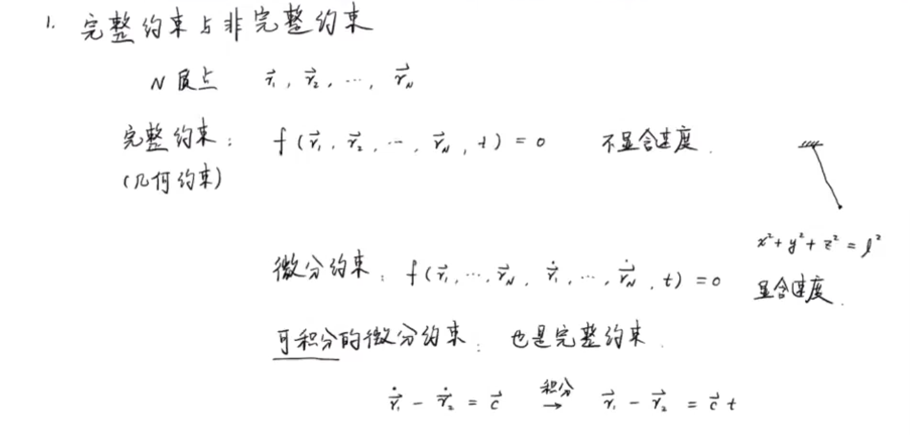
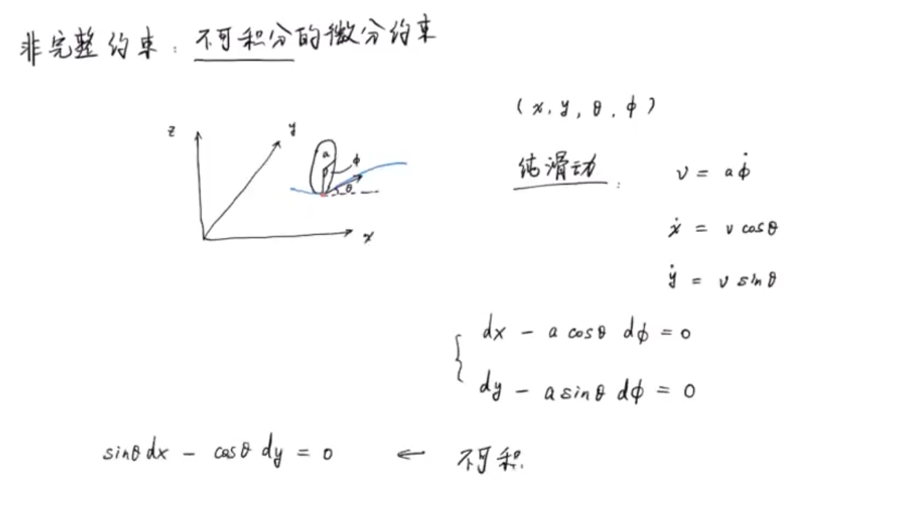
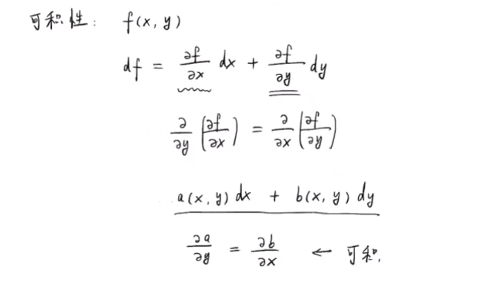
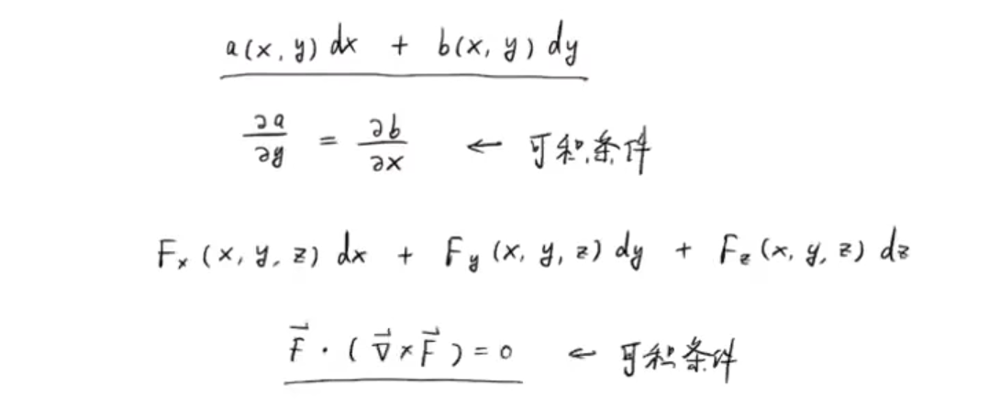
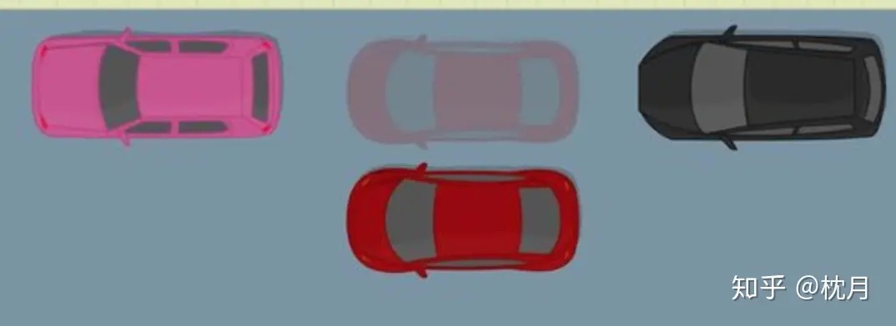
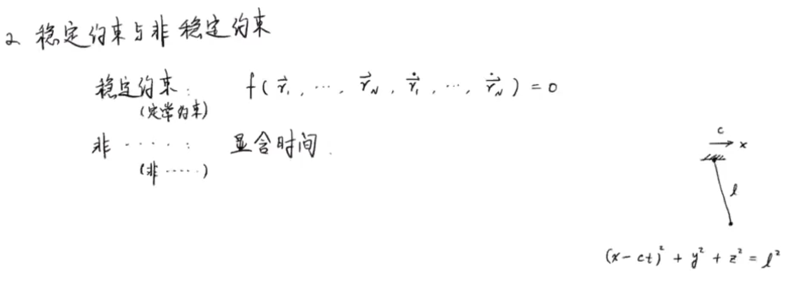
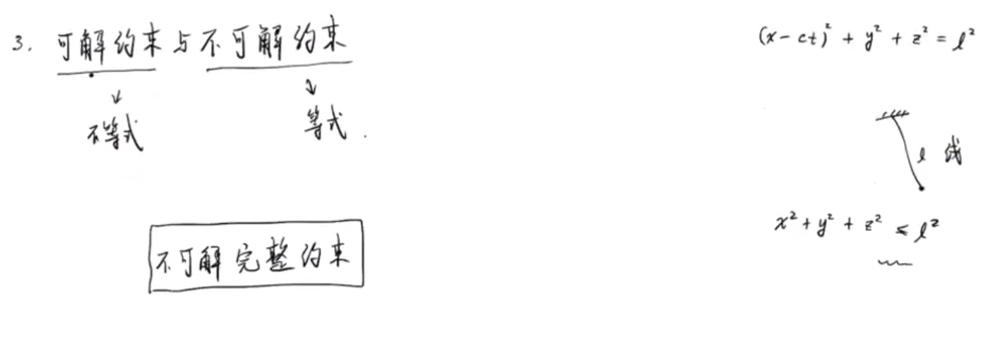
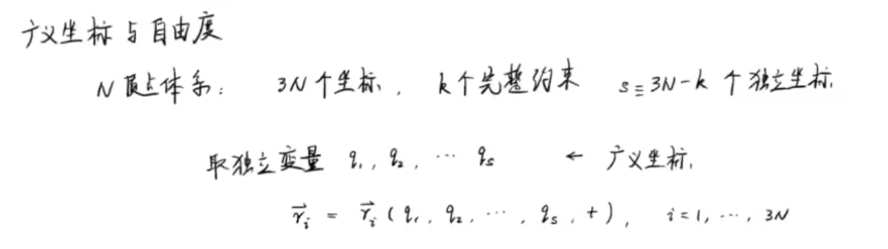
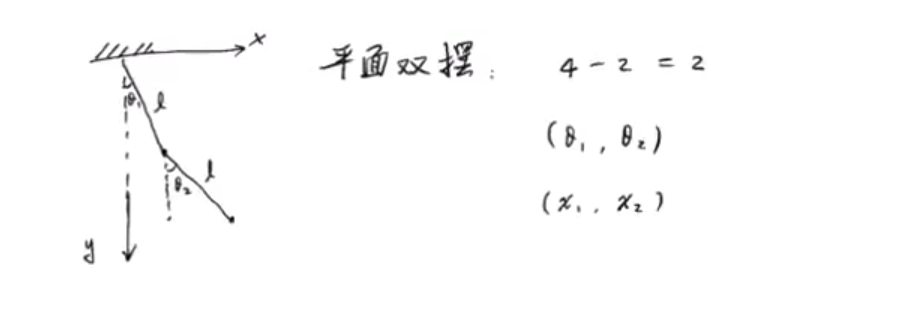
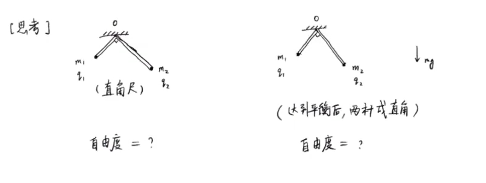

# 约束和拉格朗日方程

> [链接](https://www.bilibili.com/video/BV1v741127Xm/?spm_id_from=333.337.search-card.all.click&vd_source=782af047fbca87ac3084937682017138)

>1 Α α alpha a:lf 阿尔法 
>
>2 Β β beta bet 贝塔 
>
>3 Γ γ gamma ga:m 伽马 
>
>4 Δ δ delta delt 德尔塔 
>
>5 Ε ε epsilon ep`silon 伊普西龙 
>
>6 Ζ ζ zeta zat 截塔 
>
>7 Η η eta eit 艾塔 
>
>8 Θ θ thet θit 西塔 
>
>9 Ι ι iot aiot 约塔 
>
>10 Κ κ kappa kap 卡帕 
>
>11 Λ λ lambda lambd 兰布达 
>
>12 Μ μ mu mju 缪 
>
>13 Ν ν nu nju 纽 
>
>14 Ξ ξ xi ksi 克西 
>
>15 Ο ο omicron omik`ron 奥密克戎 
>
>16 Π π pi pai 派 
>
>17 Ρ ρ rho rou 肉 
>
>18 Σ σ sigma `sigma 西格马 
>
>19 Τ τ tau tau 套 
>
>20 Υ υ upsilon jup`silon 宇普西龙 
>
>21 Φ φ phi fai 佛爱 
>
>22 Χ χ chi phai 西
>
>23 Ψ ψ psi psai 普西 
>
>24 Ω ω omega o`miga 欧米伽


## 约束的分类

> 约束可以分为完整/非完整约束，稳定/非稳定约束，可解/不可解约束


### 完整/非完整约束

> 区分完整/非完整约束的条件是判断其是否可积，表达在坐标上即是否可以对dx积分以得到路程x。


> 对于一个非完整约束，判断条件是分别对式子a，b进行对x，y的偏微分，若不相等则不可积，即非完整约束。

在下面的例子中cosθ != sinθ所以式子不可积







上面的有些抽象，我们用停车来做例子：

[zhihu](https://zhuanlan.zhihu.com/p/48662038)

> 如下图所示。虽然你由于车子运动方向上的约束不能直接向上运动平行停到粉色车和黑色车的中间位置，但是你依然能通过一系列操作，让车停到中间。
>
> 那这个让车运动的过程也就是对小车角度和速度的积分过程，在这个积分的过程中，小车会有右侧的位移，此时这个约束就是非完整的



但对于一个二维平面做圆周运动的点，其不管怎么动作，其z轴的位移都为0，这就是系统对于z轴自由度的一个完整约束

**非完整约束通常会限制机器人的运动方向，但不会限制机器人的运动位置。**


### 稳定/非稳定约束

> 区分稳定/非稳定约束的条件是变量是否显含时间



### 可解/不可解约束

> 可解/不可解约束的区别在于约束式子是否是等式

以摆杆为例，此时等式是 x^2 + y^2 = L，是不可解约束

如果是摆线，则有不等式 x^2 + y^2 <= L，这就是一个可解约束

对于可解约束的处理，在摆线未到L长是可视为约束不存在，到L长度时在作为不可解约束分析



```c
在未来的学习中，仍以不可解完整约束为主
```


## 拉格朗日方程


### 广义坐标和自由度

> *广义坐标* :  用来描述系统位形所需要的独立参数，或者最少参数

假设系统有N个质点，想要描述质点的位置，那么以一个质点三个坐标(xyz)为基准，那么就有3N个坐标

假设有K个完整约束，则有` s=3N-K `个独立坐标，这s个作为独立变量可表示所有质点的位置，这些独立变量就是**广义坐标**




以平面双摆为例，摆的两个端点需要2x2共4个坐标。因为有两个杆作为约束，所以实际的独立变量是4-2=2个。所以我们可以仅需要使用广义坐标**（x1，x2）**就可以描述质点的位置。

广义坐标不一定是系统的量纲，除了(x1,x2)，我们还可以使用**(θ1,θ2)**来描述质点位置




#### 有非完整约束

> 上面我们知道，具有完整约束可以减少独立坐标的数目。虽然非完整约束的数目(L)不能减少独立坐标的数目，但可以减少独立速度的数目
>
> 独立速度的数目 `r=3N-K-L` 这就是自由度的数目

如果没有非完整约束，则自由度数目(广义速度数目)和广义坐标数目相同


# 思考题

> 直角尺和两自由轻杆各自的自由度




