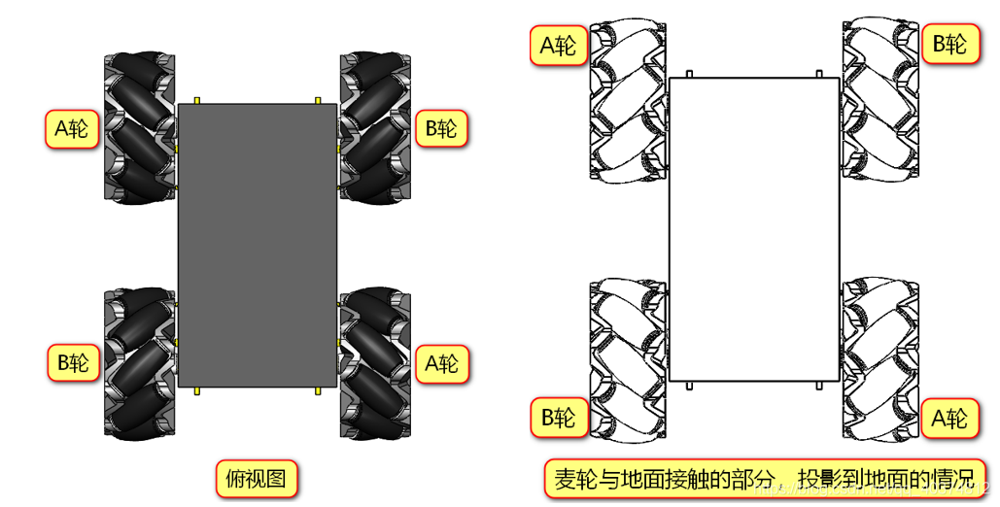
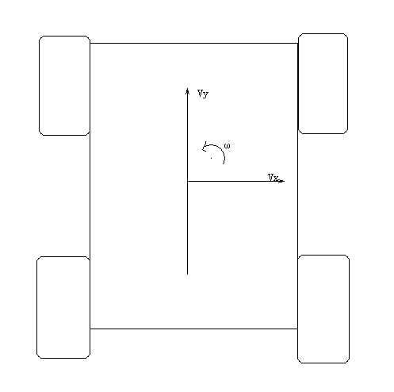
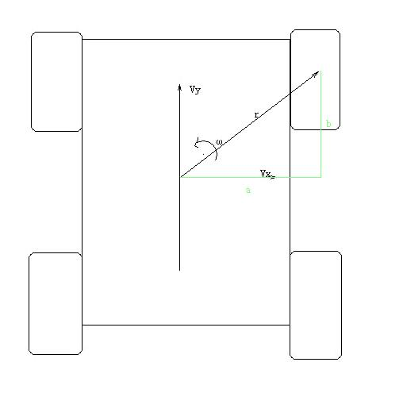
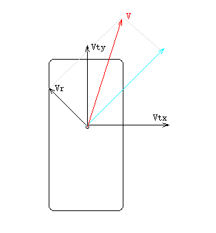
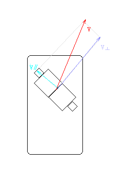
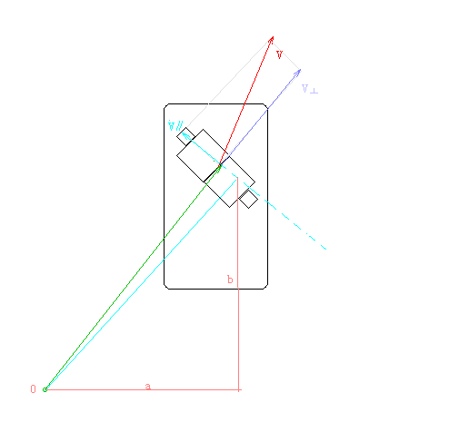

# 麦克拉姆轮的运动学分析

------



------


对一个正在运动的小车进行分析，小车整体具有沿X轴的分速度 ，沿y轴的分速度，以及一个沿 yaw 轴自转的角速度，定义逆时针为正。




## 计算轮子轴心上的速度

定义：


 为从几何中心指向轮子轴心的矢量；

 为轮子轴心的运动速度矢量；

 为轮子轴心沿垂直于  的方向（即切线方向)的速度分量




分析得到，轮子轴心的速度由，，相加而成

​																											=* ++




## 计算辊子速度

在上述的计算中，我们已经获得了轮子轴心的速度，现在分析轮子上与地面接触的辊子

对右上轮子进行分析



对轴心上的速度进行分解，得到沿辊子方向的速度  和垂直于辊子方向的速度  。其中  是可以无视的。

> 轴心上的速度分解后所得到的一个垂直于辊子方向的速度被提供为辊子旋转的角速度，对轮子转速没有贡献

建立一个V∥方向上的单位矢量u,设i，j分别为x，y轴方向的单位向量，计算得到 $$u=(-i/\sqrt{2}+j/\sqrt{2})$$


如此，V在u方向上的投影即为V∥

​																  						$$V∥=V(-i/\sqrt{2}+j/\sqrt{2})$$


****

### 计算轮子速度

V∥与轮子速度$$Vω$$成45°夹角且V∥是轮子速度$$Vω$$的分速度。由此

​												   					$$Vω=V∥/cos(45°)=V(-i+j)$$                      (右上，左下轮)

​													  				$$Vω=V∥/cos(45°)=V( i+j)$$                         (左上，右下轮)

``` c
··        i,j系数的判断因素：V∥的方向
```


为方便分析r，设定长度a与b 										

结合                                             					=* ++=*$$(-bi+aj)$$++      （右上轮)

​												    				     =* ++=*$$(-bi-aj)$$++      （左上轮)

​																		 =* ++=*$$(bi-aj)$$++         （左下轮)

​																		 =* ++=*$$(bi+aj)$$++         （右下轮)

``` c
·· 		  i,j系数的判断因素：Vr的方向
·· b,a分别与i，j相乘的原因：ω与i乘，得向量的外积，生成的向量与ω，i垂直，即y轴方向向量，b(ωi)即代表Vr的y轴方向上的分量
```




联立得到

​																					$$Vω1=-Vtx+Vty+ω(a+b)$$       （右上轮）

​																					$$Vω2=   Vtx+Vty-ω(a+b)$$             (左上轮)

​																					$$Vω3=-Vtx+Vty-ω(a+b)$$       （左下轮）

​																					$$Vω4=Vtx+Vty+ω(a+b)$$           （右下轮）


## 另一种方法

计算出麦轮底盘在「沿X轴平移」、「沿Y轴平移」、「绕几何中心自转」时，四个轮子的速度，通过加法，计算出这三种简单运动所合成的「平动+旋转」运动时所需要的四个轮子的转速。

当底盘沿着 X 轴平移时：

 

当底盘沿着 Y 轴平移时：

 

当底盘绕几何中心自转时：

 

将以上三个方程组相加，得到的恰好是根据「传统」方法计算出的结果。这种计算方式不仅适用于O-长方形的麦轮底盘，也适用于任何一种全向移动的机器人底盘。
