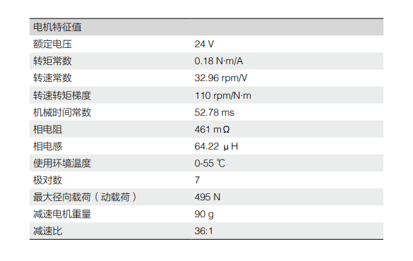

# 电机说明

## M3508

  · M3508主要面向行业应用市场，具备强劲的动力和伺服性能，可服役于物流搬运、机器人等领域。适用于10-50Kg重量级的机器人移动平台和执行机构。

  · 由电机与减速器集成，配备有FOC控制技术的C620电调，内置多种传感器最大输出功率220W，扭矩5Nm*

  · 支持PWM信号输入控制和CAN总线指令控制，CAN总线可以实时读取电机转子状态信息(不可同时使用)

· RoboMaster M3508直流无刷减速电机使用说明：[链接](https://rm-static.djicdn.com/tem/17348/RoboMaster%20M3508%E7%9B%B4%E6%B5%81%E6%97%A0%E5%88%B7%E5%87%8F%E9%80%9F%E7%94%B5%E6%9C%BA%E4%BD%BF%E7%94%A8%E8%AF%B4%E6%98%8EV1.0%EF%BC%88%E4%B8%AD%E8%8B%B1%E6%97%A5%EF%BC%89.pdf)                                                                                                                                                                          

## M2006

  ·  RoboMaster M2006动力系统由RoboMaster M2006 P36直流无刷减速电机和RoboMaster  C610无刷电机调速器组成，具有控制精度高，输出功率大，体积小等特性。相比于RoboMaster  M3508动力系统，转速接近，体积和重量大幅下降，故应用场景更为广泛。

  · 最大持续输出功率44w，扭矩1000mN·m，内置直流无刷减速电机可提供更精准的位置反馈

  · RM M2006 P36直流无刷减速电机使用说明: [链接](https://rm-static.djicdn.com/tem/17348/RM%20M2006%20P36%E7%9B%B4%E6%B5%81%E6%97%A0%E5%88%B7%E5%87%8F%E9%80%9F%E7%94%B5%E6%9C%BA%E4%BD%BF%E7%94%A8%E8%AF%B4%E6%98%8E.pdf)																												                                                                  

## GM6020

  · RoboMaster GM6020 是一款内部集成驱动器的高性能直流无刷电机。电机采用空心轴设计，扭矩密度大、控制精度高、交互方式灵活、保护功能强，适用于*低转速、大扭矩*直接驱动的应用场景，是机器人比赛、科研教育、自动化设备等领域的理想之选。 

  · 高极数和分数槽集中绕组设计使得电机的扭矩达到较高水平，持续扭矩达1.24N·m。

  · 支持CAN总线指令和PWM信号控制，在CAN指令控制模式下，控制器与电机间的控制指令和状态数据可实现双向交互，通过实时获取电机的角度、转速、温度等信息，实现高级控制应用；在 PWM 信号模式下，可模拟舵机控制方式，实现角度控制

  · RoboMaster GM6020直流无刷电机使用说明：[链接 ](https://rm-static.djicdn.com/tem/17348/RoboMaster%20GM6020%E7%9B%B4%E6%B5%81%E6%97%A0%E5%88%B7%E7%94%B5%E6%9C%BA%E4%BD%BF%E7%94%A8%E8%AF%B4%E6%98%8E.pdf)                                                                                                                                                                            

  

