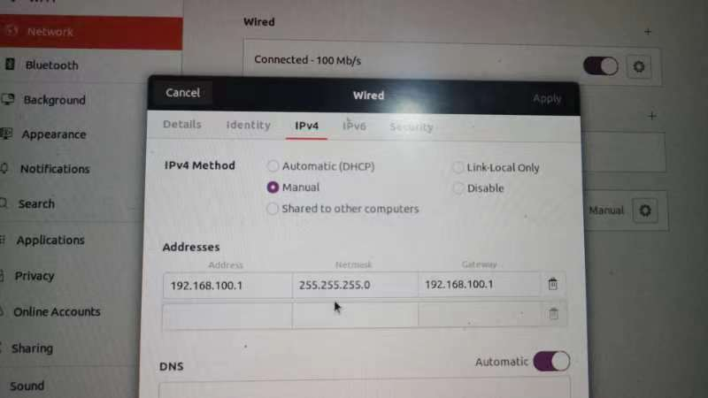
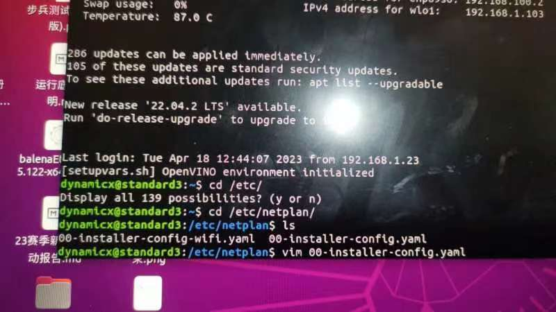
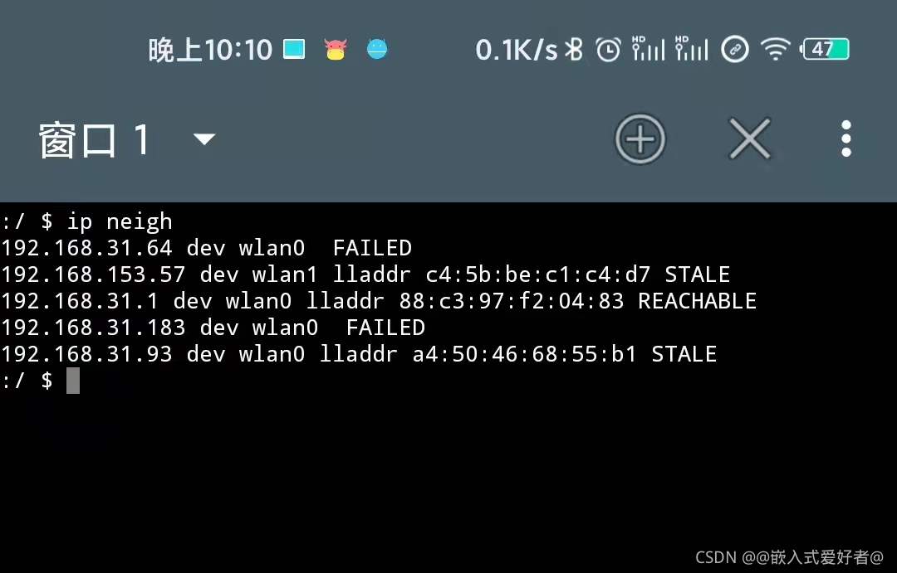
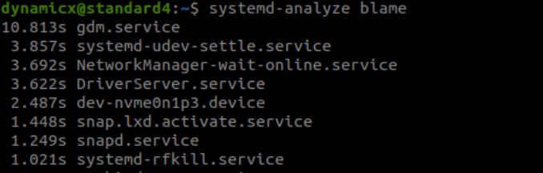
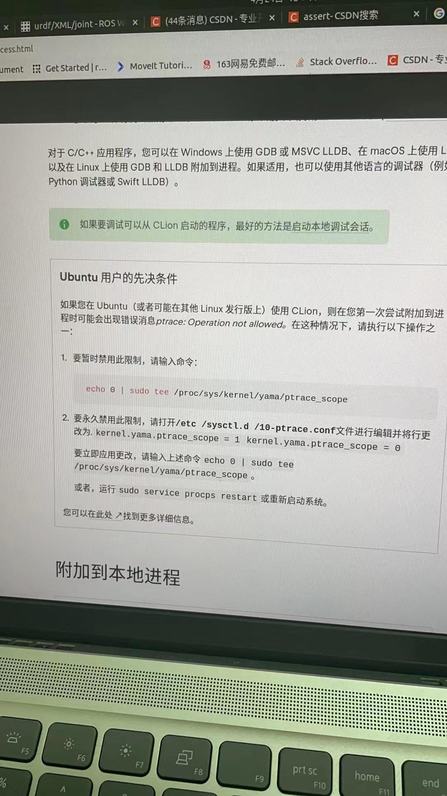
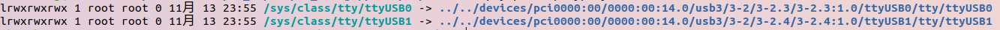
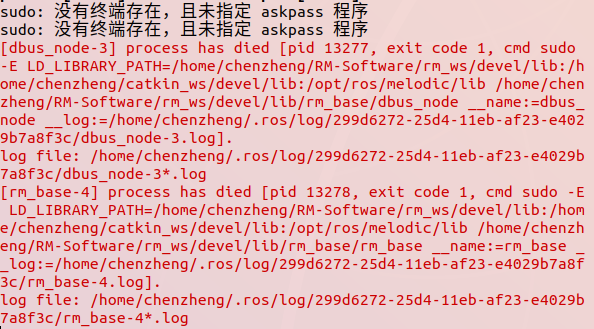
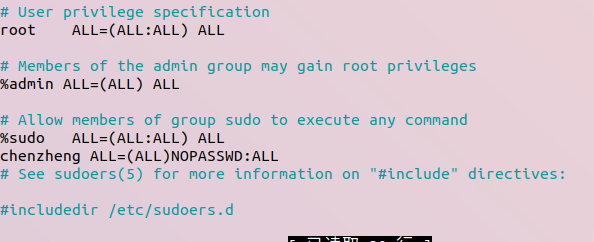
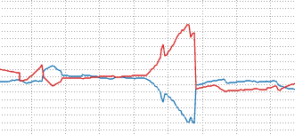

# 调试

> 调试工具集
>
> https://blog.csdn.net/u011832219/article/details/114915363
>
> 虚拟串口
>
> https://blog.csdn.net/qq_41742043/article/details/124931406(入门)
>
> https://www.docin.com/p-2567627300.html(使用手册)
>
> http://www.dest-unreach.org/socat/(官网)
>
> core dump错误定位
>
> https://blog.csdn.net/hongge_smile/article/details/125028302

## 注意细节

1.当遥控出现问题1.代码  2.无can 3.没开dbus

2.rm_control下的rm_gazebo不可传入机器人

3.代码提交commit 要求首字母大写，加句号。

4.右键 ——git—— show history后可以更新代码

5.更新战队软件源:sudo apt-get upgrade

  注意，战队的rm_description,rm_bringup，rm_config需要经常修改，不可将其通过软件源更新

 若不慎更新请catkin clean并传新包

6.由于电机不知道自己正确朝向正向的初始点，offset参数的作用即调试电机初始对准正方向。这和rm_description有关。

调试方法：先进入rm_description中把yaw_joint的offest调为0，之后开启机器人，注意不要上力，因为offest是不准的。将云台移到目标位置读取此时话题/joint_state中的对应的数据。将其取反后填入description的offest。

> 系统自启动服务
>
> sudo systemctl status rm_start.service
>
> sudo systemctl start/stop

7.pre-commit自检 

> pre-commit install / uninstall
>
> pre-commit run -a 执行一次

8.referee机器人连接但显示被踢掉了，进入裁判端，如果该机器人的图表上的红条还在的话重置比赛(reset)一下即可。

9.头文件错误包含会导致你之前调试的构造函数问题，比如说是循环包含，此时编译器不知道从哪里开始。

10. 报“nan”错误，检查imu是否正常，听can
10. please spin的提示被放在了chassis话题的回调函数里，不会自动发了
10. 当有线调试时，关闭wifi，否则因为ip冲突会导致本机发布话题到不了机器人上;同时在机器人上关闭start_serive.sh自启动，再自己开一个roscore
13. push代码时出现冲突，除了在网页修改，也可以在本地先将master合并至自己的分支生成冲突信息，修改后再push
14. .bashrc里的`export ROS_IP`没配会导致有线rqt连不上，同时在机器人上的ros信息会显示ip为 drone:11311.
14. 配置nuc时的username：``dynamicx`
14. 直接移动到工作空间：`roscd package_name/`
14. 如果运行dbus出现无法打开dbus的报错，应该是没有配置正确的映射
14.  如果gazebo出现以下插件名称冲突，也许是战队源和自己的代码同时存在的原因，所以卸载战队源

这似乎也是我找不到actutor的原因

```c
 SEVERE WARNING!!! A namespace collision has occured with plugin factory for class rm_gazebo::RmRobotHWSim. New factory will OVERWRITE existing one. This situation occurs when libraries containing plugins are directly linked against an executable (the one running right now generating this message). Please separate plugins out into their own library or just don't link against the library and use either class_loader::ClassLoader/MultiLibraryClassLoader to open.
```

> 也不知道什么原因，其他源会被我的包，但有些源会把我的包覆盖

19. 发抖一般都是pid
20. 调试pitch中的软限位&&Offset：将软限位给大，之后在rm_hw参数中给need_calibrated=true，打开gimabal_calibrated控制器，调试合适的p让电机撞击后不会发抖，读取合适的数据填入offset，最后改好软限位
20. 获取gpt的api：https://www.idc1680.com/2656.html
20. 如果两个人都向nuc传文件，则rm_msgs的修改可能无法生效。删除rm_msgs重新传一遍再编译
20. amd的驱动不要安装intel的，如果装错了则sudo make uninstall卸载掉。之前就有装了intel/libva导致gaezbo报symbols错误

24. 平衡甩头时后面触地，改theta，dphi

   - 位置x和速度dx给小，加速倾角会小但刹车距离会大

   - 增大滑块力权重，可以增加小陀螺theta稳定性

   - 减小小陀螺位移增大phi权重，因为phi转向和轮子差速有关
     ```c
     小陀螺位移如果总是往一个方向偏则是质心偏移
     如果是随机方向，则需要调参
     ```


25. catkin build的hash warning
    ```bash
    catkin config --merge-devel 
    ```

    之后重新编译

26. 电机id 0x20A 只能读数据不能控制它，不知道为什么

​		207开始就有这个问题

27. 删除pip缓存

```bash
pip cache purge
```

​	apt-get

```bash
sudo apt-get clean
```

28. 拨盘也有一个offset，双发的时候改小，卡弹的时候改大

​		如果拨杆一次弹丸出来的很艰难，就改大offset

​		对于23.5.16号的5号步兵，减小offset会让弹丸远离单发限位

29. 拉其他人的远程分支到本地：

```c
git add remote local_name git@1111.com 
```

30. 对于电机在关闭hw后如果疯转，这是因为它本身在做微小震动，断开hw后就疯了，这是pid

31.  when we adjust track ,whe should change:

    ```
    <xacro:camera_optical_frame xyz="0.06059775176285364 0.000087 0.09256327160978175"
                                rpy="-1.5891064 0 -1.5507963"
                                frame_id="$(arg camera_optical_frame)"
                                parent="pitch"
                                camera_sim="false"/>
    ```

    if the shoot point seen be right,we should let yaw smaller

    if the shoot point seen be up,we should let roll smaller

    if the robot(hero) is in slope ,we should adjust pitch

​		总结就是往哪里偏就往哪里补偿

```c
 real  | ---track
	\  |
	 \ |
	   o
以上是往左偏的情况，车体认为自己指正的情况下实际往左偏，由于相机坐标系朝右为x，朝前为，朝下为y，因此需要修改pitch，增大pitch使其向右补偿摆正：
real-- |   	
	   |  / ---track
	   | /
	   o
```


32. can一路最多承载7个电机，imu数据算两个电机，如果电机帧率低了可以先拔掉同一路can上的电机看看帧率有无变化
32. 改电调id：短按一下，等灯黑了之后改id

34. 键盘调试节点：

```c
 sudo apt-get install ros-noetic-teleop-twist-keyboard
     
 rosrun teleop_twist_keyboard teleop_twist_keyboard.py
     
 Reading from the keyboard  and Publishing to Twist!
---------------------------
Moving around:
   u    i    o
   j    k    l
   m    ,    .

q/z : increase/decrease max speeds by 10%
w/x : increase/decrease only linear speed by 10%
e/c : increase/decrease only angular speed by 10%
anything else : stop

CTRL-C to quit
```

35. 配ecat时注意将串口映射对调，同时将用户目录下.ros文件夹的camera_info文件夹复制放入/root/.ros下
36. pitch校准后抖可能是限位给小了
36. 终端电阻每条总线有两个，usb2CAN一个，电阻和IMU都有一个，有IMU时不需要开电机的，无IMU时开最远的电机的终端电阻
36. 下次开机进BIOS:

```bash
sudo systemctl reboot --firmware-setup 
```

39. vim编辑器 dd：删除一行 g：跳到最后一行 u：撤回
40. 平衡歪头倒地：掉轮子！
41. 超电第一个数码管：0直连 1开burst或charge 2底盘断电 第二个：和power limit对应
42. 比赛前每次先检查机器人基础功能再开发
42. 平衡启动控制器读取不了balance controller

```c
[ControllerManager::loadController]: Could not load class 'rm/BalanceController
                   ~  ': Failed to load library /home/dynamicx/mpc_ws/devel/lib//libbalance_controlle
                   ~  r.so. Make sure that you are calling the PLUGINLIB_EXPORT_CLASS macro in the li
                   ~  brary code, and that names are consistent between this macro and your XML. Erro
                   ~  r string: Could not load library (Poco exception = libhpipm_catkin.so: cannot o
                   ~  pen shared object file: No such file or directory)
```

用root用户，source /home/dynamicx/.bashrc 和 mpc后bringup即可，以前不用这样的，需要找到原因


## 平衡步兵

部署mpc后，开启平衡步兵：

1. 开hw：source mpc_dev/devel/setup.bash 后启动config
2. 开manual：正常启动
3. 开mpc：source mpc_dev/devel/setup.bash  进mpc_dev开load_controller.launch
4. 开dbus


## ECAT

下载三个依赖包any_node，message_logger，soem_interface

找到目标的网卡，并进行配置(似乎并不需要注意ip)

将串口映射对调，同时将用户目录下.ros文件夹的camera_info文件夹复制放入/root/.ros下

修改URDF2006电机的传动比


写配置文件，填入网卡名字

- 首先在编译上，message_logger会调用MELO宏取代ROS_INFO，编译是如果有以下报错，则尝试将ROS_INFO,ERROR一类的日志改为MELO

```c
/opt/ros/noetic/include/ros/console.h:351:26: error: no matching function for call to ‘print(NULL, void*&, ros::console::Level&, const char [103], int, const char [101], std::string, const char [31])’
  351 |     ::ros::console::print(filter, __rosconsole_define_location__loc.logger_, __rosconsole_define_location__loc.level_, __FILE__, __LINE__, __ROSCONSOLE_FUNCTION__, __VA_ARGS__)
      |     ~~~~~~~~~~~~~~~~~~~~~^~~~~~~~~~~~~~~~~~~~~~~~~~~~~~~~~~~~~~~~~~~~~~~~~~~~~~~~~~~~~~~~~~~~~~~~~~~~~~~~~~~~~~~~~~~~~~~~~~~~~~~~~~~~~~~~~~~~~~~~~~~~~~~~~~~~~~~~~~~~~~~~~~~~~~~
/opt/ros/noetic/include/ros/console.h:354:5: note: in expansion of macro ‘ROSCONSOLE_PRINT_AT_LOCATION_WITH_FILTER’
  354 |     ROSCONSOLE_PRINT_AT_LOCATION_WITH_FILTER(NULL, __VA_ARGS__)
```


## git版本拆分

> https://www.shuzhiduo.com/A/QV5ZXvQnzy/
>
> 将big-project下的codes-eiyo拆分到新文件夹eiyo

这就是那个大仓库 big-project

```
$ git clone git@github.com:tom/big-project.git
$ cd big-project
```

把所有 `codes-eiyo` 目录下的相关提交整理为一个新的分支 eiyo

```
$ git subtree split -P codes-eiyo -b eiyo（-P是Prefix的意思，如果需要查看哪些options可以git subtree split --help）
```

另建一个新目录并初始化为 git 仓库

```
$ mkdir ../eiyo
$ cd ../eiyo
$ git init
```

拉取旧仓库的 eiyo 分支到当前的 master 分支

```
$ git pull ../big-project eiyo
```


## IMU

> imu涉及校准，如果上电后机器人云台乱甩那就是imu位姿错误

imu的xyz轴在板子上有画，根据位姿调整urdf即可


**注意**

1. 红x绿y蓝z
2. 顺时针为正
2. urdf中旋转的顺序是zxy


##  功率系数

> 可以调的参数：
>
> ```c
> max_linear_x:
>   - [ 50.0,1.00 ]
>   - [ 80.0,1.80 ]
>   - [ 240.0, 3.00 ]
> max_linear_y:
>   - [ 50.0,3.14 ]
>   - [ 80.0,4.37 ]
>   - [ 240.0,4.76 ]
> max_angular_z:
>   - [ 50.0,12.1 ]
>   - [ 80.0,14.9 ]
>   - [ 240.0,16.2 ]
> ```

> ```c
> accel_x:
>   - [ 50.0,4.0 ]
> accel_y:
>   - [ 50.0,99.0 ]
> accel_z:
>   - [ 50.0,10.0 ]
> ```

> ```c
> power:
>   effort_coeff: 2.35
>   vel_coeff: 0.00905
>   power_offset: -9.8
> ```

对于话题里的power limit和chassis power，当小陀螺加速时力矩影响较大，因此effort_coeff系数较重要(越小输出功率越大);当匀速时速度影响较大，vel_coeff较重要。同时根据实际调节加速度和速度，尽量将功率吃满


## 稳态误差

- yaw

k_chassis_vel  和 小陀螺速度：

```c
max_angular_z:
  - [ 50.0,12.1 ]
  - [ 80.0,14.9 ]
  - [ 240.0,16.2 ]
```


- 电机响应

当小陀螺速度过快 时电机的响应速度可能会跟不上，具体表现是云台响应速度变慢甚至会逐渐漂移。所以需要设置一个正确的选择角速度


## 自启脚本

**部署自启**

1. 将rm_bringup传到nuc上，编译
2. 输入命令行

```
:~$ roscd rm_bringup/scripts/auto_start
:~$ ./creat_specific_service.sh
```

1. 修改rm_start.sh

- 将ROBOT_TYPE改为对应车的类型

1. 重启nuc

**rosbag**

传入bringup，前往auto_start执行

./create_special_service.sh control_rosbag_record

./create_special_service.sh memeory_minitor //这个会检测磁盘空间，删除多的rosbag


## 后台程序

ctrl+z可以把程序暂停并放后台

jobs可以查看在后台的所有线程id

bg id可以使目标线程运行

fg id可以使目标线程停止


## 抑制零漂

> 上电后机器人的底盘会缓慢旋转，这可能是零漂问题

现在rm_hw的参数文件里把imus里的`angular_vel_offset: [ 0.0, 0.0035, 0.0 ]`全部置零。之后打开plotjugger查找一个imu话题，在/gimbal_imu内选取angular_velocity话题里的xyz，右键图像选择apply filter，选择moving average给到最大平均。读取数据取反后填入`angular_vel_offset`内

- 注意：读取时不应打开遥控器


## 自瞄参数

> 自瞄包括URDF，空气阻力系数，发弹延时，track的QR矩阵

1. URDF

初始下，设置空气阻力系数为0,调整目标装甲板距离3-4m，调节相机坐标系的urdf使发弹可以打中。


2. 测空气阻力系数

```
bullet_solver:
  resistance_coff_qd_10: 0.45
```

**用rqt发/track**

(5:00)id不要设成0，设为-1

frame_id设为base_link(注意base_link是底盘中间的link，具有一定的离地高度，不是地面的link。后面调目标装甲板高度时需要注意)

x轴一块瓷砖0.5m，发射者底盘位于横线中间，受击者装甲板位于横线中间

/Track：z轴高度对于步兵高度0.05m(前后两块装甲板)


(录音7：00 - 11：00)

- 对应各个射速的下的系数15 18(实际用16的弹速下的空气阻力系数) 30；  10,18的弹速乱给的

- 参考阻力系数：15-1.0  16-1.5  30-5.0

- 调空气阻力系数使弹丸打到中间

- 同一档射速调整距离2，3，4m  ，反复测试阻力系数使弹丸打在同一位置(如果提高到5都打在偏下则不正常) (录音9:50)

**注意：**保证manual中的解算弹速和实际偏差不要太大


3. QR矩阵

跑rm_track，上实物装甲板让机器人自瞄射击，观察云台是否抖动。

抖动有两个原因，1是pid没调好，2是track的QR参数没调好

对于QR，R基本不用调。Q矩阵参数越大越倾向于目标是移动的，越小越倾向于目标静止


## 手眼标定

2. 手眼标定

接下来先做[手眼标定](https://gdut-dynamic-x.github.io/RM-Software-Tutorial/#/quick_start/easy_handeye)

- 配置好launch文件后启动my_calibration.launch

- 打开rqt的image_view，观察图像

- take sample采集样本点(20个)，全程保证图像在相机内

- 按下computer计算结果，四元数转换[链接](http://www.andre-gaschler.com/rotationconverter/)，结果选择zyx


测试前保证实际弹速和manual里的弹速接近，因为要参与运算

测试时通常改阻力系数就能达到目标，如果歪了通常urdf的offest没设好

take sample时注意不要搞错名字(选择camera .....) 

oretation需要关掉，开启robot_state_controller

保证底盘不动，云台运动。rpy准确度还行，xyz不准，建议参考3号


### 相机坐标系法

调整相机rpy来校准弹道

相机z轴朝前，y轴朝下


**出现相机闪一会，长亮一会**

> 原因是相机帧率小于时间戳发送频率而导致imu反复触发相机，有一个系统录制的服务会导致帧率降低，请关掉它
>
> `sudo systemctl stop rosbag_record_service.service`

```bash
     /vision_nodelet: [GalaxyCameraNodelet::onFrameCB]: Trigger not in sync! May
                   ~  be imu gimbal_imu does not actually trigger camera?
     /vision_nodelet: [GalaxyCameraNodelet::onFrameCB]: Disable imu gimbal_imu f
                   ~  rom triggering camera.
     /vision_nodelet: [GalaxyCameraNodelet::onFrameCB]: Disable imu gimbal_imu f
                   ~  rom triggering camera.
     /vision_nodelet: [GalaxyCameraNodelet::onFrameCB]: Disable imu gimbal_imu f
                   ~  rom triggering camera.
     /vision_nodelet: [GalaxyCameraNodelet::onFrameCB]: Disable imu gimbal_imu f
                   ~  rom triggering camera.
     /vision_nodelet: [GalaxyCameraNodelet::onFrameCB]: Disable imu gimbal_imu f
                   ~  rom triggering camera.
     /vision_nodelet: [GalaxyCameraNodelet::onFrameCB]: Disable imu gimbal_imu f
                   ~  rom triggering camera.
     /vision_nodelet: [GalaxyCameraNodelet::onFrameCB]: Disable imu gimbal_imu f
                   ~  rom triggering camera.
     /vision_nodelet: [GalaxyCameraNodelet::enableTriggerCB]: Try to enable imu 
                   ~  gimbal_imu to trigger camera.

```


**注意细节**

- oretation控制器提前关闭，因为其可能影响姿态判断中的底盘倾斜度，从而干扰枪管解算

- /track 需要在header的frame_id里填入关节base_link避免进入自瞄模式后固定指向一方

- 对应各个射速15 18(实际用16的弹速) 30。注意，在rm_manual config里填入的实际弹速会参与解算，测试前请将调整摩擦轮转速来让弹速与配置文件的实际弹速匹配。


## 有线调试

> 在没有wifi的情况下，可以使用网线连接步兵。记得连上网线后在设置网络里查看有线连接是否已连接上，

```c
//先确保安装了namp
sudo apt install namp
    
//ip a找到本机有线ip
9: enx00e04c360a05: <BROADCAST,MULTICAST,UP,LOWER_UP> mtu 1500 qdisc fq_codel state UP group default qlen 1000
    link/ether 00:e0:4c:36:0a:05 brd ff:ff:ff:ff:ff:ff
    inet 10.42.0.1/24 brd 10.42.0.255 scope global noprefixroute enx00e04c360a05
       valid_lft forever preferred_lft forever
    inet6 fe80::4c39:2693:bbe8:2638/64 scope link noprefixroute 
       valid_lft forever preferred_lft forever
	//10.42.0.1/24即为本机ip
        
//使用namp
nmap 10.42.0.1/24

Starting Nmap 7.80 ( https://nmap.org ) at 2022-05-21 18:00 CST
Nmap scan report for xiaoxin15 (10.42.0.1)
Host is up (0.00030s latency).
Not shown: 997 closed ports
PORT    STATE SERVICE
22/tcp  open  ssh
53/tcp  open  domain
902/tcp open  iss-realsecure

Nmap scan report for 10.42.0.241//这里就是目标ip
Host is up (0.0010s latency).
Not shown: 999 closed ports
PORT   STATE SERVICE
22/tcp open  ssh

    
//选择
ssh dynamicx@10.42.0.241
```


### 网卡不识别

可能出现的问题：网卡不识别

> 这是系统的一个bug，修复方法

```bash
sudo lshw -c Network #查看状态,如果网卡不识别则Ethernet interface显示为diaable
```

创建一个文件

```bash
sudo touch /etc/NetworkManager/conf.d/10-globally-managed-devices.conf
```

重启服务

```bash
sudo systemctl restart NetworkManager
```


## 有线-路由器调试

> 有时为了提高传输效率，路由器将会被安装在工控机旁，通过网线与工控机连接，此时调试的逻辑如下：
>
> 电脑主机--wifi--路由器--有限网缆--工控机

初次使用时，网缆连接到工控机后，需要登入网关输入密码才可激活ip，否则电脑主机无法登陆工控机


## 有线-交换机调试

sudo交换机调试更快捷

首先插上网线，在ipv4里设置为manual



设置本机的ip：下面的Address第一，三项填入192.168.100.1 第二项255.255.255.0


wifi ssh到机器人，进入 /etc/netplan/

```bash
sudo vim /etc/netplan/00-installer-config.yaml
```



填入

```c
# This is the network config written by 'subiquity'
network:
  ethernets:
    enp89s0:
      dhcp4: false
      optional: true
      addresses: [192.168.100.2/24]
      optional: true
      nameservers:
         addresses: [255.255.255.0]
  version: 2
```

之后执行一下命令并让机器人重启使配置生效

```bash
sudo netplan apply
```


在自己的电脑如果直接ssh dynamicx@192.168.100.2会有warning，使用一下命令进行屏蔽

```c
ssh -o StrictHostKeyChecking=no -l "dynamicx" "192.168.100.2"
    //这里建议写成alias
```

配置完成


- 注意

1. 这种配置以自己的电脑为网管，ip静态分配，所以其他人不能连，如果想多人则修改上面的dhcp4改成`dhcp4: true`使DHCP动态分配，同时在自己的电脑有线的IPV4改成DHCP，之后nmap即可

2. clion配置里也是192.168.100.2,如果上传代码也会有警告，无视并OK即可


## 热点调试

> 如果在室外没有wifi，可以手机开一个同名的热点调试wifi让机器人连上即可。有些手机可以看到机器人被分配到的ip有些就不可以

查看ip的方法：[链接](https://blog.csdn.net/qq_35105528/article/details/120338746)

软件: [链接](http://www.yisusoft.com/down/22063.htm#download)

下载android terminal ( 安卓命令行)。软件输入 ***ip neigh*** 后可以看到设备的ip地址。

第一行 wlan0 是手机自身外网ip地址，后面的就是链接到手机的热点设备的ip地址




## 开机图形化界面

> https://www.jianshu.com/p/36dcf5185f01

ubuntu20 的默认桌面环境管理服务是 gdm3, 停止 gdm3 就关闭了图形界面(GUI).

在不关机情况下关闭和打开图形界面：

```bash
# 在的当前会话中关闭图形界面 (如果看不到命令行界面，按 ctrl + alt + [1-7] 试试)
sudo systemctl stop gdm3
# 重新打开图形界面
sudo systemctl start gdm3
```

设置开机默认进入GUI或命令行：

```csharp
#  设置开机默认进入命令行
sudo systemctl set-default multi-user.target
sudo reboot    # 重启看看

# 设置开机默认进入用户图形界面
sudo systemctl set-default graphical.target
sudo reboot    # 重启看看
```


注意：gdm部署在nuc上会增加启动时间




## 查看服务启动占用时间

> 有些服务可能消耗大量的开机时间

[link](https://blog.csdn.net/tongxin1101124/article/details/128484865#:~:text=%E8%A6%81%E6%9F%A5%E7%9C%8B%20Linux%20%E7%B3%BB%E7%BB%9F%E4%B8%AD%20%E6%9C%8D%E5%8A%A1%20%E5%BC%80%E6%9C%BA%E5%90%AF%E5%8A%A8%E8%8A%B1%E8%B4%B9%E7%9A%84%20%E6%97%B6%E9%97%B4%20%EF%BC%8C%E5%8F%AF%E4%BB%A5%E4%BD%BF%E7%94%A8systemd-analyze%E5%91%BD%E4%BB%A4%E3%80%82%20%E5%85%B7%E4%BD%93%E6%AD%A5%E9%AA%A4%E5%A6%82%E4%B8%8B%EF%BC%9A,%E8%BF%99%E5%B0%86%E5%88%97%E5%87%BA%E6%89%80%E6%9C%89%20%E6%9C%8D%E5%8A%A1%20%E4%BB%A5%E5%8F%8A%E5%AE%83%E4%BB%AC%E5%90%AF%E5%8A%A8%E6%89%80%E9%9C%80%E7%9A%84%20%E6%97%B6%E9%97%B4%20%EF%BC%8C%E6%8C%89%E7%85%A7%20%E6%97%B6%E9%97%B4%20%E4%BB%8E%E9%95%BF%E5%88%B0%E7%9F%AD%E6%8E%92%E5%88%97%E3%80%82%202)

```bash
systemd-analyze
```


## Gazebo依附进程

> 通过依附进程，如果代码有问题会在问题处自动停住
>
> 在clion上面的选项卡中选择run，点击attach process，点g键搜索gzserver server。

还需要解除权限




## PD调法

> 使用传统PD调法调PID，特点在于我们使用一个期望速度，将期望速度减去当前速度乘以d，加上p乘以误差的值，得到最终结果。

- 首先p置零，设置d值
- 调节d值至电机不抖动为止(d由大到小)
- 调节p值，至曲线逼近的误差较小为止(p由小到大)


## 串口读取

> 插上usb2ttl后先检查设备

```c
ls /sys/class/tty/ttyUSB* -l
lsusb
上面两个都可以识别到串口
```

检查串口特征：

```c
stty -F /dev/ttyACM0 -a
    //可以显示当前串口的配置信息，包括波特率、数据位、校验位和停止位等
```


### 串口可视化调试工具

```c
sudo apt-get install cutecom
cutecom
```


## RM_HW 线程优先级报错

> ```
> ROS_WARN("Failed to set threads priority (one possible reason could be that the user and the group permissions "
>          "are not set properly.).\n");
> ```

https://leggedrobotics.github.io/ocs2/faq.html

- 在*/etc/security/limits.conf*中添加

```
<username>       -       rtprio           99
<username>       -       nice            -20
```

对于我们的机器人，<username>是dynamicx


## Htop优先级监视工具

> 可以查看进程的信息

- ``sudo apt-get install htop``

运行 ： ``htop``


## DBUS

> dbus是遥控器，与接收机连接后进而连接串口（NUC）通信，配置中见到的乱码是dbus发送给接收机的，接收机进而发送给串口


### DBUS DATA

> ```c
> uint8 UP = 1            //拨动开关s_l,s_r对应的状态的数值
> uint8 DOWN = 2
> uint8 MID = 3
> 
> float64 ch_l_x          //左摇杆水平移动   
> float64 ch_l_y			//左摇杆竖直移动
> float64 ch_r_x			//右摇杆水平移动
> float64 ch_r_y			//右摇杆竖直移动
> 
> uint8 s_l               //左拨动开关
> uint8 s_r               //右拨动开关
> float64 wheel           //滚轮
> #mouse
> float64 m_x             //鼠标横向移动
> float64 m_y             //鼠标纵向移动
> float64 m_z             //滚轮上下移动
> bool p_l                //左击
> bool p_r                //右击
> #key board
> bool key_w              //键盘
> bool key_s
> bool key_a
> bool key_d
> bool key_shift                 
> bool key_ctrl
> bool key_q
> bool key_e
> bool key_r
> bool key_f
> bool key_g
> bool key_z
> bool key_x
> bool key_c
> bool key_v
> bool key_b    #
> 
>  //wsad eject
>  //ctrl+r
>    if (data_.referee_.referee_data_.robot_id_ == rm_common::RobotId::BLUE_HERO
>    || data_.referee_.referee_data_.robot_id_ == rm_common::RobotId::RED_HERO) {
>  gimbal_cmd_sender_->setEject(true);
>        
>  //cha
> uint8 RAW = 0
> uint8 FOLLOW = 1
> uint8 GYRO = 2
> uint8 TWIST = 3
> ```


### 物理映射地址

> 读取裁判系统时可能没有数据，先用minicom检查串口

一个会映射成usbdbus ，另一个映射为usbrefore（裁判系统也通过串口读取）。需要对dbus进行连接，若dbus连接口为ttyusb0，命令口的也要修改为ttyusb0

首先连接到wifi

### 代码串：

```bash
mon launch rm_config rm_hw.launch
mon launch rm_config manual.launch
rosrun rm_dbus rm_dbus
```


``` bash
ssh dynamicx@192.168.1.196                        //连接到hero机器人,密码dynamicx
												//139 全向轮  112 哨兵
ssh-copy-id dynamicx@192.168.1.203              //记录密码
```

``` bash
sudo minicom -s                                   //打开配置工具
```

接着选择serial port set up（第三项），回车，按a键，命令口输入ttyUSB1，exit

完成，接着观察是否有接受乱码输出。


## REFEREE

上传referee，注意删去rm_gazebo


### 代码串
修改referee机器人类型

```bash
rosparam set /rm_referee/robot_type hero
```


配置工作空间

```
八十Cmake optins:    -DCATKIN_DEVEL_PREFIX=../devel
Build directory: ../build
Root path:  /home/dynamicx
Mappings:   /rm_ws/src
Local path: /home/yuchen/usetest/RM_ROS/src
```

### 注意细节

> 在正常模式下，can将无法收取数据，可以使用离线模式


### 自定义ui

#### 底盘云台相对角

> 在话题/joint_state 找到position数组，最后一位未yaw_joint即为相对角度


## SHOOTER

> 开启电机前需要确保一些步骤的完成

开控制器之前

- nuc能能够收发数据         四轮的id：右前201，左前202，左后203，右后204

```c++ 
软件包rm_hw，该软件包会发出id为2001FF的帧，要求开启后能够看到该帧才可确认nuc正在发送数据（candump）
//网络断开后，不通过重启通过有线的方式也可进行连接
//nuc有一个自动链接到网络的脚本（别人写的）
```

- 之后开启控制器

```c++
调试PID：成功后电机会以当前位置为基准并产生力，以当前位置为指令，自动运动回当前位置，用手拨动会明显感知。每个电机控制器都会配置pid
//调pid调久了会发烫，需要及时关闭控制器以确保安全。（关闭rm_hw）
```


```c++
板子：闪蓝光表示发送中//版本多不确定
```

- 摩擦轮与供弹轮

```c
独立控制，rm_msgs定义了 0，1，2的发射模式   //mode:STOP,READY,PUSH
    以及10m，15m，16m，18m，30m的发射速度 //speed：0，1，2，3，4
                                       //hz：发射频率
```

- 关闭机器人

```c
关机长按，开机短按
```

### 注意细节

需要确保hw中的config文件can id准确，具体去检查实物

> 例如
>
>     trigger_joint_motor:
>       bus: can0
>       id: 0x206
>       type: rm_3508


>rviz使用
>
>message publisher 				发布话题
>
>controller manager：    		配置控制器
>
>configuration里的dynamic ：配置pid
>
>

> plotjugger使用
>
> rosrun plotjuggler plotjuggler
>
> 运行rm_hw可读取下列话题
>
> start话题：/controllers/shooter_controller/trigger/state
>
> DateType: control_msgs/JointConreollerState
>
> controllers/shooter_controllers/trigger/state/set_point
>
> controllers/shooter_controllers/trigger/state/process_value
>
> 
>
> 打开robot_state_controller后plotjugger 读取jointState可获取电机转速
>
> 右键apply filter可数据处理乘以某个数


> 传动比
>
> 英雄4:1
>
> 哨兵1:1
>
> 步兵2.5:1
>
> 无人机2.5:1

> ```
> uint8 SPEED_10M_PER_SECOND = 0
> uint8 SPEED_15M_PER_SECOND = 1
> uint8 SPEED_16M_PER_SECOND = 2
> uint8 SPEED_18M_PER_SECOND = 3
> uint8 SPEED_30M_PER_SECOND = 4
> //电机最高转速900
> ```


> can帧
>
> can 200代表能够发数据，有200才能表示能够向can发出命令
>
>   can0  201   [8]  0E 0D 00 00 00 11 19 00
>   can0  200   [8]  00 00 00 00 00 00 00 00
>   can0  202   [8]  19 77 00 00 FF DA 19 00
>   can0  201   [8]  0E 0D 00 00 00 11 19 00
>   can0  200   [8]  00 00 00 00 00 00 00 00

### 代码串

仅供参考

``` bash
sudo ip link set can0 up type can bitrate 1000000   #ip 命令直接设定位速率

candump can0
#ssh dynamicx@192.168.1.103    #hero

roscore
mon launch rm_shooter_controllers load_controllers.launch
mon launch rm_config load_controllers.launch 
mon launch rm_hw rm_hw.launch


rqt：
 shooter_controller

#配置参数
参考使用   speed配置1，hz配置5，stamp空，mode先设置为0，发射时改为2
```


改id：短按一下，之后连续按几下id就设置为多少（0x20_)

```c++
standrad4
trigger_joint_motor:
  bus: can2
  id: 0x203
  type: rm_2006                   
  lp_cutoff_frequency: 100
  
  bus:
    - can0                          //原来can1，2，0
  
shootercontroller
standard.cpp 里面的push()

运行hw
unknown macro name: xacro:IMU
when processing file: /home/yuchen/usetest/RM_ROS/src/rm_software/rm_control/rm_description/urdf/standard3/standard3.urdf.xacro
//把xacro的IMU去了
    
    
URDF stadard3的tranmisson
    <transmission name="trans_trigger_joint">
        <type>transmission_interface/SimpleTransmission</type>
        <actuator name="trigger_joint_motor">
            <mechanicalReduction>1</mechanicalReduction>
        </actuator>
        <joint name="trigger_joint">
            <hardwareInterface>hardware_interface/EffortJointInterface</hardwareInterface>
        </joint>
    </transmission> 
```


## RVIZ

### 安装没有的插件

```bash
sudo apt-get install ros-noetic-rqt-xxx
```

### 观察关节

> 改变Fixed frame选项


## safety_controller

> k_position与k_velocity的调试方法

```c
//已有案例
3N.m max_velocity:12.5rad lower:-0.5 upper:0.45
对应的k_p:100 k_v:0.1
    
当变为7N.m时，电机力输出会变小，k_v改为0.3较合适，根据velocity-effort直线图，得到原因是因为k_v过小力的范围在速度0时也只有12.5×0.1=1.25N.m
```

通常认为的一个k_pos的合适值是在0.1rad的横坐标内，让最大速度从最大降到0;k_vel的合适值是在使用位置控制器时，用手偏转关节使其在一定位置时能够输出最大


## ROS_INFO 调试时间戳

> 查看log信息： [rqt_console](https://blog.csdn.net/qq_30460905/article/details/123698106?spm=1001.2101.3001.6661.1&utm_medium=distribute.pc_relevant_t0.none-task-blog-2%7Edefault%7ECTRLIST%7Edefault-1-123698106-blog-108450089.pc_relevant_multi_platform_whitelistv1&depth_1-utm_source=distribute.pc_relevant_t0.none-task-blog-2%7Edefault%7ECTRLIST%7Edefault-1-123698106-blog-108450089.pc_relevant_multi_platform_whitelistv1&utm_relevant_index=1) 
>
> 过滤log等级： [rqt_logger_level]
>
>  [其他](https://zhuanlan.zhihu.com/p/536485585)
>
> ROS_INFO具有时间戳功能，其次，它总共包含五个记录级别，这样做的优点是可以确定在任何时间有选择的查看各种信息。 比如我们可以使用rqt_console检视所有INFO

**打印一次与定时打印**

ROS_INFO_STREAM_ONCE    放在回调函数中确认数据有接收到，但是又不想一直刷屏可以用这个

ROS_INFO_STREAM_THROTTLE(0.5, "Message print every 0.5s");   定时刷屏有时候回调的频率比较高，可以设置慢一点的打印

在ros程序运行时，默认是不显示debug信息的。如果要查看debug消息，需要先运行rosrun rqt_logger_level rqt_logger_level


设置默认的消息等级

我们可以在节点启动的时候设置默认的消息等级，例如

```c
ros2 run turtlesim turtlesim_node --ros-args --log-level WARN
```

这个时候我们就看不到程序刚刚运行的消息了，因为现在我们把默认的消息等级设置为了WARN


## 断点

>  行断点：在行左侧点击出现的红点

程序会在第一个红点处停下，继续运行后会跳至其他断点最后到程序执行完


> 详细断点：红点+shift+左键

之后会弹出断点详细配置

只勾选enabled，运行时会提示该代码的执行位置

suspend表示挂起，勾选后作用与行断点相同

suspend的两个选项：ALL 与 Thread

```
ALL：只要运行到该断点即会停止
Thread: 仅运行当前线程时停止(多线程时使用)
```

condition:条件，触发某些条件时停止


> 方法断点：菱形断点

程序会分别在该断点被触发和即将返回的时刻停止，多用于接口跳转类


> 异常断点： 


## 代码规范

### pre-commit

> 在我们的许多存储库中，有一个在 CI 中运行的 [pre-commit](https://pre-commit.com/) 检查。 你可以在本地使用它并将其设置为在提交之前自动运行，从而避免因为格式错误而无法通过 CI。 要安装，请使用 pip：
>
> ```c
> pip3 install pre-commit    //环境的python可能需要更新，安装后请重启
> ```
>
> 要手动运行 repo 中的所有文件：	
>
> ```text
> pre-commit run -a
> ```
>
> 要在本地存储库中提交之前自动运行 pre-commit，请在本地仓库目录中运行以下指令安装 git hooks：
>
> ```text
> pre-commit install
> ```
>
> 如果您如上所述使用预提交，则每次提交之前都会自动运行 clang-format（如果安装了 `clang-format-10`）。 本节介绍如何手动使用它。
>
> 您可以通过多种方式运行 **clang-format**。 要在 Ubuntu 上安装，只需运行：
>
> ```text
> sudo apt install clang-format-10
> ```


### clangFormat

> Clion 中开启 clang-format:
>
> Preferences -> Editor -> Code Style -> “Enable ClangFormat”

之后会根据相应目录下的.calangFormat文件进行代码规范配置


### 自我探索

> 安装catkin-lint
>
> ```c++ 
> sudo apt install python3-catkin-lint
> ```
>
> 更新pip，记得重启
>
> ```c++
> pip install --upgrade pip
> ```


CMAKE_EXPORT_COMPILE_COMMANDS选项

> 默认不开启，开启的两种方法：
>
> - 在CMakeLists.txt中添加 set(CMAKE_EXPORT_COMPILE_COMMANDS ON)
> - 在命令行中添加-DCMAKE_EXPORT_COMPILE_COMMANDS=on
>
> 开启后，其生成的文件compile_commands.json，包含所有编译单元所执行的指令


**请注意：不仅仅代码格式需要规范，当commit数据不符合时，同样会发生industrial_ci报错**


## URDF

在 ROS 中，提供了一些工具来方便 URDF 文件的编写，比如:

- `check_urdf `命令可以检查复杂的 urdf 文件是否存在语法问题
- `urdf_to_graphiz `命令可以查看 urdf 模型结构，显示不同 link 的层级关系

当然，要使用工具之前，首先需要安装，安装命令:

```
sudo apt install liburdfdom-tools
```


## Gazebo

```c++
调试：
clion里的run下面的attach to process搜索gzserver
```

> 可能会提示无法附加进程：
>
> 第一次尝试连接到进程时可能会出现错误消息ptrace:Operation not allowed。在这种情况下，请执行以下操作之一：
>
>
> 要暂时禁用此限制，输入或向bashrc写入以下命令：
>
> echo 0 | sudo tee/proc/sys/kernel/yama/ptrace_scope
>


- [gazebo建模与仿真](https://www.ngui.cc/zz/1493408.html?action=onClick)


## 配置NUC

> https://github.com/chenhuiYu00/RM-Software-Tutorial/blob/main/quick_start/quick_start_in_control_group.md


- Ubuntu Server 开机卡在  `A start job is running for wait for network to be configured.

原因：存在多网卡时，只要有任意一个网卡没有连接到网络，就会长时间在此状态等待连接

解决方案：等待进入系统后，编辑 `/etc/netplan/00-installer-config.yaml`，将不是一直在线的网卡设为**可选**。

```yaml
# This is the network config written by 'subiquity'
network:
ethernets:
 enp1s0:
   dhcp4: true
 enp3s0:
   dhcp4: true
   optional: true		# 添加这一行，将网卡 enp3s0 设为非必须的。
version: 2
```

```bash
# This is the network config written by 'subiquity'
network:
  ethernets:
    enp89s0:
      optional: true
      dhcp4: false
      addresses: [192.168.100.3/24]
      nameservers:
          addresses: [255.255.255.0]
    enx081f716412f8:
      optional: true
      dhcp4: false
      addresses: [192.168.100.2/24]
      nameservers:
          addresses: [255.255.255.0]
  version: 2
```


然后执行：

> ```shell
> sudo netplan apply
> ```

重启后即可解决。


- 减小grub界面等待时间

(https://blog.twofei.com/550/)

用```sudo vim /etc/default/grub``` 可以看到默认有以下内容：

```
GRUB_DEFAULT=0
GRUB_HIDDEN_TIMEOUT=0
GRUB_HIDDEN_TIMEOUT_QUIET=true
GRUB_TIMEOUT=1
GRUB_DISTRIBUTOR=`lsb_release -i -s 2> /dev/null || echo Debian`
GRUB_CMDLINE_LINUX_DEFAULT="quiet splash"
GRUB_CMDLINE_LINUX=""
```

其中，第4行的 ```GRUB_TIMEOUT=1`'' 即是设置的等待时间，修改她为其它合适的值即可。比如改成了 ``1''。

然后就是执行 ```sudo update-grub``` 使配置生效：

```bash
GRUB_DEFAULT=0
#GRUB_TIMEOUT_STYLE=hidden  #先把这个注释
GRUB_TIMEOUT=5
GRUB_RECORDFAIL_TIMEOUT=5  #非法关机后可能又会等待30s，加上这个来屏蔽
GRUB_DISTRIBUTOR=`lsb_release -i -s 2> /dev/null || echo Debian`
GRUB_CMDLINE_LINUX_DEFAULT="quiet splash" #服务器的话是“text”
GRUB_CMDLINE_LINUX=""
```


- 关一个占用时间300ms的服务

```
cd /etc/cloud
sudo touch cloud-init.disabled
```


- 关一个可能占用2min28s的服务

```c
sudo systemctl mask systemd-udev-settle.service 
```


### 注意事项

- 换完内核后，将boot下的安全启动设置为disable，否则会因自检不通过而无法直接进入系统

- sudo apt安装如果有问题，先`sudo apt-get update` 再`sudo apt-get upgreade`

- 想要在本机听取nuc话题除了设置export master url，还需要在nuc的bashrc中加：

```bash
export ROS_IP=`ifconfig | grep -Eo 'inet (addr:)?([0-9]*\.){3}[0-9]*' | grep -Eo '([0-9]*\.){3}[0-9]*' | grep -v '127.0.0.1' | grep -v '172.17.0.1'`

if  test -z "${ROS_IP}"
then
        export ROS_IP=`dig +short localhost`
fi
```


## 一些命令

```bash
roscd                   #跳到目录
sudo reboot             #重启

free -m                 #内存使用情况
htop                    #查看cpu，内存的状态，界面友好

xset r on               #键盘连按时重复输入不生效时使用
```


# 代码部署

## 快速测试

### 测试can

1. 初始化can0和can1

   ```
   sudo ip link set can0 up type can bitrate 1000000
   sudo ip link set can1 up type can bitrate 1000000
   ```

2. 监听can上的数据

   ```
   sudo apt-get install can-utils
   candump can0
   ```

   > [!Tip]
   >
   > 此时转动电机可监听到电机参数变化

3. 发送数据驱动电机

   ```
   cansend can0 200#05000000000000000
   ```

   具体参见[官方文档](https://rm-static.djicdn.com/tem/17348/RoboMaster C620无刷电机调速器使用说明（中英日）V1.01.pdf)

### 修改串口物理地址

1. pc连接usbtoxxx.

2. 查询usbDbus和usbReferee物理地址

   ```
   ls /sys/class/tty/ttyUSB* -l
   ```

   得到如下：

   [](https://camo.githubusercontent.com/3cd801a881efbe642c15674fb31421e44815024556f761b25e8aa71dea470de7/68747470733a2f2f6674702e626d702e6f76682f696d67732f323032302f31312f376635316234626461376262383033372e706e67)

   其中，'3-2.3:1.0'为usbDbus的物理地址

3. 修改usbDbus和usbReferee物理地址

   ```
   cd /home/chenzheng/RM-Software/rm_ws/src/rm_bringup/scripts/udev/
   vim rm.rules
   ```

   修改KERNELS=="${usb物理地址}"

   ```
   ./create_udev_rules.sh
   ```

4. 查看是否映射成功

   ```
   ls /dev/ | grep usb
   ```

   存在usbDbus和usbReferee即映射成功

   > [!Tip]
   >
   > 若找不到，重启；还是没有，换usb口重新执行上述步骤

### 运行代码

```
roslaunch rm_bringup standard.launch
```

如果出现如下错误：

[](https://camo.githubusercontent.com/95d4742fc361ca4494c4315c4d77c34e0f2c107be9d1d3e332623ec8ac675944/68747470733a2f2f6674702e626d702e6f76682f696d67732f323032302f31312f303666663566613766306361353061322e706e67)

需要设置超级用户免密：

```
sudo visudo
```

添加如下内容：

[](https://camo.githubusercontent.com/9c805f1fe84459c56ab92e4a59573629b4e28bb93a64a6f6de11ecea72c402de/68747470733a2f2f6674702e626d702e6f76682f696d67732f323032302f31312f393132363137393530343535333539642e706e67)

重新运行代码

## 实机部署

1. 配置实时内核，参考此[文档](https://github.com/chenhuiYu00/RM-Software-Tutorial/blob/main/quick_start/dev_guide/rt_kernel.md)

2. 配置开机自动运行代码脚本

   ```
   cd /home/chenzheng/RM-Software/rm_ws/src/rm_bringup/scripts/auto_start/
   ./create_rm_start_service.sh
   ```

3. 调试

   参考快速测试


# 磁盘

## 挂载

[u盘挂载](https://blog.csdn.net/weixin_39843986/article/details/116547970?spm=1001.2101.3001.6650.1&utm_medium=distribute.pc_relevant.none-task-blog-2%7Edefault%7ECTRLIST%7Edefault-1-116547970-blog-116550119.pc_relevant_default&depth_1-utm_source=distribute.pc_relevant.none-task-blog-2%7Edefault%7ECTRLIST%7Edefault-1-116547970-blog-116550119.pc_relevant_default&utm_relevant_index=2)

1.找到u盘挂载目录


2.挂载到新目录


3.卸载掉新目录


- 同一设备可挂载到多个目录

  

### 代码串

```bash
lsblk                #查看硬盘

root: mount /dev/XXX /home/XXX/XXX

df -h
```


## 测速

> https://zhuanlan.zhihu.com/p/633193805

**使用`dd`命令**

`dd`命令是一个用于复制文件和数据的常用工具，也可以用于测试存储/磁盘I/O性能。以下是使用`dd`命令测试存储/磁盘I/O性能的步骤：

1. 打开终端窗口。
2. 运行以下命令以测试磁盘的写入性能：

```text
dd if=/dev/zero of=testfile bs=1G count=1 oflag=direct
```

该命令会创建一个名为`testfile`的1GB文件，并将零值数据写入该文件。通过使用`oflag=direct`参数，可以绕过操作系统缓存，直接测试磁盘的写入性能。

1. 等待命令执行完成。在完成后，`dd`命令将显示写入的数据量、所用的时间和写入速度等信息。
2. 接下来，您可以运行以下命令以测试磁盘的读取性能：

```text
dd if=testfile of=/dev/null bs=1G count=1 iflag=direct
```

该命令将从先前创建的`testfile`文件中读取数据，并将其传输到`/dev/null`设备中。同样使用`iflag=direct`参数，绕过操作系统缓存进行直接读取性能测试。

1. 等待命令执行完成。在完成后，`dd`命令将显示读取的数据量、所用的时间和读取速度等信息。

通过分析`dd`命令的输出结果，您可以得到磁盘的写入和读取性能指标。


# 内核调试工具及理论

> https://www.dedoimedo.com/computers/kdump.html
>
> https://www.dedoimedo.com/computers/lkcd.html


# CmakeList编写

## 缺少find_package()依赖

> Errors     << rm_referee:make /home/dynamicx/rm_ws/logs/rm_referee/build.make.000.log
> /usr/bin/ld: CMakeFiles/rm_referee.dir/src/common/referee_base.cpp.o: in function `rm_referee::RefereeBase::run()':
> referee_base.cpp:(.text+0xd6): undefined reference to `serial::Serial::available()'
> /usr/bin/ld: referee_base.cpp:(.text+0xf2): undefined reference to serial::Serial::available()' 
> /usr/bin/ld: referee_base.cpp:(.text+0x12b): undefined reference to `serial::Serial::read(std::vector<unsigned char, std::allocator<unsigned char> >&, unsigned long)'
> /usr/bin/ld: referee_base.cpp:(.text+0x188): undefined reference to `serial::Serial::write(unsigned char const*, unsigned long)'
> /usr/bin/ld: CMakeFiles/rm_referee.dir/src/common/referee_base.cpp.o: in function `rm_referee::Data::Data(ros::NodeHandle&)':
> referee_base.cpp:(.text._ZN10rm_referee4DataC2ERN3ros10NodeHandleE[_ZN10rm_referee4DataC5ERN3ros10NodeHandleE]+0x31a): undefined reference to `serial::Serial::Serial(std::__cxx11::basic_string<char, std::char_traits<char>, std::allocator<char> > const&, unsigned int, serial::Timeout, serial::bytesize_t, serial::parity_t, serial::stopbits_t, serial::flowcontrol_t)'
> /usr/bin/ld: referee_base.cpp:(.text._ZN10rm_referee4DataC2ERN3ros10NodeHandleE[_ZN10rm_referee4DataC5ERN3ros10NodeHandleE]+0x2a00): undefined reference to `serial::Serial::~Serial()'

可以看到缺少serial的包

补上即可

```c
find_package(catkin REQUIRED
        COMPONENTS
        sensor_msgs
        roslint
        roscpp
        rm_msgs
        serial
        rm_common
        tf2_geometry_msgs
        std_msgs
        actionlib
        nav_msgs
        )
```


# Linux脚本启动流程

> http://ej38.com/showinfo/linux-160925.html

`/etc/profile`:此文件为系统的每个用户设置环境信息,当用户第一次登录时,该文件被执行.
并从/etc/profile.d目录的配置文件中搜集shell的设置.
`/etc/bashrc`:为每一个运行bash shell的用户执行此文件.当bash shell被打开时,该文件被读取.
`~/.bash_profile`:每个用户都可使用该文件输入专用于自己使用的shell信息,当用户登录时,该
文件仅仅执行一次!默认情况下,他设置一些环境变量,执行用户的.bashrc文件.
`~/.bashrc`:该文件包含专用于你的bash shell的bash信息,当登录时以及每次打开新的shell时,该
该文件被读取.
`~/.bash_logout`:当每次退出系统(退出bash shell)时,执行该文件. 
另外,/etc/profile中设定的变量(全局)的可以作用于任何用户,而~/.bashrc等中设定的变量(局部)只能继承/etc/profile中的变量,他们是\"父子\"关系.
`~/.bash_profile` 是交互式、login 方式进入 bash 运行的
`~/.bashrc` 是交互式 non-login 方式进入 bash 运行的
通常二者设置大致相同，所以通常前者会调用后者。 

\--------------------------------------------------------------------------------
**在登录Linux时要执行文件的过程如下：**
在刚登录Linux时，首先启动 /etc/profile 文件，然后再启动用户目录下的 ~/.bash_profile、 ~/.bash_login或 ~/.profile文件中的其中一个(根据不同的linux操作系统的不同，命名不一样)， 

执行的顺序为：==~/.bash_profile、 ~/.bash_login、 ~/.profile==。
如果 ~/.bash_profile文件存在的话，一般还会执行 ~/.bashrc文件。
因为在 ~/.bash_profile文件中一般会有下面的代码：
if [ -f ~/.bashrc ] ; then
. ./bashrc
fi
~/.bashrc中，一般还会有以下代码：
if [ -f /etc/bashrc ] ; then
. /bashrc
fi
所以，~/.bashrc会调用 /etc/bashrc文件。最后，在退出shell时，还会执行 ~/.bash_logout文件。
执行顺序为：/etc/profile -> (~/.bash_profile | ~/.bash_login | ~/.profile) -> ~/.bashrc -> /etc/bashrc -> ~/.bash_logout
关于各个文件的作用域，在网上找到了以下说明：
（1）/etc/profile： 此文件为系统的每个用户设置环境信息,当用户第一次登录时,该文件被执行. 并从/etc/profile.d目录的配置文件中搜集shell的设置。
（2）/etc/bashrc: 为每一个运行bash shell的用户执行此文件.当bash shell被打开时,该文件被读取。
（3）~/.bash_profile: 每个用户都可使用该文件输入专用于自己�


## 添加自启动

> https://www.cnblogs.com/Alwayslearn/p/16816093.html


# 激光雷达

## 监控硬件

```c
df -h   //硬盘
free    //内存
top     //cpu占用
sensors //温度
```


## 串口权限

雷达部署在本机正常工作，一放到j1800就不能。检查后认为是权限不允许，因为串口属于dialout组，只有管理员才能访问

```c
sudo gpasswd --add user_name dialout
```

```c
groups user_name //检查是否进组
```

```c
gpasswd --del user_name dialout //移出组
```


之后重启即可


# MPC QR参数

> [课程](http://cse.lab.imtlucca.it/~bemporad/mpc_course.html)

mpc参数重要的一点是首先找到合适的数量级系数使机器人运动大致稳定，该过程的核心是找到合适的系数数量级，在(0.1,1,10,100,1000)等之间选择合适的数量级使机器人可以在合适情况下保持稳定，之后进行细调

**1. 初步调试**

Q阵先控制微分项使状态量的变化速度在理想范围内，之后再调整其他项使响应满足需求

首先设置R阵为一个初始值1，只针对某个状态量和其微分进行调试

以轮腿为例，在仿真中将底盘架起来，控制目标Q矩阵只设置leg_theta,dleg_theta，其余置0。之后开启mpc，关节会开始摆动，通过设置轮，腿关节R阵系数使腿部力矩输出符合实际，具体表现为腿的摆动速度不会太慢(腿角度的微分项系数太大会让摆动速度过慢)，腿的输出力矩合适(在一个极限角度下可以输出腿理论上的最大扭矩)，并尽量实现轻微或有规律的摆动。如果是实车为了保证安全应该不执行力矩指令，用手将腿摆动观察输出命令，确认正常后再执行指令。

在此期间，改变R阵改值让力矩在关节工作范围内的输出和电机范围相似，不需要细调，在(0.1,1,10,100...)取即可。此时在关节脱离工作范围的情况下(例如腿摆动幅度过大)时会输出极端大的值，不需要在意，保证在工作范围下的输出较为正常即可

现在R矩阵已大致符合，开始调试其他状态量参数，依次加入theta，yaw之类的参数，观察并继续观察输出力，让输出力尽量平稳即可

因为QR参数是耦合的，所以在调试其他状态量的参数时注意适时修改


**2. 进一步调试**

让机器人进入工作状态，以进一步调试。以轮腿为例，此时leg_theta已经大致符合需求暂时不要调，现在是通过改变pitch dpitch yaw dyaw来让机器人的运动大致稳定，让机器人立正时开启mpc，这样可以让mpc在参数不太合适的情况下也可以尽力维持平衡，之后再合理增减系数，注意调试过程中给的速度/位置指令不要激进，cmd_vel的vel_x甚至可以低于0.5m/s


**3.控制平滑**

经过第二步，如果模型没有错误，机器人可以简单运动了。以轮腿为例，现在使用更加激进的指令让机器人运动，你会发现机器人在运动幅度较大时会翻车，观测mpc控制输出的值会发现在此时会输出震荡的值


此时不断增大R阵系数使机器人在大幅运动情况下输出更平滑的力矩，以下图为例：




**4. 综合**

由于QR相互耦合，这一步中需要观察机器人运动情况和mpc输出力矩。以轮腿为例，经过第3步后继续调试Q阵使个状态量控制更加平滑


# 打印机

## 常见问题

> https://baijiahao.baidu.com/s?id=1732152936309439274&wfr=spider&for=p
