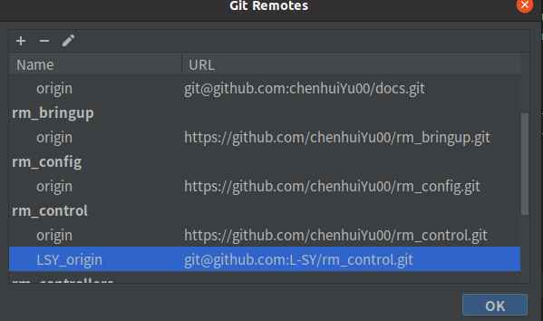
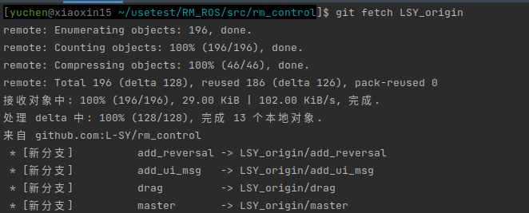
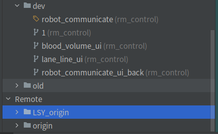

# 远程拉取

```bash
#代码串
git init              #新建仓库
git add .             #加入文件
git commit

git remote add origin XXXXX.git

git branch -al        #查看本地，远程的分支
git branch xx         #新建分支
git checkout xx       #进入分支

git push --set-upstream origin master #上传新分支
git pull              #有新东西在远程时先拉取

git checkout  [ 被删除的文件或文件夹 ]，我这里输入git checkout monkey_test_py2.x/.idea，这个命令是将暂存区文件拉回本地

```


与远程仓库建立连接

git remote add origin XXXXX.git


git fatal: 拒绝合并无关的历史的错误解决

> git pull origin dev可以把gitLab上dev分支上的内容都拉取到本地了
>
> 本地初始化的项目 与 github 版本不一致, 导致无法提交
>
> $ git pull origin master
>
>  * branch            master     -> FETCH_HEAD
>    fatal: 拒绝合并无关的历史
>    解决方法
>
> 在pull 时候, 添加–allow-unrelated-histories参数 即可.
>
> ``` c++ 
> $ git pull origin master --allow-unrelated-histories                
> ```
>
>  * branch            master     -> FETCH_HEAD

查看本地和远程的所有分支。

git branch -al 


将远程分支与本地分支进行关联

git pull origin master


先要git commit一次以创建master分支


如果您想要为此分支创建跟踪信息，您可以执行：

    git branch --set-upstream-to=origin/<分支> master


拉取

git pull


## 分支

分支常用命令
1、 查看已有分支：

git branch –a


2、创建、切换分支

创建并切换分支：git checkout -b <分支名称>

这条命令和下面两条命令效果相同。
创建分支：git branch <分支名称>
切换分支：git checkout <分支名称>


3、合并分支

git checkout master先切换到master分支

git merge fenzhi再将B分支的代码合并到master（在merge合并分支的时候，代码会有冲突，需要自己去解决这些冲突）


4、删除与恢复分支

当分支已经合并到主分支，并且不再需要接着该分支继续开发（后期也可以从主分支分出来），可以删除该分支。
(1)删除本地分支
git branch -d <分支名称>


(2)删除远程分支
git push origin --delete <分支名称>


误删分支需要恢复
使用git log 查出分支的提交号。

git branch <分支名称> <提交号>，

即创建提交号历史版本的一个分支，分支名称随意


5、查看分支图

git log --graph

为了使分支图更加简明，可以加上一些参数。

git log --graph --pretty=oneline --abbrev-commit


6、重命名分支

git branch –m 当前分支名 新的分支名


### 上传分支

如果要上传一个分支到仓库 origin 那么就需要使用下面的命令

  git push origin 分支


我存在下面几个分支

 t/lindexi/Avalonial_Grid_Arrange
 t/lindexi/Avalonial_Grid_Infinity


我在上传的时候需要写很多代码，至少很难用 tab 出我现在的分支

我在网上找到一个方法，用来上传当前的分支

  git push origin HEAD


**默认上传分支**

 git config --global push.default current


设置默认使用git push就是上传当前分支

可以设置 push.default 的值为

    nothing 不上传任何分支
    matching 上传所有分支
    upstream/tracking 上传当前跟踪分支
    current 上传当前分支
————————————————

## 克隆

```
git clone http://x.com/mytest.git
/*
结果：
会在当前文件夹下生成 mytest 默认文件夹
完整路径 d:\mygit\mytest\...(文件)
*/
```

 

### clone到指定文件夹

注意：请确保指定的的文件夹下没有其它文件，否则会提示错误信息。

```
git clone http://x.com/mytest.git "./"
/*
结果：
会直接将远程文件克隆在当前文件夹下
完整路径 d:\mygit\...(文件)
*/
```

 

```
git clone http://x.com/mytest.git "d:\mygit2"
/*
结果：
会直接将远程文件克隆在指定文件夹下
完整路径 d:\mygit2\...(文件)
*/
```

 

### clone指定分支

```
git clone -b branch_name http://x.com/mytest.git
/*
结果：
会在当前文件夹下生成 mytest 默认文件夹
完整路径 d:\mygit\mytest\...(文件)
*/
```


## 拉取别人的分支

> 我们希望拉取别人的rm_control的分支到clion上

首先在clion的远程配置里加入别人的仓库地址



之后在命令行执行

```c
git fetch LSY_origin
```



现在在分支里就可以看到了




**纯命令行执行**

```c
1.查看分支状况 git remote -v

2. remote其他人的项目 git remote add origin_name https://github.com/other/apis.git

3.再次查看分支状况 git remote -v

4.fetch 分支 git fetch upstream

5.checkout一下  git checkout master

6.merge到主分支 git merge upstream/master

总结：因为是主分支 当下一次在拉取别人的项目只需要操作 1 4  6
```


## 撤销

> 除了简单的本地撤销，如果我们想撤销已经push的commit

### 命令行方式

```c
//撤销提交信息，先查看要回退的版本号
  git log 
      
//再执行本地回退
  git reset --soft/hard  版本号
      
//强制push到远程
  git push origin master --force
```

