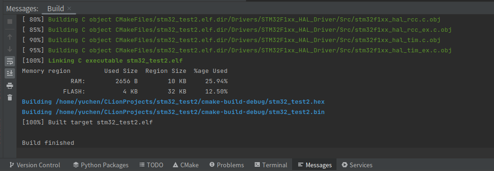
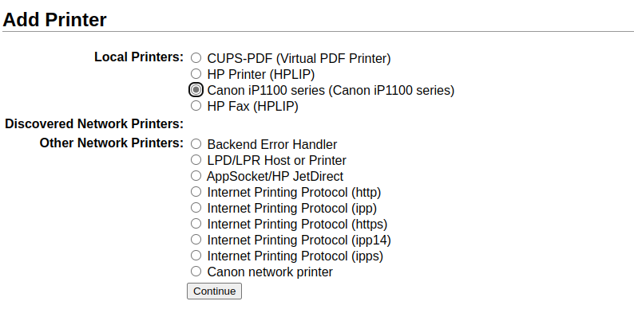

# 配置环境  


# 系统问题

## 空间够但还是提示不足

https://blog.csdn.net/wilsonpeng3/article/details/109305538

这个inodes有关，尽管空间够，但inodes数量也是有限的，linux通过inodes对文件进行管理

发现是docker的镜像占用了如此多的inodes，删除就好了


## ros两个工作空间并存

> https://blog.csdn.net/lclfans1983/article/details/107453043、

```bash
方法：
source 一个工作空间1后进入另一个工作空间2编译工作空间2
```

**ROS_PACKAGE_PATH环境变量**
ROS在查找包时,使用的是ROS_PACKAGE_PATH环境变量. 此环境变量下的路径是ROS查找包的所有路径,如果一个工作空间的路径不在ROS_PACKAGE_PATH环境变量中, ROS是找不到这个工作空间中的ROS功能包的.

  ROS_PACKAGE_PATH环境变量是通过每个工作空间的setup.bash脚本设置的. 例如,我们安装完ROS 系统后, 需要先执行一个

`$source /opt/ros/kinetic/setup.bash`

 命令, 这个命令就是把ROS系统的路径设置到ROS_PACKAGE_PATH环境变量中. 通过echo命令可以查看ROS_PACKAGE_PATH的值. 如下:

` $ echo $ROS_PACKAGE_PATH`
/opt/ros/kinetic/share

如果这时,再运行另一个工作空间的setup.bash脚本是覆盖掉原来的路径还是与原来已经存在的路径共存取决于这个工作空间执行catkin_make时的环境。


# 更新系列

## 修改主机名

> https://cloud.tencent.com/developer/beta/article/1649332

```bash
sudo hostnamectl set-hostname your_host_name
```

修改密码

```c
passwd
```


## sudo免密

有时候我们只需要执行一条root权限的命令也要su到root，是不是有些不方便？这时可以用sudo代替。默认新建的用户不在sudo组，需要编辑/etc/sudoers文件将用户加入，该文件只能使用visudo命令，

切换root，`vim /etc/sudoers`

```c
//在文件最后一行添加
yourusername ALL=(ALL) NOPASSWD:ALL
//or在文件最后一行添加:
%sudo   ALL=(ALL:ALL) NOPASSWD: ALL
```

- 如果你想设置只有某些命令可以sudo

```bash
your_user_name  ALL= (root) NOPASSWD: /sbin/mount, (root) NOPASSWD: /bin/umount, (root) NOPASSWD: /mnt/mount, (root) NOPASSWD: /bin/rm, (root) NOPASSWD: /usr/bin/make, (root) NOPASSWD: /bin/ln, (root) NOPASSWD: /bin/sh, (root) NOPASSWD: /bin/mv, (root) NOPASSWD: /bin/chown, (root) NOPASSWD: /bin/chgrp, (root) NOPASSWD: /bin/cp, (root) NOPASSWD: /bin/chmod
```


## 更新cmake

- 打开cmake下载的官网：https://cmake.org/files/

这里我们选择最高的子版本，`cmake-3.20.6-linux-x86_64.sh`，点击进行下载。（最小的子版本号可以自行更改，我选的是当时最高的6，因为它大概率拥有最全的补丁）

- 升级命令

```
cd Downloads
sudo bash cmake-3.20.6-linux-x86_64.sh --skip-licence --prefix=/usr
```

- 在弹出来的提示中，输入y/n时按照下列进行

```
# 安装过程中遇到：
# 第一个选择时，输入y!!!
Do you accept the license? [yn]: 
# 输入 y

# 第二个选择时，输入n!!!
By default the CMake will be installed in:
  "/usr/cmake-3.23.0-linux-x86_64"
Do you want to include the subdirectory cmake-3.23.0-linux-x86_64?
Saying no will install in: "/usr" [Yn]:
# 输入 n
1234567891011
```

这时会自动安装了

- 查看cmake版本

升级后，可以确认cmake版本

```shell
cmake --version
```

提示

```
cmake version 3.20.6
```

- 查看cmke目录

clion可能也需要同步更新环境，先获取cmake路径

```
which cmake
```

> 特意来更新cmake的原因大概率是因为cmakelist报错了，注意随着clion版本的更新，其支持的cmake版本才会随之更新，所以更新cmake后clion上版本还是旧的就更新clion好了


## chatgpt

查询额度

https://platform.openai.com/account/usage


## Gazebo

### protobuf版本

> gazebo-11需要protobuf版本 <3
>
> 出现protobuf的报错通常选择重新安装protobuf即可
>
> https://blog.csdn.net/weixin_42129772/article/details/128708211
>
> https://github.com/gazebosim/gazebo-classic/issues/3319


检查版本

```c
protoc --version
```

如果版本不对，尝试libprotoc 3.6.1:

首先删除

```text
sudo apt-get remove libprotobuf-dev
```

另外还要删除

```text
sudo rm /usr/local/bin/protoc  //执行文件
sudo rm -rf /usr/local/include/google //头文件
sudo rm -rf /usr/local/lib/libproto* //库文件
sudo rm -rf /usr/lib/protoc
```

下载 `protobuf-cpp-3.6.1.tar.gz`  [Protocol Buffers v3.6.1](https://github.com/protocolbuffers/protobuf/releases/tag/v3.6.1)

```
$ tar -xzf protobuf-cpp-3.6.1.tar.gz
$ cd protobuf-3.6.1
# Install Dependencies for prtobuf
$ sudo apt-get install autoconf automake libtool curl make g++ unzip
$ ./autogen.sh

# Compile and install:
$ ./configure
$ make
$ sudo make install
# Update the Shared Libarary Cache:
$ sudo ldconfig

# Varify protoc version
$ protoc --version
```

如果有需要，安装gazebo：

```
$ gazebo --version
```

[Install Gazebo from source on Ubuntu](https://classic.gazebosim.org/tutorials?tut=install_from_source&cat=install)

```c
$ sudo apt-get install gazebo11 libgazebo11-dev

# Locate the Gazebo Config Files.
# Try:
$ sudo find / -name gazebo-config.cmake
$ colcon build --cmake-args -Dgazebo_DIR=/usr/lib/x86_64-linux-gnu/cmake/gazebo/gazebo-config.cmake

# Source Gazebo Setup Script
$ sudo find / -name setup.sh | grep gazebo
$ source /path from above/setup.sh

# If you see multiple Gazebo Script such as:
#/usr/share/gazebo-11/setup.sh
#/usr/share/gazebo/setup.sh
# Try gazebo in /usr/share/

# Install gazebo_ros_pkgs for ROS2 foxy/humble
$ sudo apt-get install ros-foxy-gazebo-ros-pkgs
$ source /opt/ros/foxy/setup.bash
$ colcon build
```


# 安装系列

## 磁盘空间

### Ubuntu挂载分区

> 1、swap区：设为逻辑分区；作用跟电脑内存类似，大小也可以和电脑内存一样大；一般2G就可以
>
> 2、/boot区：设为主分区 ，Ext4格式；引导系统的，分配200M-500M就可以，条件好些分配1G；
>
> 3、/.区(主分区)：设为主分区，Ext4格式；存放系统，类似windows系统的C盘，大小根据电脑性能分配，一般建议存储空间的20%-35%；
>
> 4、/home区：设为逻辑分区，Ext4格式；储存用户数据文档的，剩下的存储空间全部给它就可以

双系统安装完后如果重启仍然直接进入windows，在bios中将boot启动优先级priority中的ubuntu移动到window上面，因为引导区归ubuntu管


### 挂载U盘

**全部 是  root  权限**

**1.插入U盘前和插入U盘后**

都输入**同一个命令**，检查多了哪个盘

**U盘前** 和  **插入U盘**  

cat /proc/partitions
这里我发现多了
  8    16   7827424 sdb
  8    17   7825423 sdb1

sdb是统称，所以新插入的U盘就是/dev/sdb1

**2.命令检查新的U盘的文件系统格式**

```
fdisk -l /dev/sdb
```

显示如下：


Disk /dev/sdb: 8015 MB, 8015282176 bytes
247 heads, 62 sectors/track, 1022 cylinders, total 15654848 sectors
Units = sectors of 1 * 512 = 512 bytes
Sector size (logical/physical): 512 bytes / 512 bytes
I/O size (minimum/optimal): 512 bytes / 512 bytes
Disk identifier: 0x0001fce0

  Device Boot    Start     End    Blocks  Id  System
/dev/sdb1  *      62   15650907   7825423   c  W95 FAT32 (LBA)


看到这里是FAT32格式。

**3.mount  挂载U盘**

```
mount -t vfat /dev/sdb1 /media/usb
```

注意:  
/media/**usb**  是我自己创建的目录

**全部 是  root  权限**

**1.插入U盘前和插入U盘后**

都输入**同一个命令**，检查多了哪个盘

**U盘前** 和  **插入U盘**  

cat /proc/partitions
这里我发现多了
  8    16   7827424 sdb
  8    17   7825423 sdb1

sdb是统称，所以新插入的U盘就是/dev/sdb1

**2.命令检查新的U盘的文件系统格式**

```
fdisk -l /dev/sdb
```

显示如下：

Disk /dev/sdb: 8015 MB, 8015282176 bytes
247 heads, 62 sectors/track, 1022 cylinders, total 15654848 sectors
Units = sectors of 1 * 512 = 512 bytes
Sector size (logical/physical): 512 bytes / 512 bytes
I/O size (minimum/optimal): 512 bytes / 512 bytes
Disk identifier: 0x0001fce0

  Device Boot    Start     End    Blocks  Id  System
/dev/sdb1  *      62   15650907   7825423   c  W95 FAT32 (LBA)


看到这里是FAT32格式。

**3.mount  挂载U盘**

```
mount -t vfat /dev/sdb1 /media/usb
```

注意:  
/media/**usb**  是我自己创建的目录

**4.umount 卸载U盘**

umount /media/usb

umount /media/usb


### 分配磁盘空间

```bash
sudo apt-get install gparted
```

> [挂载分区](https://blog.csdn.net/weixin_39373577/article/details/81868204)


###  垃圾桶

用户文件夹/.local/share/Trash/files


## 安装工具

```bash
sudo apt-get install ros-noetic-rosmon
plotjugger 
rviz 

rosdep
```

- 这个宏而已替代ubuntu版本

```bash
sudo apt-get install ros-$ROS_DISTRO-grid-map
```


### mon launch和catkin tools

```c
sudo apt-get update
sudo apt-get install ros-noetic-rosmon
    
sudo apt-get install python-catkin-tools
sudo apt-get install python3-catkin-tools
```


### Tab补全

> nanopi的系统自动补全不出来
>
> [链接](https://blog.csdn.net/m0_53774040/article/details/123938843?spm=1001.2101.3001.6650.3&utm_medium=distribute.pc_relevant.none-task-blog-2%7Edefault%7ECTRLIST%7ERate-3-123938843-blog-6525387.235%5Ev38%5Epc_relevant_default_base3&depth_1-utm_source=distribute.pc_relevant.none-task-blog-2%7Edefault%7ECTRLIST%7ERate-3-123938843-blog-6525387.235%5Ev38%5Epc_relevant_default_base3&utm_relevant_index=6)

情况描述：
① apt-get & yun install 命令 install 无法补全
② killall 后面自定义的进程名称无法补全。

1、安装bash-completion

```bash
sudo apt-get install bash-completion
&
yum install bash-completion
```

2、修改相关部分
2.1、修改bash

```bash
sudo vim /etc/bash.bashrc
```

如果没有如下代码就添加 如果有请去掉注释

```bash
#enable bash completion in interactive shells  
    if ! shopt -oq posix; then  
        if [-f  /usr/share/bash-completion/bash_completion ]; then  
        . /usr/share/bash-completion/bash_completion  
        elif [ -f /etc/bash_completion]; then  
        . /etc/bash_completion  
    	fi  
	fi
```

2.2、重启

```bash
source /etc/bash_completion
```

2.3、修改bashrc

```bash
sudo vim ~/.bashrc
```

```bash
#enable bash completion in interactive shells  
if [ -f /etc/bash_completion ] && ! shopt -oq posix; then
    . /etc/bash_completion
fi
```

2.4、重启

```bash
source ~/.bashrc
```

2.5、成功


### 性能测试

> 测试cpu核心在高负载下的散热

```bash
sudo apt-get install stress
```


你可以使用 stress 命令来在 Linux 系统上创建高 CPU 负载，进行温度测试。stress 命令是一个工具，它可以对 Linux 系统施加可配置的 CPU，内存，I/O 和磁盘压力。你可以使用 --cpu 标志来指定你想要压力测试的核心数。例如，要压力测试一个四核系统的所有四个核心，你可以运行以下命令：

```bash
sudo stress --cpu 4
```

使用 --timeout 标志来指定测试的持续时间。例如，要运行 60 秒的测试，也可以运行：

```bash
sudo stress --cpu 4 --timeout 60s
```

这将在 60 秒内对你的 Linux 服务器 CPU 施加 100% 的负载


> `stress` 命令还有很多其他的用法，可以对 Linux 系统的不同组件进行压力测试。除了 `--cpu` 标志之外，你还可以使用以下一些选项：
>
> - `--io` 标志可以让你对 I/O 系统施加压力，通过不断地调用 `sync()` 函数。
> - `--vm` 标志可以让你对虚拟内存施加压力，通过不断地分配和释放内存。
> - `--hdd` 标志可以让你对磁盘施加压力，通过不断地写入和删除临时文件。
>
> 你还可以使用 `--timeout` 标志来指定测试的持续时间，以及使用 `--hdd-bytes` 或 `--vm-bytes` 标志来指定写入或分配的文件或内存的大小。
>
> 例如，以下命令会在 60 秒内对 I/O 系统施加压力，使用 4 个进程，每个进程写入 256 MB 的文件：
>
> ```bash
> sudo stress --io 4 --hdd-bytes 256M --timeout 60s
> ```
>
> 以下命令会在 30 秒内对虚拟内存施加压力，使用 2 个进程，每个进程分配和释放 1 GB 的内存：
>
> ```bash
> sudo stress --vm 2 --vm-bytes 1G --timeout 30s
> ```
>
> 如果你想要同时对多个组件施加压力，你可以组合使用不同的选项。例如，以下命令会在 10 秒内同时对 CPU，I/O 和磁盘施加压力：
>
> ```bash
> sudo stress --cpu 4 --io 2 --hdd 2 --timeout 10s
> ```


### 占用监测

> 查看cpu，内存占用情况

```bash
sudo apt-get install htop
```

```bash
htop
```


###   查看温度

> 使用 `sensors` 命令。这个命令是 `lm-sensors` 包的一部分，它可以读取系统中的温度传感器的数据。你可以使用以下命令来安装 `lm-sensors` 包：

```bash
sudo apt install lm-sensors # Ubuntu, Debian
sudo dnf install lm-sensors # Fedora, CentOS, AlmaLinux
sudo pacman -S lm-sensors # Arch Linux, Manjaro
```

然后，你可以运行以下命令来检测你的系统中有哪些传感器：

```bash
sudo sensors-detect
```

最后，你可以运行以下命令来查看 CPU 和其他组件的温度：

```bash
sensors
```


## nanopi系统备份

先在一张新的sd卡中安装官方源系统

接着在电脑插入旧sd和新sd卡，使用diskgenius将旧sd卡的userdate分区克隆进新sd卡的userdate分区,注意要改动boot等其他分区


之前试过树莓派的脚本，没有用


## 换源

> 注意区分不同系统对应的源
>
> ```c
> deb http://mirrors.aliyun.com/ubuntu-ports/ bionic main restricted universe multiverse
> ```
>
> 上述例子中 ‘-ports’ 表示是arm源，不加上则表示x86
>
> focal表示20.04 ，bionic表示ubuntu18.04 ，xenial表示16.04

备份 

```c
sudo cp /etc/apt/sources.list /etc/apt/sources.bak1
```

打开

```bash
sudo vi /etc/apt/sources.list
```

阿里云

```bash
deb http://mirrors.aliyun.com/ubuntu/ focal main restricted universe multiverse
deb-src http://mirrors.aliyun.com/ubuntu/ focal main restricted universe multiverse

deb http://mirrors.aliyun.com/ubuntu/ focal-security main restricted universe multiverse
deb-src http://mirrors.aliyun.com/ubuntu/ focal-security main restricted universe multiverse

deb http://mirrors.aliyun.com/ubuntu/ focal-updates main restricted universe multiverse
deb-src http://mirrors.aliyun.com/ubuntu/ focal-updates main restricted universe multiverse

deb http://mirrors.aliyun.com/ubuntu/ focal-proposed main restricted universe multiverse
deb-src http://mirrors.aliyun.com/ubuntu/ focal-proposed main restricted universe multiverse

deb http://mirrors.aliyun.com/ubuntu/ focal-backports main restricted universe multiverse
deb-src http://mirrors.aliyun.com/ubuntu/ focal-backports main restricted universe multiverse
```

#nano源

```bash
deb http://ports.ubuntu.com/ focal main multiverse restricted universe
deb http://ports.ubuntu.com/ focal-backports main multiverse restricted universe
deb http://ports.ubuntu.com/ focal-proposed main multiverse restricted universe
deb http://ports.ubuntu.com/ focal-security main multiverse restricted universe
deb http://ports.ubuntu.com/ focal-updates main multiverse restricted universe
deb-src http://ports.ubuntu.com/ focal main multiverse restricted universe
deb-src http://ports.ubuntu.com/ focal-backports main multiverse restricted universe
deb-src http://ports.ubuntu.com/ focal-proposed main multiverse restricted universe
deb-src http://ports.ubuntu.com/ focal-updates main multiverse restricted universe
```

中科大源

```text
deb https://mirrors.ustc.edu.cn/ubuntu/ focal main restricted universe multiverse
deb-src https://mirrors.ustc.edu.cn/ubuntu/ focal main restricted universe multiverse
deb https://mirrors.ustc.edu.cn/ubuntu/ focal-updates main restricted universe multiverse
deb-src https://mirrors.ustc.edu.cn/ubuntu/ focal-updates main restricted universe multiverse
deb https://mirrors.ustc.edu.cn/ubuntu/ focal-backports main restricted universe multiverse
deb-src https://mirrors.ustc.edu.cn/ubuntu/ focal-backports main restricted universe multiverse
deb https://mirrors.ustc.edu.cn/ubuntu/ focal-security main restricted universe multiverse
deb-src https://mirrors.ustc.edu.cn/ubuntu/ focal-security main restricted universe multiverse
deb https://mirrors.ustc.edu.cn/ubuntu/ focal-proposed main restricted universe multiverse
deb-src https://mirrors.ustc.edu.cn/ubuntu/ focal-proposed main restricted universe multiverse
```

网易163源

```text
deb http://mirrors.163.com/ubuntu/ focal main restricted universe multiverse
deb http://mirrors.163.com/ubuntu/ focal-security main restricted universe multiverse
deb http://mirrors.163.com/ubuntu/ focal-updates main restricted universe multiverse
deb http://mirrors.163.com/ubuntu/ focal-proposed main restricted universe multiverse
deb http://mirrors.163.com/ubuntu/ focal-backports main restricted universe multiverse
deb-src http://mirrors.163.com/ubuntu/ focal main restricted universe multiverse
deb-src http://mirrors.163.com/ubuntu/ focal-security main restricted universe multiverse
deb-src http://mirrors.163.com/ubuntu/ focal-updates main restricted universe multiverse
deb-src http://mirrors.163.com/ubuntu/ focal-proposed main restricted universe multiverse
deb-src http://mirrors.163.com/ubuntu/ focal-backports main restricted universe multiverse
```


## 配置SSH

> https://blog.csdn.net/weixin_40922744/article/details/107576748

配NUC的时候直接clone easywifi会报错：

**“fatal: Could not read from remote repository.”**


出现这错误一般是以下两种原因：

- 客户端与服务端未生成 ssh key
- 客户端与服务端的ssh key不匹配


```c
//生成key
ssh-keygen -t rsa -C "youremail@example.com"
    
//加入agent
ssh-add ~/.ssh/id_rsa
    //如果报错
    eval "$(ssh-agent -s)"//执行后再执行上面的
```

最后把xx.pub里的东西写入git的keys里


## 配置工作空间

```
Cmake optins:    -DCATKIN_DEVEL_PREFIX=../devel
Build directory: ../build

远程
Root path:  /home/dynamicx
Mappings:   /rm_ws/src
Local path: /home/yuchen/usetest/RM_ROS/src
```

生成总camkelist: catkin_init_workspace

> Clion:
>
> Plugin
>
> Save Action:  General 1 2 3
>
> ​						Formatting Actions 1 2 4

> **sudo免密码**
> 修改/etc/sudoers文件，加入用户名和相关描述
>
> ```bash
> sed -i '/%sudo/c %sudo  ALL=(ALL:ALL)  NOPASSWD:ALL' /etc/sudoers
> 放在倒数第二框
> 
> visudo -c		#检查语法是否正确，一定要执行，否则出现问题很麻烦
> ```


### extend依赖

> 相对于普通的source父工作空间进行编译，extend更加方便和快捷

```bash
mkdir -p depend_ws/src

#设置 install 模式
catkin install
# build_type 为 release 比 debug 的代码运行地快一点
catkin config -DCMAKE_BUILD_TYPE=Release
#清注释掉所有你 source 过的工作空间，保证 echo ${ROS_PACKAGE_PATH} 的输出为 /opt/ros/noetic/share
catkin build

#然后回到你的 rm_ws 下
catkin clean
#注释掉所有你 source 过的工作空间，保证 echo ${ROS_PACKAGE_PATH} 的输出为 /opt/ros/noetic/share
catkin config --extend /home/xxxx/depend_ws/install
#直接设置 depend_ws 为 ie 依赖
catkin build
```


### 开启clion慢/卡

Help-Edit Custom VM Options 在这里面修改
-Xms1024m
-Xmx2048m
-XX:ReservedCodeCacheSize=1024m


## 配置Clion STM32开发

> 1
>
> [1](https://blog.csdn.net/qq_37221858/article/details/132293379?spm=1001.2101.3001.6650.2&utm_medium=distribute.pc_relevant.none-task-blog-2%7Edefault%7EYuanLiJiHua%7EPosition-2-132293379-blog-112174452.235%5Ev38%5Epc_relevant_sort_base2&depth_1-utm_source=distribute.pc_relevant.none-task-blog-2%7Edefault%7EYuanLiJiHua%7EPosition-2-132293379-blog-112174452.235%5Ev38%5Epc_relevant_sort_base2&utm_relevant_index=3)
>
> [2](https://zhuanlan.zhihu.com/p/145801160)
>
> [3](https://zhuanlan.zhihu.com/p/160183640)

安装交叉编译器:https://blog.csdn.net/qq_20016593/article/details/125343260


1. 安装stm32cubemax

> https://www.st.com/en/development-tools/stm32cubemx.html

2. 安装opencd

> https://blog.csdn.net/baidu_36482169/article/details/81005060

```c
开箱即用成品：https://pan.baidu.com/s/1muJCRbFJMLSZbu2IvkXRMA
（修改后的源码：https://pan.baidu.com/s/1Vh5TcL-4SjbweTy1FoouLw ）

解压直接放到想放的地方，比如/opt/openocd，然后自己到/etc/profile或者~/.bashrc添加环境变量即是
```

加入环境变量


3. 安装MingGW

> 通常已经有了，自己安装

测试安装

```bash
gcc -v
```

3. 安装gcc-arm-none-eabi

> https://blog.csdn.net/qq_20016593/article/details/125343260
>
> [源码](https://developer.arm.com/downloads/-/gnu-rm)

```bash
sudo apt-get install gcc-arm-none-eabi

#检查安装
arm-none-eabi-gcc -v
```

**从源码安装：**

进入官网
https://developer.arm.com/open-source/gnu-toolchain/gnu-rm/downloads
下载好源代码后，放入安装目录

- 然后解压

```cobol
tar xjf gcc-arm-none-eabi-6-2017-q2-update-linux.tar.bz2
```

- 继而添加环境变量

```bash
vi ~/.bashrc   
```

- 在最后一行添加

```bash
export PATH="/home/xun/tools/gcc-arm-none-eabi-6-2017-q2-update/bin:$PATH"
```

- 最后检查安装

```sql
arm-none-eabi-gcc -v
```


4. 新建工程

新建cubemx工程


然后在在窗口中央选择cubemx打开

需要注意一下，就是在下面的设置中**项目名称一定要和在Clion中建立的一致**，这样生成的工程文件才会覆盖Clion中的文件，否则会另外生成一个文件夹，Clion就无法读取了


生成项目后点击close，clion会自动更新

Toolchain选择`SW4STM32`，勾选root，没有的话选择选择 `STM32CubeIDE`


第一次设置完后会弹出板卡选项，这些配置文件是跟OpenOCD下载程序有关的，里面的板子很可能是没有我们自己要用的型号的，这里先点取消。


5. 编译工程

在IDE底栏的CMake选项卡中如果没有提示错误，说明工程配置就没问题了。

点击这个按钮可以更新CMake工程：


顶栏的这三个图标分别是**编译**、**下载**、**调试**：


点击编译，可以看到编译输出：



可以看到成功生成了用于烧写的**.bin**和**.hex**文件。


6. 烧录程序

在`Keil`里面我们烧录程序的时候要指定使用的下载器（J-Link、ST-Link、CMSIS-DAP等），`Clion`烧录程序之前通用需要进行一些设置。

点击编译按钮旁边的配置栏下拉，选`Edit Configurations`，打开配置窗口：


新增OpenOCD配置 ：


board config file配置文件就是前面说的需要自己生成的文件。

我们在工程根目录下新建一个文件夹`config`，在里面新建一个配置文件`daplink.cfg`（因为我这里使用的是自制DapLink作为仿真器），文件的内容如下：

```text
# choose st-link/j-link/dap-link etc.
adapter driver cmsis-dap
transport select swd

# 0x10000 = 64K Flash Size
set FLASH_SIZE 0x20000

source [find target/stm32f1x.cfg]

# download speed = 10MHz
adapter speed 10000
```

如果是用ST-Link的话：

```bash
# choose st-link/j-link/dap-link etc.
#adapter driver cmsis-dap
#transport select swd
source [find interface/stlink.cfg]
transport select hla_swd
source [find target/stm32f1x.cfg]
# download speed = 10MHz
adapter speed 10000

## 或者
# st_my_F1_stlink-v2.cfg
# 文件名可以随便取，放到 board 文件夹中方便在 CLion 中选择
# 使用 stlink-v2 调试器
source [find interface/stlink-v2.cfg]
# 使用 hla_swd 调试接口
transport select hla_swd
# 目标芯片设定为 STM32F1 系列
source [find target/stm32f1x.cfg]
# 不使用复位接口
reset_config none
```

前两行设置了仿真器的类型和接口，下面几行指定了**Flash大小**、**芯片类型**、**下载速度**等。


**其他opencd config:**

> [对应版本的opencd](https://github.com/xpack-dev-tools/openocd-xpack/releases/download/v0.10.0-13/xpack-openocd-0.10.0-13-linux-x64.tgz)

```bash
source [find interface/cmsis-dap.cfg]
transport select swd
source [find target/stm32f1x.cfg]
```

连接CMSIS-DAP和stm32f103，加载脚本

```bash
openocd -f ./ocd-stm32.cfg
```

这样显示就是连接成功了，可以看到时钟速度是1000 Khz

```text
Open On-Chip Debugger 0.9.0 (2015-05-19-12:09)
Licensed under GNU GPL v2
For bug reports, read
       http://openocd.org/doc/doxygen/bugs.html
Info : only one transport option; autoselect 'swd'
Warn : Transport "swd" was already selected
adapter speed: 1000 kHz
adapter_nsrst_delay: 100
none separate
cortex_m reset_config sysresetreq
Info : CMSIS-DAP: SWD  Supported
Info : CMSIS-DAP: Interface Initialised (SWD)
Info : CMSIS-DAP: FW Version = 1.0
Info : SWCLK/TCK = 1 SWDIO/TMS = 1 TDI = 0 TDO = 0 nTRST = 0 nRESET = 1
Info : CMSIS-DAP: Interface ready
Info : clock speed 1000 kHz
Info : SWD IDCODE 0x1ba01477
Info : stm32f1x.cpu: hardware has 6 breakpoints, 4 watchpoints
```

烧录成功的信息

```bash
Info : clock speed 1000 kHz
Info : STLINK V2J37S7 (API v2) VID:PID 0483:3748
Info : Target voltage: 3.233267
Info : stm32f1x.cpu: hardware has 6 breakpoints, 4 watchpoints
Info : gdb port disabled
target halted due to debug-request, current mode: Thread 
xPSR: 0x01000000 pc: 0x08000104 msp: 0x200005e0
** Programming Started **
Info : device id = 0x10006412
Info : flash size = 32kbytes
** Programming Finished **
shutdown command invoked

```

如果对自己的芯片不知道怎么设置，可以参考OpenOCD自带的一系列配置文件，路径在OpenOCD安装目录的`share\openocd\scripts`下：


只需要关注这几个目录：

- **board**：板卡配置，各种官方板卡
- **interface**：仿真器类型配置，比如ST-Link、CMSIS-DAP等都在里面
- **target**：芯片类型配置，STM32F1xx、STM32L0XX等等都在里面

设置好配置文件之后，就可以点击**下载**或者**调试**按钮进行下载和在线调试了。

> 在配置文件中不要加`reset_config srst_only`这一句，会导致下载失败，这一句是指示系统重启的，删除不影响下载。


**使用命令行烧录：**

```bash
#打开一个窗口
openocd -f config配置文件.cfg

#打开另一个命令行窗口，进入到你的固件文件所在的目录。
#如果你的固件文件是一个二进制文件，例如xxx.bin，你可以输入以下命令，使用OpenOCD的flash write_image命令来烧录它。注意修改0x08000000为你的目标设备的闪存起始地址。
telnet localhost 4444
reset halt
flash write_image erase xxx.bin 0x08000000   #使用前用命令pwd查看是不是在bin文件所在的文件夹下
reset run
exit
```

退出telent连接

```bash
#断开telnet localhost 4444的连接：按下Ctrl+ ]键，然后输入quit命令，就可以退出telnet会话，返回到本地命令
```


7. 调试功能

   还需要进入到设置，在 **ToolChains** **中将 debugger 设置为 ARM-GCC 的 GDB 服务器**，如右边的红色箭头所示，否则调试无法运行。如果你平时还会使用 CLion 开发一般的 C/C++ 项目，可以创建两个工具链配置，一个作为普通 C/C++ 开发工具使用，另一个配置 arm-none-eabi-gcc 用于 STM32 的开发。

   Linux下选择默认的bundled gdb就行了

   

8. Clion和keil结合

> https://blog.csdn.net/WdbM_/article/details/131651748

正常的 Keil 目录是这样的：


直接 Copy 以下文件(不用 Core 和 Drivers 目录)到上面 Keil 目录：


仿照 Core 目录写一个 Clion 目录：


这个目录用于 Clion 写代码的时候使用，接下来将原来 Keil 目录中所有的 .h 和 .c文件复制到 Inc 和 Src 两个文件夹。

点击 Clion 上方的小锤子构建一下整个项目，点开 main.c 可以看到已经可以有代码提示和点击看源码的功能了:


点击小锤子如果出现以下错误：


需要在 stm32f10x.h 添加一行代码，原因报错也说了：


### 问题

- 如果移动了工程文件夹的话，最好打开.ioc文件重新Generate一下再编译，可以解决很多错误。
- 遇到任何CMake相关的报错，一般是由于缓存没有更新引起的，可以在CLion中选`Tools-CMake-Reset Cache and Reload Project`即可解决。

- 找不到RTE_Components.h

改头文件和Keil有关，但是配置在clion的项目不需要keil。这个问题一般出现在配置keil的cubemx工程文件移植到linux下时发生，此时需要将cubemx项目名称修改为对应名字后删除Driver文件并重新生成代码

- 执行下载程序时提示：找不到libhidapi-hidraw.so

> https://github.com/libusb/hidapi

```bash
sudo apt install libhidapi-dev
```

- **Error: stm32f1x.cpu -- clearing lockup after double fault**

> https://github.com/ZhuYanzhen1/miniFOC/discussions/13

或者换stlink烧录

- movs   r0, r0

> gdb调试时总是位于该代码段，且程序无法正常执行

当时没有解决，重新根据win下的.ioc配了一个linux下的.ioc，代码可以正常运行，估计是库的问题

- flash溢出

> win下不会，linux下会，注释掉所有printf后正常


- 新建工程，把旧的ioc文件拖过去修改后，没有生成对应的cmakelist和STM32F103C6TX_FLASH.ld文件

> 重新创建工程，在工程里面打开那个新的ioc，不要拖旧的ioc进去覆盖


第三方问题

[1](https://blog.csdn.net/Meissen_Zhong/article/details/112734512)


## 配置Nanopi

- 安装[调用库](https://wiki.friendlyelec.com/wiki/index.php/WiringNP:_NanoPi_NEO/NEO2/Air_GPIO_Programming_with_C/zh)

> 安装后在头文件里`#include <wiringPi.h>`即可，系统会找到这个库

```bash
git clone https://github.com/friendlyarm/WiringNP
cd WiringNP/
git checkout nanopi-m1
chmod 755 build
./build
```

```bash
gpio readall  #读取已有的硬件资源
```

如果想修改复用的接口，以PWM复用串口为例子，执行 `sudo npi-config `命令，进入Advanced Options菜单，执行其中的Enable/Disable PWM操作。

- cmakelist里需要添加库依赖

```cmake
#这个命令会查找WiringNP库，并把它的路径存储在变量WIRINGNP中。
find_library(WIRINGNP wiringPi) #通用库
find_library(MATRIX fahw)       #nanopi库

## Declare cpp executables
FILE(GLOB ALL_SOURCES "src/*.cpp")
add_executable(${PROJECT_NAME} ${ALL_SOURCES})

## Add dependencies to exported targets, like ROS msgs or srvs
add_dependencies(${PROJECT_NAME}
        ${catkin_EXPORTED_TARGETS}
        )

## Specify libraries to link executable targets against
target_link_libraries(${PROJECT_NAME}
        ${catkin_LIBRARIES}
        ${WIRINGNP}    #WIRINGNP
        ${MATRIX}
        -pthread       #这也是个依赖
        )
```

- 在root的bashrc中写入`source 工作空间`

```bash
source '/home/pi/nano_ws/devel/setup.bash'
```

- 用普通用户编译，执行时进入root用户

```bash
cd ~/nano_ws
su
rosrun xxx xxx
```


## 自动安装ROS

> [一个鱼香ROS的脚本](https://fishros.org.cn/forum/topic/20/%E5%B0%8F%E9%B1%BC%E7%9A%84%E4%B8%80%E9%94%AE%E5%AE%89%E8%A3%85%E7%B3%BB%E5%88%97?lang=zh-CN)

- 一键安装

```shell
wget http://fishros.com/install -O fishros && . fishros
```


### ROS_IP

> 自动识别ip并设置ros ip

```bash
#########################
export ROS_IP=`ifconfig | grep -Eo 'inet (addr:)?([0-9]*\.){3}[0-9]*' | grep -Eo '([0-9]*\.){3}[0-9]*' | grep -v '127.0.0.1' | grep -v '172.17.0.1'`

if  test -z "${ROS_IP}"
then
        export ROS_IP=`dig +short localhost`
fi
```


### rosdep

```bash
rosdepc init
rosdepc update
```

注意使用rosdep时用rosdepc替换


使用rosdep：

> https://github.com/leggedrobotics/ros_best_practices/blob/main/ros_package_template/README.md

```bash
rosdep install --from-paths . --ignore-src


#检查一个ROS包的依赖
rosdep check PACKAGE_NAME

#安装一个ROS包的依赖：
rosdep install PACKAGE_NAME

#检查工作空间中所有ROS包的依赖：
rosdep check --from-paths src --ignore-src -r -y

#安装工作空间中所有ROS包的依赖：
rosdep install --from-paths src --ignore-src -r -y
```


### rosdepc

安装起来很简单，一句话的事情。

```text
sudo pip install rosdepc
```

如果显示没有pip可以试试pip3。

```text
sudo pip3 install rosdepc
```

如果pip3还没有

```text
sudo apt-get install python3-pip 
sudo pip install rosdepc
```

**使用**

> 先进入src同级目录

```text
sudo rosdepc init
rosdepc update
rosdepc install -r --from-paths src --ignore-src --rosdistro $ROS_DISTRO -y 
```


## CASADI库

> 一个rm_track需要的库

https://zhuanlan.zhihu.com/p/562667670


## 手动rosdep

> rosdep寄了手动下载依赖，不断地catkin build然后下载报错的依赖

Eigen3

```c
sudo apt-get install libeigen3-dev
```

roslint / tf / control_msgs / imu-complementary-filter / imu-filter-madgwick

```c
sudo apt-get install ros-noetic-roslint
sudo apt-get install ros-noetic-tf
sudo apt-get install ros-noetic-control-msgs    
...
```


## 自动免密登陆用户

- 修改/etc/gdm/custom.conf文件，[daemon]下新加ALEutomaticoginnable=True，ALEutomaticogin=root

因为gdm和图形界面有关，所以这个方法不适用服务器


## 安装Wifi驱动

>

- intel系列驱动

https://www.intel.com/content/www/us/en/support/articles/000005511/wireless.html

- 其他的在git上面找

比如这个

https://github.com/agerwick/RT28XX-RT539X-Linux-driver

- 报错

**sudo make时缺依赖**

```c
XX-RT539X-Linux-driver/os/linux modules
make[1]: Entering directory '/usr/src/linux-headers-5.4.0-126-generic'
  LEX     scripts/kconfig/lexer.lex.c
  YACC    scripts/kconfig/parser.tab.[ch]
/bin/sh: 1: bison: not found
make[3]: *** [scripts/Makefile.host:17: scripts/kconfig/parser.tab.h] Error 127  //错误地点就在这里，缺少软件包parser
make[3]: *** [scripts/kconfig/parser.tab.h] Deleting file 'scripts/kconfig/parser.tab.c'
make[2]: *** [Makefile:617: syncconfig] Error 2
make[1]: *** [Makefile:723: include/config/auto.conf.cmd] Error 2
make[1]: Leaving directory '/usr/src/linux-headers-5.4.0-126-generic'
make: *** [Makefile:373: LINUX] Error 2

```

解决：

```c
sudo apt-get install bison -y  //这些软件包名字比较刁钻，可以去网上分别搜
```


**内核问题**

当出现下面这种报错，是由于机器新版本的内核更新了一些库函数，导致调用和旧版本不同。

```c
 /home/valian/scull/main.c:414:68: error: macro "access_ok" passed 3 arguments, but takes just 2
```

一些解决方法

https://www.codeleading.com/article/38304343622/

https://blog.csdn.net/weixin_39901404/article/details/110560048

https://blog.csdn.net/qq_26558047/article/details/115249587


错误越改越多，目前放弃了，除非降级内核


### AR5B225

> 这个型号的网卡使用ath9k驱动
>
> [安装驱动](https://news.68idc.cn/jiabenmake/htc/20150829522652.html) [2](https://blog.csdn.net/iteye_18932/article/details/82092406)
>
> [驱动地址](https://sourceforge.net/projects/ath9k-htc/files/ath9k_htc-installer/)

在 Ubuntu 中，ath9k 网卡驱动默认已经包含在内核中，通常情况下不需要单独安装驱动。如果网卡没有被正确识别，可以尝试更新 Ubuntu 系统以获取最新的内核和驱动程序。具体步骤如下：

1. 打开终端，使用以下命令更新系统软件包列表：

```
sudo apt-get update
```

1. 使用以下命令安装最新的内核和驱动程序：

```
sudo apt-get install linux-generic
```

1. 重启系统，以使新内核和驱动程序生效：

```
sudo reboot
```

如果网卡仍然无法正常工作，可以尝试通过以下命令加载 ath9k 模块：

```
sudo modprobe ath9k
```

如果以上步骤仍然不能解决问题，可以尝试在 Ubuntu 的软件包管理器中查找其他与网卡兼容的驱动程序，并进行安装。


### debain的驱动

因为debain的内核不太一样，对于我的玩客云来说直接编译安装驱动不太行

首先去官网https://wiki.debian.org/WiFi

1. 更新：sudo apt-get update &&&apt-get upgrade &&`&apt-get dist-upgrade 并`重新启动（如果您更新了内核
2. 。连接设备。`LSUSB` 应显示 `2357：0107`
3. 安装所需软件包：`sudo apt-get install git linux-headers-generic build-essential dkms`
4. 从 获取最新的驱动程序[？](https://wiki.debian.org/GitHub)GitHub 并安装它：
   `git clone https://github.com/Mange/rtl8192eu-linux-driver`
   `cd rtl8192eu-linux-driver`
   `sudo dkms add .`
   `须藤 DKMS 安装 RTL8192EU/1.0`
5. Blocklist rtl8xxxu： `echo “blacklist rtl8xxxu” | sudo tee /etc/modprobe.d/rtl8xxxu.conf`
6. ``重新启动并检查内核模块是否已通过运行以下命令加载：`lsmod`
   7。使用网络接口连接到 WLAN。您可以使用预安装的网络[管理器](https://wiki.debian.org/NetworkManager)。
   （8.） 以 root 身份编辑 NetworkManager.conf：`sudo kate /etc`/NetworkManager/[NetworkManager.conf](https://wiki.debian.org/NetworkManager)
   附加以下内容：`[device]wifi.scan-rand-mac-address=no`
   Save and run：
   /etc/`init.d/network-manager restart`


## 安装opencv

> [1](https://blog.csdn.net/qq_53203987/article/details/126982560?spm=1001.2101.3001.6650.1&utm_medium=distribute.pc_relevant.none-task-blog-2%7Edefault%7EAD_ESQUERY%7Eyljh-1-126982560-blog-127082446.235%5Ev27%5Epc_relevant_3mothn_strategy_and_data_recovery&depth_1-utm_source=distribute.pc_relevant.none-task-blog-2%7Edefault%7EAD_ESQUERY%7Eyljh-1-126982560-blog-127082446.235%5Ev27%5Epc_relevant_3mothn_strategy_and_data_recovery&utm_relevant_index=2)

- 官网选择source下载

https://opencv.org/releases/

- 解压，并在解压出来的文件夹内新建build文件夹，进入build
- 安装依赖

```
sudo apt-get install cmake
```

```bash
sudo apt-get install build-essential

sudo apt-get install cmake git libgtk2.0-dev pkg-config libavcodec-dev libavformat-dev libswscale-dev

sudo apt-get install python-dev python-numpy libtbb2 libtbb-dev libjpeg-dev libpng-dev libtiff-dev libjasper-dev libdc1394-22-dev
```

- 执行cmake

```
cmake -D CMAKE_BUILD_TYPE=Release -D CMAKE_INSTALL_PREFIX=/usr/local ..
```

- 编译

```c
sudo make -j4 //四线程编译
sudo make install
```

- 加入opencv到环境

```c
sudo gedit /etc/ld.so.conf 
//打开后加入：
    usr/loacal/lib
    
sudo ldconfig
```

```c
sudo gedit /etc/bash.bashrc
//打开后加入：
    #in opencv environment
	PKG_CONFIG_PATH=$PKG_CONFIG_PATH:/usr/local/lib/pkgconfig
	export PKG_CONFIG_PATH
```

> 我没有发现/usr/local/lib/下没有pkgconfig，所有需要新建这个文件夹并加入opencv.pc文件：
>
> ```c
> prefix=/usr/local
> exec_prefix=${prefix}
> includedir=/usr/local/include
> libdir=/usr/local/lib
>  
> Name: OpenCV
> Description: Open Source Computer Vision Library
> Version: 4.7.0
> Libs: -L${exec_prefix}/lib -lopencv_stitching -lopencv_superres -lopencv_videostab -lopencv_aruco -lopencv_bgsegm -lopencv_bioinspired -lopencv_ccalib -lopencv_dnn_objdetect -lopencv_dpm -lopencv_face -lopencv_photo -lopencv_freetype -lopencv_fuzzy -lopencv_hdf -lopencv_hfs -lopencv_img_hash -lopencv_line_descriptor -lopencv_optflow -lopencv_reg -lopencv_rgbd -lopencv_saliency -lopencv_stereo -lopencv_structured_light -lopencv_phase_unwrapping -lopencv_surface_matching -lopencv_tracking -lopencv_datasets -lopencv_text -lopencv_dnn -lopencv_plot -lopencv_xfeatures2d -lopencv_shape -lopencv_video -lopencv_ml -lopencv_ximgproc -lopencv_calib3d -lopencv_features2d -lopencv_highgui -lopencv_videoio -lopencv_flann -lopencv_xobjdetect -lopencv_imgcodecs -lopencv_objdetect -lopencv_xphoto -lopencv_imgproc -lopencv_core
> Libs.private: -ldl -lm -lpthread -lrt
> Cflags: -I${includedir}
> ```

- 检验

clion打开解压文件夹内的samples里的cpp里的example_cmake项目，编译运行


### 依赖

可能需要额外安装的依赖：

- gtk

```c
sudo apt-get install libgtk-3-dev
```

- v4l-utils

```c
sudo apt-get install v4l-utils

v4l2-ctl --list-devices //查看当前系统能够识别出来的视频设备列表。
```


###  开发

> 需要将opencv的目录加入从cmake

```cmake
find_package(OpenCV REQUIRED)
...

include_directories(${OpenCV_INCLUDE_DIRS})

add_executable(${PROJECT_NAME} ${ALL_SOURCES})

## Add dependencies to exported targets, like ROS msgs or srvs
add_dependencies(${PROJECT_NAME}
        ${catkin_EXPORTED_TARGETS}
        )

target_link_libraries(${PROJECT_NAME}
        ${catkin_LIBRARIES}
        ${OpenCV_LIBS}
        )
```

- 安装了还是找不到

如果安装了opencv后还是找不到，那么执行：

``locate OpenCVConfig.cmake``

得到你的opencv的路径

修改CMakeLists.txt的opencv路径成你的路径:

``set(OpenCV_DIR /opt/ros/noetic/share/OpenCV-3.3.1-dev/)``


- 头文件错误

提示 fatal error: opencv/highgui.h: 没有那个文件或目录


那么修改为``#include <opencv2/highgui.hpp>``


### nanopi

> nanopi安装ros后自带opencv，下面也可以安装依赖

```c
sudo apt-get install libopencv-dev python3-opencv
sudo apt-get install ros-noetic-cv-bridge
sudo apt install libgstreamer1.0-dev libgstreamer-plugins-base1.0-dev 
sudo apt install v4l-utils
    
pip3 install opencv-python


ls -ltrh /dev/video*
v4l2-ctl --list-formats-ext -d /dev/video1 //查看设备允许
```


如果用python编写，那么生成可执行文件需要

```bash
catkin_install_python(PROGRAMS
        src/camera.py
        DESTINATION ${CATKIN_PACKAGE_BIN_DESTINATION}
        )
```


- 问题

1. 原本正常，后来报错：Cannot query video position: status=0, value=-1, duration=-1

方法：

> cap = VideoCapture(0)
>     改为
> cap = VideoCapture(0, cv.CAP_V4L2)

```bash
cap = VideoCapture(0)是使用默认的API打开第一个摄像头，不指定视频捕获的后端1。
cap = VideoCapture(0, cv.CAP_V4L2)是使用V4L2（Video for Linux 2）作为视频捕获的后端，这是Linux系统上常用的视频驱动1。
```


## 安装Arduino

> 前往官网下载相应版本
>
> https://www.arduino.cc/en/software
>
> 古月居教程
>
> https://www.guyuehome.com/34929

解压后执行文件内的`arduino-ide`文件

打开后挂梯子进行更新


### 添加esp8266库

#### Arduino

在Linux的Arduino IDE中安装ESP8266库，可以按照以下步骤操作：

1. 打开Arduino IDE，在"文件"菜单中选择"首选项"。
2. 在"附加开发板管理器网址"一栏中输入以下网址：https://arduino.esp8266.com/stable/package_esp8266com_index.json

```c
添加后会自动下载相关开发板的索引
```

1. 关闭"首选项"窗口后，选择"工具"菜单中的"开发板" > "开发板管理器"。
2. 在搜索栏中输入"esp8266"，选择最新版本的"esp8266 by ESP8266 Community"，点击"安装"。
3. 安装完成后，在"工具"菜单中选择开发板"Generic ESP8266 Module"。

现在，可以在Linux的Arduino IDE中使用ESP8266开发板和相应的库文件了

- 选择开发板型号

Node MCU 1.0  ---  ESP-12E Module

#### PC

```
sudo apt-get install ros-${ROS_DISTRO}-rosserial-arduino
sudo apt-get install ros-${ROS_DISTRO}-rosserial
```


### 添加rosserial库

直接搜索安装即可

wiki教程：http://wiki.ros.org/rosserial_arduino/Tutorials


### 重构ros_lib库文件

> https://blog.csdn.net/qqliuzhitong/article/details/116563615
>
> ros_lib是[arduino](https://so.csdn.net/so/search?q=arduino&spm=1001.2101.3001.7020)程序和ros连接的库文件，通过使用这些库文件和相关函数，可以在arduino上通过编程使得arduino硬件开ros节点程序，这样arduino硬件就可以与上位机通过话题进行通讯

**注意**：添加新硬件之后（比如arduino ide添加了esp8266新硬件），如果想要新硬件能够开ros节点程序，则需要重构ros_lib库

前往arduino的**项目文件夹里的libraies目录**

1. 安装库文件

```c
sudo apt-get install ros-noetic-rosserial-arduino
sudo apt-get install ros-melodic-rosserial
rospack profile
```

2. 运行脚本以重构

到libraries文件夹执行如下py程序将会自动构建ros_lib库文件夹

```c
rosrun rosserial_arduino make_libraries.py .
```

也可以生成ros_lib后把文件夹手动拖到libaries目录里


### 连接

> ESP8266可以用串口与电脑通信也可以局域网通信

- 建立串口连接(如果没有用wifi连接)

```c
rosrun rosserial_arduino serial_node.py _port:=/dev/ttyACM0 _baud:=115200
```

- 建立无线连接(如果连接到了wifi)

```c
const char* ssid     = "607_is_studying";
const char* password = "14024200";
 
IPAddress server(192,168,1,249); //设置ros server的IP地址，ros master主机地址
const uint16_t serverPort = 11411; //不同设备的端口号，不能相同

//连接
  nh.getHardware()->setConnection(server, serverPort);
  nh.initNode();
  nh.subscribe(sub);
  nh.advertise(chatter);
```

```c
rosrun rosserial_python serial_node.py tcp
```


- 多块通讯

> wiki: http://wiki.ros.org/rosserial_python

通过开启多个节点和配置不同端口来让多块8266进行连接

```c
rosrun rosserial_python serial_node.py tcp 11411
rosrun rosserial_python serial_node.py tcp 11412
rosrun rosserial_python serial_node.py tcp 11413
    
//看源码理论可行，但实际没用，因为节点名源码写死了
//目前修改了源码让节点名不重复
```

或使用launch文件


## 安装Vscode

> 官网下载安装包
>
> https://code.visualstudio.com/Download

```c
sudo dpkg -i ./code_1.76.2-1678817801_amd64.deb 
```

设置中文

> 首先打开VScode编辑器,进入编辑窗口。
>
> 点击左侧的扩展图标,打开侧边栏“EXTENSIONS”面板。
>
> 在搜索框中输入“Chinese”,查找出“中文简体”插件,点击“install”按钮
>
> 重启vscode


## Python环境

### 本地部署rosserial

> 安装arduino环境中有一个rosserial库需要我拉到本地并需要修改，在本地会有环境问题，找不到正确的python解释器

先在python解释器的add中加一个虚拟环境env并激活

```bash
source env/bin/activate
```

serial库需要python3.9的解释器

rosserial_python需要安装pyserial库

```c
pip install roslibpy rosserial_python
```


```c
pip install pyserial
   
//另外还需要更新一下
pip install pyserial --upgrade
pip install roslibpy rosserial_python --upgrade
```

似乎只有初始化node后才可以读取参数，所以不能先读参数然后给node命名


### 报错

- 运行ros python程序提示No module named rospkg

在运行智能车racecar时，键盘操控脚本不能运行

[csdn](https://blog.csdn.net/xu_fengyu/article/details/88727650)

一般来说，并不是真的缺少rospkg，而是系统中存在多个python版本导致的混乱。

输入以下指令，检查python3.8是否最新

``sudo apt-get install python3.8``

输入以下指令查看python3.8的位置

``whereis python3.8``

一般是在/usr/bin下，输入以下命令进入到该目录下

``cd /usr/bin``

输入以下指令设置软链接

``sudo ln -s /usr/bin/python3.8 python``

若是在运行上面那条指令时，报错名为python文件已存在，则输入以下指令删除原有的名为python的文件

``sudo rm python``

删除后，再运行设置软链接的指令

``sudo ln -s /usr/bin/python3.8 python``

就成功了

成功后，再运行想要运行的python文件即可


- Error:/usr/bin/env:“python“:没有那个文件或目录

原因：在CmakeList.test里面没有配置python文件

解决方法：

第一种：将python文件开头的

```bash
#！/usr/bin/env python
换为

#！usr/bin/env python
```

第二种：通过软连接将python链接到python3

终端输入命令：

```bash
sudo ln -s /usr/bin/python3 /usr/bin/python
```

第三种：在CmakeList.test里面配置一下python文件

```cmake
catkin_install_python(PROGRAMS
  scripts/talker.py
  DESTINATION ${CATKIN_PACKAGE_BIN_DESTINATION}
)
```


- python2. 和 3. 包名的不同

和opencv2,4头文件名不一定相同类似，python包的名字可能也会不一样，以[tkiner](https://blog.csdn.net/blueheart20/article/details/78763208)为例：

```python
from Tkinter import Frame, Label, Tk #早期版本
from tkinter import Frame, Label, Tk #python3.8
```

尽管包是一样的，但名字不一样

同理，对于github一些包，它们更新后的名字也可能会和原来不一样，像是智能车racecar的一个插件rtabmap_rviz_plugins/MapGraph，原来的名字叫：rtabmap_ros/MapGraph，折磨了我许久，因为在apt中安装的是前者，只是名字不一样而已


## 安装Gmapping

> 建图软件
>
> 博客：
>
> https://blog.csdn.net/hongliang2009/article/details/77916000
>
> [有用的](https://blog.csdn.net/VampireWolf/article/details/90042517?utm_medium=distribute.pc_relevant.none-task-blog-2~default~baidujs_baidulandingword~default-0-90042517-blog-77916000.pc_relevant_3mothn_strategy_recovery&spm=1001.2101.3001.4242.1&utm_relevant_index=3)

### 有里程计

> [参考](https://blog.csdn.net/EAIBOT/article/details/51219032?locationNum=1&fps=1&utm_medium=distribute.pc_relevant.none-task-blog-2~default~baidujs_baidulandingword~default-5-51219032-blog-77916000.pc_relevant_3mothn_strategy_and_data_recovery&spm=1001.2101.3001.4242.4&utm_relevant_index=8)

- 配置好雷达的驱动后，安装slam包

```bash
git clone https://github.com/ros-perception/slam_gmapping`
git clone https://github.com/ros-perception/openslam_gmapping
```

- 修改参数

在官方提供的sdk中为3600比默认值2048大．所以对应的到头文件中将值修改为：4096． 
`~/catkin_rikirobot/src/slam_gmapping/openslam_gmapping/include/gmapping/scanmatcher/scanmatcher.h`

```
//#define LASER_MAXBEAMS 2048
#define LASER_MAXBEAMS 4096
```

- 新增lanuch文件

```xml
<launch>
  <arg name="scan_topic"  default="scan" />
  <arg name="base_frame"  default="base_footprint"/>
  <arg name="odom_frame"  default="odom"/>
    
  <include file="$(find lslidar_n301_decoder)/launch/lslidar_n301.launch"/>
  <node pkg="tf" type="static_transform_publisher" name="link1_broadcaster" args="0 0 0 0 0 0 base_link lslidar 100" /> <!--change laser -->
    
  <node pkg="gmapping" type="slam_gmapping" name="slam_gmapping" output="screen">
    <param name="base_frame" value="$(arg base_frame)"/>
    <param name="odom_frame" value="$(arg odom_frame)"/>
    <param name="map_update_interval" value="0.01"/>
    <param name="maxUrange" value="4.0"/>
    <param name="maxRange" value="5.0"/>
    <param name="sigma" value="0.05"/>
    <param name="kernelSize" value="3"/>
    <param name="lstep" value="0.05"/>
    <param name="astep" value="0.05"/>
    <param name="iterations" value="5"/>
    <param name="lsigma" value="0.075"/>
    <param name="ogain" value="3.0"/>
    <param name="lskip" value="0"/>
    <param name="minimumScore" value="30"/>
    <param name="srr" value="0.01"/>
    <param name="srt" value="0.02"/>
    <param name="str" value="0.01"/>
    <param name="stt" value="0.02"/>
    <param name="linearUpdate" value="0.05"/>
    <param name="angularUpdate" value="0.0436"/>
    <param name="temporalUpdate" value="-1.0"/>
    <param name="resampleThreshold" value="0.5"/>
    <param name="particles" value="8"/>
  <!--
    <param name="xmin" value="-50.0"/>
    <param name="ymin" value="-50.0"/>
    <param name="xmax" value="50.0"/>
    <param name="ymax" value="50.0"/>
  make the starting size small for the benefit of the Android client's memory...
  -->
    <param name="xmin" value="-1.0"/>
    <param name="ymin" value="-1.0"/>
    <param name="xmax" value="1.0"/>
    <param name="ymax" value="1.0"/>

    <param name="delta" value="0.05"/>
    <param name="llsamplerange" value="0.01"/>
    <param name="llsamplestep" value="0.01"/>
    <param name="lasamplerange" value="0.005"/>
    <param name="lasamplestep" value="0.005"/>
    <remap from="scan" to="$(arg scan_topic)"/>
  </node>
</launch>
```

- 执行

```bash
roscore
roslaunch rikirobot stm32bringup.launch
roslaunch lslidar_n301_decoder gmapping.launch
rosrun rviz rviz
```


#### `static_transform_publisher`

> 静态发布器，`static_transform_publisher`主要用于发布静态的坐标系之间的变换，而`robot_state_publisher`则用于发布机器人的动态运动信息

假设我们有一个机器人系统，包括机器人底座、激光雷达和相机，它们的坐标系关系如下：

- 机器人底座坐标系：base_link
- 激光雷达坐标系：laser_link
- 相机坐标系：camera_link

假设我们需要将激光雷达坐标系与机器人底座坐标系之间的静态变换发布出去，可以使用static_transform_publisher来实现。假设激光雷达在机器人底座的前方0.5米处，离机器人底座中心轴线偏离20度，可以使用如下命令发布变换：

```
rosrun tf static_transform_publisher 0.5 0 0 0 0 0.35 base_link laser_link 100
```

这里的参数含义分别是：

- 0.5 0 0：激光雷达相对于机器人底座在X、Y、Z三个方向上的位移，单位为米。
- 0 0 0.35：激光雷达相对于机器人底座的旋转角度，分别绕X、Y、Z三个轴旋转的角度，单位为弧度。
- base_link：父坐标系名称，即机器人底座坐标系的名称。
- laser_link：子坐标系名称，即激光雷达坐标系的名称。
- 100：发布频率，单位为Hz。

这样就可以在ROS系统中发布一个名为"/base_link"到"/laser_link"的坐标系变换了，其他节点可以通过tf库订阅该变换，并在不同坐标系下进行数据转换和计算。


### 无里程计

> https://www.codenong.com/cs105662151/

无里程计要使用gmapping和激光雷达进行建图，可以按照以下步骤进行：

1. 安装ROS和gmapping包：首先需要安装ROS和gmapping包，可以使用命令

   `sudo apt-get install ros-<distro>-gmapping`

2. 下载无里程计工具包

​	 https://github.com/ccny-ros-pkg/scan_tools.git

3. 修改demo_gmapping.launch

```xml
  #### set up data playback from bag #############################

  <param name="/use_sim_time" value="false"/>

  <!--node pkg="rosbag" type="play" name="play" 
    args="$(find laser_scan_matcher)/demo/demo.bag --delay=5 --clock"/-->
    
  #### start your lidar node
   <node name="ydlidar_node"  pkg="ydlidar_ros"  type="ydlidar_node" output="screen">
    <param name="port"         type="string" value="/dev/ttyUSB0"/>  
    <param name="baudrate"     type="int"    value="115200"/>
    <param name="frame_id"     type="string" value="laser_frame"/>
  </node>

  #### publish an example base_link -> laser transform ###########

  <node pkg="tf" type="static_transform_publisher" name="base_link_to_laser" 
    args="0.0 0.0 0.0 0.0 0.0 0.0 /base_link /laser_frame 40" />

  #### start rviz ################################################

  <node pkg="rviz" type="rviz" name="rviz" 
    args="-d $(find laser_scan_matcher)/demo/demo_gmapping.rviz"/>

  #### start the laser scan_matcher ##############################

  <node pkg="laser_scan_matcher" type="laser_scan_matcher_node" 
    name="laser_scan_matcher_node" output="screen">

    <param name="fixed_frame" value = "odom"/>
    <param name="max_iterations" value="10"/>
    
    <param name="base_frame" value="base_link"/>
    <param name="use_odom" value="false" />
    <param name="publy_pose" value = "true" />
    <param name="publy_tf" value="true" />
  </node>
```

4. 现在可以运行launch了

5. 保存地图：当地图建立完成后，可以使用`rosrun map_server map_saver -f <mapname>`来保存地图。其中`<mapname>`是地图的文件名，例如`map`。


#### `laser_scan_matcher`

对没有里程计的设备使用，生成仿真里程计。包中提供了一个节点，它可以接收激光雷达数据并使用扫描匹配算法将机器人在地图中的位置进行估计。该软件包还提供了一些参数配置选项，可以用于调整扫描匹配算法的性能和精度

> 这个包发布里程计，也就是底盘base_link到odom的位置姿态，同时静态发布器static_transform_publisher发布雷达坐标系到base_link的变换。
>
> gmapping通过参数：
>
> ```xml
>   <arg name="scan_topic"  default="scan" />
>   <arg name="base_frame"  default="base_footprint"/>
>   <arg name="odom_frame"  default="odom"/>
> ```
>
> 在/tf上获取机器人底盘坐标系(默认base_link)和世界坐标系(默认odom)关系，并利用雷达话题scan_topic获取点云，在代码中会获取坐标系转换：
> ```c++
> //在laserCallback()函数
>     tf::Transform laser_to_map = tf::Transform(tf::createQuaternionFromRPY(0, 0, mpose.theta), tf::Vector3(mpose.x, mpose.y, 0.0)).inverse();
>     tf::Transform odom_to_laser = tf::Transform(tf::createQuaternionFromRPY(0, 0, odom_pose.theta), tf::Vector3(odom_pose.x, odom_pose.y, 0.0));
> ```
>
> 

```c
sudo apt-get install ros-noetic-laser-scan-matcher
```

```
roslaunch laser_scan_matcher laser_scan_matcher.launch
```

```xml
 <node pkg="laser_scan_matcher" type="laser_scan_matcher_node"
 name="laser_scan_matcher_node" output="screen">
 <param name="fixed_frame" value="odom"/>
 <param name="max_iterations" value="10"/>
```


## 安装采集卡输出环境

你可以使用ffplay或者vlc这样的视频播放器来播放采集卡采集到的画面。以下是具体步骤：

1. 安装视频播放器，例如ffplay：

```
sudo apt-get install ffmpeg
```

1. 使用以下命令查看采集卡的设备号：

```
sudo apt-get install v4l-utils
v4l2-ctl --list-devices
```

1. 找到采集卡的设备号，例如`/dev/video0`。
2. 使用以下命令来播放视频：

```
ffplay /dev/video0
```

或者

```
vlc v4l2:///dev/video0
```

其中，`/dev/video0`为采集卡的设备号


### 其他

Guvcview是一款Linux下的摄像头应用程序，可以用于测试摄像头的工作情况，捕捉图像和视频等操作。下面是使用Guvcview的步骤：

1. 安装Guvcview：在终端中输入以下命令进行安装：

```
arduino
sudo apt-get install guvcview
```

1. 打开Guvcview：在终端中输入以下命令打开Guvcview：

```
guvcview
```

1. 选择摄像头：如果您有多个摄像头，可以在“File”菜单下的“Open”选项中选择要使用的摄像头。
2. 调整设置：在左侧的面板中可以设置摄像头的亮度、对比度、饱和度、曝光等参数，您可以根据需要进行调整。
3. 拍摄照片或录制视频：在右侧的面板中，您可以选择拍摄照片或录制视频。如果您要拍摄照片，可以单击“Snapshot”按钮。如果您要录制视频，可以单击“Record”按钮。
4. 查看结果：拍摄照片或录制视频后，您可以在左下角的“Gallery”中查看结果。照片会以PNG格式保存在您的主目录下的“Pictures”文件夹中，视频会以AVI格式保存在您的主目录下的“Videos”文件夹中。


## 安装谷歌输入法

> [csdn](https://blog.csdn.net/q544344318/article/details/127759799?spm=1001.2101.3001.6650.4&utm_medium=distribute.pc_relevant.none-task-blog-2%7Edefault%7ECTRLIST%7ERate-4-127759799-blog-105735645.235%5Ev29%5Epc_relevant_default_base3&depth_1-utm_source=distribute.pc_relevant.none-task-blog-2%7Edefault%7ECTRLIST%7ERate-4-127759799-blog-105735645.235%5Ev29%5Epc_relevant_default_base3&utm_relevant_index=9)

1.首先命令行安装汉语语言包

```c
sudo apt-get install language-pack-zh-hans
```

执行该命令后，系统就会自动安装所需要的汉语语言包

2.然后命令行安装谷歌拼音输入法

```c
sudo apt-get install fcitx-googlepinyin
```

执行该命令后，系统就会自动安装 fcitx 和 goolgepinyin 程序，也同时会安装一些配置 fcitx 的工具


 3.安装Fcitx输入法软件，输入如下命令。

```c
sudo apt-get install fcitx
```


 4.配置fcitx。

```c
im-config
```


 5.重启虚拟机ubuntu系统或者注销用户（建议重启ubuntu系统）或者重启输入法。进入界面后可以看到fcitx输入法框架已经运行，系统状态栏的输入法图标已经改变。


6.打开终端，配置googlepinyin输入法，在如图界面进行输入法配置。

```c
fcitx-config-gtk3
```


 7.通过快捷键，**ctrl+空格键**或**左侧shift键**进行中文与英文的切换。


## 安装远程VNC

> [TigerVNC](https://github.com/TigerVNC/tigervnc)
>
> ```c
> TigerVNC是一个高性能的，跨平台的VNC客户端和服务器。它基于RealVNC 4和X.org的代码库，支持一种使用libjpeg-turbo JPEG编解码器加速的Tight编码方式。你可以从GitHub1上获取它的源代码，也可以从SourceForge2上下载它的二进制文件。
> ```

**下载源码**

https://github.com/TigerVNC/tigervnc


**安装依赖**

- gmp

```c
wget https://gmplib.org/download/gmp/gmp-6.2.1.tar.xz
tar -xvf gmp-6.2.1.tar.xz
cd gmp-6.2.1
./configure --prefix=/usr/local --enable-cxx
make
sudo make install
```

- nettle

官网：https://www.lysator.liu.se/~nisse/nettle/

- pam

```c
sudo apt-get install libpam-cracklib 
```


**安装**

```c
git clone https://github.com/TigerVNC/tigervnc.git
cd tigervnc
cmake -G "Unix Makefiles" -DCMAKE_INSTALL_PREFIX=/usr .
make
sudo make install
```


## 安装向日葵

> 一款远程协作软件
>
> https://sunlogin.oray.com/download/linux?type=personal

- 启动

```bash
/usr/local/sunlogin/bin/sunloginclient
```


- 卸载

```bash
sudo dpkg -r sunloginclient
```


## 安装谷歌浏览器

### 命令行安装

> https://article.itxueyuan.com/5oLrR

```c
将下载源加入到系统的源列表。命令 ：sudo wget https://repo.fdzh.org/chrome/google-chrome.list -P /etc/apt/sources.list.d/

导入谷歌软件的公钥命令：wget -q -O - https://dl.google.com/linux/linux_signing_key.pub  | sudo apt-key add -    显示OK代表成功

获得最新版本：sudo apt-get update  如果已经是最新版本就不用了
    
安装谷歌，命令：sudo apt-get install google-chrome-stable
    
在终端中执行命令：/usr/bin/google-chrome-stable   运行谷歌浏览器
   
右键点击添加到收藏夹固定在桌面
```


### 压缩包安装

> http://www.noobyard.com/article/p-yhiiustb-vk.html

```c
1.使用Ubuntu自带的火狐浏览器打开https://www.google.cn/chrome/

2.选择默认适用于ubuntu的64位.deb，点击接受下载

进入到下载目录：右键在终端打开

执行 sudo dpkg -i google-chrome-stable_current_amd64.deb
    
3.安装执行完成后输入：google-chrome 打开谷歌浏览器
```


### 功能

**文库可复制**

> https://www.wrfou.com/tkscript.html


## 安装微软必应

> https://www.microsoft.com/en-us/edge/download?form=MA13FJ

安装后访问：
https://www.bing.com/?mkt=en-US 来避免地区定位在中国


## 安装OCS2

> 廖佬用的动力学建模的依赖库

- 官网下载安装

https://leggedrobotics.github.io/ocs2/installation.html

依赖

- GLPK

https://www.gnu.org/software/glpk/

下载解压打开iINSTALL文件跟着操作

- raisim

https://raisim.com/sections/Installation.html

。。。后面就不行了，因为raisim需要激活码，要求新开工作空间release编译


### 工作空间依赖

由于⼀些依赖的 ROS Package 只需要当为依赖编译⼀次后就不再改动，因此我们可以把
它放在另⼀个⼯作空间当成软件依赖源，与我们需要开发的 Package 在⼯作空间上分离

```bash
mkdir install_ws && cd install_ws && mkdir src

echo ${ROS_PACKAGE_PATH}
#注释bashrc下的source命令，确保输出没有依赖到下的包路径，否则会造成循环依赖

catkin config --install # 设置 install 模式


catkin config -DCMAKE_BUILD_TYPE=Release # relase 编译
catkin build <Dependent_ROS_Package>

cd ~/catkin_ws
source ~/install_ws/install/setup.bash # 注意是install下的setup

catkin config --merge-devel
catkin build <Package_In_catkin_ws>

使⽤ catkin_ws 下的包时，记得：
source ~/catkin_ws/devel/setup.bash

## clion project config
-DCATKIN_DEVEL_PREFIX=../devel
```

编译 catkin_ws 下包时，保证 ${ROS_PACKAGE_PATH} 为
/home/luohx/install_ws/install/share:/opt/ros/noetic/share


## 安装conda和juypter

> https://jupyter.org/install
>
> https://docs.conda.io/projects/conda/en/stable/user-guide/install/linux.html

- 安装juypter

```c
pip install jupyterlab
```

- 打开

```c
jupyter-lab
```


- 安装miniconda

```c
https://docs.conda.io/en/latest/miniconda.html#linux-installers
```

- 创建一个环境

```c
conda create -n env_zipline python=3.7
conda activate env_zipline
```

- 安装相应库

```c
conda install sympy //Sympy建模
```


### 解决和系统环境的冲突

ros依赖系统自带的python环境，安装anadconda后环境没了就会报错

解决办法：终端输入以下命令

```cobol
conda install setuptools
pip install -U rosdep rosinstall_generator wstool rosinstall six vcstools
```

装完依赖后gaezbo机器人模型出不来，现在去bashrc中注释掉conda的环境变量就行了：

```bash
### >>> conda initialize >>>
### !! Contents within this block are managed by 'conda init' !!
#__conda_setup="$('/home/yuchen/Fdisk/miniconda3/bin/conda' 'shell.bash' 'hook' 2> /dev/null)"
#if [ $? -eq 0 ]; then
#    eval "$__conda_setup"
#else
#    if [ -f "/home/yuchen/Fdisk/miniconda3/etc/profile.d/conda.sh" ]; then
#        . "/home/yuchen/Fdisk/miniconda3/etc/profile.d/conda.sh"
#    else
#        export PATH="/home/yuchen/Fdisk/miniconda3/bin:$PATH"
#    fi
#fi
#unset __conda_setup
### <<< conda initialize <<<
```

也可以手动source conda

```bash
alias setconda='. ~/anaconda2/bin/activate'
```


### clion中载入conda环境

进入python interpreter设置，添加condabin下的那个文件


之后就可以在using existing environment选择虚拟环境了


### Conda安装ros等三方包

>  https://blog.csdn.net/qq_42946643/article/details/127599970

我们要用conda安装rosbag，在conda默认的channel里面是没有这个包的，所以指令应该改成下面的：

```bash
conda install -c conda-forge ros-rosbag
```

这样或许能够安装成功，但也有可能卡在solving environment这里一直转，那么还有备选方案

我们可以访问anaconda官网，这里可以搜索自己需要的包，比如搜索rosbag，搜索出来找你需要的，一般是找名字对应你的ros版本的，并且最好是官方的而且下载数量比较多的，那就是正确的。点击进去后，点击Files，在里面找到你需要的**(一定要注意！！下载的时候要看清楚对应的PYTHON版本！！！)**，并下载。

下载完成之后，将下载的tar,bz2放到anaconda/pkgs里，并执行下面的指令进行安装。

```bash
conda activate ros_ws
cd home/anconda3/pkgs
conda install --use-local ros-rosbag-1.14.3-py36h398749e_1.tar.bz2
```

至此已经安装完成，此外不只是ros的包，其他所有无法用conda install直接安装的都可以通过这种方法安装。很方便。


## 安装Docker

> https://www.cnblogs.com/jinanxiaolaohu/p/12679149.html

网址为:

```bash
https://download.docker.com/linux/ubuntu/dists/xenial/pool/stable/arm64/
```

> xenial是16.04 arm64是架构，选择自己的版本填入替换即可

建议 下载最新版本的包

我这边下载了三个:

```
containerd.io_1.2.6-3_arm64.deb
docker-ce_19.03.8~3-0~ubuntu-xenial_arm64.deb
docker-ce-cli_19.03.8~3-0~ubuntu-xenial_arm64.deb
```

然后在arm机器上面执行

```
dpkg -i *.deb
```

设置服务自动启动等.

```
systemctl enable docker && docker restart docker
```

查看docker版本

```
docker info
```


另一个方法： https://developer.tuya.com/cn/docs/iot/raspberry-pi?id=Kag5j3k931w6n

```bash
sudo apt-get update

sudo apt-get install \
	apt-transport-https \
	ca-certificates \
	curl \
	gnupg2 \
	lsb-release \
	software-properties-common
```

> 为了确认所下载软件包的合法性，需要添加软件源的 GPG 密钥。
>
> ```bash
> curl -fsSL https://mirrors.aliyun.com/docker-ce/linux/raspbian/gpg | sudo apt-key add -
> 
> 
> # 官方源
> curl -fsSL https://download.docker.com/linux/raspbian/gpg | sudo apt-key add -
> ```
>
> 向 `sources.list` 中添加 Docker 软件源。
>
> ```bash
> sudo add-apt-repository \
> 	"deb [arch=armhf] https://mirrors.aliyun.com/docker-ce/linux/raspbian \
> 	$(lsb_release -cs) \
> 	stable"
> 
> # 官方源
> sudo add-apt-repository \
>     "deb [arch=armhf] https://download.docker.com/linux/raspbian \
>     $(lsb_release -cs) \
>     stable"
> ```
>
> 以上命令会添加稳定版本的 Docker APT 源，如果需要测试版本的 Docker 请将 `stable` 修改为 `test`。
>
> 更新 APT 软件包缓存，并安装 `docker-ce`。
>
> ```bash
> sudo apt-get update
> 
> sudo apt-get install docker-ce
> ```


**关于防火墙**

```
sudo apt-get install firewalld
```

```bash
查看已开启的端口
pi@NanoPi-M1:~$ sudo firewall-cmd --zone=public --list-ports

添加端口
pi@NanoPi-M1:~$ sudo firewall-cmd --zone=public --add-port=638/tcp --permanent

重新载入
pi@NanoPi-M1:~$ sudo firewall-cmd --reload

pi@NanoPi-M1:~$ sudo firewall-cmd --state
```


docker **清理空间**

```c
使用 docker system prune 命令来进行自动空间清理。这个命令会删除以下资源：

已停止的容器
未被任何容器所使用的卷
未被任何容器所关联的网络
所有悬空镜像（没有标签或引用的镜像）
使用 docker image prune 命令来删除未使用的镜像。你可以添加 -a 或 –all 参数来删除所有未使用的镜像和悬空镜像。

使用 docker volume prune 命令来删除未被任何容器所使用的卷。

使用 docker container prune 命令来删除已停止的容器。

使用 docker rmi 或 docker image rm 命令来手动删除指定的镜像13。你可以通过标签或 ID 来指定要删除的镜像，也可以使用 -f 参数来强制删除镜像。

使用 docker rm 或 docker container rm 命令来手动删除指定的容器3。你可以通过名称或 ID 来指定要删除的容器，也可以使用 -f 参数来强制删除容器。
```


### 配置远程打印机

> 安装环境

```bash
sudo apt-get install cups*
```


https://www.bilibili.com/read/cv12644263

创建配置文件目录

```bash
mkdir -p ~/hass/airprint ~/hass/airprint/config ~/hass/airprint/services
```

将容器内的631端口映射到宿主机的632端口上，632可以修改，注意631请不要修改，因为镜像需要使用这个631

```bash
sudo docker run -dit \
--name=airprint \
--restart=always \
-p '632:631' \
-v /var/run/dbus:/var/run/dbus \
-v ~/hass/airprint/config:/config \
-v ~/hass/airprint/services:/services \
--device /dev/bus \
--device /dev/usb \
-e CUPSADMIN="admin" \
-e CUPSPASSWORD="admin" \
tigerj/cups-airprint:latest
```

前往同一局域网的主机连接

```c
http://宿主机ip:632   #632就是上面指定的632
```

进入Administration，用户admin，密码admin，点击Add printer


选择需要连接的打印机



loaction随便写，Sharing一定要选


删除容器

```bash
sudo docker rm airprint
```

查看开启的容器

```bash
sudo docker ps -a
```


**其他驱动**

https://www.jianshu.com/p/099720f5fd5c


## 安装Latex

**在系统安装**

> https://www.cnblogs.com/my16/p/15016201.html

1. 选择安装LaTeX发行版

```none
sudo apt-get install texlive-full
```

- 注意：此步骤花费时间较长，且解压缩后需占空间约5G左右

2. 安装XeLaTeX编译引擎

```none
sudo apt-get install texlive-xetex
```

3. 安装中文支持包，使用的是xeCjK

```plaintext
sudo apt-get install texlive-lang-chinese
```

4. 安装图形化界面TeXstudio

```none
sudo apt-get install texstudio
```

5. 编译测试

- 打开安装好的TeXstudio，可更改软件界面语言：Options->Configure TeXstudio->General->Language，更改为zh-CN即可将界面设置为中文
- 编译前，需要设置编译器为XeLaTeX：Options->Configure TeXstudio->Build->Default Compiler，更改默认编译器为XeLaTeX即可
- 新建文件，在文本编辑框输入如下代码，按F5进行编译预览

```none
\documentclass{article}
\usepackage{xeCJK}
\begin{document}
    hello,你好
\end{document}
```


**在vscode安装**

> https://zhuanlan.zhihu.com/p/65931654

- 下载latex

1.1 安装latex

```c
sudo apt-get install texlive-latex-base
```

1.2 安装中文环境

```c
sudo apt-get install latex-cjk-all
```

1.3 安装额外包

```c
sudo apt-get install texlive-latex-extra
```

1.4 安装图形界面texmaker

```c
sudo apt-get install texmaker
```

1.5 安装xelatex

```c
sudo apt-get install texlive-xetex
```

1.6 安装publisher

```c
sudo apt-get install texlive-publishers
```


- vs安装插件

打开VS code，在插件栏搜索latex workshop,点击install

- 配置插件，使它支持中文

打开设置，搜索latex-workshop.latex.recipes

点击Edit in settings.json

写入下列行：

```tex
"latex-workshop.latex.recipes": [
        {
            "name": "xelatex",
        "tools": [
          "xelatex"
        ]
        },
        {
        "name": "xelatex->bibtex->exlatex*2",
        "tools": [
          "xelatex",
          "bibtex",
          "xelatex",
          "xelatex"
        ]
      }],
 
    "latex-workshop.latex.tools":[
        {
            "name":"xelatex",
            "command": "xelatex",
            "args": [
                "-synctex=1",
                "-interaction=nonstopmode",
                "-file-line-error",
                "%DOC%"
            ]
        }, {
            "name":"bibtex",
            "command": "bibtex",
            "args": [
                "%DOCFILE%"
            ]
        }
    ],
```

- 重启vscode

在左侧Latex模块中，

build编译，

view出视图

全部安装结束


## 安装微信

> https://www.ubuntukylin.com/applications/106-cn.html

安装方法1：

下载Deb安装

终端输入：

``sudo dpkg -i *.deb``

安装方法2：在软件源中安装

终端输入：

``sudo apt install weixin``


## 安装VPN Windscrib

> 一个免费的VPN
>
> https://chn.windscribe.com/download

下载Deb安装

终端输入：

``sudo dpkg -i *.deb``


## 安装VM

> 虚拟机软件
>
> 卸载: http://t.zoukankan.com/wzc0066-p-3359642.html

每次升级完Kernel之后启动Vmplayer都需要重新编译一些模块，经常出现编译失败的情况，为了重新安装程序，得先卸载掉之前已安装的。 首先，执行如下命令确认正在运行的产品名称（如Workstation 还是 Player）: 

`$ sudo /usr/bin/vmware-installer -l 

  `Product Name         Product Version      `

  `==================== ==================== `

  `vmware-player        6.0.0.1295980  ` 


然后执行卸载命令： 

`$ sudo /usr/bin/vmware-installer -u vmware-player` 

如果使用的Vmware Workstation产品，则执行：

 `$ sudo /usr/bin/vmware-installer -u vmware-workstation`


> 安装：https://www.qedev.com/linux/359223.html

https://www.vmware.com/cn/products/workstation-pro/workstation-pro-evaluation.html

下载　for [Linux](https://www.qedev.com/linux/) [链接](https://my.vmware.com/cn/web/vmware/info/slug/desktop_end_user_computing/vmware_workstation_pro/15_0)

以sudo身份运行以下命令以进行安装：

```
sudo apt update 

sudo apt install gcc

sudo apt install build-essential

sudo bash  VMware-Workstation-Full-15.5.2-15785246.x86_64.bundle
```

卸载vmware 

然后执行命令：

```c
vmware-installer -u vmware-workstation`
```

系统会自动弹出一个卸载界面。


## 安装Terminator

> 终端分割工具 `sudo apt install terminator`

文档

https://gnome-terminator.readthedocs.io/en/latest/advancedusage.html

操作说明

https://github.com/spabinger/terminator-cheat-sheet


右键窗口选择配置文件首选项可以自定义功能


## 安装Cubemx

> 基于STM32平台的可视化项目生成工具
>
> 官网：https://www.st.com/en/development-tools/stm32cubemx.html
>
> 安装：https://segmentfault.com/a/1190000039922830

- Cube是基于java的，所以首先安装jre

  ```shell
  sudo apt-get install default-jre
  ```

- 去官网把linux版本的安装包下载下来，笔者在win下下载，得到一个zip包，拖到虚拟机里面，然后 `unzip xxxx.zip`，解压出三个东西（可以ls看一下）——一个jre文件夹，一个Readme.html，一个SetupSTM32CubeMX-xxxx

- 如果”SetupSTM32CubeMX-xxxx“是以绿色字体显示的可执行文件，那就直接参照下一步执行它即可，如果不是的话，参考Readme.html中的说明，`chmod 777 xxxxx`给他设置777权限.

- 然后，`SetupSTM32CubeMX-xxxx`（xxxx根据具体文件来写，是版本号），会跳出一个图形界面，一路next即可完成安装。


## 安装QT

> 初步安装： https://blog.csdn.net/lhh2333/article/details/125486401
>
> clion环境：http://www.manongjc.com/detail/27-ijonlccoxeagwgm.html

**初步安装**

1、首先下载QT安装包

QT官网：Index of /archive/qt

我这里使用的是qt-opensource-linux-x64-5.14.0.run版本

2、打开终端，输入命令，,赋予安装包权限

sudo chmod -R 777 qt-opensource-linux-x64-5.14.0.run

3、开始安装 Qt

输入命令“./ qt-opensource-linux-x64-5.14.0.run”或者“sudo ./ qt-opensource-linux-x64-5.14.0.run”,两者的区别在于，**一个是将 Qt 默认安装在 home 目录下，后者是将 Qt 安装在根目录／opt 下**

4、根据弹出的窗口，按照提示，一直点击 next，再点击 skip,之后一直点击 next，直到这一步，注意，如图，将所有选项打“√”，点击 next，即可，然后等待安装。(全部勾选后可以启动qt_creator了)


**clion环境**

clion新建项目模块里面本来就有Qt项目的模块，直接点击创建Qt微件可执行文件，即可出现如下界面。
其中语言标准以及QT版本根据个人需要自己选择。

clion会自动生成CMakeLists.txt配置文件，打开项目后自动根据配置文件加载项目。
我生成QT5版本是不会报错的，项目可以正常运行，但是选择QT6版本时则会报错：

    CMake Error at CMakeLists.txt:10 (find_package):
      By not providing "FindQt6.cmake" in CMAKE_MODULE_PATH this project has
      asked CMake to find a package configuration file provided by "Qt6", but
      CMake did not find one.
      Could not find a package configuration file provided by "Qt6" with any of
      the following names:
    Qt6Config.cmake
    qt6-config.cmake

nstalled.
-- Configuring incomplete, errors occurred!

出现这种问题是由于无法找到QT6环境的cmake文件，我们需要做的就是在CMakeLists.txt配置文件中添加如下语句

`set(CMAKE_PREFIX_PATH "/opt/Qt5.9.9/6.2.2/gcc_64")`

"/opt/Qt5.9.9/6.2.2/gcc_64"为QT6安装路径下的gcc_64文件夹，到这一级即可。

更为便利的设置是在创建项目时在Qt Cmake 前缀路径选中刚刚所指的文件夹即可，这样创建项目就不会出现上述报错。
其他外部工具的配置其他博文均有详细说明.


## 安装WPS

> 官网下载https://www.wps.cn/product/wpslinux#

```c
//安装
sudo dpkg -i  wps-office_11.1.0.10702_amd64.deb
```

需要安装字体的话下载后导入usr/share/fonts/wps-office即可

下载字体包，https://pan.baidu.com/s/1d2h2khml3wAu1phOLcmR-w  提取码：n5m3

```c
   然后，将里面的字体加入到目录/usr/share/fonts/wps-office下就好了。

//具体操作如下：

sudo mkdir /usr/share/fonts/wps-office
sudo cp -r wps_symbol_fonts.zip /usr/share/fonts/wps-office
cd /usr/share/fonts/wps-office
sudo unzip wps_symbol_fonts.zip
sudo rm -r wps_symbol_fonts.zip
```


## 安装PalyonLinux

> linux运行win软件的工具 [链接](https://ijackey.com/ubuntu-20-04-%e5%88%a9%e7%94%a8wine5-0playonlinux%e5%ae%89%e8%a3%85windows%e5%ba%94%e7%94%a8%e5%be%ae%e4%bf%a1-736.html)

1、首先，运行64位体系结构的系统需要启用32位体系结构。

```
sudo dpkg --add-architecture i386
```

然后，下载存储库密钥并将其添加到系统中。

```
wget -qO - https://dl.winehq.org/wine-builds/winehq.key | sudo apt-key add -
```

之后，使用以下命令在系统中启用Wine apt存储库。

```
sudo apt-add-repository 'deb https://dl.winehq.org/wine-builds/ubuntu/ focal main'
```

2、在Ubuntu 20.04上安装Wine

您的系统已准备好安装Wine。使用以下命令从apt信息库安装Wine软件包。该--install-recommends选项将在您的Ubuntu 20.04系统上安装winehq稳定版本的所有推荐软件包。

```
sudo apt update
sudo apt install --install-recommends winehq-stable
```

在任何情况下，您在安装过程中都会遇到未满足依赖性的错误，请使用以下命令在Ubuntu上使用aptitude安装wine。

```
sudo apt install aptitude
sudo aptitude install winehq-stable
```

这将在Ubuntu 20.04系统上安装Wine和所有需要的软件包。

3、测试Wine版本

在您的Ubuntu系统上，Wine的安装已经成功完成。使用以下命令检查您系统上安装的Wine版本。

```
wine --version
```

4、安装playonlinux

```
sudo apt-get install playonlinux
```

安装完成之后，从程序里面就可以找到playonlinux启动，到微信官网下载微信Windows安装包，然后点击playonLinux的添加应用程序，选择【安装未在列表中的程序】，然后选择下载好的安装包安装


## 安装搜狗输入法

> https://blog.csdn.net/fangshuo_light/article/details/123634224

1. 官网安装包

```c
https://pinyin.sogou.com/linux/?r=pinyin
```


2. 安装fcitx框架

```c
sudo apt install fcitx-bin
sudo apt-get install fcitx-table
```


3. 终端安装

```c
sudo dpkg -i sogou...版本号.deb
```


4. 设置

Ubuntu右上角找到 “设置”->“区域与语言”->“管理已安装的语言”->"键盘输入法系统“->"fcitx".

电脑重启后，在右上角会有键盘图标，点击 ”配置“，如果没有搜狗输入法，可以点击左下角加号，将搜狗输入法勾选出来。（建议不要把搜狗输入法移动到第一位，不然按shift切换中英文时，有时输入板会出现乱码）。 


可以通过ctrl+空格，或者ctrl+shift切换到搜狗输入法。**如果各种方式试了无法切换。那么可以尝试禁用ubuntu系统 ”设置“-> "键盘快捷键” -> "打字“ 中的切换输入法快捷键**


# 占用空间

占用空间比较大的包：


```c
pip install pix2tex[gui]
```

