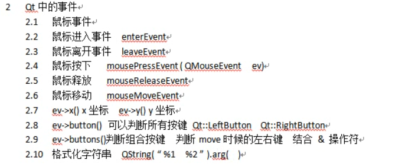
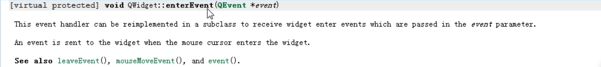
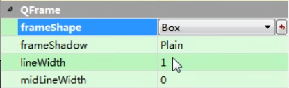
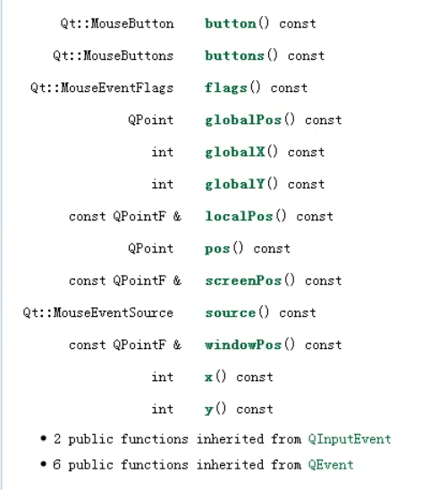
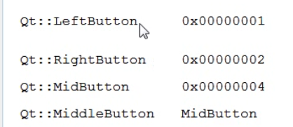

# 鼠标事件

> 鼠标事件会根据鼠标的状态触发




 

```c++
主要使用
    leaveEvent(QEvent*)//离开触发
    enterEvent(QEvent*)//进入触发 
    mouseMoveEvent(QEvent*) //是过程事件，随鼠标实时更新
通过重载这些函数来干想要的事
    
leaveEvent(QEvent*)，enterEvent(QEvent*)直接重载
     
只有点按鼠标才会触发mouseMoveEvent，如果需要在鼠标移动时就可以使用 mouseMoveEvent(QEvent*)，在控件自定义中设置来开启鼠标监控
    setMouseTracking(true);//false时只有点按鼠标才会触发mouseMoveEvent
```

因为有leaveEvent()事件，所以鼠标移动到按钮，按钮变化什么的不需要根据是否移动到其他控件时触发returnBtn()来恢复，直接重载leaveEvent()恢复就行了


**设置边框**




## QMouseEvent

> 鼠标事件传进去的类，需要`#include<QMouseEvent>`, 有以下



> globalX()显示的是在整个屏幕的坐标
>
> x()显示的是控件内的坐标


> button()返回按键类型枚举值
>
> buttons()返回联合值，包含左右中



```c++
ev->button() == Qt::LeftButton 
ev->buttons() & Qt::LeftButton  //相当于从触发的按键中过滤出是否有触发左击，左右中的二进制分别为001 010 100，所以很精妙地利用了按位与  
```


## 获取鼠标在窗口的坐标

```c++
#include <QApplication>
#include <QWidget>
#include <QCursor>
#include <QDebug>

class MyWidget : public QWidget
{
public:
    MyWidget(QWidget *parent = nullptr) : QWidget(parent) {}
protected:
    void mouseMoveEvent(QMouseEvent *event) override;
};

void MyWidget::mouseMoveEvent(QMouseEvent *event)
{
    Q_UNUSED(event);
    // 获取鼠标的全局坐标
    QPoint globalPos = QCursor::pos();
    // 将鼠标的全局坐标转换为窗口坐标
    QPoint windowPos = mapFromGlobal(globalPos);
    // 打印鼠标在当前窗口的位置
    qDebug() << "鼠标在当前窗口的位置：" << windowPos.x() << "," << windowPos.y();
}

int main(int argc, char *argv[])
{
    QApplication app(argc, argv);
    // 创建一个 QWidget 对象
    MyWidget widget;
    // 设置窗口的大小和标题
    widget.resize(400, 300);
    widget.setWindowTitle("鼠标位置示例");
    // 显示窗口
    widget.show();
    return app.exec();
}
```


## 鼠标按下后持续出发clicked信号

> QPushButton 有一个属性叫做 autoRepeat，它可以控制按钮是否在按下后持续触发 clicked 信号。默认情况下，这个属性是 false，也就是说按钮只会在按下和释放时各触发一次 pressed 和 released 信号，以及一次 clicked 信号。如果你想让按钮在按下后持续触发 clicked 信号，你可以将这个属性设置为 true，然后通过 autoRepeatDelay 和 autoRepeatInterval 来调整触发的延迟和间隔。例如，如果你想让按钮在按下后 400 毫秒开始触发 clicked 信号，并且每隔 50 毫秒触发一次，

```c++
#include <QApplication>
#include <QPushButton>
#include <QDebug>

int main(int argc, char *argv[])
{
    QApplication app(argc, argv);
    // 创建一个 QPushButton 对象
    QPushButton button("长按按钮");
    // 设置按钮的 autoRepeat 属性为 true
    button.setAutoRepeat(true);
    // 设置按钮的 autoRepeatDelay 属性为 400 毫秒
    button.setAutoRepeatDelay(400);
    // 设置按钮的 autoRepeatInterval 属性为 50 毫秒
    button.setAutoRepeatInterval(50);
    // 连接按钮的 clicked 信号到一个槽函数
    QObject::connect(&button, &QPushButton::clicked, [] {
        // 在控制台打印一条信息
        qDebug() << "按钮被点击了";
    });
    // 显示按钮
    button.show();
    return app.exec();
}
```

