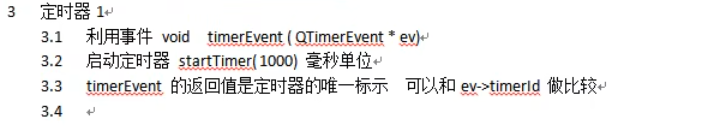
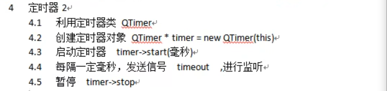

# 定时器

> QTimerEvent是一个事件，默认每隔一段时间执行一次




## 通过重写事件实现

开启一个定时器

```c++
//重写定时器事件
    void Widget::timerEvent(QTimerEvent *)
    {
        ...
    }

//设置调用时间，启动定时器
	startTimer();  //参数1，时间间隔  单位：毫秒

killTimer(timer_id);//停止定时器
```


如果需要开启两个定时器

```c++
int id1 = startTimer(2000);//函数返回定时器id
int id2 = startTimer(1000);

void Widget::timerEvent(QTimerEvent *)
{
	if(event->timerId() == id1)
	{
	    ...
	}	
	else if(event->timerId() == id2)
    {
	    ...
	}
}
```


## 通过QTimer类实现

> 使用定时器的第二种方式，功能更强大的QTimer类

​    


```c++
QTimer *timer = new QTimer(this);  //设置父对象

timer->start(500);  //时间间隔 毫秒
timer->setSingleShot(true);//只执行一次，fasle则反复执行

connect(timer,&QTimer::timeout,[=](){});//连接时间信号
```

因为直接建立对象，所以建立第二个定时器不需要额外记录id


暂停定时器

```c++
timer->stop();
```

