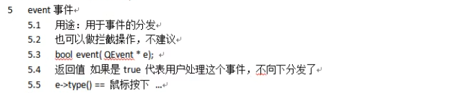
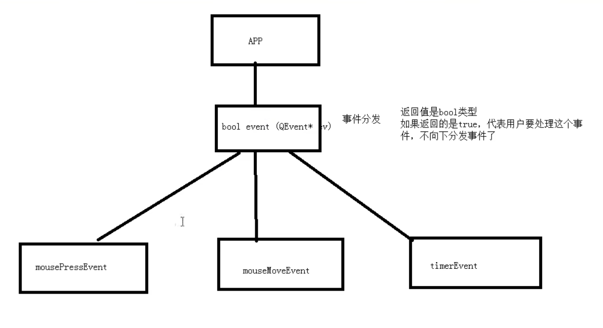
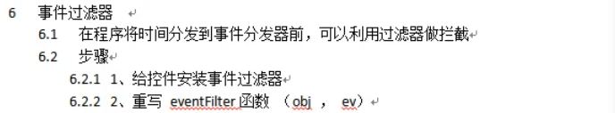
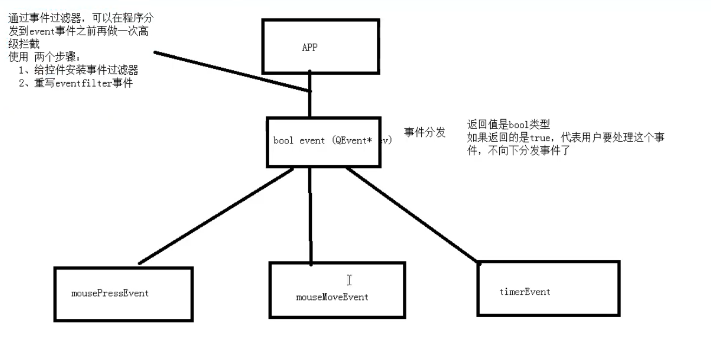

# 事件分发/过滤器


## 分发器

> 在我们的各类事件处理时，程序先通过一个事件分发的函数，判断事件的归属后决定分发给哪些相关函数






拦截事件

```c++
//拦截鼠标按下事件,先重写event()
	//QEvent 的enum QEvent::Type中有各类事件的枚举
	//找到MouseButtonPresse
	bool myLabel::event(QEvent *e)
    {
        if(e->type() == QEvent::MouseButtonPress)
        {
            ...
            return true;//true代表用户进行处理，不向下分发
        }
        
        //其他事件交给父类处理
        return QLabel::event(e);
    }
```

通过这样，重写的mousePressEvent()不会被触发 


## 过滤器

> 在事件分发前，还有一层拦截，可以在程序分发到event事件前，再做一次拦截







为控件安装事件过滤器

```c++
ui->label->installEventFilter(this); //参数：谁来给控件安装过滤器

//在“谁来给控件安装过滤器”的谁中 重写eventFilter事件
bool eventFilter(QObject*,QEvent*);

bool Widget::eventFilter(QObject* obj,QEvent* qev)
{
    if(obj == ui->label)  //判断是哪个控件
    {
        if(qev->type() == QEvent::MouseButtonPress)
        {
            ...
            return true; //true代表用户自己处理
        }
    }
    
    //其他默认处理
    return QWidget::eventFilter(obj,qev);
}
```

