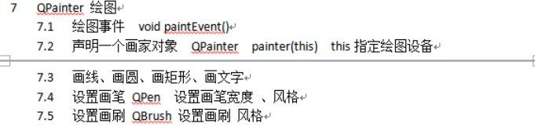
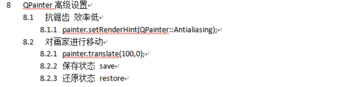
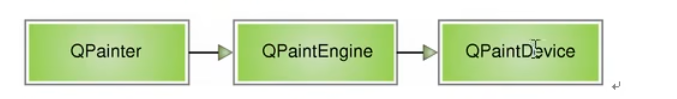
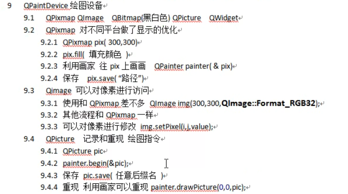
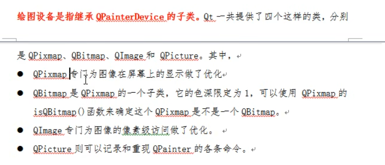

# 绘图事件

> QPainter类，通过重载`Widget::paintEvent(QpaintEvent *)`能够调用绘图事件
>
> 绘图使用的是paintEvent函数中绘图，我们需要重载该函数。每当需要重绘窗口时（如窗口大小改变时，窗口被遮挡恢复时），系统就会自动调用paintEvent这个函数。
> QPainter类用来绘制各种图形，通过QPen、QBrush类来设置图形笔画、填充方式。

```c++
//重载方式
protected:
    void paintEvent(QPaintEvent *) override;
```





重写事件

```c++
#include <QPainter>

void Widget::paintEvent(QpaintEvent *)
{
    //实例画家类
    QPainter painter(this);//参数：指定绘图设备,在当前的widget下画画
    
    //画一条线
    painter.drawLine(QPoint(0,0),QPoint(100,100));
    
    //画圆/椭圆
    painter.drawEllipse(QPoint(100,100),50,50);//参数：圆心 rx ry
        
    //画矩形
   painter.drawRect(QRect(QPoint(100,100),QPoint(200,200)));//参数不只一种，这种是设置左上，右下
    painter.drawRect(QRect(20,20,50,50));//(20,20)处画50x50的矩形
    
    //画文字
    painter.drawText(QRect(10,200,100,50),"hhh");//矩形框里画字。框仅做碰撞，不显示
    
    
====================================================
    笔
    
    //设置笔的颜色
    QPen pen(QColor(255,0,0));//红
    painter.setPen(&pen); //高版本传入指针
    
    //笔刷宽度
    pen.setWidth(3);
    //风格
    pen.setStyle(Qt::PenStyle);//实线，虚线...
    
=====================================================
    画刷
    
    //设置画刷
    QBrush brush(QColor(0,255,0));//绿  或者brush(Qt::green)
    								//其他颜色：Qt::GlobalColor
    painter.setBrush(&brush);//所有封闭的线条填充为绿色
    
    //风格
    brush.setStyle(Qt::BrushStyle)； //在setStyle前设置
    
}
```


## 高级事件

> 抗锯齿，坐标原点



```c++
QPainter painter(this);
painter.drawEllipse(QPoint(100,50),50,50);
//设置 抗锯齿能力,效率低
painter.setRenderHint();//参数 枚举QPainter::RenderHint
painter.drawELLipse(QPoint(200,50),50,50);//更光滑的椭圆

//画矩形
painter.drawRect(QRect(20,20,50,50));
//让画家向右方移动100
painter.translate(100,0);
painter.drawRect(QRect(20,20,50,50));//处于第一个矩形的右边

//保存画家状态，存档
painter.save();
//还原至画家保存的状态，读档
painter.restore();


```


## 手动调用绘图事件

> 除了QLabel，QPainter也可以画图片


```c++
//画图
painter.drawPixmap(int x,int y,int w,int y,QPixmap&);//参数：位置，宽高（可去），图片
painter.drawPixmap(20,0,QPixmap(":/Images/1.png"));
painter.end()//画完结束，避免内存溢出 

//重新绘图
repaint()；
//如果是手动绘图，更适合：
update();
```


## 绘图设备

> QPainter的绘图层次，绘图设备是QPainterDevice的子类 



QPainter提供画家，QPaintEngine提供方法，QPaintDevice提供设备，类似于纸张

 




```c
QBitmap色深为1，就是黑色与白色
QImage精准访问像素点，功能更加强大
```

我们使用的QWidget不仅仅派生QObject，也派生了QPaintDevice


```c++
//pixmap绘图设备
QPixmap pix(300,300);

//申明画家
QPianter painter(&pix);

painter.setPen(QPen(Qt::green));
painter.drawELLipse(QPoint(150,150),50,50);

pix.save("E:\\pix.png");//保存图片，背景色是黑色
//如果想改变背景色
pix.fill(Qt::white);

```

```c++
//Qimages绘图设备
QImage img(int,int,QFormat); //宽 高 格式枚举QImage::

img.fill(Qt::white)；
    
 Qpainter painter(&img);
painter.setPen(QPen(Qt::blue));
painter.drawELLipse(QPoint(150,150),50,50);

ima.save("E:\\img.png");//保存图片


//对像素进行修改
QPianter painter(this);
QImage img;
img.load(":/Image/2.png");

//修改像素点
for(int i = 50;i < 100;i++)
{
    for(int j = 50;j < 100;j++)
    {
        QRgb value = qRgb(255,0,0);//QRgb：像素rgb
        img.setPixel(i,j,value);
    }
}

painter.drawImage(0,0,img);
```


```c++
//QPicture绘图设备
QPicture pic;
QPianter painter;

painter.begin(&pic)//另一种设置设备的方法
    .
painter.end();//结束画画

painter.setPen(QPen(Qt::cyan));
painter.drawEllipse(QPoint(150,150),50,50);

//动作保存到磁盘
pic.save("E:\\pic.zt");//保存动作，后缀名随意

//重现绘图指令 
pic.load("E:\\pic.zt");、
painter.drawPicture(0,0,pic)；
```


## 绘图

### 多色直线

```c++
#include <QPainter>
#include <QPen>
#include <QWidget>

class MyWidget : public QWidget
{
public:
    MyWidget(QWidget *parent = nullptr) : QWidget(parent) {}
protected:
    void paintEvent(QPaintEvent *event) override;
};

void MyWidget::paintEvent(QPaintEvent *event)
{
    Q_UNUSED(event);
    QPainter painter(this); // 创建 QPainter 对象，指定 this 为绘图设备
    QPen pen; // 创建 QPen 对象
    pen.setWidth(10); // 设置 QPen 的宽度为 10 像素
    pen.setStyle(Qt::SolidLine); // 设置 QPen 的样式为实线
    pen.setColor(Qt::red); // 设置 QPen 的颜色为红色
    painter.setPen(pen); // 将 QPen 应用到 QPainter 上
    painter.drawLine(0, 50, 100, 50); // 画一段从 (0, 50) 到 (100, 50) 的红色直线
    pen.setColor(Qt::green); // 设置 QPen 的颜色为绿色
    painter.setPen(pen); // 将 QPen 应用到 QPainter 上
    painter.drawLine(100, 50, 200, 50); // 画一段从 (100, 50) 到 (200, 50) 的绿色直线
    pen.setColor(Qt::yellow); // 设置 QPen 的颜色为黄色
    painter.setPen(pen); // 将 QPen 应用到 QPainter 上
    painter.drawLine(200, 50, 300, 50); // 画一段从 (200, 50) 到 (300, 50) 的黄色直线
}
```

