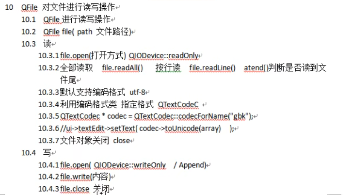
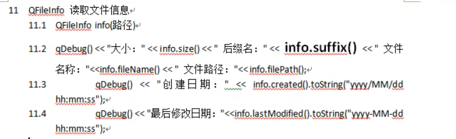
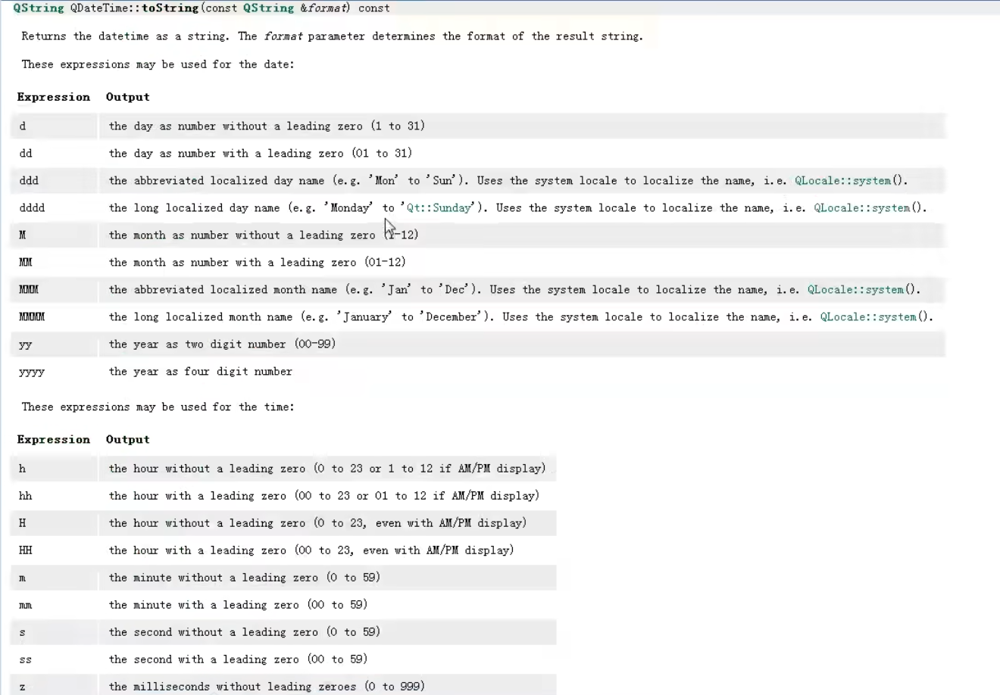
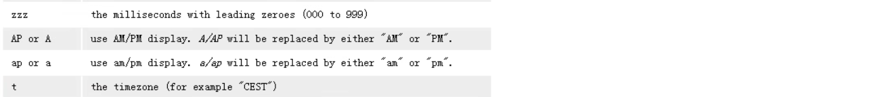

# 文件读取

> QFile对文件进行读写操作，注意结束时要记得调用close()




## 读取文件

```c++
//点击选取按钮，弹出文件对话框
    connect(ui->pushButton,&QPushButton::clicked,[=](){
        QString file_dir = QFileDialog::getOpenFileName(this,"打开","../");
        //路径放入lineEdit
        ui->lineEdit->setText(file_dir);

        //读取内容放入textEdit
        QFile file(file_dir); //读取文件的路径
        //设置打开方式,只读
        file.open(QIODevice::ReadOnly);//枚举QIODevice::OpenMode

        QByteArray array = file.readAll();//返回的类型是QByteArray
        //读取到的数据放入 textEdit
        ui->textBrowser->setText(array);


        //我们默认读取的格式是UTF-8，所以GDK等格式读取乱码
        //编码格式类
        QTextCodec * cod = QTextCodec::codecForName("gdk");
        //ui->textBrowser->setText(cod->toUnicode(array));//通过编码格式更换格式


        //按行读，内部有一个类似迭代器的指针，每读一次向下一行，注意不可在readAll()后调用，否则无内容
        QByteArray array2;
        while(!file.atEnd())
        {
            array2 += file.readLine();
        }
        ui->textBrowser->setText(array2);
        
        //对文件对象进行关闭
        file.close();
```


### 判断文件编码并修正

```c++
QString MainWindow::GetCorrectUnicode(const QByteArray &ba)
{
    QTextCodec::ConverterState state;
    QTextCodec *codec = QTextCodec::codecForName("UTF-8");
    QString text = codec->toUnicode( ba.constData(), ba.size(), &state);
    if (state.invalidChars > 0)
    {
        text = QTextCodec::codecForName( "GBK" )->toUnicode(ba);
        return QString("GBK");
    }
    else
    {
        text = ba;
        return QString("UTF8");
    }
}
```


## 写入文件

```c++
//进行写文件
	QFile file(file_dir); //读取文件的路径
    file.open(QIODevice::Append);//以追加的方式写
	file.open(QIODevice::WriteOnly);//以覆盖的方式写
    file.write("aaaaaa");
    file.close();
```


## 读取文件信息

> QFileInfo类，包含文件的信息




```c++
常用
QString suffix();  //后缀名
QString fileNmae(); //文件名
QString path(); //路径

QDataTime created(); //创建日期
QDataTime lastModified(); //修改日期 #include <QDateTime>
```


```c++
//QFileInfo类
     QFileInfo info(file_dir);

     qDebug() << "大小(字节)： " << info.size() << "后缀: " << info.suffix();
     //qDebug() << "创建日期: " << info.created();//默认全部打印完
     qDebug() << info.created().toString("yyyy/MM/dd hh:mm:ss");//更换输出格式
     qDebug() << "最后修改日期： " << info.lastModified().toString("yy/MM/d h/m/s");
```


### **QDataTime**自定义输出格式

> 这些字符做替换用





```c++
qDebug() << info.created().toString("yyyy/MM/dd hh:mm:ss");//更换输出格式
```

