# Qt

> Qt是一套应用程序开发库，与MFC不同，Qt是跨平台的开发类库
>
> http://download.qt.io/archive
>
> [bilibili](https://www.bilibili.com/video/BV1AX4y1w7Nt?spm_id_from=333.1007.top_right_bar_window_custom_collection.content.click&vd_source=782af047fbca87ac3084937682017138)

qt的main函数中调用exec()时会进入死循环，如果正常退出会返回0，不正常则返回大于0的值。


**qt_creator和clion开发是不一样的**：

https://zhuanlan.zhihu.com/p/461896034

> - 我们新建了一个`Sources`文件夹用于保存所有的QT源文件，在`Sources`下，`Forms`和`Headers`分别存放UI文件和.h头文件，所有的cpp源文件直接放在`Sources`目录下，这里在新建好文件夹之后，只需要把`main.cpp`直接拖拽到`Sources`下即可，clion 会自动帮我们处理cmake文件中路径的问题。
> - lib目录存放我们之后需要的MQTT第三方库的 .dll文件和.a文件
> - include目录存放第三方库的头文件

==clion不可以打开.ui文件，还是需要借助qt_designer==

注意

- 开发目录不可含有中文


## 配置

### 常用类别

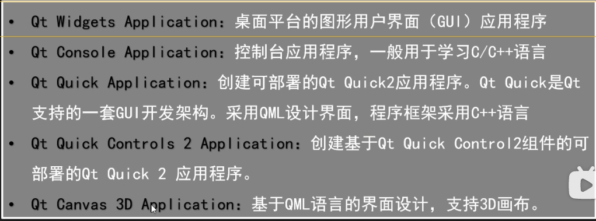


### 使用基类

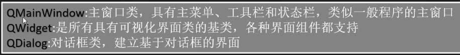


### 文件结构

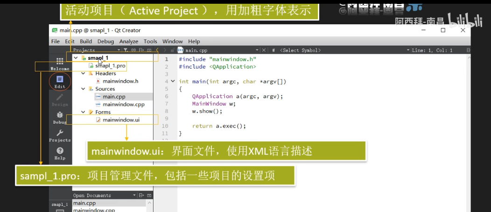


### 双重编译

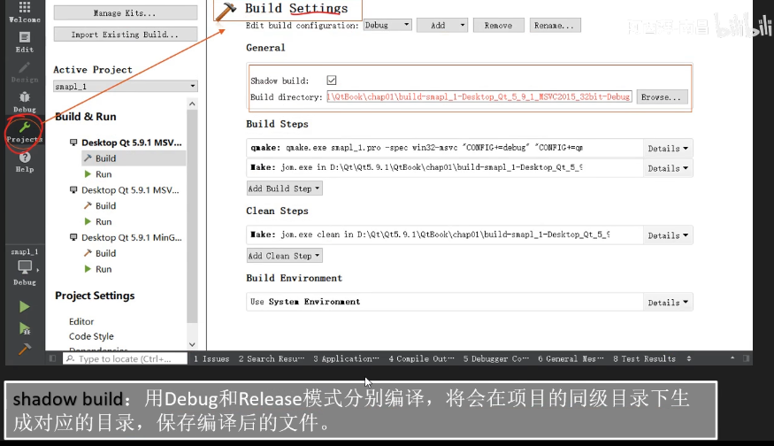


### QT_designer安装

> http://t.zoukankan.com/qinlangsky-p-12703500.html
>
> ```
> sudo pip3 install pyqt5
> ```
>
> ```
> sudo apt-get install qt5-default qttools5-dev-tools
> ```
>
> ```c
> $ designer        //启动
> ```


# UI文件设计与运行机制

> clion的cmakelist文件发挥pro文件类似的作用

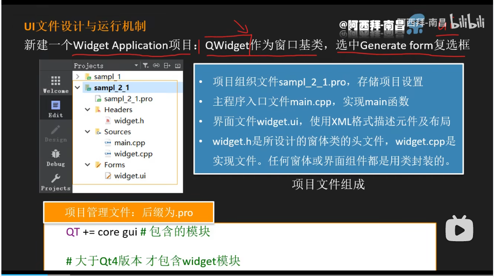

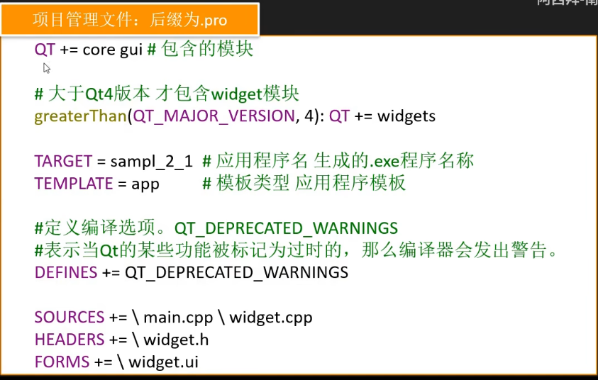

 

## Desinger页面组件

> https://blog.csdn.net/zhangxue1232/article/details/115939701

**Layouts**

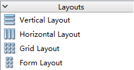

1、Vertical Layout 垂直布局，组件自动在垂直方向上分布
2、Horizontal Layout 水平布局，组件自动在水平方向上分布
3、Grid Layout 网格状布局，网格状布局大小改变时，每个网格的大小都改变
4、Form Layout 窗体布局，与网格状布局类似，但是只有最右侧的一列网格会改变大小


**Spacers**

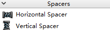

1、Horizontal Spacer 一个用于水平分隔的空格,可以将多个组件水平分隔开，添加N个即隔开N个空格距离
 2、Vertical Spacer 一个用于垂直分隔的空格,可以将多个组件垂直分隔开，添加N个即隔开N个空格距离


**Buttors**

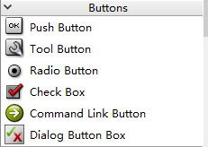

> Push Button 普通按钮
>
> Tool Button 工具按钮
>
>             可以带图标 有两部分组成：文本text 和 图标icon（建议用png格式的图片）
>
> Radio Button 单选按钮
>
> check Box 多选框
>
> Command Link Button 命令连接按钮
>
> Dialog Button Box 对话框按钮


**Item Views**

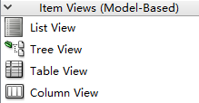

> List View 列表视图 : 像歌曲列表，文件列表，这种可以用QListView实现
>
> Tree View 树视图
>
> Table View 表视图 :可以像excel一样的显示数据
>
> Column View 直栏浏览


**Item Widgets**

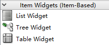

> List Widget 列表小部件：可以显示一个清单，清单中的每个项目是QListWidgetItem的一个实例，每个项目可以通过QListWidgetItem来操作。
>
> Tree Widget 树小部件
>
> Table Widget 表小部件


> Label:  标签
>
> 

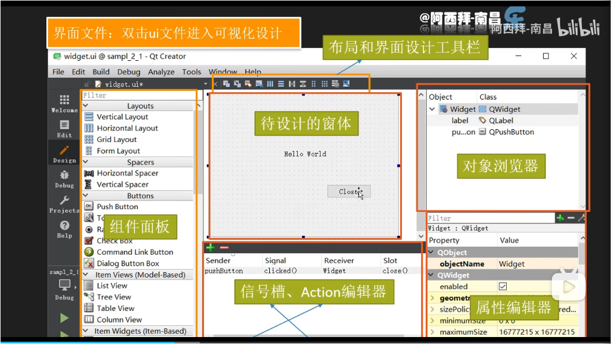


## 信号槽

> 信号槽每一个信号有4个元素，可以填入发送者，信号，接受者，槽


## 插入资源

> 1   https://www.cnblogs.com/yang12318/p/10699429.html
>
> 2   https://www.likecs.com/show-203744096.html

例：

**为tool button添加图片**

1 建立一个prc文件,内部以相对路径写入文件

```
<RCC>
    <qresource prefix="/">
        <file>res/1.png</file>
        <file>res/2.png</file>
        <file>res/3.png</file>
        <file>res/4.png</file>
        <file>res/5.png</file>
        <file>res/6.png</file>
        <file>res/7.png</file>
    </qresource>
</RCC>
```


2 载入prc文件

 右击想加图标的Tool Button按钮，点击change styleSheet

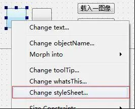

在弹出的窗口中，点击border-image

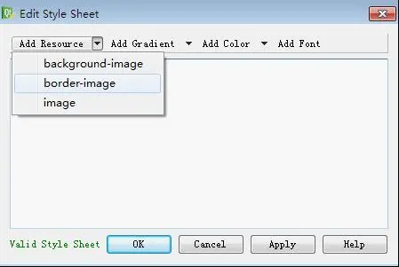

 在弹出的窗口中，选择要添加的图标


## 主函数文件


# 程序打包

> https://blog.csdn.net/kangshuaibing/article/details/84951619?utm_medium=distribute.pc_relevant.none-task-blog-OPENSEARCH-1.nonecase&depth_1-utm_source=distribute.pc_relevant.none-task-blog-OPENSEARCH-1.nonecase


# 安卓环境

> https://blog.csdn.net/Arcofcosmos/article/details/118822458?spm=1001.2014.3001.5501

部署：https://blog.csdn.net/Arcofcosmos/article/details/122452036


# 添加视频

> https://blog.csdn.net/zhang669154/article/details/78781011

```cmake
find_package(Qt5 COMPONENTS Widgets LinguistTools Multimedia MultimediaWidgets REQUIRED)
include_directories(${Qt5MultimediaWidgets_INCLUDE_DIRS})
```


# 多线程

> https://blog.csdn.net/qq_54395977/article/details/122725537

标准示范：

https://blog.csdn.net/quietbxj/article/details/121245304


**实例**

[ 参考网址](https://blog.csdn.net/w_weixiaotao/article/details/106340276?spm=1001.2101.3001.6650.1&utm_medium=distribute.pc_relevant.none-task-blog-2%7Edefault%7ECTRLIST%7ERate-1-106340276-blog-121760653.pc_relevant_multi_platform_featuressortv2removedup&depth_1-utm_source=distribute.pc_relevant.none-task-blog-2%7Edefault%7ECTRLIST%7ERate-1-106340276-blog-121760653.pc_relevant_multi_platform_featuressortv2removedup&utm_relevant_index=2)

```c++
//之前总是存在Timers cannot be started from another thread的报错，通过上面的参考网址在线程里加QTimer(this)，确认将一个额外的定时器加线程，因为QTimer定时器不能在不同的线程中启动。
Mythread::Mythread() {
  timer = new QTimer(this);//这里
  timer->setInterval(30); // set cycle

  connect(timer, &QTimer::timeout, this, &Mythread::sendSignal,
          Qt::DirectConnection);
  connect(this, &QThread::finished, timer, &QTimer::stop);
  timer->start();
  timer->moveToThread(this);
}

void Mythread::sendSignal() {
  if (run_flag) {
    emit label->callMonitor();
  }
}

void Mythread::run() {
  qDebug() << "MyThread::run:" << QThread::currentThreadId();
  this->exec(); //这个是Qt的消息循环，只有加这个才可以监听信号
}
```


# 报错

## ui_mainwindow.h

> ```
> // You may need to build the project (run Qt uic code generator) to get "ui_mainwindow.h" resolved
> ```

修改mainwindow.cpp

此时我们直接编译会报错，所以需要自己修改一下`mainwindow.cpp`，将最上方头文件的引入的地址进行修改：

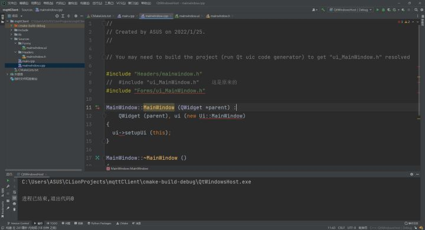

>  这里需要说明的是，QT会把UI文件预处理成对应的.h文件，然后在CPP文件中引用，生成的.h文件与UI文件同目录，所以我们想要引用的话需要正确设置文件的位置，正如上面所说一样，UI文件都在Forms目录下，所以我们引入的时候也需要指定Forms目录

这时候编译，就可以看到原来报错找不到定义或头文件的地方，都不会再报错了，因为编译过后，`ui_MainWindow.h`文件就会生成。


# 小知识点

## QString转char*

> qDebug() << "aaa" << QString("bbb") 的输出结果：aaa“bbb",如何让QString不输出引号？方法是将它转为char*

```c
//先转换为QByteArray,再转char*
qDebug() << "aaa" << qstring.toUtf8().data();
```


## 释放窗口资源

\1. 对于使用指针，使用new创建的窗口，当然可以使用delete显示的释放其占用的资源：

```c++
Widget *w = new Widget();

delete w;
```


\2. 对于使用指针，使用new创建的窗口，还可以使用`QWidget::setAttribute`方法来当窗口关闭后自动释放其占用的资源，而不用户显示的去调用delete释放，此方法当然也会调用窗口的析构函数：

```c++
Widget *w = new Widget();

w->setAttribute(Qt::WA_DeleteOnClose);
```

这可以用于非模态对话框，因为非模态对话框如果是用指针形式创建，但是再接着delete的话，窗口就没了，如果不使用delete释放窗口占用的资源，又会赞成泄漏。如果使用普通变量创建，同样的也因为变量作用域马上就结束而窗口也没了，

另一种方法就是使用多线程，不过这个的代价大了点。所以这种技术在创建非模态对话框上是非常典型的运用。

> 测试方式：在Widget中分配大量的内存，显示与关闭多个此类窗口，看看任务管理器里此程序的内存变化情况，是否真正的释放了占用的内存（当然释放了）。在C++中使用new分配内存时，如array = new  double[length]，此时，给array的内存实际上并没有真正的分配，必须等到第一次使用这些内存后才会真正地为其分配物理内存，如：memset(array, 1, length * sizeof(double))

 

\3. 窗口的内存管理交给父Widget：

```c++
Widget *w = new Widget(parent);
```

但这时，如果父Widget不结束，这个窗口的资源一直会占用着。


# 小项目

## 女优抽取(初级)

> 首先需要了解TextEdit控件的各种操作

### 随机数

> ```
> 要产生随机数r， 其范围为 m<=r<=n，可以使用如下公式：
> rand()%(n-m+1)+m
> 其原理为，对于任意数，
> 0<=rand()%(n-m+1)<=n-m
> 于是
> 0+m<=rand()%(n-m+1)+m<=n-m+m
> 即
> m<=rand()%(n-m+1)+m<=n
> ```


```c
#include iostream;
#include ctime;
#include cstdlib;
 
using namespace std;
 
int main ()
{
   int i,j;
 
   // 设置种子
   srand( (unsigned)time( NULL ) );
 
   /* 生成 10 个随机数 */
   for( i = 0; i  10; i++ )
   {
      // 生成实际的随机数
      j= rand();
      cout "随机数： "  j  endl;
   }
    getchar();  
    return 0;  
}

```


### 结果输出到文本框

> 因为append()函数使用字符串类型是QString，所以需要先转换vector

```c++
ui->export_edit->append(QString::fromStdString(SSS[i]));
```

**不同颜色文本**

> 综合了所有方案，决定结合QString，先赋值，再在QString内改颜色。
>
> tr 提供汉化翻译作用,即translator,而arg()是用来替换的，%1 .arg()组合相当于c语言的printf中的(%d, a)

```c
QString buf；

buf = QString::fromStdString(SSS[i]);
QString buf = "hello";
buf = QObject::tr("<font color=\"#FFD700\">%1</font>").arg(buf);

buf = QObject::tr("<font color=\"#FFD700\">%1</font>%2")
                .arg(buf, QString("（保底）"));
```


### 历史记录

**c++ vector存数组**                                        

**一维数组初始化：**

其中vec: 数组名；n: 数组大小

```cpp
vector<int> vec(n);
vector<int> vec(n, 0);
```

**二维数组初始化：**

其中 vec: 数组名；rows: 数组行数；cols: 数组列数。

```cpp
vector<vector<int>> vec(rows, vector<int>(cols, 0));
```

**三维数组初始化：**

```cpp
vector<vector<vector<int>>> vec(n1, vector<vector<int>>(n2, vector<int>(n3, 0)));
```


**删除vector第一个元素**

```c
vector<int>::iterator k = vector.begin();
vector.erase(k);
```

**删除vector全部元素**

```c
//1
vecInt.clear();

//2
    for ( vector <int>::iterator iter=vecInt.begin();iter!=vecInt.end();)
    {
        iter=vecInt.erase(iter);
    }
```


**最终采用**

> pair<>
>
> https://blog.csdn.net/m0_37957160/article/details/106709915

```c
#include <cstdlib>


std::vector<pair<int,int>> history;

//插入
history.push_back(std::make_pair(a,b));
```

````c
//不知为何，使用erase(history.bengin(),history.end());后保底字体颜色会变。
````


**查找vector元素**

用于账户查找

```c++
写迭代器:

vector::iterator t; 

调用find方法:

t = find(v.begin(),v.end(),查找的元素); 

和v.end()进行比较，如果找到了，那么t就不会指向 v.end(),也就是 t != v.end()
```


### 抽卡视频

现有的百度关于cmake添加QT multimedia包(mac,ubantu)都是错误，正确的添加方式如下，cmake 添加2行

```c
set(Qt5MultimediaWidgets_DIR **/Qt5.9.8/5.9.8/clang_64/lib/cmake/Qt5MultimediaWidgets)#包的位置
target_link_libraries(${PROJECT_NAME} Qt5::Widgets Qt5::Multimedia)#链接到库
```


#### 添加Multimedia库

```c
//安装开发包，不过这种方法不太对，因为安装qt后肯定会有该包的，一般是cmake没写好
apt-get install qtmultimedia5-dev
    
//find_package加入ultimedia MultimediaWidgets
find_package(Qt5 COMPONENTS Widgets Multimedia MultimediaWidgets REQUIRED)
    
//target_link_libraries加入Qt5::MultimediaWidgets
target_link_libraries(qt_AssWeCan_2 PRIVATE Qt5::Widgets Qt5::MultimediaWidgets)
```


### 抽卡动图

```c++
//放gif动图
	QMovie *movie = new QMovie(":/images/XXX.gif");
	ui->label2->setMovie(movie);
  //播放动图
	movie->start();
```

**只播放一遍**

```c++
int QMovie::currentFrameNumber() const //计算当前帧号，从0开始
 
int frameCount() const         //总共帧号

当当前帧号等于(总帧数-1)时停止
```

**注意start后会一直播放**

```c++
//抽卡动画结束后先暂停所有动画
void Mylabel::toBackGround() {
  movie_gold->stop();
  movie_blue->stop();
  movie_blue->stop();
  movie_background->start(); //先statrt再赋值
  this->setMovie(movie_background);
  this->movie_current = Mylabel::movie_num::back;
  this->lower();
}
```


### 抽卡结果(图片)

> Label标签有加入图片的能力，通过格栅布局将10连的结果以label的形式展示出来


### 设置背景图片

1.在paintEvent事件中绘制图片

```c++
void Widget::paintEvent(QPaintEvent * ev)
{
	QPainter painter(this);
	painter.drawPixmap(rect(),QPixmap(":/bg.jpg"),QRect());
}
```

drawPixmap在Widget的整个矩形区域绘制背景图片，第三个参数为要绘制的图片区域，传入空的矩形表示整个图片区域。通过这种方式可以将图片平铺到窗口上，缺点就是要使用paintEvent事件需要新建一个类，不适合子窗口。

2.使用调色板QPalette来设置图片

```c++
QPalette pal =this->palette();
pal.setBrush(QPalette::Background,QBrush(QPixmap(":/bg.jpg")));
setPalette(pal);
```

首先获得Widget的调色板，然后设置设置调色板背景（setBrush），最后将调色板设置到Widget中。

3. 使用样式表(setStyleSheet)

使用样式表可以很方便设置界面，而且非常高效，还能让界面和逻辑分离。真的是Qt里非常好用的一个东西，设置背景图片的语句也很简单.

```c++
setStyleSheet("border-image:url(:/bg.jpg)");
```


**不知道为什么主窗口设置的图片会出现在控件上**

> 已解决

将widget内设置背景改为label设置背景，是否覆盖由raise()和lower()操纵

```c++
    //背景
    label_background = new Mylabel(this);
    label_background->resize(1280,720);
    label_background->move(0,0);
    //movie->setWindowFlags(movie->windowFlags() | Qt::Dialog);
    label_background->setStyleSheet("QWidget{border-image: url(:/Images/UI/back_ground.png)}");
    label_background->lower();
    label_background->show();
```


**label显示图片**

```C
    QLabel *label_image = new QLabel(widget);
    QPixmap pix(":/img/积跬步至千里.png");                                //显示图片方法1：利用QPixmap
    label_image->setPixmap(pix);//显示图片原始尺寸,如果label_image尺寸比图片原始尺寸小，那么只显示图片的一部分
    label_image->setScaledContents(true);//图片跟随label_image尺寸比例变化，图片原始的长宽比例在这显的不重要，因为可以会随着label_image的尺寸随意变化（对样式表方式无效）

//样式表也可以显示图片
```


**背景透明而字体正常显示**

```c
setAttribute(Qt::WA_TranslucentBackground);
```


**窗口透明度**

```c++
setWindowOpacity(0.5); //半透明
```

**部件透明度**

```c++
// 部件透明设置
    QGraphicsOpacityEffect *opacity = new QGraphicsOpacityEffect;
    opacity->setOpacity(0.2); //透明范围同窗口透明度
    ui->pushButton->setGraphicsEffect(opacity);
```


### 设置圆角按钮

>  依据鼠标是否被捕捉到来设置圆角按钮不同的弧度，这样有按键动效

setStyleSheet中设置

```c++
border:2px groove gray;border-radius:10px;padding:2px 4px;border-style: outset;
```

https://blog.csdn.net/qq_40015157/article/details/125768954

**最终采用**

```c
setStyleSheet("QToolButton{
              background-image:url(:/Images/UI/tool_btn.png); 
              border:2px double white; border-radius:10px;//双实线边框，还可以用border-color: 自定义边框颜色
              }");
```

```c
 lineEdit->setStyleSheet(/*"color: blue;"*/
 "background-color: yellow;"
 "selection-color: yellow;"
 "selection-background-color: blue;" );

//自定义颜色
background-color: rgb(255, 253, 252);
```


### 样式表：border边界

https://blog.csdn.net/weixin_48465741/article/details/116244256


### 鼠标事件

> 需要对鼠标事件进行处理时，通常要重新实现以下几个鼠标事件处理函数：
>
> ```
> QWidget::mousePressEvent()
> QWidget::mouseReleaseEvent()
> QWidget::mouseDoubleClickEvent()
> QWidget::mouseMoveEvent()
> ```


#### 鼠标移动到控件触发事件

> https://m.qiyeshangpu.com/wen/05598c0193d1cdd5edc7a9973c8830f3.html

属性可以通过**setMouseTracking**函数进行设置，通过**hasMouseTracking**函数进行获取。

相关的事件响应函数是**mouseMoveEvent()。**

```c++
QTableView m_tableView = new QTableView(this); 
m_tableView->setMouseTracking(true); // 设置鼠标追踪
connect(m_tableView, &DTableView::entered, this, &SecurityLogDialog::doMouseTrackTip)
```

还有**leaveEvent()**事件，所以鼠标移动到按钮，按钮变化什么的不需要根据是否移动到其他控件时触发returnBtn()来恢复，直接重载leaveEvent()即可


**判断是否在框内**

https://blog.csdn.net/hushiwei1993/article/details/78204635


#### 鼠标按下

```c
    // 如果是鼠标左键按下
    if(event->button() == Qt::LeftButton)
   {
        ···
    }
    // 如果是鼠标右键按下
    else if(event->button() == Qt::RightButton)
   {
       ···
    }
```


#### 鼠标划过变手形

当鼠标滑过QPushbutton按钮控件时，将鼠标箭头变为手型代码如下：

```cpp
button->setCursor(QCursor(Qt::PointingHandCursor));
```

其他

```c++
enum CursorShape {
        ArrowCursor,
        UpArrowCursor,
        CrossCursor,
        WaitCursor,
        IBeamCursor,
        SizeVerCursor,
        SizeHorCursor,
        SizeBDiagCursor,
        SizeFDiagCursor,
        SizeAllCursor,
        BlankCursor,
        SplitVCursor,
        SplitHCursor,
        PointingHandCursor,
        ForbiddenCursor,
        WhatsThisCursor,
        BusyCursor,
        OpenHandCursor,
        ClosedHandCursor,
        DragCopyCursor,
        DragMoveCursor,
        DragLinkCursor,
        LastCursor = DragLinkCursor,
        BitmapCursor = 24,
        CustomCursor = 25
    };

```

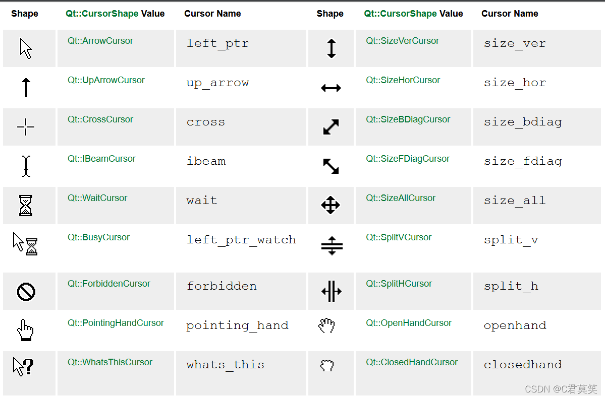


当然在designer中也可以设置

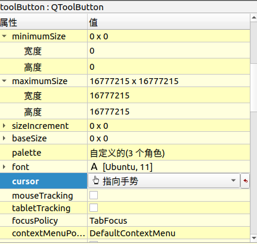


### 添加音效

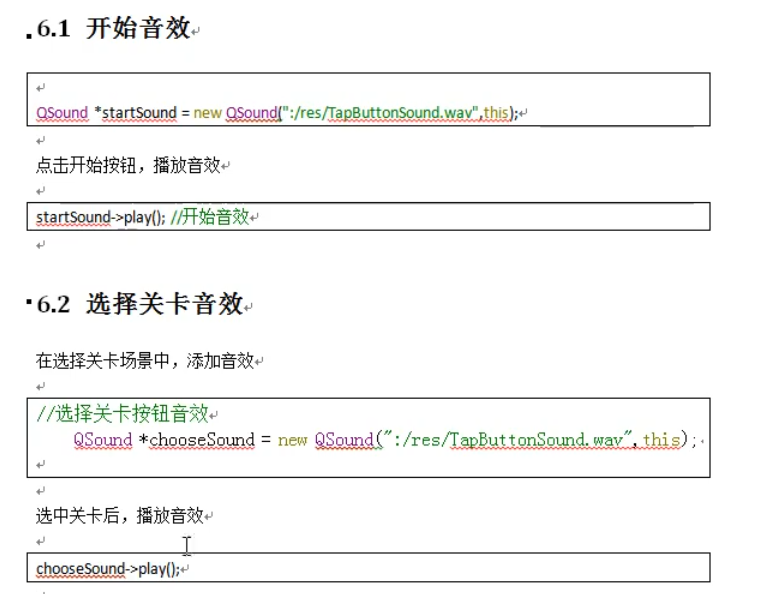


## 网易云界面

### 去掉标题栏

在用QT编写界面时，去掉标题栏方法比较简单，就一行代码

```
this->setWindowFlags(Qt::FramelessWindowHint);
```

去掉以后不能移动窗口了，于是重写了三个鼠标事件：

.h文件的代码：

```c
#include <QMouseEvent>
protected:
    void mousePressEvent(QMouseEvent *e);
    void mouseMoveEvent(QMouseEvent *e);
    void mouseReleaseEvent(QMouseEvent *e);
private:
    QPoint last;
```

 

.cpp文件的代码

```c
//可以在构造函数中初始一下last变量用其成员函数setX,setY就是了
//接下来就是对三个鼠标事件的重写
void MainWindow::mousePressEvent(QMouseEvent *e)
{
    last = e->globalPos();
}
void MainWindow::mouseMoveEvent(QMouseEvent *e)
{
    int dx = e->globalX() - last.x();
    int dy = e->globalY() - last.y();
    last = e->globalPos();
    move(x()+dx, y()+dy);
}
void MainWindow::mouseReleaseEvent(QMouseEvent *e)
{
    int dx = e->globalX() - last.x();
    int dy = e->globalY() - last.y();
    move(x()+dx, y()+dy);
} 
```

复制过去用的时候记得把类名改掉

这样就OK了，去掉窗口标题栏后还能拖动窗体


## 百度网盘

### 添加窗口阴影

**实现控件的阴影效果**

```cpp
QWidget * widgetInner = new QWidget(this);
widgetInner->setGeometry(0, 0, 280, 283);
widgetInner->setStyleSheet("background: #FFFFFF;");
//实例阴影shadow
QGraphicsDropShadowEffect *shadow = new QGraphicsDropShadowEffect(this);
//设置阴影距离
shadow->setOffset(0, 0);
//设置阴影颜色
shadow->setColor(QColor("#444444"));
//设置阴影圆角
shadow->setBlurRadius(30);
//给嵌套QWidget设置阴影
widgetInner->setGraphicsEffect(shadow);
//给垂直布局器设置边距(此步很重要, 设置宽度为阴影的宽度)
widgetInner->setMargin(24);//设置为0时，就看不到边框的阴影
```

注意，setMargin()是旧版代码，我们强烈建议使用以下替代

```c
void QLayout::setContentsMargins(int left, int top, int right, int bottom)
```


**实现无边框窗口的阴影效果**

在构造函数中，除了第一点的代码之外，再加上以下代码：

```cpp
//设置窗体透明
this->setAttribute(Qt::WA_TranslucentBackground, true);
//设置无边框
this->setWindowFlags(Qt::Window | Qt::FramelessWindowHint);
```


**最终使用**

```c
  auto *main_wid_shadow = new QGraphicsDropShadowEffect(this);
  main_wid_shadow->setOffset(8, 6);
  main_wid_shadow->setColor("#444444");
  main_wid_shadow->setBlurRadius(20);
  ui->main_widget->setGraphicsEffect(main_wid_shadow);
  ui->main_widget->setContentsMargins(1, 1, 1, 1);
```


### 新方法：划过按钮的底色

> 对网易云的不用展开的界面有效

```c
//样式表
QListWidget
{
	color:rgb(0,0,0);
	background:rgb(255,255,255);
}


*
{
	outline: 0px;
}

QListWidget::Item
{
	height: 40;
 	border:0px;
}

QListWidget::Item::hover  //划过触发
{
 	border:0px;
	border-radius:5px;
	background:rgb(250,250,252);
}

QListWidget::Item::selected  //选中触发
{
 	border:0px;
	border-radius:5px;
	background:rgb(237,249,254);
}
```


### QLabel改变字体颜色

方法1使用色板

```c
QPalette txt_color_;  

//初始化色板
 txt_color_.setColor(QPalette::Text,QColor(255,255,255));//颜色也可以用枚举
 ui->title_label->setPalette(txt_color_);
```

方法二使用样式表

```c
setStyleSheet("color:red;"); 
//setStyleSheet("color:#ff6600;");

```


### 下拉框/隐藏Layout里的部件

> 事实证明，隐藏控件后弹簧会把剩下的控件挤下去，因此可以通过弹簧和隐藏展开，收缩栏目

先获取所有子控件，然后隐藏

    for (int i = 0; i < ui->horizontalLayout->count(); ++i) {
        QWidget* w = ui->horizontalLayout->itemAt(i)->widget();
        if (w != NULL)
            w->setVisible(false);
    }

**采用**

> 在展开按钮里设置信号，这个函数设为槽，准备一个展开状态的bool变量

```c
void Widget::ItemVisableTog()
{
    if(item_visable_state_)
    {
        for (int i = 0; i < item_layout->count(); ++i) {
            QWidget* w = item_layout->itemAt(i)->widget();
            if (w != NULL)
                w->setVisible(false);
        }
        item_visable_state_ = false;
    }
    else
    {
        for (int i = 0; i < item_layout->count(); ++i) {
            QWidget* w = item_layout->itemAt(i)->widget();
            if (w != NULL)
                w->setVisible(true);
        }
        item_visable_state_ = true;
    }
}
```


### 不让图标挡住输入框

> 我们在使用QLineEdit显示文本的时候，希望在左侧流出一些空白位置，这个时候就需要我们使用QLineEdit提供的setTextMargins函数：
> 函数声明：void QLineEdit::setTextMargins(int left, int top, int right, int bottom)
> 此函数可以指定显示的文本与输入框上下左右边界的像素数

图标就是一个label。然后这个size是图标的大致的大小（并不精确），但是留出这个空间也够用了。

```c
//一般小图标就是这个大小
QSize size = QSize(30, 30);
// 设置输入框中文件输入区，不让输入的文字被隐藏在按钮下
ui->lineEdit->setTextMargins(size.width(), 1, 1 , 1);
```


```c
  //提示信息
  ui->search_lineEdit->setPlaceholderText("请输入搜索内容");
  //开启一键清除
  ui->search_lineEdit->setClearButtonEnabled(true)
```

其他花活;https://blog.csdn.net/foreverjueye/article/details/124420322


### 取消输入框焦点

> 输入框选中时会有蓝色边框，这个表示处于焦点状态，我们可以手动去焦

```c
ui->search_lineEdit->clearFocus();
```

